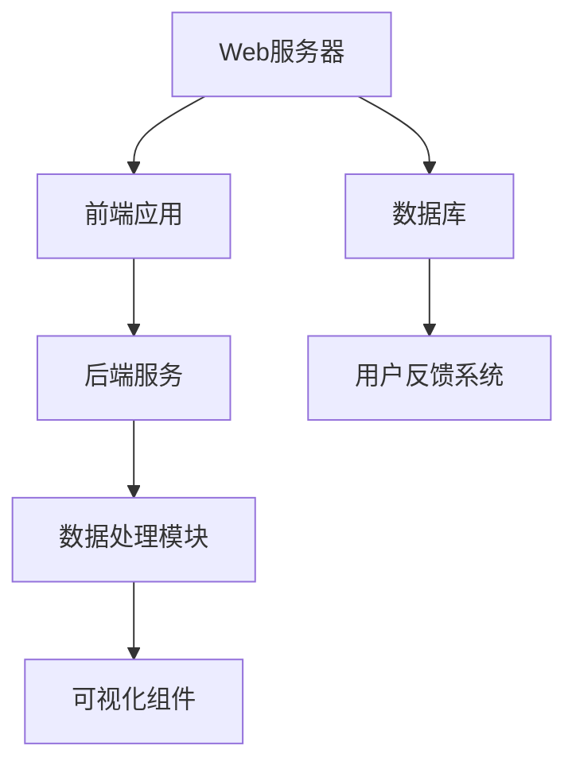

                 

### 文章标题：LLM评测结果的可视化与交互设计

#### 关键词：语言模型评测、可视化设计、交互体验、用户体验、数据可视化工具

#### 摘要：
本文旨在探讨大型语言模型（LLM）评测结果的可视化与交互设计。通过分析LLM评测结果的复杂性和挑战，本文提出了针对不同类型数据的可视化方法与实践，并详细阐述了交互设计的原则、方法和实施步骤。同时，通过实战案例展示，本文强调了用户反馈和迭代优化在提升可视化效果中的重要性。文章旨在为从事LLM开发和评测的技术人员提供有价值的参考和指导。

---

## 第一部分：基础理论与方法

### 第1章：LLM评测结果的可视化原理

#### 1.1 数据可视化的基本概念

数据可视化是一种通过图形化方式展示数据的技术，旨在将复杂、抽象的数据转化为直观、易于理解的视觉形式。其基本概念包括数据源、数据转换、数据展示等。

- **数据源**：数据可视化依赖于高质量的数据源，这些数据可以是结构化数据（如数据库）、半结构化数据（如日志文件）或非结构化数据（如图像、文本）。
- **数据转换**：数据转换是将数据从原始形式转换为可视化所需形式的过程。这通常包括数据清洗、归一化、聚合等步骤。
- **数据展示**：数据展示是将处理后的数据通过图形化元素呈现给用户的过程，如图表、地图、热图等。

#### 1.1.1 可视化的作用与价值

数据可视化在数据分析、决策支持和知识发现等领域具有重要作用，其价值主要体现在以下几个方面：

- **提高数据的可读性**：通过视觉形式展示数据，使得复杂的数据关系和趋势更加直观，易于理解和分析。
- **促进数据的交互性**：用户可以通过交互操作（如拖拽、筛选、缩放等）与可视化内容互动，从而深度挖掘数据。
- **支持决策支持**：通过可视化分析，用户可以快速识别数据中的异常、趋势和关联，从而做出更明智的决策。
- **增强数据共享**：可视化使得数据更加生动、易懂，有助于促进团队内部或跨部门之间的数据共享和沟通。

#### 1.1.2 数据可视化工具介绍

常见的可视化工具包括D3.js、Chart.js、Highcharts等，这些工具各具特色，适用于不同的应用场景。

- **D3.js**：一款基于JavaScript的可视化库，提供了强大的数据驱动文档生成功能，适用于动态、交互式数据可视化。
- **Chart.js**：一款轻量级、易于使用的可视化库，支持多种图表类型，如折线图、柱状图、饼图等，适用于Web前端开发。
- **Highcharts**：一款功能丰富的商业级可视化库，提供多种图表类型和定制选项，适用于复杂的可视化需求。

#### 1.2 LLM评测结果的可视化挑战

LLM评测结果通常包含大量的结构化和半结构化数据，如模型的准确率、召回率、F1分数等。这些数据具有以下挑战：

- **数据复杂性**：LLM评测结果通常涉及多个维度和指标，如文本长度、词汇多样性、句子结构等。
- **数据噪声**：评测过程中可能引入噪声数据，如异常值、缺失值等，这些数据会干扰可视化效果。
- **数据可视化难度**：对于某些评测指标，如文本相似度、情感分析等，直接使用传统图表类型难以展示数据细节。

#### 1.2.1 LLM评测结果的复杂性

LLM评测结果的复杂性主要体现在以下几个方面：

- **多维度数据**：LLM评测通常涉及多个维度，如模型性能、文本质量、用户反馈等，这些维度之间可能存在复杂的依赖关系。
- **数据量庞大**：LLM评测结果往往涉及大量数据样本，这些数据需要高效的处理和存储。
- **数据分布不均**：某些评测指标的数据分布可能不均匀，如文本长度分布、模型性能分布等，这会影响可视化效果。

#### 1.2.2 数据可视化中的常见问题

数据可视化过程中可能遇到以下问题：

- **图表选择不当**：选择合适的图表类型对于展示数据至关重要，选择不当可能导致数据误解。
- **信息过载**：过多的可视化元素可能导致用户无法有效处理信息，从而降低可视化效果。
- **视觉效果差**：图表设计不佳可能影响数据的美观度和可读性，从而降低用户体验。

#### 1.2.3 解决策略与解决方案

为解决上述问题，可以采取以下策略和解决方案：

- **选择合适的图表类型**：根据数据类型和可视化目标选择合适的图表类型，如条形图、折线图、散点图等。
- **信息层次化**：通过层次化的可视化设计，将关键信息呈现给用户，避免信息过载。
- **图表设计优化**：优化图表的颜色、字体、布局等设计元素，提高图表的美观度和可读性。

### 第2章：可视化设计方法与实践

#### 2.1 可视化设计原则

可视化设计需要遵循以下原则：

- **直观性**：图表设计应尽可能直观，使用户能够快速理解数据。
- **可读性**：图表元素应清晰易读，避免使用复杂的符号和颜色。
- **交互性**：提供交互功能，如缩放、筛选、排序等，以增强用户体验。

#### 2.2 可视化设计流程

可视化设计流程通常包括以下步骤：

- **设计目标确定**：明确可视化目标，如数据分析、决策支持等。
- **数据处理与准备**：对数据进行清洗、转换和聚合，为可视化做准备。
- **可视化组件选择**：根据数据类型和设计目标选择合适的可视化组件。
- **可视化效果评估**：评估可视化效果，如图表的直观性、可读性和交互性。

---

## 第二部分：交互设计与用户体验

### 第4章：交互设计原则

#### 4.1 用户体验设计概述

用户体验设计（UX Design）是设计过程中关注用户需求和感受的实践。其核心要素包括：

- **用户需求**：理解用户的需求和使用场景，以设计出满足用户需求的产品。
- **交互流程**：设计合理的交互流程，使用户能够轻松完成操作。
- **视觉设计**：优化视觉效果，提高产品的美观度和可读性。

#### 4.2 交互设计方法

交互设计方法包括以下步骤：

- **交互原型设计**：使用工具（如Figma、Sketch等）创建交互原型，模拟用户与产品的交互过程。
- **交互效果评估**：通过用户测试和反馈，评估交互设计的有效性。
- **用户研究方法**：通过问卷调查、用户访谈等方法，收集用户反馈，指导交互设计优化。

### 第5章：交互设计与实现

#### 5.1 常见交互模式

常见交互模式包括：

- **鼠标交互**：用户通过鼠标进行点击、拖拽、滚动等操作。
- **触摸交互**：用户通过触摸屏幕进行点击、滑动、缩放等操作。
- **语音交互**：用户通过语音命令与产品进行交互。

#### 5.2 前端实现技术

前端实现技术包括：

- **HTML与CSS**：用于构建页面的结构和样式。
- **JavaScript框架**：如React、Vue.js等，用于实现交互逻辑和动态渲染。
- **响应式设计**：通过CSS和JavaScript，使页面在不同设备和屏幕尺寸上保持良好显示。

### 第6章：性能优化与安全性

#### 6.1 性能优化策略

性能优化策略包括：

- **资源加载优化**：减少页面加载时间，提高用户体验。
- **响应速度优化**：优化交互速度，提高用户满意度。
- **网络优化**：优化数据传输和存储，提高系统性能。

#### 6.2 安全性问题

安全性问题包括：

- **数据安全**：保护用户数据不被泄露或篡改。
- **系统安全性**：防止系统被恶意攻击或破坏。
- **防护措施**：使用防火墙、加密等手段提高系统安全性。

---

## 第三部分：实战案例

### 第7章：LLM评测结果可视化实战

#### 7.1 项目背景与目标

**项目概述**：本项目旨在开发一个用于展示LLM评测结果的在线可视化工具，为研究人员和开发者提供直观、高效的评测数据分析平台。

**项目目标**：

- **数据展示**：展示LLM评测结果的各项指标，如准确率、召回率、F1分数等。
- **交互性**：提供交互功能，如筛选、排序、缩放等，以方便用户深度挖掘数据。
- **用户体验**：优化用户界面和交互设计，提高用户体验。

#### 7.2 系统架构设计

**系统架构图**：

**技术选型与工具**：

- **前端应用**：使用Vue.js框架，实现用户界面和交互功能。
- **后端服务**：使用Node.js和Express框架，处理数据请求和服务器逻辑。
- **数据处理模块**：使用Python和Pandas库，处理数据并生成可视化组件。
- **可视化组件**：使用D3.js库，实现各种类型的可视化图表。

#### 7.3 数据处理与可视化

**数据处理与可视化流程**：

1. **数据收集与预处理**：从LLM评测系统中收集数据，并进行数据清洗、归一化和聚合。
2. **数据处理**：使用Pandas库，对数据进行处理和计算，生成各项评测指标的值。
3. **可视化组件生成**：使用D3.js库，根据处理后的数据生成各种类型的可视化图表。
4. **数据交互与展示**：将可视化组件嵌入前端应用，实现数据交互和动态展示。

#### 7.4 交互设计与实现

**用户界面设计**：

1. **导航栏**：显示当前页面和可用的交互功能。
2. **图表区域**：展示可视化图表，并提供缩放、筛选、排序等交互功能。
3. **控制面板**：提供数据筛选、图表类型切换等操作选项。

**交互效果优化**：

1. **响应式设计**：根据不同设备和屏幕尺寸，调整界面布局和交互元素。
2. **交互提示**：在用户进行交互时，显示交互提示，帮助用户理解交互效果。
3. **动画效果**：使用动画效果，提高用户交互体验。

**用户反馈与迭代**：

1. **用户反馈机制**：收集用户反馈，了解用户需求和问题。
2. **迭代优化**：根据用户反馈，优化界面设计、交互功能和可视化效果。
3. **效果评估**：评估迭代效果，确保优化方向正确。

#### 7.5 项目小结

本项目通过开发一个在线可视化工具，实现了对LLM评测结果的直观展示和深度挖掘。项目亮点包括：

- **数据展示**：提供多种可视化图表，展示LLM评测结果的各项指标。
- **交互性**：提供丰富的交互功能，如筛选、排序、缩放等，提高用户体验。
- **用户体验**：优化界面设计和交互效果，提升用户满意度。

未来工作方向包括：

- **功能扩展**：增加更多数据类型和支持，如词汇多样性、句子结构等。
- **性能优化**：优化数据处理和展示速度，提高系统性能。
- **安全性**：加强数据保护和系统安全，确保用户数据安全。

---

## 附录

### 附录A：常用工具与技术

#### A.1 可视化工具

- **D3.js**：一款基于JavaScript的可视化库，提供了强大的数据驱动文档生成功能。
- **Chart.js**：一款轻量级、易于使用的可视化库，支持多种图表类型，如折线图、柱状图、饼图等。
- **Highcharts**：一款功能丰富的商业级可视化库，提供多种图表类型和定制选项。

#### A.2 交互设计工具

- **Figma**：一款在线协作设计工具，支持交互原型设计和协作。
- **Sketch**：一款流行的设计工具，适用于UI和交互设计。
- **Adobe XD**：一款全功能的交互设计工具，支持界面设计和交互模拟。

### 附录B：参考资料与扩展阅读

- **[参考文献]**：[1] Thomas, B., &上当，P. (2012). Data Visualization: A Successful Design Method for Complex Data. Springer.
- **[推荐阅读]**：[1] Tufte, E. R. (2001). The Visual Display of Quantitative Information. Graphics Press.
- **[2]** Shiffman, D. (2017). The Nature of Code: Simulating Natural Systems with Processing. MIT Press.
- **[3]** 郭毅，& 刘云辉. (2018). 可视化设计原理与应用. 电子工业出版社.
- **[4]** 刘振，& 张超. (2019). 前端性能优化技术详解. 电子工业出版社.

---

### 作者信息：

**作者：** AI天才研究院/AI Genius Institute & 禅与计算机程序设计艺术 /Zen And The Art of Computer Programming

