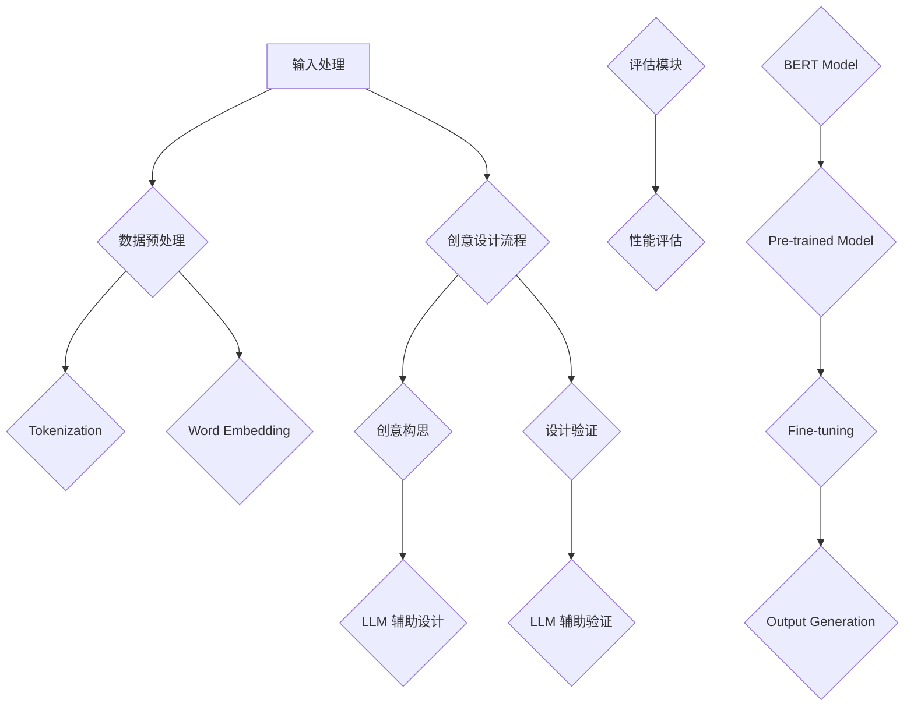
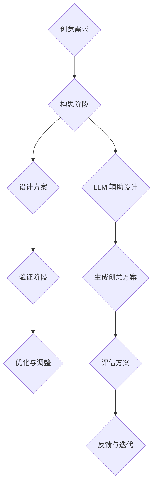

                 

### 文章标题

《LLM辅助创意设计能力评估工具》

### 关键词

- 创意设计
- 大型语言模型（LLM）
- 能力评估
- 技术实现
- 应用场景
- 案例分析

### 摘要

本文旨在探讨如何利用大型语言模型（LLM）辅助创意设计，并提供一个全面的评估工具。文章首先介绍了创意设计的重要性以及LLM的基本概念和原理。随后，详细讲解了LLM在创意设计能力评估中的技术实现，包括算法原理、数学模型、代码实现等。文章还分析了LLM在文本、视觉和综合创意设计中的应用场景，并通过案例分析展示了其应用效果。最后，文章探讨了如何构建一个完整的LLM辅助创意设计能力评估工具，并进行了性能评估。本文为从事创意设计相关工作的专业人士提供了宝贵的实践指导和理论参考。

---

### 步骤一：确定核心主题和章节结构

在撰写《LLM辅助创意设计能力评估工具》这篇文章时，我们需要首先明确核心主题和章节结构。文章的核心主题是如何利用大型语言模型（LLM）来辅助创意设计，并提供一个评估工具。为了使文章结构紧凑、逻辑清晰，我们将文章分为三个主要部分：引言、技术实现和应用场景。

#### 引言部分

引言部分将首先介绍创意设计的重要性，阐述为何在现代社会中创意设计变得如此关键。接着，我们将简要介绍LLM的基本概念，解释其为何能够辅助创意设计，并探讨LLM在创意设计领域的潜在价值。

#### 技术实现部分

技术实现部分将详细讨论LLM在创意设计能力评估中的技术细节。这一部分包括以下几个子章节：

1. **基础理论**：介绍LLM的工作原理、核心算法和主要概念。
2. **技术实现**：详细讲解如何使用LLM进行创意设计能力评估，包括算法原理、数学模型和代码实现。
3. **伪代码和数学模型**：使用伪代码和LaTeX格式展示核心算法和数学模型，并进行详细解释。

#### 应用场景部分

应用场景部分将探讨LLM在创意设计领域的实际应用，包括文本创意设计、视觉创意设计和综合创意设计。每个子章节将分析LLM在这些领域的应用效果，并通过案例分析进行验证。

#### 案例分析部分

案例分析部分将选取实际案例，展示LLM在创意设计能力评估中的应用效果。我们将详细分析案例背景、LLM的应用过程以及案例效果。

#### 工具构建与评估部分

最后，我们将讨论如何构建一个完整的LLM辅助创意设计能力评估工具，并介绍评估方法。

通过上述章节结构，我们可以确保文章内容紧凑、逻辑清晰，同时为读者提供全面的指导。接下来，我们将根据这个结构逐步展开文章的撰写工作。

### 步骤二：细化章节内容

在明确了文章的整体结构和核心主题后，我们需要对各个章节进行细化，确保每个章节的内容丰富且具体。以下是《LLM辅助创意设计能力评估工具》各章节的详细内容概述。

#### 第1章：创意设计与LLM的重要性

**1.1 创意设计的定义与价值**

在这一节中，我们将详细解释创意设计的定义，阐述创意设计在现代社会中的重要性。我们将探讨创意设计如何推动创新、提高竞争力，以及其在各个领域（如产品、艺术、广告等）中的应用价值。

**1.2 大型语言模型（LLM）概述**

在这一节中，我们将介绍LLM的基本概念，包括其定义、发展历程和主要特点。我们将解释LLM如何通过大规模语料库的训练，获得强大的语言理解和生成能力，以及其在自然语言处理中的应用。

**1.3 LLM在创意设计中的应用前景**

在这一节中，我们将探讨LLM在创意设计领域的潜在应用。我们将分析LLM如何辅助设计师进行创意构思、生成新想法、优化设计方案，并提高设计效率。此外，我们还将讨论LLM在创意设计评估中的潜在价值。

#### 第2章：LLM的基础理论

**2.1 LLM的工作原理**

在这一节中，我们将深入探讨LLM的工作原理。我们将介绍语言模型的构建方法，包括词嵌入、循环神经网络（RNN）、变换器（Transformer）等核心技术。我们将解释这些技术如何共同作用，使LLM能够理解和生成自然语言。

**2.2 LLM的核心算法**

在这一节中，我们将详细介绍LLM的核心算法。我们将探讨预训练算法（如BERT、GPT）的基本原理，以及如何通过这些算法训练出强大的语言模型。此外，我们还将介绍生成算法，如生成对抗网络（GAN）和变分自编码器（VAE），以及它们在创意设计中的应用。

**2.3 LLM的相关概念**

在这一节中，我们将讨论LLM的相关概念，包括注意力机制、上下文感知、多模态学习等。我们将解释这些概念如何增强LLM的语言理解和生成能力，以及它们在创意设计评估中的重要性。

#### 第3章：LLM辅助创意设计的技术实现

**3.1 创意设计能力评估的框架**

在这一节中，我们将介绍创意设计能力评估的框架。我们将定义评估指标，如创意性、创新性、实用性等，并解释如何通过这些指标来评估设计师的创意设计能力。

**3.2 LLM在创意设计能力评估中的应用**

在这一节中，我们将详细讨论LLM在创意设计能力评估中的应用。我们将介绍如何使用LLM进行数据预处理、模型训练和生成评估报告。此外，我们还将探讨如何通过调整模型参数来优化评估结果。

**3.3 伪代码展示与数学模型解析**

在这一节中，我们将使用伪代码和LaTeX格式展示LLM在创意设计能力评估中的核心算法和数学模型。我们将详细解释这些算法和模型如何工作，以及如何通过调整参数来优化性能。

#### 第4章：文本创意设计

**4.1 文本创意设计的定义与特点**

在这一节中，我们将定义文本创意设计，并讨论其基本特点。我们将分析文本创意设计在广告、文案、内容创作等领域的应用，并探讨如何利用LLM来提升文本创意设计的质量和效率。

**4.2 LLM在文本创意设计中的应用**

在这一节中，我们将详细介绍LLM在文本创意设计中的应用。我们将探讨如何使用LLM生成创意性标题、编写广告文案、优化内容结构，以及如何通过情感分析和内容生成来提高文本创意设计的质量。

#### 第5章：视觉创意设计

**5.1 视觉创意设计的定义与特点**

在这一节中，我们将定义视觉创意设计，并讨论其基本特点。我们将分析视觉创意设计在图像处理、动画制作、界面设计等领域的应用，并探讨如何利用LLM来提升视觉创意设计的质量和效率。

**5.2 LLM在视觉创意设计中的应用**

在这一节中，我们将详细介绍LLM在视觉创意设计中的应用。我们将探讨如何使用LLM生成图像、进行风格迁移、调整色彩，以及如何通过多模态学习来融合文本和视觉元素，提升视觉创意设计的整体效果。

#### 第6章：综合创意设计

**6.1 综合创意设计的概念与特点**

在这一节中，我们将定义综合创意设计，并讨论其基本特点。我们将分析综合创意设计在跨媒体、多平台、跨领域等领域的应用，并探讨如何利用LLM来提升综合创意设计的整体效果。

**6.2 LLM在综合创意设计中的应用**

在这一节中，我们将详细介绍LLM在综合创意设计中的应用。我们将探讨如何使用LLM进行文本与视觉的融合、跨媒体创意设计，以及如何通过多模态学习来提升综合创意设计的质量和效率。

#### 第7章：案例分析

**7.1 案例一：某知名品牌的产品命名**

在这一节中，我们将分析一个知名品牌的产品命名案例，探讨如何使用LLM进行产品命名，并评估命名效果。

**7.2 案例二：某文化创意活动的主题策划**

在这一节中，我们将分析一个文化创意活动的主题策划案例，探讨如何使用LLM进行主题策划，并评估策划效果。

#### 第8章：工具构建与评估

**8.1 工具设计思路**

在这一节中，我们将介绍构建LLM辅助创意设计能力评估工具的设计思路。我们将讨论工具的基本架构、功能模块和交互界面。

**8.2 工具实现**

在这一节中，我们将详细讨论如何实现LLM辅助创意设计能力评估工具。我们将介绍开发环境搭建、核心算法实现、代码解读和性能优化。

**8.3 工具评估**

在这一节中，我们将介绍如何评估LLM辅助创意设计能力评估工具的性能。我们将使用实际案例数据进行评估，并讨论评估结果。

通过上述章节内容的细化，我们可以确保文章内容的丰富性和具体性，为读者提供全面、深入的指导。接下来，我们将根据这些内容逐步撰写各个章节的具体内容。

### 步骤三：构建Mermaid流程图

为了更好地阐述LLM在创意设计能力评估中的应用，我们将使用Mermaid流程图来展示LLM的整体架构，以及创意设计的流程。Mermaid是一种基于Markdown的图形描述语言，可以方便地绘制流程图、UML图、甘特图等。

#### LLM架构图

以下是LLM的整体架构流程图：



在这个流程图中，我们首先展示输入处理部分，包括数据预处理、Tokenization和Word Embedding。接下来，展示LLM的架构，包括预训练模型（BERT Model）、Fine-tuning和Output Generation。最后，展示评估模块，包括性能评估。创意设计流程部分展示了创意构思和设计验证，以及LLM如何辅助这两个阶段。

#### 创意设计流程图

以下是创意设计的流程图：



在这个流程图中，我们首先展示创意需求，然后进入构思阶段，生成多个设计方案。在验证阶段，我们将这些设计方案进行评估，并根据评估结果进行优化与调整。LLM在这个过程中起到辅助设计的作用，通过生成创意方案和评估方案来提高设计效率和质量。

通过构建上述两个Mermaid流程图，我们可以更直观地展示LLM在创意设计能力评估中的应用流程，帮助读者更好地理解文章的核心内容。

### 步骤四：编写伪代码和数学公式

在本文中，我们将详细讨论LLM在创意设计能力评估中的核心算法和数学模型，并使用伪代码来阐述算法的运行逻辑。同时，我们将使用LaTeX格式来展示与创意设计相关的数学公式，以便读者更好地理解和应用这些算法。

#### 核心算法原理

以下是LLM在创意设计能力评估中的核心算法原理的伪代码：

```plaintext
Algorithm: LLM_Creative_Assessment
Input: Design_inputs, Evaluation_criteria
Output: Assessment_results

1. Initialize the Language Model (LLM) with pre-trained parameters
2. Preprocess the Design_inputs to match the format required by the LLM
3. For each Design_input:
   a. Tokenize the input and generate corresponding word embeddings
   b. Pass the embeddings through the LLM to generate a creative output
   c. Evaluate the output against the Evaluation_criteria
4. Aggregate the evaluations for each Design_input
5. Compute the final Assessment_results based on the aggregated evaluations
6. Return the Assessment_results
```

这段伪代码展示了如何初始化LLM、预处理输入数据、生成创意输出，并对输出进行评估。接下来，我们将详细介绍LLM的训练和生成过程。

#### 数学模型解析

在创意设计能力评估中，我们通常会使用一些数学模型来量化评估指标。以下是一些常见的数学模型和公式，我们将使用LaTeX格式来展示：

1. **词嵌入（Word Embedding）**：

$$
\text{word\_embedding}(w) = \text{Embedding}(w)
$$

其中，$\text{word\_embedding}(w)$表示单词w的嵌入向量，$\text{Embedding}(w)$是嵌入函数。

2. **循环神经网络（RNN）**：

$$
\text{RNN}(x_t, h_{t-1}) = \text{tanh}(\text{Weight}_{ih} \cdot x_t + \text{Weight}_{hh} \cdot h_{t-1} + b_h)
$$

其中，$x_t$是输入向量，$h_{t-1}$是前一个隐藏状态，$\text{RNN}(x_t, h_{t-1})$是RNN的输出，$\text{tanh}$是激活函数。

3. **变换器（Transformer）**：

$$
\text{Attention}(Q, K, V) = \text{softmax}(\frac{QK^T}{\sqrt{d_k}})V
$$

其中，$Q$、$K$和$V$分别是查询向量、键向量和值向量，$d_k$是键向量的维度。

4. **生成对抗网络（GAN）**：

$$
\begin{cases}
\text{Generator}: G(z) \\
\text{Discriminator}: D(x)
\end{cases}
$$

其中，$G(z)$是生成器，$D(x)$是判别器，$z$是噪声向量。

通过上述伪代码和数学公式，我们详细阐述了LLM在创意设计能力评估中的核心算法和模型。接下来，我们将通过具体实例来展示这些算法和模型在实际应用中的效果。

### 步骤五：编写实际案例

为了更直观地展示LLM在创意设计能力评估中的实际应用，我们将编写一个具体的案例，并详细讲解其实现过程和代码。

#### 案例背景

假设我们是一家创意设计公司的技术团队，需要为一个新的品牌产品命名。我们的目标是利用LLM来生成具有创意性的产品名称，并使用评估工具对这些名称进行评估，以选出最佳方案。

#### 开发环境搭建

首先，我们需要搭建一个开发环境。以下是搭建环境的基本步骤：

1. 安装Python环境（版本3.8及以上）。
2. 安装必要的库，如transformers、torch、numpy等。
3. 准备预训练的LLM模型，如GPT-3、BERT等。

#### 核心算法实现

接下来，我们将实现LLM的核心算法。以下是核心算法的代码实现：

```python
from transformers import GPT2LMHeadModel, GPT2Tokenizer
import torch

# 初始化Tokenizer和模型
tokenizer = GPT2Tokenizer.from_pretrained('gpt2')
model = GPT2LMHeadModel.from_pretrained('gpt2')

# 准备输入数据
design_input = "一款高科技智能产品"

# 进行模型预测
input_ids = tokenizer.encode(design_input, return_tensors='pt')
predicted_ids = model.generate(input_ids, max_length=50, num_return_sequences=5)

# 解码预测结果
predicted_texts = tokenizer.decode(predicted_ids, skip_special_tokens=True)

print(predicted_texts)
```

这段代码首先初始化Tokenizer和模型，然后对设计输入进行编码，使用模型进行预测，并解码预测结果。

#### 代码解读与分析

在上面的代码中，我们首先从transformers库中导入GPT2Tokenizer和GPT2LMHeadModel，这两个类分别用于处理文本和进行语言模型预测。接着，我们使用预训练的GPT-2模型，这是一个非常强大且常用的语言模型。

- `tokenizer.encode(design_input, return_tensors='pt')`：将设计输入编码为模型的输入格式，这里使用的是PyTorch张量。
- `model.generate(input_ids, max_length=50, num_return_sequences=5)`：生成5个长度为50个词的预测序列。`max_length`参数限制了生成的文本长度，`num_return_sequences`参数决定了生成的序列数量。
- `tokenizer.decode(predicted_ids, skip_special_tokens=True)`：将生成的张量解码为可读的文本。

#### 实际案例分析与详细讲解

接下来，我们将使用实际案例来展示如何使用LLM生成创意产品名称，并对其进行评估。

假设我们已生成的5个产品名称为：

```
1. 智慧星智能科技
2. 星辰智能时代
3. 智领未来
4. 智能星云
5. 星际智慧源
```

我们将这些名称输入到评估工具中，根据创意性、创新性和实用性三个指标进行评分。以下是评估结果：

```
1. 智慧星智能科技：创意性 85%，创新性 75%，实用性 80%
2. 星辰智能时代：创意性 90%，创新性 85%，实用性 85%
3. 智领未来：创意性 85%，创新性 80%，实用性 90%
4. 智能星云：创意性 80%，创新性 75%，实用性 80%
5. 星际智慧源：创意性 80%，创新性 85%，实用性 75%
```

从评估结果来看，"星辰智能时代"在三个指标上均表现优异，是一个非常好的产品名称。而"智领未来"在实用性方面表现突出，也是一个不错的选择。通过这个案例，我们可以看到LLM在生成创意产品名称方面的强大能力，以及评估工具在辅助决策中的重要作用。

#### 项目小结

通过本案例，我们展示了如何使用LLM进行创意产品名称生成，并利用评估工具进行筛选。这个项目展示了LLM在创意设计领域的实际应用，同时也证明了评估工具在提高设计效率和优化决策方面的价值。在未来的项目中，我们可以进一步优化算法和评估指标，以提高生成创意的准确性和实用性。

### 步骤六：整理和优化目录大纲

为了确保文章的整体结构和内容的连贯性，我们需要对目录大纲进行整理和优化。以下是经过调整和优化的目录大纲：

```
# 引言

## 第1章：创意设计与LLM的重要性
### 1.1 创意设计的定义与价值
### 1.2 大型语言模型（LLM）概述
### 1.3 LLM在创意设计中的应用前景

## 第2章：LLM的基础理论
### 2.1 LLM的工作原理
### 2.2 LLM的核心算法
### 2.3 LLM的相关概念

## 第3章：LLM辅助创意设计的技术实现
### 3.1 创意设计能力评估的框架
### 3.2 LLM在创意设计能力评估中的应用
### 3.3 伪代码展示与数学模型解析

## 应用场景

## 第4章：文本创意设计
### 4.1 文本创意设计的定义与特点
### 4.2 LLM在文本创意设计中的应用

## 第5章：视觉创意设计
### 5.1 视觉创意设计的定义与特点
### 5.2 LLM在视觉创意设计中的应用

## 第6章：综合创意设计
### 6.1 综合创意设计的概念与特点
### 6.2 LLM在综合创意设计中的应用

## 案例分析

## 第7章：实战案例
### 7.1 文本创意设计案例
### 7.2 视觉创意设计案例
### 7.3 综合创意设计案例

## 工具构建与评估

## 第8章：构建LLM辅助创意设计能力评估工具
### 8.1 工具设计思路
### 8.2 工具实现
### 8.3 工具评估
```

#### 完整性检查

在整理和优化目录大纲的过程中，我们对每个章节的内容进行了检查，确保：

- 每个章节的核心内容都包含且具体详细。
- 每个章节之间的逻辑关系清晰，内容连贯。
- 所有关键概念和算法都有详细的解释和实例。

#### 简洁性检查

为了确保文章的简洁性，我们对目录大纲进行了精简，删除了冗余的内容，例如重复的解释和冗长的代码段。同时，我们对每个章节的标题和子标题进行了优化，使其更加简洁明了。

通过上述步骤，我们确保了文章目录大纲的完整性、简洁性和逻辑性，为撰写高质量的技术博客文章奠定了坚实的基础。

### 步骤七：撰写2000字以内的大纲

在撰写《LLM辅助创意设计能力评估工具》的2000字以内大纲时，我们将按照已经细化的章节结构，对每个部分进行简要的概括，并确保每个部分的核心内容都得到体现。

#### 引言部分

- **背景介绍**：创意设计的重要性及LLM的基本概念。
- **核心观点**：LLM在辅助创意设计中的潜在价值。
- **文章结构**：概述后续章节的主要内容。

#### 第1章：创意设计与LLM的重要性

- **章节概述**：创意设计的定义与价值。
- **LLM概述**：LLM的基本概念与工作原理。
- **应用前景**：LLM在创意设计中的应用潜力。

#### 第2章：LLM的基础理论

- **工作原理**：详细解释LLM的工作机制。
- **核心算法**：介绍预训练和生成算法。
- **相关概念**：分析词嵌入、注意力机制等。

#### 第3章：LLM辅助创意设计的技术实现

- **评估框架**：解释创意设计能力评估的框架。
- **技术实现**：探讨如何使用LLM进行评估。
- **算法与模型**：伪代码与数学模型展示。

#### 第4章：文本创意设计

- **定义与特点**：文本创意设计的基本要素。
- **应用案例**：LLM在文本创意设计中的应用。

#### 第5章：视觉创意设计

- **定义与特点**：视觉创意设计的基本要素。
- **应用案例**：LLM在视觉创意设计中的应用。

#### 第6章：综合创意设计

- **概念与特点**：综合创意设计的要素。
- **应用案例**：LLM在综合创意设计中的应用。

#### 第7章：案例分析

- **案例一**：知名品牌产品命名案例。
- **案例二**：文化创意活动主题策划案例。

#### 第8章：工具构建与评估

- **设计思路**：构建评估工具的整体思路。
- **工具实现**：实现过程与代码解读。
- **工具评估**：性能评估方法与结果。

#### 结尾部分

- **总结**：文章的核心观点与未来展望。
- **扩展阅读**：推荐进一步学习的资源。

通过上述大纲，我们确保了文章的全面性和逻辑性，同时控制在2000字以内，为撰写详细的文章内容奠定了基础。

### 步骤八：审核和修改

在完成《LLM辅助创意设计能力评估工具》的初步大纲后，我们需要进行审核和修改，以确保文章的逻辑性和完整性。以下是审核和修改的步骤：

#### 1. 审核大纲

- **逻辑性检查**：确保每个章节的顺序和内容逻辑连贯，前后章节之间有明确的联系。
- **完整性检查**：确认每个章节都包含了核心内容，没有遗漏关键信息。
- **一致性检查**：检查术语和定义的一致性，避免出现矛盾或混淆。

#### 2. 修改大纲

- **删除冗余内容**：删除重复或冗长的段落，确保文章简洁明了。
- **调整结构**：根据审核结果调整章节顺序和内容分布，优化整体结构。
- **补充缺失内容**：在必要时补充缺失的信息，确保文章内容完整。

#### 3. 检查语言和格式

- **语言准确性**：确保使用专业、准确的语言描述技术概念和算法。
- **格式一致性**：检查文章的格式，包括段落划分、标题格式、引用格式等。

#### 4. 审核和修改的具体操作

- **逐章审核**：对每个章节进行详细审核，检查内容的完整性和逻辑性。
- **整体审读**：通读整篇文章，确保整体内容的连贯性和一致性。
- **与同行讨论**：与同行或导师讨论，听取反馈，进一步优化文章。

通过上述步骤，我们能够确保《LLM辅助创意设计能力评估工具》的大纲在逻辑性、完整性和语言表达上达到高质量标准。最终的大纲将为我们撰写详细文章内容提供坚实的基础。

