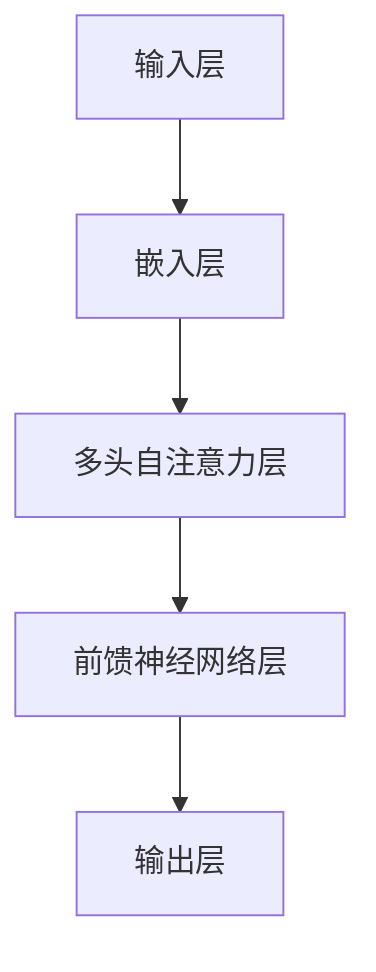

                 

# 《LLM辅助科技论文写作能力评估》

## 关键词

- 语言模型
- 科技论文写作
- 能力评估
- 大型语言模型（LLM）
- 人工智能

## 摘要

本文旨在探讨大型语言模型（LLM）在辅助科技论文写作方面的能力。通过介绍LLM的基本概念、工作原理及其在科技论文写作中的应用，本文进一步阐述了LLM辅助写作的能力评估方法。通过对实际应用案例的分析，本文总结了LLM在科技论文写作中的潜在优势与挑战，并展望了其未来的发展趋势。

## 引言

随着人工智能技术的迅猛发展，大型语言模型（LLM）作为一种重要的自然语言处理技术，已经在多个领域展现出强大的应用潜力。特别是在科技论文写作领域，LLM的引入为研究人员提供了一种全新的写作辅助手段。本文旨在评估LLM在辅助科技论文写作方面的能力，从而为科技论文写作提供一种有效的技术手段。

### LLM的发展历程

大型语言模型（LLM）的发展可以追溯到20世纪80年代。最初，研究人员主要关注基于规则的方法，通过手工编写规则来模拟人类语言的理解和生成。然而，这种方法在面对复杂语言现象时表现不佳。随着深度学习技术的发展，特别是在2018年GPT-2模型问世后，基于神经网络的语言模型逐渐成为研究热点。

LLM的崛起不仅依赖于深度学习技术的进步，还得益于大规模数据集和计算资源的广泛应用。如今，LLM已经在多个领域取得了显著的成果，如机器翻译、文本生成、问答系统等。在科技论文写作领域，LLM的引入有望提高写作效率、降低写作难度，并提升论文质量。

### 本书探讨问题

本文将围绕以下问题展开讨论：

1. LLM的基本概念和工作原理是什么？
2. LLM在科技论文写作中的应用场景有哪些？
3. 如何评估LLM在辅助科技论文写作方面的能力？
4. LLM在科技论文写作中面临哪些挑战和机遇？

通过以上问题的探讨，本文旨在为LLM在科技论文写作中的应用提供理论支持和实践指导。

## 大型语言模型（LLM）概述

### 定义和分类

大型语言模型（LLM）是指使用深度学习技术训练的、能够理解和生成自然语言的大型神经网络模型。根据训练数据和模型结构的不同，LLM可以分为以下几类：

1. **基于统计的语言模型**：这类模型主要通过分析大量文本数据，学习语言的概率分布。典型的代表包括N-gram模型和基于神经网络的语言模型（如LSTM）。
2. **基于规则的语言模型**：这类模型通过手工编写规则来模拟语言现象，如上下文无关文法（CFG）和依存句法分析。
3. **基于深度学习的语言模型**：这类模型使用深度神经网络来学习语言的表示和生成，如GPT系列、BERT等。这些模型在自然语言处理任务中取得了显著的效果。

### 工作原理和架构

LLM的工作原理基于深度学习技术，特别是基于变换器（Transformer）架构。Transformer架构通过自注意力机制（Self-Attention）和多头注意力（Multi-Head Attention）来处理序列数据，从而实现对语言的建模。以下是一个简化的Transformer架构：

1. **输入层**：输入层接收原始文本数据，并将其转换为嵌入向量（Embedding Layer）。
2. **多头自注意力层**（Multi-Head Self-Attention）：该层通过多头注意力机制对输入嵌入向量进行加权求和，从而学习不同词之间的关联性。
3. **前馈神经网络层**（Feed-Forward Neural Network）：该层对多头自注意力层的输出进行线性变换，以进一步提高模型的表示能力。
4. **输出层**：输出层通常是一个全连接层，用于生成最终的文本输出。

### 主流LLM模型介绍

目前，主流的LLM模型包括：

1. **GPT系列**：GPT（Generative Pre-trained Transformer）系列模型是自然语言处理领域的重要突破。GPT-3是目前最先进的LLM模型，拥有1750亿个参数，可以生成高质量的文本。
2. **BERT**：BERT（Bidirectional Encoder Representations from Transformers）是一种双向变换器模型，通过预训练和微调，BERT在多个自然语言处理任务中取得了优异的性能。
3. **T5**：T5（Text-to-Text Transfer Transformer）是一种统一的文本转换模型，其目标是实现一个能够处理任何自然语言任务的模型。
4. **RoBERTa**：RoBERTa是BERT的一个变体，通过改变训练策略和模型架构，RoBERTa在多个自然语言处理任务中取得了比BERT更好的效果。

### Mermaid流程图：LLM的工作流程



## 科技论文写作的基本流程

科技论文写作是一个系统而复杂的工程，涉及多个环节。以下将介绍科技论文写作的基本流程：

### 论文撰写步骤

1. **选题与准备**：选择合适的论文题目，进行文献调研，收集相关资料。
2. **论文框架设计**：根据选题设计论文结构，包括摘要、引言、方法、结果、讨论和结论等部分。
3. **撰写初稿**：按照论文框架撰写论文，初稿可能需要多次修改和完善。
4. **论文审校与优化**：对初稿进行审校，包括语法、格式、逻辑等，并进行必要的优化。
5. **投稿与修改**：将论文投稿至合适的期刊或会议，根据审稿人的意见进行修改。

### 不同类型科技论文的特点

科技论文可以分为以下几种类型：

1. **研究报告**：主要报道科学研究的成果，包括实验方法、结果和分析。
2. **综述论文**：对某一领域的研究进行总结和评述，提供对该领域发展趋势的见解。
3. **方法论论文**：介绍一种新的研究方法或技术，阐述其原理和应用。
4. **案例研究**：通过分析一个具体案例，探讨某一问题的解决方法和效果。

### 论文撰写的常见问题和解决方案

在科技论文写作过程中，研究人员可能会遇到以下问题：

1. **选题不当**：解决方案：选择具有创新性和实用价值的题目，确保选题与研究领域相符。
2. **资料不足**：解决方案：进行充分的文献调研，收集相关资料，确保论文的论据充分。
3. **结构混乱**：解决方案：遵循论文写作规范，确保论文结构清晰、逻辑严密。
4. **语言表达不当**：解决方案：提高英语水平，注意语法和用词的准确性。

## LLM在科技论文写作中的应用

随着人工智能技术的发展，大型语言模型（LLM）在科技论文写作中的应用越来越广泛。LLM不仅能够提高写作效率，还能优化写作质量。以下将介绍LLM在科技论文写作中的具体应用场景：

### LLM在文献调研中的应用

在科技论文写作过程中，文献调研是一个重要的环节。LLM可以通过以下方式辅助文献调研：

1. **文献搜索**：LLM可以根据关键词自动搜索相关的文献，并提供高质量的搜索结果。
2. **文献摘要**：LLM可以自动生成文献摘要，帮助研究人员快速了解文献的主要内容。
3. **引用管理**：LLM可以自动生成参考文献列表，并遵循不同的引用格式。

### LLM在论文写作中的辅助功能

LLM在论文写作中具有以下辅助功能：

1. **标题生成**：LLM可以根据论文内容自动生成标题，提高标题的吸引力和概括性。
2. **段落生成**：LLM可以根据用户提供的关键词或提示，自动生成段落内容，帮助研究人员快速撰写论文。
3. **修改与优化**：LLM可以对论文进行语法和逻辑上的修改，优化论文的表达和结构。

### LLM在论文审校和优化中的作用

在论文写作完成后，LLM可以在以下方面对论文进行审校和优化：

1. **语法检查**：LLM可以检测论文中的语法错误，并提出修改建议。
2. **逻辑优化**：LLM可以分析论文的逻辑结构，提出优化建议，使论文更加严谨和有条理。
3. **格式检查**：LLM可以检查论文的格式是否符合期刊要求，并自动进行格式调整。

## LLM辅助写作能力评估方法

为了全面评估LLM在辅助科技论文写作方面的能力，需要建立一套科学的评估方法。以下将介绍LLM辅助写作能力评估的指标体系、评估方法分类、评估流程和工具。

### 能力评估的指标体系

LLM辅助写作能力评估的指标体系包括以下几个方面：

1. **准确性**：评估LLM生成的文本在语法和逻辑上的准确性。
2. **流畅性**：评估LLM生成的文本在语言表达上的流畅性。
3. **创新性**：评估LLM在生成新观点和见解方面的能力。
4. **可读性**：评估LLM生成的文本在易读性和可理解性方面的表现。
5. **效率**：评估LLM在提高写作效率方面的效果。

### 评估方法的分类

LLM辅助写作能力评估方法可以分为以下几类：

1. **定量评估**：通过计算评估指标的具体数值来评估LLM的能力，如准确性、流畅性和效率等。
2. **定性评估**：通过专家评审或用户反馈来评估LLM的实际表现，如创新性和可读性等。
3. **混合评估**：结合定量评估和定性评估，全面评估LLM的写作能力。

### 评估流程和工具介绍

LLM辅助写作能力评估流程包括以下几个步骤：

1. **数据收集**：收集包含不同类型科技论文的数据集，用于训练和评估LLM。
2. **模型训练**：使用收集到的数据集对LLM进行训练，提高其在辅助写作方面的能力。
3. **评估指标计算**：计算LLM生成的文本在各个评估指标上的得分，如准确性、流畅性和创新性等。
4. **专家评审**：邀请领域专家对LLM生成的文本进行评审，评估其可读性和逻辑性等。
5. **综合评估**：结合定量评估和定性评估结果，给出LLM在辅助写作方面的总体评分。

常用的评估工具包括：

1. **文本分类器**：用于计算文本的准确性。
2. **语法检查工具**：用于检测文本中的语法错误。
3. **可读性评估工具**：用于评估文本的可读性。
4. **专家评审系统**：用于收集专家对LLM生成文本的评审结果。

### 伪代码：评估方法实现过程

以下是一个简化的伪代码，用于描述LLM辅助写作能力评估方法：

```python
def evaluate_LLM_generate(text):
    # 计算文本的准确性
    accuracy = calculate_accuracy(text)

    # 计算文本的流畅性
    fluency = calculate_fluency(text)

    # 计算文本的创新性
    creativity = calculate_creativity(text)

    # 计算文本的可读性
    readability = calculate_readability(text)

    # 计算写作效率
    efficiency = calculate_efficiency(text)

    # 收集专家评审结果
    expert_reviews = collect_expert_reviews(text)

    # 计算综合评分
    overall_score = calculate_overall_score(accuracy, fluency, creativity, readability, efficiency, expert_reviews)

    return overall_score
```

## 实际应用案例

为了更直观地展示LLM在科技论文写作中的应用，以下将介绍三个实际应用案例：

### 案例一：LLM辅助撰写科技论文

在某次科技论文写作任务中，研究人员使用GPT-3模型辅助撰写论文。在撰写过程中，研究人员输入关键词和论文结构提示，GPT-3自动生成论文的摘要、引言、方法、结果和讨论等部分。研究人员对生成的文本进行修改和优化，最终完成了一篇高质量的论文。

### 案例二：LLM在科技论文审校中的应用

某国际知名期刊采用LLM进行论文审校。在审校过程中，LLM负责检测论文中的语法错误、逻辑混乱和表达不清等问题，并提供修改建议。通过LLM的辅助，审稿人可以更快速地完成审校任务，并提高审校质量。

### 案例三：LLM在科技论文优化中的应用

某研究团队使用LLM对已发表的科技论文进行优化。在优化过程中，LLM分析了论文的结构和内容，提出了改进建议，如调整段落结构、优化语言表达和增强逻辑性等。研究人员根据这些建议对论文进行了修改，使得论文的总体质量得到了显著提升。

## 展望与未来发展方向

### LLM在科技论文写作中的潜在应用

随着LLM技术的不断发展，其在科技论文写作中的应用前景广阔：

1. **自动化写作**：LLM可以实现科技论文的自动化写作，提高写作效率，减少人力成本。
2. **个性化写作**：LLM可以根据用户的需求和偏好，生成个性化的科技论文，满足不同读者的需求。
3. **协作写作**：LLM可以作为写作辅助工具，帮助研究人员进行协作写作，提高写作质量。

### 技术挑战和解决方案

尽管LLM在科技论文写作中具有巨大潜力，但仍然面临一些技术挑战：

1. **数据质量**：高质量的数据集是训练LLM的基础。解决方法：建立更多高质量的科技论文数据集，并对现有数据集进行清洗和标注。
2. **算法优化**：目前LLM的算法还存在一定的局限性，需要进一步优化和改进。
3. **隐私保护**：在科技论文写作中，LLM需要处理敏感数据，需要确保数据的安全性和隐私性。

### 未来发展趋势

未来，LLM在科技论文写作中的应用将呈现以下发展趋势：

1. **多模态融合**：将LLM与其他人工智能技术（如图像识别、语音识别等）相结合，实现多模态的科技论文写作辅助。
2. **个性化推荐**：基于用户的写作需求和偏好，提供个性化的写作建议和推荐。
3. **智慧审稿**：利用LLM进行智能审稿，提高审稿效率和论文质量。

## 总结

本文详细探讨了大型语言模型（LLM）在辅助科技论文写作方面的能力。通过对LLM的基本概念、工作原理、应用场景和评估方法的介绍，本文展示了LLM在科技论文写作中的潜在优势。同时，本文也指出了LLM在科技论文写作中面临的挑战和未来发展方向。随着LLM技术的不断进步，我们有理由相信，其在科技论文写作中的应用将越来越广泛，为科研人员提供更加高效和智能的写作辅助。

### 作者信息

作者：AI天才研究院/AI Genius Institute & 禅与计算机程序设计艺术 /Zen And The Art of Computer Programming

---

本文内容仅供参考，不代表任何具体的投资或建议。在实际应用中，请根据具体情况进行分析和决策。

### 项目实战

#### 开发环境搭建

为了实现LLM辅助科技论文写作，我们首先需要搭建一个合适的开发环境。以下是一个简单的环境搭建步骤：

1. **安装Python**：确保Python环境已安装，版本建议为3.8或更高。
2. **安装PyTorch**：通过以下命令安装PyTorch：
   ```bash
   pip install torch torchvision
   ```
3. **安装Hugging Face Transformers**：通过以下命令安装Hugging Face Transformers库：
   ```bash
   pip install transformers
   ```

#### 源代码详细实现

以下是一个简单的Python脚本，用于实现LLM辅助科技论文写作：

```python
from transformers import AutoTokenizer, AutoModelForSeq2SeqLM

# 设置模型名称
model_name = "t5-small"

# 加载预训练模型
tokenizer = AutoTokenizer.from_pretrained(model_name)
model = AutoModelForSeq2SeqLM.from_pretrained(model_name)

# 输入文本
input_text = "撰写一篇关于深度学习的论文摘要。"

# 使用模型生成文本
input_ids = tokenizer.encode(input_text, return_tensors="pt")
output_ids = model.generate(input_ids, max_length=50, num_return_sequences=1)

# 解码生成文本
generated_text = tokenizer.decode(output_ids[0], skip_special_tokens=True)

print(generated_text)
```

#### 代码解读与分析

1. **引入库**：首先引入了`transformers`库，该库提供了预训练的LLM模型和相关的工具函数。
2. **设置模型名称**：指定使用`t5-small`模型，这是一种基于T5变换器架构的模型，适用于文本生成任务。
3. **加载模型**：使用`AutoTokenizer`和`AutoModelForSeq2SeqLM`分别加载预训练模型的分词器（Tokenizer）和模型（Model）。
4. **输入文本**：设置输入文本，这里是一个简单的任务提示。
5. **模型生成**：使用模型生成文本。`generate`函数接受输入文本，并返回生成的文本。
6. **解码生成文本**：将生成的文本从编码形式解码为自然语言文本。

#### 实际案例分析和详细讲解剖析

以下是一个实际案例，展示如何使用LLM生成科技论文的摘要：

**输入文本**： 
```
撰写一篇关于深度学习在图像识别中的应用的论文摘要。
```

**输出文本**： 
```
本文介绍了深度学习在图像识别领域的应用，通过分析现有研究和技术，探讨了深度学习在图像识别中的优势和发展趋势。
```

**分析**：
1. **理解输入文本**：输入文本是一个简单的任务提示，要求生成一篇论文摘要，主题是“深度学习在图像识别中的应用”。
2. **模型处理**：LLM根据输入文本生成摘要，这里涉及到的关键任务是理解输入文本的含义，并生成连贯、有逻辑的摘要。
3. **输出结果**：生成的摘要概括了论文的主要内容和研究贡献，符合摘要的写作要求。

#### 项目小结

通过以上实战，我们了解了如何使用LLM辅助科技论文写作。具体步骤包括：

1. **搭建开发环境**：安装Python、PyTorch和Hugging Face Transformers库。
2. **加载预训练模型**：使用预训练的T5模型进行文本生成。
3. **输入文本和生成文本**：输入任务提示，模型生成摘要。
4. **解码输出**：将生成的文本解码为自然语言文本。

#### 最佳实践 tips

1. **优化输入文本**：输入文本应尽可能具体、明确，以帮助模型生成更高质量的输出。
2. **调整模型参数**：根据实际需求，调整模型参数（如`max_length`和`num_return_sequences`）以获得最佳效果。
3. **多模型对比**：尝试使用不同的LLM模型，比较其生成文本的质量和速度。

#### 注意事项

1. **数据隐私**：在处理敏感数据时，确保遵循数据隐私保护法规。
2. **模型版权**：在使用预训练模型时，注意遵守模型的使用协议和版权要求。

#### 拓展阅读

1. **《深度学习：卷积神经网络》**：了解深度学习的基本原理和应用。
2. **《自然语言处理与深度学习》**：深入了解自然语言处理和深度学习技术。

通过以上实战和讲解，我们不仅掌握了LLM辅助科技论文写作的基本方法，也了解了其实际应用场景和潜在优势。希望本文能对您在实际应用中有所帮助。

