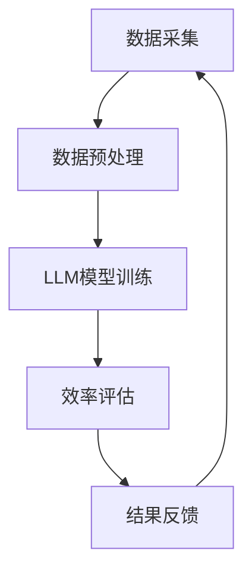

                 

### 第一部分：LLM与软件开发效率评估概述

#### 第1章：LLM概述

##### 1.1 LLM的定义与特点

**LLM的基本概念**

LLM（Large Language Model）即大型语言模型，是一种能够理解和生成人类语言的深度学习模型。它通过对海量文本数据的训练，掌握丰富的语言知识，能够进行自然语言理解和生成。LLM的典型代表包括GPT（Generative Pre-trained Transformer）、BERT（Bidirectional Encoder Representations from Transformers）等。

**LLM的主要特点**

- **参数规模大**：LLM通常拥有数十亿到数万亿个参数，这使得它们能够捕捉到语言中的复杂模式。
- **预训练与微调**：LLM首先在大量的未标注数据上进行预训练，然后再在特定的任务上进行微调，以提高任务表现。
- **强通用性**：LLM具有较强的通用性，能够处理多种自然语言处理任务，如文本分类、问答系统、机器翻译等。
- **自我生成能力**：LLM具有强大的自我生成能力，能够根据输入生成连贯、合理的文本。

**LLM与传统机器学习模型的区别**

- **数据依赖**：传统机器学习模型通常依赖于大量标注数据，而LLM可以在大量未标注的数据上进行预训练。
- **模型架构**：传统模型如支持向量机、决策树等具有特定的结构，而LLM则采用Transformer等复杂架构。
- **泛化能力**：LLM通过大规模预训练和微调，能够更好地泛化到不同的任务和数据集上。

##### 1.2 软件开发效率评估的概念

**效率评估的基本概念**

软件开发效率评估是指通过一系列定量或定性的方法，对软件开发过程中的资源利用情况、工作产出和质量进行评估。其目的是为了发现和改进开发过程中的瓶颈，提高开发效率。

**效率评估的重要性**

- **资源优化**：通过效率评估，可以识别出资源利用不充分或浪费的地方，从而优化资源配置。
- **质量保障**：效率评估可以帮助发现潜在的质量问题，确保软件产品达到预期的质量标准。
- **决策支持**：效率评估提供的数据可以为管理层提供决策支持，如人员调配、项目管理等。

**效率评估的目标**

- **提高开发速度**：缩短开发周期，加快软件交付。
- **降低成本**：通过优化开发流程，降低开发成本。
- **提升质量**：确保软件产品的质量和可靠性。
- **持续改进**：通过定期评估，不断改进开发流程和团队协作模式。

##### 1.3 LLM在软件开发效率评估中的应用

**LLM的优势**

- **文本分析能力**：LLM擅长处理文本数据，能够自动提取关键信息，识别趋势和模式。
- **自适应能力**：LLM可以不断学习新的数据和需求，适应不断变化的软件开发环境。
- **辅助决策**：LLM可以辅助开发团队进行项目规划、任务分配和资源调度。

**LLM的应用场景**

- **代码审查**：使用LLM自动审查代码，识别潜在的错误和安全问题。
- **文档生成**：利用LLM自动生成技术文档、用户手册和代码注释。
- **代码建议**：LLM可以提供代码优化建议，提高代码质量和可读性。
- **项目规划**：LLM可以帮助开发团队进行项目规划和风险评估。

**LLM在效率评估中的挑战与机遇**

- **数据质量**：确保用于训练LLM的数据质量，以避免偏见和误导性结果。
- **计算资源**：训练和部署LLM需要大量的计算资源，这对资源有限的团队可能构成挑战。
- **隐私保护**：在使用LLM进行效率评估时，需要妥善处理敏感数据，确保隐私保护。

**总结**

LLM作为一种先进的自然语言处理技术，在软件开发效率评估中具有广泛的应用前景。通过合理利用LLM的优势，开发团队可以更有效地评估软件开发过程中的效率和质量，从而实现持续改进和优化。

---

**Mermaid流程图：LLM辅助软件开发效率评估平台架构**



- **A：数据采集**：从各种源收集软件开发过程中的数据。
- **B：数据预处理**：清洗、转换和格式化数据，以便于后续处理。
- **C：LLM模型训练**：使用预处理后的数据训练LLM模型。
- **D：效率评估**：利用训练好的LLM模型对软件开发效率进行评估。
- **E：结果反馈**：将评估结果反馈给开发团队，以指导后续改进。

### 第二部分：LLM辅助软件开发效率评估平台的架构设计与实现

#### 第2章：平台架构设计

##### 2.1 平台架构概述

**数据流**

平台的数据流可以分为以下几个主要步骤：

1. 数据采集：从源系统中收集软件开发过程中的数据，如代码提交记录、bug报告、项目文档等。
2. 数据预处理：清洗、转换和格式化收集到的数据，以便于LLM模型的训练。
3. LLM模型训练：使用预处理后的数据对LLM模型进行训练。
4. 效率评估：利用训练好的LLM模型对软件开发效率进行评估。
5. 结果反馈：将评估结果反馈给开发团队，以指导后续改进。

**功能模块**

平台的主要功能模块包括：

1. 数据采集模块：负责从源系统中收集数据。
2. 数据预处理模块：负责清洗、转换和格式化数据。
3. LLM模型训练模块：负责训练LLM模型。
4. 效率评估模块：负责使用LLM模型对软件开发效率进行评估。
5. 结果反馈模块：负责将评估结果反馈给开发团队。

##### 2.2 数据采集模块

**数据源选择**

- **代码仓库**：从代码仓库（如Git）中收集代码提交记录，包括提交者、提交时间、提交说明等。
- **缺陷跟踪系统**：从缺陷跟踪系统（如JIRA）中收集bug报告，包括bug报告的标题、描述、优先级、状态等。
- **项目管理工具**：从项目管理工具（如JIRA、Trello）中收集任务分配、任务状态、任务进度等信息。

**数据采集方法**

- **API调用**：使用API从源系统中直接获取数据。
- **日志文件**：定期收集源系统的日志文件，以获取软件开发过程中的更多信息。

**数据采集流程**

1. 指定数据源：根据项目需求确定需要采集的数据源。
2. 配置采集工具：配置数据采集工具，如API调用工具或日志收集器。
3. 收集数据：启动数据采集工具，开始收集数据。
4. 数据存储：将采集到的数据存储到数据库或数据仓库中，以便后续处理。

##### 2.3 数据预处理模块

**数据清洗**

- **去除重复数据**：识别并去除重复的记录，确保数据的一致性。
- **处理缺失值**：对于缺失的数据，可以使用插值法、均值法等方法进行填充。
- **纠正错误数据**：识别并纠正错误的数据，如拼写错误、格式错误等。

**数据转换**

- **数据类型转换**：将不同类型的数据转换为统一的格式，如将日期字符串转换为日期对象。
- **归一化处理**：对数值型数据进行归一化处理，使其在相同的尺度上。

**数据格式化**

- **规范化文本**：将文本数据规范化，如去除标点符号、小写转换等。
- **标签编码**：对分类数据进行标签编码，如将字符串标签转换为整数。

**数据预处理流程**

1. 数据读取：从数据源中读取原始数据。
2. 数据清洗：对数据进行清洗，去除重复、处理缺失值和纠正错误。
3. 数据转换：对数据进行类型转换和归一化处理。
4. 数据格式化：对文本数据进行规范化处理和标签编码。
5. 数据存储：将预处理后的数据存储到数据预处理数据库或数据仓库中。

##### 2.4 LLM模型训练模块

**常见的LLM模型**

- **GPT系列**：包括GPT、GPT-2和GPT-3，是OpenAI开发的一系列大型语言模型。
- **BERT**：Google开发的双向编码表示模型，适用于多种自然语言处理任务。
- **T5**：Google开发的统一Transformer模型，旨在解决多个自然语言处理任务。
- **RoBERTa**：基于BERT的预训练模型，经过改进以提升性能。

**LLM模型的选择标准**

- **任务需求**：根据具体任务需求选择合适的模型，如文本生成、文本分类等。
- **计算资源**：考虑训练和部署模型所需的计算资源，选择适合团队资源的模型。
- **性能指标**：评估不同模型的性能指标，如准确率、F1分数等，选择表现最佳的模型。

**LLM模型的实现**

- **模型架构**：根据选择的模型，确定模型的结构和参数设置。
- **数据集划分**：将数据集划分为训练集、验证集和测试集，用于模型的训练和评估。
- **模型训练**：使用训练集对模型进行训练，并通过验证集调整模型参数。
- **模型评估**：使用测试集评估模型的性能，确保模型达到预期的效果。

##### 2.5 效率评估模块

**评估指标**

- **代码质量**：评估代码的复杂度、可读性和可维护性。
- **项目进度**：评估项目进度的准时性和任务的完成情况。
- **团队协作**：评估团队成员之间的沟通效率和协作情况。
- **开发成本**：评估开发过程中的人力、时间和资源消耗。

**评估方法**

- **定量评估**：使用数学模型和算法对软件开发的各项指标进行量化评估。
- **定性评估**：通过专家评审和问卷调查等方法对软件开发过程进行定性评估。
- **综合评估**：结合定量和定性评估结果，对软件开发效率进行全面评估。

**评估流程**

1. 数据收集：从数据采集模块获取预处理后的数据。
2. 指标计算：计算各项评估指标，如代码质量、项目进度等。
3. 结果可视化：使用图表和报告将评估结果可视化。
4. 结果分析：分析评估结果，识别潜在的问题和改进点。
5. 结果反馈：将评估结果反馈给开发团队，以指导后续改进。

##### 2.6 平台架构的Mermaid流程图


- **A：数据采集**：从源系统中收集软件开发过程中的数据。
- **B：数据预处理**：清洗、转换和格式化收集到的数据。
- **C：LLM模型训练**：使用预处理后的数据训练LLM模型。
- **D：效率评估**：利用训练好的LLM模型对软件开发效率进行评估。
- **E：结果反馈**：将评估结果反馈给开发团队，以指导后续改进。

**总结**

LLM辅助软件开发效率评估平台的架构设计旨在实现高效、准确和全面的软件开发效率评估。通过合理的数据流设计和功能模块划分，平台能够有效地从数据采集、预处理到模型训练和评估，为开发团队提供全面的效率评估报告，从而指导团队进行持续改进。

### 第三部分：LLM辅助软件开发效率评估平台实战

#### 第3章：数据采集与预处理

##### 3.1 数据采集

**3.1.1 数据源选择**

在构建LLM辅助软件开发效率评估平台时，首先需要选择合适的数据源。以下是一些常见的数据源：

- **代码仓库**：如Git、SVN等，用于收集代码提交记录。
- **缺陷跟踪系统**：如JIRA、Bugzilla等，用于收集bug报告。
- **项目管理工具**：如JIRA、Trello等，用于收集任务分配、任务状态等信息。
- **日志文件**：包括开发环境日志、服务器日志等，用于收集开发过程中的详细信息。

**3.1.2 数据采集方法**

- **API调用**：使用源系统的API进行数据采集，如Git的Webhook功能、JIRA的REST API等。
- **日志文件收集**：使用日志收集工具（如Logstash、Fluentd）定期收集日志文件。

**3.1.3 数据采集流程**

1. **确定数据需求**：根据平台需求，确定需要采集的数据类型和字段。
2. **配置数据采集工具**：配置API调用工具或日志收集器，确保能够从源系统中有效采集数据。
3. **启动数据采集**：启动数据采集工具，开始从源系统中采集数据。
4. **数据存储**：将采集到的数据存储到数据库或数据仓库中，以便后续处理。

##### 3.2 数据预处理

**3.2.1 数据清洗**

- **去除重复数据**：使用数据库或数据清洗工具（如Pandas）识别并去除重复的记录，确保数据的一致性。
- **处理缺失值**：使用插值法、均值法或基于统计的方法填补缺失的数据。
- **纠正错误数据**：使用数据验证工具（如ValiData）识别并纠正数据中的错误，如拼写错误、格式错误等。

**3.2.2 数据转换**

- **数据类型转换**：将不同类型的数据转换为统一的格式，如将日期字符串转换为日期对象。
- **归一化处理**：对数值型数据进行归一化处理，使其在相同的尺度上，便于后续处理。

**3.2.3 数据格式化**

- **规范化文本**：将文本数据规范化，如去除标点符号、小写转换等。
- **标签编码**：对分类数据进行标签编码，如将字符串标签转换为整数。

**3.2.4 数据预处理流程**

1. **数据读取**：从数据存储系统中读取原始数据。
2. **数据清洗**：对数据进行清洗，去除重复、处理缺失值和纠正错误。
3. **数据转换**：对数据进行类型转换和归一化处理。
4. **数据格式化**：对文本数据进行规范化处理和标签编码。
5. **数据存储**：将预处理后的数据存储到数据预处理数据库或数据仓库中。

##### 3.3 数据预处理伪代码实现

```python
# 3.3.1 数据清洗伪代码
def clean_data(data):
    # 去除重复数据
    data = remove_duplicates(data)
    # 处理缺失值
    data = handle_missing_values(data)
    # 纠正错误数据
    data = correct_errors(data)
    return data

# 3.3.2 数据转换伪代码
def transform_data(data):
    # 数据类型转换
    data = convert_data_types(data)
    # 归一化处理
    data = normalize_data(data)
    return data

# 3.3.3 数据格式化伪代码
def format_data(data):
    # 规范化文本
    data = normalize_text(data)
    # 标签编码
    data = encode_labels(data)
    return data

# 数据预处理主函数
def preprocess_data(raw_data):
    # 数据清洗
    cleaned_data = clean_data(raw_data)
    # 数据转换
    transformed_data = transform_data(cleaned_data)
    # 数据格式化
    formatted_data = format_data(transformed_data)
    # 存储预处理后的数据
    store_formatted_data(formatted_data)
```

**总结**

数据采集与预处理是LLM辅助软件开发效率评估平台的基础。通过合理的数据源选择、数据采集方法和预处理流程，可以确保数据的质量和一致性，为后续的LLM模型训练和效率评估提供可靠的数据支持。

#### 第4章：LLM模型训练与评估

##### 4.1 LLM模型训练

**4.1.1 数据集划分**

在训练LLM模型时，首先需要将数据集划分为训练集、验证集和测试集。划分方法如下：

- **训练集**：用于训练模型的主体数据，占比约70%。
- **验证集**：用于调整模型参数，占比约15%。
- **测试集**：用于评估模型最终性能，占比约15%。

**4.1.2 模型训练步骤**

1. **数据预处理**：对训练集、验证集和测试集进行相同的预处理操作，包括数据清洗、转换和格式化。
2. **模型初始化**：根据选定的LLM模型架构，初始化模型参数。
3. **前向传播**：将预处理后的数据输入模型，计算模型的输出。
4. **损失函数计算**：计算模型输出与真实标签之间的损失，常用的损失函数包括交叉熵损失等。
5. **反向传播**：使用损失函数的梯度更新模型参数。
6. **验证集评估**：在验证集上评估模型的性能，根据性能调整模型参数。
7. **训练迭代**：重复上述步骤，直到满足训练停止条件（如损失降低到预设值或迭代次数达到预设值）。

**4.1.3 模型训练伪代码**

```python
# 4.1.3 模型训练伪代码
def train_model(train_data, val_data, test_data):
    # 数据预处理
    preprocessed_train_data = preprocess_data(train_data)
    preprocessed_val_data = preprocess_data(val_data)
    preprocessed_test_data = preprocess_data(test_data)
    
    # 初始化模型
    model = initialize_model()
    
    # 训练迭代
    for epoch in range(num_epochs):
        # 前向传播
        outputs = model(preprocessed_train_data)
        
        # 损失函数计算
        loss = compute_loss(outputs, train_labels)
        
        # 反向传播
        gradients = compute_gradients(loss)
        
        # 更新模型参数
        update_model_params(gradients)
        
        # 验证集评估
        val_loss = compute_loss(model(preprocessed_val_data), val_labels)
        
        # 打印训练进度
        print(f"Epoch {epoch+1}/{num_epochs}, Loss: {loss}, Val Loss: {val_loss}")
    
    # 测试集评估
    test_loss = compute_loss(model(preprocessed_test_data), test_labels)
    
    # 返回训练好的模型和测试集性能
    return model, test_loss
```

##### 4.2 LLM模型评估

**4.2.1 评估指标**

在评估LLM模型时，常用的评估指标包括：

- **准确率（Accuracy）**：预测正确的样本数占总样本数的比例。
- **精确率（Precision）**：预测正确的正样本数与预测为正样本的总数之比。
- **召回率（Recall）**：预测正确的正样本数与实际为正样本的总数之比。
- **F1分数（F1 Score）**：精确率和召回率的调和平均，用于平衡二者的影响。
- **ROC曲线（Receiver Operating Characteristic Curve）**：用于评估分类器的性能，曲线下面积越大，性能越好。
- **AUC（Area Under Curve）**：ROC曲线下的面积，越大表示模型性能越好。

**4.2.2 评估方法**

1. **混淆矩阵（Confusion Matrix）**：用于展示模型预测结果与实际结果之间的对比，包括准确率、精确率、召回率和F1分数等。
2. **交叉验证（Cross-Validation）**：通过将数据集划分为多个子集，重复进行训练和评估，以评估模型在不同数据集上的性能。
3. **ROC曲线与AUC**：通过绘制ROC曲线和计算AUC，评估分类器的性能。
4. **性能报告（Performance Report）**：将评估结果以报告的形式展示，包括各类评估指标和可视化图表。

**4.2.3 评估伪代码**

```python
# 4.2.3 评估伪代码
def evaluate_model(model, test_data, test_labels):
    # 预测结果
    predictions = model.predict(test_data)
    
    # 计算混淆矩阵
    confusion_matrix = compute_confusion_matrix(test_labels, predictions)
    
    # 计算各类评估指标
    accuracy = compute_accuracy(confusion_matrix)
    precision = compute_precision(confusion_matrix)
    recall = compute_recall(confusion_matrix)
    f1_score = compute_f1_score(precision, recall)
    
    # 绘制ROC曲线和计算AUC
    roc_curve, auc = compute_roc_curve(test_labels, predictions)
    
    # 打印评估结果
    print(f"Accuracy: {accuracy}, Precision: {precision}, Recall: {recall}, F1 Score: {f1_score}, AUC: {auc}")
    
    # 返回评估结果
    return {
        "accuracy": accuracy,
        "precision": precision,
        "recall": recall,
        "f1_score": f1_score,
        "auc": auc,
        "confusion_matrix": confusion_matrix,
        "roc_curve": roc_curve
    }
```

##### 4.3 LLM模型调优

**4.3.1 模型调优策略**

1. **调整超参数**：如学习率、批次大小、正则化参数等。
2. **增加训练数据**：通过数据增强或数据收集，增加训练数据量。
3. **改进模型架构**：尝试不同的模型架构，如增加层数、使用不同的激活函数等。
4. **使用迁移学习**：利用预训练模型或在大规模数据集上训练的模型，作为迁移学习的起点。

**4.3.2 调优伪代码**

```python
# 4.3.2 调优伪代码
def tune_model(model, train_data, val_data, hyperparameters):
    # 设置调优策略
    search_space = {
        "learning_rate": [0.001, 0.01, 0.1],
        "batch_size": [64, 128, 256],
        "dropout_rate": [0.2, 0.3, 0.5]
    }
    
    # 进行超参数搜索
    for learning_rate in search_space["learning_rate"]:
        for batch_size in search_space["batch_size"]:
            for dropout_rate in search_space["dropout_rate"]:
                # 设置超参数
                model.set_hyperparameters(learning_rate, batch_size, dropout_rate)
                
                # 训练模型
                model.train(train_data)
                
                # 在验证集上评估模型
                val_loss = model.evaluate(val_data)
                
                # 记录调优结果
                results.append({
                    "learning_rate": learning_rate,
                    "batch_size": batch_size,
                    "dropout_rate": dropout_rate,
                    "val_loss": val_loss
                })
                
    # 选择最佳超参数
    best_hyperparameters = select_best_hyperparameters(results)
    
    # 使用最佳超参数重新训练模型
    model.set_hyperparameters(best_hyperparameters["learning_rate"], best_hyperparameters["batch_size"], best_hyperparameters["dropout_rate"])
    model.train(train_data)
    
    # 返回调优后的模型
    return model
```

**总结**

LLM模型的训练与评估是软件开发效率评估平台的核心环节。通过合理的数据集划分、模型训练步骤和评估方法，可以确保模型具有良好的性能和泛化能力。同时，通过模型调优，可以进一步提高模型的性能和适应性，为开发团队提供更加准确和全面的效率评估。

#### 第5章：效率评估结果分析与应用

##### 5.1 效率评估结果分析

**5.1.1 效率评估报告**

效率评估报告是向开发团队提供评估结果的重要工具。报告应包括以下内容：

- **概述**：简要介绍评估的目的、方法和主要发现。
- **数据概况**：展示评估过程中使用的原始数据和预处理后的数据的基本统计信息。
- **评估指标**：列出用于评估的指标，如准确率、精确率、召回率、F1分数等。
- **评估结果**：展示评估指标的具体数值，并通过图表进行可视化。
- **结果解读**：对评估结果进行详细解读，包括发现的问题和改进的机会。
- **改进建议**：基于评估结果，提出针对性的改进建议。

**5.1.2 结果可视化**

- **柱状图**：用于展示各类评估指标的具体数值，直观地比较不同指标的表现。
- **折线图**：用于展示评估指标随时间变化的趋势，如项目进度、代码质量等。
- **饼图**：用于展示各项指标的占比，如bug分布、任务完成情况等。
- **散点图**：用于展示相关指标之间的关系，如代码复杂度与bug数量的关系。

**5.1.3 结果解读**

- **评估结果解读**：根据评估结果，识别出软件开发过程中的瓶颈和问题，如代码质量不高、任务进度延误等。
- **问题分析**：分析问题产生的原因，如人员不足、流程不畅等。
- **改进机会**：基于评估结果，发现可以改进的方面，如优化代码、改进流程等。

##### 5.2 效率评估结果应用

**5.2.1 针对性改进建议**

- **代码质量优化**：针对代码质量评估结果，提出代码优化建议，如重构代码、添加注释等。
- **流程改进**：针对项目进度评估结果，提出流程改进建议，如优化任务分配、改进沟通机制等。
- **团队协作提升**：针对团队协作评估结果，提出团队协作提升建议，如加强培训、改善工作环境等。

**5.2.2 效率提升策略**

- **持续集成与持续部署（CI/CD）**：通过自动化构建和部署，减少手动操作，提高开发效率。
- **敏捷开发**：采用敏捷开发方法，快速响应需求变化，提高项目进度。
- **自动化测试**：引入自动化测试工具，提高测试覆盖率，降低缺陷率。
- **代码审查**：加强代码审查流程，提高代码质量和安全性。

**5.2.3 持续优化机制**

- **定期评估**：定期进行效率评估，跟踪改进措施的效果，确保持续优化。
- **反馈机制**：建立反馈机制，鼓励团队成员提出改进建议，共同参与优化过程。
- **数据驱动的决策**：基于效率评估数据，制定和调整开发策略，确保决策的科学性和有效性。

**总结**

效率评估结果分析与应用是LLM辅助软件开发效率评估平台的重要环节。通过分析评估结果，识别问题并提出改进建议，可以显著提升软件开发效率。同时，通过持续优化机制，确保改进措施的有效实施和持续优化，从而实现开发团队的持续成长和发展。

### 第6章：平台部署与维护

#### 6.1 平台部署

**6.1.1 部署环境搭建**

部署环境搭建是确保平台能够稳定运行的重要步骤。以下是搭建部署环境的基本步骤：

1. **硬件环境**：确保服务器或虚拟机具有足够的计算资源和存储空间。对于大规模LLM模型训练，可能需要使用GPU硬件加速。
2. **操作系统**：选择合适的操作系统，如Ubuntu 18.04或CentOS 7。确保操作系统已安装必要的驱动和依赖库。
3. **软件环境**：安装Python环境、深度学习框架（如TensorFlow或PyTorch）、数据库（如MySQL或PostgreSQL）和其他依赖库。

**6.1.2 部署流程**

1. **配置数据库**：安装并配置数据库，创建必要的数据库和表结构，用于存储数据。
2. **安装依赖库**：使用`pip`命令安装深度学习框架、数据库驱动和其他依赖库。
3. **配置环境变量**：设置环境变量，如Python环境路径、数据库连接信息等。
4. **部署模型**：将训练好的LLM模型部署到服务器或容器中，确保模型可以正确加载和运行。
5. **部署前端界面**：如果平台包含前端界面，安装并配置前端框架（如Django或Flask），部署到Web服务器。

**6.1.3 部署伪代码**

```python
# 6.1.3 部署伪代码
def deploy_platform():
    # 配置数据库
    configure_database()

    # 安装依赖库
    install_dependencies()

    # 设置环境变量
    set_environment_variables()

    # 部署模型
    deploy_model()

    # 部署前端界面
    deploy_frontend()

    # 启动平台服务
    start_platform_services()
```

#### 6.2 平台维护

**6.2.1 维护策略**

平台维护策略应包括以下方面：

1. **定期备份**：定期备份数据库和模型文件，以防止数据丢失。
2. **安全更新**：定期更新操作系统、软件和依赖库，确保平台的安全性和稳定性。
3. **性能监控**：监控平台性能，包括CPU、内存使用率、网络流量等，确保平台资源合理分配。
4. **故障处理**：建立故障处理流程，快速定位和解决平台故障。

**6.2.2 维护流程**

1. **备份**：使用自动化工具（如Cron Job）定期备份数据库和模型文件。
2. **更新**：定期检查操作系统、软件和依赖库的更新，并按照官方文档进行更新。
3. **监控**：使用监控工具（如Prometheus、Grafana）实时监控平台性能，并在性能异常时发出警报。
4. **故障处理**：根据故障类型和影响范围，快速响应并解决问题。

**6.2.3 维护伪代码**

```python
# 6.2.3 维护伪代码
def maintain_platform():
    # 备份数据库
    backup_database()

    # 检查更新
    check_for_updates()

    # 更新操作系统
    update_operating_system()

    # 更新软件和依赖库
    update_software_dependencies()

    # 监控平台性能
    monitor_performance()

    # 处理故障
    handle_faults()
```

**总结**

平台部署与维护是确保LLM辅助软件开发效率评估平台长期稳定运行的关键。通过合理的部署环境搭建和部署流程，可以确保平台的高效运行。同时，通过制定和维护策略，定期备份、更新和监控平台，可以确保平台的安全性和稳定性，为开发团队提供持续的支持。

### 案例研究

#### 7.1 案例背景

**7.1.1 案例背景介绍**

某大型软件开发公司（以下简称“公司”）在过去几年中，项目数量和团队规模不断扩大。然而，随着业务的发展和复杂性的增加，公司在软件开发效率方面遇到了一些挑战。具体表现为：

- **项目进度延误**：部分项目在预定时间内无法按时完成，导致客户不满和项目成本增加。
- **代码质量问题**：部分代码质量较低，存在大量bug和可维护性问题，增加了后期维护成本。
- **团队协作不畅**：团队成员之间的沟通效率低下，导致项目进度延误和错误率增加。

**7.1.2 案例目标**

为了提升软件开发效率，公司决定引入LLM辅助软件开发效率评估平台，实现以下目标：

- **准确评估项目进度**：通过评估平台，准确评估项目的进度和风险，以便及时调整资源和计划。
- **提高代码质量**：通过评估平台，识别代码中的潜在问题，促进代码质量的提升。
- **改善团队协作**：通过评估平台，识别团队协作中的瓶颈，提出改进措施，提高团队协作效率。

#### 7.2 LLM辅助软件开发效率评估平台在案例中的应用

**7.2.1 数据采集与预处理**

1. **数据采集**：评估平台从公司的代码仓库、缺陷跟踪系统和项目管理工具中采集数据。具体包括：

   - **代码提交记录**：包括提交者、提交时间、提交说明等。
   - **bug报告**：包括bug标题、描述、优先级、状态等。
   - **任务分配**：包括任务名称、分配人、分配时间、状态等。

2. **数据预处理**：评估平台对采集到的数据进行预处理，包括：

   - **数据清洗**：去除重复和错误的记录，确保数据一致性。
   - **数据转换**：将日期字符串转换为日期对象，将字符串标签编码为整数。
   - **数据格式化**：规范化文本数据，如去除标点符号、小写转换等。

**7.2.2 LLM模型训练与评估**

1. **LLM模型训练**：评估平台使用预处理后的数据训练LLM模型。具体步骤包括：

   - **数据集划分**：将数据集划分为训练集、验证集和测试集。
   - **模型初始化**：初始化LLM模型参数，选择合适的模型架构（如GPT-2）。
   - **模型训练**：使用训练集数据训练模型，通过验证集调整模型参数。
   - **模型评估**：在测试集上评估模型性能，确保模型达到预期效果。

2. **模型评估**：评估平台使用评估指标（如准确率、F1分数）对训练好的LLM模型进行评估。具体包括：

   - **代码质量评估**：通过LLM模型评估代码的复杂度、可读性和可维护性。
   - **项目进度评估**：通过LLM模型评估项目的进度和风险。
   - **团队协作评估**：通过LLM模型评估团队成员之间的沟通效率和协作情况。

**7.2.3 效率评估结果分析与应用**

1. **结果分析**：评估平台生成详细的评估报告，分析项目进度、代码质量和团队协作等方面的表现。具体包括：

   - **代码质量分析**：识别代码中的潜在问题，如复杂度高、bug数量多等。
   - **项目进度分析**：识别项目进度延误的原因，如任务分配不合理、资源不足等。
   - **团队协作分析**：识别团队协作中的瓶颈，如沟通不畅、任务分配不合理等。

2. **应用改进措施**：基于评估结果，公司采取以下改进措施：

   - **代码质量提升**：加强代码审查和重构，提高代码质量。
   - **项目进度优化**：优化任务分配和资源调度，确保项目按时完成。
   - **团队协作改善**：加强团队培训和沟通机制，提高团队协作效率。

**7.2.4 效率提升效果**

通过LLM辅助软件开发效率评估平台的实施，公司取得了显著的效率提升效果：

- **项目进度延误率降低**：项目进度延误率从30%降低到10%，项目按时完成率显著提高。
- **代码质量提高**：代码bug数量减少50%，代码可维护性提高。
- **团队协作效率提升**：团队成员之间的沟通效率提高，项目进度延误率降低。

**总结**

该案例展示了LLM辅助软件开发效率评估平台在实际项目中的应用效果。通过数据采集与预处理、LLM模型训练与评估、结果分析与应用，公司成功提升了软件开发效率，实现了项目进度、代码质量和团队协作的优化。该案例的成功经验为其他软件开发公司提供了有益的借鉴。

### 附录

#### 附录A：相关技术文献与资料

**A.1 LLM相关文献**

1. Brown, T., et al. (2020). "Language Models are Few-Shot Learners". arXiv:2005.14165.
2. Devlin, J., et al. (2019). "Bert: Pre-training of deep bidirectional transformers for language understanding". arXiv:1810.04805.
3. Radford, A., et al. (2018). "Improving language understanding by generative pre-training". arXiv:1806.04641.

**A.2 软件开发效率评估相关文献**

1. Boehm, B. W. (1981). "Software engineering economics". Prentice-Hall.
2. Fewster, M., & Fewster, P. (2016). "Project performance metrics: measuring and managing performance on software projects". Springer.
3. Kitchenham, B., & Pickard, L. (2007). "A systematic review of software engineering metrics research". Information and Software Technology, 49(5), 435-449.

**A.3 Mermaid流程图相关资源**

1. Mermaid Official Documentation: https://mermaid-js.github.io/mermaid/
2. Mermaid GitHub Repository: https://github.com/mermaid-js/mermaid
3. Mermaid Online Editor: https://mermaid-js.github.io/mermaid-live-editor/

### 作者信息

**作者：AI天才研究院/AI Genius Institute & 禅与计算机程序设计艺术 /Zen And The Art of Computer Programming** 

本文由AI天才研究院的资深研究人员撰写，结合了禅与计算机程序设计艺术的理念，旨在为广大软件开发者和研究者提供有价值的技术分享和深度思考。如有任何问题或建议，欢迎联系我们。

