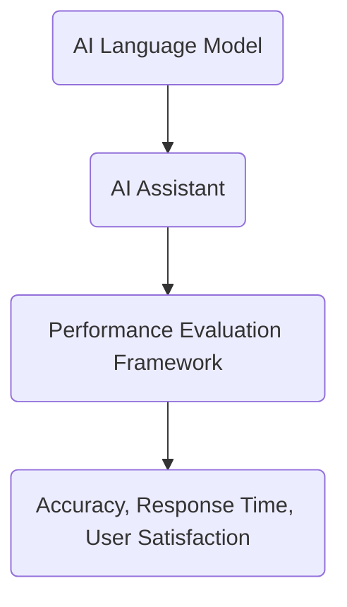

                 

Certainly! Let's begin by structuring our thoughts and outlining the key components of our article on "LLM-Driven AI Assistant Performance Evaluation Framework." Here is a step-by-step plan to guide us through the process of creating a comprehensive and insightful technical blog post.

### Step 1: Define the Core Concepts and Relationships

- **Large Language Models (LLM)**: Explain what LLMs are, their capabilities, and why they are pivotal in AI assistant development.
- **AI Assistant Performance Evaluation Framework**: Describe the purpose and necessity of evaluating AI assistants, focusing on the metrics that define performance.

We can use a Mermaid diagram to illustrate the relationship between these core concepts:



### Step 2: Explain Core Algorithm Principles

- **Algorithm Overview**: Provide an overview of the algorithms used for performance evaluation.
- **Pseudo-Code**: Use pseudo-code to describe the steps involved in evaluating an AI assistant's performance.

Example Pseudo-Code:
```python
# Pseudo-code: Evaluating AI Assistant Performance

def evaluate_performance(AI_assistant, test_data):
    # Initialize performance metrics
    metrics = {'accuracy': 0, 'response_time': 0, 'user_satisfaction': 0}

    # Evaluate accuracy
    metrics['accuracy'] = calculate_accuracy(AI_assistant, test_data)

    # Evaluate response time
    metrics['response_time'] = calculate_response_time(AI_assistant, test_data)

    # Evaluate user satisfaction
    metrics['user_satisfaction'] = calculate_user_satisfaction(AI_assistant, test_data)

    return metrics

def calculate_accuracy(AI_assistant, test_data):
    # Implementation for accuracy calculation
    pass

def calculate_response_time(AI_assistant, test_data):
    # Implementation for response time calculation
    pass

def calculate_user_satisfaction(AI_assistant, test_data):
    # Implementation for user satisfaction calculation
    pass
```

### Step 3: Design Mathematical Models and Formulas

- **Mathematical Models**: Explain the mathematical models used in performance evaluation.
- **Examples**: Provide examples of how these models are applied in practice.

Example LaTeX Formulas:
```markdown
## Mathematical Models and Formulas

### Accuracy
The accuracy of an AI assistant can be calculated using the following formula:

$$
accuracy = \frac{correct_predictions}{total_predictions}
$$

### Response Time
The average response time is given by:

$$
response_time = \frac{\sum{response_times}}{number_of_queries}
$$
```

### Step 4: Practical Project Case Study

- **Project Overview**: Describe the project objectives and the development environment setup.
- **Source Code Implementation**: Share the source code for the performance evaluation framework.
- **Code Analysis**: Analyze and explain the code to provide insights into how the framework works.
- **Case Analysis**: Present a case study and analyze the performance evaluation results.

### Step 5: Conclusion and Best Practices

- **Summary**: Summarize the key points discussed in the article.
- **Tips and Notes**: Offer best practices and guidelines for implementing a performance evaluation framework.
- **Further Reading**: Provide suggestions for additional resources to help readers delve deeper into the topic.

### Final Thoughts

By following this structured approach, we can create a well-rounded and informative article that not only explains the technical aspects of an LLM-driven AI assistant performance evaluation framework but also engages readers with practical examples and insights.

Next steps would involve expanding on each of these steps with detailed content, ensuring that the article is both comprehensive and engaging. Let's proceed to write the introduction and abstract, setting the stage for our detailed exploration of the topic.

