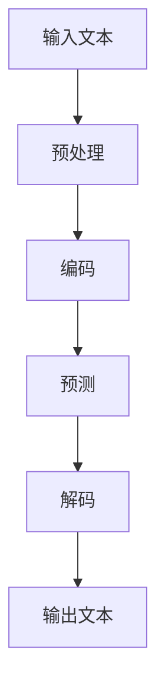
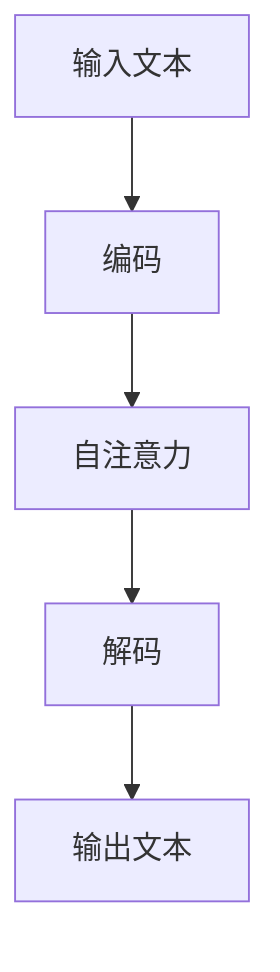

                 


### 文章标题: LLM驱动的prompt个性化学习助手

关键词：大型语言模型、prompt、个性化学习、AI教育、自然语言处理

> 摘要：本文深入探讨LLM（大型语言模型）驱动的prompt个性化学习助手的设计与实现，从基础概念、工作原理、实际应用等多个角度进行分析，旨在为读者提供一个全面的技术视角。文章将详细讲解LLM的数学模型和核心算法原理，分析prompt的类型和作用，并通过实际项目展示如何构建一个有效的prompt个性化学习系统。

### 目录大纲

第一部分: LLM基础与概念

#### 第1章: LLM概述

1.1 LLM的定义与分类

1.2 LLM的历史与发展

1.3 LLM的核心价值

#### 第2章: LLM的工作原理

2.1 LLM的核心算法原理

2.2 LLM的数学模型与数学公式

2.3 LLM的Mermaid流程图

第二部分: prompt个性化学习

#### 第3章: prompt概述

3.1 prompt的定义与作用

3.2 prompt的类型与特点

3.3 prompt在个性化学习中的应用

#### 第4章: LLM驱动的prompt个性化学习

4.1 LLM与prompt的融合原理

4.2 实现prompt个性化学习的步骤

4.3 prompt个性化学习的优缺点分析

#### 第5章: prompt个性化学习项目实战

5.1 项目背景与目标

5.2 项目开发环境搭建

5.3 源代码实现与解读

5.4 项目结果分析

第三部分: LLM与prompt资源与应用

#### 第6章: LLM与prompt工具与资源

6.1 主流LLM框架与工具

6.2 主流prompt设计与优化工具

6.3 LLM与prompt社区与资源

#### 第7章: LLM与prompt未来发展趋势

7.1 LLM技术的未来发展趋势

7.2 prompt个性化学习的未来前景

7.3 LLM与prompt在人工智能教育中的应用

### 第一部分: LLM基础与概念

#### 第1章: LLM概述

1.1 LLM的定义与分类

**背景介绍**

在自然语言处理（NLP）领域，大型语言模型（Large Language Model，简称LLM）已经成为研究的热点和应用的关键。LLM是一类能够理解和生成人类语言的高性能模型，其核心优势在于能够从海量数据中学习语言规律，并在此基础上实现复杂文本的生成、理解和交互。

**核心概念与联系**

LLM的核心概念包括生成式模型和解码式模型。生成式模型通过学习文本的生成过程，能够生成连贯且符合语言规则的文本；解码式模型则通过预测文本的下一个词或字符，逐步生成完整的文本。

**Mermaid流程图**

以下是LLM的基本流程图，展示从输入到输出的数据处理过程：



**LLM的分类**

LLM主要可以分为以下几类：

1. **生成式LLM**：此类模型通过学习文本的生成过程，能够直接生成连贯的文本。典型的模型包括GPT（Generative Pre-trained Transformer）系列。
2. **解码式LLM**：此类模型通过预测文本的下一个词或字符，逐步生成完整的文本。BERT（Bidirectional Encoder Representations from Transformers）是其典型代表。

**1.2 LLM的历史与发展**

LLM的发展可以追溯到20世纪80年代，当时的研究主要集中在基于规则的方法和统计方法。随着计算能力和数据量的提升，深度学习和自然语言处理技术在21世纪取得了飞速进展，推动了LLM的发展。以下是LLM发展的一些关键里程碑：

1. 2003年，Bengio等人提出了深度神经网络（DNN）在机器翻译中的应用。
2. 2013年，Mikolov等人提出了Word2Vec模型，为NLP领域引入了词向量表示。
3. 2017年，谷歌提出了Transformer模型，显著提升了NLP的性能。
4. 2018年，OpenAI推出了GPT-2，展示了生成式模型在文本生成中的强大能力。
5. 2020年，Turing奖授予了深度学习领域的三位先驱，其中包括Transformer模型的提出者。

**1.3 LLM的核心价值**

LLM在现代AI领域具有重要价值，主要体现在以下几个方面：

1. **提高文本生成质量**：LLM能够生成高质量、连贯的文本，广泛应用于自动写作、机器翻译等领域。
2. **促进自然语言处理技术的发展**：LLM的兴起推动了NLP技术的进步，使得复杂任务如问答系统、对话系统等得以实现。
3. **支持多语言处理和跨模态交互**：LLM能够处理多种语言，并实现文本与其他模态（如图像、音频）的交互，为跨模态AI研究提供了基础。

#### 第2章: LLM的工作原理

2.1 LLM的核心算法原理

**核心算法原理**

LLM的核心算法基于深度学习和变换器（Transformer）架构。Transformer模型引入了自注意力机制（Self-Attention），能够对输入文本的每个词进行加权处理，从而捕捉词与词之间的依赖关系。以下是一个简单的Transformer模型的工作流程：

1. **编码**：将输入文本转换为向量表示。
2. **自注意力**：计算每个词与其他词之间的依赖关系。
3. **解码**：生成输出文本的每个词。

**伪代码**

```python
def transformer(input_sequence):
    # 编码
    encoded_sequence = encode(input_sequence)

    # 自注意力
    attention_scores = calculate_self_attention(encoded_sequence)

    # 解码
    output_sequence = decode(attention_scores)

    return output_sequence
```

**数学模型与公式**

LLM的数学模型主要包括两个部分：自注意力机制和损失函数。

1. **自注意力机制**：自注意力机制通过计算输入文本的每个词与所有词之间的相似度，得到权重矩阵。具体公式如下：

   $$ 
   \text{Attention}(Q, K, V) = \text{softmax}\left(\frac{QK^T}{\sqrt{d_k}}\right)V 
   $$

   其中，Q、K、V分别为查询向量、键向量和值向量，d_k为键向量的维度。

2. **损失函数**：常用的损失函数包括交叉熵损失和对比损失。交叉熵损失用于衡量预测分布与真实分布之间的差异：

   $$ 
   \text{CrossEntropyLoss}(p, y) = -\sum_{i} y_i \log(p_i) 
   $$

   其中，p为预测分布，y为真实分布。

**Mermaid流程图**

以下是Transformer模型的基本流程图，展示从输入到输出的数据处理过程：



### 第二部分: prompt个性化学习

#### 第3章: prompt概述

**3.1 prompt的定义与作用**

**背景介绍**

在人工智能教育中，prompt（提示）是一种重要的交互方式，它通过向用户提供具体的指令或问题，引导用户进行学习和思考。prompt不仅能够帮助用户明确学习目标，还能够提高学习效率和体验。

**核心概念与联系**

prompt的定义可以理解为一种文本提示或指令，它通常包含以下要素：

- **学习目标**：明确用户需要学习的知识点或技能。
- **问题情境**：创建一个具体的问题背景，使学习目标更加具体和现实。
- **交互方式**：提供与用户交互的方式，如问答、填空、排序等。

**prompt的作用**

prompt在个性化学习中的应用主要体现在以下几个方面：

- **指导学习目标**：通过具体的prompt，用户可以清楚地了解当前需要学习的内容和目标。
- **提高学习效率**：有效的prompt可以帮助用户更快地掌握知识点，减少学习时间和精力。
- **增强学习体验**：个性化的prompt可以增加学习的趣味性和互动性，提高用户的参与度。

**3.2 prompt的类型与特点**

**传统prompt**

传统prompt通常是指简单的问题或指令，如单选题、填空题等。传统prompt的特点包括：

- **单一性**：通常只涉及一个具体的问题或知识点。
- **固定性**：prompt的内容和形式通常是固定的，缺乏灵活性。

**个性化prompt**

个性化prompt是一种根据用户特点和学习需求动态调整的提示。个性化prompt的特点包括：

- **动态调整**：根据用户的反馈和学习进度，动态调整prompt的内容和难度。
- **多样性**：支持多种交互方式，如问答、填空、排序等，以适应不同的学习需求。

**3.3 prompt在个性化学习中的应用**

**prompt在课程设计中的应用**

在课程设计中，prompt可以用于以下几个方面：

- **引导学习**：通过个性化的prompt，引导学生明确学习目标和路径。
- **评估学习**：通过设置针对性的prompt，评估学生对知识点的掌握程度。
- **互动教学**：利用prompt实现教师与学生的互动，提高教学效果。

**prompt在个性化学习中的应用案例**

- **自适应学习系统**：通过收集用户的学习数据和反馈，动态生成个性化的prompt，指导用户进行学习。
- **智能问答系统**：利用prompt进行问题引导，帮助用户解决实际问题。
- **个性化辅导**：根据学生的特点和学习需求，提供个性化的辅导方案。

### 第三部分: LLM与prompt资源与应用

#### 第6章: LLM与prompt工具与资源

**6.1 主流LLM框架与工具**

在LLM领域，主流框架和工具包括以下几种：

- **GPT系列**：由OpenAI开发的预训练语言模型，包括GPT-2、GPT-3等版本。
- **BERT**：由谷歌开发的基于Transformer的预训练语言模型。
- **T5**：由DeepMind开发的基于Transformer的文本到文本的预训练模型。
- **XLNet**：由百度开发的基于Transformer的预训练语言模型。

**6.2 主流prompt设计与优化工具**

在prompt设计和优化领域，常用的工具包括以下几种：

- **PROMPT**：一款开源的prompt工程工具，提供丰富的模板和设计指南。
- **PromptGenius**：一款基于AI的prompt生成工具，能够根据用户需求自动生成高质量的prompt。
- **PromptLab**：一款用于分析和优化prompt的工具，支持多种评估指标和优化策略。

**6.3 LLM与prompt社区与资源**

LLM和prompt领域的社区和资源包括：

- **Hugging Face**：一个开源社区，提供丰富的预训练模型和工具，包括LLaMA、OPT等。
- **Prompt Engineering**：一个专注于prompt设计和优化的博客，分享最新的研究成果和实践经验。
- **NLP Community**：一个涵盖自然语言处理各个领域的开源社区，提供丰富的教程和资源。

### 第四部分: LLM与prompt未来发展趋势

#### 第7章: LLM与prompt未来发展趋势

**7.1 LLM技术的未来发展趋势**

随着人工智能技术的不断发展，LLM技术将呈现以下发展趋势：

- **模型规模不断扩大**：随着计算能力的提升，LLM的模型规模将越来越大，能够处理更复杂的任务。
- **多模态处理能力增强**：LLM将逐渐具备处理多种模态数据的能力，如图像、音频等，实现更全面的跨模态交互。
- **自适应能力提升**：LLM将具备更强的自适应能力，能够根据用户的需求和反馈动态调整模型和行为。

**7.2 prompt个性化学习的未来前景**

prompt个性化学习将在未来人工智能教育中发挥重要作用，前景包括：

- **更广泛的应用场景**：prompt个性化学习将应用于更多领域，如在线教育、职业培训、医疗咨询等。
- **更高效的交互方式**：通过结合自然语言生成和交互技术，prompt个性化学习将实现更高效的互动和反馈。
- **更好的用户体验**：个性化的prompt将提高用户的学习兴趣和参与度，提升学习效果。

**7.3 LLM与prompt在人工智能教育中的应用**

LLM与prompt在人工智能教育中的应用前景广阔，包括：

- **个性化教学系统**：通过结合LLM和prompt技术，构建个性化教学系统，实现因材施教。
- **智能问答与辅导**：利用LLM和prompt技术，提供智能问答和辅导服务，帮助学生解决学习和生活中的问题。
- **在线教育平台**：将LLM和prompt应用于在线教育平台，提升课程设计和学习体验，提高教育质量。

通过以上分析，我们可以看到LLM驱动的prompt个性化学习助手在人工智能教育中的重要性和潜力。未来，随着技术的不断进步，LLM和prompt技术将在更多领域得到广泛应用，为人类带来更智能、更高效的学习体验。### 结论

综上所述，LLM驱动的prompt个性化学习助手在人工智能教育领域具有巨大的潜力和价值。通过结合大型语言模型和个性化的提示技术，我们可以实现更加高效、互动和个性化的学习体验。本文从LLM的基础概念、工作原理、prompt的概述和应用，到实际项目实战以及工具资源，全面剖析了这一主题。

首先，我们介绍了LLM的基本概念和分类，包括生成式LLM和解码式LLM，并回顾了LLM的发展历程和核心价值。接着，我们详细探讨了LLM的工作原理，包括核心算法原理、数学模型和Mermaid流程图，帮助读者深入理解LLM的内部工作机制。

在prompt个性化学习部分，我们阐述了prompt的定义、类型、作用，以及prompt在个性化学习中的应用。随后，我们通过实际项目实战展示了如何构建一个有效的prompt个性化学习系统，并对其进行了详细解读和分析。

最后，我们介绍了LLM和prompt的相关工具与资源，并探讨了未来发展趋势。这些内容不仅为读者提供了一个全面的技术视角，也为实际应用提供了参考。

在此，我们鼓励读者在实际应用中进一步探索LLM和prompt技术，不断优化和提升个性化学习系统的效果。同时，我们也期待看到更多创新的实践案例，共同推动人工智能教育的发展。

**最佳实践 tips：**

1. **数据质量**：在构建LLM驱动的个性化学习系统时，确保输入数据的质量和多样性，这对于提高模型的性能至关重要。
2. **用户体验**：设计简洁直观的用户界面，提升用户的使用体验，这对于促进用户参与和持续学习至关重要。
3. **反馈机制**：建立有效的用户反馈机制，及时收集用户反馈，并根据反馈调整prompt和模型，提高系统的适应性和有效性。

**注意事项：**

1. **隐私保护**：在处理用户数据时，务必遵守相关隐私保护法规，确保用户数据的隐私和安全。
2. **模型更新**：定期更新LLM模型，以适应最新的语言变化和技术进步。
3. **计算资源**：合理配置计算资源，确保系统在高并发情况下的稳定运行。

**拓展阅读：**

- 《深度学习》（Goodfellow, Bengio, Courville）：了解深度学习的基本原理和应用。
- 《自然语言处理综论》（Jurafsky, Martin）：深入了解自然语言处理的理论和实践。
- 《LLaMA：开源的巨量语言模型与实验》（Alec Radford et al.）：研究最新的LLM模型和实验。

通过这些资源和实践，读者可以进一步探索LLM驱动的prompt个性化学习助手的更多可能性，为人工智能教育的发展贡献自己的力量。

**作者信息：**

作者：AI天才研究院/AI Genius Institute & 禅与计算机程序设计艺术 /Zen And The Art of Computer Programming

