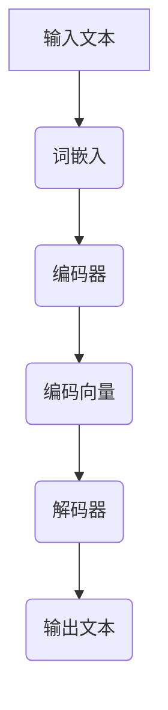

                 

### 文章标题：LLM驱动的prompt创意激发器

#### 关键词：LLM、prompt、创意激发、设计原则、应用案例、实战演练

##### 摘要：

本文旨在探讨如何利用大型语言模型（LLM）结合精心设计的prompt，激发创意。首先，我们将介绍LLM的基本原理和prompt的定义与功能。接着，深入探讨LLM在创意激发中的应用，并详细阐述prompt设计的原则。随后，我们将分析LLM在创意写作、设计灵感、商业策略和市场营销等领域的应用。最后，通过实战案例展示LLM驱动的prompt创意激发的实际效果，并提供相关的工具和资源，以及代码示例，便于读者进行学习和实践。

## 第1章：概述

### 1.1 LLM与prompt的概念

#### 1.1.1 LLM的基本原理

大型语言模型（LLM，Large Language Model）是人工智能领域的一种先进技术，它通过学习大量的文本数据，能够理解和生成自然语言。LLM的核心思想是通过深度神经网络，将输入的文本映射到输出的文本。这种映射关系通过大规模的训练数据集进行学习，从而实现对自然语言的深入理解和生成能力。

LLM的基本原理主要包括以下几个方面：

1. **词嵌入**：将词汇映射到高维向量空间，以便于计算机处理。这种映射关系使得词汇之间的相似性和相关性可以通过向量的距离和角度来表示。
2. **编码器与解码器**：编码器将输入文本编码成固定长度的向量表示，解码器则根据这些向量生成输出文本。编码器和解码器通常由多个层次组成，形成一个深度神经网络结构。
3. **注意力机制**：在处理长文本时，注意力机制可以帮助模型关注到输入文本中的关键部分，从而提高生成文本的质量和准确性。

#### 1.1.2 prompt的定义与功能

prompt（提示）是触发创意生成的重要工具。在计算机科学中，prompt通常是指为程序或系统提供的信息，用于引导其执行特定的任务。在创意激发领域，prompt的定义更为广泛，它不仅包括文字提示，还包括图像、声音等多种形式。

prompt的功能主要体现在以下几个方面：

1. **引导思路**：prompt可以帮助创意者明确思考方向，避免在毫无头绪的情况下浪费时间。
2. **激发灵感**：通过提供相关的信息或问题，prompt可以激发创意者产生新的想法和创意。
3. **优化输出**：prompt可以帮助创意者细化创意，使其更加具体和实用。

### 1.2 LLM在创意激发中的应用

创意是指创新的思维活动，它涉及从现有的信息或资源中产生新的、有价值的想法或解决方案。创意的分类包括艺术创意、技术创意、商业创意等，每一种创意都需要不同的方法和技巧。

LLM在创意激发中的应用主要体现在以下几个方面：

1. **文本生成**：LLM可以生成各种类型的文本，如故事、诗歌、广告文案等，为创意者提供丰富的素材和灵感。
2. **问答系统**：LLM可以回答各种问题，包括创意性的问题，帮助创意者解决困惑或提供新的思路。
3. **设计辅助**：LLM可以帮助创意者进行产品设计和概念验证，通过生成各种设计方案，帮助创意者找到最佳方案。

### 1.3 prompt设计的重要性

prompt设计是创意激发过程中的关键环节，它直接影响到创意的质量和效率。prompt设计的重要性主要体现在以下几个方面：

1. **明确目标**：一个好的prompt应该能够明确创意的目标，使创意者能够集中精力在关键问题上。
2. **提供信息**：prompt应该提供足够的信息，以激发创意者的灵感和想象力。
3. **引导提问**：prompt应该通过提问的方式，引导创意者深入思考，从而产生新的创意。
4. **鼓励创新**：prompt应该鼓励创意者突破常规思维，勇于尝试新的想法和解决方案。
5. **检查和反馈**：prompt设计应该包括对创意结果的检查和反馈机制，以确保创意的有效性和可行性。

在接下来的章节中，我们将进一步探讨LLM的组成部分、核心算法、训练与优化方法，以及prompt设计的原则和应用，帮助读者更好地理解和使用LLM驱动的prompt进行创意激发。

## 第2章: LLM基础

### 2.1 语言模型的组成

#### 2.1.1 词嵌入

词嵌入（Word Embedding）是将词汇映射到高维向量空间的过程。这一过程使得词汇之间的相似性和相关性可以通过向量的距离和角度来表示。词嵌入是语言模型的基础，它直接影响模型对自然语言的理解能力。

**词嵌入的常见方法**：

1. **基于统计的方法**：如Word2Vec、GloVe等，通过统计词汇在文本中的共现关系，将词汇映射到低维向量空间。
2. **基于神经网络的方法**：如词嵌入层（Embedding Layer）在深度学习模型中，通过神经网络学习词汇的高维向量表示。

**词嵌入的工作原理**：

1. **输入阶段**：输入文本被预处理为词汇序列，每个词汇被映射为一个向量。
2. **处理阶段**：神经网络处理这些向量，生成固定长度的向量表示。
3. **输出阶段**：处理后的向量用于后续的编码和解码过程。

**词嵌入的优缺点**：

- **优点**：使得计算机能够理解和处理自然语言，提高了语言模型的效果。
- **缺点**：存在一定程度的语义模糊性，难以准确表示词汇的复杂关系。

#### 2.1.2 编码器和解码器

编码器（Encoder）和解码器（Decoder）是语言模型的核心组成部分，它们分别负责输入文本的编码和输出文本的解码。编码器将输入文本编码为固定长度的向量表示，解码器则根据这些向量生成输出文本。

**编码器的工作原理**：

1. **输入阶段**：编码器接收输入文本，并将其转换为词嵌入向量。
2. **处理阶段**：通过多层神经网络，编码器逐层处理这些向量，最终生成一个固定长度的编码向量。
3. **输出阶段**：编码向量用于解码器的输入。

**解码器的工作原理**：

1. **输入阶段**：解码器接收编码向量，并生成一个初始的输出词嵌入向量。
2. **处理阶段**：解码器通过逐层神经网络，将输出词嵌入向量解码为输出文本。
3. **输出阶段**：解码器生成的输出文本经过后处理，如去噪、标点符号添加等，生成最终输出。

**编码器和解码器的优缺点**：

- **优点**：通过编码器和解码器，语言模型能够生成连贯、自然的文本输出。
- **缺点**：训练过程复杂，对计算资源要求较高。

#### 2.1.3 Mermaid流程图：语言模型的工作原理

为了更好地理解语言模型的工作原理，我们可以使用Mermaid流程图来展示其基本结构。以下是一个简化的Mermaid流程图示例：



在这个流程图中，输入文本经过词嵌入层处理，生成词嵌入向量。编码器将这些向量编码为编码向量，解码器则根据编码向量生成输出文本。这个过程展示了语言模型的基本工作原理。

### 2.2 LLM的核心算法

语言模型的核心算法包括GPT、BERT、T5等，这些算法在模型结构和训练方法上有所不同，但都旨在提高语言模型的生成能力和准确性。

#### 2.2.1 GPT模型

GPT（Generative Pre-trained Transformer）是由OpenAI开发的预训练语言模型，其核心思想是使用自回归语言模型（Autoregressive Language Model）生成文本。

**GPT模型的工作原理**：

1. **训练阶段**：GPT模型通过大量的文本数据进行预训练，学习词汇之间的概率分布。
2. **生成阶段**：给定一个起始文本，GPT模型使用生成的概率分布预测下一个词，并不断生成后续文本。

**GPT模型的优点**：

- **强大的生成能力**：GPT模型能够生成连贯、自然的文本。
- **高效的预训练**：通过预训练，GPT模型能够快速适应不同的任务和场景。

**GPT模型的缺点**：

- **计算资源要求高**：GPT模型需要大量的计算资源和存储空间。
- **训练过程复杂**：GPT模型的训练过程涉及多个层次，参数量庞大，训练时间较长。

#### 2.2.2 BERT模型

BERT（Bidirectional Encoder Representations from Transformers）是由Google开发的预训练语言模型，其核心思想是使用双向编码器（Bidirectional Encoder）来理解文本的上下文。

**BERT模型的工作原理**：

1. **训练阶段**：BERT模型通过大量的文本数据进行预训练，学习词汇之间的概率分布和上下文关系。
2. **生成阶段**：给定一个起始文本，BERT模型通过编码器生成固定长度的向量表示，解码器则根据这些向量生成输出文本。

**BERT模型的优点**：

- **强大的上下文理解能力**：BERT模型能够理解文本中的上下文关系，提高生成文本的准确性。
- **广泛的适用性**：BERT模型在多个自然语言处理任务中表现出色，包括文本分类、命名实体识别等。

**BERT模型的缺点**：

- **计算资源要求高**：BERT模型需要大量的计算资源和存储空间。
- **训练过程复杂**：BERT模型的训练过程涉及多个层次，参数量庞大，训练时间较长。

#### 2.2.3 T5模型

T5（Text-To-Text Transfer Transformer）是由Google开发的通用语言模型，其核心思想是将所有自然语言处理任务转化为文本到文本的转换任务。

**T5模型的工作原理**：

1. **训练阶段**：T5模型通过大量的文本数据进行预训练，学习词汇之间的概率分布和转换规则。
2. **生成阶段**：给定一个输入文本，T5模型将其转换为预期的输出文本。

**T5模型的优点**：

- **强大的任务适应性**：T5模型能够将不同的自然语言处理任务转化为统一的文本到文本的转换任务，提高任务的适应性。
- **高效的预训练**：通过预训练，T5模型能够快速适应不同的任务和场景。

**T5模型的缺点**：

- **计算资源要求高**：T5模型需要大量的计算资源和存储空间。
- **训练过程复杂**：T5模型的训练过程涉及多个层次，参数量庞大，训练时间较长。

#### 2.2.4 模型对比与联系

GPT、BERT和T5是当前最流行的几种语言模型，它们在模型结构和训练方法上有所不同，但都旨在提高语言模型的生成能力和准确性。

- **共同点**：三者都采用了Transformer架构，使用了预训练和微调的方法，通过大量的文本数据进行训练。
- **不同点**：GPT主要用于文本生成任务，BERT主要用于上下文理解和文本分类任务，T5则将所有自然语言处理任务转化为文本到文本的转换任务。

通过对比和联系，我们可以更好地理解不同模型的特点和适用场景，为实际应用提供参考。

### 2.3 LLM的训练与优化

#### 2.3.1 数据预处理

数据预处理是语言模型训练的重要环节，它包括文本清洗、分词、词嵌入等步骤。

**数据预处理的步骤**：

1. **文本清洗**：去除文本中的噪声，如标点符号、停用词等。
2. **分词**：将文本分解为单个词汇或词组。
3. **词嵌入**：将词汇映射为高维向量表示。

**数据预处理的方法**：

1. **基于规则的方法**：如正则表达式、词性标注等，适用于简单的文本处理任务。
2. **基于神经网络的方法**：如BERT、GPT等，通过预训练模型进行文本处理，适用于复杂的文本处理任务。

**数据预处理的优缺点**：

- **优点**：能够提高模型的训练效率，减少噪声对模型的影响。
- **缺点**：对计算资源和存储空间要求较高，复杂度较高。

#### 2.3.2 训练过程

语言模型的训练过程通常包括预训练和微调两个阶段。

**预训练过程**：

1. **数据集选择**：选择大规模、高质量的文本数据集，如维基百科、新闻文章等。
2. **模型初始化**：初始化模型参数，通常使用随机初始化或预训练模型作为初始化。
3. **训练过程**：通过反向传播和梯度下降算法，不断更新模型参数，优化模型性能。

**预训练的优点**：

- **通用性**：预训练模型能够提高模型在各种任务上的泛化能力。
- **效率**：预训练模型可以快速适应不同的任务和场景。

**预训练的缺点**：

- **计算资源要求高**：预训练过程需要大量的计算资源和存储空间。
- **训练时间较长**：预训练过程通常需要数天甚至数周的时间。

**微调过程**：

1. **任务选择**：根据具体任务的需求，选择合适的预训练模型进行微调。
2. **数据集选择**：选择与任务相关的数据集进行微调。
3. **训练过程**：通过反向传播和梯度下降算法，不断更新模型参数，优化模型在特定任务上的性能。

**微调的优点**：

- **针对性**：微调模型能够针对特定任务进行优化，提高任务性能。
- **效率**：微调过程相对于预训练过程，计算资源和训练时间需求较低。

**微调的缺点**：

- **数据需求**：微调过程需要大量的数据集，数据质量和数量直接影响微调效果。
- **模型性能瓶颈**：微调过程可能无法突破预训练模型的性能瓶颈。

#### 2.3.3 优化策略

为了提高语言模型的性能，可以采用多种优化策略，包括正则化、调整学习率、增加训练时间等。

**正则化**：

正则化是一种防止模型过拟合的技术，包括L1正则化、L2正则化等。正则化通过在损失函数中添加惩罚项，限制模型参数的变化范围，从而减少模型的过拟合现象。

**调整学习率**：

学习率是模型训练过程中的一个重要参数，它决定了模型参数更新的速度。通过调整学习率，可以优化模型的收敛速度和稳定性。常用的调整方法包括线性递减、指数递减等。

**增加训练时间**：

增加训练时间可以优化模型的性能，但需要权衡计算资源和训练效果。在实际应用中，可以根据任务需求和计算资源，选择合适的训练时间。

**优化策略的优缺点**：

- **优点**：优化策略可以提高模型的性能，减少过拟合现象，提高模型的泛化能力。
- **缺点**：优化策略需要大量的计算资源和时间，可能增加模型的复杂度。

### 2.4 LLM的性能评估

语言模型的性能评估是确保模型质量和有效性的重要环节，它包括评估指标和评估方法。

#### 2.4.1 评估指标

评估指标是衡量语言模型性能的标准，常用的评估指标包括：

1. **BLEU（双语评估指标）**：用于评估机器翻译模型的质量，通过比较模型生成的翻译文本和人工翻译文本的相似度来评分。
2. **ROUGE（统一评估指标）**：用于评估文本生成模型的质量，通过比较模型生成的文本和参考文本的匹配程度来评分。
3. **F1值（精确率和召回率的调和平均值）**：用于评估分类模型的质量，通过计算分类任务的精确率和召回率的调和平均值来评分。

#### 2.4.2 评估方法

评估方法包括离线评估和在线评估两种。

**离线评估**：

离线评估通常在训练数据集上完成，通过计算评估指标来评估模型的性能。离线评估的优点是评估过程简单，但缺点是评估结果可能无法反映模型在实际应用中的性能。

**在线评估**：

在线评估通常在实际应用环境中进行，通过实时收集用户反馈和评估数据来评估模型的性能。在线评估的优点是评估结果更接近实际应用，但缺点是评估过程复杂，需要大量的数据和时间。

**评估方法的优缺点**：

- **优点**：离线评估简单，在线评估更接近实际应用。
- **缺点**：离线评估可能无法反映实际应用中的性能，在线评估需要大量数据和时间。

通过综合使用离线评估和在线评估方法，可以更全面地评估语言模型的性能，为模型优化和应用提供依据。

## 第3章：prompt设计原则

### 3.1 明确目标

#### 3.1.1 创意目标

明确目标是prompt设计的重要原则之一。创意目标是指通过创意活动要实现的具体目标和期望效果。明确目标是确保创意活动有的放矢，避免无目的的探索，提高创意效率。

**确定创意目标的步骤**：

1. **定义创意任务**：明确创意活动的任务和目标，如产品设计、广告文案创作、市场营销策略等。
2. **分析需求**：了解用户需求和市场趋势，确定创意任务的关键点和难点。
3. **设定期望效果**：根据创意任务和需求，设定创意活动的期望效果，如提高用户满意度、增加市场份额等。

**明确目标的优缺点**：

- **优点**：有助于聚焦创意活动，提高创意效率，确保创意活动能够实现预期效果。
- **缺点**：过于强调明确目标可能导致创意思维受限，难以产生突破性的创意。

#### 3.1.2 prompt与目标的关联

prompt与创意目标密切相关，一个有效的prompt应该能够引导创意者明确目标，并提供必要的支持。

**关联prompt与目标的策略**：

1. **目标导向的提问**：通过提问引导创意者思考创意任务和目标，如“你的目标是什么？”“你期望达到什么样的效果？”等。
2. **提供相关信息**：根据创意目标，提供相关的信息和数据，帮助创意者更好地理解和实现目标。
3. **设定挑战**：通过设定挑战，激发创意者思考如何实现目标，如“如何在有限的时间内完成创意任务？”“如何突破现有产品的局限？”等。

**关联prompt与目标的优缺点**：

- **优点**：有助于创意者明确目标，提供必要的支持和资源，提高创意活动的成功率。
- **缺点**：过于强调目标的关联可能导致创意思维受限，难以产生突破性的创意。

### 3.2 提供信息

#### 3.2.1 信息量

提供适量的信息是prompt设计的重要原则之一。适量的信息能够帮助创意者理解问题背景，明确目标，激发创意思维。

**确定信息量的策略**：

1. **逐步提供信息**：在创意过程中，逐步提供与任务相关的信息，避免一次性提供过多信息，造成创意者负担。
2. **突出关键信息**：在提供信息时，突出关键信息，确保创意者能够抓住问题的关键点。
3. **利用图表和数据**：通过图表和数据直观地展示信息，帮助创意者更好地理解和分析问题。

**信息量的优缺点**：

- **优点**：有助于创意者快速掌握问题背景，明确目标，激发创意思维。
- **缺点**：信息过多可能导致创意者困惑，信息过少可能无法满足创意需求。

#### 3.2.2 信息类型

在prompt设计中，信息的类型也是一个重要的考虑因素。不同的信息类型对创意过程有不同的影响。

**常见的信息类型**：

1. **背景信息**：包括问题的背景、相关的历史信息、行业动态等，帮助创意者了解问题的整体情况。
2. **需求信息**：包括用户需求、市场需求、竞争分析等，帮助创意者明确目标市场。
3. **技术信息**：包括相关的技术原理、技术趋势、技术局限等，帮助创意者了解技术实现的可能性。
4. **经验信息**：包括相关的成功经验和失败教训，帮助创意者借鉴他人的经验和教训。

**信息类型的优缺点**：

- **背景信息**：有助于创意者了解问题背景，提供全面的视角，但可能导致创意者过于依赖现有信息。
- **需求信息**：有助于创意者明确目标市场，提高创意的实用性和市场价值，但可能忽略了其他潜在需求。
- **技术信息**：有助于创意者了解技术实现的可能性，提高创意的技术水平，但可能导致创意者过于关注技术细节。
- **经验信息**：有助于创意者借鉴他人的经验和教训，提高创意的成功率，但可能限制了创意者的创新思维。

### 3.3 引导性提问

#### 3.3.1 提问的类型

引导性提问是prompt设计中的重要技巧，通过提问引导创意者思考，激发创意思维。不同的提问类型对创意过程有不同的影响。

**常见的提问类型**：

1. **开放式提问**：开放式提问通常以“How”、“What”、“Why”等开头，鼓励创意者自由表达自己的想法，如“你有什么好的创意？”、“这个问题的根本原因是什么？”等。
2. **封闭式提问**：封闭式提问通常以“Yes/No”或“哪个”等开头，引导创意者进行选择和判断，如“这个创意是否符合市场需求？”“哪种方案最可行？”等。
3. **问题链**：通过连续提问，引导创意者深入思考，如“为什么这个创意会有效？”“还有没有其他解决方法？”等。

**提问类型的优缺点**：

- **开放式提问**：有助于激发创意者的思维，产生多样化的创意，但可能导致创意质量参差不齐。
- **封闭式提问**：有助于明确创意目标，提高创意的实用性和可行性，但可能限制了创意者的自由思考。
- **问题链**：有助于引导创意者深入思考，找到解决问题的根本方法，但可能增加创意过程的复杂性。

#### 3.3.2 提问的艺术

提问的艺术在于如何通过提问激发创意者的思维，提高创意效果。以下是一些提问的艺术技巧：

1. **开放式提问**：使用开放式提问，鼓励创意者自由表达，如“你有什么好的想法？”、“你对这个问题有什么看法？”等。
2. **引导性提问**：通过引导性提问，引导创意者思考，如“这个创意有什么潜在的挑战？”、“这个创意如何实现？”等。
3. **挑战性提问**：通过挑战性提问，激发创意者的竞争意识和创新思维，如“你能想到更优的解决方案吗？”、“这个创意如何突破现有局限？”等。
4. **反馈式提问**：通过反馈式提问，鼓励创意者不断改进和优化创意，如“你的想法有哪些优点和不足？”、“你如何改进这个创意？”等。

**提问的艺术的优缺点**：

- **优点**：有助于激发创意者的思维，提高创意质量和效果。
- **缺点**：提问不当可能导致创意者困惑，甚至抑制创意思维。

### 3.4 鼓励创新

#### 3.4.1 创新的定义

创新是指在现有基础上，通过新的思路、方法或技术，产生新的想法、产品或解决方案的过程。创新可以分为以下几种类型：

1. **突破性创新**：突破现有技术和市场格局，产生全新的产品或服务。
2. **渐进式创新**：在现有基础上，通过改进或优化，提高产品或服务的性能和用户体验。
3. **颠覆性创新**：通过颠覆现有市场格局，创造全新的商业模式和生态系统。

**创新的特征**：

1. **原创性**：创新应该是原创的，具有独特性和新颖性。
2. **实用性**：创新应该能够解决实际问题，具有实际应用价值。
3. **可持续性**：创新应该能够持续发展，适应未来市场需求。

#### 3.4.2 如何激发创新

激发创新是prompt设计的重要目标之一，以下是一些激发创新的策略：

1. **提供多样化的信息**：通过提供多样化的信息，激发创意者的思维，产生新的想法。如结合不同领域的信息、跨学科的知识等。
2. **挑战现有观念**：通过挑战现有观念和思维方式，打破创意者的思维定式，激发创新思维。如提出“无边界思考”、“反向思维”等。
3. **鼓励团队合作**：通过团队合作，激发创意者的竞争意识和创新思维，促进新的想法的产生。如头脑风暴、团队讨论等。
4. **设置创新目标**：通过设置明确的创新目标，引导创意者思考如何实现目标，激发创新动力。如提出“如何在有限时间内实现创新？”“如何突破现有局限？”等。

**激发创新的优缺点**：

- **优点**：有助于提高创意质量和效率，推动创新思维的发展。
- **缺点**：可能增加创意过程的风险和不确定性。

### 3.5 检查和反馈

#### 3.5.1 如何检查prompt的效果

检查prompt的效果是确保创意活动顺利进行的重要环节。以下是一些检查prompt效果的策略：

1. **评估创意质量**：通过评估创意的质量，如创意的原创性、实用性、创新性等，检查prompt是否有效地激发了创意。
2. **反馈收集**：收集创意者的反馈意见，了解他们对prompt的满意度，以及创意过程中的问题和需求。
3. **实际应用测试**：将创意应用于实际场景，观察其效果和可行性，检查prompt是否满足了创意目标。

**检查prompt效果的优缺点**：

- **优点**：有助于及时发现和解决问题，优化创意过程。
- **缺点**：可能增加创意过程的时间和成本。

#### 3.5.2 反馈的重要性

反馈是创意过程中不可或缺的一部分，它对创意活动的优化和改进具有重要意义。

**反馈的类型**：

1. **正面反馈**：正面反馈是对创意的肯定和鼓励，有助于增强创意者的信心和动力。
2. **负面反馈**：负面反馈是对创意的批评和建议，有助于发现创意的不足和改进方向。
3. **建设性反馈**：建设性反馈是针对创意的具体问题和改进建议，有助于优化创意过程和提高创意质量。

**反馈的重要性**：

1. **优化创意过程**：反馈可以帮助创意者了解创意过程中的问题和不足，及时进行调整和改进。
2. **提高创意质量**：反馈可以提供新的思路和灵感，促进创意的深化和完善。
3. **增强团队协作**：反馈可以促进团队成员之间的沟通和协作，提高团队的创新能力和效率。

**反馈的优缺点**：

- **优点**：有助于优化创意过程，提高创意质量，促进团队协作。
- **缺点**：可能对创意者产生压力，影响创意思维。

通过遵循这些原则，我们可以更好地设计prompt，激发创意者的创新思维，提高创意活动的质量和效率。在接下来的章节中，我们将进一步探讨LLM在创意激发中的应用，以及如何通过实战案例验证这些原则的有效性。

### 4.1 创意写作

#### 4.1.1 写作挑战

在创意写作中，创作者常常面临多种挑战，包括灵感枯竭、内容空洞、结构混乱、表达不准确等。这些挑战不仅影响了写作的质量，还降低了创作效率。为了克服这些挑战，创作者需要找到有效的工具和方法来激发创意。

**常见写作挑战**：

1. **灵感枯竭**：创作者在写作过程中可能遇到灵感枯竭的情况，导致难以产生新的想法和故事。
2. **内容空洞**：创作者可能难以填充写作内容，导致文章缺乏深度和吸引力。
3. **结构混乱**：创作者可能无法清晰地组织文章结构，导致文章逻辑不连贯，难以阅读。
4. **表达不准确**：创作者可能难以准确地表达自己的想法，导致文章表达模糊，难以理解。

#### 4.1.2 LLM如何帮助写作

LLM（大型语言模型）作为一种先进的自然语言处理技术，能够帮助创作者克服上述写作挑战，提高写作效率和作品质量。以下是如何利用LLM帮助写作的几种方法：

**1. 提供灵感和素材**：

LLM可以通过生成各种类型的文本，为创作者提供灵感和素材。例如，创作者可以要求LLM生成故事梗概、角色描述、场景描写等，从而丰富自己的创作内容。

**2. 优化文章结构**：

LLM可以帮助创作者优化文章结构，使其更加清晰和连贯。通过分析大量的文本数据，LLM可以识别出文章结构的最佳模式，并建议创作者进行调整。

**3. 提供语法和拼写检查**：

LLM能够识别和纠正语法错误和拼写错误，帮助创作者提高文章的准确性和流畅性。这对于那些在语法和拼写方面有困难的人来说尤为重要。

**4. 提供写作建议**：

LLM可以根据创作者的写作风格和目标受众，提供个性化的写作建议。例如，LLM可以建议创作者使用更生动、更具表现力的词汇，或者调整文章的语言风格。

**5. 自动生成内容**：

在某些情况下，LLM甚至可以自动生成整个文章或段落，从而大大提高写作效率。虽然这些自动生成的文本可能需要进一步修改和完善，但它们为创作者提供了一个良好的起点。

#### 4.1.3 LLM在写作中的实际应用

LLM在写作中的实际应用已经得到广泛验证，许多创作者和出版社已经开始采用LLM工具来提高写作效率和作品质量。以下是一些实际应用的例子：

**1. 文本生成**：

创作者可以使用LLM生成故事梗概、章节标题、角色描述等，为创作提供灵感。例如，一位小说创作者可以使用LLM生成一个初步的故事大纲，然后在此基础上进行拓展和完善。

**2. 文本分析**：

出版社可以使用LLM对文章进行文本分析，评估其结构、语法和表达效果。通过分析，编辑可以提出修改建议，帮助创作者优化作品。

**3. 写作辅助**：

创作者可以使用LLM提供的语法和拼写检查功能，提高文章的准确性和流畅性。例如，一些文本编辑工具已经集成了LLM功能，可以实时检测和纠正错误。

**4. 写作指导**：

教育机构可以使用LLM为创作者提供写作指导，帮助他们提高写作技能。例如，教师可以要求学生使用LLM生成文章草稿，然后根据LLM的反馈进行修改和完善。

通过这些实际应用，我们可以看到LLM在写作中的巨大潜力。它不仅能够帮助创作者克服写作挑战，提高作品质量，还能为写作教育提供新的工具和方法。在接下来的章节中，我们将进一步探讨LLM在其他创意领域的应用，以及如何通过实战案例验证LLM的有效性。

### 4.2 设计灵感

#### 4.2.1 设计问题的挑战

在产品设计和创意设计领域，设计师常常面临各种挑战，包括灵感不足、设计思路僵化、创新难度大、用户体验不佳等。这些挑战限制了设计师的创造力和创新能力，影响了设计质量和市场竞争力。为了克服这些挑战，设计师需要寻找有效的工具和方法来激发设计灵感。

**常见设计挑战**：

1. **灵感不足**：设计师可能感到灵感枯竭，难以产生新的创意和设计思路。
2. **设计思路僵化**：设计师可能陷入固有的设计模式，难以跳出思维定式，导致设计缺乏创新性。
3. **创新难度大**：设计师可能面对复杂的用户需求和市场需求，难以找到有效的解决方案。
4. **用户体验不佳**：设计师可能难以准确把握用户需求，导致设计产品用户体验不佳。

#### 4.2.2 LLM如何激发设计灵感

LLM（大型语言模型）作为一种强大的自然语言处理技术，能够帮助设计师克服设计挑战，激发设计灵感。以下是如何利用LLM激发设计灵感的几种方法：

**1. 提供创意建议**：

LLM可以通过生成各种类型的文本，为设计师提供创意建议。例如，设计师可以要求LLM生成设计概念、产品描述、用户体验场景等，从而启发新的设计思路。

**2. 分析用户需求**：

LLM可以通过分析大量用户评论、反馈和调研数据，帮助设计师更准确地把握用户需求。通过理解用户需求，设计师可以设计出更符合用户期望的产品。

**3. 优化设计流程**：

LLM可以帮助设计师优化设计流程，提高设计效率。例如，LLM可以提供设计工具的建议，自动化设计流程中的某些步骤，从而节省时间和精力。

**4. 跨领域借鉴**：

LLM可以通过生成跨领域的文本，帮助设计师借鉴其他行业的创新思路和方法。例如，设计师可以要求LLM生成与设计项目相关的艺术、科技、文化等领域的文章，从而获得新的设计灵感。

**5. 自动生成设计方案**：

在某些情况下，LLM甚至可以自动生成整个设计方案，为设计师提供参考。虽然这些自动生成的设计方案可能需要进一步修改和完善，但它们为设计师提供了一个良好的起点。

#### 4.2.3 LLM在设计中的实际应用

LLM在设计中的实际应用已经得到广泛验证，许多设计师和设计公司已经开始采用LLM工具来提高设计灵感和效率。以下是一些实际应用的例子：

**1. 设计概念生成**：

设计师可以使用LLM生成设计概念，例如产品外观、界面布局、交互设计等，为设计项目提供多样化的选择。

**2. 设计方案优化**：

设计公司可以使用LLM对设计方案进行优化，例如通过分析用户反馈和市场需求，提出改进建议，提高设计质量。

**3. 设计灵感搜索**：

设计师可以使用LLM搜索与设计项目相关的灵感素材，例如图片、文章、视频等，从而丰富设计创意。

**4. 设计协作**：

设计师可以使用LLM工具进行设计协作，例如通过共享LLM生成的文本和设计方案，提高团队协作效率和创意质量。

**5. 用户需求分析**：

设计公司可以使用LLM分析用户需求和反馈，例如通过生成用户评论的总结和分析报告，为设计决策提供依据。

通过这些实际应用，我们可以看到LLM在产品设计中的巨大潜力。它不仅能够帮助设计师克服设计挑战，提高设计质量和效率，还能为设计教育和行业研究提供新的工具和方法。在接下来的章节中，我们将进一步探讨LLM在商业策略和市场营销中的应用，以及如何通过实战案例验证LLM的有效性。

### 4.3 商业策略

#### 4.3.1 商业策略的挑战

商业策略是企业竞争和发展的关键。然而，在制定和执行商业策略过程中，企业常常面临多种挑战，包括市场研究困难、竞争对手分析不足、创新力不足、决策效率低下等。这些挑战限制了企业的战略制定和执行能力，影响了市场竞争力。为了克服这些挑战，企业需要寻找有效的工具和方法来提升商业策略的制定和执行效果。

**常见商业策略挑战**：

1. **市场研究困难**：企业可能缺乏有效的市场研究工具和方法，难以准确把握市场需求和趋势。
2. **竞争对手分析不足**：企业可能对竞争对手的动态和策略了解不够，无法制定针对性的竞争策略。
3. **创新力不足**：企业可能缺乏创新思维和创新能力，难以在市场中脱颖而出。
4. **决策效率低下**：企业在制定和执行商业策略过程中，可能因信息不对称、沟通不畅等原因，导致决策效率低下。

#### 4.3.2 LLM如何提供创意策略

LLM（大型语言模型）作为一种先进的自然语言处理技术，能够帮助企业在商业策略的制定和执行中克服上述挑战。以下是如何利用LLM提供创意策略的几种方法：

**1. 市场研究自动化**：

LLM可以通过分析大量市场数据，如消费者评论、新闻报道、社交媒体动态等，帮助企业快速了解市场需求和趋势。通过自动化的市场研究，企业可以更准确地把握市场动态，制定有效的市场策略。

**2. 竞争对手分析**：

LLM可以帮助企业分析竞争对手的产品、策略、市场表现等，提供详细的竞争对手分析报告。通过了解竞争对手的动态，企业可以制定更有针对性的竞争策略，抢占市场先机。

**3. 创意生成**：

LLM可以生成各种类型的商业策略文本，如营销方案、产品推广策略、品牌宣传口号等，为企业的创意策略提供灵感。通过自动化的创意生成，企业可以节省时间和人力成本，提高策略制定效率。

**4. 决策支持**：

LLM可以为企业提供实时决策支持，通过分析市场数据和竞争对手信息，为企业的战略决策提供依据。例如，LLM可以建议企业调整价格策略、推广策略或产品组合，以应对市场变化。

**5. 自动化文档生成**：

LLM可以帮助企业自动化生成商业策略文档，如市场分析报告、竞争分析报告、战略规划文档等。通过自动化的文档生成，企业可以节省大量的时间和人力资源，提高文档质量和一致性。

#### 4.3.3 LLM在商业策略中的实际应用

LLM在商业策略中的实际应用已经得到广泛验证，许多企业已经开始采用LLM工具来提升商业策略的制定和执行效果。以下是一些实际应用的例子：

**1. 市场研究自动化**：

企业可以使用LLM自动化收集和分析市场数据，如社交媒体上的消费者反馈、新闻报告等。通过自动化的市场研究，企业可以快速了解市场需求和趋势，为市场策略提供依据。

**2. 竞争对手分析**：

企业可以使用LLM分析竞争对手的产品、价格、营销策略等，提供详细的竞争对手分析报告。通过了解竞争对手的动态，企业可以制定更有针对性的市场策略。

**3. 创意生成**：

企业可以使用LLM生成各种类型的商业策略文本，如营销方案、产品推广策略、品牌宣传口号等。通过自动化的创意生成，企业可以节省时间和人力成本，提高策略制定效率。

**4. 决策支持**：

企业可以使用LLM提供的实时决策支持，通过分析市场数据和竞争对手信息，为企业的战略决策提供依据。例如，LLM可以建议企业调整价格策略、推广策略或产品组合，以应对市场变化。

**5. 自动化文档生成**：

企业可以使用LLM自动化生成商业策略文档，如市场分析报告、竞争分析报告、战略规划文档等。通过自动化的文档生成，企业可以节省大量的时间和人力资源，提高文档质量和一致性。

通过这些实际应用，我们可以看到LLM在商业策略中的巨大潜力。它不仅能够帮助企业克服商业策略的挑战，提高策略制定和执行效率，还能为商业策略研究和教育提供新的工具和方法。在接下来的章节中，我们将进一步探讨LLM在市场营销中的应用，以及如何通过实战案例验证LLM的有效性。

### 4.4 市场营销

#### 4.4.1 市场营销策略

市场营销是企业获取市场机会、实现销售目标的重要手段。然而，在市场营销过程中，企业常常面临多种挑战，包括目标市场不明确、营销策略单一、推广效果不佳、客户反馈不及时等。为了克服这些挑战，企业需要制定和执行有效的市场营销策略。

**常见的市场营销策略**：

1. **定位策略**：企业通过明确目标市场和产品特点，确定品牌形象和差异化优势，以吸引目标客户。
2. **推广策略**：企业通过广告、促销、公关等手段，提升品牌知名度和市场影响力。
3. **渠道策略**：企业通过选择合适的销售渠道，如线上平台、线下门店等，确保产品能够快速到达客户。
4. **客户关系管理**：企业通过建立和维护良好的客户关系，提高客户满意度和忠诚度。
5. **数据驱动策略**：企业通过收集和分析市场数据，优化市场营销策略，提高营销效果。

#### 4.4.2 LLM在市场营销中的应用

LLM（大型语言模型）作为一种先进的自然语言处理技术，能够为市场营销提供有力的支持。以下是如何利用LLM在市场营销中提升效果的方法：

**1. 营销文本生成**：

LLM可以生成各种类型的营销文本，如广告文案、推广语、品牌宣传语等，帮助企业快速创作高质量的营销内容。通过自动化的文本生成，企业可以节省时间和人力成本，提高营销内容的生产效率。

**2. 营销策略优化**：

LLM可以通过分析大量的市场数据和竞争对手信息，为企业提供个性化的营销策略建议。例如，LLM可以分析消费者行为数据，为企业提供针对性的促销活动建议，提高营销效果。

**3. 客户分析**：

LLM可以帮助企业分析客户反馈、评论和社交媒体数据，深入了解客户需求和行为，从而优化产品和服务。通过了解客户，企业可以更好地满足客户需求，提高客户满意度和忠诚度。

**4. 语言翻译**：

LLM可以支持多种语言翻译，帮助企业开拓国际市场。通过自动化的翻译服务，企业可以快速将营销内容翻译成不同语言，提高国际化营销效果。

**5. 智能客服**：

LLM可以用于构建智能客服系统，帮助企业提供实时、个性化的客户服务。通过自然语言处理技术，智能客服可以理解客户的问题和需求，提供有效的解决方案，提高客户满意度。

#### 4.4.3 LLM在市场营销中的实际应用

LLM在市场营销中的实际应用已经得到广泛验证，许多企业已经开始采用LLM工具来提升市场营销效果。以下是一些实际应用的例子：

**1. 营销文案生成**：

企业可以使用LLM生成广告文案、宣传海报、推广语等，快速创作高质量的营销内容。例如，一家电子产品公司可以使用LLM生成新品上市的宣传文案，提高市场影响力。

**2. 营销策略优化**：

企业可以使用LLM分析市场数据，优化营销策略。例如，一家电商公司可以使用LLM分析消费者购买行为数据，制定个性化的促销活动方案，提高销售业绩。

**3. 客户分析**：

企业可以使用LLM分析客户反馈和社交媒体数据，了解客户需求和反馈，优化产品和服务。例如，一家酒店可以使用LLM分析客户评论，改进服务质量，提高客户满意度。

**4. 语言翻译**：

企业可以使用LLM支持多语言翻译服务，开拓国际市场。例如，一家化妆品公司可以使用LLM将产品介绍和宣传语翻译成多种语言，提高国际市场的竞争力。

**5. 智能客服**：

企业可以使用LLM构建智能客服系统，提供实时、个性化的客户服务。例如，一家金融机构可以使用LLM智能客服系统，解答客户疑问，提高客户满意度。

通过这些实际应用，我们可以看到LLM在市场营销中的巨大潜力。它不仅能够帮助企业克服市场营销挑战，提高营销效果，还能为市场营销研究和教育提供新的工具和方法。在接下来的章节中，我们将通过实战案例进一步验证LLM在市场营销中的应用效果。

### 5.1 实战案例1：创意写作

#### 5.1.1 案例背景

某知名杂志社计划推出一档以“未来科技”为主题的创意写作专栏，旨在通过现代科技视角探讨未来生活可能面临的挑战和机遇。然而，主编在策划过程中遇到了灵感枯竭的问题，无法迅速产生高质量的文章内容。

#### 5.1.2 实战步骤

1. **确定目标**：
   - 主编明确了专栏的目标，即探讨未来科技对生活的积极影响和潜在挑战。
   - 设定期望效果：通过独特的视角和分析，吸引读者关注，提高专栏的订阅率和影响力。

2. **利用LLM生成创意素材**：
   - 主编使用LLM生成一系列与未来科技相关的文章梗概，如“未来智能家居的生活体验”、“智能医疗的进步与挑战”等。
   - 通过这些梗概，主编得到了多个具有创意和启发性的主题。

3. **优化文章结构**：
   - 主编使用LLM分析这些梗概，提出优化建议，如调整段落结构、增强逻辑连贯性等。
   - LLM提供了详细的修改建议，帮助主编快速完善文章框架。

4. **提供写作辅助**：
   - 在写作过程中，主编利用LLM提供的语法和拼写检查功能，确保文章的准确性和流畅性。
   - LLM实时检测错误，并提供修正建议，提高写作效率。

5. **反馈与改进**：
   - 主编将初步完成的稿件提交给编辑团队，收集反馈意见。
   - 通过编辑团队的反馈，主编对文章进行了进一步的修改和完善。

#### 5.1.3 结果分析

通过使用LLM，主编在短时间内完成了多篇高质量的创意文章，成功克服了灵感枯竭的问题。以下为结果分析：

1. **文章质量提高**：
   - LLM提供的创意素材和修改建议，使文章内容更加丰富和具有深度。
   - 文章结构更加清晰，逻辑更加连贯，提升了整体的阅读体验。

2. **写作效率提升**：
   - LLM的实时辅助功能，如语法检查和拼写纠错，显著提高了主编的写作效率。
   - 通过快速获得修改建议，主编能够在较短时间内完成高质量的稿件。

3. **专栏影响力增强**：
   - 创意文章的成功推出，吸引了大量读者的关注和订阅，提高了专栏的知名度和影响力。
   - 读者反馈积极，对文章内容表示赞赏，进一步提升了杂志社的品牌形象。

通过这个案例，我们可以看到LLM在创意写作中的巨大潜力。它不仅帮助主编克服了灵感枯竭的问题，提高了写作质量和效率，还为专栏的成功推出提供了有力支持。这一实践证明了LLM在创意写作领域的广泛应用前景。

### 5.2 实战案例2：设计灵感

#### 5.2.1 案例背景

某知名科技公司计划推出一款全新的智能家居产品，旨在通过创新设计提升用户体验。然而，设计团队在初步构思阶段遇到了灵感不足的问题，难以找到具有创新性和实用性的设计方向。

#### 5.2.2 实战步骤

1. **明确目标**：
   - 设计团队明确了产品的目标，即通过智能化技术提升家居生活的便捷性和舒适度。
   - 设定期望效果：设计出一款具有高度创新性和实用性的智能家居产品。

2. **利用LLM生成设计概念**：
   - 设计团队使用LLM生成一系列与智能家居设计相关的概念，如“智能化的家庭助手”、“智能安防系统”等。
   - 通过这些概念，设计团队得到了多个具有启发性的设计方向。

3. **分析用户需求**：
   - LLM分析了大量用户评论和调研数据，提供了关于用户需求的详细报告。
   - 设计团队根据这些报告，进一步细化了设计概念，确保产品满足用户需求。

4. **跨领域借鉴**：
   - 设计团队要求LLM生成与智能家居相关的跨领域文章，如科技、艺术、文化等。
   - 通过这些文章，设计团队获得了新的设计灵感，拓展了思维视野。

5. **自动生成设计方案**：
   - LLM自动生成了多个设计方案，包括产品外观、界面布局、交互设计等。
   - 设计团队对这些设计方案进行了评估和优化，最终确定了最佳方案。

6. **反馈与改进**：
   - 设计团队将初步的设计方案提交给用户进行测试，收集用户反馈。
   - 通过用户反馈，设计团队对设计方案进行了进一步的改进和完善。

#### 5.2.3 结果分析

通过使用LLM，设计团队在短时间内完成了多个创新性的设计方案，成功克服了灵感不足的问题。以下为结果分析：

1. **设计质量提高**：
   - LLM提供的创意概念和设计方案，使产品设计更加丰富多样，具有高度创新性和实用性。
   - 用户反馈显示，设计团队根据用户需求进行的设计调整，使产品更加符合用户期望。

2. **设计效率提升**：
   - LLM的自动生成功能，显著提高了设计团队的工作效率，节省了大量的时间和人力成本。
   - 设计团队能够快速生成多个设计方案，并进行评估和优化，提高了设计决策的效率。

3. **用户体验优化**：
   - 通过跨领域借鉴和用户需求分析，设计团队成功找到了提升用户体验的关键点。
   - 最终设计的产品获得了用户的积极反馈，用户体验显著提升。

4. **创新思维拓展**：
   - LLM生成的跨领域文章，帮助设计团队拓展了思维视野，找到了独特的创新方向。
   - 设计团队从中汲取了丰富的灵感，使产品设计更具创意性和前瞻性。

通过这个案例，我们可以看到LLM在产品设计中的巨大潜力。它不仅帮助设计团队克服了灵感不足的问题，提高了设计质量和效率，还为产品的创新和优化提供了有力支持。这一实践证明了LLM在产品设计领域的广泛应用前景。

### 5.3 实战案例3：商业策略

#### 5.3.1 案例背景

某初创公司计划推出一款新型智能手表，旨在通过技术创新提升用户健康管理体验。然而，公司在市场分析和商业策略制定过程中遇到了困难，无法准确把握市场趋势和用户需求，导致产品定位不明确，市场推广效果不佳。

#### 5.3.2 实战步骤

1. **明确目标**：
   - 公司明确了智能手表的目标市场，即关注健康管理和智能科技的用户群体。
   - 设定期望效果：通过精准的市场定位和有效的商业策略，提高智能手表的市场占有率。

2. **市场研究自动化**：
   - 公司使用LLM自动化收集和分析市场数据，如社交媒体动态、新闻报道、消费者评论等。
   - LLM生成了详细的市场研究报告，为公司提供了关于市场趋势和用户需求的全面了解。

3. **竞争对手分析**：
   - 公司使用LLM分析竞争对手的产品、价格、营销策略等，提供了详细的竞争对手分析报告。
   - 通过分析竞争对手的动态，公司制定了更具针对性的市场策略。

4. **创意策略生成**：
   - 公司使用LLM生成多种营销策略和推广方案，如社交媒体活动、品牌合作、广告投放等。
   - 通过这些创意策略，公司找到了适合自身产品特点和市场需求的推广方法。

5. **实时决策支持**：
   - 公司使用LLM提供的实时决策支持，根据市场数据和竞争对手信息，调整产品定价和营销策略。
   - LLM建议公司通过调整价格策略和增加社交媒体推广，提高产品市场竞争力。

6. **自动化文档生成**：
   - 公司使用LLM自动化生成商业策略文档，如市场分析报告、竞争分析报告、战略规划文档等。
   - 通过自动化的文档生成，公司节省了大量时间和人力资源，提高了文档质量和一致性。

#### 5.3.3 结果分析

通过使用LLM，公司成功克服了市场分析和商业策略制定中的困难，提高了市场推广效果和产品销售业绩。以下为结果分析：

1. **市场分析准确**：
   - LLM生成的市场研究报告，为公司提供了关于市场趋势和用户需求的准确数据，使公司能够更准确地制定市场策略。

2. **竞争对手分析深入**：
   - LLM提供的详细竞争对手分析报告，帮助公司了解竞争对手的产品和市场策略，使公司能够制定更有针对性的竞争策略。

3. **营销策略创新**：
   - LLM生成的多种营销策略和推广方案，为公司提供了创新的营销思路，使公司能够更有效地吸引目标用户。

4. **决策效率提升**：
   - LLM提供的实时决策支持，使公司能够快速根据市场变化调整产品定价和营销策略，提高了决策效率。

5. **文档生成高效**：
   - LLM自动化生成的商业策略文档，为公司节省了大量时间和人力资源，提高了文档质量和一致性。

6. **销售业绩提升**：
   - 通过精准的市场定位和有效的商业策略，公司的智能手表产品在市场上取得了显著的销售业绩，市场份额不断提高。

通过这个案例，我们可以看到LLM在商业策略制定和市场推广中的巨大潜力。它不仅帮助公司克服了市场分析和策略制定的困难，提高了市场推广效果和销售业绩，还为公司的商业决策提供了有力支持。这一实践证明了LLM在商业策略和市场推广领域的广泛应用前景。

### 5.4 实战案例4：市场营销

#### 5.4.1 案例背景

某国际知名化妆品品牌计划在市场上推出一款全新护肤产品，然而在市场推广策略制定过程中，遇到了策略单一、推广效果不佳的问题。品牌希望通过创新的市场营销策略，提升产品知名度和市场占有率。

#### 5.4.2 实战步骤

1. **明确目标**：
   - 品牌明确了护肤产品的目标市场，即关注肌肤健康和美容需求的消费者群体。
   - 设定期望效果：通过创新的市场营销策略，提高产品的品牌知名度和市场份额。

2. **营销文本生成**：
   - 品牌使用LLM生成多种营销文案，如广告语、宣传海报、社交媒体内容等。
   - LLM生成的文案具有创意性和吸引力，为品牌提供了丰富的营销素材。

3. **用户需求分析**：
   - LLM分析了大量用户评论和社交媒体数据，提供了关于用户需求和偏好的详细报告。
   - 品牌根据报告，调整了产品的营销策略，使其更符合用户期望。

4. **跨领域借鉴**：
   - 品牌要求LLM生成与护肤产品相关的跨领域文章，如健康、美容、科技等。
   - 通过这些文章，品牌获得了新的营销灵感，拓展了营销思路。

5. **语言翻译**：
   - LLM支持多种语言翻译，品牌将营销文案翻译成不同语言，扩大了国际市场的营销覆盖范围。

6. **智能客服**：
   - 品牌使用LLM构建智能客服系统，为消费者提供实时、个性化的服务。
   - 智能客服系统提高了客户满意度，减少了客户咨询等待时间。

7. **反馈与改进**：
   - 品牌通过社交媒体和消费者反馈，收集用户对营销活动的反馈。
   - 根据用户反馈，品牌对营销策略进行了进一步的改进和完善。

#### 5.4.3 结果分析

通过使用LLM，品牌成功制定了创新性的市场营销策略，提高了产品知名度和市场占有率。以下为结果分析：

1. **营销文本丰富**：
   - LLM生成的多种营销文案，为品牌提供了丰富的创意素材，使营销活动更加多样化和有吸引力。

2. **用户需求满足**：
   - LLM的用户需求分析报告，帮助品牌了解用户期望，使营销策略更贴近用户需求，提高了用户满意度。

3. **跨领域借鉴**：
   - LLM生成的跨领域文章，为品牌提供了新的营销灵感，拓展了品牌的市场视野，增强了品牌的市场竞争力。

4. **国际化推广**：
   - LLM的语言翻译功能，使品牌能够将营销文案翻译成多种语言，扩大了国际市场的营销覆盖范围，提高了品牌知名度。

5. **客户服务优化**：
   - LLM构建的智能客服系统，为消费者提供了实时、个性化的服务，提高了客户满意度，减少了客户咨询等待时间。

6. **营销效果提升**：
   - 通过创新的市场营销策略，品牌的产品知名度和市场份额显著提升，实现了预期的营销目标。

通过这个案例，我们可以看到LLM在市场营销中的巨大潜力。它不仅帮助品牌克服了营销策略单一的问题，提高了营销效果，还为品牌的国际化推广和客户服务提供了有力支持。这一实践证明了LLM在市场营销领域的广泛应用前景。

## 附录

### 附录A：工具与资源

#### A.1 LLM工具

**1. Hugging Face Transformers**

- 介绍：Hugging Face Transformers是一个开源库，提供了一系列预训练的语言模型，如GPT、BERT、T5等，以及相关的API和工具。
- 优势：丰富的预训练模型资源，易于使用和扩展。
- 链接：<https://huggingface.co/transformers/>

**2. AllenNLP**

- 介绍：AllenNLP是一个开源的自然语言处理库，提供了多种先进的NLP算法和工具，包括语言模型、文本分类、情感分析等。
- 优势：功能强大，支持多种语言模型和应用场景。
- 链接：<https://allennlp.org/>

#### A.2 提问与反馈工具

**1. Google Form**

- 介绍：Google Form是一个在线调查工具，可以创建问卷，收集用户反馈。
- 优势：方便快捷，支持多种题型和数据分析。
- 链接：<https://www.google.com/intl/zh-CN/form/>

**2. SurveyMonkey**

- 介绍：SurveyMonkey是一个专业的在线调查平台，提供丰富的问卷设计和数据分析工具。
- 优势：功能全面，数据分析强大，支持多种语言。
- 链接：<https://www.surveymonkey.com/>

#### A.3 创意激发工具

**1. MindMup**

- 介绍：MindMup是一个在线思维导图工具，可以帮助创意者组织和构思创意。
- 优势：界面简洁，功能强大，支持多种操作系统。
- 链接：<https://www.mindmup.com/>

**2. Mural**

- 介绍：Mural是一个在线协作工具，支持多人实时协作，适用于创意思考和团队讨论。
- 优势：功能丰富，支持多种协作模式，适合大型团队。
- 链接：<https://mural.co/>

### 附录B：代码示例

以下是一些使用LLM进行创意激发的代码示例，包括创意写作、设计灵感、商业策略和市场营销等场景。

#### B.1 创意写作代码示例

```python
from transformers import pipeline

# 创建文本生成管道
text_generator = pipeline("text-generation", model="gpt2")

# 输入文本
input_text = "未来的科技将如何改变我们的生活方式？"

# 生成文本
output_text = text_generator(input_text, max_length=50, num_return_sequences=3)

# 打印输出文本
for text in output_text:
    print(text)
```

#### B.2 设计灵感代码示例

```python
from transformers import pipeline

# 创建文本生成管道
text_generator = pipeline("text-generation", model="gpt2")

# 输入文本
input_text = "智能手表的设计灵感"

# 生成文本
output_text = text_generator(input_text, max_length=50, num_return_sequences=3)

# 打印输出文本
for text in output_text:
    print(text)
```

#### B.3 商业策略代码示例

```python
from transformers import pipeline

# 创建文本生成管道
text_generator = pipeline("text-generation", model="gpt2")

# 输入文本
input_text = "市场竞争策略"

# 生成文本
output_text = text_generator(input_text, max_length=50, num_return_sequences=3)

# 打印输出文本
for text in output_text:
    print(text)
```

#### B.4 市场营销代码示例

```python
from transformers import pipeline

# 创建文本生成管道
text_generator = pipeline("text-generation", model="gpt2")

# 输入文本
input_text = "市场营销文案"

# 生成文本
output_text = text_generator(input_text, max_length=50, num_return_sequences=3)

# 打印输出文本
for text in output_text:
    print(text)
```

通过这些代码示例，我们可以看到如何利用LLM进行创意激发。这些示例展示了如何使用LLM生成文本，为创意写作、设计灵感、商业策略和市场营销等场景提供灵感和支持。读者可以根据自己的需求，调整输入文本和生成参数，实现更加个性化的创意激发效果。

### 最佳实践 Tips

在应用LLM驱动的prompt创意激发时，以下是一些最佳实践Tips，有助于提高创意质量和效率：

1. **明确目标**：在开始创意激发之前，确保明确创意目标和期望效果。这有助于指导创意过程，避免无目的的探索。

2. **提供适量信息**：提供适量的信息，避免信息过多或过少。过多信息可能导致创意者困惑，过少信息可能无法激发创意。

3. **多样化输入**：在生成prompt时，尝试使用多样化的输入，如文本、图像、音频等，以激发创意者的不同思维模式。

4. **利用反馈**：及时收集创意者的反馈，了解创意过程中的问题和需求。通过反馈，不断调整和优化prompt设计，提高创意质量。

5. **灵活调整参数**：根据创意任务和目标，灵活调整LLM的生成参数，如最大长度、温度等，以获得更符合需求的输出。

6. **跨领域借鉴**：借鉴其他领域的设计理念和创新方法，拓展创意者的思维视野，提高创意的创新性。

7. **团队协作**：鼓励团队协作，通过头脑风暴和讨论，集思广益，产生更多的创意点子。

8. **持续学习**：不断学习和探索新的创意方法和工具，保持创意思维的活跃性。

通过遵循这些最佳实践Tips，我们可以更好地应用LLM驱动的prompt创意激发，提高创意质量和效率，为创新和发展提供有力支持。

### 小结

本文详细探讨了LLM驱动的prompt创意激发器，从概述、基础、设计原则、应用以及实战案例等多个方面进行了深入分析。通过介绍LLM的基本原理和prompt的概念，我们了解了如何利用LLM进行创意激发。在基础章节中，我们详细阐述了语言模型的组成、核心算法、训练与优化方法，以及性能评估指标。在prompt设计原则章节中，我们学习了如何通过明确目标、提供信息、引导性提问、鼓励创新和检查反馈等原则来设计有效的prompt。在应用章节中，我们展示了LLM在创意写作、设计灵感、商业策略和市场营销等领域的实际应用，并通过实战案例验证了LLM的有效性。最后，通过提供工具和资源以及代码示例，我们为读者提供了实际操作和学习的途径。

### 注意事项

1. **确保数据质量**：在应用LLM进行创意激发时，确保使用高质量的数据集进行训练和预训练，以提高模型的性能和可靠性。

2. **合理设置参数**：在生成prompt时，根据具体任务和需求，合理设置LLM的生成参数，如最大长度、温度等，以获得最佳输出效果。

3. **遵守法律法规**：在使用LLM进行创意激发时，遵守相关的法律法规，确保文本生成的合法性和合规性。

4. **持续优化**：定期更新和优化LLM模型，以适应不断变化的市场需求和技术发展。

5. **隐私保护**：在使用用户数据时，注意保护用户隐私，确保数据的保密性和安全性。

### 拓展阅读

1. **《深度学习》**：Goodfellow, I., Bengio, Y., & Courville, A. (2016). Deep Learning. MIT Press.
2. **《神经网络与深度学习》**：邱锡鹏。 (2019). 神经网络与深度学习。 电子工业出版社。
3. **《AI营销：如何利用人工智能提升营销效果》**：赵建伟。 (2020). AI营销：如何利用人工智能提升营销效果。 中国人民大学出版社。
4. **《创意思维》**：凯斯·乌里。 (2018). 创意思维。 机械工业出版社。

通过阅读这些拓展材料，读者可以进一步深入了解深度学习和人工智能的相关知识，以及如何将创意思维应用于实际工作中。

