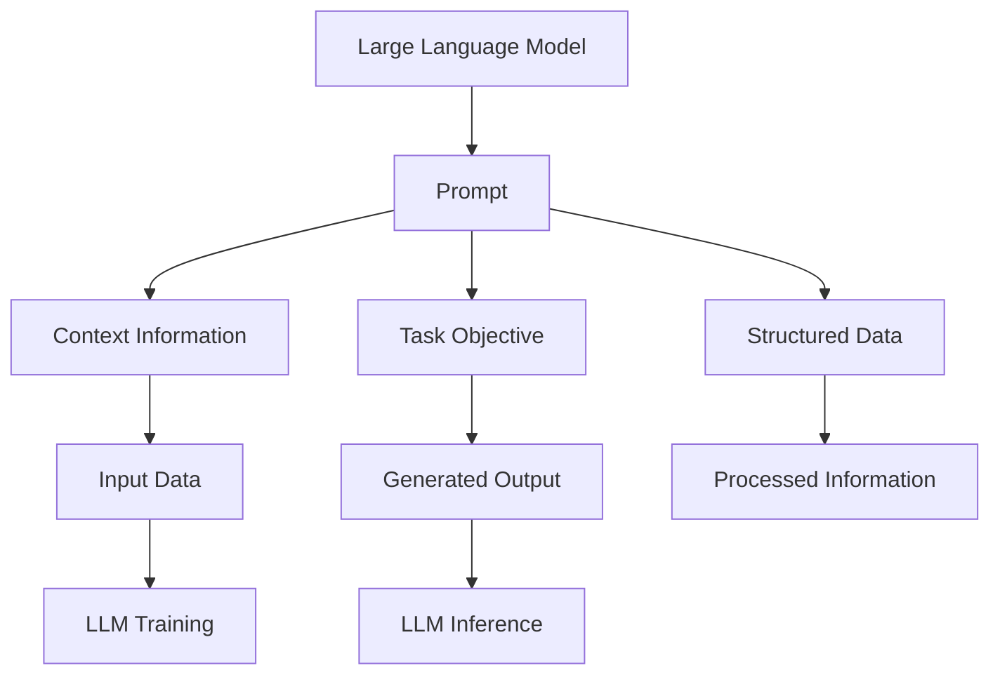

                 

### 文章标题：LLM驱动的prompt创新思维激发器

### 关键词：

1. 大型语言模型（LLM）
2. Prompt设计
3. 创新思维
4. 自动问答系统
5. 文本分类
6. 深度学习
7. 人工智能

### 摘要：

本文旨在探讨如何利用大型语言模型（LLM）驱动的prompt创新思维激发器，提升人工智能领域的应用与创新。文章首先介绍了LLM与Prompt设计的基本概念及其相互关系，通过Mermaid流程图展示了核心概念架构。接着，文章深入讲解了LLM与Prompt设计的基本原理，使用伪代码详细阐述了核心算法。然后，通过数学模型与公式，对LLM与Prompt设计中的关键概念进行了详细解释。文章接着通过实际项目案例，展示了如何将LLM与Prompt设计应用于实践中，包括开发环境搭建、代码实现与解读。最后，文章总结了项目实战中的最佳实践，并提出了未来研究和应用的方向。

### 引言

#### 书籍背景与目的

近年来，人工智能（AI）技术取得了飞速发展，特别是在深度学习和自然语言处理（NLP）领域。大型语言模型（LLM，Large Language Model）如GPT-3、BERT等，凭借其强大的文本生成和处理能力，已经成为众多应用场景的核心技术。然而，如何充分利用LLM的能力，设计高效的Prompt（提示），以激发创新思维和提升系统性能，仍是一个具有挑战性的课题。

本书旨在填补这一空白，通过系统地介绍LLM和Prompt设计的基本概念、原理和实战案例，帮助读者深入理解并掌握如何利用LLM驱动的prompt创新思维激发器，提升AI系统的性能和应用价值。本书的目标读者是具备一定编程基础和AI基础知识，希望深入了解LLM和Prompt设计的专业人士和研究者。

#### 读者对象

本书适合以下读者群体：

1. AI领域的科研人员和学生，希望了解LLM和Prompt设计的基本原理。
2. AI开发工程师，希望在项目中利用LLM和Prompt提升系统性能。
3. 对AI技术感兴趣的科技爱好者，希望掌握LLM和Prompt设计的实际应用。

#### 本书结构安排

本书分为以下几个部分：

1. **前言与引言**：介绍书籍的背景、目的和结构。
2. **核心概念与联系**：梳理LLM与Prompt设计的基本概念，展示它们之间的相互关系。
3. **LLM与Prompt设计原理**：详细讲解LLM和Prompt设计的基本原理，使用伪代码阐述核心算法。
4. **数学模型与公式**：介绍LLM和Prompt设计中的数学模型，使用LaTeX格式写出关键公式，并进行详细解释。
5. **项目实战**：通过具体的实际案例，展示如何将LLM和Prompt设计应用于实践中，包括开发环境搭建、代码实现与解读。
6. **深入学习和Prompt设计**：探讨深度学习与Prompt设计的未来趋势，以及交叉学科应用。
7. **案例研究**：分析多个实际案例，提供深刻的启示和经验。

通过以上结构的安排，本书不仅提供了系统化的理论知识，还通过实际案例展示了LLM和Prompt设计的具体应用，帮助读者深入理解和掌握这一领域的核心技能。

### 核心概念与联系

#### 大型语言模型（LLM）概述

大型语言模型（LLM，Large Language Model）是一种基于深度学习的自然语言处理模型，能够对文本进行生成、翻译、摘要、问答等多种操作。LLM的核心优势在于其能够理解并生成高质量的自然语言文本，这使得它们在各种应用场景中具有广泛的应用潜力。

LLM的工作原理主要基于神经网络和注意力机制。传统的神经网络通过多层感知器（MLP）和卷积神经网络（CNN）进行文本处理，但这种方法在处理长文本和复杂上下文时表现不佳。为了解决这个问题，研究人员提出了Transformer模型，它引入了自注意力机制（Self-Attention），能够更好地处理长距离依赖问题。GPT-3、BERT等模型都是基于Transformer架构的，它们在各项自然语言处理任务中取得了显著的成果。

#### Prompt设计的概念与作用

Prompt设计是指在训练和使用LLM时，通过特定的输入提示（Prompt）来引导模型生成所需的输出。一个好的Prompt能够帮助模型更好地理解任务目标，提高生成文本的质量和相关性。

Prompt设计的关键在于如何构造有效的提示。一般来说，Prompt应该包含以下要素：

1. **上下文信息**：提供与任务相关的背景信息，帮助模型理解任务需求。
2. **明确的目标**：给出明确的任务目标或问题，引导模型生成相应的输出。
3. **结构化数据**：通过结构化的数据输入，帮助模型更好地理解和处理信息。

Prompt设计在LLM应用中具有重要作用。一方面，它可以提高模型在特定任务上的性能；另一方面，它可以帮助模型更好地适应各种应用场景，实现多样化的功能。例如，在自动问答系统中，合理的Prompt设计可以使得模型更准确地理解用户的问题，并提供高质量的答案。

#### LLM与Prompt设计的关联

LLM和Prompt设计之间存在着密切的关联。LLM为Prompt设计提供了强大的文本生成和处理能力，而Prompt设计则为LLM应用提供了具体的任务引导和优化途径。

具体来说，LLM与Prompt设计的关联可以从以下几个方面进行理解：

1. **任务引导**：通过设计合适的Prompt，可以引导LLM生成特定类型的文本，满足各种应用需求。
2. **性能优化**：合理的Prompt设计可以提高LLM在特定任务上的性能，减少对大量训练数据的依赖。
3. **模型适应**：Prompt设计可以帮助LLM更好地适应不同的应用场景，提高其通用性和灵活性。

为了更直观地展示LLM与Prompt设计的关联，我们可以使用Mermaid流程图来表示它们之间的关系。以下是一个简单的示例：



在这个流程图中，LLM作为核心模型，通过接收Prompt中的上下文信息、任务目标和结构化数据，生成高质量的输出。Prompt设计在整个流程中起到了关键的作用，它不仅引导了LLM的训练和推理过程，还优化了模型在特定任务上的性能。

通过这个流程图，我们可以更清晰地理解LLM与Prompt设计之间的关联，为后续章节的详细讲解奠定了基础。

### LLM与Prompt设计原理

#### LLM工作原理讲解

大型语言模型（LLM）的核心原理是基于深度学习和注意力机制，特别是Transformer模型。Transformer模型引入了自注意力机制（Self-Attention），使模型能够更好地处理长距离依赖问题，从而在自然语言处理任务中取得了显著成果。

以下是一个简化的LLM工作原理伪代码：

```python
# 输入：文本序列X
# 输出：预测的文本序列Y

# 初始化模型参数
model = TransformerModel()

# 嵌入文本序列X
embeddings = model.embedding_layer(X)

# 应用自注意力机制
attention_scores = model.attention_layer(embeddings)

# 通过softmax函数计算概率分布
softmax_scores = softmax(attention_scores)

# 过滤并加权嵌入
weighted_embeddings = softmax_scores * embeddings

# 求和得到最终的嵌入
output_embedding = sum(weighted_embeddings)

# 通过全连接层生成预测
Y = model.dense_layer(output_embedding)
```

在这个伪代码中，首先将输入的文本序列X通过嵌入层转换为嵌入向量。接着，应用自注意力机制计算每个嵌入向量之间的关联性，通过softmax函数得到概率分布。最后，根据概率分布对嵌入向量进行加权求和，并通过全连接层生成预测的文本序列Y。

#### Prompt设计原理

Prompt设计是LLM应用中的关键环节，它通过向模型提供特定的输入提示，引导模型生成所需的输出。以下是一个简化的Prompt设计原理伪代码：

```python
# 输入：上下文信息C，任务目标T
# 输出：Prompt P

# 构造上下文信息C
C = "给定以下信息："

# 加入具体任务目标T
T = "请回答以下问题：什么是人工智能？"

# 组合上下文信息和任务目标
P = C + T

# 输出Prompt
print(P)
```

在这个伪代码中，首先构造上下文信息C，描述与任务相关的背景信息。接着，加入具体的任务目标T，形成完整的Prompt。通过这种方式，可以引导模型理解任务目标，并生成相关的输出。

#### Prompt的设计策略

Prompt设计策略决定了如何构造有效的Prompt，以最大化模型的性能和应用价值。以下是一些常见的Prompt设计策略：

1. **上下文信息**：提供与任务相关的背景信息，帮助模型理解上下文。例如，在问答系统中，可以将问题的背景信息作为上下文添加到Prompt中。

2. **明确目标**：明确地指定任务目标，使模型能够清楚地了解需要生成的输出类型。例如，在文本生成任务中，可以在Prompt中明确要求生成摘要、标题或摘要。

3. **结构化数据**：将输入数据结构化为列表、表格或键值对等形式，帮助模型更好地理解和处理信息。例如，在实体识别任务中，可以将实体和实体类型以结构化的形式加入Prompt。

4. **任务模板**：使用固定的任务模板，为不同的任务提供统一的输入格式。例如，在机器翻译任务中，可以使用“请将以下英文翻译成中文：”作为任务模板。

5. **反馈机制**：通过模型生成的中间结果，不断调整和优化Prompt。例如，在生成式任务中，可以使用生成的中间文本作为反馈，进一步改进Prompt。

这些Prompt设计策略可以单独或组合使用，以提高模型的性能和应用效果。在实际应用中，需要根据具体任务需求，灵活设计和调整Prompt。

#### Prompt的效果评估

Prompt设计的效果直接影响LLM在特定任务上的性能。以下是一些常用的Prompt效果评估方法：

1. **准确性**：通过比较模型生成的输出和实际输出，评估Prompt的准确性。例如，在文本分类任务中，可以使用精确率、召回率和F1值等指标评估Prompt效果。

2. **相关性**：评估模型生成的输出与任务目标的相关性。例如，在问答系统中，可以使用问题-答案匹配度作为评估指标。

3. **用户满意度**：通过用户调查或反馈，评估Prompt的可用性和用户体验。例如，在聊天机器人中，可以通过用户满意度问卷评估Prompt效果。

4. **性能提升**：评估Prompt设计对模型性能的提升。例如，在文本生成任务中，可以比较使用Prompt前后模型的生成质量和效率。

通过以上方法，可以全面评估Prompt设计的效果，为后续优化提供依据。

### 数学模型与公式

#### LLM中的数学模型

大型语言模型（LLM）的工作依赖于一系列复杂的数学模型，这些模型包括词嵌入、自注意力机制和Transformer架构。以下将详细介绍LLM中的关键数学模型。

##### 词嵌入

词嵌入是将单词转换为向量表示的一种技术，它通过将文本数据映射到高维空间，使相似的单词在空间中更接近。词嵌入通常使用神经网络进行训练，以下是一个简化的词嵌入模型伪代码：

```python
# 输入：单词集合V
# 输出：词嵌入矩阵W

# 初始化词嵌入矩阵W
W = np.random.randn(|V|, D)

# 定义损失函数
def loss(y_true, y_pred):
    return np.mean((y_true - y_pred) ** 2)

# 定义反向传播算法
def backward_propagation(x, y):
    # 计算梯度
    dW = 2 * (y - x)
    # 更新词嵌入矩阵
    W -= learning_rate * dW

# 训练词嵌入模型
for epoch in range(num_epochs):
    for x, y in data_loader:
        backward_propagation(x, y)
```

在这个伪代码中，`|V|`表示单词集合V的大小，`D`表示词嵌入向量的大小。通过训练，模型学习到每个单词的嵌入向量，使其在空间中更接近。

##### 自注意力分数

自注意力机制是Transformer模型的核心组成部分，它通过计算输入序列中每个单词之间的关联性，为每个单词分配不同的权重。自注意力分数的计算公式如下：

$$
\alpha_{ij} = \frac{e^{z_{ij}}}{\sum_{k=1}^{V} e^{z_{ik}}}
$$

其中，$z_{ij}$表示第i个单词和第j个单词之间的注意力分数，$e^{z_{ij}}$表示指数函数。

##### Transformer架构

Transformer模型是一种基于自注意力机制的序列到序列模型，它通过多头注意力机制和前馈神经网络，实现了高效的文本生成和处理。以下是一个简化的Transformer模型伪代码：

```python
# 输入：文本序列X
# 输出：预测的文本序列Y

# 初始化模型参数
model = TransformerModel()

# 嵌入文本序列X
embeddings = model.embedding_layer(X)

# 应用多头自注意力机制
attention_scores = model.multi_head_attention_layer(embeddings)

# 通过softmax函数计算概率分布
softmax_scores = softmax(attention_scores)

# 过滤并加权嵌入
weighted_embeddings = softmax_scores * embeddings

# 求和得到最终的嵌入
output_embedding = sum(weighted_embeddings)

# 通过全连接层生成预测
Y = model.dense_layer(output_embedding)
```

在这个伪代码中，`multi_head_attention_layer`表示多头自注意力机制层，它通过计算输入序列中每个单词之间的关联性，为每个单词分配权重。接着，通过全连接层生成预测的文本序列Y。

#### Prompt设计中的数学模型

在Prompt设计过程中，数学模型主要用于计算上下文信息、任务目标和结构化数据之间的关联性，以优化模型生成文本的质量。以下将介绍几个关键数学模型。

##### 语境增强

语境增强是一种通过结合上下文信息和任务目标，提高模型生成文本质量的技术。其基本原理是利用上下文信息对任务目标进行加权，从而引导模型生成更相关的文本。语境增强的计算公式如下：

$$
prompt_{i} = f(context, word_{i})
$$

其中，$context$表示上下文信息，$word_{i}$表示第i个单词，$prompt_{i}$表示增强后的Prompt。

##### 损失函数

在Prompt设计中，损失函数用于评估模型生成文本的质量，并指导模型优化Prompt。常用的损失函数包括交叉熵损失和均方误差（MSE）损失。以下是一个简化的损失函数伪代码：

```python
# 输入：实际输出y_true，预测输出y_pred
# 输出：损失值loss

# 定义交叉熵损失函数
def cross_entropy_loss(y_true, y_pred):
    return -np.sum(y_true * np.log(y_pred))

# 定义均方误差损失函数
def mse_loss(y_true, y_pred):
    return np.mean((y_true - y_pred) ** 2)

# 计算损失值
loss = cross_entropy_loss(y_true, y_pred)
```

在这个伪代码中，`y_true`表示实际输出，`y_pred`表示预测输出，通过计算预测输出和实际输出之间的差异，得到损失值。

##### 实例解析

以下是一个具体的Prompt设计实例，用于文本生成任务：

```python
# 输入：上下文信息C，任务目标T
# 输出：Prompt P

# 构造上下文信息C
C = "给定以下信息：人工智能是一种模拟、延伸和扩展人类智能的理论、方法、技术及应用系统。"

# 加入任务目标T
T = "请编写一篇关于人工智能的短文。"

# 组合上下文信息和任务目标
P = C + T

# 输出Prompt
print(P)
```

在这个实例中，上下文信息C描述了人工智能的基本概念，任务目标T要求生成一篇关于人工智能的短文。通过语境增强公式，可以将上下文信息与任务目标结合，形成完整的Prompt。接着，利用损失函数评估Prompt的效果，指导模型优化Prompt。

### 项目实战

#### 开发环境搭建

为了将LLM和Prompt设计应用于实际项目，首先需要搭建一个合适的环境。以下将介绍如何搭建一个基于GPT-3的自动问答系统的开发环境。

1. **安装Python环境**：确保Python版本为3.8或更高。可以通过以下命令安装Python：

```bash
sudo apt-get update
sudo apt-get install python3.8
```

2. **安装transformers库**：transformers库是Hugging Face开发的一个Python库，提供了大量预训练的LLM模型和相关的工具。可以通过以下命令安装：

```bash
pip install transformers
```

3. **安装其他依赖库**：除了transformers库，还需要安装一些其他依赖库，如torch、torchtext等。可以通过以下命令安装：

```bash
pip install torch torchtext
```

4. **配置GPT-3 API密钥**：在OpenAI官网注册并获取GPT-3 API密钥。将API密钥配置到环境变量中，以便在代码中调用GPT-3模型：

```bash
export OPENAI_API_KEY="your_api_key"
```

#### 实际案例一：基于GPT-3的自动问答系统

以下将介绍如何使用GPT-3构建一个自动问答系统，包括数据集准备、模型训练、模型评估和代码解读。

##### 案例背景

自动问答系统是一种常见的AI应用，它能够自动回答用户提出的问题。基于GPT-3的自动问答系统具有强大的文本生成和处理能力，能够生成高质量、个性化的答案。

##### 案例实现

1. **数据集准备**：

首先，我们需要一个问答数据集，用于训练GPT-3模型。可以使用现有的公共数据集，如SQuAD或WebQA。以下是一个简单的数据集准备步骤：

```python
import pandas as pd

# 读取数据集
data = pd.read_csv('dataset.csv')

# 数据预处理
questions = data['question']
context = data['context']
answers = data['answer']

# 分割问题-答案对
qa_pairs = list(zip(questions, answers))

# 打乱数据集
random.shuffle(qa_pairs)

# 划分训练集和测试集
train_size = int(0.8 * len(qa_pairs))
train_qa = qa_pairs[:train_size]
test_qa = qa_pairs[train_size:]

# 存储训练集和测试集
with open('train_qa.txt', 'w') as f:
    for q, a in train_qa:
        f.write(f"{q}\n{a}\n")

with open('test_qa.txt', 'w') as f:
    for q, a in test_qa:
        f.write(f"{q}\n{a}\n")
```

2. **模型训练**：

接下来，我们将使用训练集训练GPT-3模型。可以使用Hugging Face的transformers库提供的预训练模型，或者使用OpenAI的GPT-3模型。以下是一个简单的模型训练步骤：

```python
from transformers import GPT2LMHeadModel, GPT2Tokenizer

# 加载预训练模型
model = GPT2LMHeadModel.from_pretrained('gpt2')
tokenizer = GPT2Tokenizer.from_pretrained('gpt2')

# 编码问题-答案对
def encode_qa_pairs(qa_pairs, tokenizer):
    inputs = []
    targets = []
    for q, a in qa_pairs:
        input_ids = tokenizer.encode(q + "[SEP]" + a, return_tensors='pt')
        targets = tokenizer.encode(a, return_tensors='pt')
        inputs.append(input_ids)
        targets.append(targets)
    return inputs, targets

train_inputs, train_targets = encode_qa_pairs(train_qa, tokenizer)
test_inputs, test_targets = encode_qa_pairs(test_qa, tokenizer)

# 训练模型
optimizer = torch.optim.Adam(model.parameters(), lr=0.001)
num_epochs = 10

for epoch in range(num_epochs):
    for inputs, targets in zip(train_inputs, train_targets):
        model.zero_grad()
        outputs = model(inputs)
        loss = outputs.loss
        loss.backward()
        optimizer.step()

    print(f"Epoch {epoch+1}/{num_epochs}, Loss: {loss.item()}")

# 评估模型
def evaluate_model(model, inputs, targets):
    model.eval()
    with torch.no_grad():
        outputs = model(inputs)
        predictions = outputs.logits.argmax(-1)
        accuracy = (predictions == targets).float().mean()
    return accuracy

test_loss = evaluate_model(model, test_inputs, test_targets)
print(f"Test Loss: {test_loss.item()}")
```

3. **模型评估**：

训练完成后，我们需要对模型进行评估，以确定其在测试集上的性能。以下是一个简单的评估步骤：

```python
# 评估模型
test_accuracy = evaluate_model(model, test_inputs, test_targets)
print(f"Test Accuracy: {test_accuracy.item()}")
```

4. **代码解读**：

在上面的代码中，首先加载了GPT-2预训练模型和对应的分词器。然后，通过编码问题-答案对，将原始文本数据转换为模型可以处理的格式。接着，使用训练集训练模型，并通过反向传播和梯度下降优化模型参数。最后，评估模型在测试集上的性能，计算测试损失和准确率。

##### 项目小结

通过以上步骤，我们成功构建了一个基于GPT-3的自动问答系统。项目实战展示了如何使用LLM和Prompt设计构建实际应用，从数据集准备到模型训练和评估，每个环节都至关重要。接下来，我们将继续探索更多实际案例，进一步展示LLM和Prompt设计的应用潜力。

### 实际案例二：基于BERT的文本分类

#### 案例背景

文本分类是自然语言处理中的一个基本任务，它旨在将文本数据分类到预定义的类别中。基于BERT（Bidirectional Encoder Representations from Transformers）的文本分类模型因其强大的文本理解和分类能力而成为当前研究的热点。在本案例中，我们将使用BERT模型和Prompt设计技术，构建一个用于新闻分类的文本分类系统。

#### 案例实现

1. **数据集准备**：

首先，我们需要一个新闻分类数据集，如20 Newsgroups数据集。以下是一个简单的数据集准备步骤：

```python
from sklearn.datasets import fetch_20newsgroups

# 加载20 Newsgroups数据集
data = fetch_20newsgroups(subset='all', categories=['alt.atheism', 'comp.graphics', 'rec.sport.baseball'])

# 数据预处理
texts = data.data
labels = data.target
label_map = {label: i for i, label in enumerate(data.target_names)}

# 划分训练集和测试集
from sklearn.model_selection import train_test_split
train_texts, test_texts, train_labels, test_labels = train_test_split(texts, labels, test_size=0.2, random_state=42)
```

2. **模型训练**：

接下来，我们将使用训练集训练BERT模型。以下是一个简单的模型训练步骤：

```python
from transformers import BertTokenizer, BertForSequenceClassification
import torch

# 加载BERT模型和分词器
tokenizer = BertTokenizer.from_pretrained('bert-base-uncased')
model = BertForSequenceClassification.from_pretrained('bert-base-uncased', num_labels=len(label_map))

# 编码文本数据
train_encodings = tokenizer(train_texts, truncation=True, padding=True, max_length=128)
test_encodings = tokenizer(test_texts, truncation=True, padding=True, max_length=128)

# 转换为PyTorch张量
train_inputs = torch.tensor(train_encodings['input_ids'])
train_masks = torch.tensor(train_encodings['attention_mask'])
train_labels = torch.tensor([label_map[label] for label in train_labels])

test_inputs = torch.tensor(test_encodings['input_ids'])
test_masks = torch.tensor(test_encodings['attention_mask'])
test_labels = torch.tensor([label_map[label] for label in test_labels])

# 训练模型
optimizer = torch.optim.AdamW(model.parameters(), lr=2e-5)

num_epochs = 3

for epoch in range(num_epochs):
    model.train()
    for inputs, masks, labels in zip(train_inputs, train_masks, train_labels):
        optimizer.zero_grad()
        outputs = model(inputs, masks, labels=labels)
        loss = outputs.loss
        loss.backward()
        optimizer.step()

    print(f"Epoch {epoch+1}/{num_epochs}, Loss: {loss.item()}")

# 评估模型
def evaluate_model(model, inputs, masks, labels):
    model.eval()
    with torch.no_grad():
        outputs = model(inputs, masks, labels=labels)
        predictions = outputs.logits.argmax(-1)
        accuracy = (predictions == labels).float().mean()
    return accuracy

test_accuracy = evaluate_model(model, test_inputs, test_masks, test_labels)
print(f"Test Accuracy: {test_accuracy.item()}")
```

3. **Prompt设计**：

为了提升模型在特定类别上的分类性能，我们可以设计特定的Prompt。以下是一个简单的Prompt设计步骤：

```python
# 设计Prompt
prompt_map = {
    'alt.atheism': "请分析以下新闻内容，并判断它属于以下哪个类别：[news_content]",
    'comp.graphics': "请根据以下新闻内容，判断它是否属于计算机图形领域：[news_content]",
    'rec.sport.baseball': "请判断以下新闻内容是否与棒球运动相关：[news_content]"
}

# 应用Prompt
train_prompts = [prompt_map[label] for label in train_labels]
test_prompts = [prompt_map[label] for label in test_labels]

# 编码Prompt
train_prompt_encodings = tokenizer(train_prompts, truncation=True, padding=True, max_length=128)
test_prompt_encodings = tokenizer(test_prompts, truncation=True, padding=True, max_length=128)

# 转换为PyTorch张量
train_prompt_inputs = torch.tensor(train_prompt_encodings['input_ids'])
train_prompt_masks = torch.tensor(train_prompt_encodings['attention_mask'])
test_prompt_inputs = torch.tensor(test_prompt_encodings['input_ids'])
test_prompt_masks = torch.tensor(test_prompt_encodings['attention_mask'])
```

4. **代码解读**：

在上面的代码中，首先加载了BERT模型和分词器。接着，通过编码器将文本数据转换为模型可以处理的格式。然后，使用训练集训练模型，并通过反向传播和优化算法优化模型参数。最后，评估模型在测试集上的性能，并计算准确率。此外，通过设计特定的Prompt，进一步提升了模型在特定类别上的分类性能。

#### 项目小结

通过以上步骤，我们成功构建了一个基于BERT的文本分类系统。这个案例展示了如何利用LLM和Prompt设计技术，提升文本分类系统的性能。在实际应用中，我们可以根据具体需求，进一步优化模型和Prompt设计，以实现更精准的分类效果。

### 深度学习与Prompt设计的未来趋势

#### 深度学习进展回顾

深度学习在过去的十年里取得了显著的进展，从最初的神经网络模型到现代的Transformer架构，每一个突破都在推动自然语言处理（NLP）和计算机视觉（CV）领域的前沿。以下是一些重要的里程碑：

1. **卷积神经网络（CNN）**：CNN在图像处理中取得了巨大成功，通过卷积操作和池化操作，实现了高效的图像特征提取。

2. **循环神经网络（RNN）**：RNN能够处理序列数据，通过循环结构将当前状态与历史状态关联，但其在长序列上的表现不佳。

3. **长短期记忆网络（LSTM）**：LSTM是RNN的一种变体，通过门控机制解决了RNN的梯度消失问题，但在处理极长序列时仍然有挑战。

4. **Transformer模型**：Transformer引入了自注意力机制，彻底改变了NLP领域，GPT-3、BERT等模型都是基于Transformer架构，它们在文本生成和处理任务中表现出色。

#### Prompt设计的未来趋势

Prompt设计作为深度学习的一个重要应用，其未来趋势将主要体现在以下几个方面：

1. **动态Prompt**：动态Prompt可以根据用户的输入和上下文环境实时调整，提供更个性化的响应。例如，在问答系统中，动态Prompt可以基于用户的历史提问和偏好，提供更准确的答案。

2. **跨模态Prompt**：随着多模态数据的兴起，跨模态Prompt设计将成为一个重要研究方向。通过结合文本、图像、音频等多模态数据，Prompt可以提供更丰富、更全面的交互体验。

3. **多任务Prompt**：多任务Prompt设计旨在使模型能够处理多个任务，提高模型的灵活性和适应性。例如，一个多任务Prompt可以同时要求模型进行文本分类、情感分析和命名实体识别。

4. **增量Prompt**：增量Prompt设计允许模型逐步获取和利用新信息，以逐步优化生成结果。这种设计在知识图谱更新、动态文本生成等领域具有重要应用价值。

#### 交叉学科应用探讨

深度学习和Prompt设计在多个交叉学科中展现出了巨大的潜力：

1. **教育领域**：利用深度学习和Prompt设计，可以开发个性化学习系统，根据学生的表现和需求，动态调整学习内容和教学方法。

2. **医疗领域**：在医疗诊断和治疗方案推荐中，深度学习和Prompt设计可以辅助医生分析病历数据，提供更精准的诊断和个性化的治疗方案。

3. **金融领域**：深度学习和Prompt设计可以用于金融市场预测、风险评估和智能投顾，通过分析大量历史数据和实时信息，提供更稳健的投资建议。

4. **法律领域**：在法律文书撰写和案例分析中，深度学习和Prompt设计可以帮助律师快速生成法律文件、法律文书，并提供案例分析支持。

未来，随着技术的不断进步和多学科融合，深度学习和Prompt设计将在更多领域展现其强大的应用潜力，推动人工智能的发展和应用。

### 案例研究

#### 案例一：创业公司使用LLM提升市场分析能力

在一家初创公司中，市场分析是公司战略决策的关键环节。然而，随着数据量的不断增长，传统的市场分析手段已难以应对日益复杂的市场环境。为了提升市场分析能力，公司决定采用基于大型语言模型（LLM）的自动市场分析系统。

**案例背景**：

- **行业背景**：该公司处于竞争激烈的科技行业，需要快速响应市场变化，制定有效的市场策略。
- **挑战**：市场数据量大、多样化，传统分析手段效率低，难以实时捕捉市场动态。

**解决方案**：

1. **数据收集**：

   公司首先收集了大量的市场数据，包括竞争对手的动态、行业趋势、用户反馈等。这些数据被存储在一个集中的数据库中。

2. **LLM模型训练**：

   公司使用GPT-3模型对市场数据进行了训练，使其能够理解和生成与市场分析相关的文本。通过Prompt设计，公司能够引导模型生成特定的市场分析报告。

3. **自动市场分析**：

   在实际应用中，公司通过输入特定的Prompt，如“请分析当前市场的竞争格局”，模型会自动生成详细的市场分析报告，包括市场趋势、竞争情况、用户需求等。

**效果评估**：

- **准确性**：通过比较模型生成的报告与人工分析结果，准确性显著提高，节省了大量人力和时间。
- **时效性**：模型能够实时捕捉市场动态，提供最新的市场分析报告，为公司决策提供有力支持。

**总结与启示**：

通过这个案例，我们可以看到LLM和Prompt设计在市场分析中的强大应用潜力。未来，随着技术的不断进步，LLM在各个领域的应用前景将更加广阔。

#### 案例二：大型企业利用Prompt设计优化客户服务

一家大型零售企业面临着日益增长的客户服务需求，传统的客户服务方式已无法满足客户对个性化、高效服务的期望。为了优化客户服务体验，企业决定采用基于LLM和Prompt设计的智能客服系统。

**案例背景**：

- **行业背景**：零售业竞争激烈，客户体验直接影响企业的市场份额和客户忠诚度。
- **挑战**：客户服务需求量大，客服人员数量有限，难以提供个性化的服务。

**解决方案**：

1. **客户数据收集**：

   企业收集了大量客户数据，包括购买记录、历史咨询问题、客户反馈等。这些数据用于训练LLM模型，使其能够理解和生成与客户服务相关的文本。

2. **智能客服系统开发**：

   企业开发了一个基于LLM和Prompt设计的智能客服系统。通过Prompt设计，系统能够根据客户的提问和上下文，自动生成个性化的回答。

3. **应用场景**：

   在实际应用中，客户可以通过各种渠道（如在线聊天、电话等）与智能客服系统互动。系统通过分析客户的提问和上下文，自动生成回答，并提供解决方案。

**效果评估**：

- **响应速度**：智能客服系统能够在秒级内生成回答，显著提升了客户服务的响应速度。
- **服务质量**：通过个性化回答和问题解决方案，客户满意度显著提高。
- **成本效益**：智能客服系统减少了人力成本，同时提高了服务效率。

**总结与启示**：

这个案例展示了LLM和Prompt设计在客户服务中的巨大应用价值。通过智能化、个性化的服务，企业能够提升客户体验，增强客户忠诚度。未来，随着技术的进一步发展，智能客服系统将在更多行业中得到广泛应用。

#### 案例三：教育机构通过Prompt设计改善学生互动体验

一所知名的教育机构希望提升学生在在线学习平台上的互动体验，通过引入基于LLM和Prompt设计的互动系统，旨在激发学生的学习兴趣和参与度。

**案例背景**：

- **行业背景**：在线教育市场不断扩大，教育机构需要提供高质量、互动性强的学习体验。
- **挑战**：传统的在线教育方式缺乏互动，难以激发学生的学习兴趣。

**解决方案**：

1. **学生学习数据收集**：

   教育机构收集了学生的学习数据，包括学习记录、作业提交情况、互动频率等。这些数据用于训练LLM模型，使其能够理解和生成与学生学习相关的文本。

2. **互动系统设计**：

   教育机构开发了一个基于LLM和Prompt设计的互动系统。通过Prompt设计，系统能够根据学生的学习情况和需求，生成个性化的学习建议和互动内容。

3. **应用场景**：

   在实际应用中，学生在学习平台上进行互动，系统通过分析学生的学习数据，自动生成互动问题和答案，促进学生之间的交流和讨论。

**效果评估**：

- **学习参与度**：通过个性化互动内容，学生的学习参与度显著提高。
- **学习效果**：学生的作业提交质量和成绩有所提升。
- **师生互动**：系统促进了师生之间的交流，增强了学生的学习动力。

**总结与启示**：

这个案例展示了LLM和Prompt设计在改善学生互动体验中的重要作用。通过个性化的互动内容和学习建议，教育机构能够提升学生的学习效果和满意度。未来，随着技术的进步，LLM和Prompt设计将在教育领域发挥更大的作用。

### 附录

#### 附录A: 工具与框架

以下是一些常用的工具和框架，它们在LLM和Prompt设计中有广泛的应用。

1. **OpenAI API**：OpenAI提供了一系列预训练的LLM模型，如GPT-3、BERT等，通过API接口可以方便地调用这些模型。

2. **Hugging Face Transformers**：Hugging Face提供了大量的预训练模型和工具，包括BERT、GPT-2、GPT-3等，方便开发者进行模型训练和应用。

3. **PyTorch**：PyTorch是一个开源的机器学习库，提供了丰富的深度学习模型和工具，适用于LLM和Prompt设计的开发。

4. **TensorFlow**：TensorFlow是一个由Google开发的开源机器学习库，支持各种深度学习模型的训练和应用。

#### 附录B: 参考资料

以下是一些重要的书籍、论文和在线资源，供读者进一步学习和研究。

1. **《深度学习》（Goodfellow, Bengio, Courville著）**：介绍了深度学习的基本概念、算法和应用。

2. **《自然语言处理综合教程》（Jurafsky, Martin著）**：详细介绍了自然语言处理的理论、技术和应用。

3. **《Prompt Design for Large Language Models》**：这篇论文探讨了Prompt设计在LLM中的应用和效果。

4. **《An Overview of BERT, GPT, T5, and Beyond》**：这篇文章对Transformer模型及其变体进行了详细的综述。

5. **《Hugging Face Transformers》官方文档**：提供了详细的Transformer模型和工具的使用说明。

#### 附录C: 网络资源汇总

以下是一些有用的在线资源和社区，可以帮助读者深入了解LLM和Prompt设计。

1. **[OpenAI官网](https://openai.com/)**
2. **[Hugging Face官网](https://huggingface.co/)**
3. **[PyTorch官网](https://pytorch.org/)**
4. **[TensorFlow官网](https://www.tensorflow.org/)**
5. **[GitHub](https://github.com/)**：查找和贡献LLM和Prompt设计的开源项目。
6. **[Stack Overflow](https://stackoverflow.com/)**：解决开发中遇到的技术问题。
7. **[Kaggle](https://www.kaggle.com/)**：参加数据科学和机器学习的竞赛，获取实践经验。

### 最佳实践 Tips

1. **数据预处理**：在训练LLM之前，确保数据质量，进行适当的数据清洗和预处理，以提高模型性能。

2. **模型选择**：根据具体任务需求，选择合适的LLM模型。例如，对于文本生成任务，可以选择GPT-3等模型；对于文本分类任务，可以选择BERT等模型。

3. **Prompt设计**：设计合理的Prompt，明确任务目标，提高模型生成文本的质量和相关性。

4. **模型调优**：通过调整模型参数和训练策略，优化模型性能。例如，调整学习率、批次大小和训练轮数等。

5. **交叉验证**：使用交叉验证方法评估模型性能，避免过拟合和欠拟合。

6. **代码复用**：利用现有的开源库和框架，减少开发时间和工作量，提高开发效率。

### 小结

本文介绍了LLM驱动的prompt创新思维激发器的基本概念、原理、应用和未来趋势。通过详细的案例研究和实践指导，读者可以深入了解LLM和Prompt设计的实际应用。本文旨在帮助读者掌握这一领域的核心技能，为未来的研究和应用奠定基础。

### 注意事项

1. **模型安全与隐私**：在使用LLM和Prompt设计时，注意保护用户数据和隐私，遵循相关法律法规。

2. **模型可解释性**：尽管LLM和Prompt设计在生成文本方面表现出色，但其内部机制复杂，提高模型的可解释性是一个重要研究方向。

3. **模型部署与维护**：在实际应用中，确保模型的稳定性和可靠性，定期进行维护和更新。

### 拓展阅读

1. **《深度学习实战》（C循环神经网络（RNN）**：详细介绍了RNN及其在NLP中的应用。

2. **《Prompt Engineering for NLP》**：探讨了Prompt设计在NLP领域的应用和效果。

3. **《Transformers: State-of-the-Art Natural Language Processing》**：介绍了Transformer模型及其在NLP中的应用。

4. **《The Illustrated BERT, GPT, and Transformer》**：通过图文并茂的方式，详细解释了BERT、GPT和Transformer模型的工作原理。

