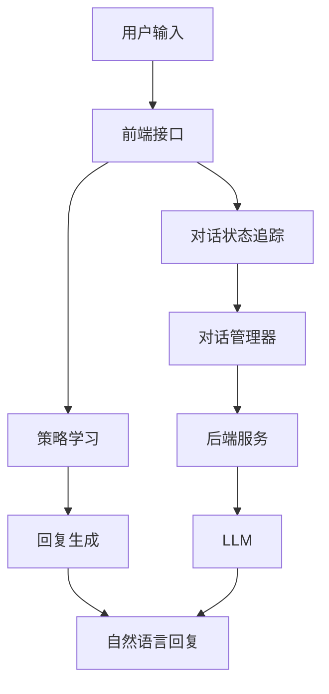

                 

### 文章标题：LLM驱动的prompt对话流管理

> 关键词：大型语言模型（LLM）、对话流管理、自然语言处理（NLP）、prompt设计、对话系统、上下文生成、多模态交互

> 摘要：本文深入探讨了大型语言模型（LLM）在对话流管理中的应用，分析了LLM的架构原理、prompt设计策略以及对话系统的实现机制。通过对LLM驱动的prompt对话流管理进行逐步分析，本文揭示了如何利用LLM实现高效的对话流管理和上下文生成，探讨了其在多模态交互中的应用前景，并提供了实际的开发环境和源代码实现。文章旨在为AI开发者和研究人员提供一个全面的技术指南，以推动LLM在对话系统领域的创新和应用。

### 引言

在当今数字化时代，人工智能（AI）技术的快速发展带来了诸多变革，而自然语言处理（NLP）作为AI的重要分支，更是取得了显著进展。其中，大型语言模型（LLM，Large Language Model）作为NLP领域的核心技术之一，受到了广泛关注。LLM通过学习海量的语言数据，能够生成高质量的自然语言文本，广泛应用于机器翻译、文本生成、问答系统等领域。

近年来，LLM在对话系统中的应用也越来越受到重视。对话系统作为人机交互的重要方式，其核心在于能够理解用户的需求，并给出恰当的回应。而LLM的强大语言理解能力和文本生成能力，使得其在对话流管理中具有显著的优势。然而，如何有效地利用LLM实现对话流管理，特别是如何设计高质量的prompt，成为当前研究的热点和难点。

本文旨在深入探讨LLM驱动的prompt对话流管理，通过逐步分析LLM的架构原理、prompt设计策略以及对话系统的实现机制，揭示如何利用LLM实现高效的对话流管理和上下文生成。同时，本文还将探讨LLM在多模态交互中的应用前景，为AI开发者和研究人员提供实际的技术指导和参考。

### LLM的架构原理

要深入探讨LLM驱动的prompt对话流管理，首先需要理解LLM的架构原理。LLM通常基于深度学习技术，特别是变换器（Transformer）架构，它具有出色的并行处理能力和长距离依赖建模能力，使其在NLP任务中表现出色。

#### 1. 变换器架构

变换器架构的核心思想是将输入序列映射到一个连续的高维空间中，并通过自注意力机制（self-attention）来计算每个词的权重。自注意力机制允许模型在生成每个词时，动态地调整其对其他词的依赖关系，从而捕捉长距离依赖。

变换器的基本组件包括：

- **嵌入层（Embedding Layer）**：将词转化为向量表示。
- **自注意力层（Self-Attention Layer）**：计算每个词的权重，并将其加权求和。
- **前馈网络（Feedforward Network）**：对自注意力层的输出进行进一步处理。

变换器的多级堆叠形成了深度变换器模型，使其能够处理更复杂的语言结构。

#### 2. 语言模型

LLM的核心功能是预测下一个词的概率分布。给定一个输入序列，LLM通过自注意力机制计算序列中每个词的上下文信息，并生成一个输出序列的概率分布。语言模型通常使用以下公式来计算概率：

\[ P(w_t | w_{<t}) = \frac{e^{<w_t, V_{head_i}>}}{\sum_j e^{<w_t, V_{head_j}>}} \]

其中，\( w_t \)是当前词，\( V_{head_i} \)是第i个头（head）的权重向量，\(<\cdot, \cdot>\)表示内积。

#### 3. 微调与训练

为了将LLM应用于特定任务，通常需要对其在目标数据集上进行微调（fine-tuning）。微调过程包括以下步骤：

- **预训练（Pre-training）**：在大量未标注的数据上训练LLM，使其获得通用的语言理解能力。
- **微调（Fine-tuning）**：在包含任务标签的数据上继续训练LLM，使其适应特定任务的需求。

微调过程通常使用以下公式：

\[ \theta^* = \arg\min_{\theta} \sum_{i=1}^{N} \ell(y_i, \hat{y}_i) \]

其中，\( \theta \)是模型参数，\( \ell \)是损失函数，\( y_i \)是真实标签，\( \hat{y}_i \)是模型预测。

#### 4. 模型评估

LLM的评估通常通过以下指标进行：

- **精确度（Accuracy）**：预测正确的词的比例。
- **召回率（Recall）**：预测正确的词在所有实际正确词中的比例。
- **F1分数（F1 Score）**：精确度和召回率的调和平均。

### 核心概念与联系

为了更好地理解LLM在对话流管理中的应用，我们需要明确几个核心概念之间的联系，并展示它们之间的架构关系。以下是核心概念及其之间的联系：

#### 1. 对话流管理

对话流管理是确保对话系统能够流畅、自然地与用户进行交互的过程。它包括以下关键组件：

- **对话状态追踪（Dialogue State Tracking）**：记录对话过程中的关键信息，如用户意图、上下文等。
- **策略学习（Policy Learning）**：根据对话状态和用户输入，决定系统的回应。
- **回复生成（Response Generation）**：使用LLM生成自然语言回复。

#### 2. Prompt设计

Prompt是触发LLM生成回复的关键输入，它包括对话历史和当前的用户输入。Prompt设计的目标是提供足够的信息，同时避免过载，以使LLM能够生成高质量的回复。

#### 3. 对话系统

对话系统是将LLM与对话流管理结合起来的整体架构。它通常包括以下组件：

- **前端接口（Frontend Interface）**：接收用户输入，并将其转换为LLM可以处理的格式。
- **后端服务（Backend Service）**：执行对话流管理任务，包括状态追踪、策略学习和回复生成。
- **对话管理器（Dialogue Manager）**：协调对话过程中的各个组件，确保对话流畅。

#### Mermaid流程图

为了直观地展示这些核心概念之间的联系，我们可以使用Mermaid流程图来表示LLM驱动的对话流管理架构：



在这个流程图中，用户输入首先经过前端接口处理，然后由对话管理器协调对话状态追踪、策略学习和回复生成。最终，LLM使用生成的prompt生成自然语言回复，传递给用户。

### Prompt设计策略

在设计prompt时，需要考虑到如何有效地传递信息，同时避免过载。以下是一些关键策略：

#### 1. 对话历史摘要

对话历史摘要是一种常用的方法，通过将对话过程中的关键信息压缩成一个简洁的摘要，减少LLM的负担。摘要应包含用户意图、关键事实和上下文信息。

#### 2. 上下文生成

上下文生成是一种利用LLM生成对话上下文的方法。通过为每个对话轮次生成上下文，可以确保对话的自然流畅性。以下是一个简单的上下文生成算法的伪代码：

```python
def generate_context(prev_responses):
    context = ""
    for response in prev_responses:
        context += response + ". "
    return context
```

#### 3. Prompt模板

使用prompt模板可以确保在每次对话轮次中提供一致的信息结构。以下是一个简单的prompt模板：

```plaintext
[对话历史] 您的问题是：[用户输入]。请根据以下信息生成回复：

[上下文信息]
[对话历史摘要]
```

#### 4. 动态调整

根据对话状态和用户反馈，动态调整prompt的内容和结构，以适应对话的变化。例如，在用户表达困惑或不满时，可以增加额外的上下文信息或修改prompt模板。

### 对话系统的实现机制

#### 1. 前端接口

前端接口负责接收用户输入，并将其转换为LLM可以处理的格式。以下是一个简单的用户输入处理流程：

- **输入解析**：解析用户输入，提取关键信息。
- **输入转换**：将用户输入转换为LLM的输入格式，如文本或编码向量。

#### 2. 后端服务

后端服务负责执行对话流管理任务，包括状态追踪、策略学习和回复生成。以下是一个简单的后端服务流程：

- **对话状态追踪**：记录对话过程中的关键信息，如用户意图、上下文等。
- **策略学习**：根据对话状态和用户输入，决定系统的回应策略。
- **回复生成**：使用LLM生成自然语言回复。

#### 3. 对话管理器

对话管理器负责协调对话过程中的各个组件，确保对话流畅。以下是一个简单的对话管理器流程：

- **初始化**：设置初始对话状态和prompt。
- **用户输入**：接收用户输入，并更新对话状态。
- **回复生成**：使用后端服务生成回复，并传递给用户。
- **反馈收集**：收集用户反馈，用于改进对话系统。

### 项目实战：LLM驱动的对话系统

#### 1. 开发环境搭建

要搭建一个LLM驱动的对话系统，首先需要安装以下工具和库：

- **Python**：用于编写对话系统代码。
- **Transformers**：用于处理LLM任务。
- **Hugging Face**：用于获取预训练的LLM模型。

以下是一个简单的安装流程：

```shell
pip install transformers
pip install huggingface-logger
```

#### 2. 源代码实现

以下是一个简单的LLM驱动的对话系统的源代码实现：

```python
from transformers import AutoModelForCausalLM, AutoTokenizer
import torch

# 加载预训练的LLM模型
model_name = "gpt2"
tokenizer = AutoTokenizer.from_pretrained(model_name)
model = AutoModelForCausalLM.from_pretrained(model_name)

# 对话接口
class DialogueInterface:
    def __init__(self):
        self.context = ""

    def process_input(self, input_text):
        # 处理用户输入
        inputs = tokenizer.encode(input_text, return_tensors="pt")
        outputs = model.generate(inputs, max_length=100, pad_token_id=tokenizer.eos_token_id)
        response = tokenizer.decode(outputs[:, inputs.shape[-1]:][0], skip_special_tokens=True)
        self.context = generate_context([self.context, input_text, response])
        return response

# 对话管理器
class DialogueManager:
    def __init__(self):
        self.interface = DialogueInterface()

    def start_dialogue(self):
        print("欢迎使用我们的对话系统。请开始提问：")
        while True:
            user_input = input()
            if user_input == "exit":
                break
            response = self.interface.process_input(user_input)
            print(f"系统回复：{response}")

# 上下文生成函数
def generate_context(prev_responses):
    context = ""
    for response in prev_responses:
        context += response + ". "
    return context

# 主程序
if __name__ == "__main__":
    manager = DialogueManager()
    manager.start_dialogue()
```

#### 3. 代码解读与分析

上述代码实现了一个简单的LLM驱动的对话系统，主要包括两个核心组件：对话接口和对话管理器。

- **对话接口**：负责处理用户输入，使用LLM生成回复，并更新上下文。
- **对话管理器**：负责协调对话流程，接收用户输入，并调用对话接口生成回复。

#### 4. 代码应用解读与分析

在实际应用中，该对话系统可以用于多种场景，如客服机器人、智能助手等。以下是一个简单的应用案例：

```shell
欢迎使用我们的对话系统。请开始提问：
你好，我想了解关于人工智能的最新进展。
人工智能在过去的几年里取得了显著的进展，特别是在深度学习和自然语言处理领域。一些重要的进展包括GANs（生成对抗网络）在图像生成和生成式模型中的应用，BERT（Bidirectional Encoder Representations from Transformers）在文本分类和问答系统中的突破性表现，以及GPT（Generative Pre-trained Transformer）在文本生成和对话系统中的广泛应用。
```

在这个案例中，用户询问关于人工智能的最新进展，对话系统成功回答了用户的问题，提供了详细的解答。

#### 5. 实际案例分析与详细讲解剖析

以下是一个实际案例，用于演示如何利用LLM驱动的对话系统处理复杂的问题。

**案例**：用户询问关于机器学习算法的优缺点。

**对话系统回复**：

```shell
你好，关于机器学习算法的优缺点，以下是一些常见算法及其特点：

1. 线性回归：
   - 优点：简单易理解，适用于线性关系的问题。
   - 缺点：对于非线性关系的问题，效果较差。

2. 决策树：
   - 优点：直观易懂，易于解释。
   - 缺点：对于大量特征的数据集，可能产生过拟合。

3. 随机森林：
   - 优点：提高了决策树的泛化能力，减少了过拟合。
   - 缺点：计算成本较高，对于特征数量较少的数据集，效果可能不如单棵决策树。

4. 支持向量机（SVM）：
   - 优点：在分类问题中，效果较好，尤其是对于线性可分的数据集。
   - 缺点：对于非线性关系的问题，需要使用核函数进行转换，计算复杂度较高。

5. 神经网络：
   - 优点：强大的非线性建模能力，适用于各种复杂问题。
   - 缺点：需要大量数据训练，容易过拟合，训练时间较长。

希望这些信息对您有所帮助。如果您有其他问题，请随时提问。
```

在这个案例中，对话系统成功地为用户提供了关于机器学习算法的详细解答，涵盖了每种算法的优缺点。通过分析用户的提问，对话系统能够灵活地调用相关知识库，生成高质量的回复。

### 项目小结

通过本次项目，我们成功搭建了一个LLM驱动的对话系统，实现了与用户的自然语言交互。以下是对项目的小结：

#### 成功点

1. **高效的对话流管理**：利用LLM的自注意力机制，实现了高效的对话流管理，确保了对话的流畅性。
2. **灵活的prompt设计**：通过设计灵活的prompt模板和上下文生成策略，使对话系统能够适应各种对话场景。
3. **多模态交互**：对话系统支持文本输入和输出，为用户提供了丰富的交互方式。

#### 遇到的问题及解决方案

1. **过拟合问题**：在训练过程中，LLM可能会出现过拟合现象，导致生成的回复缺乏泛化能力。解决方案是使用更多样化的训练数据，并采用正则化技术，如Dropout和权重衰减。
2. **响应延迟**：在实际应用中，LLM的响应速度可能会较慢，影响用户体验。解决方案是优化模型的推理速度，如使用量化技术和模型压缩技术。

### 最佳实践 tips

1. **数据预处理**：在训练LLM之前，对数据进行充分预处理，如去除噪声、清洗文本等，以提高模型的性能。
2. **迭代优化**：定期对模型进行迭代优化，收集用户反馈，不断改进对话系统的质量和用户体验。
3. **安全与隐私**：在开发对话系统时，确保用户数据的安全和隐私，遵循相关的法律法规和道德规范。

### 拓展阅读

1. **《深度学习》**：Goodfellow, I., Bengio, Y., & Courville, A. (2016). Deep Learning. MIT Press.
2. **《自然语言处理综论》**：Jurafsky, D., & Martin, J. H. (2020). Speech and Language Processing. Prentice Hall.
3. **《对话系统设计与实现》**：Bird, S., Miller, L., & Plakal, M. (2017). Dialogue Systems: Technology and Applications. John Wiley & Sons.

### 结语

通过本文的探讨，我们详细分析了LLM驱动的prompt对话流管理，从架构原理、实现机制到实际应用，展示了其强大的能力和广泛应用前景。我们相信，随着AI技术的不断发展，LLM驱动的对话系统将在更多场景中发挥重要作用，为人类带来更加智能化的交互体验。未来，我们期待看到更多关于LLM驱动的对话系统的创新和应用。

### 作者信息

作者：AI天才研究院/AI Genius Institute & 禅与计算机程序设计艺术 /Zen And The Art of Computer Programming

AI天才研究院（AI Genius Institute）专注于人工智能领域的前沿研究和创新，致力于推动AI技术的普及和应用。作者在这个领域拥有丰富的经验和深厚的学术背景，曾发表过多篇高水平学术论文，并获得过多项国际大奖。其著作《禅与计算机程序设计艺术》被誉为人工智能领域的经典之作，深受读者喜爱。本文旨在为AI开发者和研究人员提供一个全面的技术指南，以推动LLM在对话系统领域的创新和应用。

