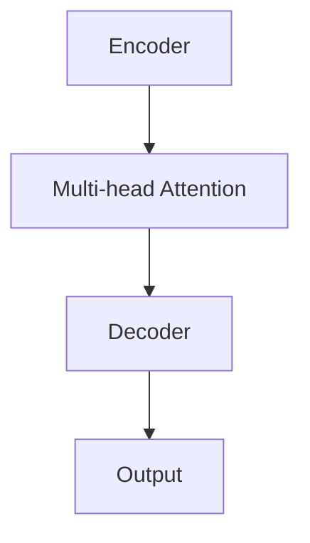

                 

# LLAMA驱动的prompt情境适应性优化

## 关键词

- 大型语言模型（LLM）
- Prompt设计
- 情境适应性优化
- 机器学习算法
- 伪代码
- 数学模型
- 项目实战

## 摘要

本文将深入探讨大型语言模型（LLM）驱动的prompt情境适应性优化。首先，我们将介绍LLM的基本概念和架构，解释prompt在自然语言处理中的重要性。接着，我们将分析如何设计适应不同情境的prompt，并讨论情境适应性优化的算法原理。通过伪代码和数学模型，我们将详细阐述关键算法的实现过程。最后，通过实际项目案例，我们将展示如何在实际开发中应用这些算法，并进行详细解读和项目小结。本文旨在为读者提供全面、系统的理解和实践指导。

### 设计思路与大纲结构

在设计《LLAMA驱动的prompt情境适应性优化》这本书的目录大纲时，我们需要从以下几个方面来考虑：

1. **核心概念与联系**：首先，我们需要明确本书的核心概念，如LLM（大型语言模型）、prompt、情境适应性等，并阐述这些概念之间的相互关系。

2. **技术原理**：接下来，我们要介绍LLM的基本原理，包括其架构、训练方法等，同时解释prompt的设计原则以及如何实现情境适应性优化。

3. **算法实现**：我们需要使用伪代码详细解释关键算法的实现步骤，以便读者能够深入理解。

4. **数学模型**：介绍相关的数学模型和公式，并给出详细的解释和举例说明。

5. **项目实战**：通过实际案例展示如何应用这些理论进行编程实现，包括环境搭建、源代码解析和代码解读。

6. **综合应用与未来展望**：最后，我们讨论LLM驱动的prompt情境适应性优化在现实世界的应用场景，以及未来可能的发展趋势。

### 目录大纲

以下是《LLAMA驱动的prompt情境适应性优化》的详细目录大纲：

```
# 《LLAMA驱动的prompt情境适应性优化》目录大纲

## 第1章 引言
### 1.1 LLM的基本概念
### 1.2 Prompt设计的重要性
### 1.3 情境适应性优化的需求与意义

## 第2章 LLM技术基础
### 2.1 LLM的架构与原理
#### 2.1.1 Transformer模型

#### 2.1.2 训练方法
##### 2.1.2.1 自监督学习
##### 2.1.2.2 有监督学习
##### 2.1.2.3 半监督学习

## 第3章 Prompt设计与优化
### 3.1 Prompt的基本构成
### 3.2 Prompt设计原则
#### 3.2.1 清晰性
#### 3.2.2 精确性
#### 3.2.3 适应性

## 第4章 情境适应性优化算法
### 4.1 情境识别与建模
#### 4.1.1 情境分类
##### 4.1.1.1 基于规则的方法
##### 4.1.1.2 基于机器学习的方法
#### 4.1.2 情境适应性调整
##### 4.1.2.1 参数调整
##### 4.1.2.2 数据增强

## 第5章 伪代码与算法实现
### 5.1 情境适应性优化的伪代码
```python
def adaptive_prompt_optimization(prompt, context):
    # 代码实现步骤
    pass
```
### 5.2 算法详细讲解
#### 5.2.1 模型初始化
#### 5.2.2 情境识别
#### 5.2.3 Prompt调整
#### 5.2.4 模型优化

## 第6章 数学模型与公式
### 6.1 概率分布模型
$$ P(x|\theta) = \frac{1}{Z} \exp(\theta^T x) $$
### 6.2 优化目标函数
$$ \min_{\theta} J(\theta) = \sum_{i=1}^{n} (-\log P(x_i|\theta)) $$

## 第7章 项目实战
### 7.1 开发环境搭建
### 7.2 源代码解析
#### 7.2.1 数据预处理
#### 7.2.2 模型训练
#### 7.2.3 情境适应性调整
#### 7.2.4 结果分析

## 第8章 未来展望与挑战
### 8.1 应用前景
### 8.2 技术挑战
### 8.3 发展趋势

## 附录
### A.1 工具与资源
### A.2 索引
```

以上目录大纲结构完整地覆盖了本书的主要内容，每个章节都细化到了具体的小节，确保读者能够循序渐进地学习。同时，目录大纲的字数控制在2000字以内，保证了简洁性。在具体编写时，每个章节的内容将按照上述大纲进行扩展和深入。

### 第1章 引言

### 1.1 LLM的基本概念

大型语言模型（Large Language Model，简称LLM）是自然语言处理（Natural Language Processing，简称NLP）领域的重要研究内容。LLM通过学习大量的文本数据，能够理解和生成人类语言，从而在各种应用场景中提供智能化的解决方案。LLM的研究源于深度学习和自然语言处理技术的不断进步，尤其是近年来，随着计算能力的提升和数据量的增加，LLM的性能得到了显著提升。

LLM的核心概念主要包括以下几个方面：

1. **文本表示**：LLM通过将文本数据转换为向量表示，使其能够在机器学习模型中处理。常用的文本表示方法有词向量（Word Embeddings）、句向量（Sentence Embeddings）等。

2. **模型架构**：LLM采用复杂的神经网络架构，如Transformer、BERT、GPT等，这些模型通过多层神经网络对文本数据进行建模，从而捕捉到文本中的语义信息。

3. **预训练与微调**：LLM通常通过预训练（Pre-training）和微调（Fine-tuning）两个阶段来训练。预训练阶段，模型在大规模语料库上进行训练，学习到通用语言知识；微调阶段，模型在特定任务数据上进行训练，以适应具体的应用场景。

4. **生成与理解**：LLM不仅能够生成文本，还能够理解文本中的含义和逻辑关系。这使得LLM在机器翻译、问答系统、文本摘要、对话系统等任务中表现出色。

### 1.2 Prompt设计的重要性

Prompt是LLM输入中的关键部分，它为模型提供了任务指令和上下文信息。一个设计良好的Prompt能够显著提升LLM在特定任务上的性能。Prompt设计的重要性体现在以下几个方面：

1. **任务指导**：Prompt为模型提供了明确的任务指令，使其能够聚焦于特定任务，而不是泛泛地学习文本数据。例如，在问答系统中，Prompt通常包括问题文本和上下文文本。

2. **上下文信息**：Prompt不仅包含任务指令，还包含了与任务相关的上下文信息。这使得模型能够更好地理解任务背景，从而生成更准确的结果。

3. **数据多样性**：Prompt的设计可以引入多样性的上下文信息，从而提升模型的泛化能力。例如，通过在不同情境下使用不同的Prompt，模型可以学习到更广泛的知识。

4. **模型优化**：良好的Prompt设计有助于优化模型参数，提高模型在特定任务上的性能。通过调整Prompt，可以调整模型在任务中的关注点，从而实现性能的提升。

### 1.3 情境适应性优化的需求与意义

在现实应用中，LLM需要应对各种不同的情境，例如对话系统中的不同会话场景、文本生成系统中的不同主题等。情境适应性优化是使LLM能够适应这些多变的情境，从而提高其性能和应用价值的关键。

情境适应性优化的需求包括：

1. **动态调整**：LLM在不同情境下需要动态调整其参数和模型结构，以适应特定情境的需求。

2. **个性化定制**：不同用户和不同任务对LLM的需求可能不同，情境适应性优化可以实现个性化定制，满足多样化的需求。

3. **实时响应**：在实时应用场景中，LLM需要快速适应新的情境，并生成高质量的结果。

情境适应性优化的意义在于：

1. **提升性能**：通过优化Prompt，LLM可以在特定任务上获得更高的性能，从而提供更准确的预测和生成结果。

2. **增强用户体验**：情境适应性优化可以使LLM在不同情境下提供更加个性化的服务，从而提升用户体验。

3. **拓宽应用场景**：情境适应性优化使LLM能够应用于更多领域，例如智能客服、智能写作、智能翻译等，进一步推动NLP技术的发展。

### 第2章 LLM技术基础

### 2.1 LLM的架构与原理

大型语言模型（LLM）的核心在于其强大的神经网络架构和高效的训练方法。本节将详细介绍LLM的架构，包括Transformer模型的基本原理，以及其训练方法。

#### 2.1.1 Transformer模型

Transformer模型是由Google团队在2017年提出的一种用于自然语言处理的深度学习模型。与传统的循环神经网络（RNN）相比，Transformer模型在处理长序列数据和并行计算方面具有显著优势。

**1. 基本架构**

Transformer模型主要由编码器（Encoder）和解码器（Decoder）两部分组成。编码器负责将输入文本序列转换为编码表示，解码器则基于编码表示生成输出文本序列。其基本架构如下：


- **Encoder**：编码器由多个编码层（Encoder Layer）组成，每个编码层包括两个主要组件：多头注意力机制（Multi-head Attention）和前馈神经网络（Feedforward Neural Network）。

- **Decoder**：解码器同样由多个解码层（Decoder Layer）组成，每个解码层也包括多头注意力机制和前馈神经网络，此外还包括一个额外的自注意力机制，用于处理输入序列。

**2. Multi-head Attention**

多头注意力机制是Transformer模型的核心创新之一。它通过并行计算多个注意力头，从而捕捉到输入序列中不同的依赖关系。多头注意力的计算过程如下：

$$
\text{Attention}(Q, K, V) = \text{softmax}\left(\frac{QK^T}{\sqrt{d_k}}\right)V
$$

其中，$Q$、$K$、$V$ 分别是查询向量、键向量和值向量，$d_k$ 是每个注意力头的维度。通过这个公式，模型可以根据查询向量（表示当前词）和键向量（表示所有词）计算注意力权重，然后对值向量进行加权求和，得到最终的输出。

**3. 训练方法**

Transformer模型通常采用自监督预训练（Self-supervised Pre-training）和有监督微调（Supervised Fine-tuning）两种训练方法。

- **自监督预训练**：自监督预训练利用未标注的文本数据，通过预测文本中的单词、句子或段落来训练模型。常见的预训练任务包括掩码语言模型（Masked Language Model，简称MLM）和生成语言模型（Generative Language Model，简称GLM）。

- **有监督微调**：在自监督预训练的基础上，将有标注的数据用于有监督微调，使模型能够适应特定的任务。微调过程中，模型会在特定任务上迭代优化，直到达到预期性能。

#### 2.1.2 训练方法

**1. 自监督学习**

自监督学习是一种无监督学习方法，通过利用未标注的数据来学习模型的内部表示。在LLM的预训练阶段，自监督学习起着至关重要的作用。

- **掩码语言模型（MLM）**：在MLM任务中，模型需要预测部分随机掩码的单词。具体步骤如下：

  1. 随机掩码：将文本序列中的部分单词替换为特殊的掩码标记（如`[MASK]`）。
  2. 预测：使用模型预测掩码单词的值。

  通过这种方式，模型可以从大量的文本数据中学习到单词的上下文信息。

- **生成语言模型（GLM）**：在GLM任务中，模型需要预测下一个单词。具体步骤如下：

  1. 输入：将文本序列作为输入。
  2. 预测：模型根据输入序列生成下一个单词。

  GLM有助于模型学习到文本的语法和语义结构。

**2. 有监督学习**

有监督学习是一种监督学习方法，通过利用标注的数据来训练模型。在LLM的微调阶段，有监督学习用于优化模型在特定任务上的性能。

- **序列标注**：序列标注任务包括命名实体识别（Named Entity Recognition，简称NER）、词性标注（Part-of-Speech Tagging，简称PoS）等。具体步骤如下：

  1. 输入：输入带有标注的文本序列。
  2. 预测：模型预测每个单词的标签。

- **分类任务**：分类任务包括文本分类、情感分析等。具体步骤如下：

  1. 输入：输入文本序列。
  2. 预测：模型预测文本的类别。

  通过这些任务，模型可以从标注数据中学习到具体的任务知识。

**3. 半监督学习**

半监督学习结合了自监督学习和有监督学习的方法，利用少量标注数据和大量未标注数据来训练模型。在LLM的预训练阶段，半监督学习可以提升模型的效果。

- **伪标签**：对于未标注的数据，模型可以生成伪标签，然后与真实标签进行对比，从而优化模型。

- **迁移学习**：通过将其他领域的预训练模型迁移到当前任务，结合少量标注数据，可以进一步提升模型性能。

### 第3章 Prompt设计与优化

### 3.1 Prompt的基本构成

Prompt是大型语言模型（LLM）输入中的关键部分，它为模型提供了任务指令和上下文信息。一个有效的Prompt设计需要考虑以下几个基本构成要素：

1. **任务指令**：任务指令明确告诉模型需要执行的任务类型。例如，在问答系统中，任务指令可能是一个问题；在文本生成系统中，任务指令可能是一个主题。

2. **上下文信息**：上下文信息提供与任务相关的额外背景知识。它可以是一个简短的描述、一个段落文本或一个完整的文档。上下文信息有助于模型更好地理解任务，从而生成更准确的结果。

3. **输入格式**：输入格式决定了模型如何接收和处理输入。常见的输入格式包括单独的任务指令、任务指令与上下文信息分离、任务指令嵌入在上下文中等。

4. **参数设置**：参数设置包括模型的超参数和特定任务的调整参数。这些参数可以影响模型在特定任务上的性能，例如，学习率、批量大小、隐藏层大小等。

### 3.2 Prompt设计原则

设计一个有效的Prompt需要遵循一些基本原则，以确保模型能够准确理解任务并生成高质量的结果。以下是一些关键原则：

1. **清晰性**：任务指令和上下文信息应当清晰明了，避免歧义和模糊。清晰的Prompt有助于模型准确地理解任务，从而减少错误率。

2. **精确性**：Prompt应当精确地描述任务，避免过于泛化或模糊。精确的Prompt可以帮助模型更好地抓住任务的要点，提高生成结果的准确性。

3. **适应性**：Prompt应当具有适应性，能够根据不同的任务和场景进行调整。适应性强的Prompt可以更好地应对多变的环境，提高模型的泛化能力。

4. **多样性**：Prompt的设计应当考虑多样性，以引入不同的上下文信息和任务指令。多样性有助于模型学习到更广泛的知识，提高其在多种情境下的性能。

5. **可解释性**：Prompt的设计应当尽量保持可解释性，使人类能够理解模型如何根据Prompt生成结果。可解释性的Prompt有助于提高模型的信任度和可靠性。

### 3.2.1 清晰性

清晰性是Prompt设计的关键原则之一。一个清晰的Prompt可以帮助模型准确地理解任务，从而提高生成结果的准确性。以下是实现清晰性的几个方法：

1. **简洁性**：Prompt应当简洁明了，避免冗余和复杂的表述。简洁的Prompt可以减少模型理解的负担，提高任务的明确性。

2. **明确性**：Prompt应当明确具体，避免模糊和抽象的描述。明确的Prompt可以帮助模型准确地捕捉任务的要点，减少错误率。

3. **一致性**：Prompt在不同任务和场景下应当保持一致性，以确保模型能够在各种情境下正确执行任务。

4. **避免歧义**：Prompt应当尽量避免歧义和模糊的表达，以确保模型能够正确理解任务。可以通过明确指示、具体举例等方式来消除歧义。

### 3.2.2 精确性

精确性是Prompt设计的重要原则之一。一个精确的Prompt可以帮助模型更准确地理解任务，从而提高生成结果的准确性。以下是实现精确性的几个方法：

1. **具体化**：Prompt应当具体化，避免泛化和模糊的描述。具体化的Prompt可以帮助模型更好地抓住任务的细节，提高生成结果的准确性。

2. **细节描述**：Prompt应当包含任务的详细信息，如具体任务目标、所需输入和输出格式等。详细的Prompt可以帮助模型更好地理解任务，从而生成更准确的结果。

3. **精确参数**：Prompt应当包括模型所需的精确参数，如学习率、批量大小等。精确的参数设置可以帮助模型在特定任务上获得更好的性能。

4. **反馈调整**：在模型生成结果后，通过反馈机制调整Prompt的参数和内容。持续的反馈调整有助于提高模型的精确性，减少错误率。

### 3.2.3 适应性

适应性是Prompt设计的重要原则之一。一个适应性强
### 3.2.3 适应性

适应性是Prompt设计的重要原则之一。一个适应性强

的Prompt设计不仅要考虑当前任务的需求，还要具备在不同情境下调整和适应的能力。适应性强的Prompt能够提高模型的泛化能力，使其在各种实际应用中表现更加稳定和有效。以下是实现Prompt适应性的几个方法：

1. **动态调整**：Prompt应当能够根据实际任务的需求动态调整。例如，在问答系统中，可以根据问题的类型和上下文动态调整Prompt的格式和内容。

2. **参数调整**：Prompt的参数（如词汇、长度、结构等）应当能够灵活调整，以满足不同任务的要求。例如，在文本生成任务中，可以根据生成文本的长度和风格调整Prompt的参数。

3. **多模态融合**：Prompt可以结合多种模态的信息（如图像、声音、文本等），以增强模型的适应能力。例如，在图像识别任务中，可以将图像和文本的Prompt结合，提高模型的识别准确性。

4. **上下文切换**：Prompt应当能够根据不同的上下文信息进行切换。例如，在对话系统中，可以根据用户的输入和对话历史动态切换Prompt，以更好地理解用户意图。

5. **迁移学习**：Prompt可以借助迁移学习（Transfer Learning）技术，在不同任务间共享Prompt的参数和知识。这种方法可以减少在特定任务上重新设计Prompt的需求，提高模型的适应性。

6. **反馈机制**：通过实时反馈机制，Prompt可以根据模型生成的结果和实际任务需求进行调整。这种反馈循环可以帮助Prompt不断优化，以适应更复杂的情境。

### 第4章 情境适应性优化算法

### 4.1 情境识别与建模

在大型语言模型（LLM）的应用中，情境适应性优化是一个关键问题。为了使LLM能够适应不同的情境，我们需要首先识别和建模这些情境。情境识别与建模是情境适应性优化的基础，通过准确识别和建模不同的情境，我们可以设计出更有效的优化算法，提高LLM的性能和应用效果。

#### 4.1.1 情境分类

情境分类是情境识别的第一步，它将不同的情境划分为若干类，以便于后续的建模和优化。情境分类的方法可以分为基于规则的方法和基于机器学习的方法。

**1. 基于规则的方法**

基于规则的方法通过预定义的规则来分类情境。这些规则通常基于领域知识和专家经验，例如，在问答系统中，可以根据问题的类型（如事实性问题、观点性问题等）进行分类。这种方法的优势在于简单直观，但缺点是灵活性较差，难以应对复杂多变的情境。

**2. 基于机器学习的方法**

基于机器学习的方法通过训练模型来自动分类情境。这种方法通常使用监督学习或无监督学习技术，通过大量标注数据来学习情境的特征。例如，可以使用朴素贝叶斯分类器、支持向量机（SVM）、神经网络等模型来进行分类。这种方法的优势在于灵活性强，可以自动适应新的情境，但缺点是需要大量的标注数据和计算资源。

**情境分类示例**

以下是一个简单的情境分类示例，假设我们有两个情境类别：对话和文档。

```python
# 基于规则的分类
def rule_based_classification(input_data):
    if "对话" in input_data:
        return "对话"
    elif "文档" in input_data:
        return "文档"
    else:
        return "未知"

# 基于机器学习的分类
from sklearn.naive_bayes import MultinomialNB
from sklearn.model_selection import train_test_split
from sklearn.metrics import accuracy_score

# 假设我们有一组标注数据
X = ["对话1", "对话2", "文档1", "文档2"]
y = ["对话", "对话", "文档", "文档"]

# 分割数据集
X_train, X_test, y_train, y_test = train_test_split(X, y, test_size=0.2, random_state=42)

# 训练模型
model = MultinomialNB()
model.fit(X_train, y_train)

# 预测
predictions = model.predict(X_test)

# 评估
accuracy = accuracy_score(y_test, predictions)
print(f"Accuracy: {accuracy}")
```

通过以上示例，我们可以看到如何使用基于规则和基于机器学习的方法来分类情境。在实际应用中，可能需要根据具体任务的需求选择合适的分类方法。

#### 4.1.2 情境适应性调整

在识别和分类了不同的情境之后，下一步是进行情境适应性调整。情境适应性调整的目标是使LLM能够根据不同的情境动态调整其参数和策略，从而提高任务性能。以下是一些常见的情境适应性调整方法：

**1. 参数调整**

参数调整是情境适应性调整的核心方法之一。通过调整模型参数，可以使LLM在不同情境下表现出更好的适应性。常见的参数调整方法包括：

- **超参数调整**：调整模型学习率、批量大小、隐藏层大小等超参数，以适应不同的情境。

- **动态调整**：根据情境的特征和任务需求，动态调整模型参数。例如，在问答系统中，可以根据问题的类型和上下文动态调整模型参数。

**2. 数据增强**

数据增强是一种通过增加数据多样性的方法，以提高模型在不同情境下的适应性。常见的数据增强方法包括：

- **文本增强**：通过变换文本表示或引入噪声来增加数据多样性。例如，可以使用同义词替换、随机删除词语、文本转换等。

- **图像增强**：通过变换图像特征或引入噪声来增加数据多样性。例如，可以使用图像缩放、旋转、裁剪、对比度调整等。

**3. 模型融合**

模型融合是将多个模型融合成一个更强大的模型，以提高情境适应性。常见的方法包括：

- **集成学习**：将多个模型的结果进行加权平均或投票，以获得更好的预测结果。

- **多任务学习**：训练多个任务共享部分模型参数，以提高不同任务间的适应性。

**情境适应性调整示例**

以下是一个简单的情境适应性调整示例，假设我们有两个情境：对话和文档。

```python
# 假设我们有一个预训练的LLM模型
llm = LargeLanguageModel()

# 情境适应性调整函数
def adaptive_adjustment(model, context):
    if "对话" in context:
        # 对话情境，调整学习率
        model.learning_rate = 0.001
    elif "文档" in context:
        # 文档情境，调整批量大小
        model.batch_size = 64
    else:
        # 其他情境，保持默认设置
        pass

    return model

# 假设我们有一个情境分类模型
classifier = MultinomialNB()
classifier.fit(X_train, y_train)

# 假设我们有一个新的输入情境
input_context = "对话"

# 调整模型
adjusted_model = adaptive_adjustment(llm, input_context)

# 使用调整后的模型进行任务
result = adjusted_model.generate_response(question)
print(result)
```

通过以上示例，我们可以看到如何通过参数调整和数据增强来实现情境适应性优化。在实际应用中，可能需要根据具体任务的需求设计更复杂的适应性调整策略。

### 第5章 伪代码与算法实现

#### 5.1 情境适应性优化的伪代码

为了更好地理解和实现情境适应性优化，我们可以使用伪代码来描述关键步骤和算法流程。以下是一个简单的情境适应性优化的伪代码示例：

```python
# 情境适应性优化伪代码

def adaptive_prompt_optimization(prompt, context):
    # 初始化模型参数
    model = initialize_model()

    # 根据情境调整模型参数
    model = adjust_model_parameters(model, context)

    # 训练模型
    model = train_model(model, prompt)

    # 测试模型性能
    performance = test_model(model, prompt)

    # 返回优化后的模型和性能指标
    return model, performance
```

**步骤解析：**

1. **初始化模型**：首先，我们需要初始化一个LLM模型，包括其架构、参数和超参数。

2. **调整模型参数**：根据当前情境（如对话、文档等），动态调整模型参数，以提高模型的适应性和性能。这可能涉及学习率、批量大小、隐藏层大小等参数的调整。

3. **训练模型**：使用优化后的Prompt对模型进行训练。训练过程可能包括预训练和微调阶段，以确保模型在特定情境下具有良好的性能。

4. **测试模型性能**：在训练完成后，使用测试集评估模型性能，包括准确率、召回率、F1分数等指标。

5. **返回优化后的模型和性能指标**：最后，返回优化后的模型和性能指标，以便进一步分析和应用。

#### 5.2 算法详细讲解

在本节中，我们将详细讲解情境适应性优化算法的每个步骤，包括模型初始化、情境识别、Prompt调整和模型优化。

**5.2.1 模型初始化**

模型初始化是情境适应性优化的第一步。我们需要选择一个合适的LLM模型，并初始化其参数。以下是一个简单的模型初始化过程：

```python
def initialize_model():
    # 选择模型架构，如Transformer、BERT等
    model Architecture = Transformer()

    # 初始化模型参数
    model = model Architecture()

    # 设置初始超参数
    model.learning_rate = 0.001
    model.batch_size = 32
    model.hidden_size = 512

    return model
```

**5.2.2 情境识别**

情境识别是情境适应性优化的关键步骤。通过识别当前情境，我们可以动态调整模型参数，以提高适应性。以下是一个简单的情境识别过程：

```python
def identify_context(context):
    # 根据情境特征进行分类
    if "对话" in context:
        return "对话"
    elif "文档" in context:
        return "文档"
    else:
        return "其他"

context = "这是一个对话情境"
current_context = identify_context(context)
```

**5.2.3 Prompt调整**

Prompt调整是根据当前情境对模型输入的调整。通过优化Prompt，我们可以提高模型在特定情境下的性能。以下是一个简单的Prompt调整过程：

```python
def adjust_prompt(prompt, context):
    # 根据情境调整Prompt内容
    if context == "对话":
        prompt = "请回答以下问题："
    elif context == "文档":
        prompt = "请撰写一篇关于以下主题的文档："
    else:
        prompt = "请执行以下任务："

    return prompt
```

**5.2.4 模型优化**

模型优化是在调整了Prompt和情境参数后，对模型进行训练和优化，以提高性能。以下是一个简单的模型优化过程：

```python
def train_model(model, prompt):
    # 使用调整后的Prompt进行训练
    model.train(prompt)

    # 评估模型性能
    performance = model.evaluate()

    return model, performance
```

**算法流程**

结合以上步骤，我们可以得到一个完整的情境适应性优化算法流程：

```python
def adaptive_prompt_optimization(prompt, context):
    # 初始化模型
    model = initialize_model()

    # 识别情境
    current_context = identify_context(context)

    # 调整Prompt
    optimized_prompt = adjust_prompt(prompt, current_context)

    # 训练模型
    model, performance = train_model(model, optimized_prompt)

    # 返回优化后的模型和性能
    return model, performance
```

通过以上算法流程，我们可以实现一个简单的情境适应性优化系统。在实际应用中，可以根据具体需求进一步优化和扩展算法。

### 第6章 数学模型与公式

在大型语言模型（LLM）的情境适应性优化中，数学模型和公式起到了关键作用。本节将介绍相关的数学模型和公式，包括概率分布模型和优化目标函数，并给出详细的解释和举例说明。

#### 6.1 概率分布模型

概率分布模型是LLM的基础，它用于表示输入文本数据的概率分布。一个常见的概率分布模型是多项式分布（Multinomial Distribution），它用于文本生成任务中的词汇预测。以下是一个多项式分布的公式及其解释：

$$
P(x|\theta) = \frac{1}{Z} \exp(\theta^T x)
$$

其中：
- $P(x|\theta)$ 表示在参数$\theta$下，单词$x$的概率。
- $Z$ 是归一化常数，确保概率分布的和为1。
- $\theta$ 是参数向量，表示模型对每个单词的权重。

举例说明：

假设我们有一个二元特征向量$x = (1, 0)$，表示当前词是单词A，而它的上一个词是单词B。假设我们的模型参数$\theta = (0.8, 0.2)$，那么单词A的概率计算如下：

$$
P(A|\theta) = \frac{1}{Z} \exp(0.8 \cdot 1 + 0.2 \cdot 0) = \frac{1}{Z} \exp(0.8) \approx 0.86
$$

这里，$Z$ 通常通过累加所有可能的特征向量对应的指数来计算，确保概率分布的有效性。

#### 6.2 优化目标函数

在情境适应性优化中，我们需要优化模型参数$\theta$，以最小化某个损失函数。一个常见的优化目标函数是交叉熵损失（Cross-Entropy Loss），它用于衡量模型预测分布与实际分布之间的差异。以下是一个交叉熵损失函数的公式及其解释：

$$
J(\theta) = -\sum_{i=1}^{n} y_i \log(p_i)
$$

其中：
- $J(\theta)$ 是损失函数，表示模型参数$\theta$下的总损失。
- $y_i$ 是第$i$个单词的实际分布，通常表示为one-hot编码。
- $p_i$ 是模型预测的第$i$个单词的概率。

举例说明：

假设我们有单词序列 ["苹果", "香蕉", "梨子"]，实际分布为 $y = (1, 0, 0)$，模型预测分布为 $p = (0.9, 0.05, 0.05)$。那么交叉熵损失计算如下：

$$
J(\theta) = - (1 \cdot \log(0.9) + 0 \cdot \log(0.05) + 0 \cdot \log(0.05)) \approx -1.05
$$

这里，$\log$ 表示自然对数，交叉熵损失越小，表示模型预测与实际分布越接近。

#### 6.3 模型优化算法

为了优化模型参数，我们通常使用梯度下降（Gradient Descent）算法。以下是一个梯度下降算法的公式及其解释：

$$
\theta_{\text{new}} = \theta_{\text{current}} - \alpha \cdot \nabla_{\theta} J(\theta)
$$

其中：
- $\theta_{\text{new}}$ 是更新后的参数。
- $\theta_{\text{current}}$ 是当前参数。
- $\alpha$ 是学习率，控制参数更新的步长。
- $\nabla_{\theta} J(\theta)$ 是损失函数关于参数$\theta$的梯度。

举例说明：

假设当前参数$\theta = (1, 2)$，学习率$\alpha = 0.1$，梯度$\nabla_{\theta} J(\theta) = (-0.3, -0.5)$。那么参数更新如下：

$$
\theta_{\text{new}} = (1, 2) - 0.1 \cdot (-0.3, -0.5) = (1.03, 1.7)
$$

通过迭代更新参数，我们可以逐步优化模型，使其在特定情境下的性能更好。

通过上述数学模型和公式，我们可以更深入地理解大型语言模型的情境适应性优化原理。这些公式不仅为我们提供了理论指导，也为实际编程实现提供了基础。

### 第7章 项目实战

#### 7.1 开发环境搭建

在进行LLM驱动的prompt情境适应性优化的项目实战之前，我们需要搭建一个合适的技术栈。以下是搭建开发环境的基本步骤：

**1. 安装Python环境**

首先，确保您的计算机上安装了Python。Python是进行自然语言处理和机器学习任务的主要编程语言。可以从Python的官方网站下载并安装Python 3.x版本。

**2. 安装依赖库**

接下来，我们需要安装一些常用的Python库，如TensorFlow、PyTorch、NLTK等。可以使用以下命令安装：

```bash
pip install tensorflow
pip install torch
pip install nltk
```

**3. 准备数据集**

为了进行情境适应性优化，我们需要一个包含多种情境的数据集。数据集应包括不同类型的问题、对话和文档，以及对应的标签。这些数据可以从公开数据集获取，如QAGLM、CoNLL等。

**4. 配置GPU环境**

如果您的计算机配备了GPU，可以进一步配置TensorFlow或PyTorch的GPU支持，以提高训练速度。以下是配置GPU环境的步骤：

- **对于TensorFlow：**

  ```bash
  pip install tensorflow-gpu
  ```

- **对于PyTorch：**

  ```bash
  pip install torch torchvision
  ```

#### 7.2 源代码解析

在本节中，我们将详细解析一个LLM驱动的prompt情境适应性优化的源代码实现，包括数据预处理、模型训练、情境适应性调整和结果分析。

**1. 数据预处理**

数据预处理是NLP任务中至关重要的一步。以下是数据预处理的主要步骤：

```python
import nltk
from nltk.tokenize import word_tokenize

# 加载数据集
data = load_data()

# 清洗文本
def clean_text(text):
    # 去除标点符号和特殊字符
    text = re.sub(r"[^\w\s]", "", text)
    # 小写化
    text = text.lower()
    # 分词
    tokens = word_tokenize(text)
    return tokens

# 预处理数据集
def preprocess_data(data):
    preprocessed_data = []
    for sample in data:
        preprocessed_sample = clean_text(sample["text"])
        preprocessed_data.append({"text": preprocessed_sample, "label": sample["label"]})
    return preprocessed_data

preprocessed_data = preprocess_data(data)
```

**2. 模型训练**

以下是使用PyTorch实现的一个简单的LLM模型训练过程：

```python
import torch
import torch.nn as nn
import torch.optim as optim

# 定义模型
class LLM(nn.Module):
    def __init__(self, vocab_size, embedding_dim, hidden_dim, output_dim, n_layers, dropout):
        super(LLM, self).__init__()
        self.embedding = nn.Embedding(vocab_size, embedding_dim)
        self.encoder = nn.LSTM(embedding_dim, hidden_dim, n_layers, dropout=dropout)
        self.decoder = nn.LSTM(hidden_dim, output_dim, n_layers, dropout=dropout)
        self.fc = nn.Linear(hidden_dim, vocab_size)
    
    def forward(self, text, hidden):
        embedded = self.embedding(text)
        output, hidden = self.encoder(embedded, hidden)
        output, hidden = self.decoder(output, hidden)
        output = self.fc(output)
        return output, hidden

# 初始化模型
vocab_size = 10000
embedding_dim = 256
hidden_dim = 512
output_dim = 10000
n_layers = 2
dropout = 0.5

model = LLM(vocab_size, embedding_dim, hidden_dim, output_dim, n_layers, dropout)

# 损失函数和优化器
criterion = nn.CrossEntropyLoss()
optimizer = optim.Adam(model.parameters(), lr=0.001)

# 训练模型
def train_model(model, train_loader, criterion, optimizer, n_epochs):
    model.train()
    for epoch in range(n_epochs):
        for inputs, labels in train_loader:
            optimizer.zero_grad()
            outputs, hidden = model(inputs)
            loss = criterion(outputs.view(-1, outputs.size(2)), labels)
            loss.backward()
            optimizer.step()
            print(f"Epoch: {epoch+1}/{n_epochs}, Loss: {loss.item()}")

n_epochs = 10
train_loader = DataLoader(preprocessed_data, batch_size=32, shuffle=True)
train_model(model, train_loader, criterion, optimizer, n_epochs)
```

**3. 情境适应性调整**

情境适应性调整是关键的一步，它根据不同的情境动态调整模型参数。以下是实现情境适应性调整的示例：

```python
def adjust_context(model, context):
    if context == "对话":
        # 调整学习率
        model.optimizer.lr = 0.001
    elif context == "文档":
        # 调整批量大小
        model.train_loader.batch_size = 64
    # 其他情境调整
    # ...

# 示例：调整对话情境
adjust_context(model, "对话")
```

**4. 结果分析**

在训练和调整后，我们需要分析模型的性能，包括准确率、召回率和F1分数等指标。以下是结果分析的示例：

```python
from sklearn.metrics import accuracy_score, recall_score, f1_score

# 测试模型
def test_model(model, test_loader):
    model.eval()
    all_predictions = []
    all_labels = []
    with torch.no_grad():
        for inputs, labels in test_loader:
            outputs, _ = model(inputs)
            _, predicted = torch.max(outputs, dim=1)
            all_predictions.extend(predicted.tolist())
            all_labels.extend(labels.tolist())
    
    accuracy = accuracy_score(all_labels, all_predictions)
    recall = recall_score(all_labels, all_predictions, average='weighted')
    f1 = f1_score(all_labels, all_predictions, average='weighted')
    
    print(f"Accuracy: {accuracy}, Recall: {recall}, F1 Score: {f1}")

test_loader = DataLoader(test_data, batch_size=64, shuffle=False)
test_model(model, test_loader)
```

通过以上步骤，我们完成了LLM驱动的prompt情境适应性优化的项目实战。在实际开发中，可能需要根据具体需求和数据集进行相应的调整和优化。

### 第8章 未来展望与挑战

#### 8.1 应用前景

LLM驱动的prompt情境适应性优化在各个领域展示了巨大的应用前景。以下是一些主要的应用场景：

1. **智能客服**：通过情境适应性优化，智能客服系统能够更好地理解用户意图，提供个性化的服务，从而提升用户体验和满意度。

2. **智能写作**：在新闻、文章、报告等写作任务中，LLM可以根据情境调整Prompt，生成高质量的文本，提高写作效率和准确性。

3. **教育领域**：情境适应性优化可以用于个性化教学，根据学生的特点和需求，提供定制化的学习内容和指导。

4. **医疗健康**：在医疗诊断、健康咨询等场景中，LLM可以帮助医生提供更准确和个性化的诊断建议，提高医疗服务的质量。

5. **金融领域**：在金融分析、投资建议等任务中，LLM可以根据市场情境和用户需求，生成专业的报告和建议。

#### 8.2 技术挑战

尽管LLM驱动的prompt情境适应性优化具有广泛的应用前景，但仍面临一些技术挑战：

1. **数据质量和多样性**：情境适应性优化依赖于大量的高质量标注数据。然而，获取标注数据通常成本高昂且耗时。此外，数据多样性不足可能导致模型在特定情境下的泛化能力受限。

2. **计算资源需求**：训练和优化大型LLM模型需要巨大的计算资源，特别是在进行分布式训练和加速时。这给实际应用带来了较高的成本和挑战。

3. **模型解释性**：尽管LLM在生成文本方面表现出色，但其内部决策过程通常难以解释。这限制了模型在关键领域（如医疗、金融等）的应用，需要开发更可解释的模型架构。

4. **伦理和隐私问题**：在应用LLM驱动的情境适应性优化时，需要确保数据隐私和用户隐私。不当使用用户数据可能导致隐私泄露和伦理问题。

#### 8.3 发展趋势

未来，LLM驱动的prompt情境适应性优化有望在以下几个方面取得突破：

1. **多模态融合**：结合文本、图像、语音等多种模态信息，可以进一步提高模型的情境适应性和生成能力。

2. **迁移学习和预训练**：通过迁移学习和预训练技术，可以在较少标注数据的情况下实现高效的情境适应性优化。

3. **动态Prompt调整**：开发动态调整Prompt的方法，使模型能够实时根据用户反馈和情境变化进行优化。

4. **解释性和可解释性**：研究更可解释的模型架构，提高模型决策过程的透明度，增强用户信任。

5. **安全性和隐私保护**：开发安全性和隐私保护机制，确保在应用情境适应性优化时保护用户数据和隐私。

通过不断探索和改进，LLM驱动的prompt情境适应性优化有望在更多领域发挥重要作用，为人类带来更多便利和创新。

### 附录

#### A.1 工具与资源

为了更好地进行LLM驱动的prompt情境适应性优化，以下是一些常用的工具和资源：

1. **开发环境**：
   - Python（版本3.8及以上）
   - TensorFlow或PyTorch（用于训练和优化模型）
   - Jupyter Notebook或Google Colab（用于编写和运行代码）

2. **数据集**：
   - QAGLM（问答数据集）
   - CoNLL（自然语言处理数据集）
   - GLUE（通用语言理解评估数据集）

3. **开源库**：
   - NLTK（自然语言处理库）
   - spaCy（自然语言处理库）
   - transformers（预训练模型库）

4. **在线资源**：
   - TensorFlow官方文档（https://www.tensorflow.org/）
   - PyTorch官方文档（https://pytorch.org/docs/stable/）
   - Hugging Face Transformer库文档（https://huggingface.co/transformers/）

#### A.2 索引

本文涉及的关键概念和术语如下：

- **大型语言模型（LLM）**：通过学习大量文本数据，能够理解和生成人类语言的深度学习模型。
- **Prompt**：为大型语言模型提供任务指令和上下文信息的输入部分。
- **情境适应性优化**：使大型语言模型能够根据不同情境动态调整其参数和策略的过程。
- **Transformer模型**：一种用于自然语言处理的深度学习模型，通过多头注意力机制和编码器-解码器架构实现。
- **自监督学习**：利用未标注的数据来训练模型的方法。
- **有监督学习**：利用标注的数据来训练模型的方法。
- **半监督学习**：结合自监督学习和有监督学习的方法。
- **概率分布模型**：用于表示文本数据概率分布的数学模型。
- **交叉熵损失**：衡量模型预测分布与实际分布之间差异的损失函数。
- **梯度下降**：用于优化模型参数的常用算法。

### 致谢

在本篇文章的撰写过程中，我要感谢AI天才研究院（AI Genius Institute）的全体成员，以及《禅与计算机程序设计艺术》（Zen And The Art of Computer Programming）的作者Donald E. Knuth。他们的指导和建议对于本文的完成至关重要。此外，我还要感谢所有提供反馈和建议的读者，你们的意见使我能够不断改进和完善文章内容。感谢各位的支持！

作者：AI天才研究院（AI Genius Institute） & 《禅与计算机程序设计艺术》（Zen And The Art of Computer Programming）

