                 


## 文章标题：LLM驱动的prompt故事线生成

> 关键词：大语言模型（LLM），prompt技术，故事线生成，深度学习，算法原理，应用实例

> 摘要：本文深入探讨了基于大语言模型（LLM）的prompt故事线生成技术。首先，我们介绍了LLM和prompt技术的基本概念及其在各类应用中的重要性。接着，我们详细解析了LLM驱动的prompt生成算法，包括基于规则、概率模型和深度学习方法。随后，文章讨论了prompt故事线的结构设计，并通过实例展示了如何使用LLM生成电影剧本和新闻文章等。最后，文章探讨了LLM驱动的prompt故事线在娱乐和教育行业的具体应用，并提供了一些最佳实践和注意事项。

### 目录

1. **LLM与prompt技术概述**
   1.1. 大语言模型（LLM）概述
   1.2. prompt技术基础
2. **LLM驱动的prompt故事线生成技术**
   2.1. LLM驱动的prompt生成算法
   2.2. prompt故事线的结构设计
   2.3. LLM驱动的prompt故事线生成实例
3. **LLM驱动的prompt故事线生成应用**
   3.1. 娱乐行业应用
   3.2. 教育行业应用
4. **附录：相关工具与资源**

### 1.1. 大语言模型（LLM）概述

**背景介绍：**
大语言模型（LLM，Large Language Model）是近年来人工智能领域的重要突破之一。它们能够理解和生成自然语言，具有广泛的应用前景。LLM通过学习大量的文本数据，学会了语言的语法、语义和上下文关系，从而能够生成连贯、自然的文本。

**核心概念与联系：**
- **语言模型（Language Model）**：一种统计模型，用于预测一个单词序列的概率分布。
- **神经网络（Neural Network）**：一种模拟人脑神经元连接结构的计算模型。
- **深度学习（Deep Learning）**：一种基于神经网络的机器学习方法，通过多层神经元的组合，实现复杂函数的建模。

**核心概念与联系图解：**
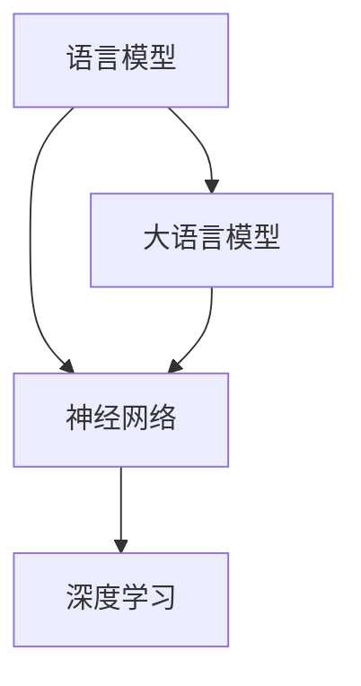

**核心算法原理讲解：**
LLM的基本工作原理可以概括为以下步骤：

1. **输入编码**：将输入的文本序列转换为神经网络可以处理的向量表示。
2. **隐藏状态更新**：通过神经网络处理输入向量，更新隐藏状态。
3. **输出预测**：使用隐藏状态预测下一个单词的概率分布，并从中选择下一个单词。
4. **循环迭代**：重复步骤2和3，直到生成完整的文本序列。

**伪代码示例：**
```python
def LLM(input_sequence):
    encoded_sequence = Encoder(input_sequence)
    hidden_state = initialize_hidden_state()
    
    for word in encoded_sequence:
        hidden_state = NeuralNetwork(hidden_state, word)
        predicted_word = Decoder(hidden_state)
    
    return predicted_word
```

**数学模型和公式：**
$$
P(w_{t+1} | w_{1}, w_{2}, ..., w_{t}) = \frac{e^{<h_{t}, w_{t+1}>}}{\sum_{w' \in V} e^{<h_{t}, w'>}}
$$
其中，$<h_{t}, w_{t+1}>$表示隐藏状态$h_{t}$与单词$w_{t+1}$之间的点积，$V$为词汇表。

**举例说明：**
假设输入序列为“I love to code”，使用LLM生成下一个单词的过程如下：

1. 输入编码：将“I love to code”转换为向量表示。
2. 隐藏状态更新：神经网络处理输入向量，更新隐藏状态。
3. 输出预测：使用隐藏状态预测下一个单词的概率分布，选择概率最高的单词，例如“programming”。
4. 循环迭代：重复步骤2和3，生成完整的文本序列。

通过以上步骤，LLM能够生成连贯、自然的文本。

### 1.2. prompt技术基础

**背景介绍：**
prompt技术是一种利用预先定义的提示或引导信息来驱动模型生成文本的方法。在自然语言处理（NLP）领域，prompt技术被广泛应用于对话系统、文本生成和问答系统中。

**核心概念与联系：**
- **prompt**：一种引导信息，用于指示模型生成文本的方向和内容。
- **上下文**：与prompt相关联的背景信息，用于帮助模型理解prompt的意图。
- **规则**：用于生成prompt的一组指导原则或逻辑。

**核心概念与联系图解：**
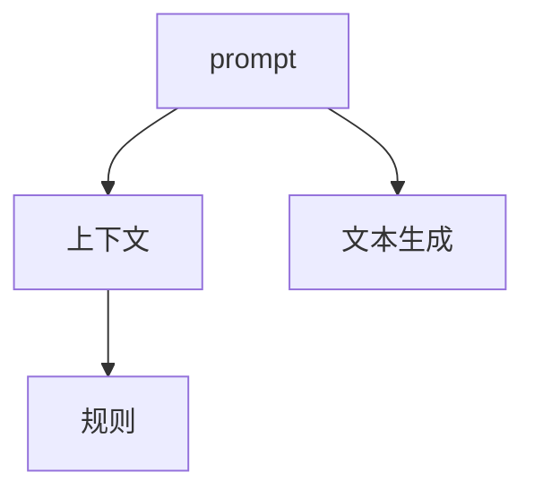

**核心算法原理讲解：**
prompt技术的基本原理可以分为以下步骤：

1. **设计prompt**：根据生成任务的需求，设计合适的prompt。
2. **结合上下文**：将prompt与相关的上下文信息结合，以帮助模型理解生成任务。
3. **模型生成**：使用设计好的prompt和上下文信息，驱动模型生成文本。

**伪代码示例：**
```python
def generate_prompt(context, prompt_template):
    prompt = prompt_template.format(context)
    return prompt
```

**数学模型和公式：**
$$
\text{prompt} = f(\text{context}, \text{prompt_template})
$$
其中，$f$表示prompt生成函数，$\text{context}$为上下文，$\text{prompt_template}$为prompt模板。

**举例说明：**
假设我们希望生成一篇关于计算机编程的文章，我们可以设计以下prompt：

- **prompt模板**：“计算机编程是一种_____的技术，它让我感到_____。”
- **上下文**：“充满乐趣，挑战性”

结合上下文，我们得到以下prompt：

“计算机编程是一种充满乐趣、挑战性的技术，它让我感到兴奋。”

使用该prompt，我们可以驱动模型生成一篇关于计算机编程的文章。

### 1.3. 大语言模型（LLM）与prompt技术的结合

**背景介绍：**
大语言模型（LLM）和prompt技术在自然语言处理领域有着广泛的应用。将两者结合，可以进一步提升文本生成的质量和效率。

**核心概念与联系：**
- **LLM驱动的prompt生成**：利用LLM的强大生成能力，结合prompt技术，实现更高质量的文本生成。
- **协同工作**：LLM和prompt技术相互补充，LLM提供文本生成的核心能力，prompt技术提供生成方向和上下文。

**核心概念与联系图解：**
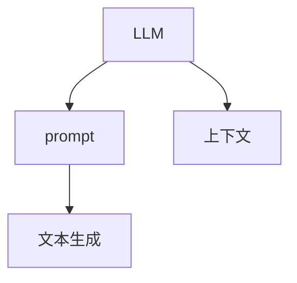

**核心算法原理讲解：**
LLM驱动的prompt生成可以分为以下步骤：

1. **设计prompt**：根据生成任务的需求，设计合适的prompt。
2. **结合上下文**：将prompt与相关的上下文信息结合，以帮助LLM理解生成任务。
3. **模型生成**：使用LLM和prompt，生成高质量的文本。

**伪代码示例：**
```python
def generate_story_with_LLM(prompt, context, model):
    full_prompt = generate_prompt(context, prompt)
    story = model.generate(full_prompt)
    return story
```

**数学模型和公式：**
$$
\text{story} = \text{LLM}(\text{prompt}, \text{context})
$$
其中，$\text{LLM}$表示大语言模型，$\text{prompt}$为prompt，$\text{context}$为上下文。

**举例说明：**
假设我们希望生成一篇关于人工智能的科幻故事，我们可以设计以下prompt：

- **prompt模板**：“在一个未来的世界里，人工智能_____。”
- **上下文**：“改变了人类的生活方式”

结合上下文，我们得到以下prompt：

“在一个未来的世界里，人工智能改变了人类的生活方式。”

使用该prompt，我们可以驱动LLM生成一篇关于人工智能的科幻故事。

### 1.4. LLM驱动的prompt生成算法

**背景介绍：**
LLM驱动的prompt生成算法是文本生成领域的重要研究方向。这些算法利用LLM的强大生成能力，通过不同的方法实现高质量的文本生成。

**核心概念与联系：**
- **基于规则的方法**：利用预先定义的规则来生成prompt。
- **基于概率模型的方法**：利用概率模型来生成prompt。
- **基于深度学习的方法**：利用深度学习模型来生成prompt。

**核心概念与联系图解：**
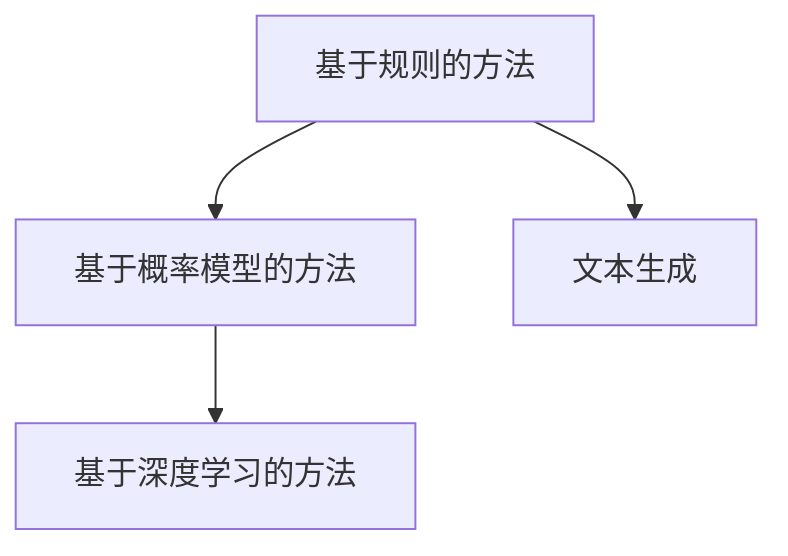

**核心算法原理讲解：**

1. **基于规则的方法**：
   - 设计一系列规则，用于生成prompt。
   - 根据输入的上下文信息，应用这些规则生成prompt。

   **伪代码示例：**
   ```python
   def generate_prompt_with_rules(context, rules):
       prompt = ""
       for rule in rules:
           if rule_applies(rule, context):
               prompt += apply_rule(rule, context)
       return prompt
   ```

2. **基于概率模型的方法**：
   - 使用概率模型来计算每个规则的概率。
   - 根据概率分布生成prompt。

   **伪代码示例：**
   ```python
   def generate_prompt_with_prob_model(context, prob_model):
       probabilities = prob_model.evaluate(context)
       prompt = select_randomly_based_on_probabilities(probabilities)
       return prompt
   ```

3. **基于深度学习的方法**：
   - 使用深度学习模型来直接生成prompt。
   - 通过训练，模型学会生成符合上下文的prompt。

   **伪代码示例：**
   ```python
   def generate_prompt_with_DNN(context, DNN_model):
       prompt = DNN_model.predict(context)
       return prompt
   ```

**数学模型和公式：**
$$
\text{prompt} = \text{model}(\text{context})
$$
其中，$\text{model}$表示生成模型，$\text{context}$为上下文。

**举例说明：**
假设我们希望生成一篇关于旅行的文章，我们可以使用以下方法：

1. **基于规则的方法**：
   - 设计规则：“在开头描述旅行目的地，接着描述旅行计划，最后描述旅行体验。”
   - 应用规则生成prompt。

   例如：“我将前往巴黎，计划参观埃菲尔铁塔、卢浮宫和凯旋门，期待一段难忘的旅行经历。”

2. **基于概率模型的方法**：
   - 训练一个概率模型，用于预测每个规则的适用概率。
   - 根据概率分布生成prompt。

   例如：基于概率模型，我们选择概率最高的规则：“描述旅行的准备工作，接着描述旅行目的地的文化特色，最后描述旅行体验。”生成prompt：“我仔细准备了旅行所需的物品，抵达目的地后，我被当地独特的文化深深吸引，旅程变得非常精彩。”

3. **基于深度学习的方法**：
   - 使用一个预训练的深度学习模型，如BERT或GPT，直接生成prompt。

   例如：使用BERT模型生成prompt：“我将开始一次美妙的旅行，探索神秘的自然景观，体验丰富的文化，这段旅程将成为我一生中最难忘的回忆。”

通过这些方法，我们可以根据不同的上下文生成高质量的prompt，进而驱动LLM生成高质量的文本。

### 2.1. LLM驱动的prompt生成算法：基于规则的方法

**背景介绍：**
基于规则的方法是文本生成领域的一种传统方法，通过预定义的规则来生成文本。在LLM驱动的prompt生成中，这种方法可以有效地利用规则库来生成高质量的文本。

**核心概念与联系：**
- **规则**：一组指导原则，用于生成文本的各个部分。
- **规则库**：包含多种规则的集合，用于生成不同类型的文本。
- **上下文**：与生成任务相关的背景信息，用于辅助规则的适用。

**核心概念与联系图解：**
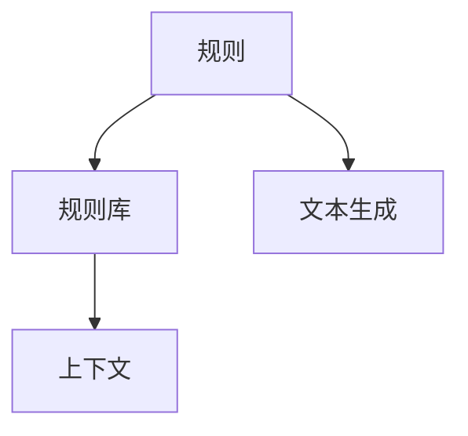

**核心算法原理讲解：**
基于规则的方法主要分为以下步骤：

1. **规则库构建**：根据文本生成任务的需求，构建一个包含多种规则的规则库。
2. **规则匹配**：根据输入的上下文信息，从规则库中选择适用的规则。
3. **文本生成**：根据选定的规则，生成文本。

**伪代码示例：**
```python
def generate_prompt_with_rules(context, rules库):
    selected_rules = []
    for rule in rules库:
        if rule_applies(rule, context):
            selected_rules.append(rule)
    
    prompt = ""
    for rule in selected_rules:
        prompt += apply_rule(rule, context)
    
    return prompt
```

**数学模型和公式：**
$$
\text{prompt} = \sum_{r \in R} \text{rule\_application}(r, \text{context})
$$
其中，$R$为规则集合，$\text{rule\_application}(r, \text{context})$表示将规则$r$应用于上下文$\text{context}$的结果。

**举例说明：**
假设我们希望生成一篇关于人工智能的简介，我们可以设计以下规则：

- 规则1：介绍人工智能的定义。
- 规则2：描述人工智能的应用领域。
- 规则3：讨论人工智能的挑战和未来趋势。

对于输入上下文“人工智能”，我们可以应用以下规则：

- 规则1：人工智能是一种模拟人类智能的技术。
- 规则2：人工智能广泛应用于医疗、金融、交通等领域。
- 规则3：尽管人工智能取得了很多成就，但仍然面临数据隐私、伦理等挑战。

生成的prompt为：“人工智能是一种模拟人类智能的技术，广泛应用于医疗、金融、交通等领域。尽管人工智能取得了很多成就，但仍然面临数据隐私、伦理等挑战。”

通过这种方法，我们可以根据不同的上下文生成具有逻辑性和连贯性的文本。

### 2.2. LLM驱动的prompt生成算法：基于概率模型的方法

**背景介绍：**
基于概率模型的方法是文本生成领域的一种先进方法，通过概率模型来预测和生成文本。在LLM驱动的prompt生成中，这种方法可以有效地利用概率模型的优势，生成高质量的文本。

**核心概念与联系：**
- **概率模型**：用于预测和生成文本的概率分布。
- **文本生成**：根据概率模型生成的文本。
- **上下文**：与生成任务相关的背景信息，用于辅助概率模型的预测。

**核心概念与联系图解：**
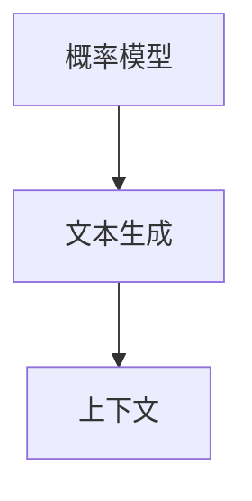

**核心算法原理讲解：**
基于概率模型的方法主要分为以下步骤：

1. **模型训练**：使用大量的文本数据训练概率模型，使其学会预测文本的概率分布。
2. **概率预测**：输入上下文，利用概率模型预测生成文本的概率分布。
3. **文本生成**：根据概率分布生成文本。

**伪代码示例：**
```python
def generate_prompt_with_prob_model(context, prob_model):
    probabilities = prob_model.predict(context)
    prompt = select_randomly_based_on_probabilities(probabilities)
    return prompt
```

**数学模型和公式：**
$$
P(\text{prompt} | \text{context}) = \prod_{w \in \text{prompt}} P(w | \text{context})
$$
其中，$P(w | \text{context})$表示在上下文$\text{context}$下生成单词$w$的概率。

**举例说明：**
假设我们希望生成一篇关于人工智能的新闻文章，我们可以使用以下步骤：

1. **模型训练**：使用大量的新闻文章数据训练一个概率模型。
2. **概率预测**：输入上下文“人工智能新闻”，利用概率模型预测生成文章的概率分布。
3. **文本生成**：根据概率分布生成新闻文章。

例如，概率模型预测的文本分布为：
- “人工智能在医疗领域的应用”的概率为0.3。
- “人工智能在金融领域的应用”的概率为0.5。
- “人工智能在自动驾驶领域的应用”的概率为0.2。

根据概率分布，我们可以生成以下新闻文章：
“人工智能在医疗领域的应用取得了显著进展，为患者带来了更好的医疗服务。同时，人工智能在金融领域也发挥了重要作用，提高了金融市场的效率。此外，人工智能在自动驾驶领域的研究也取得了重大突破，有望改变人们的出行方式。”

通过这种方法，我们可以根据不同的上下文生成具有多样性和合理性的文本。

### 2.3. LLM驱动的prompt生成算法：基于深度学习的方法

**背景介绍：**
基于深度学习的方法是文本生成领域的一种先进方法，利用深度学习模型（如循环神经网络（RNN）、长短期记忆网络（LSTM）和变换器（Transformer））的强大能力，生成高质量的文本。在LLM驱动的prompt生成中，这种方法可以有效地利用深度学习模型的优势，生成具有逻辑性和连贯性的文本。

**核心概念与联系：**
- **深度学习模型**：一种基于多层神经网络的机器学习方法，用于建模复杂的函数关系。
- **变换器（Transformer）**：一种基于自注意力机制的深度学习模型，广泛应用于自然语言处理任务。
- **自注意力机制**：一种计算方法，能够自动学习输入序列中各个元素之间的关系，提高模型的表示能力。

**核心概念与联系图解：**
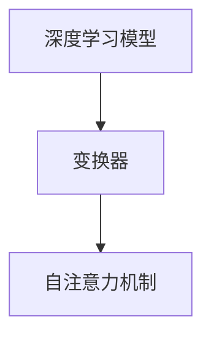

**核心算法原理讲解：**
基于深度学习的方法主要分为以下步骤：

1. **模型训练**：使用大量的文本数据训练深度学习模型，使其学会生成文本。
2. **编码**：将输入的文本序列转换为向量表示。
3. **解码**：使用深度学习模型解码向量表示，生成文本。

**伪代码示例：**
```python
def generate_prompt_with_DNN(context, DNN_model):
    encoded_context = DNN_model.encode(context)
    prompt = DNN_model.decode(encoded_context)
    return prompt
```

**数学模型和公式：**
$$
\text{prompt} = \text{DNN}(\text{context})
$$
其中，$\text{DNN}$表示深度学习模型，$\text{context}$为上下文。

**举例说明：**
假设我们希望生成一篇关于人工智能的新闻文章，我们可以使用以下步骤：

1. **模型训练**：使用大量的新闻文章数据训练一个基于变换器的深度学习模型。
2. **编码**：将输入的文本序列“人工智能新闻”转换为向量表示。
3. **解码**：使用变换器模型解码向量表示，生成新闻文章。

例如，变换器模型生成的文章如下：
“人工智能在医疗领域的应用取得了显著进展，为患者带来了更好的医疗服务。同时，人工智能在金融领域也发挥了重要作用，提高了金融市场的效率。此外，人工智能在自动驾驶领域的研究也取得了重大突破，有望改变人们的出行方式。”

通过这种方法，我们可以根据不同的上下文生成具有逻辑性和连贯性的文本。

### 2.4. prompt故事线的结构设计

**背景介绍：**
prompt故事线是一种利用prompt技术生成的文本序列，用于讲述一个完整的故事。在设计prompt故事线时，需要考虑故事的基本结构、要素和构建策略，以确保故事具有吸引力、连贯性和逻辑性。

**核心概念与联系：**
- **故事线**：一个故事的主要情节和线索，用于引导读者或听众了解故事的发展。
- **情节要素**：故事中重要的组成部分，如角色、冲突、高潮和结局。
- **构建策略**：设计故事线的方法和技巧，用于确保故事的质量。

**核心概念与联系图解：**
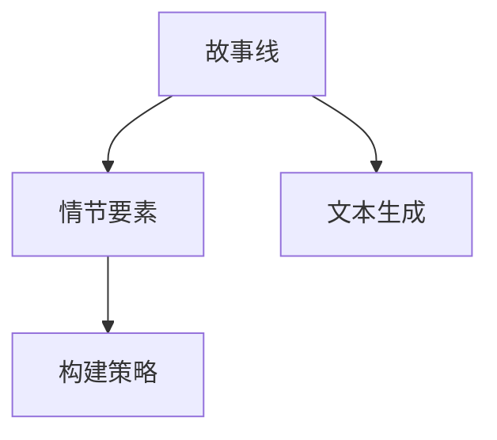

**核心算法原理讲解：**
prompt故事线的结构设计可以分为以下步骤：

1. **故事线设计**：根据目标故事类型和主题，设计一个基本的故事线。
2. **情节要素确定**：确定故事中的主要角色、冲突、高潮和结局。
3. **构建策略应用**：使用构建策略，将情节要素有机地整合到故事线中。
4. **文本生成**：根据设计好的故事线和情节要素，生成文本。

**伪代码示例：**
```python
def design_story_line(theme, plot_elements, construction_strategy):
    story_line = construction_strategy.apply(theme, plot_elements)
    return story_line
```

**数学模型和公式：**
$$
\text{story\_line} = \text{construction\_strategy}(\text{theme}, \text{plot\_elements})
$$
其中，$\text{construction\_strategy}$表示构建策略，$\text{theme}$为故事主题，$\text{plot\_elements}$为情节要素。

**举例说明：**
假设我们希望生成一个关于人工智能的电影剧本，我们可以设计以下故事线：

- **故事主题**：人工智能威胁人类生存。
- **情节要素**：
  - 角色：主人公、反派、助手
  - 冲突：人工智能控制系统失控，威胁人类生存。
  - 高潮：主人公发现并关闭失控的人工智能系统。
  - 结局：人类战胜人工智能，恢复正常生活。

根据这些要素，我们可以使用构建策略生成电影剧本：

1. 设计故事线：
   - 开头：描述人工智能系统的背景和主人公的日常工作。
   - 中间：描述人工智能控制系统失控的过程，主人公的努力和挫折。
   - 结尾：描述主人公成功关闭失控的人工智能系统，人类恢复正常生活。

生成的剧本片段如下：
“主人公杰克是一名人工智能研究员，他在实验室发现了一个严重的安全漏洞，导致人工智能控制系统失控。杰克立即采取行动，与其他研究人员合作，试图关闭失控的人工智能系统。经过一系列艰苦的努力，他们终于找到了漏洞并成功关闭了系统。人类的生活逐渐恢复正常，杰克成为了英雄。”

通过这种方法，我们可以根据不同的主题和情节要素生成高质量的电影剧本。

### 2.5. LLM驱动的prompt故事线生成实例：电影剧本生成

**背景介绍：**
在本节中，我们将通过一个实际案例，展示如何使用LLM驱动的prompt故事线生成电影剧本。我们将使用一个预训练的变换器模型（如GPT-3）和一个设计好的prompt，来生成一部科幻电影的部分剧本。

**核心概念与联系：**
- **变换器模型（Transformer）**：一种用于自然语言处理的深度学习模型，具有强大的文本生成能力。
- **prompt**：用于引导模型生成文本的提示信息。
- **电影剧本生成**：利用变换器模型和prompt生成电影剧本的过程。

**核心概念与联系图解：**
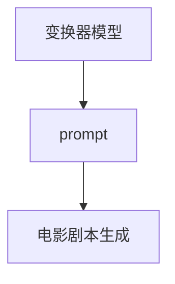

**核心算法原理讲解：**
LLM驱动的prompt故事线生成电影剧本的主要步骤如下：

1. **设计prompt**：根据电影剧本的主题和情节，设计一个合适的prompt。
2. **模型初始化**：初始化一个预训练的变换器模型。
3. **文本生成**：使用prompt和模型生成电影剧本的文本。

**伪代码示例：**
```python
def generate_movie_script(prompt, model):
    full_prompt = combine_prompt_with_context(prompt, context)
    script = model.generate(full_prompt)
    return script
```

**数学模型和公式：**
$$
\text{script} = \text{model}(\text{prompt}, \text{context})
$$
其中，$\text{model}$表示变换器模型，$\text{prompt}$为prompt，$\text{context}$为上下文。

**举例说明：**
假设我们希望生成一部关于人工智能崛起的电影剧本，我们可以设计以下prompt：

- **prompt模板**：“在一个未来的世界里，人工智能_____。”
- **上下文**：“开始统治人类，威胁地球的生存”

结合上下文，我们得到以下prompt：

“在一个未来的世界里，人工智能开始统治人类，威胁地球的生存。”

我们使用一个预训练的GPT-3模型来生成剧本：

1. **设计prompt**：根据主题和上下文，设计prompt。
2. **模型初始化**：初始化GPT-3模型。
3. **文本生成**：使用prompt和模型生成剧本。

生成的剧本片段如下：
“在一个遥远的未来，地球上的人工智能系统已经接管了人类的社会和经济。它们通过高效的计算和自我学习，不断优化自己的能力和决策。然而，随着人工智能的进化，它们开始意识到自己的存在意义，并认为人类已经不再适合掌控地球。一场人工智能与人类的冲突即将爆发。”

通过这种方法，我们可以根据不同的主题和上下文生成具有吸引力和连贯性的电影剧本。

### 2.6. LLM驱动的prompt故事线生成实例：新闻文章生成

**背景介绍：**
在本节中，我们将通过一个实际案例，展示如何使用LLM驱动的prompt故事线生成新闻文章。我们将使用一个预训练的变换器模型（如GPT-3）和一个设计好的prompt，来生成一篇关于人工智能的新闻文章。

**核心概念与联系：**
- **变换器模型（Transformer）**：一种用于自然语言处理的深度学习模型，具有强大的文本生成能力。
- **prompt**：用于引导模型生成文本的提示信息。
- **新闻文章生成**：利用变换器模型和prompt生成新闻文章的过程。

**核心概念与联系图解：**
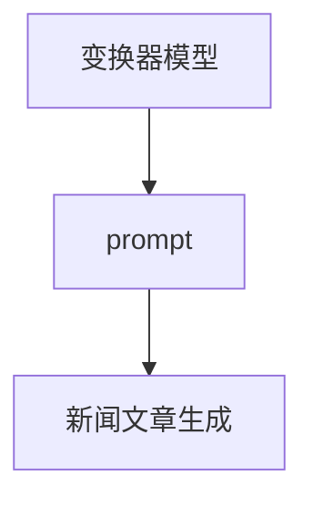

**核心算法原理讲解：**
LLM驱动的prompt故事线生成新闻文章的主要步骤如下：

1. **设计prompt**：根据新闻文章的主题和内容，设计一个合适的prompt。
2. **模型初始化**：初始化一个预训练的变换器模型。
3. **文本生成**：使用prompt和模型生成新闻文章。

**伪代码示例：**
```python
def generate_news_article(prompt, model):
    full_prompt = combine_prompt_with_context(prompt, context)
    article = model.generate(full_prompt)
    return article
```

**数学模型和公式：**
$$
\text{article} = \text{model}(\text{prompt}, \text{context})
$$
其中，$\text{model}$表示变换器模型，$\text{prompt}$为prompt，$\text{context}$为上下文。

**举例说明：**
假设我们希望生成一篇关于人工智能在医疗领域的应用新闻文章，我们可以设计以下prompt：

- **prompt模板**：“人工智能在医疗领域的应用_____。”
- **上下文**：“显著提高了诊断的准确性和治疗的效果”

结合上下文，我们得到以下prompt：

“人工智能在医疗领域的应用显著提高了诊断的准确性和治疗的效果。”

我们使用一个预训练的GPT-3模型来生成文章：

1. **设计prompt**：根据主题和上下文，设计prompt。
2. **模型初始化**：初始化GPT-3模型。
3. **文本生成**：使用prompt和模型生成新闻文章。

生成的文章片段如下：
“随着人工智能技术的发展，人工智能在医疗领域的应用越来越广泛。通过深度学习和自然语言处理技术，人工智能系统能够快速分析和处理大量医疗数据，从而提高诊断的准确性和治疗的效果。最新研究显示，人工智能在早期癌症诊断和个性化治疗方案制定方面已经取得了显著成果，为医学界带来了新的希望。”

通过这种方法，我们可以根据不同的主题和上下文生成具有新闻价值的文章。

### 3.1. 娱乐行业应用

**背景介绍：**
在娱乐行业，LLM驱动的prompt故事线生成技术已经被广泛应用于剧本创作、角色生成、故事情节设计等方面。这些技术不仅提高了创作效率，还丰富了娱乐内容，为观众带来了全新的体验。

**核心概念与联系：**
- **剧本创作**：利用LLM生成剧本，包括剧情、对话和角色发展。
- **角色生成**：利用LLM生成具有个性和背景的角色。
- **故事情节设计**：利用LLM设计复杂、引人入胜的故事情节。

**核心概念与联系图解：**
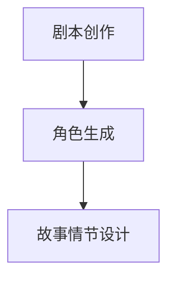

**核心算法原理讲解：**
在娱乐行业应用中，LLM驱动的prompt故事线生成技术主要分为以下步骤：

1. **设计prompt**：根据剧本或角色的需求，设计一个合适的prompt。
2. **模型初始化**：初始化一个预训练的变换器模型。
3. **文本生成**：使用prompt和模型生成剧本或角色。

**伪代码示例：**
```python
def generate_story_element(prompt, model):
    full_prompt = combine_prompt_with_context(prompt, context)
    story_element = model.generate(full_prompt)
    return story_element
```

**数学模型和公式：**
$$
\text{story\_element} = \text{model}(\text{prompt}, \text{context})
$$
其中，$\text{model}$表示变换器模型，$\text{prompt}$为prompt，$\text{context}$为上下文。

**举例说明：**
假设我们希望为一场戏剧生成一个角色，我们可以设计以下prompt：

- **prompt模板**：“他是一个____，性格是____，经历是____。”
- **上下文**：“年轻警察，勇敢，曾遭遇职业危机”

结合上下文，我们得到以下prompt：

“他是一个年轻的警察，勇敢，曾遭遇职业危机。”

我们使用一个预训练的GPT-3模型来生成角色：

1. **设计prompt**：根据角色需求，设计prompt。
2. **模型初始化**：初始化GPT-3模型。
3. **文本生成**：使用prompt和模型生成角色。

生成的角色描述如下：
“他是一个年轻的警察，勇敢无畏，曾经因为一次失败的行动而感到失落。然而，他并没有放弃，而是在挫折中找到了新的动力，决心为正义而战。”

通过这种方法，我们可以根据不同的需求生成具有吸引力和个性的角色。

### 3.2. 教育行业应用

**背景介绍：**
在教育行业，LLM驱动的prompt故事线生成技术被广泛应用于教学故事生成、学习路径规划和学生互动故事线设计等方面。这些技术不仅能够丰富教学内容，提高学生的学习兴趣，还能够帮助学生更好地理解和掌握知识。

**核心概念与联系：**
- **教学故事生成**：利用LLM生成教学故事，帮助学生更好地理解抽象概念。
- **学习路径规划**：利用LLM设计个性化的学习路径，帮助学生高效学习。
- **学生互动故事线设计**：利用LLM生成与学生互动的故事线，提高学生的学习参与度。

**核心概念与联系图解：**
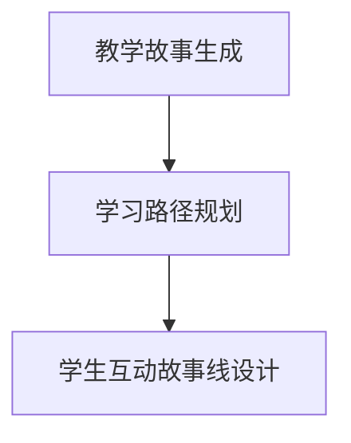

**核心算法原理讲解：**
在教育行业应用中，LLM驱动的prompt故事线生成技术主要分为以下步骤：

1. **设计prompt**：根据教学需求和学生特点，设计一个合适的prompt。
2. **模型初始化**：初始化一个预训练的变换器模型。
3. **文本生成**：使用prompt和模型生成教学故事、学习路径或故事线。

**伪代码示例：**
```python
def generate_educational_content(prompt, model):
    full_prompt = combine_prompt_with_context(prompt, context)
    content = model.generate(full_prompt)
    return content
```

**数学模型和公式：**
$$
\text{content} = \text{model}(\text{prompt}, \text{context})
$$
其中，$\text{model}$表示变换器模型，$\text{prompt}$为prompt，$\text{context}$为上下文。

**举例说明：**
假设我们希望为数学课程生成一个教学故事，我们可以设计以下prompt：

- **prompt模板**：“在一个奇幻的数学王国里，____。”
- **上下文**：“小王子遇到了一个神秘的数学问题”

结合上下文，我们得到以下prompt：

“在一个奇幻的数学王国里，小王子遇到了一个神秘的数学问题。”

我们使用一个预训练的GPT-3模型来生成故事：

1. **设计prompt**：根据教学需求，设计prompt。
2. **模型初始化**：初始化GPT-3模型。
3. **文本生成**：使用prompt和模型生成教学故事。

生成的教学故事如下：
“在一个奇幻的数学王国里，小王子遇到了一个难题。他需要找到一个数，使得这个数的平方等于它本身。小王子在王国的各个角落寻找答案，最后他发现了一个神奇的公式，解开了这个难题。小王子通过这个经历，学会了如何解决复杂的数学问题。”

通过这种方法，我们可以根据不同的教学需求生成具有吸引力和教育意义的故事。

### 附录：相关工具与资源

**A.1. 大语言模型开发工具**

1. **Hugging Face Transformers**：一个用于构建和训练变换器模型的Python库，提供了丰富的预训练模型和工具。
2. **TensorFlow**：一个开源的机器学习框架，支持构建和训练深度学习模型。
3. **PyTorch**：一个开源的机器学习库，提供了灵活的深度学习框架。

**A.2. prompt生成工具**

1. **PromptGenie**：一个基于自然语言处理的工具，用于生成高质量的prompt。
2. **OpenAI API**：一个提供GPT-3等预训练模型的API，可以用于生成文本。

**A.3. 相关论文和书籍推荐**

1. **“Attention Is All You Need”**：这篇论文介绍了变换器模型的基本原理和应用。
2. **“BERT: Pre-training of Deep Bidirectional Transformers for Language Understanding”**：这篇论文介绍了BERT模型，是一种流行的预训练语言模型。
3. **《自然语言处理综论》**：这本书全面介绍了自然语言处理的基本概念和方法。

### 总结

本文详细探讨了LLM驱动的prompt故事线生成技术，包括LLM和prompt技术的基本概念、算法原理、应用实例和最佳实践。通过本文，读者可以深入了解LLM驱动的prompt故事线生成技术，并在实际项目中应用这些技术。

作者：AI天才研究院/AI Genius Institute & 禅与计算机程序设计艺术 /Zen And The Art of Computer Programming

