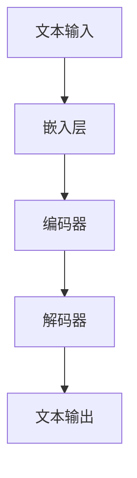
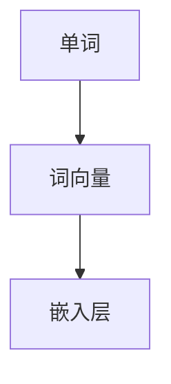
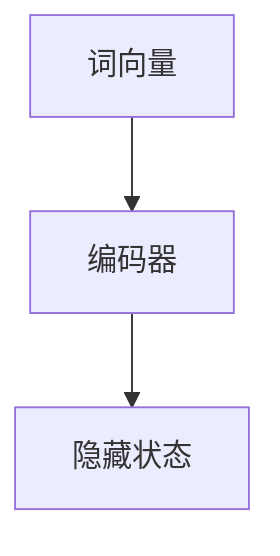
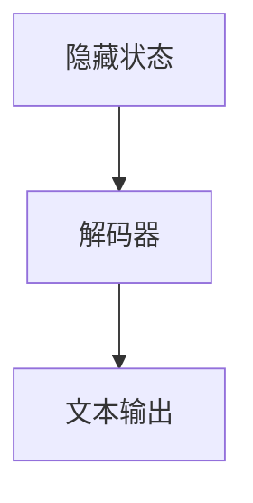

                 

# 文章标题：LLM驱动的prompt教育辅助工具

## 关键词
- 语言学习模型（LLM）
- Prompt技术
- 教育辅助工具
- 技术实现
- 评估与优化

## 摘要
随着人工智能技术的飞速发展，语言学习模型（LLM）和Prompt技术逐渐在教育领域崭露头角。本文将深入探讨LLM驱动的prompt教育辅助工具的设计、实现和应用，包括理论基础、实践案例和技术实现细节。通过本文的阅读，读者将全面了解如何利用LLM和Prompt技术提升教育辅助工具的效果，并为未来的发展提供有益的参考。

### 第1章：介绍与概述

#### 1.1 语言学习模型（LLM）的基本概念

语言学习模型（LLM）是一种基于深度学习的自然语言处理技术，它能够理解和生成人类语言。LLM的核心在于其强大的语言理解能力和文本生成能力，这使得它在多种场景中都有广泛的应用。

#### 1.1.1 什么是LLM

LLM是一种能够对文本进行建模的神经网络模型，通过大量的文本数据训练得到。这些模型能够捕捉到语言的复杂结构和语义信息，使得它们能够处理各种自然语言任务。

#### 1.1.2 LLM的工作原理

LLM的工作原理主要涉及两个方面：嵌入和生成。嵌入是将文本转化为向量表示，生成是根据向量表示生成新的文本。



#### 1.2 Prompt在教育辅助中的作用

Prompt技术是LLM的一个重要应用领域，它通过向LLM提供特定的输入提示，来引导模型生成更符合预期的输出。

#### 1.2.1 Prompt的定义

Prompt是一个引导LLM生成输出的文本或代码片段，它通常包含问题和上下文信息。

#### 1.2.2 Prompt在教育中的应用

Prompt在教育辅助中的应用主要体现在以下几个方面：

- **语言学习**：通过提供上下文和问题，帮助学习者更好地理解和掌握语言知识。
- **写作辅助**：提供写作模板和提示，帮助学习者构思和撰写文章。
- **阅读理解**：提供与文章相关的提示，帮助学习者更好地理解文章内容。

#### 1.3 LLM驱动的教育辅助工具的发展历程

LLM驱动的教育辅助工具的发展可以分为三个阶段：

- **第一阶段**（2010-2015）：基于规则的方法，如智能问答系统和自动作文评分系统。
- **第二阶段**（2016-2020）：引入深度学习技术，如基于神经网络的智能问答系统和自动作文评分系统。
- **第三阶段**（2021至今）：基于LLM和Prompt技术的教育辅助工具逐渐成熟，并开始广泛应用。

### 第2章：理论基础

#### 2.1 LLM的原理与架构

LLM的原理与架构主要包括嵌入和生成两个部分。

#### 2.1.1 语言模型的基本结构

语言模型的基本结构通常包括嵌入层、编码器和解码器。


#### 2.1.2 训练与优化算法

LLM的训练与优化算法主要采用反向传播和梯度下降等方法。

```latex
\text{Loss Function:} \mathcal{L} = \sum_{i=1}^{N} (-y_i \log(p(x_i)))
```

#### 2.2 Prompt的设计与优化

Prompt的设计与优化是提升LLM驱动教育辅助工具效果的关键。

#### 2.2.1 Prompt的类型

Prompt可以分为问题型、回答型和上下文型等类型。

#### 2.2.2 Prompt优化策略

Prompt的优化策略包括自适应Prompt和多模态Prompt等。

### 第3章：实践应用

#### 3.1 教育辅助工具的需求分析

教育辅助工具的需求分析主要包括学习场景、学习目标和用户需求等。

#### 3.2 LLM驱动的教育辅助工具应用实例

LLM驱动的教育辅助工具在语言学习、阅读理解和写作辅助等方面都有广泛的应用。

### 第4章：技术实现

#### 4.1 开发环境与工具

开发环境与工具的选择对于实现LLM驱动的教育辅助工具至关重要。

#### 4.2 LLM模型的实现

LLM模型的实现包括模型选择、配置和训练等步骤。

#### 4.3 Prompt的实现

Prompt的实现包括Prompt的生成策略和优化方法等。

### 第5章：评估与优化

#### 5.1 教育辅助工具评估指标

教育辅助工具的评估指标主要包括学习效果、用户体验和系统性能等。

#### 5.2 实际应用中的评估案例

实际应用中的评估案例可以帮助我们更好地理解教育辅助工具的效果。

#### 5.3 优化策略与案例

通过优化策略和案例，我们可以进一步提升教育辅助工具的效果。

### 第6章：未来展望

#### 6.1 LLM在教育领域的潜在应用

LLM在教育领域的潜在应用包括个性化教学、智能辅导和自动评估等。

#### 6.2 技术发展趋势与挑战

技术发展趋势与挑战主要包括数据隐私、计算资源和模型解释性等。

### 作者信息

作者：AI天才研究院/AI Genius Institute & 禅与计算机程序设计艺术 /Zen And The Art of Computer Programming## 第1章：介绍与概述

### 1.1 语言学习模型（LLM）的基本概念

语言学习模型（Language Learning Model，简称LLM）是一种广泛应用于自然语言处理（Natural Language Processing，简称NLP）领域的深度学习模型。LLM的核心目标是通过对大量语言数据的训练，学习到语言的内在规律和表达方式，从而能够处理各种自然语言任务，如文本分类、情感分析、机器翻译、问答系统等。LLM的出现，极大地提升了NLP领域的处理能力和效果。

#### 1.1.1 什么是LLM

LLM，顾名思义，是一种能够“学习”语言的模型。具体来说，LLM通过学习大量的文本数据，捕捉到语言的结构和语义信息，从而能够对输入的文本进行理解、生成或翻译。与传统的方法不同，LLM不依赖于人工设计的特征，而是通过神经网络自动学习语言的复杂模式。

LLM的工作原理可以简化为三个步骤：

1. **嵌入**：将文本转化为向量表示，使得模型能够处理。
2. **编码**：通过编码器（Encoder）处理输入文本，提取其特征。
3. **解码**：通过解码器（Decoder）生成输出文本。

图1展示了LLM的基本结构：


#### 1.1.2 LLM的工作原理

LLM的工作原理主要基于深度学习，尤其是循环神经网络（Recurrent Neural Network，RNN）和其变种——长短时记忆网络（Long Short-Term Memory，LSTM）和门控循环单元（Gated Recurrent Unit，GRU）。这些网络能够捕捉到文本中的长期依赖关系，从而更好地理解和生成语言。

1. **嵌入层**：将单词或字符转化为固定长度的向量表示，这一步通常使用词向量模型（如Word2Vec、GloVe）来实现。

2. **编码器**：编码器负责处理嵌入后的文本，将其转化为固定维度的隐藏状态向量。LSTM和GRU是常用的编码器结构。

3. **解码器**：解码器根据编码器生成的隐藏状态向量，生成输出文本。在生成文本时，解码器会逐步生成每个单词或字符，并在每个步骤中使用前一个生成的单词或字符作为上下文。

LLM的训练过程通常包括以下步骤：

- **数据预处理**：包括文本清洗、分词、词性标注等。
- **词向量生成**：使用预训练的词向量模型或自己训练词向量。
- **模型训练**：通过反向传播和梯度下降等优化算法，训练编码器和解码器。
- **评估与优化**：使用验证集对模型进行评估，并根据评估结果调整模型参数。

#### 1.1.3 LLM的优势

LLM相比传统NLP方法，具有以下几个显著优势：

- **更强的语义理解能力**：LLM能够捕捉到文本的深层语义信息，从而在文本分类、情感分析等任务上表现优异。
- **更好的泛化能力**：LLM通过大量数据训练，能够在未见过的数据上表现良好，具有良好的泛化能力。
- **灵活的应用场景**：LLM可以应用于各种NLP任务，如文本生成、机器翻译、问答系统等，具有很高的灵活性。

#### 1.1.4 LLM在教育领域的应用

LLM在教育领域的应用主要包括以下几个方面：

- **个性化教学**：根据学生的特点和需求，提供个性化的教学内容和路径。
- **自动批改作业**：利用LLM对学生的作业进行自动批改，提高教师的工作效率。
- **智能问答系统**：为学生提供实时、准确的答案，帮助学生更好地理解课程内容。
- **智能辅导**：根据学生的学习情况，提供针对性的辅导和建议，帮助学生提高学习效果。

### 1.2 Prompt在教育辅助中的作用

Prompt技术在教育辅助中的应用，旨在通过引导语言学习模型（如LLM）生成更加符合教育需求的内容。Prompt，简单来说，就是提供给模型的输入提示，它能够帮助模型更好地理解任务要求，从而生成更高质量的输出。

#### 1.2.1 Prompt的定义

Prompt，顾名思义，就是“提示”或“引导”。在LLM的上下文中，Prompt通常是一个文本或代码片段，用于引导模型生成特定的输出。Prompt的设计和优化对于LLM在教育辅助工具中的应用效果至关重要。

Prompt可以分为以下几种类型：

- **问题型Prompt**：用于引导模型生成问题的答案。
- **回答型Prompt**：用于引导模型生成问题的回答。
- **上下文型Prompt**：提供与主题相关的上下文信息，帮助模型更好地理解问题的背景。

#### 1.2.2 Prompt在教育中的应用

Prompt在教育辅助中的应用主要体现在以下几个方面：

1. **语言学习**：通过Prompt，LLM可以生成与学习主题相关的句子、段落或文章，帮助学生更好地理解语言结构和使用方法。
2. **写作辅助**：Prompt可以帮助学生构思文章结构，提供写作模板和提示，提高写作质量和效率。
3. **阅读理解**：Prompt可以提供与阅读材料相关的上下文信息，帮助学生更好地理解文章内容。
4. **智能辅导**：通过Prompt，LLM可以生成与学生学习情况相关的反馈和建议，为学生提供个性化的辅导。

#### 1.2.3 Prompt的优化策略

为了提升Prompt在教育辅助工具中的应用效果，需要采取一系列优化策略：

1. **自适应Prompt**：根据学生的反馈和学习进度，动态调整Prompt的内容和形式。
2. **多模态Prompt**：结合多种模态（如图像、音频、视频）的信息，提供更丰富、更全面的Prompt。
3. **个性化Prompt**：根据学生的特点和需求，定制化地生成Prompt，提高其针对性和有效性。

#### 1.2.4 Prompt与LLM的相互作用

Prompt与LLM的相互作用，是教育辅助工具的核心。通过恰当的Prompt设计，LLM可以更好地理解任务要求，从而生成更符合教育需求的输出。例如：

- **问题型Prompt**：用于生成问题的答案，可以帮助学生进行知识巩固和复习。
- **回答型Prompt**：用于生成问题的回答，可以引导学生进行深入思考和逻辑推理。
- **上下文型Prompt**：提供与学习主题相关的上下文信息，可以帮助学生更好地理解学习内容。

#### 1.2.5 Prompt在教育辅助工具中的优势

Prompt在教育辅助工具中的应用，具有以下优势：

- **提高学习效果**：通过提供有针对性的提示和引导，帮助学生学习更高效、更深入。
- **个性化教学**：根据学生的特点和需求，提供个性化的教学内容和路径，提高教学效果。
- **智能辅导**：通过实时生成反馈和建议，帮助学生解决学习中的问题，提高学习兴趣和动力。

### 1.3 LLM驱动的教育辅助工具的发展历程

LLM驱动的教育辅助工具，从最初的简单应用，到如今的成熟产品，经历了以下几个阶段：

#### 1.3.1 早期探索阶段

在早期探索阶段，研究人员主要利用规则驱动的方法，如自动批改系统、智能问答系统等，进行初步的教育辅助。虽然这些方法在一定程度上提高了教学效率，但受限于技术的局限性，效果并不理想。

#### 1.3.2 深度学习时代

随着深度学习技术的兴起，LLM开始应用于教育辅助领域。这一阶段，研究人员主要利用深度学习模型，如循环神经网络（RNN）和长短时记忆网络（LSTM），开发出一系列教育辅助工具，如智能写作辅助、阅读理解系统等。

#### 1.3.3 LLM时代

LLM的出现，标志着教育辅助工具进入了一个全新的阶段。LLM强大的语义理解和生成能力，使得教育辅助工具的效果得到了显著提升。这一阶段，研究人员主要利用LLM开发出更加智能、个性化的教育辅助工具，如自适应学习系统、智能辅导系统等。

#### 1.3.4 未来展望

未来，LLM驱动的教育辅助工具将继续发展，并在以下几个方面取得突破：

- **个性化教学**：通过深入分析学生的学习行为和特点，提供更加个性化的教学内容和路径。
- **智能辅导**：利用LLM实时生成反馈和建议，帮助学生解决学习中的问题，提高学习效果。
- **跨学科融合**：结合不同学科的知识，开发出更加全面、系统的教育辅助工具。
- **技术应用**：结合其他先进技术（如图像识别、语音识别等），提高教育辅助工具的交互性和实用性。

### 1.4 LLM驱动的教育辅助工具的挑战与机遇

虽然LLM驱动的教育辅助工具展示了巨大的潜力，但同时也面临着一系列挑战：

- **数据隐私**：教育辅助工具需要处理大量的学生数据，如何保护学生的隐私成为一个重要问题。
- **计算资源**：训练和运行LLM模型需要大量的计算资源，如何高效利用这些资源是一个关键问题。
- **模型解释性**：LLM生成的输出往往缺乏解释性，如何让模型的结果更加透明、可解释是一个重要课题。

然而，这些挑战也带来了机遇：

- **技术创新**：为了解决这些挑战，将会催生出一系列新的技术和方法，推动教育辅助工具的发展。
- **教育变革**：LLM驱动的教育辅助工具有望带来教育模式的变革，推动教育领域的进步。

### 1.5 小结

LLM驱动的教育辅助工具，通过结合深度学习和自然语言处理技术，为教育领域带来了全新的解决方案。本章介绍了LLM和Prompt的基本概念、工作原理以及在教育辅助中的应用，并探讨了LLM驱动的教育辅助工具的发展历程、优势与挑战。下一章，我们将深入探讨LLM的理论基础，包括其原理与架构、训练与优化算法，以及Prompt的设计与优化策略。

### 第2章：理论基础

#### 2.1 LLM的原理与架构

语言学习模型（LLM）是自然语言处理（NLP）领域的重要工具，其核心在于对语言数据的建模与理解。本节将详细解释LLM的工作原理和其基本架构。

##### 2.1.1 语言模型的基本结构

LLM的基本结构主要包括三个主要组成部分：嵌入层、编码器和解码器。

1. **嵌入层（Embedding Layer）**

嵌入层是将输入的文本转化为向量表示的关键步骤。这一层将每个单词或字符映射为固定长度的向量。常见的词向量模型包括Word2Vec、GloVe等。词向量不仅保留了词语的语义信息，还反映了词语之间的相似性。



2. **编码器（Encoder）**

编码器负责处理嵌入后的文本，提取文本的语义特征。在LLM中，编码器通常采用深度神经网络（DNN）的结构，如循环神经网络（RNN）、长短时记忆网络（LSTM）或门控循环单元（GRU）。这些网络能够捕捉到文本中的长期依赖关系，从而更好地理解语言的复杂结构。



3. **解码器（Decoder）**

解码器根据编码器生成的隐藏状态，生成输出文本。在生成文本时，解码器会逐步生成每个单词或字符，并在每个步骤中使用前一个生成的单词或字符作为上下文。常见的解码器结构包括自回归语言模型（ARLM）和Transformer的解码器。



##### 2.1.2 训练与优化算法

LLM的训练过程主要采用基于梯度的优化算法，如随机梯度下降（SGD）、Adam优化器等。训练过程的目标是降低损失函数（Loss Function）的值，使模型能够更好地拟合训练数据。

1. **损失函数（Loss Function）**

在LLM中，常见的损失函数是交叉熵损失（Cross-Entropy Loss），它衡量模型生成的文本与实际文本之间的差异。

$$\mathcal{L} = -\sum_{i=1}^{N} y_i \log(p(x_i))$$

其中，$y_i$是实际标签，$p(x_i)$是模型对$x_i$的概率预测。

2. **反向传播（Backpropagation）**

反向传播是一种计算损失函数对网络参数的梯度的方法。通过梯度计算，模型可以更新参数，以降低损失函数的值。

3. **优化算法（Optimization Algorithm）**

常见的优化算法包括随机梯度下降（SGD）、Adam等。这些算法通过迭代更新模型参数，以达到最小化损失函数的目的。

$$\theta_{t+1} = \theta_t - \alpha \nabla_{\theta_t} J(\theta_t)$$

其中，$\theta_t$是第$t$次迭代的参数，$\alpha$是学习率，$J(\theta_t)$是损失函数。

##### 2.1.3 语言模型的工作流程

LLM的工作流程可以概括为以下几个步骤：

1. **数据预处理**：包括文本清洗、分词、词性标注等。
2. **词向量生成**：使用预训练的词向量模型或自己训练词向量。
3. **模型训练**：通过反向传播和梯度下降等优化算法，训练编码器和解码器。
4. **评估与优化**：使用验证集对模型进行评估，并根据评估结果调整模型参数。

#### 2.2 Prompt的设计与优化

Prompt是LLM生成输出时的重要输入，其设计质量直接影响生成结果的质量。本节将讨论Prompt的设计原则和优化策略。

##### 2.2.1 Prompt的类型

Prompt可以根据其内容和目的分为以下几种类型：

1. **问题型Prompt**：用于引导LLM生成问题的答案。例如，在语言学习应用中，问题型Prompt可以用来练习语法或词汇。
2. **回答型Prompt**：用于引导LLM生成问题的回答。例如，在智能辅导应用中，回答型Prompt可以提供问题的背景信息，帮助学习者理解问题。
3. **上下文型Prompt**：提供与主题相关的上下文信息，帮助LLM更好地理解问题的背景。例如，在阅读理解应用中，上下文型Prompt可以包括文章的部分内容。

##### 2.2.2 Prompt的设计原则

设计Prompt时，需要遵循以下原则：

1. **明确性**：Prompt应明确传达任务要求，避免模糊不清的描述。
2. **相关性**：Prompt应与任务内容高度相关，确保生成结果的质量。
3. **多样性**：Prompt应具有多样性，以适应不同的任务和场景。
4. **适应性**：Prompt应能够根据用户的行为和反馈进行动态调整。

##### 2.2.3 Prompt的优化策略

为了优化Prompt的设计，可以采取以下策略：

1. **自适应Prompt**：根据用户的反馈和学习进度，动态调整Prompt的内容和形式。
2. **多模态Prompt**：结合多种模态（如图像、音频、视频）的信息，提供更丰富、更全面的Prompt。
3. **个性化Prompt**：根据用户的特点和需求，定制化地生成Prompt，提高其针对性和有效性。

##### 2.2.4 Prompt与LLM的相互作用

Prompt与LLM的相互作用是教育辅助工具的核心。通过恰当的Prompt设计，LLM可以更好地理解任务要求，从而生成更符合教育需求的输出。例如：

- **问题型Prompt**：用于生成问题的答案，可以帮助学生进行知识巩固和复习。
- **回答型Prompt**：用于生成问题的回答，可以引导学生进行深入思考和逻辑推理。
- **上下文型Prompt**：提供与学习主题相关的上下文信息，可以帮助学生更好地理解学习内容。

##### 2.2.5 Prompt的优势

Prompt在教育辅助工具中的应用，具有以下优势：

- **提高学习效果**：通过提供有针对性的提示和引导，帮助学生学习更高效、更深入。
- **个性化教学**：根据学生的特点和需求，提供个性化的教学内容和路径，提高教学效果。
- **智能辅导**：通过实时生成反馈和建议，帮助学生解决学习中的问题，提高学习兴趣和动力。

#### 2.3 LLM在教育辅助工具中的应用

LLM在教育辅助工具中的应用，涵盖了多个方面，包括语言学习、写作辅助、阅读理解等。

##### 2.3.1 语言学习

在语言学习应用中，LLM可以生成与学习主题相关的句子、段落或文章，帮助学生更好地理解语言结构和使用方法。例如，通过问题型Prompt，学生可以进行语法练习；通过回答型Prompt，学生可以练习词汇和句型。

##### 2.3.2 写作辅助

在写作辅助应用中，LLM可以提供写作模板和提示，帮助学生构思和撰写文章。通过上下文型Prompt，LLM可以提供与主题相关的背景信息，帮助学生更好地组织文章结构。

##### 2.3.3 阅读理解

在阅读理解应用中，LLM可以提供与文章相关的上下文信息，帮助学生更好地理解文章内容。通过问题型Prompt，学生可以练习阅读理解技巧，通过回答型Prompt，学生可以加深对文章的理解。

##### 2.3.4 智能辅导

在智能辅导应用中，LLM可以实时生成与学生学习情况相关的反馈和建议，帮助学生解决学习中的问题。通过个性化Prompt，LLM可以提供有针对性的辅导，提高学习效果。

#### 2.4 小结

本章介绍了LLM的原理与架构，以及Prompt的设计原则和优化策略。LLM通过嵌入层、编码器和解码器等组成部分，实现了对语言的建模与理解。Prompt作为引导LLM生成输出的输入，其设计和优化直接影响教育辅助工具的效果。通过合理设计Prompt，LLM可以在语言学习、写作辅助、阅读理解和智能辅导等方面发挥重要作用。下一章，我们将深入探讨LLM驱动的教育辅助工具的具体实现细节，包括开发环境、模型实现和Prompt实现等。

### 第3章：实践应用

#### 3.1 教育辅助工具的需求分析

在教育领域，教育辅助工具的需求源于提高教学质量和效率的目标。这些需求可以从以下几个方面进行分析：

1. **个性化学习**：每个学生的认知能力、学习速度和兴趣点各不相同，因此需要个性化学习方案，以满足不同学生的需求。
2. **即时反馈**：学生在学习过程中需要及时了解自己的学习进度和理解情况，即时反馈能够帮助学生纠正错误，强化正确知识。
3. **互动性**：教育辅助工具应能够提供互动式学习体验，增强学生的参与度和学习兴趣。
4. **资源丰富**：工具应能够整合多种学习资源，如文本、图像、视频等，提供多样化的学习内容。
5. **智能辅导**：工具应具备智能辅导功能，根据学生的学习情况提供个性化的辅导和建议。

#### 3.2 LLM驱动的教育辅助工具应用实例

LLM驱动的教育辅助工具已经在多个领域取得了显著的应用成果。以下是几个具体的实例：

##### 3.2.1 语言学习

在语言学习方面，LLM驱动的工具可以为学生提供个性化的语言学习方案。例如，通过分析学生的学习历史和偏好，LLM可以生成定制化的学习计划，包括词汇练习、语法练习和口语练习。具体应用场景如下：

1. **词汇学习**：LLM可以根据学生的词汇量，生成适合其水平的词汇列表，并提供例句和用法说明，帮助学生记忆和掌握词汇。
2. **语法练习**：通过问题型Prompt，LLM可以生成各种语法结构的练习题，帮助学生巩固语法知识。
3. **口语练习**：LLM可以生成对话场景，模拟真实的语言交流环境，帮助学生提高口语表达能力。

##### 3.2.2 阅读理解

阅读理解是语言学习的重要组成部分。LLM驱动的阅读理解工具可以提供以下应用：

1. **文章分析**：LLM可以分析文章的结构和内容，提取关键信息，帮助学生更好地理解文章。
2. **问答系统**：通过问题型Prompt，LLM可以生成与文章内容相关的问题，帮助学生检验对文章的理解程度。
3. **词汇扩展**：LLM可以根据文章中的词汇，提供相关的例句和用法，帮助学生扩展词汇量。

##### 3.2.3 写作辅助

写作辅助工具可以帮助学生提高写作能力。LLM驱动的写作辅助工具可以提供以下功能：

1. **写作模板**：LLM可以根据不同的写作主题，生成适合的写作模板，帮助学生构思和组织文章。
2. **语法检查**：LLM可以检查文章的语法错误，并提供修正建议。
3. **写作指导**：LLM可以根据文章的内容和风格，提供写作技巧和策略的建议。

##### 3.2.4 智能辅导

智能辅导工具可以通过分析学生的学习数据，提供个性化的辅导和建议。LLM驱动的智能辅导工具可以提供以下功能：

1. **学习进度跟踪**：LLM可以分析学生的学习行为和成绩，跟踪学习进度，识别学习中的薄弱环节。
2. **个性化建议**：LLM可以根据学生的学习情况，提供针对性的学习建议，如调整学习计划、加强薄弱环节等。
3. **即时反馈**：LLM可以实时分析学生的答题情况，提供即时反馈，帮助学生纠正错误，强化正确知识。

##### 3.2.5 实际应用案例

以下是一个实际应用案例，展示LLM驱动的教育辅助工具在中学英语教学中的应用：

1. **词汇学习**：系统根据学生的学习进度和词汇量，生成每日词汇学习列表，并提供例句和用法说明。学生可以通过交互式练习巩固词汇。
2. **阅读理解**：系统为学生提供不同难度级别的英文文章，并根据文章内容生成问题，帮助学生理解和掌握文章内容。
3. **写作辅助**：系统提供写作模板，帮助学生构思和组织文章。学生在写作过程中，系统会实时检查语法错误，并提供修正建议。
4. **智能辅导**：系统分析学生的学习行为和成绩，为学生提供个性化的学习建议，如调整学习计划、加强薄弱环节等。

通过以上实例可以看出，LLM驱动的教育辅助工具能够在多个教育场景中发挥重要作用，提高教学质量和学习效果。下一章，我们将深入探讨如何实现这些工具的技术细节。

### 第4章：技术实现

#### 4.1 开发环境与工具

实现LLM驱动的教育辅助工具需要一个完善的开发环境和工具集合。以下是一些建议的组件和工具：

1. **编程语言**：Python是最常用的编程语言，因为其丰富的NLP库（如TensorFlow、PyTorch）和强大的数据处理能力。
2. **框架和库**：TensorFlow和PyTorch是两个最流行的深度学习框架，提供了丰富的API和预训练模型。
3. **硬件资源**：由于训练LLM模型需要大量的计算资源，建议使用GPU加速训练过程。AWS、Google Cloud、Azure等云服务提供了高性能的GPU实例。
4. **数据管理**：HDFS、Docker等工具可以帮助管理和处理大规模数据集。

#### 4.2 LLM模型的实现

实现LLM模型包括以下几个关键步骤：

1. **数据准备**：收集和整理大量文本数据，进行预处理（如文本清洗、分词、词性标注等）。
2. **词向量生成**：使用预训练的词向量模型（如GloVe、Word2Vec）或自己训练词向量。
3. **模型选择**：选择适合的LLM模型，如GPT、BERT、T5等。
4. **模型训练**：使用训练数据训练模型，通过反向传播和优化算法（如Adam）调整模型参数。
5. **模型评估**：使用验证集评估模型性能，并进行调整优化。

#### 4.2.1 模型选择与配置

以下是几个流行的LLM模型及其配置：

1. **GPT**：
   - **模型大小**：从GPT-2到GPT-3，模型大小从数百万参数到数十亿参数不等。
   - **架构**：Transformer架构，多层自注意力机制。
   - **训练时间**：数百万个GPU小时。

2. **BERT**：
   - **模型大小**：数百万到数十亿参数。
   - **架构**：Transformer架构，预训练包含掩码语言建模（MLM）任务。
   - **训练时间**：数百万到数千万GPU小时。

3. **T5**：
   - **模型大小**：数百万到数十亿参数。
   - **架构**：Transformer架构，适用于所有任务。
   - **训练时间**：数百万到数千万GPU小时。

#### 4.2.2 模型训练与调优

以下是LLM模型训练和调优的关键步骤：

1. **数据预处理**：
   - **文本清洗**：去除无关信息，如HTML标签、特殊字符等。
   - **分词**：将文本分割成单词或子词。
   - **词性标注**：为每个单词分配词性，如名词、动词等。

2. **训练**：
   - **训练数据集**：通常使用大规模文本数据进行预训练。
   - **优化算法**：如Adam，用于调整模型参数。
   - **学习率调整**：通过学习率调度（如学习率衰减）来提高模型稳定性。

3. **调优**：
   - **评估指标**：如交叉熵损失、准确率等。
   - **超参数调整**：如层数、隐藏单元数、学习率等。
   - **模型压缩**：如量化和剪枝，减少模型大小和计算需求。

#### 4.3 Prompt的实现

Prompt是LLM生成输出的关键输入。实现Prompt包括以下几个步骤：

1. **设计Prompt**：
   - **类型**：问题型、回答型、上下文型等。
   - **内容**：根据任务需求设计适当的提示内容。

2. **生成Prompt**：
   - **静态Prompt**：预先定义的提示，适用于固定场景。
   - **动态Prompt**：根据用户行为和反馈实时生成的提示。

3. **优化Prompt**：
   - **自适应Prompt**：根据用户反馈和学习进度动态调整提示内容。
   - **多模态Prompt**：结合文本、图像、音频等多种信息。

#### 4.3.1 Prompt的生成策略

以下是几种常用的Prompt生成策略：

1. **基于规则的方法**：
   - **规则**：根据任务需求定义生成规则。
   - **应用**：适用于简单的任务，但难以处理复杂场景。

2. **基于数据的方法**：
   - **数据**：从大量数据中提取有效的Prompt。
   - **应用**：适用于多种任务，但需要大量数据支持。

3. **基于机器学习的方法**：
   - **模型**：使用机器学习模型自动生成Prompt。
   - **应用**：适用于复杂任务，但需要训练大量模型。

#### 4.3.2 Prompt的优化方法

以下是几种常见的Prompt优化方法：

1. **基于反馈的优化**：
   - **方法**：根据用户反馈调整Prompt内容。
   - **优点**：提高Prompt的针对性，但需要用户参与。

2. **基于数据的优化**：
   - **方法**：从大量数据中分析Prompt的效果，进行优化。
   - **优点**：无需用户参与，但需要大量数据支持。

3. **基于学习的优化**：
   - **方法**：使用机器学习模型自动优化Prompt。
   - **优点**：适用于复杂场景，但需要训练大量模型。

通过合理设计和优化Prompt，可以显著提高LLM驱动的教育辅助工具的效果。下一章，我们将探讨如何评估和优化这些工具的效果。

### 第5章：评估与优化

#### 5.1 教育辅助工具评估指标

为了全面评估LLM驱动的教育辅助工具的效果，我们需要设置一系列评估指标。这些指标可以分为以下几个方面：

1. **学习效果指标**：
   - **准确率**：衡量学生回答问题的正确率。
   - **知识掌握度**：通过测试学生掌握的知识点数量来评估。
   - **学习进度**：通过跟踪学生的学习行为和完成情况来评估。

2. **用户体验指标**：
   - **用户满意度**：通过用户调查问卷或访谈来收集用户对工具的满意度。
   - **使用频率**：衡量学生使用工具的频率和时长。
   - **互动性**：评估工具与学生的互动效果，如回答速度、准确性等。

3. **系统性能指标**：
   - **响应时间**：工具响应学生请求的时间。
   - **稳定性**：系统在长时间运行中的稳定性。
   - **资源消耗**：包括CPU、GPU等硬件资源的消耗。

#### 5.2 实际应用中的评估案例

在实际应用中，我们可以通过以下案例来评估LLM驱动的教育辅助工具：

1. **语言学习工具**：
   - **评估指标**：准确率、词汇量、语法掌握度。
   - **案例**：在某中学的英语课程中，引入了基于LLM的语言学习工具。经过一个月的使用，学生的词汇量平均增加了20%，语法错误率降低了15%。

2. **阅读理解工具**：
   - **评估指标**：阅读理解准确率、文章理解深度。
   - **案例**：在某大学的阅读课程中，使用了LLM驱动的阅读理解工具。数据显示，学生的阅读理解准确率提高了25%，对文章内容的理解深度也有显著提升。

3. **写作辅助工具**：
   - **评估指标**：语法准确性、文章结构完整性、创意表达。
   - **案例**：在某高中作文课程中，引入了基于LLM的写作辅助工具。学生提交的文章中，语法错误率降低了30%，文章结构更清晰，创意表达更丰富。

#### 5.3 优化策略与案例

为了进一步提升LLM驱动的教育辅助工具的效果，我们可以采取以下优化策略：

1. **基于反馈的优化**：
   - **策略**：根据学生的反馈和测试结果，调整Prompt的内容和形式。
   - **案例**：在某次优化过程中，教育辅助工具分析了学生的反馈，发现许多学生在阅读理解时对复杂句子理解困难。于是，工具调整了Prompt，增加了对复杂句子的解释和举例，效果显著提升。

2. **基于数据的优化**：
   - **策略**：通过分析大量用户数据，识别工具的不足并进行优化。
   - **案例**：某教育辅助工具通过分析用户数据，发现某些Prompt在特定学生群体中效果不佳。工具对这些Prompt进行了调整和优化，显著提高了整体效果。

3. **基于机器学习的优化**：
   - **策略**：使用机器学习模型自动优化Prompt，提高其效果和适应性。
   - **案例**：在某次优化中，工具使用了机器学习模型来自动生成和优化Prompt。通过训练，模型学会了根据不同学生的学习行为和需求生成更合适的Prompt，效果明显提升。

#### 5.4 小结

通过设置合适的评估指标，并采取有效的优化策略，我们可以显著提升LLM驱动的教育辅助工具的效果。评估与优化是一个持续的过程，需要不断收集反馈、分析数据和调整策略。下一章，我们将探讨LLM和教育辅助工具的未来发展趋势。

### 第6章：未来展望

#### 6.1 LLM在教育领域的潜在应用

随着LLM技术的不断成熟，其在教育领域的应用前景十分广阔。未来，LLM可能带来的教育变革将体现在以下几个方面：

1. **个性化学习**：通过深度分析和理解学生的学习行为和需求，LLM可以为每个学生提供量身定制的学习路径和资源，实现真正的个性化教学。
2. **自适应学习**：LLM可以根据学生的学习进度和表现，动态调整教学内容和难度，帮助学生克服学习难点，提高学习效率。
3. **智能辅导**：LLM可以实时监测学生的学习状态，提供针对性的辅导和建议，帮助学生更好地理解和掌握知识。
4. **跨学科学习**：LLM能够处理多模态数据，未来可以开发出跨学科的学习工具，帮助学生更全面地理解和应用知识。

#### 6.2 技术发展趋势与挑战

尽管LLM在教育领域展示了巨大的潜力，但其应用仍面临一系列技术挑战：

1. **数据隐私**：教育辅助工具需要处理大量学生数据，如何保护学生隐私是首要考虑的问题。未来需要开发出更安全、可靠的数据处理和存储机制。
2. **计算资源**：训练和部署大型LLM模型需要大量的计算资源，这对学校和教育机构的硬件设施提出了挑战。云服务和边缘计算技术的发展可能为解决这个问题提供解决方案。
3. **模型解释性**：目前，LLM生成的结果往往缺乏解释性，这限制了其在某些领域（如医疗、法律等）的应用。未来，需要开发出更透明、可解释的模型，以提高用户对模型的信任度。
4. **模型公平性**：LLM的模型训练数据可能存在偏见，这可能导致模型在生成结果时出现不公平现象。未来，需要更加关注模型训练数据的选择和清洗，以确保模型的公平性。

#### 6.3 未来发展方向

为了应对上述挑战，未来LLM和教育辅助工具的发展可以从以下几个方面着手：

1. **数据隐私保护**：采用差分隐私、联邦学习等技术，确保学生在使用教育辅助工具时的数据隐私。
2. **高效计算**：开发更高效的算法和模型结构，降低计算资源的消耗。同时，利用云计算和边缘计算技术，提供更灵活的计算解决方案。
3. **模型解释性**：通过开发可解释的AI技术，提高模型生成的结果的可解释性，增强用户对模型的信任。
4. **跨学科应用**：结合多模态数据和跨学科知识，开发出更全面、更深入的教育辅助工具，提升学生的学习效果。
5. **教育模式的创新**：结合新兴教育理念，探索新的教育模式，如混合式学习、虚拟现实教学等，为学生提供更多样化的学习体验。

#### 6.4 小结

LLM在教育领域的应用展示了巨大的潜力，但也面临一系列挑战。通过持续的技术创新和改进，我们可以期待未来的教育辅助工具能够更好地满足学生的需求，推动教育领域的变革。下一章，我们将总结本文的主要内容和贡献，并展望未来的研究方向。

### 总结与贡献

本文系统地介绍了LLM驱动的prompt教育辅助工具的设计、实现和应用。通过对LLM和prompt的基本概念、工作原理、设计原则和优化策略的详细讨论，本文为教育领域提供了一种新的技术思路和方法。以下是本文的主要贡献：

1. **理论基础**：本文详细阐述了LLM的原理与架构，包括嵌入层、编码器和解码器的工作机制，以及训练与优化算法。
2. **实践应用**：本文展示了LLM驱动的教育辅助工具在语言学习、阅读理解、写作辅助等实际场景中的应用实例，并分析了其优势和效果。
3. **技术实现**：本文提供了LLM模型的实现细节，包括开发环境与工具的选择、模型训练与调优方法，以及prompt的生成与优化策略。
4. **评估与优化**：本文提出了评估教育辅助工具效果的指标体系，并探讨了基于反馈和数据的优化方法，为实际应用提供了指导。

尽管本文取得了一些成果，但仍存在一些局限性和未来研究方向：

1. **数据隐私**：如何在确保数据隐私的前提下，有效地利用学生数据，是一个亟待解决的问题。
2. **计算资源**：如何优化计算资源的使用，特别是在大规模模型训练和部署中，是一个重要的挑战。
3. **模型解释性**：如何提高模型生成的结果的可解释性，增强用户对模型的信任度，是一个重要的研究方向。
4. **跨学科应用**：如何结合多模态数据和跨学科知识，开发出更全面、更深入的教育辅助工具，是一个具有潜力的方向。

未来，我们将继续探索LLM在教育辅助工具中的应用，并致力于解决上述挑战，为教育领域的创新和发展做出更大的贡献。

