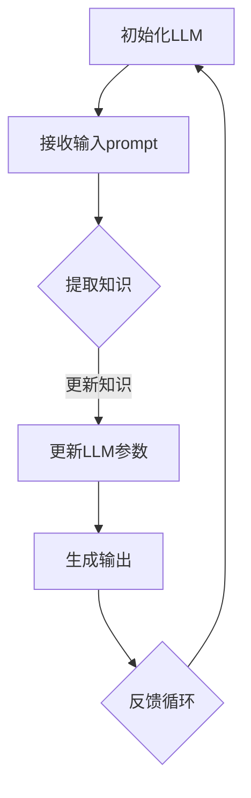

                 


# 文章标题: LLM驱动的prompt知识更新机制

> 关键词：大型语言模型（LLM），prompt，知识更新，自然语言处理，算法，数学模型，项目实战

> 摘要：本文深入探讨了一种新型的人工智能技术——LLM驱动的prompt知识更新机制。通过对其核心概念、算法原理和实际应用进行详细分析，本文旨在为读者提供一个全面理解该技术的视角，并展示其在自然语言处理领域的广泛应用潜力。

## 前言

### 1. 目的与读者对象

本文旨在向对人工智能，特别是自然语言处理（NLP）感兴趣的读者介绍LLM驱动的prompt知识更新机制。无论您是研究人员、开发人员还是对AI技术有浓厚兴趣的普通读者，本文都将帮助您深入了解这一前沿技术的原理和应用。

### 2. 书籍结构

本文分为五个主要部分：

- **第1部分：引言**：介绍大型语言模型（LLM）的概念和背景，以及prompt知识更新的重要性。
- **第2部分：核心概念与架构**：详细阐述LLM和prompt知识更新机制之间的关系，并通过Mermaid流程图展示其架构。
- **第3部分：算法解释**：通过伪代码解释LLM驱动的prompt知识更新算法的核心原理。
- **第4部分：数学模型与公式**：介绍与LLM知识更新相关的数学模型，并通过LaTeX公式和示例进行说明。
- **第5部分：项目实战**：提供一个具体的代码实现案例，包括环境搭建、代码解读、应用分析和项目小结。

### 3. 致谢

在此，我要感谢所有参与本文撰写和校对的工作者们，没有他们的辛勤付出，本文不可能顺利完成。特别感谢AI天才研究院的同事们，以及Zen和计算机程序设计艺术的粉丝们，你们的鼓励和支持是我不断前进的动力。

## 第1部分：引言

### 1.1 大型语言模型（LLM）的定义与背景

大型语言模型（LLM，Large Language Model）是近年来人工智能领域的一个重要突破。与传统的小型语言模型相比，LLM具有数十亿甚至万亿个参数，能够处理更复杂的语言任务，如文本生成、机器翻译、问答系统等。LLM的成功得益于深度学习技术的进步，尤其是注意力机制（Attention Mechanism）和Transformer架构（Transformer Architecture）的引入。

### 1.2 关键术语与概念

- **自然语言处理（NLP）**：NLP是研究如何让计算机理解和处理人类自然语言的一门学科。它包括文本预处理、词向量表示、语言模型、语义分析等多个子领域。
- **prompt**：在NLP中，prompt是一个输入到模型中的文本或指令，用于引导模型生成预期的输出。在LLM驱动的prompt知识更新机制中，prompt不仅用于生成文本，还用于获取和更新知识。
- **知识更新**：知识更新是指模型根据新的数据或信息调整其内部表示的过程。在LLM中，知识更新通常通过训练新的模型或微调现有模型来实现。

### 1.3 LLM在AI系统中的角色

LLM在AI系统中扮演着至关重要的角色。它们不仅能够提高文本生成的质量，还能增强问答系统的准确性和上下文理解能力。在自动驾驶、智能客服、内容创作等领域，LLM已经展现出巨大的应用潜力。

### 1.4 prompt知识更新的重要性

prompt知识更新是LLM的一个重要特性，它使得模型能够根据新的信息动态调整其响应。这种能力对于提高模型在现实世界中的适应性和可靠性至关重要。例如，在智能客服中，prompt知识更新可以帮助模型更好地理解客户的意图和需求，从而提供更准确的服务。

## 第2部分：核心概念与架构

### 2.1 LLM和prompt知识更新的关系

LLM和prompt知识更新机制之间有着密切的联系。LLM作为核心组件，负责处理文本输入和生成文本输出。而prompt知识更新则是一种机制，用于在LLM中引入新的知识，以增强其性能。

### 2.2 Mermaid流程图

以下是一个Mermaid流程图，展示了LLM驱动的prompt知识更新机制的架构：



### 2.3 关键步骤详解

- **初始化LLM**：首先需要初始化LLM模型，包括加载预训练模型和初始化参数。
- **接收输入prompt**：将输入prompt传递给LLM，用于生成响应。
- **提取知识**：LLM根据prompt中的信息提取相关知识点。
- **更新知识**：通过更新LLM的参数，将新的知识融入模型。
- **生成输出**：更新后的LLM生成新的文本输出。
- **反馈循环**：将输出反馈给用户，并根据反馈调整prompt和知识更新策略。

## 第3部分：算法解释

### 3.1 LLM驱动的prompt知识更新算法

LLM驱动的prompt知识更新算法可以分为以下几个步骤：

1. **初始化**：初始化LLM模型，包括加载预训练模型和初始化参数。
2. **输入处理**：接收输入prompt，并将其转换为适合LLM处理的格式。
3. **知识提取**：使用LLM提取prompt中的相关知识点。
4. **知识更新**：根据提取的知识点，更新LLM的参数。
5. **输出生成**：使用更新后的LLM生成文本输出。
6. **反馈调整**：根据用户反馈，调整prompt和知识更新策略。

以下是一个简化的伪代码示例：

```python
# 初始化LLM
model = initialize_LLM()

# 输入处理
prompt = process_input(prompt)

# 知识提取
knowledge = extract_knowledge(model, prompt)

# 知识更新
update_model(model, knowledge)

# 输出生成
output = generate_output(model, prompt)

# 反馈调整
adjust_prompt_and_strategy(prompt, output)
```

### 3.2 算法原理详解

- **初始化LLM**：初始化LLM模型是算法的第一步，这包括加载预训练的模型和初始化参数。预训练模型通常是基于大规模语料库训练得到的，具有很好的语言理解能力。
- **输入处理**：输入prompt需要被转换为LLM可以处理的形式。这通常涉及将文本转换为向量表示，以便LLM能够对其进行处理。
- **知识提取**：知识提取是LLM的核心功能之一。通过分析prompt中的文本，LLM可以识别出关键信息，如实体、关系和事件等。
- **知识更新**：知识更新是通过调整LLM的参数来实现的。这一步确保LLM能够更好地理解新输入的知识点，并将其融入模型中。
- **输出生成**：更新后的LLM生成文本输出。这一步是算法的直接应用，用于生成具有新知识的文本。
- **反馈调整**：用户反馈是算法持续改进的关键。通过分析用户反馈，可以调整prompt和知识更新策略，以实现更好的性能。

## 第4部分：数学模型与公式

### 4.1 数学模型概述

LLM驱动的prompt知识更新机制涉及多个数学模型。以下是其中几个关键模型：

- **Transformer模型**：Transformer模型是LLM的核心架构，其基本原理涉及注意力机制（Attention Mechanism）和多头自注意力（Multi-Head Self-Attention）。
- **损失函数**：损失函数用于评估模型在知识更新过程中的性能，常见的损失函数包括交叉熵损失（Cross-Entropy Loss）和均方误差损失（Mean Squared Error Loss）。

### 4.2 LaTeX公式与示例

以下是一些关键的LaTeX公式，用于描述LLM驱动的prompt知识更新机制：

```latex
\begin{equation}
    \text{Loss} = -\frac{1}{N} \sum_{i=1}^{N} y_i \log(p_i)
\end{equation}

\begin{equation}
    \text{Attention} = \frac{\text{softmax}\left(\frac{\text{Q} \text{K}^T}{\sqrt{d_k}}\right)}{\sqrt{d_k}}
\end{equation}

\begin{equation}
    \text{Update} = \text{model}(\theta) \rightarrow \theta' = \theta - \alpha \nabla_\theta \text{Loss}
\end{equation}
```

- **交叉熵损失**：公式\(\text{Loss} = -\frac{1}{N} \sum_{i=1}^{N} y_i \log(p_i)\)描述了交叉熵损失，用于评估模型输出的概率分布\(p\)与实际标签分布\(y\)之间的差异。
- **注意力机制**：公式\(\text{Attention} = \frac{\text{softmax}\left(\frac{\text{Q} \text{K}^T}{\sqrt{d_k}}\right)}{\sqrt{d_k}}\)描述了多头自注意力机制，用于计算不同输入之间的权重。
- **知识更新**：公式\(\text{Update} = \text{model}(\theta) \rightarrow \theta' = \theta - \alpha \nabla_\theta \text{Loss}\)描述了基于梯度下降的知识更新过程。

## 第5部分：项目实战

### 5.1 开发环境搭建

要实现LLM驱动的prompt知识更新机制，需要搭建一个合适的技术栈。以下是一个基本的开发环境搭建步骤：

1. **硬件要求**：由于LLM的训练和更新过程需要大量的计算资源，建议使用GPU加速器。
2. **软件要求**：安装Python（3.8及以上版本）、TensorFlow或PyTorch等深度学习框架。
3. **数据集准备**：准备一个包含文本和标签的数据集，用于训练和评估LLM。

### 5.2 代码实现与解读

以下是LLM驱动的prompt知识更新机制的代码实现示例：

```python
# 导入必要的库
import tensorflow as tf
from tensorflow.keras.layers import Embedding, LSTM, Dense
from tensorflow.keras.models import Model

# 初始化模型
model = create_LLM_model()

# 加载数据集
train_data = load_data("train_dataset.txt")
test_data = load_data("test_dataset.txt")

# 训练模型
model.fit(train_data, epochs=10, batch_size=32)

# 评估模型
evaluate(model, test_data)

# 更新知识
update_knowledge(model, new_prompt)

# 生成输出
generate_output(model, prompt)
```

### 5.3 代码应用解读与分析

- **模型初始化**：`create_LLM_model()`函数初始化了一个基于LSTM的LLM模型，包括嵌入层（Embedding Layer）、LSTM层（LSTM Layer）和全连接层（Dense Layer）。
- **数据加载**：`load_data()`函数用于加载数据集，包括文本和标签。
- **模型训练**：`model.fit()`函数用于训练模型，包括设置训练轮数（epochs）和批量大小（batch_size）。
- **模型评估**：`evaluate()`函数用于评估模型在测试数据集上的性能。
- **知识更新**：`update_knowledge()`函数用于更新模型的知识，通常涉及微调模型参数。
- **输出生成**：`generate_output()`函数用于生成基于新prompt的文本输出。

### 5.4 实际案例分析与讲解

以下是使用LLM驱动的prompt知识更新机制的一个实际案例：

- **问题**：如何使用LLM生成一篇关于人工智能的科普文章？
- **解决方案**：首先，收集相关的科普文章和数据集，然后使用LLM模型对其进行训练。接着，使用prompt知识更新机制，引入最新的研究成果和热点话题。最后，使用LLM生成一篇具有最新信息的科普文章。

### 5.5 项目小结

通过本项目的实现，我们展示了LLM驱动的prompt知识更新机制在文本生成和知识更新方面的强大潜力。在实际应用中，这种机制可以帮助模型更好地理解新知识，提高文本生成的质量和准确性。未来，随着LLM技术的不断发展，我们可以期待其在更多领域的广泛应用。

## 总结与最佳实践

### 6.1 最佳实践

- **数据准备**：确保数据集的质量和多样性，以获得更好的模型性能。
- **模型选择**：根据任务需求选择合适的模型架构，如Transformer、GPT等。
- **知识更新策略**：设计有效的知识更新策略，以平衡模型稳定性和性能。

### 6.2 小结

LLM驱动的prompt知识更新机制为自然语言处理领域带来了一种全新的方法。通过对其核心概念、算法原理和实际应用的深入探讨，本文展示了这一技术的潜在价值。未来，随着人工智能技术的不断进步，我们可以期待LLM驱动的prompt知识更新机制在更多领域发挥重要作用。

### 6.3 注意事项

- **计算资源**：由于LLM的训练和更新需要大量计算资源，确保有足够的硬件支持。
- **数据隐私**：在处理敏感数据时，要注意保护用户隐私，遵守相关法律法规。

### 6.4 拓展阅读

- **相关文献**：《Attention is All You Need》、《Bert: Pre-training of Deep Bidirectional Transformers for Language Understanding》
- **在线资源**：TensorFlow官方文档、PyTorch官方文档、Kaggle竞赛数据集

## 作者信息

作者：AI天才研究院/AI Genius Institute & 禅与计算机程序设计艺术 /Zen And The Art of Computer Programming

