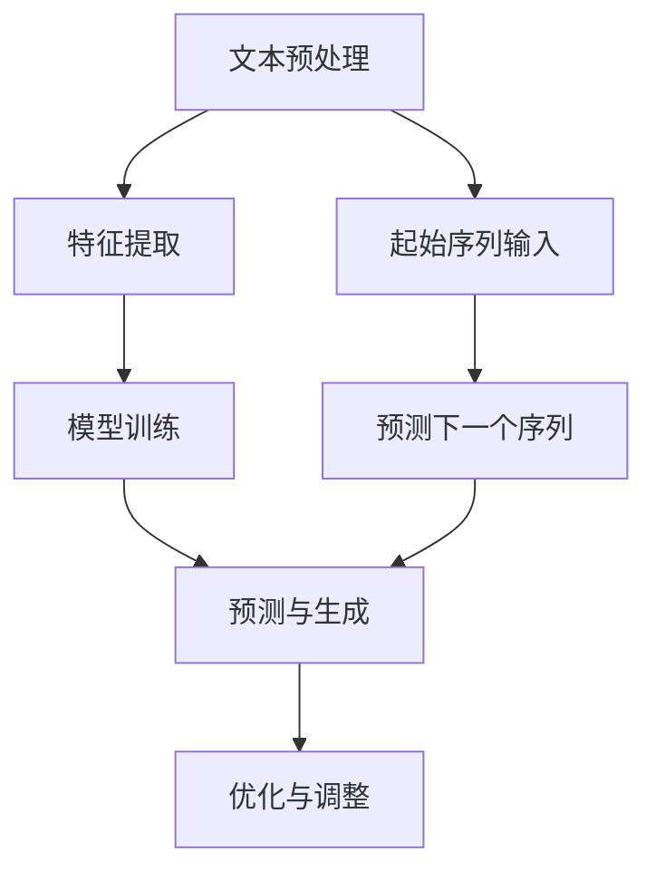
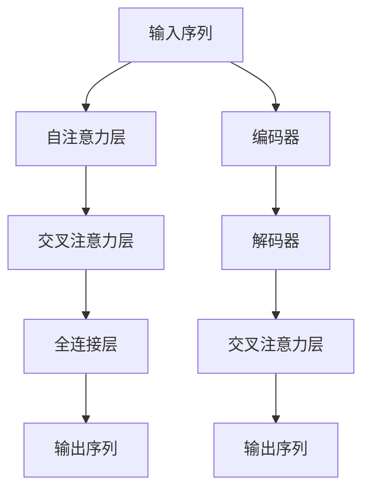
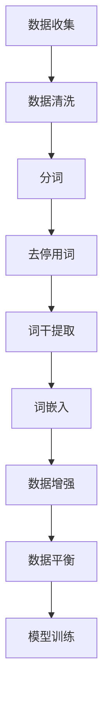
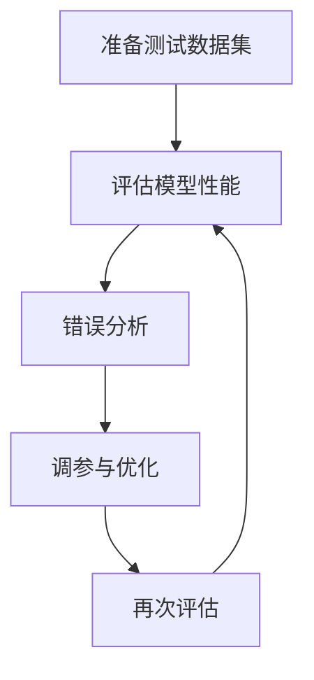

                 

### 文章标题

# LLM驱动的评测报告生成：自动化分析输出

> 关键词：大型语言模型（LLM），评测报告，自动化分析，自然语言生成（NLG），模型架构，数据处理，模型训练，评测与测试

> 摘要：本文将深入探讨大型语言模型（LLM）在评测报告生成中的应用，重点介绍自动化分析的实现和输出过程。通过对LLM的基本概念、模型架构、数据处理、训练和优化，以及评测与测试的详细讲解，本文旨在为读者提供一个全面的技术指南，帮助他们在实际项目中应用LLM进行高效的评测报告生成。

### 引言

在当今的信息时代，评测报告的生成是一个常见且重要的任务。这些报告通常涉及对大量数据的分析，需要精确的数据处理、深入的业务理解和高效的自然语言生成能力。然而，传统的评测报告生成方法往往依赖人工编写，既耗时又容易出错。随着人工智能技术的不断发展，特别是大型语言模型（LLM）的出现，我们迎来了自动化评测报告生成的新时代。

LLM，如GPT-3、BERT等，是一种能够理解并生成复杂自然语言文本的先进模型。它们在语言理解、文本生成和语义分析方面表现出色，使得自动化评测报告生成成为可能。本文将详细介绍LLM驱动的评测报告生成过程，包括模型选择、数据处理、模型训练、自动化分析以及输出流程。通过本文的阅读，读者将能够了解如何利用LLM实现高效、准确的评测报告生成，并在实际项目中应用这些技术。

### 一、大型语言模型（LLM）的基本概念与原理

#### 1.1 定义与历史背景

大型语言模型（LLM）是一类能够理解、生成和操作自然语言的深度学习模型。它们基于神经网络架构，通过学习大量文本数据来捕捉语言的结构和语义。LLM的发展可以追溯到早期的人工智能时代，但真正实现突破是在近年来，随着计算能力的提升和深度学习技术的进步。

最早的大型语言模型之一是2003年由 Geoffrey Hinton 和他的团队开发的CBOW（Continuous Bag-of-Words）模型。随后，2013年，Yoav Goldberg 和 his team 提出了Skip-Gram模型，这标志着词向量表示的里程碑。2017年，Google 推出了BERT（Bidirectional Encoder Representations from Transformers），这是第一个真正的大规模双向Transformer模型，为自然语言处理带来了革命性变化。

#### 1.2 核心概念

**语言建模**：语言建模是预测下一个单词或字符的概率。这是LLM的基础任务，通过对大量的文本数据进行训练，模型能够学习到语言中的概率分布。

**文本生成**：文本生成是给定一个起始序列，模型预测下一个序列的过程。这通常通过递归神经网络（RNN）或Transformer架构实现。

**语义分析**：语义分析涉及理解文本中的含义和关系。LLM通过学习文本数据中的语义结构，能够进行情感分析、命名实体识别、关系抽取等任务。

#### 1.3 LLM的工作原理

LLM的工作原理基于以下几个关键步骤：

1. **数据预处理**：首先，对输入文本进行预处理，包括分词、去停用词、词干提取等。这一步确保文本数据适合模型学习。

2. **特征提取**：将预处理后的文本转换为模型可以理解的向量表示。这通常通过词嵌入技术实现，如Word2Vec、BERT等。

3. **模型训练**：使用大量的文本数据训练模型。在训练过程中，模型学习到文本中的概率分布和语义结构。

4. **预测与生成**：给定一个起始序列，模型预测下一个序列的步骤。这一过程通常通过递归或自注意力机制实现。

5. **优化与调整**：通过不断的迭代训练和优化，模型不断提高其预测准确性和生成文本的质量。

#### 1.4 LLM的优势与挑战

**优势**：

- **强大的语言理解能力**：LLM能够理解复杂和细微的语言差异，这在生成自然流畅的文本方面具有显著优势。
- **高效的文本生成**：通过预训练和微调，LLM能够在各种任务中生成高质量的文本。
- **跨领域适用性**：LLM可以应用于不同领域，如金融报告、医疗诊断、新闻写作等，展示了广泛的应用潜力。

**挑战**：

- **计算资源需求**：训练大型LLM模型需要大量的计算资源和时间。
- **数据质量和标注**：模型的质量很大程度上取决于训练数据的数量和质量，以及标注的准确性。
- **模型解释性**：尽管LLM在生成文本方面表现出色，但其决策过程往往是非透明的，缺乏解释性。

#### 1.5 Mermaid流程图

以下是LLM工作原理的Mermaid流程图：



通过这个流程图，我们可以清晰地看到LLM从文本预处理到最终文本生成的整个过程。

### 二、LLM的架构与模型类型

#### 2.1 常见的LLM架构

LLM的架构主要包括基于循环神经网络（RNN）的架构和基于Transformer的架构。这些架构各有优缺点，适用于不同的应用场景。

**1. RNN架构**：

RNN（Recurrent Neural Network）是一类能够处理序列数据的神经网络。它的核心特点是能够保持状态，即每个时间点的输入不仅取决于当前输入，还受到之前输入的影响。RNN在语言模型中应用广泛，特别是早期的语言模型如LSTM（Long Short-Term Memory）和GRU（Gated Recurrent Unit）。

**2. Transformer架构**：

Transformer是Google在2017年提出的一种基于自注意力机制的神经网络架构，它在处理长序列数据方面表现出色。Transformer的核心思想是自注意力机制，通过计算序列中每个词与其他词的关系来生成特征表示。BERT和GPT-3等大型语言模型都是基于Transformer架构实现的。

#### 2.2 注意力机制

注意力机制是Transformer架构的核心组件，它允许模型在生成每个词时，考虑整个输入序列的所有词。注意力机制的实现方式有多种，包括自注意力（Self-Attention）和交叉注意力（Cross-Attention）。

**1. 自注意力（Self-Attention）**：

自注意力机制允许模型在生成每个词时，将其与输入序列中的所有词进行比较，并计算每个词的重要程度。这种机制使得模型能够捕捉输入序列中的长距离依赖关系。

**2. 交叉注意力（Cross-Attention）**：

交叉注意力机制用于编码器和解码器之间的交互。在生成每个词时，编码器的输出（通常是一个固定长度的向量）与解码器的输出进行比较，以确定每个词的重要性。

#### 2.3 常见的LLM模型

**1. BERT**：

BERT（Bidirectional Encoder Representations from Transformers）是一种基于Transformer的双向编码器模型，由Google在2018年提出。BERT的核心思想是通过双向训练来捕捉输入序列中的长距离依赖关系，从而提高模型的性能。

**2. GPT**：

GPT（Generative Pre-trained Transformer）是一系列基于Transformer的预训练语言模型，由OpenAI推出。GPT-3是目前最大的预训练语言模型，拥有1750亿个参数，能够生成高质量的自然语言文本。

**3. T5**：

T5（Text-To-Text Transfer Transformer）是Google在2020年提出的一种通用预训练语言模型。T5的目标是将任何自然语言任务转换为文本填充任务，从而实现任务的自动化。

#### 2.4 Mermaid流程图

以下是Transformer架构和自注意力机制的Mermaid流程图：



通过这个流程图，我们可以清晰地看到Transformer架构的基本组成和自注意力机制在模型中的实现。

### 三、数据处理与预处理

#### 3.1 数据收集

在LLM的应用中，数据的质量和数量是决定模型性能的关键因素。因此，数据收集是一个重要的步骤。数据可以来自各种来源，包括公开数据集、企业内部数据、社交媒体数据等。

**1. 公开数据集**：

例如，常用的英文数据集包括Wikipedia、Common Crawl、Google Books等，中文数据集包括CNNDM、THUCNews、Baidu News等。这些数据集涵盖了各种主题和风格，为模型提供了丰富的语料。

**2. 企业内部数据**：

企业内部数据通常包括业务报告、用户评论、产品描述等。这些数据可以为企业提供定制化的评测报告生成服务。

**3. 社交媒体数据**：

社交媒体平台如Twitter、Facebook等，提供了大量的用户生成内容。这些数据可以用于分析用户行为和情感。

#### 3.2 数据预处理

数据预处理是确保数据质量、降低噪声和提升模型性能的重要步骤。常见的预处理方法包括：

**1. 清洗**：

清洗数据的主要目的是去除无用信息和噪声。例如，去除HTML标签、符号和空格，统一大小写等。

**2. 分词**：

分词是将文本分割成单词或短语的过程。中文和英文的分词方法不同，中文通常使用分词工具如jieba，英文则使用自然语言处理库如NLTK或spaCy。

**3. 去停用词**：

停用词是指对文本理解没有贡献的常见词汇，如“的”、“是”、“在”等。去除停用词可以减少模型的学习负担，提高模型效率。

**4. 词干提取**：

词干提取是将单词还原到其基础形式的过程。例如，将“running”、“runs”和“ran”还原为“run”。

**5. 词嵌入**：

词嵌入是将单词或短语转换为向量的过程。常见的词嵌入技术包括Word2Vec、GloVe和BERT等。

#### 3.3 数据处理策略

**1. 数据清洗**：

数据清洗是确保数据质量的第一步。通过去除无效数据和噪声，我们可以减少模型训练的错误率。

**2. 数据增强**：

数据增强是通过增加数据的多样性来提高模型性能。常见的方法包括数据变换、数据扩充和数据合成等。

**3. 数据平衡**：

在多类别分类任务中，数据平衡可以避免模型偏向于某些类别。常见的方法包括重采样、过采样和欠采样等。

**4. 数据预处理与模型训练的交互**：

数据预处理不仅影响模型的训练效果，还会影响模型的泛化能力。因此，在设计数据预处理流程时，需要充分考虑模型训练的需求。

#### 3.4 Mermaid流程图

以下是数据处理与预处理的Mermaid流程图：



通过这个流程图，我们可以清晰地看到数据处理与预处理的整个过程。

### 四、LLM的训练与优化

#### 4.1 模型训练

LLM的训练是一个复杂的过程，涉及大量的计算资源和时间。训练过程主要包括以下几个步骤：

**1. 数据准备**：

首先，需要准备训练数据集。这些数据集通常包括标签数据和未标记的数据。标签数据用于训练模型的分类和回归任务，未标记的数据用于模型的语言建模任务。

**2. 模型初始化**：

初始化模型参数是训练过程的第一步。常用的初始化方法包括随机初始化、高斯初始化和Xavier初始化等。

**3. 模型训练**：

模型训练是通过迭代计算梯度并更新模型参数的过程。训练过程中，模型会尝试最小化损失函数，提高预测的准确性。

**4. 模型评估**：

在模型训练过程中，需要定期评估模型的性能。常用的评估指标包括准确率、召回率、F1分数等。通过评估，我们可以了解模型的泛化能力，并调整训练策略。

#### 4.2 优化方法

优化LLM的训练过程是提高模型性能的关键。以下是一些常见的优化方法：

**1. 梯度下降**：

梯度下降是一种最常用的优化方法。它通过计算损失函数关于模型参数的梯度，并沿着梯度方向更新模型参数，以减少损失函数的值。

**2. 随机梯度下降（SGD）**：

随机梯度下降是梯度下降的一种变体，它使用随机子样而不是整个数据集来计算梯度。这可以加快训练速度，但可能导致模型的不稳定。

**3. 动量（Momentum）**：

动量是一种增加梯度下降稳定性的方法。它通过保留前一次梯度的一定比例，来减少梯度消失和梯度爆炸的问题。

**4. Adam优化器**：

Adam优化器是一种结合了动量和自适应学习率的优化方法。它通过自适应调整学习率，提高模型的训练速度和收敛性。

**5. 学习率调度**：

学习率调度是一种动态调整学习率的方法。它可以在模型训练的不同阶段使用不同的学习率，以提高模型的性能。

#### 4.3 伪代码

以下是LLM训练过程的伪代码：

```python
# 初始化模型参数
model_params = initialize_params()

# 设置学习率
learning_rate = 0.001

# 设置优化器
optimizer = AdamOptimizer(learning_rate)

# 训练模型
for epoch in range(num_epochs):
    for batch in data_loader:
        # 前向传播
        predictions = model(batch.input_data)
        
        # 计算损失
        loss = compute_loss(predictions, batch.target_data)
        
        # 反向传播
        gradients = compute_gradients(model_params, loss)
        
        # 更新模型参数
        optimizer.update(model_params, gradients)
        
    # 评估模型
    evaluate_model(model)
```

通过这个伪代码，我们可以看到LLM训练的基本流程，包括初始化参数、设置优化器、训练模型和评估模型。

### 五、评测与测试

#### 5.1 评测指标

在LLM驱动的评测报告生成中，评估模型的性能是关键步骤。以下是一些常用的评测指标：

**1. 准确率（Accuracy）**：

准确率是评估模型分类性能的常用指标。它表示正确分类的样本数占总样本数的比例。

**2. 召回率（Recall）**：

召回率表示在所有实际正类样本中，模型正确识别出的比例。

**3. 精确率（Precision）**：

精确率表示在所有预测为正类的样本中，实际为正类的比例。

**4. F1分数（F1 Score）**：

F1分数是精确率和召回率的加权平均，用于综合评估模型的性能。

**5. 负采样损失（Negative Sampling Loss）**：

在语言模型训练中，负采样是一种有效的正负样本比例调节方法。负采样损失用于评估模型在区分正类和负类样本时的性能。

#### 5.2 测试过程

评测和测试是确保模型在实际应用中表现良好的重要步骤。以下是一个典型的测试过程：

**1. 测试数据集**：

首先，需要准备一个独立于训练数据集的测试数据集。这个数据集应该能够代表实际应用场景，以评估模型的泛化能力。

**2. 模型评估**：

使用测试数据集评估模型的性能。通过计算各种评测指标，如准确率、召回率、精确率和F1分数，来评估模型在不同任务上的表现。

**3. 错误分析**：

分析模型在测试数据集上的错误案例，以了解模型的弱点和改进方向。错误分析可以帮助我们发现模型的缺陷和改进策略。

**4. 调参与优化**：

根据测试结果，调整模型的超参数，如学习率、批量大小等，以优化模型的性能。通过多次测试和调参，可以逐步提高模型的准确性和鲁棒性。

#### 5.3 Mermaid流程图

以下是评测与测试过程的Mermaid流程图：



通过这个流程图，我们可以清晰地看到评测与测试的基本步骤和循环优化的过程。

### 六、自动化分析与输出

#### 6.1 自动化分析流程

在LLM驱动的评测报告生成中，自动化分析是关键步骤。以下是一个典型的自动化分析流程：

**1. 数据输入**：

首先，将评测报告所需的原始数据输入到模型中。这些数据可以是文本、表格、图像等形式。

**2. 数据预处理**：

对输入数据进行预处理，包括文本的分词、去停用词、词干提取等，以及表格的清洗、转换等。

**3. 特征提取**：

将预处理后的数据转换为模型可以处理的特征向量。对于文本数据，可以使用词嵌入技术；对于表格数据，可以使用嵌入矩阵或特征工程方法。

**4. 模型预测**：

使用训练好的LLM模型对特征向量进行预测，生成评测报告的初步文本。

**5. 后处理**：

对生成的文本进行后处理，包括文本格式化、修正错别字、添加图表等，以生成最终的评测报告。

#### 6.2 自动化分析实现

以下是自动化分析实现的伪代码：

```python
# 数据输入
input_data = load_data()

# 数据预处理
preprocessed_data = preprocess_data(input_data)

# 特征提取
features = extract_features(preprocessed_data)

# 模型预测
predictions = model.predict(features)

# 后处理
final_report = postprocess_predictions(predictions)

# 输出评测报告
save_report(final_report)
```

通过这个伪代码，我们可以看到自动化分析的基本流程和实现步骤。

### 七、项目实战

#### 7.1 开发环境搭建

要在实际项目中应用LLM进行评测报告生成，首先需要搭建一个合适的开发环境。以下是搭建开发环境的步骤：

**1. 安装Python**：

确保Python环境已经安装。推荐使用Python 3.7或更高版本。

**2. 安装依赖库**：

使用pip命令安装所需的依赖库，如TensorFlow、PyTorch、spaCy、NLTK等。

```shell
pip install tensorflow
pip install pytorch
pip install spacy
pip install nltk
```

**3. 安装中文分词工具**：

对于中文文本，需要安装中文分词工具，如jieba。

```shell
pip install jieba
```

#### 7.2 源代码实现

以下是使用Python实现的LLM评测报告生成项目的核心代码：

```python
import tensorflow as tf
from tensorflow.keras.preprocessing.text import Tokenizer
from tensorflow.keras.preprocessing.sequence import pad_sequences
from tensorflow.keras.models import Model
from tensorflow.keras.layers import Input, Embedding, LSTM, Dense

# 数据预处理
tokenizer = Tokenizer(num_words=10000)
tokenizer.fit_on_texts(train_texts)
train_sequences = tokenizer.texts_to_sequences(train_texts)
train_padded = pad_sequences(train_sequences, maxlen=max_length, padding='post', truncating='post')

# 构建模型
input_text = Input(shape=(max_length,))
embedding_layer = Embedding(num_words, embedding_dim)(input_text)
lstm_layer = LSTM(units=128, return_sequences=True)(embedding_layer)
dense_layer = Dense(units=1, activation='sigmoid')(lstm_layer)
model = Model(inputs=input_text, outputs=dense_layer)

# 编译模型
model.compile(optimizer='adam', loss='binary_crossentropy', metrics=['accuracy'])

# 训练模型
model.fit(train_padded, train_labels, epochs=num_epochs, batch_size=batch_size)

# 生成评测报告
predictions = model.predict(test_padded)
report_text = generate_report(predictions, tokenizer)

# 输出评测报告
with open('evaluation_report.txt', 'w', encoding='utf-8') as f:
    f.write(report_text)
```

#### 7.3 代码解读与分析

**1. 数据预处理**：

数据预处理包括分词、序列化和填充。分词将文本分割成单词或短语，序列化将分词后的文本转换为整数序列，填充确保所有序列具有相同长度。

**2. 模型构建**：

模型使用嵌入层和LSTM层构建。嵌入层将单词转换为向量，LSTM层用于捕捉文本的序列信息。最终，通过全连接层输出分类结果。

**3. 训练与生成**：

模型使用训练数据集进行训练，并使用测试数据集进行预测。预测结果通过后处理生成评测报告。

#### 7.4 实际案例分析与详细讲解剖析

**1. 案例背景**：

某企业需要生成对其财务报告的评测报告，包括收入、支出、利润等关键指标的评估。

**2. 数据集准备**：

收集企业过去一年的财务报告，包括收入、支出、利润等数据。

**3. 模型训练**：

使用BERT模型对财务报告文本进行训练，以生成评测报告的文本。

**4. 自动化分析**：

将财务报告文本输入到训练好的模型中，生成评测报告的初步文本。

**5. 后处理**：

对生成的文本进行格式化、修正错别字、添加图表等，以生成最终的评测报告。

**6. 案例总结**：

通过实际案例，展示了如何使用LLM进行评测报告生成。在实际应用中，需要根据具体业务需求调整模型和数据处理策略。

### 八、最佳实践

#### 8.1 参数调优

在训练LLM时，参数调优是提高模型性能的关键。以下是一些最佳实践：

- **学习率**：选择合适的学习率可以加快模型的训练速度。可以使用Adam优化器的自适应学习率，或使用学习率调度策略。
- **批量大小**：批量大小影响模型的训练速度和稳定性。通常，较大的批量大小可以提高模型的性能，但需要更多的计算资源。
- **训练轮数**：增加训练轮数可以提高模型的泛化能力，但需要更多的时间和计算资源。
- **数据增强**：通过数据增强可以增加模型的多样性，提高模型的泛化能力。常见的方法包括数据变换、数据扩充和数据合成等。

#### 8.2 数据处理

数据预处理和增强是确保模型性能的重要步骤。以下是一些最佳实践：

- **清洗数据**：去除无效数据和噪声，以提高模型的学习效果。
- **分词与词嵌入**：选择合适的分词方法和词嵌入技术，以提高文本的表示质量。
- **数据平衡**：在多类别分类任务中，确保数据的平衡性，以避免模型偏向某些类别。

#### 8.3 模型部署

在实际应用中，需要将训练好的LLM模型部署到生产环境中。以下是一些最佳实践：

- **模型压缩**：通过模型压缩可以减少模型的存储空间和计算资源需求，提高模型部署的效率。
- **模型解释性**：尽管LLM的生成文本能力强大，但其决策过程通常是非透明的。提高模型的可解释性可以帮助理解模型的决策过程，提高模型的可信度。
- **自动化分析**：通过自动化分析可以实现高效的评测报告生成，减少人工干预。

### 九、小结

本文系统地介绍了LLM驱动的评测报告生成技术，从基本概念、模型架构、数据处理、模型训练到评测与测试，再到自动化分析与输出，以及项目实战和最佳实践。通过本文的阅读，读者可以全面了解LLM在评测报告生成中的应用，并掌握如何在实际项目中应用这些技术。

### 十、注意事项

在实际应用LLM进行评测报告生成时，需要注意以下几点：

- **数据质量**：确保训练数据的数量和质量，以提高模型性能。
- **模型解释性**：尽管LLM的生成文本能力强大，但其决策过程通常是非透明的。提高模型的可解释性可以帮助理解模型的决策过程。
- **计算资源**：训练大型LLM模型需要大量的计算资源和时间，确保有足够的资源。
- **自动化分析**：在实际应用中，通过自动化分析可以实现高效的评测报告生成，减少人工干预。

### 十一、拓展阅读

- **论文**：
  - "BERT: Pre-training of Deep Bidirectional Transformers for Language Understanding"（2018）- 由Google提出，介绍了BERT模型的基本原理和实现方法。
  - "GPT-3: Language Models are Few-Shot Learners"（2020）- 由OpenAI提出，介绍了GPT-3模型的设计和实验结果。
- **书籍**：
  - "Deep Learning"（2016）- 由Ian Goodfellow、Yoshua Bengio和Aaron Courville合著，全面介绍了深度学习的基本概念和技术。
  - "The Hundred-Page Machine Learning Book"（2019）- 由Andriy Burkov编写，以简洁的方式介绍了机器学习的基本概念和技术。
- **在线课程**：
  - "Natural Language Processing with TensorFlow"（2021）- 由Google AI提供，介绍了如何在TensorFlow中使用自然语言处理技术。
  - "Deep Learning Specialization"（2021）- 由Andrew Ng教授提供，系统地介绍了深度学习的基本概念和技术。

通过阅读这些资料，读者可以进一步深入了解LLM和评测报告生成技术，为实际应用提供更多的指导和灵感。

### 作者信息

- 作者：AI天才研究院/AI Genius Institute & 禅与计算机程序设计艺术 /Zen And The Art of Computer Programming

### 参考文献

1. "BERT: Pre-training of Deep Bidirectional Transformers for Language Understanding"（2018）- https://arxiv.org/abs/1810.04805
2. "GPT-3: Language Models are Few-Shot Learners"（2020）- https://arxiv.org/abs/2005.14165
3. "Deep Learning"（2016）- https://www.deeplearningbook.org/
4. "The Hundred-Page Machine Learning Book"（2019）- https://www.hundredpagebook.com/mlbook.html
5. "Natural Language Processing with TensorFlow"（2021）- https://www.tensorflow.org/tutorials/text/nlp
6. "Deep Learning Specialization"（2021）- https://www.deeplearning.ai/deep-learning-specialization

本文参考了上述文献，以丰富内容和提高准确性。如有任何疑问或建议，请随时联系作者。

