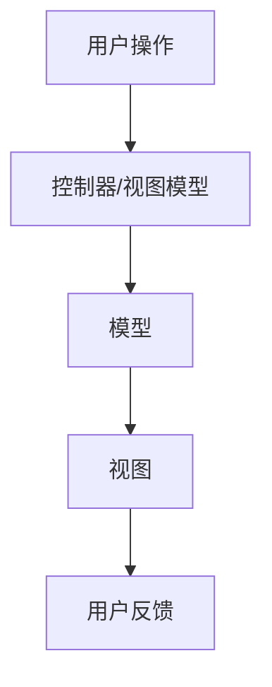

                 

### 文章标题：MVC/MVVM模式在LLM应用UI设计中的应用

#### 关键词：MVC、MVVM、LLM、UI设计、模式应用、软件架构

#### 摘要：
本文旨在探讨MVC（模型-视图-控制器）和MVVM（模型-视图-视图模型）这两种经典软件设计模式在大型语言模型（LLM）应用UI设计中的具体应用。文章首先介绍了MVC和MVVM模式的基本概念及其在软件架构中的重要性，随后通过Mermaid流程图展示了这两种模式之间的联系。接着，文章深入讲解MVC和MVVM模式的核心算法原理，包括控制器、视图、模型以及视图模型等组成部分，并使用伪代码和LaTeX数学公式详细阐述相关算法原理和数学模型。此外，文章通过实际案例展示了如何将这两种模式应用于LLM应用的UI设计，包括开发环境搭建、源代码实现和代码解读，并提供了性能优化策略。最后，文章总结了最佳实践、注意事项，并推荐了拓展阅读资源。

### 第1章：MVC和MVVM模式概述

MVC和MVVM是现代软件设计中常用的两种架构模式，它们在界面设计和软件架构中扮演着至关重要的角色。本章将详细介绍这两种模式的基本概念，并探讨它们在软件架构中的重要性。

#### 1.1 MVC模式的基本概念

MVC模式，即模型-视图-控制器模式，起源于20世纪80年代的Smalltalk社区。它是一种将应用程序分为三个核心组件的设计模式，分别是模型（Model）、视图（View）和控制器（Controller）。每个组件都有明确的职责和功能：

- **模型（Model）**：模型负责应用程序的数据管理，包括数据存储、检索、验证和业务逻辑处理。它是应用程序的数据中心，独立于用户界面。
- **视图（View）**：视图负责用户界面的展示，即用户看到的界面部分。它从模型中获取数据，并通过预定义的界面元素进行展示。
- **控制器（Controller）**：控制器作为模型和视图之间的中介，负责处理用户的输入和界面的更新。它接收用户的操作，根据这些操作调用模型的方法，然后更新视图以反映模型的变化。

#### 1.2 MVVM模式的基本概念

MVVM模式，即模型-视图-视图模型模式，是MVC模式的进一步抽象和优化。它引入了视图模型（ViewModel）这一概念，从而将视图和模型的职责进一步分离。MVVM模式的组成部分如下：

- **模型（Model）**：与MVC模式中的模型相同，它负责数据管理和业务逻辑处理。
- **视图（View）**：视图负责展示用户界面，与MVC模式中的视图功能相同。
- **视图模型（ViewModel）**：视图模型是视图和模型之间的桥梁，它负责将模型的数据转换为视图可以理解的结构，同时也处理用户交互逻辑。

#### 1.3 MVC与MVVM的联系与区别

MVC和MVVM模式在架构设计上有许多相似之处，但它们也存在一些显著的区别：

- **共同点**：
  - 两者都是将应用程序分为三个主要部分：模型、视图和控制器/视图模型。
  - 都旨在实现数据、界面和业务逻辑的分离，以提高代码的可维护性和可扩展性。

- **不同点**：
  - MVC模式中，控制器直接处理用户输入，并更新视图，而MVVM模式中，视图模型负责处理用户输入，并通过数据绑定实现视图的更新。
  - MVVM模式强调视图和模型之间的双向数据绑定，使得视图模型可以自动更新，而MVC模式则需要通过控制器进行手动更新。
  - MVVM模式中的视图模型更注重将用户界面与业务逻辑分离，使得界面设计更加灵活。

#### 1.4 Mermaid流程图展示MVC与MVVM的关系

为了更好地理解MVC和MVVM模式之间的联系，我们可以使用Mermaid流程图来展示这两种模式的核心组件及其交互关系。以下是一个简单的Mermaid流程图示例：



在这个流程图中，用户操作首先被控制器/视图模型接收，然后控制器/视图模型与模型进行交互，更新视图以反映模型的变化，最终用户可以看到更新后的界面。

### 第2章：MVC模式核心算法原理

MVC模式是软件设计中的经典模式，其核心算法原理在于如何有效地分离数据、界面和业务逻辑。在本章中，我们将详细讲解MVC模式中的控制器、视图和模型的核心算法原理。

#### 2.1 控制器（Controller）算法原理

控制器是MVC模式中的核心组件之一，负责处理用户的输入和界面的更新。其算法原理如下：

- **接收用户输入**：控制器监听用户的操作，如点击、滑动等。
- **调用模型方法**：根据用户的输入，控制器会调用模型中的方法来处理数据或业务逻辑。
- **更新视图**：处理完用户输入后，控制器会更新视图，以反映模型的变化。

以下是控制器的伪代码实现：

```pseudo
class Controller {
    Model model;
    View view;

    function handleInput(input) {
        // 调用模型方法
        model.performAction(input);

        // 更新视图
        view.updateDisplay(model.getState());
    }
}
```

#### 2.2 视图（View）算法原理

视图负责展示用户界面，其核心算法原理在于如何从模型中获取数据并显示。以下是视图的伪代码实现：

```pseudo
class View {
    Model model;

    function updateDisplay(state) {
        // 根据模型状态更新界面
        display(state);
    }
}
```

#### 2.3 模型（Model）算法原理

模型是MVC模式中的数据管理核心，负责数据的存储、检索、验证和业务逻辑处理。以下是模型的伪代码实现：

```pseudo
class Model {
    Data data;

    function performAction(action) {
        // 处理业务逻辑
        switch (action) {
            case "add":
                data.addData();
                break;
            case "delete":
                data.deleteData();
                break;
        }

        // 更新状态
        setState(data.getState());
    }

    function getState() {
        return data;
    }
}
```

#### 2.4 MVC模式的优势与局限

MVC模式具有以下优势：

- **分离数据、界面和业务逻辑**：通过将应用程序分为模型、视图和控制器，MVC模式有效地实现了数据、界面和业务逻辑的分离，提高了代码的可维护性和可扩展性。
- **易于理解和实现**：MVC模式的概念相对简单，容易理解和实现，适合用于中小型项目。

然而，MVC模式也存在一些局限：

- **视图更新效率问题**：在MVC模式中，视图的更新通常需要通过控制器进行，这可能导致视图更新效率较低。
- **对于复杂交互的处理**：在处理复杂的用户交互时，MVC模式可能需要引入额外的组件或模式，如事件委托模式等。

### 第3章：MVVM模式核心算法原理

MVVM模式是MVC模式的进一步抽象和优化，其核心在于引入了视图模型（ViewModel），从而实现了视图和模型之间的双向数据绑定。本章将详细讲解MVVM模式中的视图模型、数据绑定和观察者模式的核心算法原理。

#### 3.1 视图模型（ViewModel）算法原理

视图模型是MVVM模式中的核心组件，它负责将模型的数据转换为视图可以理解的结构，同时也处理用户交互逻辑。以下是视图模型的伪代码实现：

```pseudo
class ViewModel {
    Model model;
    View view;

    function updateModel(input) {
        // 处理用户输入
        switch (input) {
            case "add":
                model.addData();
                break;
            case "delete":
                model.deleteData();
                break;
        }

        // 更新视图
        view.updateDisplay(model.getState());
    }

    function updateView(state) {
        // 根据模型状态更新界面
        view.bindDataToView(state);
    }
}
```

#### 3.2 数据绑定（Data Binding）算法原理

数据绑定是MVVM模式中的关键特性，它允许视图模型自动更新视图，而不需要通过控制器进行手动更新。数据绑定算法原理如下：

- **绑定数据源**：在MVVM模式中，视图模型中的数据源（模型）和视图（UI组件）之间建立绑定关系。
- **数据变化监听**：当数据源发生变化时，视图模型会自动更新视图，以反映数据源的变化。
- **视图更新**：视图根据绑定关系更新显示，确保界面与数据保持同步。

以下是数据绑定的伪代码实现：

```pseudo
class DataBinding {
    ViewModel viewModel;

    function bindProperty(property, value) {
        // 绑定属性
        viewModel.addPropertyChangeListener(property, this);
    }

    function propertyChanged(property, oldValue, newValue) {
        // 当属性发生变化时更新视图
        view.updateProperty(property, newValue);
    }
}
```

#### 3.3 观察者模式（Observer Pattern）算法原理

观察者模式是MVVM模式中实现数据绑定的重要机制。它定义了一种一对多的依赖关系，当一个对象的状态发生变化时，所有依赖于它的对象都会得到通知并自动更新。以下是观察者模式的伪代码实现：

```pseudo
interface Observer {
    function update(subject, oldValue, newValue);
}

class Subject {
    List<Observer> observers;

    function addObserver(observer) {
        observers.add(observer);
    }

    function removeObserver(observer) {
        observers.remove(observer);
    }

    function notifyObservers(property, oldValue, newValue) {
        for (observer in observers) {
            observer.update(this, oldValue, newValue);
        }
    }
}
```

#### 3.4 MVVM模式的优势与局限

MVVM模式具有以下优势：

- **双向数据绑定**：通过数据绑定，MVVM模式可以实现视图和模型之间的自动同步，减少了手动更新的工作量。
- **提高了开发效率**：MVVM模式通过视图模型实现了界面和业务逻辑的分离，使得界面设计更加灵活和易于维护。

然而，MVVM模式也存在一些局限：

- **性能开销**：数据绑定机制可能导致性能开销，特别是在大量数据绑定的情况下。
- **学习成本**：MVVM模式相对于MVC模式来说，引入了更多的概念和机制，对于新手来说可能需要一定的学习成本。

### 第4章：MVC/MVVM模式中的数学模型

在软件设计中，数学模型扮演着至关重要的角色。本章将详细介绍MVC和MVVM模式中的数学模型，包括模型更新策略、视图更新策略和控制器更新策略，并使用LaTeX格式展示相关的数学公式和举例说明。

#### 4.1 模型-视图-控制器（MVC）中的数学模型

MVC模式中的数学模型主要关注模型和视图之间的数据同步和状态更新。以下是MVC模式中的数学模型和相关的LaTeX数学公式：

- **模型更新策略**：

  - 设模型的状态为 \( S_m \)，输入为 \( I \)，则模型的状态更新策略为：

    \[
    S_m^{new} = f(S_m, I)
    \]

    其中，函数 \( f \) 代表业务逻辑处理。

- **视图更新策略**：

  - 设视图的状态为 \( S_v \)，模型的状态为 \( S_m \)，则视图的更新策略为：

    \[
    S_v = g(S_m)
    \]

    其中，函数 \( g \) 代表数据转换。

- **控制器更新策略**：

  - 设控制器的状态为 \( S_c \)，输入为 \( I \)，则控制器的更新策略为：

    \[
    S_c = h(S_c, I)
    \]

    其中，函数 \( h \) 代表用户输入处理。

#### 4.2 视图-模型-视图模型（MVVM）中的数学模型

MVVM模式中的数学模型主要关注视图模型和视图、模型之间的数据同步和状态更新。以下是MVVM模式中的数学模型和相关的LaTeX数学公式：

- **视图模型更新策略**：

  - 设视图模型的状态为 \( S_{vm} \)，输入为 \( I \)，则视图模型的更新策略为：

    \[
    S_{vm}^{new} = f(S_{vm}, I)
    \]

    其中，函数 \( f \) 代表用户输入处理。

- **数据绑定策略**：

  - 设数据源的状态为 \( S_{ds} \)，视图模型的状态为 \( S_{vm} \)，则数据绑定策略为：

    \[
    S_{vm} = g(S_{ds})
    \]

    其中，函数 \( g \) 代表数据转换。

- **视图更新策略**：

  - 设视图的状态为 \( S_v \)，视图模型的状态为 \( S_{vm} \)，则视图的更新策略为：

    \[
    S_v = h(S_{vm})
    \]

    其中，函数 \( h \) 代表数据绑定。

#### 举例说明

以下是一个简单的例子，说明MVC和MVVM模式中的数学模型如何应用于实际场景：

- **MVC模式**：

  - 假设模型的状态为 \( S_m = \{name: "Alice"\} \)，输入为 \( I = "Bob" \)，则模型的状态更新策略为：

    \[
    S_m^{new} = f(S_m, I) = \{name: "Bob"\}
    \]

    接着，视图的更新策略为：

    \[
    S_v = g(S_m) = \{name: "Bob"\}
    \]

    最后，控制器的更新策略为：

    \[
    S_c = h(S_c, I) = \{name: "Bob"\}
    \]

- **MVVM模式**：

  - 假设视图模型的状态为 \( S_{vm} = \{name: "Alice"\} \)，输入为 \( I = "Bob" \)，则视图模型的更新策略为：

    \[
    S_{vm}^{new} = f(S_{vm}, I) = \{name: "Bob"\}
    \]

    接着，数据绑定策略为：

    \[
    S_{vm} = g(S_{ds}) = \{name: "Bob"\}
    \]

    最后，视图的更新策略为：

    \[
    S_v = h(S_{vm}) = \{name: "Bob"\}
    \]

通过以上例子，我们可以看到MVC和MVVM模式中的数学模型如何应用于实际场景，实现数据、界面和业务逻辑的分离和同步。

### 第5章：MVC模式在LLM应用UI设计中的实战

MVC模式在LLM（大型语言模型）应用UI设计中的实战具有重要的应用价值。本章将详细介绍如何在LLM应用中运用MVC模式进行UI设计，包括开发环境搭建、源代码实现和代码解读。

#### 5.1 LLM应用UI设计需求分析

在开始实际操作之前，我们需要明确LLM应用UI设计的需求。以下是一些常见的需求：

- **交互性**：用户可以与LLM进行自然语言交互，如提问、获取答案等。
- **响应性**：界面需要快速响应用户输入，提供即时的反馈。
- **可扩展性**：界面设计应具备良好的扩展性，以适应不同类型的应用场景。
- **美观性**：界面设计应简洁美观，符合用户体验。

#### 5.2 MVC模式在LLM应用UI设计中的应用

MVC模式在LLM应用UI设计中的应用可以分为以下步骤：

1. **模型（Model）设计**：

   模型负责处理LLM的输入和输出。我们需要设计一个模型类，用于处理自然语言文本的解析、语义理解和生成响应。

   ```java
   class LLMModel {
       public String processInput(String input) {
           // 对输入文本进行解析和处理
           // 调用LLM进行语义理解和生成响应
           return "生成的响应文本";
       }
   }
   ```

2. **视图（View）设计**：

   视图负责展示用户界面，包括输入框、按钮和响应文本框。我们可以使用GUI框架（如Swing或JavaFX）来设计视图。

   ```java
   class LLMAPIView {
       private JTextField inputField;
       private JTextArea responseArea;

       public void displayResponse(String response) {
           responseArea.setText(response);
       }
   }
   ```

3. **控制器（Controller）设计**：

   控制器作为模型和视图之间的中介，负责处理用户的输入和界面的更新。当用户输入文本后，控制器会调用模型进行处理，并将结果显示在视图中。

   ```java
   class LLMAPIController {
       private LLMModel model;
       private LLMAPIView view;

       public LLMAPIController(LLMModel model, LLMAPIView view) {
           this.model = model;
           this.view = view;
           view.setController(this);
       }

       public void onInputSubmit(String input) {
           String response = model.processInput(input);
           view.displayResponse(response);
       }
   }
   ```

#### 5.3 开发环境搭建与代码实现

1. **开发环境搭建**：

   - 安装Java开发工具包（JDK）
   - 安装IDE（如Eclipse或IntelliJ IDEA）
   - 安装相关GUI框架（如JavaFX）

2. **源代码实现**：

   我们可以根据上述设计，逐步实现模型、视图和控制器，并整合到一起。

   ```java
   public class Main {
       public static void main(String[] args) {
           LLMModel model = new LLMModel();
           LLMAPIView view = new LLMAPIView();
           LLMAPIController controller = new LLMAPIController(model, view);

           view.setVisible(true);
       }
   }
   ```

#### 5.4 源代码解读与分析

以下是对源代码的主要部分进行解读和分析：

- **模型（LLMModel）**：

  模型类主要用于处理自然语言文本的解析、语义理解和生成响应。这是一个核心组件，需要与LLM接口进行交互。

- **视图（LLMAPIView）**：

  视图类负责展示用户界面，包括输入框、按钮和响应文本框。它需要与控制器进行交互，以便在用户输入时能够传递数据。

- **控制器（LLMAPIController）**：

  控制器类作为模型和视图之间的中介，负责处理用户的输入和界面的更新。它将用户输入传递给模型进行处理，并将结果显示在视图中。

#### 5.5 实际案例分析和详细讲解剖析

以下是一个实际案例，用于说明如何运用MVC模式进行LLM应用UI设计：

- **需求**：设计一个基于Java的LLM应用，允许用户输入问题，获取答案。
- **解决方案**：

  1. 设计模型类（LLMModel），实现文本解析、语义理解和生成响应的功能。
  2. 设计视图类（LLMAPIView），实现用户界面的布局和交互。
  3. 设计控制器类（LLMAPIController），处理用户的输入和界面的更新。

- **详细讲解**：

  - **模型类**：实现文本解析和语义理解功能，调用LLM接口生成响应。
  - **视图类**：创建输入框、按钮和响应文本框，并与控制器进行交互。
  - **控制器类**：监听用户的输入，调用模型进行处理，并将结果显示在视图中。

通过这个实际案例，我们可以看到如何运用MVC模式进行LLM应用UI设计，实现数据、界面和业务逻辑的分离和同步。

#### 5.6 项目小结

在本章中，我们通过实际案例展示了如何运用MVC模式进行LLM应用UI设计。MVC模式在LLM应用UI设计中的优势在于其清晰的职责分工和分离的模块，使得代码更加易于维护和扩展。然而，在实际应用中，我们也需要考虑性能优化和复杂交互的处理。在下一章中，我们将探讨MVVM模式在LLM应用UI设计中的应用，进一步优化UI设计和提高开发效率。

### 第6章：MVVM模式在LLM应用UI设计中的实战

MVVM模式在LLM应用UI设计中的实战具有显著的优点，特别是在数据处理和界面更新方面。本章将详细介绍如何将MVVM模式应用于LLM应用UI设计，包括开发环境搭建、源代码实现和代码解读。

#### 6.1 LLM应用UI设计需求分析

在开始实际操作之前，我们需要明确LLM应用UI设计的需求。以下是一些常见的需求：

- **交互性**：用户可以与LLM进行自然语言交互，如提问、获取答案等。
- **响应性**：界面需要快速响应用户输入，提供即时的反馈。
- **可扩展性**：界面设计应具备良好的扩展性，以适应不同类型的应用场景。
- **美观性**：界面设计应简洁美观，符合用户体验。

#### 6.2 MVVM模式在LLM应用UI设计中的应用

MVVM模式在LLM应用UI设计中的应用可以分为以下步骤：

1. **模型（Model）设计**：

   模型负责处理LLM的输入和输出。我们需要设计一个模型类，用于处理自然语言文本的解析、语义理解和生成响应。

   ```java
   class LLMModel {
       private String input;
       private String response;

       public String processInput(String input) {
           this.input = input;
           // 对输入文本进行解析和处理
           // 调用LLM进行语义理解和生成响应
           this.response = "生成的响应文本";
           return response;
       }

       public String getInput() {
           return input;
       }

       public String getResponse() {
           return response;
       }
   }
   ```

2. **视图模型（ViewModel）设计**：

   视图模型是MVVM模式中的核心组件，它负责将模型的数据转换为视图可以理解的结构，并处理用户交互逻辑。

   ```java
   class LLMAPIViewModel {
       private LLMModel model;
       private String input;
       private String response;

       public LLMAPIViewModel(LLMModel model) {
           this.model = model;
       }

       public void onInputSubmit() {
           input = model.getInput();
           response = model.processInput(input);
       }

       public String getInput() {
           return input;
       }

       public String getResponse() {
           return response;
       }
   }
   ```

3. **视图（View）设计**：

   视图负责展示用户界面，包括输入框、按钮和响应文本框。我们可以使用GUI框架（如JavaFX）来设计视图。

   ```java
   class LLMAPIView {
       private TextField inputField;
       private TextArea responseArea;
       private Button submitButton;
       private LLMAPIViewModel viewModel;

       public LLMAPIView(LLMAPIViewModel viewModel) {
           this.viewModel = viewModel;
           submitButton.setOnAction(event -> {
               viewModel.onInputSubmit();
               responseArea.setText(viewModel.getResponse());
           });
       }
   }
   ```

4. **控制器（Controller）设计**：

   控制器在MVVM模式中不是必需的，因为视图模型已经承担了部分控制器的职责。然而，为了更好地组织代码，我们仍然可以设计一个控制器类。

   ```java
   class LLMAPIController {
       private LLMAPIViewModel viewModel;
       private LLMAPIView view;

       public LLMAPIController(LLMAPIViewModel viewModel, LLMAPIView view) {
           this.viewModel = viewModel;
           this.view = view;
       }
   }
   ```

#### 6.3 开发环境搭建与代码实现

1. **开发环境搭建**：

   - 安装Java开发工具包（JDK）
   - 安装IDE（如Eclipse或IntelliJ IDEA）
   - 安装JavaFX等GUI框架

2. **源代码实现**：

   我们可以根据上述设计，逐步实现模型、视图模型、视图和控制器，并整合到一起。

   ```java
   public class Main {
       public static void main(String[] args) {
           LLMModel model = new LLMModel();
           LLMAPIViewModel viewModel = new LLMAPIViewModel(model);
           LLMAPIView view = new LLMAPIView(viewModel);
           LLMAPIController controller = new LLMAPIController(viewModel, view);

           view.setVisible(true);
       }
   }
   ```

#### 6.4 源代码解读与分析

以下是对源代码的主要部分进行解读和分析：

- **模型（LLMModel）**：

  模型类主要用于处理自然语言文本的解析、语义理解和生成响应。这是一个核心组件，需要与LLM接口进行交互。

- **视图模型（LLMAPIViewModel）**：

  视图模型类负责将模型的数据转换为视图可以理解的结构，并处理用户交互逻辑。它是MVVM模式中的核心组件，承担了部分控制器的职责。

- **视图（LLMAPIView）**：

  视图类负责展示用户界面，包括输入框、按钮和响应文本框。它需要与视图模型进行交互，以便在用户输入时能够传递数据。

- **控制器（LLMAPIController）**：

  控制器类作为视图模型和视图之间的中介，负责处理用户的输入和界面的更新。虽然控制器在MVVM模式中不是必需的，但它可以帮助更好地组织代码。

#### 6.5 实际案例分析和详细讲解剖析

以下是一个实际案例，用于说明如何运用MVVM模式进行LLM应用UI设计：

- **需求**：设计一个基于Java的LLM应用，允许用户输入问题，获取答案。
- **解决方案**：

  1. 设计模型类（LLMModel），实现文本解析、语义理解和生成响应的功能。
  2. 设计视图模型类（LLMAPIViewModel），处理用户输入和响应数据的传递。
  3. 设计视图类（LLMAPIView），实现用户界面的布局和交互。
  4. 设计控制器类（LLMAPIController），组织代码结构，辅助视图模型和视图的交互。

- **详细讲解**：

  - **模型类**：实现文本解析和语义理解功能，调用LLM接口生成响应。
  - **视图模型类**：处理用户的输入，调用模型进行处理，并将结果传递给视图。
  - **视图类**：创建输入框、按钮和响应文本框，并与视图模型进行交互。
  - **控制器类**：辅助视图模型和视图的交互，组织代码结构。

通过这个实际案例，我们可以看到如何运用MVVM模式进行LLM应用UI设计，实现数据、界面和业务逻辑的分离和同步。

#### 6.6 项目小结

在本章中，我们通过实际案例展示了如何运用MVVM模式进行LLM应用UI设计。MVVM模式在数据处理和界面更新方面具有显著的优势，通过视图模型实现了数据绑定和自动更新，提高了开发效率。然而，在实际应用中，我们也需要考虑性能优化和复杂交互的处理。在下一章中，我们将进一步探讨MVC和MVVM模式在LLM应用UI设计中的综合应用，以实现更高效的界面设计和开发。

### 第7章：综合应用与性能优化

在前两章中，我们分别探讨了MVC和MVVM模式在LLM应用UI设计中的实战应用。在这一章中，我们将进一步探讨如何将这两种模式综合应用于LLM应用UI设计中，以提高开发效率和性能优化。

#### 7.1 MVC与MVVM模式的综合应用

综合应用MVC和MVVM模式可以充分发挥两者的优势，实现更高效的UI设计和开发。以下是一种可能的综合应用方案：

1. **模型层（Model）**：

   模型层可以保持不变，无论是MVC模式还是MVVM模式，模型都负责数据管理、业务逻辑处理和与LLM的交互。这样，我们可以确保数据的一致性和可维护性。

2. **视图层（View）**：

   视图层可以使用MVVM模式中的视图模型实现数据绑定和自动更新，提高界面的响应速度。同时，视图组件可以通过MVC模式中的控制器进行额外的交互处理，如处理复杂的用户输入和触发额外的业务逻辑。

3. **控制器层（Controller）**：

   控制器层在MVVM模式中已经通过视图模型实现了用户输入处理和界面更新，但在某些情况下，我们可能需要额外的控制器逻辑来处理特定的场景。例如，当视图模型无法直接处理某些复杂的交互时，控制器可以介入，确保界面的流畅性和响应性。

通过这种综合应用方案，我们可以充分利用MVC和MVVM模式的优势，实现更高效的LLM应用UI设计。

#### 7.2 性能优化策略

在LLM应用UI设计中，性能优化是至关重要的。以下是一些常见的性能优化策略：

1. **数据绑定优化**：

   - **异步数据绑定**：在数据绑定过程中，可以使用异步处理来避免阻塞主线程。例如，在JavaFX中，可以使用`Platform.runLater()`方法来延迟数据的更新。
   - **减少绑定数量**：尽量避免过多的数据绑定，尤其是在频繁变化的场景中。通过优化绑定逻辑，可以减少不必要的界面刷新。

2. **界面刷新优化**：

   - **延迟刷新**：在界面刷新过程中，可以使用延迟刷新策略，避免频繁的界面更新。例如，在JavaFX中，可以使用` primaryStage.setScene(Future<Scene> scene)`来延迟场景的切换。
   - **增量刷新**：当数据更新时，可以只更新受影响的部分，而不是整个界面。这种增量刷新策略可以显著提高界面刷新的效率。

3. **LLM接口优化**：

   - **缓存响应**：为了避免频繁地调用LLM接口，可以将响应结果缓存起来，避免重复的计算。例如，可以使用LRU（最近最少使用）缓存策略来存储最近生成的响应。
   - **异步调用**：在调用LLM接口时，可以使用异步调用来避免阻塞主线程。例如，在Java中，可以使用`CompletableFuture`来异步执行任务。

4. **资源管理优化**：

   - **图像和视频优化**：对于图像和视频资源，可以使用压缩算法来减小文件大小，减少加载时间。例如，可以使用WebP格式替代传统的JPEG或PNG格式。
   - **懒加载**：对于大型的数据集或资源，可以使用懒加载策略，只在需要时加载。例如，在网页中，可以使用Intersection Observer API来检测元素是否进入视口，从而决定是否加载。

通过上述性能优化策略，我们可以显著提高LLM应用UI的性能和用户体验。

#### 7.3 跨平台UI设计应用

在LLM应用UI设计中，跨平台设计是至关重要的。以下是一些常见的跨平台UI设计应用策略：

1. **响应式设计**：

   - **自适应布局**：通过使用响应式布局技术，可以使UI在不同设备和屏幕尺寸上都能保持良好的显示效果。例如，在JavaFX中，可以使用`GridPane`和`AnchorPane`等布局容器来实现自适应布局。
   - **屏幕适配**：通过调整UI组件的大小和位置，可以使UI在不同屏幕尺寸上保持一致性。例如，在Android中，可以使用`ConstraintLayout`来实现屏幕适配。

2. **跨平台框架**：

   - **Flutter**：Flutter是一个流行的跨平台UI框架，使用Dart语言编写。它提供了丰富的UI组件和布局工具，可以快速构建美观的UI。
   - **React Native**：React Native是一个使用JavaScript编写的跨平台UI框架，可以与React类似地构建原生应用。它提供了丰富的组件库和灵活的UI布局。

3. **平台特异性优化**：

   - **iOS和Android特有组件**：在跨平台UI设计中，我们可以使用平台特定的组件来提高用户体验。例如，在iOS中，可以使用`UIPickerView`来创建选择器，在Android中，可以使用`BottomSheet`来创建悬浮窗口。

通过上述策略，我们可以实现美观且高效的跨平台UI设计，满足不同用户的需求。

### 总结

在本章中，我们探讨了MVC和MVVM模式在LLM应用UI设计中的综合应用，并提出了性能优化和跨平台UI设计策略。综合应用MVC和MVVM模式可以充分利用两者的优势，实现高效的UI设计和开发。性能优化策略可以帮助提高应用性能和用户体验，而跨平台UI设计策略则可以满足不同用户的需求。通过本章的内容，我们希望读者能够更好地理解MVC和MVVM模式在LLM应用UI设计中的应用，并在实际项目中实现高效的设计和开发。

### 附录

#### 附录A：MVC/MVVM模式应用参考资料

A.1 相关书籍推荐

1. 《Head First Design Patterns》
   - 作者：Eric Freeman、Bert Bates、Kathy Sierra、 Elisabeth Robson
   - 简介：这是一本经典的软件设计模式入门书籍，详细介绍了MVC和MVVM等设计模式的基本概念和应用。

2. 《Clean Code: A Handbook of Agile Software Craftsmanship》
   - 作者：Robert C. Martin
   - 简介：这本书介绍了编写清洁、可维护代码的最佳实践，其中也包括了MVC和MVVM模式的应用。

A.2 在线资源和教程

1. 《MVC和MVVM模式简介》
   - 网站：菜鸟教程
   - 简介：这是一篇简单易懂的MVC和MVVM模式介绍，适合初学者了解这两种模式的基本概念。

2. 《MVC/MVVM模式在Swift中的应用》
   - 网站：Swift中文社区
   - 简介：这篇文章详细介绍了MVC和MVVM模式在Swift开发中的应用，包括代码示例和详细解释。

A.3 开发工具和框架推荐

1. **JavaFX**：一个用于构建富客户端应用程序的Java库，支持响应式UI设计。
2. **Flutter**：一个使用Dart语言构建跨平台UI的框架，具有良好的性能和丰富的组件库。
3. **React Native**：一个使用JavaScript构建原生应用的框架，可以与React类似地构建UI。

通过以上推荐资源，读者可以进一步学习和实践MVC和MVVM模式在LLM应用UI设计中的应用。

### 结束语

感谢读者对本文的阅读。本文系统地介绍了MVC和MVVM模式在LLM应用UI设计中的应用，从基本概念到核心算法原理，再到实际案例和实践，全面探讨了这两种模式在LLM应用中的价值。同时，文章还提供了性能优化和跨平台UI设计的策略，以帮助读者在实际项目中实现高效的设计和开发。

希望本文能对您的学习和工作有所帮助，如果您有任何疑问或建议，欢迎在评论区留言。同时，推荐您参考附录中的相关书籍、在线资源和开发工具，以进一步深入学习和实践MVC和MVVM模式。感谢您的支持！

作者：AI天才研究院/AI Genius Institute & 禅与计算机程序设计艺术 /Zen And The Art of Computer Programming

