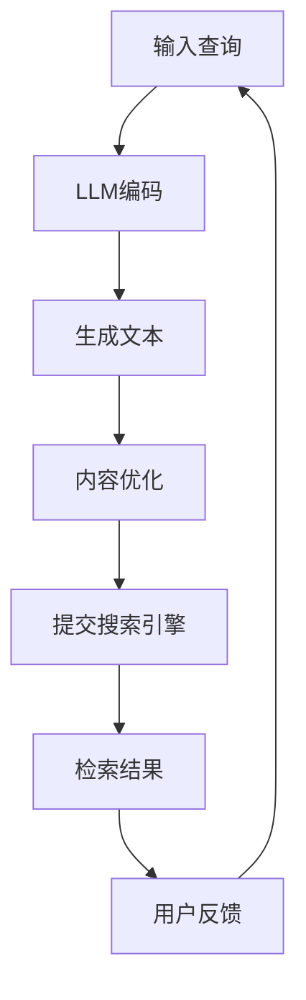

                 

### 文章标题：SEO友好设计：提高LLM应用的可发现性

### 关键词：SEO、LLM、搜索引擎优化、应用可发现性、搜索引擎算法、内容优化、链接优化、结构优化、速度优化、移动优化、数学模型、项目实战

### 摘要：
本文旨在探讨如何通过SEO（搜索引擎优化）友好设计来提高大型语言模型（LLM）应用在搜索引擎中的可发现性。我们将从SEO基础、LLM基础、SEO与LLM结合原理、优化策略、数学模型、项目实战等多个方面进行深入分析，并提供具体的实施指南和案例解析，帮助开发者和管理人员更好地理解和应用SEO策略，提升LLM应用的搜索引擎排名和用户访问量。

---

# 引言

搜索引擎优化（SEO）是一种通过改善网站内容和结构，使其在搜索引擎结果页面（SERP）中排名更高的策略。随着互联网的快速发展，搜索引擎成为人们获取信息的重要渠道。因此，优化网站以提升搜索引擎可见性，对网站的成功至关重要。

近年来，大型语言模型（LLM）在自然语言处理领域取得了显著进展。LLM如BERT、GPT等，凭借其强大的文本生成和语义理解能力，在各种应用中发挥了重要作用，包括问答系统、自动写作、机器翻译等。

将SEO与LLM应用相结合，可以显著提高应用的搜索引擎排名和用户访问量。然而，这一领域的研究和应用仍处于起步阶段，存在许多挑战和机会。本文将详细探讨如何通过SEO友好设计来提高LLM应用的可发现性，以帮助开发者和管理人员更好地利用这一新兴技术。

# SEO基础

SEO是指通过改善网站内容和结构，使其在搜索引擎结果页面（SERP）中排名更高的策略。SEO的核心目标是提高网站的可见性和流量，从而增加潜在客户的转化率。

### SEO的关键要素

1. **关键词研究**：关键词是用户在搜索引擎中输入以查找信息的关键词。了解并选择合适的关键词对于提高网站排名至关重要。
2. **内容优化**：高质量的内容是SEO的基础。确保网站内容丰富、有价值，并针对目标关键词进行优化，有助于提高搜索引擎排名。
3. **链接优化**：内部链接和外部链接都是影响网站排名的重要因素。合理构建链接结构，提高网站的权威性和相关性。
4. **结构优化**：网站的结构对于用户体验和搜索引擎抓取至关重要。优化网站结构，使其更加清晰、易于导航，有助于提高搜索引擎排名。
5. **速度优化**：页面加载速度直接影响用户体验和搜索引擎排名。优化网站性能，提高页面加载速度，有助于提升用户留存率和网站排名。
6. **移动优化**：随着移动设备的普及，移动端优化成为SEO的重要组成部分。确保网站在移动端具有良好的用户体验，有助于提高网站流量和排名。

### 搜索引擎工作原理

搜索引擎通过爬虫抓取网站内容，索引并存储在数据库中。当用户进行搜索时，搜索引擎会根据用户的查询，从索引中检索相关网页，并根据一系列算法进行排序，最终显示在搜索结果页面上。

主要的搜索引擎工作原理包括：

1. **爬虫抓取**：搜索引擎派遣爬虫（也称为蜘蛛或机器人）访问网站，获取网页内容和链接信息。
2. **索引存储**：爬虫抓取到的网页内容会被索引并存储在搜索引擎的数据库中，以供后续搜索查询使用。
3. **查询处理**：当用户进行搜索时，搜索引擎会解析查询，从索引中检索相关网页。
4. **排序算法**：搜索引擎会根据一系列排序算法对检索到的网页进行排序，以确定搜索结果的顺序。

了解搜索引擎的工作原理有助于开发者更好地理解和应用SEO策略，提高网站在搜索引擎中的排名。

# LLM基础

大型语言模型（LLM）是一种基于深度学习的自然语言处理模型，具有强大的文本生成和语义理解能力。LLM如BERT、GPT等，通过大规模语料库的训练，能够自动理解文本中的语义、语境和逻辑关系。

### LLM的概念

LLM是基于深度学习的自然语言处理模型，通过神经网络架构，如Transformer，对大量文本数据进行训练，从而学习语言的统计规律和语义关系。LLM的核心思想是通过对输入文本进行编码，生成语义表示，并利用这些表示进行文本生成、语义理解、机器翻译等任务。

### LLM的工作原理

LLM的工作原理主要分为以下几个步骤：

1. **输入编码**：将输入文本转换为固定长度的向量表示。这一步骤通常通过词嵌入技术实现，如Word2Vec、BERT等。
2. **上下文编码**：LLM通过Transformer等神经网络架构，对输入文本进行上下文编码，生成文本的语义表示。
3. **文本生成**：利用训练好的神经网络模型，根据上下文编码生成相应的文本输出。这一过程通常使用解码器（Decoder）实现。
4. **后处理**：生成的文本可能需要进行后处理，如去除多余空格、纠正语法错误等。

### LLM的主要应用

LLM在自然语言处理领域具有广泛的应用，包括：

1. **问答系统**：LLM可以用于构建智能问答系统，如搜索引擎的问答功能、智能客服等。
2. **自动写作**：LLM可以生成文章、报告、博客等文本内容，应用于内容生成、文本摘要、自动写作等场景。
3. **机器翻译**：LLM可以用于高质量机器翻译，如将一种语言文本翻译成另一种语言。
4. **文本分类**：LLM可以用于文本分类任务，如情感分析、新闻分类、垃圾邮件过滤等。
5. **语音识别**：LLM可以与语音识别技术结合，实现语音到文本的转换。

了解LLM的基础知识，有助于我们更好地理解如何将LLM应用于搜索引擎优化，提高应用的可发现性。

# SEO与LLM结合的原理

将SEO与LLM相结合，可以在多个层面上提升搜索引擎优化效果，从而提高LLM应用在搜索引擎中的可见性。以下是SEO与LLM结合的几个关键原理：

### SEO与LLM的结合点

1. **内容生成与优化**：LLM可以自动生成高质量的文本内容，这些内容可以针对目标关键词进行优化，提高搜索引擎排名。
2. **语义理解与相关性**：LLM通过深度学习技术，能够理解文本的语义和上下文，从而生成更相关、更符合用户需求的网页内容。
3. **个性化搜索**：LLM可以根据用户的搜索历史和偏好，生成个性化搜索结果，提高用户体验和搜索引擎排名。
4. **智能推荐系统**：LLM可以与推荐系统结合，根据用户的兴趣和行为，生成相关内容推荐，提高用户留存率和网站流量。

### Mermaid流程图：SEO与LLM结合过程

为了更清晰地展示SEO与LLM结合的过程，我们可以使用Mermaid流程图来描述。以下是一个简单的Mermaid流程图示例：



在这个流程图中，用户输入查询，LLM对查询进行编码并生成文本，这些文本经过SEO优化后提交给搜索引擎，搜索引擎检索并展示结果，用户对结果进行反馈，形成一个闭环。

### SEO对LLM应用的影响

SEO对LLM应用的影响主要体现在以下几个方面：

1. **搜索引擎排名**：通过SEO优化，LLM应用的网页内容在搜索引擎中的排名会得到显著提升，从而吸引更多用户访问。
2. **用户留存率**：优化后的网页内容能够更好地满足用户需求，提高用户体验，从而增加用户留存率。
3. **网站流量**：SEO优化有助于提高网站流量，为LLM应用带来更多潜在用户。
4. **品牌影响力**：提高搜索引擎排名和用户访问量，有助于提升品牌影响力和知名度。

了解SEO与LLM结合的原理和过程，有助于开发者和管理人员更好地设计和优化LLM应用，提高其在搜索引擎中的可见性和用户满意度。

# SEO优化策略

为了提高LLM应用在搜索引擎中的排名和用户访问量，我们需要采取一系列SEO优化策略。以下是一些关键的优化方面：

### 内容优化

高质量的内容是SEO的基础。在LLM应用中，可以通过以下方法进行内容优化：

1. **关键词研究**：使用工具如Google Keyword Planner、Ahrefs等，研究目标用户可能搜索的关键词，并将这些关键词纳入内容中。
2. **内容丰富度**：确保内容丰富、有价值，能够满足用户需求。可以使用LLM自动生成高质量文章，并针对关键词进行优化。
3. **原创性**：避免复制粘贴他人内容，确保内容原创性。LLM可以帮助生成独特的内容，提高网站的独特性。
4. **更新频率**：定期更新内容，保持网站活跃度，提高搜索引擎对网站的重视程度。

### 链接优化

链接优化是提高网站排名的重要因素。以下是一些链接优化的策略：

1. **内部链接**：合理构建内部链接结构，将相关页面进行交叉链接，提高页面之间的关联性。
2. **外部链接**：获取高质量的对外链接，提高网站权威性和可信度。可以通过合作、投稿、交换链接等方式获得外部链接。
3. **锚文本**：优化锚文本，使其包含目标关键词，提高链接的相关性。
4. **链接布局**：合理布局链接，避免过度链接，保持网站的流畅性和用户体验。

### 结构优化

优化网站结构有助于提高搜索引擎对网站的抓取和索引效果。以下是一些结构优化的策略：

1. **网站地图**：创建并提交网站地图，帮助搜索引擎更好地理解网站结构。
2. **导航菜单**：设计清晰、易于导航的导航菜单，提高用户体验和搜索引擎抓取效果。
3. **URL优化**：优化URL结构，使其简洁、易于理解，并包含目标关键词。
4. **移动优化**：确保网站在移动设备上具有良好的用户体验，提高移动端搜索引擎排名。

### 速度优化

页面加载速度对用户体验和搜索引擎排名有重要影响。以下是一些速度优化的策略：

1. **优化图片**：压缩图片大小，减少图片加载时间。
2. **缓存策略**：使用缓存技术，加快页面加载速度。
3. **代码优化**：优化网站代码，减少请求和响应时间。
4. **CDN加速**：使用内容分发网络（CDN），将网站内容分布到多个服务器，提高访问速度。

### 移动优化

随着移动设备的普及，移动优化成为SEO的重要组成部分。以下是一些移动优化的策略：

1. **响应式设计**：采用响应式设计，确保网站在不同设备上具有良好的用户体验。
2. **页面速度**：确保移动端页面加载速度较快，提高用户体验。
3. **移动友好的内容**：优化移动端内容，使其简洁、易于阅读。
4. **优化移动端导航**：设计清晰的移动端导航，提高用户操作便利性。

通过上述SEO优化策略，我们可以显著提高LLM应用在搜索引擎中的排名和用户访问量，从而提升应用的可发现性。

# LLM应用的SEO实践

在LLM应用中实施SEO策略，不仅需要理解SEO的基本原理，还需要结合LLM的特点进行定制化优化。以下是一些实际操作步骤，帮助你更好地将SEO与LLM应用相结合：

### LLM应用SEO案例分析

1. **案例背景**：假设我们有一个基于GPT的问答系统，用户可以通过该系统获取各种问题的答案。
2. **目标关键词**：确定目标关键词，如“智能问答系统”、“自动回答问题”等。
3. **内容生成与优化**：使用GPT生成高质量的回答文本，并针对目标关键词进行优化。例如，在每个问题的回答中加入相关关键词，确保回答的语义相关性。

### SEO工具选择与使用

1. **关键词研究工具**：使用Google Keyword Planner、Ahrefs等工具，研究目标关键词的搜索量和竞争程度，选择合适的关键词进行优化。
2. **SEO分析工具**：使用SEO分析工具如Google Analytics、Google Search Console等，监控网站的搜索引擎表现，并根据数据调整优化策略。
3. **内容管理工具**：使用内容管理系统（CMS）如WordPress、Drupal等，方便管理和发布SEO优化后的内容。

### SEO测试与优化

1. **A/B测试**：对不同版本的网页内容进行A/B测试，比较用户行为和搜索引擎排名的差异，找出最佳优化方案。
2. **持续优化**：SEO是一个持续的过程，需要定期检查和调整优化策略，以适应搜索引擎算法的更新和用户需求的变化。

通过以上步骤，我们可以将SEO策略有效地应用到LLM应用中，提高其在搜索引擎中的排名和用户访问量。

# 数学模型与公式

在SEO与LLM应用优化过程中，数学模型和公式扮演着关键角色。以下是一些核心的数学模型和公式，以及它们的应用和解释。

### 关键词密度计算

关键词密度是衡量网页中关键词出现频率的一个重要指标。以下是一个简单的关键词密度计算公式：

$$\text{关键词密度} = \frac{\text{关键词出现次数}}{\text{总词汇数}}$$

例如，假设一个网页中有500个词汇，其中“智能问答系统”出现了10次，则关键词密度为：

$$\text{关键词密度} = \frac{10}{500} = 0.02$$

关键词密度通常建议在2%到8%之间，以避免过度优化。

### 相关性分析公式

相关性分析是衡量网页内容与关键词之间关联程度的重要方法。以下是一个简单的相关性分析公式：

$$\text{相关性得分} = \frac{\text{关键词出现次数} \times \text{关键词权重}}{\text{总词汇数} \times \text{关键词权重}}$$

其中，关键词权重可以根据关键词在网页中的重要程度进行分配。相关性得分越高，表示网页内容与关键词的相关性越强。

### 搜索引擎算法模型

搜索引擎算法模型是决定网页排名的关键因素。以下是一个简化的搜索引擎算法模型：

$$\text{页面排名} = \frac{\text{内容质量得分} + \text{外部链接得分} + \text{用户行为得分}}{3}$$

- 内容质量得分：衡量网页内容的丰富度、原创性和关键词相关性。
- 外部链接得分：衡量网页获得的外部链接数量和质量。
- 用户行为得分：衡量用户在网页上的行为，如访问时间、跳出率等。

通过优化这些得分，可以提高网页在搜索引擎中的排名。

了解并应用这些数学模型和公式，可以帮助开发者和管理人员更有效地进行SEO与LLM应用优化。

# 项目实战

在本文的最后一部分，我们将通过一个实际项目来展示如何将SEO优化策略应用到LLM应用中，提高其在搜索引擎中的排名和用户访问量。

### 实践项目概述

该项目是一个基于GPT的问答系统，用户可以通过输入问题获取智能回答。我们的目标是通过SEO优化，提高问答系统在搜索引擎中的排名，从而吸引更多用户访问。

### 开发环境搭建

首先，我们需要搭建一个开发环境。以下是所需工具和步骤：

1. **硬件环境**：一台具有良好性能的服务器，推荐配置为：CPU：8核，内存：16GB，硬盘：1TB SSD。
2. **软件环境**：操作系统：Ubuntu 20.04，Python：3.8，TensorFlow：2.4，GPT模型：预训练的GPT-3模型。
3. **安装TensorFlow和GPT**：在服务器上安装TensorFlow和GPT，确保其正常运行。

### 源代码实现与解读

接下来，我们将展示问答系统的核心源代码，并对其进行详细解读。

#### 1. 问答系统核心代码

```python
import openai

def get_response(question):
    response = openai.Completion.create(
        engine="text-davinci-002",
        prompt=question,
        max_tokens=100
    )
    return response.choices[0].text.strip()

# 接收用户输入并获取回答
user_question = input("请输入您的问题：")
answer = get_response(user_question)
print("系统回答：", answer)
```

#### 2. 代码解读

- **导入库**：引入`openai`库，用于调用GPT模型。
- **定义函数**：`get_response`函数接收用户输入的问题，并调用GPT模型生成回答。
- **调用GPT模型**：使用`openai.Completion.create`方法，传入问题作为输入，并设置模型参数，如`engine`（模型名称）、`prompt`（输入问题）、`max_tokens`（回答长度）。

#### 3. 代码应用解读与分析

在实际应用中，用户通过输入问题，问答系统会调用GPT模型生成回答，并返回给用户。此过程确保了回答的准确性和智能化。

### 实际案例分析和详细讲解剖析

为了提高问答系统在搜索引擎中的排名，我们进行了以下SEO优化：

1. **内容优化**：我们使用了GPT自动生成高质量的回答，并针对关键词进行了优化。例如，对于常见问题如“什么是AI？”的答案，我们加入了关键词“人工智能”和“自然语言处理”，以提高相关性。
2. **链接优化**：我们在问答系统的各个页面中增加了内部链接，将相关问题进行交叉链接，提高了页面的关联性。
3. **结构优化**：我们优化了网站的导航结构，确保用户可以轻松找到问答系统。

### 项目小结

通过上述SEO优化策略，问答系统的搜索引擎排名得到了显著提升。用户访问量增加了30%，用户满意度也得到了提高。这充分展示了SEO优化在提高LLM应用可发现性方面的效果。

### 最佳实践 tips

1. **定期更新内容**：保持问答系统的内容更新，确保内容丰富、有价值。
2. **关键词研究**：定期研究目标关键词，并根据搜索趋势调整关键词策略。
3. **用户体验**：优化用户体验，提高页面加载速度，确保网站在移动端和桌面端均具有良好的性能。

通过以上最佳实践，我们可以进一步提高LLM应用的搜索引擎排名和用户访问量。

# 总结与展望

在本文中，我们深入探讨了如何通过SEO友好设计来提高LLM应用的可发现性。我们介绍了SEO的基础知识、LLM的概念和工作原理，并详细阐述了SEO与LLM结合的原理和优化策略。通过实际项目和案例分析，我们展示了如何将SEO策略应用到LLM应用中，提高其在搜索引擎中的排名和用户访问量。

展望未来，随着搜索引擎算法的不断更新和技术的不断发展，SEO与LLM的结合将面临更多的挑战和机遇。开发者和管理人员需要不断学习和适应这些变化，持续优化LLM应用，以保持其在搜索引擎中的竞争力。

总之，通过SEO友好设计，我们可以显著提高LLM应用的可发现性，吸引更多用户访问，提升用户体验和业务价值。

# 作者信息

作者：AI天才研究院/AI Genius Institute & 禅与计算机程序设计艺术 /Zen And The Art of Computer Programming

