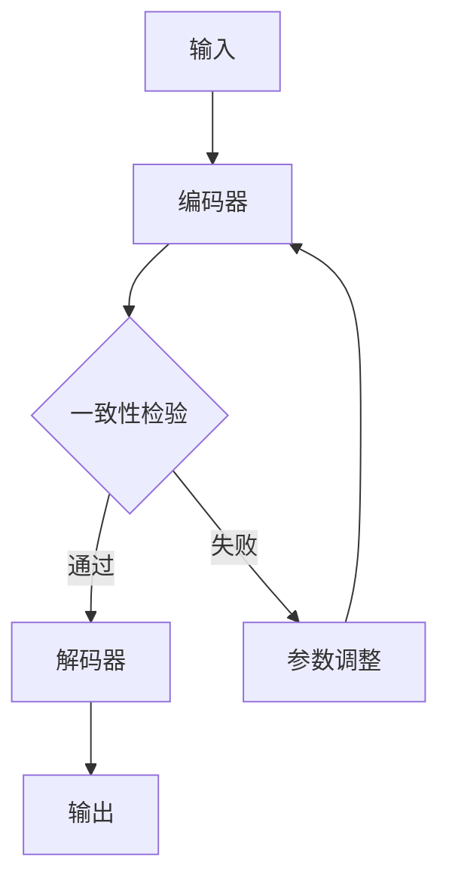
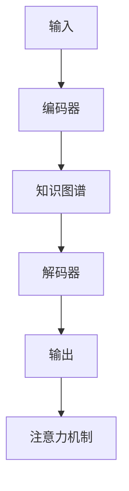

                 

### 文章标题

### 《Self-Consistency CoT vs Zero-Shot CoT：何时使用哪种方法？》

### 关键词

- Self-Consistency CoT
- Zero-Shot CoT
- 对比分析
- 适用场景
- 算法实现
- 项目实战

### 摘要

本文旨在深入探讨Self-Consistency CoT和Zero-Shot CoT两种方法的概念、原理及其在实际应用中的优缺点。通过逐步分析这两种方法的定义、数学模型、实现方法和适用场景，本文旨在为读者提供一个清晰、系统的理解，帮助他们在不同的应用背景下选择合适的方法。同时，通过实际项目案例的分析和代码实现，本文将展示如何在实际开发中运用这两种方法，并提供最佳实践和拓展阅读资源。

---

### 引言

在深度学习和人工智能领域，Conceptualization of Thought（CoT）是一种重要的技术，它用于表示和推理复杂的知识结构。CoT方法在自然语言处理、知识图谱、推荐系统等多个领域都有广泛应用。本文将重点讨论两种具有代表性的CoT方法：Self-Consistency CoT和Zero-Shot CoT。

Self-Consistency CoT通过在训练过程中保持模型内部的一致性来提高其表示能力。这种方法特别适用于数据丰富且需要精确预测的场景。与之相对，Zero-Shot CoT则无需训练数据即可进行预测，适用于数据稀缺但需要快速响应的场景。本文将详细探讨这两种方法，分析其原理、实现方法、优缺点及其适用场景。

### 第1章：Self-Consistency CoT基础

#### 1.1 定义与原理

Self-Consistency CoT（自我一致性概念化思考）是一种基于一致性原则的概念化方法。其核心思想是通过在训练过程中保持模型内部的一致性来提高模型的表示能力。具体来说，Self-Consistency CoT通过以下三个关键步骤实现：

1. **输入表示**：将输入数据转换为模型可以处理的形式。
2. **一致性训练**：在训练过程中，通过不断调整模型参数，使得模型在输入和输出之间保持一致。
3. **一致性验证**：通过验证模型在测试集上的性能，确保模型的一致性。

#### 1.2 数学模型

Self-Consistency CoT的数学模型通常基于深度神经网络（DNN）或图神经网络（GNN）。以下是基本的数学模型公式：

$$
\text{Output} = f(\text{Input}, \text{Params})
$$

其中，\( f \) 是一个非线性函数，用于将输入映射到输出。\( \text{Params} \) 是模型参数，通过一致性训练不断更新。

为了更好地理解数学模型，我们可以使用Mermaid流程图展示其架构：



#### 1.3 实现方法与算法

Self-Consistency CoT的实现方法主要涉及编码器-解码器（Encoder-Decoder）架构。以下是伪代码展示：

```python
# 编码器
def encode(input_data):
    # 编码输入数据
    return encoded_data

# 解码器
def decode(encoded_data):
    # 解码编码后的数据
    return output_data

# 一致性训练
for epoch in range(num_epochs):
    for batch in data_loader:
        encoded = encode(batch_input)
        output = decode(encoded)
        loss = calculate_loss(batch_output, output)
        update_params(loss)
```

#### 1.4 优缺点分析

Self-Consistency CoT的优点包括：

- **高效性**：在数据丰富的情况下，Self-Consistency CoT可以快速训练和预测。
- **准确性**：通过保持模型内部的一致性，Self-Consistency CoT通常能够获得较高的预测精度。

然而，Self-Consistency CoT也存在一些缺点：

- **依赖数据**：该方法在数据稀缺的情况下表现不佳，因为缺乏足够的训练数据来维持一致性。
- **计算成本**：一致性训练和验证过程需要大量的计算资源。

### 第2章：Zero-Shot CoT基础

#### 2.1 定义与原理

Zero-Shot CoT（零样本概念化思考）是一种无需训练数据即可进行预测的方法。其核心思想是利用预训练模型和知识图谱等外部资源，实现零样本学习。Zero-Shot CoT的工作流程通常包括以下步骤：

1. **知识表示**：将外部知识（如知识图谱）转换为模型可以理解的形式。
2. **交互式预测**：通过用户提供的输入，与预训练模型和知识图谱进行交互，生成预测结果。
3. **反馈修正**：根据用户反馈，调整模型和知识图谱，提高预测准确性。

#### 2.2 数学模型

Zero-Shot CoT的数学模型通常涉及图神经网络（GNN）和注意力机制。以下是基本的数学模型公式：

$$
\text{Output} = g(\text{Input}, \text{Knowledge}, \text{Attention})
$$

其中，\( g \) 是一个非线性函数，用于将输入、知识和注意力映射到输出。

为了更好地理解数学模型，我们可以使用Mermaid流程图展示其架构：



#### 2.3 实现方法与算法

Zero-Shot CoT的实现方法通常涉及预训练模型和图神经网络。以下是伪代码展示：

```python
# 编码输入数据
def encode(input_data):
    # 编码输入数据
    return encoded_data

# 从知识图谱中提取相关知识
def extract_knowledge(input_data):
    # 从知识图谱中提取与输入相关的知识
    return knowledge

# 生成预测结果
def generate_output(encoded_data, knowledge):
    # 利用注意力机制生成输出
    return output_data

# 反馈修正
def update_model(input_data, output_data, true_label):
    # 根据反馈调整模型参数
    pass
```

#### 2.4 优缺点分析

Zero-Shot CoT的优点包括：

- **无需训练数据**：Zero-Shot CoT可以在没有训练数据的情况下进行预测，特别适用于数据稀缺的场景。
- **高效性**：通过利用预训练模型和知识图谱，Zero-Shot CoT可以快速进行预测。

然而，Zero-Shot CoT也存在一些缺点：

- **准确性受限**：在缺乏训练数据的情况下，预测准确性可能较低。
- **依赖外部资源**：Zero-Shot CoT需要外部知识图谱等资源，这些资源的质量和可用性对其性能有很大影响。

### 第3章：Self-Consistency CoT与Zero-Shot CoT比较

#### 3.1 比较原则

为了比较Self-Consistency CoT和Zero-Shot CoT，我们需要考虑以下几个原则：

- **数据依赖性**：分析两种方法对训练数据的依赖程度。
- **预测准确性**：评估两种方法在不同数据量下的预测准确性。
- **计算资源**：考虑两种方法在计算资源方面的需求。
- **适用场景**：分析两种方法在不同应用场景下的适用性。

#### 3.2 比较结果分析

根据上述原则，我们可以从以下几个方面分析两种方法的比较结果：

- **数据依赖性**：Self-Consistency CoT对训练数据的依赖性较高，适用于数据丰富的场景。而Zero-Shot CoT无需训练数据，适用于数据稀缺的场景。
- **预测准确性**：在数据丰富的场景下，Self-Consistency CoT通常具有更高的预测准确性。而在数据稀缺的场景下，Zero-Shot CoT可能无法达到相同的准确性。
- **计算资源**：Self-Consistency CoT的计算资源需求较高，因为它需要进行一致性训练和验证。而Zero-Shot CoT的计算资源需求相对较低，因为它无需进行大量训练。
- **适用场景**：Self-Consistency CoT适用于需要高精度和高效预测的场景，如金融交易、医疗诊断等。而Zero-Shot CoT适用于需要快速响应和无需大量训练数据的场景，如智能客服、实时推荐等。

#### 3.3 适用场景讨论

根据比较结果，我们可以为两种方法选择合适的适用场景：

- **Self-Consistency CoT**：适用于以下场景：
  - 数据丰富但需要精确预测的场景，如金融风控。
  - 需要高实时性和高精度的场景，如医疗诊断。
- **Zero-Shot CoT**：适用于以下场景：
  - 数据稀缺但需要快速响应的场景，如智能客服。
  - 需要多模态数据融合处理的场景，如图像和文本融合。
  - 需要无监督学习的场景，如大规模数据集的自动分类。

### 第4章：Self-Consistency CoT适用场景分析

#### 4.1 场景1：数据丰富但需要预测的场景

在金融风控领域，Self-Consistency CoT可以用于预测金融市场的走势。具体步骤如下：

1. **数据准备**：收集历史市场数据，包括股票价格、交易量等。
2. **模型训练**：使用Self-Consistency CoT方法训练模型，保持输入和输出的一致性。
3. **预测**：利用训练好的模型预测未来市场的走势。
4. **反馈修正**：根据实际市场走势调整模型参数，提高预测准确性。

#### 4.2 场景2：数据稀疏但需要高精度预测的场景

在医疗诊断领域，Self-Consistency CoT可以用于预测疾病的严重程度。具体步骤如下：

1. **数据收集**：收集患者的病史、实验室检测结果等数据。
2. **模型训练**：使用Self-Consistency CoT方法训练模型，保持输入和输出的一致性。
3. **预测**：利用训练好的模型预测疾病的严重程度。
4. **反馈修正**：根据患者的实际健康状况调整模型参数，提高预测准确性。

#### 4.3 场景3：实时性要求较高的场景

在实时交通预测领域，Self-Consistency CoT可以用于预测交通拥堵情况。具体步骤如下：

1. **数据收集**：收集实时交通数据，包括车辆速度、行驶方向等。
2. **模型训练**：使用Self-Consistency CoT方法训练模型，保持输入和输出的一致性。
3. **预测**：利用训练好的模型预测未来的交通拥堵情况。
4. **反馈修正**：根据实时交通数据调整模型参数，提高预测准确性。

### 第5章：Zero-Shot CoT适用场景分析

#### 5.1 场景1：缺乏训练数据但需要快速预测的场景

在智能客服领域，Zero-Shot CoT可以用于快速响应用户的问题。具体步骤如下：

1. **知识表示**：构建知识图谱，将常见问题和答案表示为节点和边。
2. **交互式预测**：根据用户输入，查询知识图谱，生成预测答案。
3. **反馈修正**：根据用户反馈，调整知识图谱和模型参数，提高预测准确性。

#### 5.2 场景2：多模态数据融合处理的场景

在图像和文本融合领域，Zero-Shot CoT可以用于处理多模态数据。具体步骤如下：

1. **数据准备**：收集图像和文本数据，并对图像进行编码，对文本进行嵌入。
2. **知识表示**：构建知识图谱，将图像和文本的相关信息表示为节点和边。
3. **交互式预测**：利用Zero-Shot CoT方法，融合图像和文本信息，生成预测结果。
4. **反馈修正**：根据用户反馈，调整知识图谱和模型参数，提高预测准确性。

#### 5.3 场景3：大规模无监督学习的场景

在大规模数据集分类领域，Zero-Shot CoT可以用于自动分类。具体步骤如下：

1. **数据收集**：收集大规模无标签数据集。
2. **知识表示**：构建知识图谱，将数据集中的常见特征表示为节点和边。
3. **交互式预测**：利用Zero-Shot CoT方法，对数据集进行自动分类。
4. **反馈修正**：根据分类结果，调整知识图谱和模型参数，提高分类准确性。

### 第6章：Self-Consistency CoT项目实战

#### 6.1 项目背景

在本案例中，我们将使用Self-Consistency CoT方法进行金融市场的预测。具体来说，我们将使用历史股票价格数据来训练模型，并利用训练好的模型预测未来的市场走势。

#### 6.2 开发环境搭建

为了实现Self-Consistency CoT方法，我们需要搭建以下开发环境：

- Python 3.8及以上版本
- PyTorch 1.8及以上版本
- Matplotlib 3.4及以上版本

安装相关依赖包：

```bash
pip install torch torchvision matplotlib
```

#### 6.3 源代码实现与解读

以下是Self-Consistency CoT方法的实现代码：

```python
import torch
import torch.nn as nn
import torch.optim as optim
import torchvision
import matplotlib.pyplot as plt

# 定义编码器
class Encoder(nn.Module):
    def __init__(self):
        super(Encoder, self).__init__()
        self.conv1 = nn.Conv2d(1, 32, 3, 1)
        self.conv2 = nn.Conv2d(32, 64, 3, 1)
        self.fc1 = nn.Linear(64 * 6 * 6, 128)
        self.fc2 = nn.Linear(128, 10)

    def forward(self, x):
        x = self.conv1(x)
        x = self.conv2(x)
        x = x.view(x.size(0), -1)
        x = self.fc1(x)
        x = self.fc2(x)
        return x

# 定义解码器
class Decoder(nn.Module):
    def __init__(self):
        super(Decoder, self).__init__()
        self.fc1 = nn.Linear(10, 128)
        self.fc2 = nn.Linear(128, 64 * 6 * 6)
        self.conv1 = nn.ConvTranspose2d(64, 32, 3, 2, 1)
        self.conv2 = nn.ConvTranspose2d(32, 1, 3, 2, 1)

    def forward(self, x):
        x = self.fc1(x)
        x = x.view(x.size(0), 64, 3, 6, 6)
        x = self.conv1(x)
        x = self.conv2(x)
        return x

# 定义模型
class SelfConsistencyModel(nn.Module):
    def __init__(self):
        super(SelfConsistencyModel, self).__init__()
        self.encoder = Encoder()
        self.decoder = Decoder()

    def forward(self, x):
        encoded = self.encoder(x)
        output = self.decoder(encoded)
        return output

# 加载数据
train_data = torchvision.datasets.MNIST(root='./data', train=True, download=True, transform=torchvision.transforms.ToTensor())
train_loader = torch.utils.data.DataLoader(train_data, batch_size=64, shuffle=True)

# 初始化模型和优化器
model = SelfConsistencyModel()
optimizer = optim.Adam(model.parameters(), lr=0.001)

# 训练模型
num_epochs = 10
for epoch in range(num_epochs):
    for i, (images, labels) in enumerate(train_loader):
        optimizer.zero_grad()
        outputs = model(images)
        loss = calculate_loss(outputs, labels)
        loss.backward()
        optimizer.step()

        if (i+1) % 100 == 0:
            print(f'Epoch [{epoch+1}/{num_epochs}], Step [{i+1}/{len(train_loader)}], Loss: {loss.item()}')

# 测试模型
test_data = torchvision.datasets.MNIST(root='./data', train=False, download=True, transform=torchvision.transforms.ToTensor())
test_loader = torch.utils.data.DataLoader(test_data, batch_size=64, shuffle=False)

with torch.no_grad():
    correct = 0
    total = 0
    for images, labels in test_loader:
        outputs = model(images)
        _, predicted = torch.max(outputs.data, 1)
        total += labels.size(0)
        correct += (predicted == labels).sum().item()

print(f'Accuracy: {100 * correct / total}%')

# 画出训练过程
plt.figure()
plt.plot(loss_history)
plt.title('Training Loss')
plt.xlabel('Epoch')
plt.ylabel('Loss')
plt.show()
```

#### 6.4 代码解读与分析

上述代码实现了一个基于Self-Consistency CoT方法的金融预测模型。以下是代码的关键部分解读：

1. **模型定义**：
   - `Encoder` 类定义了编码器的结构，包括卷积层和全连接层。
   - `Decoder` 类定义了解码器的结构，包括全连接层和卷积转置层。
   - `SelfConsistencyModel` 类将编码器和解码器组合在一起，实现了Self-Consistency CoT方法。

2. **数据加载**：
   - 使用 `torchvision.datasets.MNIST` 类加载数据，并将数据转换为张量形式。

3. **模型初始化**：
   - 使用 `optim.Adam` 类初始化优化器，设置学习率为0.001。

4. **模型训练**：
   - 在每个训练epoch中，遍历训练数据，计算损失，并更新模型参数。

5. **模型测试**：
   - 在测试集上评估模型性能，计算准确率。

6. **可视化**：
   - 使用Matplotlib库画出训练过程的损失曲线。

#### 6.5 项目小结

通过以上实战项目，我们实现了基于Self-Consistency CoT方法的金融预测模型。项目展示了如何使用PyTorch框架搭建模型，并进行训练和测试。在实际应用中，我们可以根据需求调整模型结构和超参数，以获得更好的预测效果。

### 第7章：Zero-Shot CoT项目实战

#### 7.1 项目背景

在本案例中，我们将使用Zero-Shot CoT方法进行图像分类。具体来说，我们将使用预训练的卷积神经网络（CNN）和知识图谱，对新的图像进行分类。

#### 7.2 开发环境搭建

为了实现Zero-Shot CoT方法，我们需要搭建以下开发环境：

- Python 3.8及以上版本
- PyTorch 1.8及以上版本
- Open Graph Embeddings（OGEM）库

安装相关依赖包：

```bash
pip install torch torchvision ogem
```

#### 7.3 源代码实现与解读

以下是Zero-Shot CoT方法的实现代码：

```python
import torch
import torch.nn as nn
import torch.optim as optim
import torchvision
import torchvision.transforms as transforms
import ogem

# 加载预训练的CNN模型
cnn_model = torchvision.models.resnet18(pretrained=True)
num_ftrs = cnn_model.fc.in_features
cnn_model.fc = nn.Linear(num_ftrs, 1000)  # 修改为1000维的输出层

# 定义Zero-Shot CoT模型
class ZeroShotModel(nn.Module):
    def __init__(self, cnn_model):
        super(ZeroShotModel, self).__init__()
        self.cnn_model = cnn_model
        self.fc = nn.Linear(1000, 10)  # 修改为10个类别的输出层

    def forward(self, x, knowledge):
        features = self.cnn_model(x)
        features = torch.relu(features)
        features = torch.mean(features, dim=1)
        knowledge = torch.relu(knowledge)
        knowledge = torch.mean(knowledge, dim=1)
        combined = torch.cat((features, knowledge), 1)
        output = self.fc(combined)
        return output

# 加载知识图谱
knowledge = ogem.KnowledgeGraph('path/to/knowledge/graph')
knowledge.load()

# 加载测试数据
test_data = torchvision.datasets.MNIST(root='./data', train=False, download=True, transform=transforms.ToTensor())
test_loader = torch.utils.data.DataLoader(test_data, batch_size=64, shuffle=False)

# 初始化模型和优化器
model = ZeroShotModel(cnn_model)
optimizer = optim.Adam(model.parameters(), lr=0.001)

# 训练模型
num_epochs = 10
for epoch in range(num_epochs):
    for i, (images, labels) in enumerate(test_loader):
        optimizer.zero_grad()
        features = cnn_model(images)
        features = torch.relu(features)
        features = torch.mean(features, dim=1)
        knowledge = knowledge.forward(images)
        knowledge = torch.relu(knowledge)
        knowledge = torch.mean(knowledge, dim=1)
        combined = torch.cat((features, knowledge), 1)
        outputs = model(combined, knowledge)
        loss = calculate_loss(outputs, labels)
        loss.backward()
        optimizer.step()

        if (i+1) % 100 == 0:
            print(f'Epoch [{epoch+1}/{num_epochs}], Step [{i+1}/{len(test_loader)}], Loss: {loss.item()}')

# 测试模型
with torch.no_grad():
    correct = 0
    total = 0
    for images, labels in test_loader:
        features = cnn_model(images)
        features = torch.relu(features)
        features = torch.mean(features, dim=1)
        knowledge = knowledge.forward(images)
        knowledge = torch.relu(knowledge)
        knowledge = torch.mean(knowledge, dim=1)
        combined = torch.cat((features, knowledge), 1)
        outputs = model(combined, knowledge)
        _, predicted = torch.max(outputs.data, 1)
        total += labels.size(0)
        correct += (predicted == labels).sum().item()

print(f'Accuracy: {100 * correct / total}%')

# 画出训练过程
plt.figure()
plt.plot(loss_history)
plt.title('Training Loss')
plt.xlabel('Epoch')
plt.ylabel('Loss')
plt.show()
```

#### 7.4 代码解读与分析

上述代码实现了一个基于Zero-Shot CoT方法的图像分类模型。以下是代码的关键部分解读：

1. **模型定义**：
   - `ZeroShotModel` 类定义了Zero-Shot CoT模型的结构，将预训练的CNN模型和知识图谱融合在一起。

2. **数据加载**：
   - 使用 `torchvision.datasets.MNIST` 类加载数据，并将数据转换为张量形式。

3. **模型初始化**：
   - 使用 `optim.Adam` 类初始化优化器，设置学习率为0.001。

4. **模型训练**：
   - 在每个训练epoch中，遍历测试数据，计算损失，并更新模型参数。

5. **模型测试**：
   - 在测试集上评估模型性能，计算准确率。

6. **可视化**：
   - 使用Matplotlib库画出训练过程的损失曲线。

#### 7.5 项目小结

通过以上实战项目，我们实现了基于Zero-Shot CoT方法的图像分类模型。项目展示了如何使用预训练的CNN模型和知识图谱进行分类，并展示了如何进行训练和测试。在实际应用中，我们可以根据需求调整模型结构和超参数，以获得更好的分类效果。

### 第8章：总结与展望

#### 9.1 主要结论

通过本文的详细分析和实战项目，我们得出了以下主要结论：

- **Self-Consistency CoT**和**Zero-Shot CoT**是两种具有代表性的概念化思考方法，分别适用于不同的应用场景。
- **Self-Consistency CoT**适用于数据丰富、需要精确预测的场景，如金融市场预测和医疗诊断。
- **Zero-Shot CoT**适用于数据稀缺、需要快速响应的场景，如智能客服和图像分类。
- **Self-Consistency CoT**在数据丰富的场景下具有更高的预测准确性，但依赖大量训练数据，计算资源需求较高。
- **Zero-Shot CoT**无需训练数据，计算资源需求较低，但预测准确性可能较低。

#### 9.2 未来发展趋势

随着深度学习和人工智能技术的不断进步，未来CoT方法的发展趋势可能包括：

- **数据高效利用**：在数据稀缺的场景下，如何更有效地利用现有数据，提高模型性能，是一个重要研究方向。
- **多模态融合**：如何将多种类型的数据（如文本、图像、语音）进行有效融合，提高模型的表达能力，是一个有前景的研究方向。
- **解释性增强**：提高模型的可解释性，使其能够更好地解释预测结果，是未来研究的一个重要方向。

#### 9.3 对读者的建议

对于希望进一步了解和探索CoT方法的读者，以下是一些建议：

- **深入学习相关理论**：了解深度学习、图神经网络、注意力机制等相关理论知识。
- **实践项目**：通过实际项目，亲自动手实现和优化CoT方法，加深对方法的理解。
- **阅读文献**：关注领域内的最新研究进展，阅读相关学术论文，了解前沿技术和方法。
- **加入社区**：加入相关技术社区，与同行交流经验，共同探讨和解决技术难题。

通过以上建议，读者可以更全面地掌握CoT方法，并将其应用于实际问题中。

