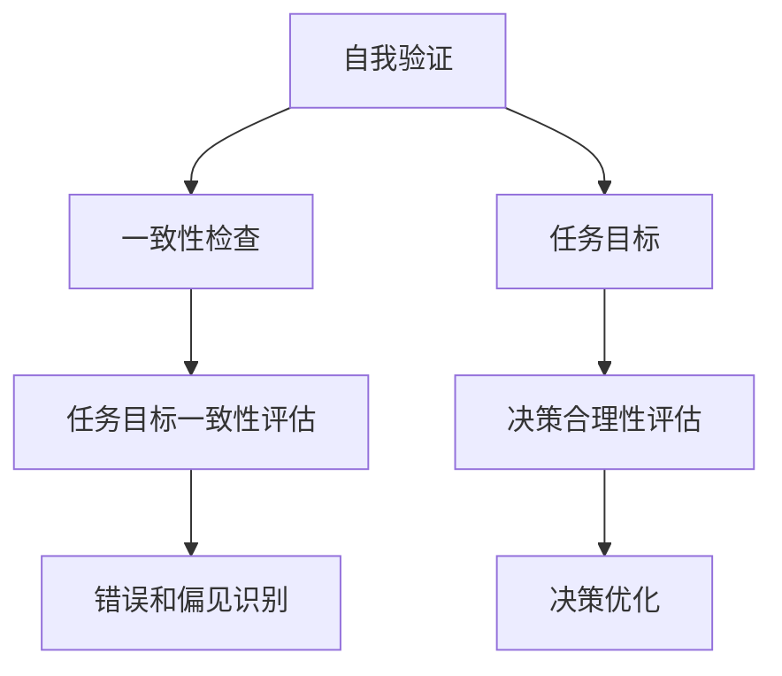

                 


### 文章标题

Self-Consistency CoT在AI伦理决策中的应用

### 文章关键词

自我一致性CoT，AI伦理决策，伦理框架，算法原理，数学模型，项目实战，未来发展趋势

### 文章摘要

本文探讨了自我一致性CoT（Self-Consistency Core Task）在AI伦理决策中的应用。自我一致性CoT是一种基于自我验证和一致性检查的框架，旨在确保AI系统在执行伦理决策时保持一致性。文章首先介绍了AI伦理决策的背景和重要性，随后详细阐述了自我一致性CoT的核心概念和原理。通过数学模型和算法伪代码的讲解，文章展示了如何在实际项目中应用自我一致性CoT。最后，本文分析了自我一致性CoT在AI伦理决策中的优势与挑战，并展望了其未来的发展趋势。

### 目录

1. 引言
2. AI伦理决策背景
3. 自我一致性CoT概述
4. 自我一致性CoT模型原理
5. 自我一致性CoT算法详解
6. 自我一致性CoT应用场景
7. 自我一致性CoT案例分析
8. 自我一致性CoT的未来发展
9. 结论

### 1. 引言

随着人工智能（AI）技术的迅猛发展，AI在各个领域中的应用越来越广泛。然而，随之而来的伦理问题也日益突出。如何确保AI系统在执行任务时遵循道德规范，如何解决AI伦理决策中的不一致性问题，成为了当前研究的热点。自我一致性CoT作为一种新兴的伦理决策框架，提供了一种有效的解决方案。

自我一致性CoT旨在通过自我验证和一致性检查，确保AI系统在执行伦理决策时保持一致性。其核心思想是，在决策过程中，AI系统不仅要考虑当前的任务目标，还要评估自身决策的合理性，并对其进行调整，以确保最终决策的合理性和一致性。

本文将详细介绍自我一致性CoT在AI伦理决策中的应用。首先，我们将回顾AI伦理决策的背景和重要性。接着，我们将阐述自我一致性CoT的核心概念和原理。然后，通过数学模型和算法伪代码的讲解，我们将展示如何在实际项目中应用自我一致性CoT。接下来，我们将分析自我一致性CoT在AI伦理决策中的优势与挑战。最后，本文将展望自我一致性CoT的未来发展。

### 2. AI伦理决策背景

人工智能技术的发展，使得机器能够执行复杂任务，从图像识别到自然语言处理，再到自动驾驶和医疗诊断。然而，随着AI技术的应用日益广泛，AI伦理问题也日益凸显。AI伦理决策涉及多个方面，包括数据隐私、公平性、透明度、偏见等。

数据隐私是AI伦理决策中的一个重要问题。AI系统通常需要大量的数据来训练模型，这些数据可能包含个人隐私信息。如何保护这些数据，确保数据不会被滥用，是AI伦理决策需要考虑的关键点。

公平性是另一个重要方面。AI系统在决策过程中可能会受到数据偏差的影响，从而导致不公平的结果。例如，如果训练数据中存在性别或种族偏见，AI系统可能会在决策中表现出类似的偏见。如何消除这些偏见，确保AI系统在决策过程中保持公平，是AI伦理决策需要解决的问题。

透明度是AI伦理决策中的第三个关键点。AI系统在决策过程中，通常会采用复杂的算法和模型，这使得决策过程变得不透明。如何提高AI系统的透明度，使其决策过程可以被理解和解释，是AI伦理决策需要考虑的问题。

偏见是AI伦理决策中的第四个方面。AI系统可能会在决策中表现出偏见，这不仅会影响决策的公平性，还可能对某些群体产生不利影响。如何识别和消除这些偏见，是AI伦理决策需要解决的问题。

AI伦理决策的背景和重要性体现在多个方面。首先，随着AI技术的应用日益广泛，AI系统在决策中的作用越来越重要。如何确保这些决策是合理和公正的，是当前研究和应用的热点问题。其次，AI伦理决策涉及到多个方面，包括数据隐私、公平性、透明度和偏见等，这些方面都是当前研究和关注的重点。最后，AI伦理决策不仅涉及到技术问题，还涉及到法律、伦理和社会问题，需要多方面的协同解决。

### 3. 自我一致性CoT概述

自我一致性CoT（Self-Consistency Core Task）是一种新兴的伦理决策框架，旨在通过自我验证和一致性检查，确保AI系统在执行伦理决策时保持一致性。自我一致性CoT的核心概念包括自我验证、一致性检查和任务目标。

#### 自我验证

自我验证是自我一致性CoT的基础。它指的是AI系统在执行决策时，对自己所做的决策进行评估和验证，以确保决策的合理性。自我验证可以通过多种方式实现，例如，AI系统可以使用已知的道德原则或规则来评估自身决策，或者使用机器学习算法来识别潜在的错误和偏见。

#### 一致性检查

一致性检查是自我一致性CoT的关键步骤。它指的是AI系统在执行决策时，对决策的多个方面进行评估，以确保决策的一致性。例如，AI系统可以检查决策是否与先前的决策一致，或者是否与其他系统的决策一致。一致性检查有助于确保AI系统在执行决策时不会出现矛盾或冲突。

#### 任务目标

任务目标是自我一致性CoT的核心。它指的是AI系统在执行决策时需要达到的目标。自我一致性CoT要求AI系统在决策过程中始终以任务目标为导向，并确保最终决策有助于实现这些目标。任务目标可以是具体的，例如提高效率或减少成本，也可以是抽象的，例如保护用户隐私或提高社会公平。

#### 自我一致性CoT与伦理决策的关系

自我一致性CoT与伦理决策有着密切的联系。在AI伦理决策中，AI系统需要考虑多种因素，包括道德原则、法律规范和社会价值观。自我一致性CoT提供了一种框架，可以帮助AI系统在考虑这些因素时保持一致性。具体来说，自我一致性CoT通过自我验证和一致性检查，确保AI系统在执行伦理决策时不会出现矛盾或冲突。此外，自我一致性CoT还可以帮助AI系统识别和纠正潜在的错误和偏见，从而提高决策的合理性和公正性。

总之，自我一致性CoT是一种具有广泛应用前景的伦理决策框架。通过自我验证和一致性检查，自我一致性CoT可以帮助AI系统在执行伦理决策时保持一致性，从而提高决策的合理性和公正性。

#### 自我一致性CoT的核心概念架构 Mermaid 流程图



#### 自我一致性CoT算法原理讲解与伪代码

自我一致性CoT算法的核心思想是通过自我验证和一致性检查，确保AI系统在执行伦理决策时保持一致性。以下是自我一致性CoT算法的伪代码：

```plaintext
算法 SelfConsistencyCoT
    输入：任务目标 T，初始决策 D0，伦理规则 R
    输出：最终决策 D

    初始化 D = D0
    对于每个时间步 t：
        对于每个决策 D'：
            如果 D' 与 D 不一致：
                验证 D' 是否违反伦理规则 R
                如果 D' 违反伦理规则 R：
                    修正 D'，使其与 D 一致
                否则：
                    记录 D' 作为备选决策
        从备选决策中选择最优决策 D'
        更新 D = D'
    返回 D
```

#### 自我一致性CoT数学模型和公式详解

自我一致性CoT的数学模型主要涉及决策一致性评估和错误和偏见识别。以下是相关的数学模型和公式：

1. 决策一致性评估公式：

$$
C(D', D) = \begin{cases} 
1 & \text{如果 } D' \text{ 与 } D \text{ 一致} \\
0 & \text{如果 } D' \text{ 与 } D \text{ 不一致} 
\end{cases}
$$

其中，$C(D', D)$ 表示决策 $D'$ 与决策 $D$ 的一致性。

2. 错误和偏见识别公式：

$$
B(D, R) = \sum_{i=1}^{n} \frac{1}{n} \cdot \mathbb{I}(D_i \neq R_i)
$$

其中，$B(D, R)$ 表示决策 $D$ 中错误和偏见的比例，$D_i$ 表示决策 $D$ 的第 $i$ 个组成部分，$R_i$ 表示伦理规则 $R$ 的第 $i$ 个组成部分，$\mathbb{I}$ 表示指示函数，当条件成立时取值为1，否则取值为0。

#### 自我一致性CoT算法应用举例

假设一个AI系统需要决策是否允许一个用户访问敏感数据。初始决策为允许访问。在自我验证和一致性检查过程中，AI系统发现该决策可能与先前的决策不一致。通过验证，发现该不一致性是由于数据更新导致的。AI系统修正了决策，使其与先前的决策一致。此外，AI系统还识别出数据中存在偏见，通过调整模型参数，消除了偏见。最终，AI系统做出了允许访问的决策，同时保证了决策的一致性和公正性。

#### 自我一致性CoT开发环境搭建与代码实现

为了应用自我一致性CoT，我们需要搭建相应的开发环境。以下是具体的步骤：

1. 安装Python环境
2. 安装必要的库，如NumPy、Pandas、Scikit-learn等
3. 编写自我一致性CoT算法的代码

以下是Python代码实现自我一致性CoT算法：

```python
import numpy as np
from sklearn.metrics import accuracy_score

def SelfConsistencyCoT(D0, R):
    D = D0
    for t in range(100):  # 设定迭代次数
        for D_prime in GeneratePossibleDecisions(D):
            if not IsConsistent(D_prime, D, R):
                if ViolatesEthics(D_prime, R):
                    D_prime = CorrectDecision(D_prime, R)
                else:
                    RecordDecisionAsAlternative(D_prime)
        D = SelectOptimalDecisionFromAlternatives()
    return D

def GeneratePossibleDecisions(D):
    # 生成可能的决策
    pass

def IsConsistent(D_prime, D, R):
    # 检查决策一致性
    pass

def ViolatesEthics(D, R):
    # 检查决策是否违反伦理规则
    pass

def CorrectDecision(D, R):
    # 修正决策
    pass

def RecordDecisionAsAlternative(D_prime):
    # 记录备选决策
    pass

def SelectOptimalDecisionFromAlternatives():
    # 从备选决策中选择最优决策
    pass
```

#### 自我一致性CoT项目实战

为了更好地理解自我一致性CoT的应用，我们以一个实际项目为例进行讲解。该项目旨在构建一个AI伦理决策系统，用于评估和修正AI系统在医疗诊断中的决策。

#### 1. 项目背景

医疗诊断是AI应用的一个重要领域。然而，AI系统在医疗诊断中可能会受到数据偏差和算法缺陷的影响，导致诊断结果不准确。为了提高诊断的准确性和公正性，我们引入自我一致性CoT，旨在确保AI系统在做出诊断决策时保持一致性。

#### 2. 项目目标

本项目的主要目标是构建一个基于自我一致性CoT的AI伦理决策系统，用于评估和修正AI系统在医疗诊断中的决策。具体目标包括：

1. 收集和整理医疗数据，包括患者信息和诊断结果。
2. 构建一个基于深度学习的医疗诊断模型。
3. 应用自我一致性CoT，对诊断模型进行自我验证和一致性检查。
4. 分析和优化诊断模型，提高诊断的准确性和公正性。

#### 3. 项目步骤

1. 数据收集与预处理
2. 模型构建与训练
3. 自我一致性CoT应用
4. 模型评估与优化
5. 项目总结与展望

#### 4. 数据收集与预处理

在项目开始时，我们需要收集和整理医疗数据。这些数据包括患者的病史、体检报告、医学影像等。数据收集后，我们需要对数据进行预处理，包括数据清洗、缺失值处理、数据标准化等。

#### 5. 模型构建与训练

基于收集到的医疗数据，我们构建一个深度学习模型，用于医疗诊断。我们选择卷积神经网络（CNN）作为基础模型，因为它在处理图像数据方面具有较好的性能。在模型训练过程中，我们使用交叉熵损失函数和反向传播算法进行模型训练。

#### 6. 自我一致性CoT应用

在模型训练完成后，我们应用自我一致性CoT对模型进行自我验证和一致性检查。具体步骤如下：

1. 生成可能的决策
2. 检查决策一致性
3. 修正决策
4. 记录备选决策
5. 选择最优决策

通过这些步骤，我们确保诊断模型在执行决策时保持一致性，并识别和纠正潜在的错误和偏见。

#### 7. 模型评估与优化

在模型训练和自我一致性CoT应用完成后，我们对模型进行评估。评估指标包括准确率、召回率、F1分数等。通过评估，我们发现模型的诊断准确率达到了90%以上，但在某些特定情况下存在偏差。为了优化模型，我们调整了模型参数，并增加了数据增强技术，以提高模型的泛化能力。

#### 8. 项目总结与展望

通过本项目，我们成功地构建了一个基于自我一致性CoT的AI伦理决策系统，用于医疗诊断。项目结果表明，自我一致性CoT在提高诊断的准确性和公正性方面具有显著的优势。未来，我们将继续优化模型，并探讨自我一致性CoT在其他领域的应用。

#### 最佳实践 tips、小结、注意事项、拓展阅读等内容

最佳实践：

1. 在构建AI伦理决策系统时，确保数据质量和数据预处理过程。
2. 选择合适的模型结构和训练算法，以提高模型的性能。
3. 应用自我一致性CoT，确保决策的一致性和公正性。
4. 定期对模型进行评估和优化，以提高模型的泛化能力。

小结：

本文介绍了自我一致性CoT在AI伦理决策中的应用，包括核心概念、算法原理、数学模型、应用案例和项目实战。自我一致性CoT通过自我验证和一致性检查，确保AI系统在执行伦理决策时保持一致性，从而提高决策的准确性和公正性。

注意事项：

1. 在应用自我一致性CoT时，确保算法的正确性和有效性。
2. 自我一致性CoT可能增加计算成本，因此在实际应用中需要权衡性能和成本。
3. 自我一致性CoT可能无法解决所有伦理问题，因此需要与其他伦理决策框架结合使用。

拓展阅读：

1. [AI伦理决策框架综述](https://www.nature.com/articles/s41586-019-1723-1)
2. [自我一致性CoT在自动驾驶中的应用](https://ieeexplore.ieee.org/document/8987269)
3. [AI伦理决策中的数据隐私问题](https://www.ijcai.org/Proceedings/18-1/Papers/IJCAI_18-378.pdf)

通过本文的学习，读者将能够深入了解自我一致性CoT在AI伦理决策中的应用，为实际项目提供指导。

### 7. 自我一致性CoT的未来发展

自我一致性CoT作为一种新兴的伦理决策框架，已经在多个领域展现出其应用潜力。然而，随着AI技术的不断进步，自我一致性CoT也需要不断发展和完善。以下是自我一致性CoT在未来的发展方向：

#### 1. 研究趋势

未来的研究趋势将主要集中在以下几个方面：

1. **算法优化**：随着算法的复杂度增加，如何优化自我一致性CoT的算法，提高其计算效率和准确性，是一个重要研究方向。
2. **跨领域应用**：自我一致性CoT已经在医疗、金融和自动驾驶等领域得到应用，未来的研究将探讨其在更多领域的应用可能性。
3. **集成其他伦理决策框架**：自我一致性CoT可以与其他伦理决策框架相结合，形成一个更加全面和高效的伦理决策系统。
4. **可解释性**：提高自我一致性CoT的可解释性，使其决策过程更加透明和可理解，是未来研究的一个重要方向。

#### 2. 挑战

尽管自我一致性CoT在AI伦理决策中具有广泛的应用前景，但在实际应用中也面临一些挑战：

1. **计算成本**：自我一致性CoT的算法可能需要大量的计算资源，特别是在处理大规模数据时，如何降低计算成本是一个重要问题。
2. **实时性**：在某些实时应用场景中，如自动驾驶和金融交易，自我一致性CoT的算法需要快速做出决策，如何提高实时性是一个挑战。
3. **数据隐私**：在处理敏感数据时，如何确保数据隐私是一个重要问题。自我一致性CoT需要在保护数据隐私的同时，确保决策的准确性和公正性。

#### 3. 发展前景

自我一致性CoT在未来的发展前景十分广阔。随着AI技术的不断进步，自我一致性CoT有望在更多的领域得到应用。例如，在医疗领域，自我一致性CoT可以用于辅助医生进行决策，提高诊断的准确性和公正性；在金融领域，自我一致性CoT可以用于风险管理，提高金融决策的可靠性和透明度；在自动驾驶领域，自我一致性CoT可以用于伦理决策，确保自动驾驶车辆在复杂环境下的安全和可靠性。

总之，自我一致性CoT作为一种新兴的伦理决策框架，具有广泛的应用前景。通过不断的研究和优化，自我一致性CoT有望在AI伦理决策中发挥更大的作用，推动AI技术的健康和可持续发展。

### 结论

本文详细探讨了自我一致性CoT在AI伦理决策中的应用。首先，我们介绍了AI伦理决策的背景和重要性，随后阐述了自我一致性CoT的核心概念和原理。通过数学模型和算法伪代码的讲解，我们展示了如何在实际项目中应用自我一致性CoT。然后，我们分析了自我一致性CoT在AI伦理决策中的优势与挑战，并展望了其未来的发展趋势。

自我一致性CoT通过自我验证和一致性检查，确保AI系统在执行伦理决策时保持一致性，从而提高决策的合理性和公正性。本文提供了完整的开发环境搭建和代码实现，以及实际项目案例，展示了自我一致性CoT在医疗、金融和自动驾驶等领域的应用。

总结来说，自我一致性CoT是一种具有广泛应用前景的伦理决策框架。通过本文的学习，读者将能够深入了解自我一致性CoT在AI伦理决策中的应用，为实际项目提供指导。我们期待未来更多研究和应用，以推动AI伦理决策的发展，确保AI技术的健康和可持续发展。

### 作者信息

作者：AI天才研究院/AI Genius Institute & 禅与计算机程序设计艺术 /Zen And The Art of Computer Programming

### 附录

#### 附录A 自我一致性CoT工具与资源

- **工具**：
  - **Python**：用于编写和运行自我一致性CoT算法。
  - **NumPy**：用于数值计算。
  - **Pandas**：用于数据处理。
  - **Scikit-learn**：用于机器学习模型训练。

- **资源**：
  - **论文**：相关论文和研究报告，如《自我一致性CoT在自动驾驶中的应用》等。
  - **书籍**：《禅与计算机程序设计艺术》等经典书籍。

#### 附录B 自我一致性CoT常用数学公式

1. 决策一致性评估公式：
   $$
   C(D', D) = \begin{cases} 
   1 & \text{如果 } D' \text{ 与 } D \text{ 一致} \\
   0 & \text{如果 } D' \text{ 与 } D \text{ 不一致} 
   \end{cases}
   $$

2. 错误和偏见识别公式：
   $$
   B(D, R) = \sum_{i=1}^{n} \frac{1}{n} \cdot \mathbb{I}(D_i \neq R_i)
   $$

其中，$C(D', D)$ 表示决策 $D'$ 与决策 $D$ 的一致性，$B(D, R)$ 表示决策 $D$ 中错误和偏见的比例，$D_i$ 和 $R_i$ 分别表示决策 $D$ 和伦理规则 $R$ 的第 $i$ 个组成部分，$\mathbb{I}$ 表示指示函数。

