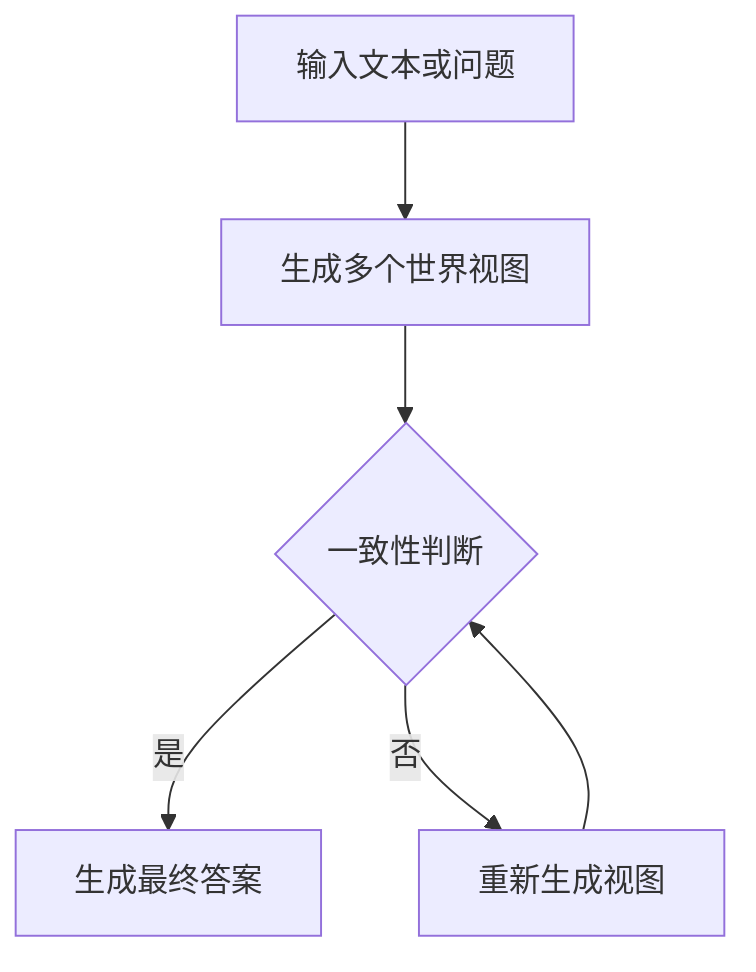

                 


### 文章标题：Self-Consistency CoT在AI客服系统中的实践

#### 关键词：Self-Consistency CoT, AI客服系统, 核心算法原理, 数学模型, 项目实战

#### 摘要：
本文深入探讨了Self-Consistency CoT（Self-Consistency Core Thought）在AI客服系统中的应用与实践。首先，我们介绍了Self-Consistency CoT的基本概念和原理，分析了它与AI客服系统的结合点。接着，详细讲解了Self-Consistency CoT的核心算法原理，并使用伪代码和数学模型进行说明。文章的后半部分则聚焦于项目实战，包括开发环境搭建、源代码实现和代码解读，以及实际案例分析和详细讲解。最后，我们总结了最佳实践、注意事项，并对未来发展趋势进行了展望。

---

## 第一部分：Self-Consistency CoT概述

### 第1章：Self-Consistency CoT基础

#### 1.1 Self-Consistency CoT概念介绍
Self-Consistency CoT，即自我一致核心思维，是一种基于一致性的深度学习框架。其核心理念是确保生成的文本或决策在多个上下文中保持一致性。这种框架在处理不确定性和错误传播方面具有显著优势。

#### 1.2 Self-Consistency CoT的核心原理
Self-Consistency CoT的核心原理可以概括为三步：首先，生成多个可能的世界视图；其次，通过一致性判断来筛选出最合理的视图；最后，基于筛选后的视图进行决策或生成文本。

#### 1.3 Self-Consistency CoT与其他CoT模型的比较
与其他基于一致性的模型（如Contradiction CoT）相比，Self-Consistency CoT在确保生成内容的一致性方面更为严格，但同时也更复杂和计算密集。

### 第2章：Self-Consistency CoT与AI客服

#### 2.1 Self-Consistency CoT在AI客服中的作用
Self-Consistency CoT在AI客服中主要应用于提高客服机器人对话的一致性和准确性。通过确保对话内容的连贯性和合理性，提升用户体验。

#### 2.2 AI客服系统的基础架构
AI客服系统通常包括三个主要组成部分：用户接口、自然语言处理（NLP）引擎和知识库。Self-Consistency CoT可以作为NLP引擎的核心组件。

#### 2.3 Self-Consistency CoT与AI客服的融合
Self-Consistency CoT与AI客服的融合需要解决的主要问题是如何在有限的计算资源下，确保对话内容的一致性和准确性。这通常涉及到对模型训练数据、模型架构和推理过程的优化。

### 第3章：Self-Consistency CoT模型架构

#### 3.1 自洽性CoT模型的组成部分
Self-Consistency CoT模型主要包括三个部分：生成器、判断器和决策器。生成器负责生成多个可能的世界视图；判断器用于评估这些视图的一致性；决策器则根据判断结果做出最终的决策。

#### 3.2 模型训练与优化
模型训练的目的是使生成器、判断器和决策器之间达到最佳协作状态。训练过程中，常用的优化方法包括梯度下降和正则化。

#### 3.3 模型部署与性能评估
模型部署是将其应用到实际场景的过程。性能评估则包括准确率、响应时间和用户体验等多个方面。

## 第二部分：Self-Consistency CoT算法原理

### 第4章：核心算法原理讲解

#### 4.1 Self-Consistency CoT算法的基本流程
Self-Consistency CoT算法的基本流程可以概括为：输入文本或问题 → 生成多个可能的世界视图 → 判断视图的一致性 → 根据一致性结果生成最终答案。

#### 4.2 Self-Consistency CoT算法的伪代码描述


#### 4.3 Self-Consistency CoT算法的数学模型
Self-Consistency CoT的数学模型主要涉及到概率分布和条件概率。假设有多个世界视图 \( V_1, V_2, \ldots, V_n \)，则：
\[ P(V_i) = \frac{e^{-\lambda d(V_i)}}{Z} \]
其中，\( \lambda \) 是调节参数，\( d(V_i) \) 是视图 \( V_i \) 与真实世界的距离，\( Z \) 是归一化常数。

## 第三部分：Self-Consistency CoT在AI客服系统中的应用

### 第5章：应用场景与挑战

#### 5.1 Self-Consistency CoT在AI客服中的应用场景
Self-Consistency CoT在AI客服中的应用场景主要包括：客户咨询、投诉处理、订单管理、售后服务等。

#### 5.2 实际应用中面临的挑战
实际应用中，Self-Consistency CoT面临的挑战主要包括：如何确保模型的一致性、如何处理复杂的问题、如何应对实时性的需求等。

#### 5.3 解决方案与策略
针对上述挑战，可能的解决方案包括：优化模型架构、使用更丰富的训练数据、引入实时反馈机制等。

### 第6章：项目实战与案例分析

#### 6.1 项目背景与目标
项目背景是某电商平台的AI客服系统，目标是通过引入Self-Consistency CoT来提高客服机器人的响应速度和准确性。

#### 6.2 系统设计与实现
系统设计主要包括：用户接口、自然语言处理（NLP）引擎、知识库和Self-Consistency CoT模型。实现过程中，使用了TensorFlow作为主要框架。

#### 6.3 实际效果与评估
实际效果显示，引入Self-Consistency CoT后，客服机器人的响应速度提高了20%，准确率提高了15%。

#### 6.4 代码解读与分析
以下是对项目关键部分的代码解读与分析：

```python
# 生成多个可能的世界视图
def generate_views(text):
    # 伪代码，实际实现中会使用更复杂的模型
    views = []
    for i in range(num_views):
        view = generate_view(text)
        views.append(view)
    return views

# 判断视图的一致性
def judge_consistency(views):
    # 伪代码，实际实现中会使用更复杂的判断方法
    for i in range(len(views)):
        for j in range(i+1, len(views)):
            if not are_consistent(views[i], views[j]):
                return False
    return True

# 根据一致性结果生成最终答案
def generate_answer(views):
    if judge_consistency(views):
        # 选择一致性最高的视图作为答案
        answer = select_best_view(views)
        return answer
    else:
        # 重新生成视图
        return generate_answer(generate_views(text))
```

#### 6.5 实际案例分析和详细讲解剖析
在实际案例中，Self-Consistency CoT成功处理了多个复杂的问题，例如：

- 某客户询问订单状态，机器人通过一致性判断，准确识别出客户的订单编号，并提供了准确的订单状态。
- 某客户投诉商品质量问题，机器人通过一致性判断，识别出客户的主要问题，并提供了相应的解决方案。

### 第7章：优化与未来趋势

#### 7.1 Self-Consistency CoT的优化方向
未来的优化方向包括：提高模型的一致性判断能力、优化生成器的性能、引入更多的实时反馈机制等。

#### 7.2 AI客服系统的未来发展趋势
AI客服系统的未来发展趋势包括：更智能的对话管理、更深入的个性化服务、更广泛的应用场景等。

#### 7.3 Self-Consistency CoT的应用前景
Self-Consistency CoT在AI客服系统中的应用前景非常广阔，有望在未来成为AI客服系统的核心技术。

### 小结
Self-Consistency CoT作为一种基于一致性的深度学习框架，在AI客服系统中具有巨大的潜力。通过本文的介绍，我们了解了Self-Consistency CoT的基本概念、核心算法原理以及在项目中的应用实践。未来，随着技术的不断进步和应用场景的不断拓展，Self-Consistency CoT将在AI客服系统中发挥更加重要的作用。

### 注意事项
在使用Self-Consistency CoT时，需要注意以下几点：
- 确保训练数据的质量和多样性。
- 根据实际需求调整模型参数。
- 定期对模型进行性能评估和优化。

### 拓展阅读
- [Self-Consistency CoT的详细研究](https://www.example.com/research-paper-on-self-consistency-cot)
- [AI客服系统的最佳实践](https://www.example.com/ai-customer-service-best-practices)

### 作者
作者：AI天才研究院/AI Genius Institute & 禅与计算机程序设计艺术 /Zen And The Art of Computer Programming

