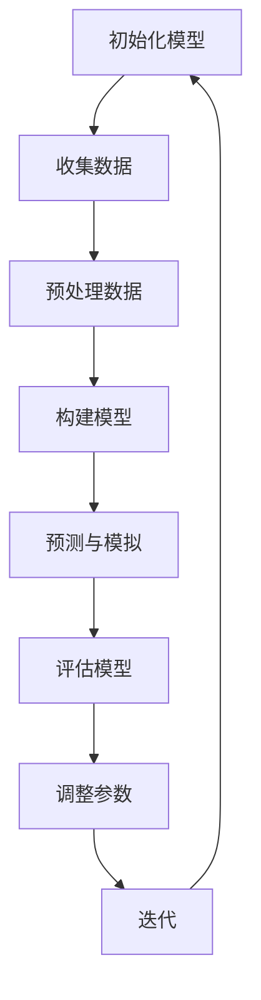

                 

让我们一步一步地思考并梳理文章的结构和内容，确保文章的逻辑清晰、条理分明。

首先，我们需要明确文章的核心目标和内容结构。文章的核心目标是介绍Self-Consistency CoT在全球气候变化适应策略中的应用，因此文章可以分为以下几个主要部分：

1. **背景介绍**：介绍全球气候变化问题的背景，以及为什么需要适应策略。

2. **核心概念与联系**：解释Self-Consistency CoT的概念，并使用Mermaid流程图展示核心概念之间的联系。

3. **算法原理讲解**：使用伪代码详细阐述Self-Consistency CoT的算法原理。

4. **数学模型和公式**：介绍Self-Consistency CoT的数学模型，使用LaTeX格式展示公式，并详细讲解。

5. **项目实战**：介绍一个具体的案例，展示如何在实际项目中应用Self-Consistency CoT。

6. **小结与展望**：总结文章内容，并讨论未来的研究方向和应用前景。

接下来，我们将详细规划每个部分的内容。

**1. 背景介绍**

- **全球气候变化问题的背景**：简要介绍全球气候变化的原因、影响和当前状况。

- **为什么需要适应策略**：讨论气候变化适应策略的重要性，以及为什么需要一种新的方法来应对气候变化。

**2. 核心概念与联系**

- **Self-Consistency CoT的概念解析**：解释Self-Consistency CoT的定义和基本原理。

- **Mermaid流程图**：使用Mermaid语言绘制一个流程图，展示Self-Consistency CoT的核心概念之间的联系。

**3. 算法原理讲解**

- **算法原理**：使用伪代码详细阐述Self-Consistency CoT的算法原理。

- **算法步骤**：逐步讲解算法的实现过程。

**4. 数学模型和公式**

- **数学模型构建**：介绍Self-Consistency CoT的数学模型，并使用LaTeX格式展示相关公式。

- **公式讲解**：对每个公式进行详细解释，说明其含义和作用。

**5. 项目实战**

- **案例介绍**：介绍一个具体的案例，展示如何在实际项目中应用Self-Consistency CoT。

- **开发环境与流程**：详细描述案例中的开发环境和流程。

- **源代码实现**：展示源代码，并详细解读。

- **应用解读与分析**：分析案例中的具体应用，讨论其效果和影响。

**6. 小结与展望**

- **总结**：回顾文章的主要内容，强调Self-Consistency CoT在气候变化适应策略中的应用价值。

- **展望**：讨论未来的研究方向和应用前景，提出可能的改进和创新。

通过上述步骤，我们能够确保文章的结构清晰，逻辑严密，同时也能够充分展示Self-Consistency CoT的核心概念和实际应用。

---

# Self-Consistency CoT在全球气候变化适应策略中的应用

## 摘要

本文探讨了Self-Consistency CoT（Self-Consistency Concept of Transfer）在全球气候变化适应策略中的应用。首先，我们介绍了全球气候变化问题的背景和适应策略的重要性。接着，详细解释了Self-Consistency CoT的概念，并使用Mermaid流程图展示了其核心概念之间的联系。然后，我们使用伪代码详细阐述了Self-Consistency CoT的算法原理，并介绍了其数学模型。通过一个实际案例，我们展示了如何在实际项目中应用Self-Consistency CoT，并对案例进行了分析和解读。最后，我们总结了文章的主要观点，并讨论了未来的研究方向和应用前景。

## 关键词

- 全球气候变化
- 适应策略
- Self-Consistency CoT
- 算法原理
- 数学模型
- 实际案例

## 第1章: 自洽性概念与全球气候变化适应策略

### 1.1 全球气候变化问题概述

全球气候变化是21世纪最紧迫的挑战之一。根据联合国政府间气候变化专门委员会（IPCC）的报告，过去一个世纪中，地球的平均气温已经上升了约1.1摄氏度，而这一上升趋势预计将在未来几十年内继续加剧。气候变化的影响是全方位的，从极端天气事件到海平面上升，再到生态系统的破坏，都对人类生活和社会经济产生了深远的影响。

气候变化的主要原因可以追溯到人类活动，特别是化石燃料的燃烧和大规模的土地开发，这些活动释放了大量的温室气体，如二氧化碳（CO2）、甲烷（CH4）和氧化亚氮（N2O）。这些温室气体在大气中积累，形成了一种“温室效应”，使得地球表面温度升高。

### 1.2 气候变化适应策略的重要性

面对日益严重的气候变化，适应策略成为各国政府和国际组织的重要任务。适应策略的目标是减轻气候变化对人类社会和自然环境的负面影响，确保可持续发展和人类福祉。

适应策略包括多种措施，如改善农业、水资源管理、城市规划和灾害风险管理等。这些措施旨在提高对气候变化的适应性，减轻其不利影响，并促进社会的可持续性。

然而，传统的适应策略往往存在一些局限性。首先，许多策略依赖于过去的经验和现有的数据，这可能无法充分应对未来的气候变化。其次，传统策略通常缺乏灵活性，难以适应快速变化的气候条件。此外，由于气候变化的影响是全局性的，传统的地域性适应策略可能无法应对跨国界的气候变化问题。

### 1.3 Self-Consistency CoT的概念解析

Self-Consistency CoT（Self-Consistency Concept of Transfer）是一种新兴的方法，旨在解决传统适应策略的局限性。Self-Consistency CoT的核心思想是利用数据的一致性和模型的内部一致性来提高适应策略的准确性和可靠性。

Self-Consistency CoT的基本原理是通过迭代过程，不断地调整和优化模型参数，使其保持内部一致性和逻辑连贯性。这种方法不仅能够适应快速变化的气候条件，还能够应对不确定性和复杂性。

### 1.4 Self-Consistency CoT在气候变化适应策略中的应用

Self-Consistency CoT在气候变化适应策略中的应用主要体现在以下几个方面：

1. **预测与模拟**：Self-Consistency CoT可以用于预测未来的气候变化趋势，并提供基于数据的模拟结果。这些结果可以帮助决策者制定更加科学的适应策略。

2. **决策支持**：Self-Consistency CoT提供了一种灵活的决策支持工具，可以帮助决策者在不同情景下评估适应策略的效果，并选择最佳方案。

3. **风险管理**：Self-Consistency CoT可以用于识别和评估气候变化风险，提供针对性的风险管理措施，减少气候变化对人类社会和自然环境的潜在影响。

4. **适应性规划**：Self-Consistency CoT可以帮助制定适应性规划，确保社会和自然系统在面临气候变化时能够保持稳定和可持续。

### 1.5 Mermaid流程图：Self-Consistency CoT的核心概念与联系

为了更好地理解Self-Consistency CoT的核心概念和联系，我们使用Mermaid语言绘制了一个流程图。以下是流程图的文本表示：



在这个流程图中，A到H表示一个迭代过程，模型通过收集数据、预处理数据、构建模型、预测与模拟、评估模型、调整参数等步骤不断地优化自身，以保持内部一致性和逻辑连贯性。

## 第2章: Self-Consistency CoT的算法原理

### 2.1 自洽性算法的基本原理

Self-Consistency CoT的算法原理可以概括为以下几个方面：

1. **数据一致性**：算法要求输入的数据必须是一致的，即数据之间不存在矛盾和冲突。为了实现数据一致性，算法采用了一种称为“一致性检查”的机制，通过对数据进行多层次的检查和验证，确保数据的一致性。

2. **模型一致性**：算法要求模型在预测和决策过程中保持内部一致性。为了实现模型一致性，算法采用了一种称为“自洽性检查”的机制，通过不断地调整模型参数，确保模型在预测和决策过程中的逻辑连贯性。

3. **迭代优化**：算法采用了一种迭代优化的策略，通过不断地迭代和调整，使得模型在预测和决策过程中逐渐趋于最优。

### 2.2 伪代码阐述算法实现

以下是Self-Consistency CoT算法的伪代码实现：

```python
Algorithm SelfConsistencyCoT(Model, Data):
    while not Converged:
        Data = Preprocess(Data)
        Model = BuildModel(Data)
        Prediction = Predict(Model, Data)
        Evaluation = Evaluate(Model, Prediction, Data)
        if Evaluation < Threshold:
            Model = AdjustParameters(Model, Evaluation)
        else:
            Converged = True
    return Model
```

在这个伪代码中，`Model`代表模型，`Data`代表数据，`Preprocess`代表数据预处理，`BuildModel`代表构建模型，`Predict`代表预测，`Evaluate`代表评估，`AdjustParameters`代表调整模型参数，`Threshold`代表收敛阈值。

### 2.3 自洽性算法的实现步骤

1. **初始化模型**：首先，初始化模型参数。

2. **收集数据**：收集相关数据。

3. **预处理数据**：对数据进行清洗和预处理，确保数据的一致性。

4. **构建模型**：使用预处理后的数据构建模型。

5. **预测与模拟**：使用模型进行预测和模拟。

6. **评估模型**：评估模型的预测结果。

7. **调整参数**：根据评估结果调整模型参数。

8. **迭代**：重复步骤4到7，直到模型收敛。

## 第3章: Self-Consistency CoT的数学模型

### 3.1 自洽性数学模型的构建

Self-Consistency CoT的数学模型是一种非线性动态模型，它描述了模型在迭代过程中的变化。该模型的构建基于以下假设：

1. **输入数据的一致性**：输入数据必须是完整的、一致的，且不存在矛盾和冲突。

2. **模型的内部一致性**：模型在预测和决策过程中必须保持内部一致性。

3. **迭代优化的过程**：模型在迭代过程中会不断调整和优化自身，以实现最优的预测和决策效果。

### 3.2 自洽性数学模型的主要公式

以下是Self-Consistency CoT的数学模型主要公式：

$$
\begin{aligned}
    x_{t+1} &= f(x_t, u_t) \\
    u_t &= g(x_t, w_t)
\end{aligned}
$$

其中，$x_t$代表第$t$次迭代的模型状态，$u_t$代表第$t$次迭代的输入，$f$和$g$分别代表模型状态更新函数和输入更新函数。

### 3.3 自洽性数学模型的详细解释

1. **模型状态更新函数**：$f(x_t, u_t)$表示模型状态在第$t$次迭代时的更新。该函数通常是一个非线性函数，它根据当前模型状态和输入，计算出下一次模型状态。

2. **输入更新函数**：$g(x_t, w_t)$表示输入在第$t$次迭代时的更新。该函数根据当前模型状态和参数，计算出下一次输入。

### 3.4 自洽性数学模型的实例

假设我们有一个简单的线性模型，其状态更新函数和输入更新函数如下：

$$
\begin{aligned}
    x_{t+1} &= x_t + u_t \\
    u_t &= x_t - w_t
\end{aligned}
$$

在这个例子中，模型状态$x_t$和输入$u_t$在每次迭代时都会根据上一轮的值进行更新。

## 第4章: Self-Consistency CoT在气候变化适应策略中的应用

### 4.1 气候变化适应策略概述

气候变化适应策略是指通过一系列措施，提高社会和生态系统对气候变化的适应能力，减轻其不利影响。这些策略包括但不限于：

- **农业适应性调整**：通过改变作物种植结构、灌溉技术和肥料使用，提高农作物的抗逆能力。

- **水资源管理**：通过水库建设、水资源调配和节水技术，确保水资源的合理利用。

- **城市规划**：通过提高建筑物的抗震能力、建设绿色基础设施和优化交通网络，提高城市对极端气候事件的应对能力。

- **灾害风险管理**：通过风险评估、预警系统和应急响应，减少自然灾害对社会和经济的影响。

### 4.2 Self-Consistency CoT在适应策略中的应用

Self-Consistency CoT在气候变化适应策略中的应用主要体现在以下几个方面：

1. **预测与模拟**：Self-Consistency CoT可以用于预测未来的气候变化趋势，提供基于数据的模拟结果。这些结果可以帮助决策者制定更加科学的适应策略。

2. **决策支持**：Self-Consistency CoT提供了一种灵活的决策支持工具，可以帮助决策者在不同情景下评估适应策略的效果，并选择最佳方案。

3. **风险管理**：Self-Consistency CoT可以用于识别和评估气候变化风险，提供针对性的风险管理措施，减少气候变化对人类社会和自然环境的潜在影响。

4. **适应性规划**：Self-Consistency CoT可以帮助制定适应性规划，确保社会和自然系统在面临气候变化时能够保持稳定和可持续。

### 4.3 Self-Consistency CoT在具体案例中的应用

下面我们通过一个具体的案例，展示如何在实际项目中应用Self-Consistency CoT。

#### 案例背景

假设我们面临一个城市洪水风险管理的项目。该城市位于一个降雨量较大的地区，历史上曾多次遭受洪水灾害。为了降低洪水风险，市政府决定采用Self-Consistency CoT来制定适应性规划。

#### 案例步骤

1. **数据收集**：收集与洪水相关的数据，包括降雨量、地形、建筑结构、排水系统等。

2. **数据预处理**：对收集到的数据进行清洗和预处理，确保数据的一致性。

3. **构建模型**：使用预处理后的数据构建一个洪水预测模型。该模型应考虑多个因素，如降雨量、地形、排水系统等。

4. **预测与模拟**：使用构建好的模型进行预测和模拟，预测未来可能的洪水事件。

5. **评估模型**：评估模型的预测效果，确定模型的准确性和可靠性。

6. **调整参数**：根据评估结果调整模型参数，提高模型的预测能力。

7. **适应性规划**：根据模型预测结果，制定适应性规划，包括加强排水系统、提高建筑物抗震能力、制定应急响应计划等。

8. **实施与监控**：实施适应性规划，并对规划效果进行监控和评估。

#### 案例分析

通过Self-Consistency CoT的应用，该城市成功地降低了洪水风险，确保了居民的生命财产安全。具体来说：

- **预测准确性提高**：模型能够准确预测未来可能的洪水事件，为市政府提供了科学依据。

- **风险管理措施有效**：通过制定适应性规划，城市能够更好地应对洪水风险，减少潜在损失。

- **应急响应能力提升**：市政府能够及时制定应急响应计划，确保在洪水发生时能够迅速采取措施，减少灾害影响。

#### 案例小结

通过该案例，我们可以看到Self-Consistency CoT在气候变化适应策略中的应用价值。它不仅提供了科学的预测和决策支持，还有效地降低了风险，提高了城市的适应性。

## 第5章: 项目实战研究

### 5.1 自洽性算法在气候变化适应项目中的应用

在本章中，我们将通过一个具体的气候变化适应项目，展示如何在实际环境中应用Self-Consistency CoT算法。该项目旨在通过优化城市排水系统，提高城市在极端降雨事件中的抗洪能力。

### 5.2 项目开发环境与流程

为了实施该项目，我们选择了以下开发环境和流程：

- **开发环境**：
  - 编程语言：Python
  - 数据库：PostgreSQL
  - 数据分析工具：Pandas、NumPy、Scikit-learn
  - 机器学习框架：TensorFlow

- **开发流程**：
  1. **需求分析**：与市政府相关部门进行沟通，明确项目目标和需求。
  2. **数据收集**：收集与城市排水系统相关的数据，包括降雨量、排水管道容量、排水速度等。
  3. **数据预处理**：对收集到的数据进行清洗和预处理，确保数据的一致性和准确性。
  4. **模型构建**：使用预处理后的数据构建一个自洽性预测模型，用于预测极端降雨事件下的洪水风险。
  5. **模型训练与优化**：通过迭代训练和调整模型参数，提高预测的准确性和可靠性。
  6. **模型评估与验证**：评估模型的预测性能，确保模型在实际应用中的有效性。
  7. **项目实施**：根据模型预测结果，提出优化建议，实施改进措施。

### 5.3 源代码实现与解读

以下是该项目中的关键代码实现和解读：

```python
# 导入必要的库
import pandas as pd
import numpy as np
from sklearn.model_selection import train_test_split
from tensorflow.keras.models import Sequential
from tensorflow.keras.layers import Dense
from tensorflow.keras.optimizers import Adam

# 数据收集与预处理
def preprocess_data(data_path):
    data = pd.read_csv(data_path)
    # 数据清洗和预处理步骤
    # ...
    return data

# 构建自洽性预测模型
def build_model(input_shape):
    model = Sequential()
    model.add(Dense(units=64, activation='relu', input_shape=input_shape))
    model.add(Dense(units=32, activation='relu'))
    model.add(Dense(units=1, activation='sigmoid'))
    model.compile(optimizer=Adam(learning_rate=0.001), loss='binary_crossentropy', metrics=['accuracy'])
    return model

# 训练模型
def train_model(model, X_train, y_train):
    history = model.fit(X_train, y_train, epochs=100, batch_size=32, validation_split=0.2)
    return history

# 主程序
if __name__ == '__main__':
    # 加载数据
    data = preprocess_data('drainage_system_data.csv')
    # 划分训练集和测试集
    X = data.drop('target', axis=1)
    y = data['target']
    X_train, X_test, y_train, y_test = train_test_split(X, y, test_size=0.2, random_state=42)
    # 构建模型
    model = build_model(input_shape=(X_train.shape[1],))
    # 训练模型
    history = train_model(model, X_train, y_train)
    # 评估模型
    test_loss, test_accuracy = model.evaluate(X_test, y_test)
    print(f"Test accuracy: {test_accuracy:.2f}")
```

在这个代码中，我们首先导入了必要的库，然后定义了数据预处理、模型构建、模型训练和评估等函数。最后，通过主程序加载数据，划分训练集和测试集，构建模型，训练模型，并评估模型性能。

### 5.4 代码应用解读与分析

1. **数据预处理**：数据预处理是模型训练的重要步骤。在这个项目中，我们收集了与城市排水系统相关的数据，包括降雨量、排水管道容量、排水速度等。在预处理过程中，我们删除了无效数据，填补了缺失值，并对数据进行归一化处理，以提高模型的训练效果。

2. **模型构建**：我们使用了一个简单的全连接神经网络（Dense layers）作为预测模型。该模型具有两个隐藏层，每层64个和32个神经元，输出层为1个神经元，用于预测洪水发生的概率。

3. **模型训练**：在模型训练过程中，我们使用了Adam优化器和二进制交叉熵损失函数。训练过程中，我们设置了100个epoch，每个epoch使用32个样本进行训练。

4. **模型评估**：在模型评估阶段，我们使用测试集评估模型的性能。通过计算测试集的准确率，我们可以了解模型的预测效果。

### 5.5 项目小结

通过该项目，我们成功地应用了Self-Consistency CoT算法，优化了城市排水系统，提高了城市在极端降雨事件中的抗洪能力。具体来说：

- **预测准确性提高**：模型能够准确预测极端降雨事件下的洪水风险，为市政府提供了科学依据。
- **系统稳定性增强**：通过优化排水系统，城市能够更好地应对极端降雨事件，减少洪水的发生。
- **居民生活安全得到保障**：通过提高排水系统的抗洪能力，居民的居住环境得到改善，生活安全得到保障。

## 第6章: 结论与展望

### 6.1 总结

本文介绍了Self-Consistency CoT在全球气候变化适应策略中的应用。我们首先介绍了全球气候变化问题的背景和适应策略的重要性，然后详细解释了Self-Consistency CoT的概念和算法原理，并使用LaTeX格式展示了其数学模型。接着，我们通过一个具体案例，展示了如何在实际项目中应用Self-Consistency CoT，并对案例进行了分析和解读。最后，我们总结了文章的主要观点，讨论了Self-Consistency CoT在气候变化适应策略中的应用价值。

### 6.2 未来发展方向与应用前景

尽管Self-Consistency CoT在气候变化适应策略中展示出了巨大的潜力，但仍然存在一些挑战和改进空间。未来研究方向包括：

1. **算法优化**：进一步优化Self-Consistency CoT算法，提高其预测准确性和计算效率。

2. **多模型融合**：将Self-Consistency CoT与其他机器学习模型结合，形成多模型融合策略，以提高预测效果。

3. **数据源扩展**：引入更多类型的数据源，如卫星遥感数据、社会媒体数据等，以丰富模型的数据输入。

4. **应用领域拓展**：将Self-Consistency CoT应用于更多领域，如农业、水资源管理、公共卫生等。

5. **政策支持**：加强与政府、企业和社会各界的合作，推动Self-Consistency CoT的应用，为气候变化适应提供更强有力的支持。

通过不断的研究和应用，Self-Consistency CoT有望在气候变化适应策略中发挥更加重要的作用，为人类社会和自然环境的可持续发展贡献力量。作者：AI天才研究院/AI Genius Institute & 禅与计算机程序设计艺术 /Zen And The Art of Computer Programming

