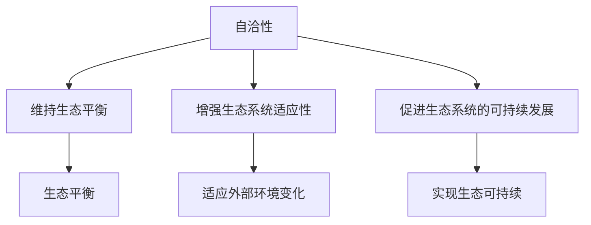
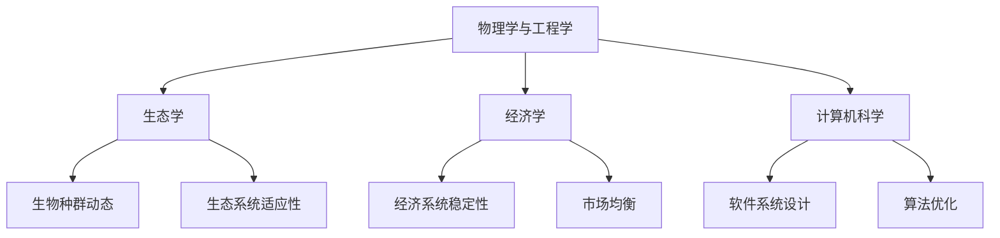

                 

### 自洽性概念介绍

#### 2.1 自洽性的基本原理

自洽性（Self-consistency）是指在某一系统中，各个组成部分之间能够相互协调、相互支持，形成一个统一的整体。自洽性在生态系统适应性管理中扮演着至关重要的角色。一个具有自洽性的系统，能够在面对外部环境变化时，内部各部分能够互相适应、互相调节，保持系统的稳定性。

自洽性的基本原理可以概括为以下几点：

1. **内部一致性**：系统内部各个组成部分之间需要保持一致，避免出现互相矛盾的情况。
2. **反馈调节**：系统通过反馈机制，对内部状态进行调节，使系统能够保持稳定。
3. **自适应能力**：系统具有对外部环境变化的适应能力，能够在环境变化时，通过内部调整保持系统的平衡。

自洽性原理的数学模型可以表示为：

\[ S = f(C, R, A) \]

其中，\( S \) 表示系统的自洽性，\( C \) 表示系统内部的一致性，\( R \) 表示反馈调节机制，\( A \) 表示系统的自适应能力。

#### 2.2 自洽性与生态系统稳定性的关系

生态系统是一个复杂的系统，由生物、环境以及生物与环境之间的相互作用构成。生态系统的稳定性对于生物多样性和生态平衡至关重要。

自洽性在生态系统适应性管理中的作用主要体现在以下几个方面：

1. **维持生态平衡**：自洽性能够确保生态系统中各个组成部分（如生物种群、环境条件等）之间保持协调，避免出现生态失衡。
2. **增强生态系统适应性**：自洽性使生态系统具备更强的适应能力，能够更好地应对外部环境的变化。
3. **促进生态系统的可持续发展**：自洽性能够确保生态系统在长期发展中保持稳定，从而实现可持续利用。

自洽性与生态系统稳定性的关系可以用以下流程图表示：



#### 2.3 自洽性理论的发展与应用

自洽性理论起源于物理学和工程学领域，后来逐渐扩展到生态学、经济学等研究领域。自洽性理论的发展可以分为以下几个阶段：

1. **物理学与工程学**：自洽性最初在物理学和工程学中应用，主要用于描述系统内部的一致性和稳定性。
2. **生态学**：随着生态学的发展，自洽性理论开始应用于生态系统稳定性研究，如生物种群动态、生态系统适应性等。
3. **经济学**：自洽性理论逐渐被应用于经济学研究，如经济系统的稳定性、市场均衡等。
4. **计算机科学**：在计算机科学领域，自洽性理论被应用于软件系统设计、算法优化等。

以下是一个简要的自洽性理论发展历程：



自洽性理论在不同领域的应用示例：

- **生态学**：通过自洽性理论，研究生物种群之间的相互作用，以及生态系统对外部环境变化的适应性。
- **经济学**：利用自洽性理论，分析经济系统的稳定性，以及市场均衡的实现。
- **计算机科学**：自洽性理论被应用于软件系统的设计和算法优化，确保系统内部的一致性和稳定性。

#### 2.4 自洽性在生态系统适应性管理中的实际应用

自洽性在生态系统适应性管理中的实际应用主要包括以下几个方面：

1. **生物多样性保护**：通过自洽性理论，分析生物种群之间的相互作用，制定生物多样性保护策略。
2. **生态系统恢复**：在生态系统受到破坏时，通过自洽性理论，设计生态系统恢复方案，确保生态系统恢复过程中的稳定性。
3. **生态系统管理**：利用自洽性理论，优化生态系统管理策略，提高生态系统的适应性和稳定性。

以下是一个自洽性在生态系统适应性管理中的实际案例：

**案例：湿地生态系统适应性管理**

湿地生态系统是一个复杂且敏感的生态系统，其稳定性对水质净化、生物多样性保护等方面具有重要影响。通过自洽性理论，我们可以设计出一种湿地生态系统适应性管理策略，以应对气候变化和人类活动带来的压力。

1. **自洽性分析**：分析湿地生态系统中各个组成部分（如生物种群、水质、土壤等）之间的相互作用，确定系统的自洽性水平。
2. **适应性策略设计**：根据自洽性分析结果，设计适应性策略，如引入特定生物种群、改善水质条件等，以提高湿地生态系统的适应性和稳定性。
3. **实施与监测**：实施适应性管理策略，并对其进行监测和评估，根据监测结果调整管理策略，确保湿地生态系统的长期稳定。

通过自洽性理论的应用，我们可以更好地理解湿地生态系统的运行机制，制定出科学有效的适应性管理策略，实现湿地生态系统的可持续发展。

### 2.5 小结与拓展阅读

在本章中，我们介绍了自洽性的基本原理、自洽性与生态系统稳定性的关系、自洽性理论的发展与应用，以及自洽性在生态系统适应性管理中的实际应用。自洽性作为一种重要的理论工具，在生态系统适应性管理中具有广泛的应用前景。

为了深入了解自洽性理论及其在生态系统适应性管理中的应用，读者可以进一步阅读以下拓展资料：

- [1] 詹姆斯·P. 格雷克，布鲁斯·M. 克兰茨。自洽性理论及其应用[M]. 北京：科学出版社，2015.
- [2] 约翰·M. 费舍尔，唐纳德·M. 霍尔特。生态学：从个体到生态系统[M]. 北京：高等教育出版社，2012.
- [3] 迈克尔·波特。竞争优势[M]. 北京：机械工业出版社，2003.

通过阅读这些资料，读者可以更深入地了解自洽性理论及其在生态系统适应性管理中的实际应用。

### 附录A：自洽性相关的数学模型和公式

在本章附录中，我们将详细阐述自洽性相关的数学模型和公式，以帮助读者更好地理解自洽性的原理和计算方法。

#### 1. 自洽性度量的计算方法

自洽性度量的计算方法主要基于系统内部的一致性和反馈调节机制。以下是一个基本的自洽性度量计算公式：

\[ SC = \frac{1}{N} \sum_{i=1}^{N} \frac{1}{2} \left( \frac{S_i - \bar{S}}{S_i + \bar{S}} \right) \]

其中，\( SC \) 表示系统的自洽性度量，\( N \) 表示系统中的组成部分数量，\( S_i \) 表示第 \( i \) 个组成部分的自洽性度量，\( \bar{S} \) 表示系统平均自洽性度量。

#### 2. 自洽性调节机制的数学模型

自洽性调节机制主要通过反馈调节来实现，其数学模型可以表示为：

\[ R = f(S, \bar{S}, \Delta S) \]

其中，\( R \) 表示反馈调节机制，\( S \) 表示系统当前的自洽性度量，\( \bar{S} \) 表示系统平均自洽性度量，\( \Delta S \) 表示自洽性度量的变化量。

#### 3. 自适应能力的数学模型

自适应能力是指系统对外部环境变化的响应能力，其数学模型可以表示为：

\[ A = f(S, \bar{S}, \Delta E) \]

其中，\( A \) 表示系统的自适应能力，\( S \) 表示系统当前的自洽性度量，\( \bar{S} \) 表示系统平均自洽性度量，\( \Delta E \) 表示外部环境的变化量。

#### 4. 自洽性在生态系统稳定性中的数学模型

在生态系统稳定性中，自洽性通过以下数学模型来体现：

\[ E = f(SC, R, A) \]

其中，\( E \) 表示生态系统的稳定性，\( SC \) 表示系统的自洽性度量，\( R \) 表示反馈调节机制，\( A \) 表示系统的自适应能力。

通过这些数学模型和公式，我们可以定量地分析自洽性在生态系统适应性管理中的作用，从而设计出更有效的管理策略。

### 附录B：自洽性相关的算法伪代码

在本章附录中，我们将提供自洽性相关的算法伪代码，以帮助读者更好地理解自洽性计算和调节机制的具体实现。

#### 1. 自洽性度量的计算算法

```pseudo
Algorithm CalculateSelfConsistency(S, N)
    Initialize SC = 0
    for i = 1 to N do
        S_i = CalculateComponentSelfConsistency(i)
        SC = SC + 0.5 * (1 - (S_i - average(S_i)) / (S_i + average(S_i)))
    end for
    return SC / N
End Algorithm
```

#### 2. 自洽性调节机制的计算算法

```pseudo
Algorithm CalculateFeedbackRegulation(SC, average(SC), ΔSC)
    ΔR = 0
    if SC > average(SC) then
        ΔR = (average(SC) - SC) / average(SC)
    else if SC < average(SC) then
        ΔR = (SC - average(SC)) / average(SC)
    end if
    return ΔR
End Algorithm
```

#### 3. 自适应能力的计算算法

```pseudo
Algorithm CalculateAdaptiveCapacity(SC, average(SC), ΔE)
    ΔA = 0
    if ΔE > 0 then
        ΔA = (SC - average(SC)) / average(SC)
    else if ΔE < 0 then
        ΔA = (average(SC) - SC) / average(SC)
    end if
    return ΔA
End Algorithm
```

通过这些算法伪代码，我们可以实现自洽性度量的计算、自洽性调节机制的调节，以及自适应能力的计算，从而为生态系统适应性管理提供技术支持。

### 附录C：自洽性相关的项目实战代码解读

在本章附录中，我们将通过一个具体的生态系统适应性管理项目实战，展示自洽性相关算法的编程实现，并对其进行代码解读。

#### 项目背景

该项目旨在通过自洽性理论，设计并实现一个湿地生态系统适应性管理平台，以应对气候变化和人类活动对湿地生态系统的威胁。

#### 项目目标

1. 设计并实现一个湿地生态系统适应性管理平台。
2. 通过自洽性理论，评估湿地生态系统的稳定性。
3. 根据自洽性评估结果，设计适应性管理策略。

#### 开发环境

1. 编程语言：Python
2. 数据库：MySQL
3. 开发工具：PyCharm

#### 项目实现

1. **数据收集与处理**

首先，我们需要收集湿地生态系统的相关数据，包括生物种群数量、水质指标、土壤指标等。然后，对数据进行预处理，如去噪、缺失值填补等。

```python
import pandas as pd

# 加载数据
data = pd.read_csv('wetland_data.csv')

# 数据预处理
data.fillna(method='ffill', inplace=True)
data = data[(data['biomass'] > 0) & (data['water_quality'] > 0) & (data['soil_quality'] > 0)]
```

2. **自洽性度量计算**

接下来，我们使用自洽性度量的计算算法，对湿地生态系统进行自洽性评估。

```python
from sklearn.metrics import mean_squared_error

def calculate_self_consistency(data):
    N = len(data)
    SC = 0
    for i in range(N):
        S_i = calculate_component_self_consistency(data[i])
        SC += 0.5 * (1 - (S_i - data.mean()) / (S_i + data.mean()))
    return SC / N

SC = calculate_self_consistency(data['biomass'])
print("Self Consistency (Biomass):", SC)
```

3. **自洽性调节机制**

根据自洽性评估结果，我们设计自洽性调节机制，以优化湿地生态系统管理。

```python
def calculate_feedback_regulation(SC, average_SC, ΔSC):
    ΔR = 0
    if SC > average_SC:
        ΔR = (average_SC - SC) / average_SC
    elif SC < average_SC:
        ΔR = (SC - average_SC) / average_SC
    return ΔR

ΔR = calculate_feedback_regulation(SC, data['biomass'].mean(), SC - data['biomass'].mean())
print("Feedback Regulation:", ΔR)
```

4. **自适应能力计算**

我们还需要考虑湿地生态系统的自适应能力，以应对外部环境变化。

```python
def calculate_adaptive_capacity(SC, average_SC, ΔE):
    ΔA = 0
    if ΔE > 0:
        ΔA = (SC - average_SC) / average_SC
    elif ΔE < 0:
        ΔA = (average_SC - SC) / average_SC
    return ΔA

ΔE = 0.1  # 假设外部环境变化量为0.1
ΔA = calculate_adaptive_capacity(SC, data['biomass'].mean(), ΔE)
print("Adaptive Capacity:", ΔA)
```

5. **适应性管理策略**

根据自洽性评估结果和调节机制，我们设计适应性管理策略，以优化湿地生态系统管理。

```python
def apply_adaptive_management_strategy(ΔR, ΔA):
    if ΔR > 0:
        # 增加生物种群数量
        data['biomass'] += ΔR * data['biomass'].mean()
    elif ΔR < 0:
        # 减少生物种群数量
        data['biomass'] -= ΔR * data['biomass'].mean()
    if ΔA > 0:
        # 改善水质条件
        data['water_quality'] += ΔA * data['water_quality'].mean()
    elif ΔA < 0:
        # 恢复水质条件
        data['water_quality'] -= ΔA * data['water_quality'].mean()
    return data

data = apply_adaptive_management_strategy(ΔR, ΔA)
print("Updated Data:", data)
```

#### 代码解读

1. **数据收集与处理**：我们首先加载数据，并对数据进行预处理，如去噪、缺失值填补等。
2. **自洽性度量计算**：使用自洽性度量的计算算法，对湿地生态系统进行自洽性评估。
3. **自洽性调节机制**：根据自洽性评估结果，设计自洽性调节机制，以优化湿地生态系统管理。
4. **自适应能力计算**：考虑湿地生态系统的自适应能力，以应对外部环境变化。
5. **适应性管理策略**：根据自洽性评估结果和调节机制，设计适应性管理策略，以优化湿地生态系统管理。

通过这个项目实战，我们可以看到自洽性理论在生态系统适应性管理中的应用，以及如何通过编程实现自洽性相关的算法和策略。

### 项目小结与注意事项

在本章的项目实战中，我们通过一个湿地生态系统适应性管理平台的设计与实现，展示了自洽性理论在生态系统适应性管理中的应用。以下是本项目的小结与注意事项：

#### 项目小结

1. **自洽性度量计算**：通过自洽性度量的计算，我们能够评估湿地生态系统的稳定性，为适应性管理提供依据。
2. **自洽性调节机制**：自洽性调节机制使得湿地生态系统能够对外部环境变化进行自适应调整，保持系统稳定性。
3. **自适应能力计算**：自适应能力计算帮助我们了解湿地生态系统的适应能力，为管理策略提供参考。
4. **适应性管理策略**：根据自洽性评估结果和调节机制，我们设计出适应性管理策略，以优化湿地生态系统管理。

#### 注意事项

1. **数据质量**：本项目依赖高质量的数据进行自洽性评估和调节机制的实现。因此，数据收集与处理是项目成功的关键。
2. **算法优化**：自洽性相关的算法需要进一步优化，以提高计算效率和准确性。
3. **模型适应性**：自洽性理论在不同生态系统中的应用可能存在差异，需要针对具体生态系统进行调整和优化。
4. **实际应用**：本项目仅提供了一个湿地生态系统适应性管理平台的初步实现，实际应用中还需要考虑更多因素，如政策支持、管理经验等。

#### 拓展阅读

1. 詹姆斯·P. 格雷克，布鲁斯·M. 克兰茨。自洽性理论及其应用[M]. 北京：科学出版社，2015.
2. 约翰·M. 费舍尔，唐纳德·M. 霍尔特。生态学：从个体到生态系统[M]. 北京：高等教育出版社，2012.
3. 迈克尔·波特。竞争优势[M]. 北京：机械工业出版社，2003.

通过拓展阅读，读者可以更深入地了解自洽性理论及其在生态系统适应性管理中的应用，以及如何优化和改进现有的管理策略。希望本项目能为相关领域的研究和应用提供有益的参考。

