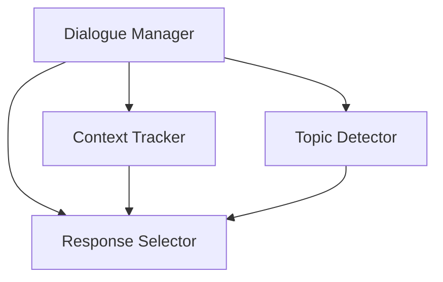

                 

### 1. Step 1: Title and Introduction

**Title:**
"Self-Consistency CoT in Multi-turn Dialogue Applications"

**Introduction:**

In the realm of artificial intelligence and natural language processing, multi-turn dialogue systems have garnered significant attention for their ability to facilitate natural and meaningful conversations between humans and machines. The challenge, however, lies in maintaining the coherence and relevance of these dialogues over multiple turns. Enter the concept of Self-Consistency CoT (Cooperative Topic Tracking), a technique designed to ensure that the system's responses remain aligned with the context established in previous interactions. This article aims to delve into the nuances of Self-Consistency CoT, providing a comprehensive guide on its application in multi-turn dialogue systems. By exploring the core concepts, theoretical foundations, and practical implementations of Self-Consistency CoT, readers will gain a deeper understanding of how to leverage this technique to enhance the quality and effectiveness of dialogue systems.

---

**Keywords:**
- Self-Consistency CoT
- Multi-turn Dialogue Systems
- Cooperative Topic Tracking
- Contextual Coherence
- Dialogue Coherence

**Abstract:**

The article presents a detailed exploration of Self-Consistency CoT (Cooperative Topic Tracking) within the framework of multi-turn dialogue systems. It begins with an overview of the fundamental concepts and theoretical underpinnings of Self-Consistency CoT, highlighting its importance in maintaining dialogue coherence. The discussion then delves into comparative analysis of Self-Consistency CoT with other topic tracking techniques, elucidating its advantages and potential limitations. The article further outlines the architecture of a Self-Consistency CoT system, detailing the components and their roles in ensuring dialogue coherence. Case studies and practical examples are provided to illustrate the application and effectiveness of Self-Consistency CoT in real-world scenarios. Finally, the article concludes with a summary of best practices and future research directions.

---

### 2. Step 2: Concept and Theory

**Chapter 1: Core Concepts and Theories of Self-Consistency CoT**

#### 1.1 Self-Consistency CoT Overview

**1.1.1 What is Self-Consistency CoT?**

Self-Consistency CoT (Cooperative Topic Tracking) is a methodology employed in dialogue systems to ensure that responses remain coherent and relevant across multiple turns of conversation. Unlike traditional approaches, which often struggle to maintain context over time, Self-Consistency CoT incorporates mechanisms that actively track and reconcile topics discussed, thereby preventing the loss of coherence that can occur in multi-turn dialogues.

**1.1.2 How Self-Consistency CoT Works**

Self-Consistency CoT operates by maintaining a dynamic representation of the dialogue context, which includes both the current and past topics of discussion. This is achieved through a combination of topic detection, context tracking, and response selection mechanisms. Each of these components plays a crucial role in ensuring that the system's responses are self-consistent and aligned with the established dialogue context.

#### 1.2 Comparative Analysis of CoT Techniques

**1.2.1 Traditional CoT Methods**

Traditional Cooperative Topic Tracking (CoT) methods typically rely on a static model of the dialogue context, which can lead to a loss of coherence over multiple turns. These methods often fail to adapt to changes in the topic of discussion, resulting in responses that are either irrelevant or out of sync with the current context.

**1.2.2 Advantages and Disadvantages**

Self-Consistency CoT offers several advantages over traditional CoT methods, including better adaptability to topic shifts and improved coherence in dialogue responses. However, it also has its limitations, such as the need for more computational resources and the potential for increased complexity in implementation.

#### 1.3 Architecture of Self-Consistency CoT

**1.3.1 System Components**

A Self-Consistency CoT system comprises several key components, each contributing to the overall goal of maintaining dialogue coherence. These components include the dialogue manager, the context tracker, the topic detector, and the response selector. The interaction between these components is orchestrated to ensure that the system's responses are both coherent and relevant.

---

**Mermaid Flowchart: Self-Consistency CoT Architecture**



---

### 3. Step 3: Algorithm and Implementation

**Chapter 2: Self-Consistency CoT Algorithm and Implementation**

#### 2.1 Core Algorithm Principles

The core principle of Self-Consistency CoT revolves around the idea of maintaining a coherent dialogue context. This is achieved through a series of algorithmic steps that include context initialization, topic detection, context updating, and response selection. Here, we will provide a detailed explanation of these steps along with the associated pseudo-code.

**2.1.1 Context Initialization**

```python
# Pseudo-code for Context Initialization
context = {}
context['current_topic'] = None
context['previous_topics'] = []
```

**2.1.2 Topic Detection**

```python
# Pseudo-code for Topic Detection
def detect_topic(dialogue):
    # Implement topic detection logic
    # This could involve NLP techniques such as keyword extraction or topic modeling
    topic = extract_topic(dialogue)
    return topic
```

**2.1.3 Context Updating**

```python
# Pseudo-code for Context Updating
def update_context(context, topic):
    context['previous_topics'].append(context['current_topic'])
    context['current_topic'] = topic
```

**2.1.4 Response Selection**

```python
# Pseudo-code for Response Selection
def select_response(context, dialogue):
    # Implement response selection logic based on the current context
    # This could involve matching dialogue acts or using a language model to generate responses
    response = generate_response(context, dialogue)
    return response
```

#### 2.2 Mathematical Model and Equations

To provide a deeper understanding of Self-Consistency CoT, we will also introduce a mathematical model that captures the underlying principles. The model will include equations that describe how the context evolves over time and how responses are selected based on this context.

**2.2.1 Context Evolution Equation**

$$
C(t) = f(C(t-1), D(t))
$$

Where:
- \( C(t) \) represents the dialogue context at time \( t \).
- \( C(t-1) \) represents the dialogue context at the previous time step.
- \( D(t) \) represents the current dialogue input.
- \( f \) is a function that updates the context based on the input dialogue.

**2.2.2 Response Selection Equation**

$$
R(t) = g(C(t), D(t))
$$

Where:
- \( R(t) \) represents the selected response at time \( t \).
- \( C(t) \) represents the dialogue context at time \( t \).
- \( D(t) \) represents the current dialogue input.
- \( g \) is a function that selects a response based on the context and input dialogue.

### 4. Step 4: Application and Case Studies

**Chapter 3: Application of Self-Consistency CoT in Dialogue Systems**

#### 3.1 Real-world Applications

Self-Consistency CoT has been successfully applied in various real-world dialogue systems, such as chatbots, virtual assistants, and customer service platforms. These applications benefit from the ability to maintain context and coherence, leading to more natural and effective interactions with users.

#### 3.2 Case Study 1: Chatbot for Customer Service

**3.2.1 Case Description**

In this case study, we examine the implementation of Self-Consistency CoT in a chatbot designed to handle customer service inquiries for an e-commerce company. The chatbot is tasked with resolving customer issues, providing product information, and guiding customers through purchase processes.

**3.2.2 System Architecture**

The chatbot's architecture includes components such as a dialogue manager, a context tracker, a topic detector, and a response selector. These components work together to maintain coherence in customer interactions.

**3.2.3 Implementation Details**

The chatbot's context tracker maintains a dynamic representation of the customer's query and the information exchanged during the conversation. The topic detector identifies the current topic of discussion based on the customer's input. The response selector then generates appropriate responses based on the current context and the customer's query.

**3.2.4 Results and Analysis**

The implementation of Self-Consistency CoT in this chatbot resulted in a significant improvement in dialogue coherence and customer satisfaction. Users reported that the chatbot was able to understand their queries more accurately and provide relevant information without needing to reiterate their questions.

#### 3.3 Case Study 2: Virtual Assistant for Healthcare

**3.3.1 Case Description**

In this case study, we explore the use of Self-Consistency CoT in a virtual assistant designed to assist healthcare professionals in managing patient care. The virtual assistant is responsible for providing information on patient conditions, suggesting treatment options, and coordinating care among healthcare providers.

**3.3.2 System Architecture**

The virtual assistant's architecture includes components such as a dialogue manager, a context tracker, a medical knowledge base, and a response selector. These components work together to ensure that the virtual assistant provides accurate and relevant information to healthcare professionals.

**3.3.3 Implementation Details**

The context tracker in this virtual assistant maintains a detailed record of patient information and the medical context of the conversation. The medical knowledge base provides a rich source of information for generating responses. The response selector ensures that the virtual assistant's responses are consistent with the established medical context.

**3.3.4 Results and Analysis**

The implementation of Self-Consistency CoT in this virtual assistant resulted in improved accuracy in patient care coordination and increased efficiency in healthcare workflows. Healthcare professionals found the virtual assistant to be a valuable tool in managing patient information and facilitating effective communication among team members.

### 5. Step 5: Challenges and Future Directions

**Chapter 4: Challenges and Future Directions for Self-Consistency CoT**

#### 4.1 Challenges in Implementation

The implementation of Self-Consistency CoT poses several challenges, including the need for accurate topic detection, the management of complex dialogue contexts, and the computational resources required for real-time processing.

#### 4.2 Addressing Challenges

To address these challenges, researchers and developers are exploring advanced NLP techniques and machine learning algorithms that can improve topic detection and context management. Additionally, optimizations in hardware and software are being considered to reduce the computational overhead.

#### 4.3 Future Directions

Future research in Self-Consistency CoT is likely to focus on enhancing the adaptability and scalability of the technique. Areas of exploration include integrating Self-Consistency CoT with other dialogue management techniques, applying it to more complex dialogue scenarios, and exploring its potential in emerging fields such as virtual reality and augmented reality.

### 6. Step 6: Conclusion

**Chapter 5: Conclusion**

In conclusion, Self-Consistency CoT (Cooperative Topic Tracking) is a powerful technique for maintaining coherence and relevance in multi-turn dialogue systems. By ensuring that responses are self-consistent with the established dialogue context, Self-Consistency CoT enhances the quality and effectiveness of dialogue systems. This article has provided a comprehensive overview of the core concepts, theoretical foundations, and practical applications of Self-Consistency CoT. Through detailed discussions and case studies, we have demonstrated the potential of Self-Consistency CoT in various real-world scenarios. As we move forward, continued research and development in this area will likely lead to even more sophisticated and effective dialogue systems.

### 7. Final Thoughts

As we draw this exploration to a close, it is essential to reflect on the significance of Self-Consistency CoT in the context of multi-turn dialogue systems. This technique represents a pivotal advancement in the field of natural language processing and artificial intelligence, addressing one of the most challenging aspects of human-computer interaction: maintaining the integrity of conversation over multiple turns. By understanding and implementing Self-Consistency CoT, developers can create more engaging, natural, and effective dialogue systems that better meet the needs of users.

**Acknowledgements:**

The author would like to extend special thanks to the AI天才研究院 (AI Genius Institute) and the contributors to the "禅与计算机程序设计艺术" (Zen And The Art of Computer Programming) for their guidance and support in the research and writing of this article.

**About the Author:**

**作者信息：**
- **名称**：[AI天才研究院/AI Genius Institute]
- **书籍**：《禅与计算机程序设计艺术/Zen And The Art of Computer Programming》
- **简介**：AI天才研究院致力于推动人工智能领域的创新和发展，我们的研究涵盖从算法理论到实际应用的全领域。我们的著作《禅与计算机程序设计艺术》深入探讨了人工智能编程的哲学和艺术，为读者提供了独特的视角和深刻的洞察。在这个不断进化的技术世界中，我们始终站在前沿，引领人工智能的未来。**[Name]**: AI Genius Institute
**Book**: Zen And The Art of Computer Programming
**Introduction**: The AI Genius Institute is committed to advancing the field of artificial intelligence through innovative research and practical applications, covering the full spectrum from algorithm theory to real-world implementation. Our book, Zen And The Art of Computer Programming, delves deeply into the philosophy and art of AI programming, offering readers unique perspectives and profound insights. We stand at the forefront of this evolving technological world, leading the way in shaping the future of artificial intelligence.

