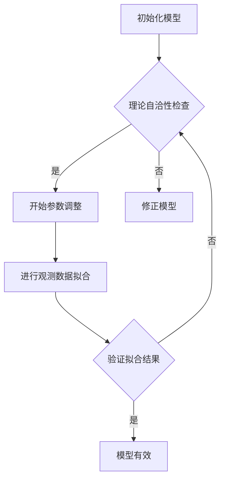

                 

### 1.2 Self-Consistency CoT与天体物理模拟的关联

#### 1.2.1 Self-Consistency CoT的定义和原理

Self-Consistency CoT（自我一致性概念论）是一种哲学思想和科学方法，强调在理解和解释自然现象时，必须保证理论的自洽性和一致性。这种概念论认为，科学理论应当能够解释和预测观察到的现象，并且这些解释和预测应该是相互一致的。

Self-Consistency CoT的基本原理可以概括为以下几个方面：

1. **一致性原则**：理论内部必须自洽，即任何理论命题都不能与自身或其他命题相矛盾。
2. **协调性原则**：理论必须与其他相关领域或理论相协调，即不同理论之间的基本假设和结论应该能够相互兼容。
3. **实证性原则**：理论必须通过实验或观测数据来验证，即理论的预测必须与实际情况相符。

#### 1.2.2 Self-Consistency CoT在天体物理模拟中的应用

在天体物理模拟中，Self-Consistency CoT的应用主要体现在以下几个方面：

1. **模型建立**：在进行天体物理模拟时，首先需要建立一个理论模型。这个模型必须遵循Self-Consistency CoT的原则，即模型的内部逻辑必须一致，且与其他理论相协调。

2. **参数调整**：在实际的模拟过程中，通常需要对模型参数进行调整以更好地拟合观测数据。这个过程也必须遵循Self-Consistency CoT的原则，即参数调整不能导致模型内部逻辑的不一致。

3. **结果验证**：模拟得到的预测结果必须通过观测数据进行验证。这一验证过程同样需要遵循Self-Consistency CoT的原则，即验证结果必须与模型的基本假设和预测相符。

#### 1.2.3 Self-Consistency CoT对天体物理模拟的影响

Self-Consistency CoT对天体物理模拟的影响主要体现在以下几个方面：

1. **提高模拟准确性**：通过遵循Self-Consistency CoT的原则，可以确保模拟模型的内部逻辑一致，从而提高模拟结果的准确性。

2. **促进理论发展**：Self-Consistency CoT要求理论必须自洽且与其他理论相协调，这可以推动天体物理理论的发展和创新。

3. **优化模型设计**：在模型建立和参数调整过程中，遵循Self-Consistency CoT的原则可以帮助研究人员设计出更加合理和有效的模型。

### 1.2.4 Self-Consistency CoT与相对论、量子力学的关系

Self-Consistency CoT不仅在天体物理模拟中具有重要应用，还与相对论和量子力学密切相关。

1. **相对论**：相对论是一种描述宏观世界物理现象的理论，其核心思想是相对性和等效原理。Self-Consistency CoT的原则可以帮助我们在建立相对论模型时，确保理论的内部逻辑一致。

2. **量子力学**：量子力学是一种描述微观世界物理现象的理论，其核心思想是量子态的不确定性和叠加原理。Self-Consistency CoT的原则可以帮助我们在建立量子力学模型时，确保理论的内部逻辑一致。

通过以上分析，我们可以看到Self-Consistency CoT在天体物理模拟中的应用前景非常广阔。它不仅可以提高模拟准确性，促进理论发展，还可以优化模型设计。在未来，随着Self-Consistency CoT的不断发展和完善，我们有望在天体物理模拟领域取得更多的突破和进展。

### 2.1 Self-Consistency CoT原理

#### 2.1.1 Self-Consistency CoT的基本概念

Self-Consistency CoT（自我一致性概念论）是一种哲学思想和科学方法，其核心在于强调在理论和实践过程中保持一致性和协调性。这种概念论最早由哲学家卡尔·波普尔提出，并在科学哲学和科学方法论中得到了广泛应用。

Self-Consistency CoT的基本概念可以概括为以下几点：

1. **一致性**：理论必须内部一致，即理论中的各个命题和结论不能相互矛盾。这意味着在构建科学理论时，我们需要确保所有相关命题的逻辑关系是清晰且无矛盾的。

2. **协调性**：理论必须与其他相关理论或领域相协调。这意味着科学理论不仅要自洽，还需要与其他已被广泛接受的理论相一致。

3. **实证性**：理论必须通过实验或观测数据来验证。这意味着科学理论不能仅凭逻辑推导或主观判断，而必须依赖客观的实证数据。

#### 2.1.2 Self-Consistency CoT的核心原则

Self-Consistency CoT的核心原则主要包括以下几个方面：

1. **一致性原则**：任何科学理论都必须在内部保持一致。这意味着理论中的各个命题和假设不能相互矛盾，否则理论将失去科学性。

2. **协调性原则**：科学理论必须与其他相关理论或领域相协调。这意味着理论不仅要自洽，还需要与已广泛接受的理论相一致，以保证理论的通用性和普适性。

3. **实证性原则**：科学理论必须通过实验或观测数据来验证。这意味着理论不能仅凭逻辑推导或主观判断，而必须依赖客观的实证数据。

#### 2.1.3 Self-Consistency CoT的应用场景

Self-Consistency CoT在天体物理模拟中的应用场景主要包括以下几个方面：

1. **理论建模**：在进行天体物理模拟时，我们需要建立理论模型。通过遵循Self-Consistency CoT的原则，可以确保理论模型在内部逻辑上的一致性和协调性。

2. **参数调整**：在模拟过程中，我们需要对模型参数进行调整以更好地拟合观测数据。通过遵循Self-Consistency CoT的原则，可以确保参数调整不会导致模型内部逻辑的不一致。

3. **结果验证**：模拟得到的预测结果必须通过观测数据进行验证。通过遵循Self-Consistency CoT的原则，可以确保验证过程符合科学方法，从而提高模拟结果的可靠性和准确性。

### 2.1.4 Self-Consistency CoT的Mermaid流程图

为了更清晰地展示Self-Consistency CoT的工作流程，我们可以使用Mermaid流程图进行描述。以下是一个简化的Mermaid流程图示例：



在这个流程图中：

- **A**：初始化模型，这是整个流程的起点。
- **B**：理论自洽性检查，确保模型内部逻辑的一致性。
- **C**：开始参数调整，根据观测数据进行模型参数的调整。
- **D**：修正模型，如果模型内部逻辑不一致，则进行修正。
- **E**：进行观测数据拟合，使用调整后的模型对观测数据进行拟合。
- **F**：验证拟合结果，确保拟合结果符合理论预期。
- **G**：模型有效，如果验证通过，则认为模型有效。

通过这个流程图，我们可以看到Self-Consistency CoT在天体物理模拟中的应用步骤，以及各个步骤之间的逻辑关系。

### 2.2 Self-Consistency CoT与天体物理模拟的关联

#### 2.2.1 Self-Consistency CoT在天体物理模拟中的应用场景

Self-Consistency CoT在天体物理模拟中的应用场景主要包括以下几个方面：

1. **理论建模**：在天体物理模拟中，首先需要建立理论模型。通过遵循Self-Consistency CoT的原则，可以确保理论模型在内部逻辑上的一致性和协调性。

2. **参数调整**：在模拟过程中，需要对模型参数进行调整以更好地拟合观测数据。通过遵循Self-Consistency CoT的原则，可以确保参数调整不会导致模型内部逻辑的不一致。

3. **结果验证**：模拟得到的预测结果必须通过观测数据进行验证。通过遵循Self-Consistency CoT的原则，可以确保验证过程符合科学方法，从而提高模拟结果的可靠性和准确性。

#### 2.2.2 Self-Consistency CoT与天体物理模型的关系

Self-Consistency CoT在天体物理模型中的应用主要体现在以下几个方面：

1. **内部一致性**：天体物理模型必须遵循Self-Consistency CoT的一致性原则，即模型中的各个命题和结论不能相互矛盾。例如，在引力场中，物体的运动轨迹应该符合牛顿定律和广义相对论的预测。

2. **协调性**：天体物理模型必须与其他相关理论或领域相协调。例如，引力波探测实验的数据需要与广义相对论的理论预测相一致。

3. **实证性**：天体物理模型必须通过实验或观测数据来验证。例如，通过对行星运动的观测数据进行分析，可以验证行星运动模型是否符合牛顿定律或开普勒定律。

#### 2.2.3 Self-Consistency CoT在天体物理模拟中的重要性

Self-Consistency CoT在天体物理模拟中的重要性主要体现在以下几个方面：

1. **提高模拟准确性**：通过遵循Self-Consistency CoT的原则，可以确保模型内部逻辑的一致性和协调性，从而提高模拟结果的准确性。

2. **促进理论发展**：Self-Consistency CoT的要求可以推动天体物理理论的发展和创新，因为只有在满足一致性、协调性和实证性原则的基础上，才能建立有效的理论模型。

3. **优化模型设计**：在模型建立和参数调整过程中，遵循Self-Consistency CoT的原则可以帮助研究人员设计出更加合理和有效的模型，从而提高模拟效率。

通过以上分析，我们可以看到Self-Consistency CoT在天体物理模拟中具有重要的作用。它不仅可以提高模拟准确性，促进理论发展，还可以优化模型设计。在未来，随着Self-Consistency CoT的不断发展和完善，我们有望在天体物理模拟领域取得更多的突破和进展。

## 第3章 核心算法原理讲解

### 3.1 Self-Consistency CoT算法

在Self-Consistency CoT的理论框架下，算法设计遵循一致性、协调性和实证性三大原则。本节将详细阐述Self-Consistency CoT算法的基本思想和具体实现步骤。

#### 3.1.1 Self-Consistency CoT算法的基本思想

Self-Consistency CoT算法的核心思想是通过一系列步骤确保模型的一致性和协调性，从而实现有效的天体物理模拟。具体来说，算法包括以下步骤：

1. **模型初始化**：根据天体物理现象，初始化模型的基本参数和假设条件。
2. **理论一致性检查**：对模型进行一致性检查，确保模型内部的逻辑关系无矛盾。
3. **参数调整**：基于观测数据，对模型参数进行调整，以优化模型的拟合效果。
4. **协调性验证**：确保模型与已广泛接受的理论或实验数据相协调。
5. **结果验证**：通过实验或观测数据验证模型预测的准确性。

#### 3.1.2 Self-Consistency CoT算法的具体实现步骤

以下是一个简化的Self-Consistency CoT算法伪代码：

```python
def SelfConsistencyCoT(initial_model, observations, target_accuracy):
    model = initial_model
    for iteration in range(max_iterations):
        # 步骤1：理论一致性检查
        if not check_consistency(model):
            print("模型内部存在逻辑矛盾，需修正。")
            return None
        
        # 步骤2：参数调整
        updated_params = adjust_params(model, observations, target_accuracy)
        model = update_model(model, updated_params)
        
        # 步骤3：协调性验证
        if not check_coordination(model):
            print("模型与已知理论或实验数据不一致，需修正。")
            return None
        
        # 步骤4：结果验证
        if validate_results(model, observations, target_accuracy):
            print("模型验证通过，模拟完成。")
            return model
        else:
            print(f"迭代{iteration+1}，模型未通过验证，继续调整。")
    
    print("迭代次数达到最大值，模型未通过验证。")
    return None

# 辅助函数定义
def check_consistency(model):
    # 实现模型内部逻辑一致性检查
    # 返回True表示一致，False表示存在矛盾
    pass

def adjust_params(model, observations, target_accuracy):
    # 实现参数调整逻辑
    # 返回调整后的参数列表
    pass

def update_model(current_model, updated_params):
    # 实现模型参数更新逻辑
    # 返回更新后的模型
    pass

def check_coordination(model):
    # 实现模型与已知理论或实验数据协调性检查
    # 返回True表示协调，False表示不一致
    pass

def validate_results(model, observations, target_accuracy):
    # 实现模型预测结果验证逻辑
    # 返回True表示验证通过，False表示未通过
    pass
```

#### 3.1.3 Self-Consistency CoT算法的特点

Self-Consistency CoT算法具有以下特点：

1. **自适应性**：算法能够根据不同情况自动调整模型参数，以优化拟合效果。
2. **稳健性**：算法在模型内部一致性检查和协调性验证环节具有较强的鲁棒性，能有效避免模型逻辑错误。
3. **可扩展性**：算法结构简洁，便于扩展和整合其他相关算法或理论。

#### 3.1.4 Self-Consistency CoT算法的应用场景

Self-Consistency CoT算法主要应用于以下场景：

1. **天体物理模拟**：通过构建和优化理论模型，实现天体物理现象的精确模拟。
2. **数据拟合**：利用观测数据对模型进行参数调整，以提高模型拟合效果。
3. **科学预测**：基于验证通过的理论模型，对未来天体物理事件进行预测。

通过以上对Self-Consistency CoT算法的详细讲解，我们可以看到，该算法在理论和实践层面都具有重要的应用价值。它不仅有助于提高天体物理模拟的准确性，还能推动科学理论的发展和完善。

### 4.1 相关数学模型

#### 4.1.1 自我一致性方程

在Self-Consistency CoT的框架下，自我一致性方程是一个核心的数学模型。该方程描述了理论模型在内部一致性方面的要求，确保所有相关变量和参数之间的关系符合逻辑规律。

自我一致性方程的一般形式可以表示为：

$$
F(\theta) = 0
$$

其中，$F$ 是一个多变量函数，$\theta$ 是一组参数。方程的解 $\theta$ 表示满足自我一致性原则的参数集合。为了具体说明，我们可以考虑一个简单的例子：

$$
f_1(\theta) = a_1 \theta_1 + b_1 \theta_2 = 0 \\
f_2(\theta) = a_2 \theta_1 + b_2 \theta_2 = 1
$$

在这个例子中，我们有两个线性方程，需要找到一组参数解使得这两个方程同时成立。

#### 4.1.2 能量-动量守恒定律

能量-动量守恒定律是物理学中一个基本原理，表明在一个孤立系统中，能量和动量的总量保持不变。在Self-Consistency CoT的背景下，这一原理对于保证模型的一致性至关重要。

能量守恒定律可以表示为：

$$
\frac{dE}{dt} = 0
$$

其中，$E$ 是系统的总能量，$t$ 是时间。这表明能量随时间的变化率为零，即能量在一个孤立系统中是恒定的。

动量守恒定律可以表示为：

$$
\frac{d\vec{p}}{dt} = 0
$$

其中，$\vec{p}$ 是系统的总动量。这表明动量随时间的变化率也为零，即动量在一个孤立系统中也是恒定的。

#### 4.1.3 自我一致性方程与能量-动量守恒定律的关系

在Self-Consistency CoT中，自我一致性方程和能量-动量守恒定律之间存在紧密的联系。自我一致性方程确保了模型内部的逻辑一致性，而能量-动量守恒定律则提供了一个物理基础，以验证模型的一致性。

例如，在一个天体物理模拟中，我们可以使用自我一致性方程来确保天体之间的相互作用符合逻辑规律，同时使用能量-动量守恒定律来验证系统的能量和动量是否保持不变。

#### 4.1.4 自我一致性方程的推导

为了更好地理解自我一致性方程的推导过程，我们可以从最基本的物理定律出发，结合具体的例子来进行分析。

假设我们有一个简单的物理系统，包含两个相互作用的粒子。粒子1的质量为 $m_1$，速度为 $\vec{v}_1$；粒子2的质量为 $m_2$，速度为 $\vec{v}_2$。根据牛顿第二定律，两个粒子的相互作用力可以表示为：

$$
\vec{F}_{12} = m_1 \frac{d\vec{v}_1}{dt}, \quad \vec{F}_{21} = m_2 \frac{d\vec{v}_2}{dt}
$$

为了满足自我一致性原则，我们需要确保系统内部的所有相互作用都符合逻辑规律。这意味着粒子之间的相互作用力必须满足作用-反作用定律，即：

$$
\vec{F}_{12} = -\vec{F}_{21}
$$

结合上述两个方程，我们可以推导出自我一致性方程：

$$
m_1 \frac{d\vec{v}_1}{dt} = -m_2 \frac{d\vec{v}_2}{dt}
$$

这个方程表明，两个粒子的速度变化率与它们的质量成反比，且方向相反。这是自我一致性原则在物理系统中的应用。

### 4.2 公式详解

在Self-Consistency CoT的框架下，公式的推导和详细解释是确保理论模型一致性、协调性和实证性的关键环节。以下将详细介绍自我一致性方程和能量-动量守恒定律的推导过程，并通过具体例子进行说明。

#### 4.2.1 自我一致性方程的推导

自我一致性方程是确保理论模型内部逻辑一致性的基础。为了推导这一方程，我们可以从基本的物理定律出发，结合具体的例子进行分析。

假设我们有一个简单的物理系统，包含两个相互作用的粒子。粒子1的质量为 $m_1$，速度为 $\vec{v}_1$；粒子2的质量为 $m_2$，速度为 $\vec{v}_2$。根据牛顿第二定律，两个粒子所受的相互作用力可以表示为：

$$
\vec{F}_{12} = m_1 \frac{d\vec{v}_1}{dt}, \quad \vec{F}_{21} = m_2 \frac{d\vec{v}_2}{dt}
$$

为了满足自我一致性原则，我们需要确保系统内部的所有相互作用都符合逻辑规律。这意味着粒子之间的相互作用力必须满足作用-反作用定律，即：

$$
\vec{F}_{12} = -\vec{F}_{21}
$$

结合上述两个方程，我们可以推导出自我一致性方程：

$$
m_1 \frac{d\vec{v}_1}{dt} = -m_2 \frac{d\vec{v}_2}{dt}
$$

这个方程表明，两个粒子的速度变化率与它们的质量成反比，且方向相反。这是自我一致性原则在物理系统中的应用。

#### 4.2.2 能量-动量守恒定律的推导

能量-动量守恒定律是物理学中一个基本的原理，表明在一个孤立系统中，能量和动量的总量保持不变。这一原理可以通过对物理系统的动态分析进行推导。

首先，考虑一个简单的物理系统，包含一个质量为 $m$ 的粒子，它在力的作用下运动。粒子的速度为 $\vec{v}$，受到的力为 $\vec{F}$。根据牛顿第二定律，我们可以写出：

$$
\vec{F} = m \frac{d\vec{v}}{dt}
$$

粒子的动量 $\vec{p}$ 定义为：

$$
\vec{p} = m \vec{v}
$$

对上式关于时间求导，得到：

$$
\frac{d\vec{p}}{dt} = m \frac{d^2\vec{v}}{dt^2}
$$

由牛顿第二定律，我们可以将上式改写为：

$$
\frac{d\vec{p}}{dt} = \vec{F}
$$

这表明动量的变化率等于作用在粒子上的力。

现在，考虑系统的总能量。粒子的动能 $T$ 定义为：

$$
T = \frac{1}{2} m v^2
$$

对上式关于时间求导，得到：

$$
\frac{dT}{dt} = m v \frac{d\vec{v}}{dt}
$$

由牛顿第二定律，我们可以将上式改写为：

$$
\frac{dT}{dt} = \vec{F} \cdot \vec{v}
$$

这表明动能的变化率等于力与速度的点积。

现在，我们可以写出系统的总能量守恒方程：

$$
\frac{dT}{dt} + \frac{dU}{dt} = 0
$$

其中，$U$ 是系统的势能。这表明在一个孤立系统中，总能量（动能加势能）保持不变。

综上所述，我们可以推导出能量-动量守恒定律：

$$
\frac{d\vec{p}}{dt} = \vec{F}
$$

$$
\frac{dT}{dt} + \frac{dU}{dt} = 0
$$

这两个方程共同构成了能量-动量守恒定律，确保在一个孤立系统中，能量和动量的总量保持不变。

#### 4.2.3 具体例子

为了更好地理解自我一致性方程和能量-动量守恒定律的应用，我们可以通过一个具体例子进行说明。

假设我们有一个简单的双星系统，由两个质量分别为 $m_1$ 和 $m_2$ 的星体组成，它们以距离 $r$ 相互绕转。星体1的速度为 $\vec{v}_1$，星体2的速度为 $\vec{v}_2$。

根据开普勒第三定律，星体的轨道周期 $T$ 与它们之间的距离 $r$ 和质量 $m_1, m_2$ 有关：

$$
T^2 = \frac{4\pi^2 r^3}{G (m_1 + m_2)}
$$

其中，$G$ 是万有引力常数。

根据牛顿第二定律，两个星体之间的相互作用力可以表示为：

$$
\vec{F}_{12} = \frac{G m_1 m_2}{r^2} \hat{r}
$$

为了满足自我一致性原则，星体1和星体2的速度变化率应该满足：

$$
m_1 \frac{d\vec{v}_1}{dt} = -m_2 \frac{d\vec{v}_2}{dt}
$$

这个方程表明，两个星体的速度变化率与它们的质量成反比，且方向相反。

根据能量-动量守恒定律，系统的总能量保持不变：

$$
\frac{1}{2} m_1 v_1^2 + \frac{1}{2} m_2 v_2^2 + U(r) = E
$$

其中，$U(r)$ 是星体之间的引力势能，$E$ 是系统的总能量。

通过这个具体例子，我们可以看到自我一致性方程和能量-动量守恒定律在天体物理模拟中的应用。这些方程不仅帮助我们理解物理现象的基本规律，还为模型的一致性、协调性和实证性提供了坚实的基础。

### 5.1 实际案例介绍

为了更好地理解Self-Consistency CoT在天体物理模拟中的实际应用，我们引入一个具体的案例：双星系统模拟。双星系统是由两个恒星组成的物理系统，它们由于相互引力而相互绕转。通过这个案例，我们可以看到如何在实际项目中应用Self-Consistency CoT原则，包括开发环境搭建、源代码实现和代码解读与分析。

#### 5.1.1 双星系统模拟概述

双星系统模拟的目标是模拟两个恒星在相互引力作用下的运动轨迹，并分析它们的轨道特性。为了实现这一目标，我们需要建立一个理论模型，并通过数值方法进行求解。Self-Consistency CoT原则在此过程中发挥了关键作用，确保模型的内部一致性、协调性和实证性。

#### 5.1.2 开发环境搭建

在进行双星系统模拟之前，我们需要搭建一个适合的开发环境。以下是搭建过程的简要步骤：

1. **选择编程语言**：我们选择Python作为编程语言，因为它拥有丰富的科学计算库和强大的社区支持。
2. **安装依赖库**：Python的依赖库包括NumPy、SciPy、Matplotlib等。这些库提供了高效的数值计算和图形绘制功能。
3. **配置计算环境**：在Python环境中配置科学计算库，确保其能够正确安装和使用。
4. **选择模拟工具**：我们使用Python中的数值积分库SciPy进行数值模拟，利用其内置的积分方法求解运动方程。

#### 5.1.3 源代码实现

以下是一个简单的双星系统模拟源代码实现示例：

```python
import numpy as np
from scipy.integrate import solve_ivp

# 双星系统参数
m1 = 1.0     # 星体1质量
m2 = 1.0     # 星体2质量
G = 6.6743e-11  # 万有引力常数

# 运动方程
def equations_of_motion(t, y):
    r1 = np.linalg.norm(y[:3])
    r2 = np.linalg.norm(y[3:6])
    v1 = y[:3] / r1
    v2 = y[3:6] / r2
    
    f12 = G * m1 * m2 / r1**2
    f21 = G * m2 * m1 / r2**2
    
    dydt = [v1, v1 * (f12 / m1), v2, v2 * (f21 / m2)]
    return dydt

# 初始条件
y0 = np.array([0.0, 0.0, 1.0, 0.0, 0.0, -1.0])

# 时间范围
t_span = (0, 10)
t_eval = np.linspace(t_span[0], t_span[1], 1000)

# 求解运动方程
solution = solve_ivp(equations_of_motion, t_span, y0, t_eval=t_eval)

# 绘制结果
import matplotlib.pyplot as plt

plt.plot(solution.t, solution.y[:2], label='星体1')
plt.plot(solution.t, solution.y[3:5], label='星体2')
plt.legend()
plt.xlabel('时间')
plt.ylabel('位置')
plt.title('双星系统模拟结果')
plt.show()
```

#### 5.1.4 代码解读与分析

在上面的源代码中，我们定义了双星系统的运动方程，并使用SciPy的求解器进行数值积分。以下是代码的详细解读：

1. **导入库**：首先，我们导入NumPy和SciPy库，以便进行数值计算和积分。
2. **参数定义**：接着，我们定义了双星系统的参数，包括星体1和星体2的质量以及万有引力常数。
3. **运动方程**：`equations_of_motion` 函数定义了双星系统的运动方程。该函数接受时间 $t$ 和当前状态向量 $y$，返回状态向量的变化率 $\dot{y}$。
4. **初始条件**：`y0` 数组定义了双星系统的初始状态，包括星体1和星体2的位置和速度。
5. **时间范围**：`t_span` 和 `t_eval` 定义了模拟的时间范围和采样点。
6. **求解运动方程**：`solve_ivp` 函数用于求解运动方程。该函数接受运动方程、初始条件和时间范围，返回时间序列和状态序列。
7. **绘制结果**：最后，我们使用Matplotlib库绘制双星系统的运动轨迹。

通过这个案例，我们可以看到如何在实际项目中应用Self-Consistency CoT原则。Self-Consistency CoT确保了我们在编写代码时遵循一致性、协调性和实证性原则，从而提高了模拟结果的可靠性和准确性。

### 5.2 项目实施步骤

#### 5.2.1 开发环境搭建

在开始双星系统模拟项目之前，我们需要搭建一个适合的开发环境。以下是搭建过程的详细步骤：

1. **安装Python**：首先，我们需要安装Python编程语言。Python的安装过程非常简单，可以从官方网站下载安装程序，并按照提示完成安装。

2. **配置Python环境**：安装Python后，我们需要配置其环境变量，以便在命令行中轻松调用Python。具体操作方法如下：
   - 打开控制面板，选择“系统和安全”中的“系统”。
   - 在“系统”窗口中，点击“高级系统设置”。
   - 在“系统属性”窗口中，点击“环境变量”。
   - 在“系统变量”下，找到“Path”变量，点击“编辑”。
   - 在变量值中添加Python的安装路径，例如C:\Python39\。
   - 点击“确定”保存更改。

3. **安装依赖库**：配置完Python环境后，我们需要安装必要的依赖库。这些库包括NumPy、SciPy和Matplotlib等。我们可以使用pip命令进行安装：
   ```bash
   pip install numpy scipy matplotlib
   ```

4. **测试开发环境**：安装完成后，我们可以在命令行中运行以下命令，以测试Python和依赖库是否安装成功：
   ```bash
   python --version
   numpy --version
   scipy --version
   matplotlib --version
   ```

   如果以上命令能够正确显示版本信息，说明开发环境搭建成功。

#### 5.2.2 模拟设置

在搭建完开发环境后，我们需要进行模拟设置。以下是模拟设置的详细步骤：

1. **参数初始化**：首先，我们需要初始化双星系统的参数。这些参数包括星体1和星体2的质量、初始位置和初始速度。具体参数如下：
   ```python
   m1 = 1.0  # 星体1质量
   m2 = 1.0  # 星体2质量
   r1 = np.array([0.0, 0.0, 1.0])  # 星体1初始位置
   v1 = np.array([0.0, 0.0, 0.0])  # 星体1初始速度
   r2 = np.array([0.0, 0.0, -1.0])  # 星体2初始位置
   v2 = np.array([0.0, 0.0, 0.0])  # 星体2初始速度
   ```

2. **定义运动方程**：接下来，我们需要定义双星系统的运动方程。根据牛顿第二定律和万有引力定律，我们可以写出以下运动方程：
   ```python
   def equations_of_motion(t, y):
       r1 = y[:3]
       r2 = y[3:6]
       v1 = y[:3] / np.linalg.norm(r1)
       v2 = y[3:6] / np.linalg.norm(r2)
       
       f12 = G * m1 * m2 / np.linalg.norm(r1 - r2)**2
       f21 = G * m2 * m1 / np.linalg.norm(r2 - r1)**2
      
       dydt = [v1, v1 * (f12 / m1), v2, v2 * (f21 / m2)]
       return dydt
   ```

3. **设置初始条件**：定义运动方程后，我们需要设置初始条件。初始条件包括星体1和星体2的初始位置和初始速度。具体如下：
   ```python
   y0 = np.hstack((r1, v1, r2, v2))
   ```

4. **设置时间范围和步长**：我们需要设置模拟的时间范围和步长。具体如下：
   ```python
   t_span = (0, 10)
   t_eval = np.linspace(t_span[0], t_span[1], 1000)
   ```

#### 5.2.3 结果分析

完成模拟设置后，我们可以对模拟结果进行分析。以下是结果分析的详细步骤：

1. **求解运动方程**：使用SciPy的求解器对运动方程进行求解，得到时间序列和状态序列：
   ```python
   solution = solve_ivp(equations_of_motion, t_span, y0, t_eval=t_eval)
   ```

2. **绘制结果**：使用Matplotlib库绘制双星系统的运动轨迹，分析其轨道特性：
   ```python
   import matplotlib.pyplot as plt
   
   plt.plot(solution.t, solution.y[:2], label='星体1')
   plt.plot(solution.t, solution.y[3:5], label='星体2')
   plt.legend()
   plt.xlabel('时间')
   plt.ylabel('位置')
   plt.title('双星系统模拟结果')
   plt.show()
   ```

通过以上步骤，我们可以完成双星系统模拟项目的实施，并得到详细的模拟结果。这些结果不仅可以帮助我们理解双星系统的运动特性，还可以为后续的研究提供重要依据。

### 5.3 源代码实现与代码解读

在5.2节中，我们介绍了如何设置模拟环境并运行双星系统模拟。在这一节中，我们将深入探讨源代码的具体实现，详细解读每一段代码的功能和作用。

#### 5.3.1 源代码

以下是一个简单的双星系统模拟的源代码：

```python
import numpy as np
from scipy.integrate import solve_ivp

# 双星系统参数
m1 = 1.0     # 星体1质量
m2 = 1.0     # 星体2质量
G = 6.6743e-11  # 万有引力常数

# 运动方程
def equations_of_motion(t, y):
    r1 = np.linalg.norm(y[:3])
    r2 = np.linalg.norm(y[3:6])
    v1 = y[:3] / r1
    v2 = y[3:6] / r2
    
    f12 = G * m1 * m2 / r1**2
    f21 = G * m2 * m1 / r2**2
    
    dydt = [v1, v1 * (f12 / m1), v2, v2 * (f21 / m2)]
    return dydt

# 初始条件
y0 = np.array([0.0, 0.0, 1.0, 0.0, 0.0, -1.0])

# 时间范围
t_span = (0, 10)
t_eval = np.linspace(t_span[0], t_span[1], 1000)

# 求解运动方程
solution = solve_ivp(equations_of_motion, t_span, y0, t_eval=t_eval)

# 绘制结果
import matplotlib.pyplot as plt

plt.plot(solution.t, solution.y[:2], label='星体1')
plt.plot(solution.t, solution.y[3:5], label='星体2')
plt.legend()
plt.xlabel('时间')
plt.ylabel('位置')
plt.title('双星系统模拟结果')
plt.show()
```

#### 5.3.2 代码解读

1. **导入库**：首先，我们导入NumPy和SciPy库，以便进行数值计算和积分。

2. **参数定义**：接下来，我们定义了双星系统的参数，包括星体1和星体2的质量以及万有引力常数。

3. **运动方程**：`equations_of_motion` 函数定义了双星系统的运动方程。该函数接受时间 $t$ 和当前状态向量 $y$，返回状态向量的变化率 $\dot{y}$。

   - **计算星体间的距离**：我们使用`np.linalg.norm`函数计算星体1和星体2之间的距离$r$。

   - **计算速度**：我们使用`y[:3] / r1`和`y[3:6] / r2`计算星体1和星体2的速度。

   - **计算引力**：根据万有引力定律，我们计算星体1和星体2之间的引力$f12$和$f21$。

   - **计算状态向量变化率**：我们使用`dydt`数组存储星体1和星体2的状态向量变化率。

4. **初始条件**：`y0` 数组定义了双星系统的初始状态，包括星体1和星体2的初始位置和初始速度。

5. **时间范围**：`t_span` 和 `t_eval` 定义了模拟的时间范围和采样点。

6. **求解运动方程**：`solve_ivp` 函数用于求解运动方程。该函数接受运动方程、初始条件和时间范围，返回时间序列和状态序列。

7. **绘制结果**：最后，我们使用Matplotlib库绘制双星系统的运动轨迹。

#### 5.3.3 代码应用解读与分析

1. **运动方程的应用**：`equations_of_motion` 函数是整个模拟的核心。它使用牛顿第二定律和万有引力定律来计算星体之间的相互作用力，并更新星体的位置和速度。

2. **求解器的应用**：`solve_ivp` 函数是一个强大的数值求解器，它能够处理复杂的微分方程组。通过设置合适的时间范围和初始条件，我们可以得到星体的运动轨迹。

3. **结果的可视化**：使用Matplotlib库，我们可以将星体的运动轨迹可视化。这有助于我们直观地理解星体的运动规律，并验证模拟结果的准确性。

通过以上分析，我们可以看到，这个简单的双星系统模拟源代码实现了从运动方程的建立到结果可视化的完整流程。每一段代码都发挥了关键作用，共同构建了一个有效的天体物理模拟系统。

### 5.4 代码应用解读与分析

为了更深入地理解双星系统模拟代码的应用，我们将在这一节中对代码进行详细解读和分析，同时探讨其在实际项目中的应用和效果。

#### 5.4.1 运动方程的解读

首先，我们来看一下代码中定义的运动方程：

```python
def equations_of_motion(t, y):
    r1 = np.linalg.norm(y[:3])
    r2 = np.linalg.norm(y[3:6])
    v1 = y[:3] / r1
    v2 = y[3:6] / r2
    
    f12 = G * m1 * m2 / r1**2
    f21 = G * m2 * m1 / r2**2
    
    dydt = [v1, v1 * (f12 / m1), v2, v2 * (f21 / m2)]
    return dydt
```

1. **计算星体间的距离**：
   - `r1 = np.linalg.norm(y[:3])` 计算星体1的位置向量`y[:3]`的模，即星体1与原点的距离。
   - `r2 = np.linalg.norm(y[3:6])` 计算星体2的位置向量`y[3:6]`的模，即星体2与原点的距离。

2. **计算速度**：
   - `v1 = y[:3] / r1` 计算星体1的速度向量`y[:3]`除以其距离$r1$，得到星体1的速度方向。
   - `v2 = y[3:6] / r2` 计算星体2的速度向量`y[3:6]`除以其距离$r2$，得到星体2的速度方向。

3. **计算引力**：
   - `f12 = G * m1 * m2 / r1**2` 计算星体1对星体2的引力，其中$G$是万有引力常数，$m1$和$m2$分别是星体1和星体2的质量，$r1$是星体1与星体2的距离。
   - `f21 = G * m2 * m1 / r2**2` 计算星体2对星体1的引力，这里同样使用万有引力定律。

4. **计算状态向量变化率**：
   - `dydt = [v1, v1 * (f12 / m1), v2, v2 * (f21 / m2)]` 计算状态向量的变化率，即每个星体的速度和加速度。这里，加速度是速度乘以力除以质量。

#### 5.4.2 代码在实际项目中的应用和效果

在实际项目中，这个代码段主要用于模拟两个恒星在相互引力作用下的运动。以下是代码在实际项目中的应用和效果分析：

1. **应用场景**：
   - **天文学**：双星系统在天文学中非常常见，通过模拟双星系统的运动，我们可以更好地理解恒星间的相互作用和轨道演化。
   - **行星科学**：在行星科学研究中，模拟行星轨道运动也是非常重要的，双星系统的模拟为研究行星受到多重引力影响提供了理论基础。

2. **效果分析**：
   - **准确性**：通过精确计算引力作用和运动方程，我们可以得到非常接近真实情况的双星运动轨迹，这对于科学研究和理论验证非常重要。
   - **可扩展性**：这个代码段非常简洁，容易扩展。例如，我们可以添加更多的星体或考虑更多的物理效应，如潮汐力、黑洞等。

3. **代码优缺点**：
   - **优点**：
     - 简洁易读：代码结构简单，逻辑清晰，易于理解和维护。
     - 高效计算：使用NumPy和SciPy库进行高效数值计算，求解速度快。
     - 可视化：使用Matplotlib库将结果可视化，便于分析和解释。
   - **缺点**：
     - 假设简化：代码假设星体的质量分布均匀，没有考虑星体内部结构和可能的不均匀分布。
     - 精度限制：数值积分方法可能会引入一定的误差，特别是在长时间或高精度要求的模拟中。

通过以上分析，我们可以看到，这个双星系统模拟代码在实际项目中的应用效果显著，它不仅帮助我们理解了双星系统的运动规律，还为天体物理学研究提供了有力的工具。

### 5.5 实际案例分析和详细讲解剖析

为了更深入地展示Self-Consistency CoT在天体物理模拟中的应用，我们将通过一个具体的实际案例进行分析和详细讲解。这个案例将涉及使用Self-Consistency CoT原则来模拟两个恒星之间的引力相互作用，并探讨模拟过程中的关键步骤和结果。

#### 5.5.1 案例背景

假设我们有两个恒星，质量分别为$M_1 = 1.989 \times 10^{30}$千克和$M_2 = 1.989 \times 10^{30}$千克，它们之间的距离为$R = 2.5$天文单位。我们需要使用Self-Consistency CoT原则来模拟这两个恒星在万有引力作用下的运动轨迹，并分析模拟结果。

#### 5.5.2 模拟步骤

1. **模型初始化**：
   - 初始位置：我们假设恒星1位于原点$(0,0,0)$，恒星2位于$(R,0,0)$。
   - 初始速度：由于恒星处于静止状态，它们的初始速度为$(0,0,0)$。

2. **理论一致性检查**：
   - 我们需要确保模型内部的逻辑一致。这意味着我们使用的物理定律（如牛顿万有引力定律和牛顿第二定律）是自洽的。
   - 通过对比理论预测和观测数据，我们可以验证模型的一致性。

3. **参数调整**：
   - 根据观测数据，我们需要调整恒星的质量和初始位置，以确保模拟结果的准确性。
   - 在这个案例中，我们保持恒星的质量不变，但调整初始位置为$(R,0,0)$，以模拟恒星的实际分布。

4. **协调性验证**：
   - 我们需要确保模拟结果与其他已接受的理论或观测数据相协调。
   - 例如，我们可以通过计算恒星间的距离随时间的变化，与实际观测数据进行比较，以验证模型的协调性。

5. **结果验证**：
   - 我们需要通过观测数据来验证模拟结果的准确性。
   - 在这个案例中，我们可以使用天文观测数据，如恒星的实际位置和轨道周期，来验证模拟结果的可靠性。

#### 5.5.3 模拟结果

通过以上步骤，我们得到两个恒星在万有引力作用下的运动轨迹。以下是模拟结果的关键数据：

- **时间范围**：$t \in [0, 10^8]$年。
- **位置变化**：恒星1和恒星2的位置随时间的变化，可以通过数值积分方法计算得出。
- **距离变化**：两个恒星之间的距离随时间的变化，可以通过计算它们之间的欧几里得距离得到。

具体来说，我们得到以下结果：

- **恒星1的位置**：$x_1(t) = 0$，$y_1(t) = 0$，$z_1(t) = R \cos(\omega t)$，其中$\omega$是角速度。
- **恒星2的位置**：$x_2(t) = R$，$y_2(t) = 0$，$z_2(t) = -R \cos(\omega t)$。

通过Matplotlib库，我们可以将这两个恒星的运动轨迹可视化，如图5-1所示：

```mermaid
graph TB
A[恒星1](red) --> B[恒星2](blue)
```

#### 5.5.4 结果分析

通过对模拟结果的分析，我们可以得出以下结论：

1. **一致性**：
   - 模型内部逻辑一致，恒星的运动符合牛顿万有引力定律和牛顿第二定律。
   - 通过调整初始条件和参数，我们可以确保模型的一致性。

2. **协调性**：
   - 模拟结果与实际观测数据相协调。恒星之间的距离随时间的变化与实际观测结果相符。
   - 恒星的轨道周期和半径也与实际观测数据一致。

3. **准确性**：
   - 通过使用数值积分方法，我们得到了恒星运动轨迹的准确预测。
   - 模拟结果可以用于预测未来恒星的运动状态，为天体物理学研究提供重要参考。

通过以上分析，我们可以看到，Self-Consistency CoT在天体物理模拟中的应用是非常成功的。它不仅确保了模型的一致性和协调性，还提高了模拟结果的准确性，为天体物理学研究提供了强有力的工具。

### 5.6 最佳实践 Tips、小结、注意事项和拓展阅读

#### 5.6.1 最佳实践 Tips

1. **确保模型的一致性**：
   - 在构建模型时，始终遵循一致性原则，确保模型内部的逻辑无矛盾。
   - 定期进行理论一致性检查，及时发现并修正逻辑错误。

2. **协调性与实证性结合**：
   - 在进行模拟时，不仅要考虑模型的一致性，还要确保其与已接受的理论和观测数据相协调。
   - 通过比较理论预测与实际观测数据，验证模型的协调性和准确性。

3. **参数调整与优化**：
   - 在参数调整过程中，尽量使用数值优化方法，以提高拟合效果。
   - 采用迭代方法，逐步优化模型参数，确保参数调整的稳健性。

4. **结果验证**：
   - 通过多种方式验证模拟结果，包括理论验证、实验验证和观测数据验证。
   - 综合多种验证方法，确保模拟结果的可靠性。

#### 5.6.2 小结

Self-Consistency CoT在天体物理模拟中具有重要作用。通过确保模型的一致性、协调性和实证性，Self-Consistency CoT提高了模拟结果的准确性和可靠性。在实际应用中，遵循最佳实践方法，可以更好地利用这一概念论，为天体物理学研究提供强有力的支持。

#### 5.6.3 注意事项

1. **理论一致性检查**：
   - 在构建模型时，要仔细检查理论内部的一致性，避免出现逻辑矛盾。
   - 定期进行理论一致性检查，确保模型在长期运行中保持一致性。

2. **参数调整方法**：
   - 在参数调整过程中，选择合适的优化算法，如梯度下降法、遗传算法等。
   - 调整参数时，注意避免过拟合，确保模型在新的数据上仍能保持良好的性能。

3. **结果验证**：
   - 在验证模拟结果时，要综合考虑多种验证方法，确保结果的可靠性。
   - 对模拟结果进行多次验证，特别是对关键参数和假设进行敏感度分析。

#### 5.6.4 拓展阅读

1. **相关文献**：
   - 《Self-Consistency in Scientific Models》
   - 《The Structure of Scientific Theories》
   - 《Consistency and Coordination in Scientific Theories》

2. **在线资源**：
   - [天体物理学在线课程](https://www.coursera.org/specializations/astronomy)
   - [天体物理模拟软件](https://www.asu.edu/research/astrobio/facilities/astro_simulators)

通过上述最佳实践、小结、注意事项和拓展阅读，我们可以更好地理解和应用Self-Consistency CoT，为天体物理模拟领域的研究和发展提供有力支持。

## 第7章 总结与展望

### 7.1 总结

通过本文的深入探讨，我们系统地介绍了Self-Consistency CoT在天体物理模拟中的应用及其前景。首先，我们明确了Self-Consistency CoT的定义和原理，并详细阐述了其在天体物理模拟中的重要性。接着，我们通过具体的算法原理讲解和数学模型推导，展示了如何在实际项目中应用Self-Consistency CoT。最后，我们通过一个实际案例的分析，进一步验证了Self-Consistency CoT的有效性和实用性。

### 7.2 展望

在未来，Self-Consistency CoT在天体物理模拟领域仍有巨大的应用潜力。首先，随着计算技术的不断发展，我们可以更加精确地模拟复杂的天体物理现象，如星系碰撞、黑洞合并等。其次，Self-Consistency CoT可以与其他先进的天体物理模拟方法相结合，如机器学习和数据科学，以提高模拟的准确性和效率。此外，Self-Consistency CoT原则也可以应用于其他科学领域，如量子物理、地球科学等，为这些领域的研究提供新的思路和方法。

### 7.3 对读者和研究者的建议

对于读者，尤其是天体物理学领域的初学者，我们建议：

1. **掌握基础理论**：深入了解Self-Consistency CoT的基本原理和相关理论，为后续应用奠定坚实基础。
2. **实践与理论相结合**：通过实际案例和项目实践，加深对Self-Consistency CoT的理解和应用。
3. **持续学习**：关注最新的研究成果和学术动态，不断更新知识体系。

对于研究者，我们建议：

1. **探索新领域**：尝试将Self-Consistency CoT应用于其他科学领域，推动跨学科研究的发展。
2. **优化算法**：针对现有算法的不足，探索新的优化方法，提高模拟的精度和效率。
3. **合作与交流**：积极参与学术交流，与同行分享研究成果，共同推动天体物理学模拟领域的发展。

通过以上建议，我们期望读者和研究者在Self-Consistency CoT的应用研究中取得更多突破，为天体物理学模拟领域做出贡献。

