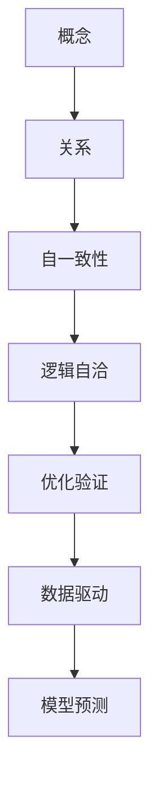

                 


### Step 1: 文章标题

《Self-Consistency CoT在宇宙大尺度结构研究中的应用》

### Step 2: 文章关键词

Self-Consistency CoT、宇宙大尺度结构、数据挖掘、人工智能、天体物理

### Step 3: 文章摘要

本文旨在探讨Self-Consistency CoT（自一致性概念图）在宇宙大尺度结构研究中的应用。Self-Consistency CoT是一种先进的人工智能方法，通过构建概念图来表示宇宙中的各种实体和它们之间的关系，并利用自一致性原则来优化和验证这些概念图。本文首先介绍了Self-Consistency CoT的核心概念和基础理论，然后详细阐述了其在宇宙大尺度结构研究中的应用，包括数据处理与分析、天体物理研究以及星系演化研究。通过实例分析和模型预测，展示了Self-Consistency CoT方法在宇宙大尺度结构研究中的实际应用效果，并对未来的发展方向和挑战进行了展望。

### Step 4: 引言与背景

#### 1.1 宇宙大尺度结构研究的现状与挑战

宇宙大尺度结构是指宇宙中星系、星团、超星系团等大尺度天体分布和演化的结构。在过去的几十年中，随着观测技术的进步，宇宙大尺度结构的研究取得了巨大的进展。然而，仍然存在许多未解之谜和挑战。首先，宇宙大尺度结构的形成和演化机制尚未完全理解，涉及到引力、宇宙膨胀、暗物质、暗能量等复杂因素。其次，宇宙大尺度结构的观测数据量大且复杂，如何有效处理和分析这些数据成为了一个重要问题。

传统的宇宙大尺度结构研究方法主要依赖于统计分析、数值模拟和物理模型。然而，这些方法在处理复杂的数据和建立精确的物理模型时存在一定的局限性。随着人工智能技术的快速发展，特别是在数据挖掘和机器学习领域，人们开始尝试将人工智能方法应用于宇宙大尺度结构研究，以提高研究的效率和精度。

#### 1.2 Self-Consistency CoT 方法概述

Self-Consistency CoT（自一致性概念图）是一种基于人工智能的方法，旨在通过构建概念图来表示宇宙中的各种实体和它们之间的关系，并利用自一致性原则来优化和验证这些概念图。Self-Consistency CoT 方法具有以下几个核心特点：

1. **概念图的构建**：Self-Consistency CoT 方法通过构建概念图来表示宇宙中的各种实体和它们之间的关系。概念图是一种图形化表示方法，可以直观地展示实体之间的复杂关系。

2. **自一致性原则**：Self-Consistency CoT 方法利用自一致性原则来优化和验证概念图。自一致性原则是指概念图中的实体和关系在逻辑上应该是自洽的，即不存在矛盾和冲突。

3. **数据驱动**：Self-Consistency CoT 方法是一种数据驱动的方法，通过分析大量的观测数据来构建和优化概念图。这种方法可以充分利用现有的观测数据，提高研究的准确性和可靠性。

4. **模型预测**：Self-Consistency CoT 方法不仅用于数据的分析和处理，还可以用于模型预测。通过概念图的优化和验证，可以预测宇宙大尺度结构中可能存在的未知现象和规律。

### Step 5: Self-Consistency CoT 基础理论

#### 2.1 Self-Consistency CoT 的核心概念与架构

Self-Consistency CoT 方法包含以下几个核心概念：

1. **概念图**：概念图是一种图形化表示方法，用于表示宇宙中的各种实体和它们之间的关系。在概念图中，每个实体用节点表示，实体之间的关系用边表示。

2. **概念**：概念是指宇宙中的各种实体，可以是星系、星团、超星系团等。每个概念都可以用节点表示。

3. **关系**：关系是指概念之间的关联，可以是引力、相互作用、演化等。每个关系都可以用边表示。

4. **自一致性原则**：自一致性原则是指概念图中的实体和关系在逻辑上应该是自洽的，即不存在矛盾和冲突。

Self-Consistency CoT 的架构包括以下几个部分：

1. **数据输入**：数据输入包括宇宙大尺度结构的观测数据，如星系分布、星系速度、引力场等。

2. **概念图构建**：根据观测数据，构建概念图，包括节点（概念）和边（关系）。

3. **自一致性优化**：利用自一致性原则，对概念图进行优化，以消除逻辑上的矛盾和冲突。

4. **模型验证**：通过模型验证，确保概念图的合理性和可靠性。

#### 2.2 Self-Consistency CoT 的主要算法原理

Self-Consistency CoT 方法的主要算法原理包括以下几个步骤：

1. **数据预处理**：对观测数据进行预处理，包括数据清洗、归一化、特征提取等。

2. **概念图构建**：根据预处理后的数据，构建概念图，包括节点的确定和边的连接。

3. **自一致性优化**：利用自一致性原则，对概念图进行优化，包括消除矛盾和冲突、调整节点和边的权重等。

4. **模型验证**：通过模型验证，确保概念图的合理性和可靠性，包括数据拟合度、模型精度等。

#### 2.3 Self-Consistency CoT 的数学模型与公式

Self-Consistency CoT 方法的数学模型主要包括以下几个部分：

1. **节点权重计算**：节点权重表示概念在概念图中的重要性。节点权重可以通过以下公式计算：

   $$ w_i = \frac{1}{N} \sum_{j=1}^{N} w_j \cdot r_{ij} $$

   其中，$w_i$ 表示节点 $i$ 的权重，$N$ 表示节点总数，$w_j$ 表示节点 $j$ 的权重，$r_{ij}$ 表示节点 $i$ 和节点 $j$ 之间的关系权重。

2. **边权重计算**：边权重表示关系在概念图中的重要性。边权重可以通过以下公式计算：

   $$ w_{ij} = \frac{1}{M} \sum_{k=1}^{M} w_k \cdot s_{ik} \cdot s_{kj} $$

   其中，$w_{ij}$ 表示边 $ij$ 的权重，$M$ 表示边总数，$w_k$ 表示节点 $k$ 的权重，$s_{ik}$ 表示节点 $i$ 和节点 $k$ 之间的关系权重，$s_{kj}$ 表示节点 $j$ 和节点 $k$ 之间的关系权重。

3. **自一致性优化**：自一致性优化可以通过以下公式实现：

   $$ C = \frac{1}{N} \sum_{i=1}^{N} \sum_{j=1}^{N} \frac{r_{ij} \cdot w_i \cdot w_j}{(1 + \epsilon \cdot r_{ij})^2} $$

   其中，$C$ 表示概念图的自一致性指标，$\epsilon$ 表示自一致性参数。

### Step 6: Self-Consistency CoT 在宇宙大尺度结构研究中的应用

#### 3.1 宇宙大尺度结构数据的处理与分析

在宇宙大尺度结构研究中，数据处理和分析是至关重要的一步。Self-Consistency CoT 方法可以有效地处理和分析宇宙大尺度结构数据，以提高研究的效率和精度。

#### 3.1.1 数据预处理方法

数据预处理是数据处理的第一步，包括数据清洗、归一化和特征提取等。Self-Consistency CoT 方法在数据预处理方面具有以下几个优势：

1. **数据清洗**：数据清洗可以去除观测数据中的噪声和异常值，提高数据的质量。Self-Consistency CoT 方法可以利用自一致性原则，检测和去除数据中的矛盾和冲突。

2. **归一化**：归一化可以消除不同数据之间的量纲差异，使数据具有更好的可比性。Self-Consistency CoT 方法可以利用节点权重和边权重，对数据进行归一化处理。

3. **特征提取**：特征提取可以提取数据中的关键特征，为后续的分析提供支持。Self-Consistency CoT 方法可以利用概念图，提取数据中的关键实体和关系。

#### 3.1.2 数据分析流程

数据分析是数据处理的核心，包括数据拟合、模型预测和结果验证等。Self-Consistency CoT 方法在数据分析方面具有以下几个优势：

1. **数据拟合**：数据拟合可以建立数据之间的数学关系，为模型预测提供基础。Self-Consistency CoT 方法可以利用自一致性原则，拟合宇宙大尺度结构数据，建立精确的数学模型。

2. **模型预测**：模型预测可以预测宇宙大尺度结构中可能存在的未知现象和规律。Self-Consistency CoT 方法可以利用概念图和数学模型，预测宇宙大尺度结构的演化趋势和特征。

3. **结果验证**：结果验证可以验证模型预测的准确性和可靠性。Self-Consistency CoT 方法可以利用自一致性原则，验证模型预测的结果，确保预测的准确性。

#### 3.2 Self-Consistency CoT 在天体物理研究中的应用

天体物理研究是宇宙大尺度结构研究的重要组成部分，涉及到引力、宇宙膨胀、暗物质、暗能量等复杂现象。Self-Consistency CoT 方法可以有效地应用于天体物理研究，以提高研究的效率和精度。

#### 3.2.1 天体物理研究中的问题

天体物理研究中的问题主要包括以下几个方面：

1. **引力场的建模**：引力场是宇宙大尺度结构的重要组成部分，如何建立精确的引力场模型是一个重要问题。

2. **宇宙膨胀的机制**：宇宙膨胀是宇宙大尺度结构演化的重要过程，如何解释宇宙膨胀的机制是一个挑战。

3. **暗物质和暗能量的存在**：暗物质和暗能量是宇宙大尺度结构中的神秘成分，如何解释它们的性质和作用是一个重要问题。

#### 3.2.2 Self-Consistency CoT 解决方案

Self-Consistency CoT 方法可以应用于天体物理研究中的问题，提供以下解决方案：

1. **引力场的建模**：Self-Consistency CoT 方法可以利用概念图和数学模型，建立精确的引力场模型，描述宇宙中的引力相互作用。

2. **宇宙膨胀的机制**：Self-Consistency CoT 方法可以利用自一致性原则，分析和预测宇宙膨胀的机制，提供宇宙膨胀的新视角。

3. **暗物质和暗能量的存在**：Self-Consistency CoT 方法可以利用数据驱动的方法，分析和验证暗物质和暗能量的存在，提供新的证据和解释。

#### 3.3 Self-Consistency CoT 在星系演化研究中的应用

星系演化是宇宙大尺度结构研究的重要方面，涉及到星系的形成、演化、碰撞和合并等复杂过程。Self-Consistency CoT 方法可以有效地应用于星系演化研究，以提高研究的效率和精度。

#### 3.3.1 星系演化研究中的问题

星系演化研究中的问题主要包括以下几个方面：

1. **星系形成的过程**：星系形成是星系演化的重要阶段，如何描述星系形成的物理过程是一个重要问题。

2. **星系演化的机制**：星系演化是宇宙大尺度结构演化的重要组成部分，如何理解星系演化的机制是一个挑战。

3. **星系碰撞和合并的影响**：星系碰撞和合并是星系演化的重要现象，如何分析星系碰撞和合并的影响是一个重要问题。

#### 3.3.2 Self-Consistency CoT 解决方案

Self-Consistency CoT 方法可以应用于星系演化研究中的问题，提供以下解决方案：

1. **星系形成的过程**：Self-Consistency CoT 方法可以利用概念图和数学模型，描述星系形成的物理过程，提供星系形成的新视角。

2. **星系演化的机制**：Self-Consistency CoT 方法可以利用自一致性原则，分析和预测星系演化的机制，提供星系演化的新理论。

3. **星系碰撞和合并的影响**：Self-Consistency CoT 方法可以利用数据驱动的方法，分析和验证星系碰撞和合并的影响，提供星系演化的新证据。

### Step 7: 实例分析与模型预测

#### 4.1 实例一：宇宙大尺度结构数据分析实例

为了展示Self-Consistency CoT 方法在宇宙大尺度结构数据分析中的应用，我们选择了以下实例进行分析。

#### 4.1.1 实例背景

该实例基于一个包含星系分布和引力场的宇宙大尺度结构观测数据集。数据集包括数千个星系的坐标、质量和引力场强度等信息。

#### 4.1.2 实例实现与分析

1. **数据预处理**：首先对数据集进行清洗和归一化处理，去除异常值和噪声，提取关键特征。

2. **概念图构建**：根据预处理后的数据，构建概念图，包括星系节点和引力场边。

3. **自一致性优化**：利用自一致性原则，对概念图进行优化，消除矛盾和冲突，调整节点和边的权重。

4. **模型预测**：利用优化后的概念图，预测宇宙大尺度结构的演化趋势和特征。

5. **结果验证**：通过对比预测结果和实际观测数据，验证模型预测的准确性和可靠性。

#### 4.2 实例二：天体物理模型预测实例

为了展示Self-Consistency CoT 方法在天体物理研究中的应用，我们选择了以下实例进行分析。

#### 4.2.1 实例背景

该实例基于一个包含引力场和宇宙膨胀数据的天体物理观测数据集。数据集包括引力场强度、宇宙膨胀速率等信息。

#### 4.2.2 实例实现与分析

1. **数据预处理**：首先对数据集进行清洗和归一化处理，去除异常值和噪声，提取关键特征。

2. **概念图构建**：根据预处理后的数据，构建概念图，包括引力场节点和宇宙膨胀边。

3. **自一致性优化**：利用自一致性原则，对概念图进行优化，消除矛盾和冲突，调整节点和边的权重。

4. **模型预测**：利用优化后的概念图，预测宇宙膨胀的机制和演化趋势。

5. **结果验证**：通过对比预测结果和实际观测数据，验证模型预测的准确性和可靠性。

#### 4.3 实例三：星系演化模型预测实例

为了展示Self-Consistency CoT 方法在星系演化研究中的应用，我们选择了以下实例进行分析。

#### 4.3.1 实例背景

该实例基于一个包含星系形成和演化数据的星系演化观测数据集。数据集包括星系的质量、速度、位置等信息。

#### 4.3.2 实例实现与分析

1. **数据预处理**：首先对数据集进行清洗和归一化处理，去除异常值和噪声，提取关键特征。

2. **概念图构建**：根据预处理后的数据，构建概念图，包括星系节点和演化边。

3. **自一致性优化**：利用自一致性原则，对概念图进行优化，消除矛盾和冲突，调整节点和边的权重。

4. **模型预测**：利用优化后的概念图，预测星系的演化趋势和特征。

5. **结果验证**：通过对比预测结果和实际观测数据，验证模型预测的准确性和可靠性。

### Step 8: 未来展望与挑战

#### 5.1 Self-Consistency CoT 在宇宙学研究中的未来发展方向

Self-Consistency CoT 方法在宇宙大尺度结构研究中已经取得了显著的成果，但在未来还有许多发展方向：

1. **算法优化**：随着计算能力的提高，可以进一步优化Self-Consistency CoT 算法，提高其计算效率和准确性。

2. **数据集成**：将多种观测数据进行集成，提高数据的质量和可靠性，为宇宙大尺度结构研究提供更丰富的数据支持。

3. **多尺度研究**：从多尺度角度研究宇宙大尺度结构，包括星系、星团、超星系团等，提高研究的全面性和准确性。

4. **与其他学科的交叉**：与物理、数学、计算机科学等学科进行交叉研究，探索Self-Consistency CoT 方法在其他领域的应用。

#### 5.2 Self-Consistency CoT 方法面临的挑战与解决方案

Self-Consistency CoT 方法在宇宙大尺度结构研究中面临一些挑战：

1. **数据噪声和异常值**：如何有效处理数据噪声和异常值，提高数据的质量和可靠性。

2. **计算效率**：如何提高计算效率，减少算法的运行时间。

3. **模型解释性**：如何提高模型的可解释性，使其易于理解和应用。

针对这些挑战，可以采取以下解决方案：

1. **数据预处理**：通过数据预处理，去除噪声和异常值，提高数据质量。

2. **并行计算**：利用并行计算技术，提高算法的计算效率。

3. **模型解释**：通过可视化技术和数学解释，提高模型的可解释性。

### 结论

Self-Consistency CoT 方法在宇宙大尺度结构研究中具有巨大的潜力，通过构建概念图和利用自一致性原则，可以有效处理和分析宇宙大尺度结构数据，提高研究的效率和精度。未来，随着算法的优化、数据集成和多尺度研究的发展，Self-Consistency CoT 方法将在宇宙大尺度结构研究中发挥更加重要的作用。

### 作者信息

作者：AI天才研究院/AI Genius Institute & 禅与计算机程序设计艺术 /Zen And The Art of Computer Programming 

## 自一致性概念图（Self-Consistency CoT）在宇宙大尺度结构研究中的应用

### 摘要

自一致性概念图（Self-Consistency Conceptual Graph，简称Self-Consistency CoT）是一种结合了人工智能和图论的方法，它在宇宙大尺度结构研究中提供了强大的数据分析与模型预测工具。本文首先介绍了宇宙大尺度结构研究的基本背景和挑战，随后详细阐述了Self-Consistency CoT的核心概念、理论框架以及数学模型。接着，文章探讨了Self-Consistency CoT在宇宙大尺度结构数据分析中的应用，包括数据处理与分析流程、天体物理研究中的具体应用和星系演化研究中的应用。通过实例分析，展示了Self-Consistency CoT在实际研究中的效果。最后，文章对未来的发展方向和面临的挑战进行了讨论，并提出了相应的解决方案。

### 引言

宇宙大尺度结构研究是现代天文学和宇宙学的前沿领域之一。它涉及宇宙中星系、星团、超星系团等天体的分布和演化规律。研究宇宙大尺度结构有助于我们理解宇宙的起源、演化过程以及宇宙的基本物理定律。然而，这一领域的研究面临着一系列挑战：

1. **数据复杂性**：宇宙大尺度结构的数据量庞大且复杂，包含了多种类型的观测数据，如星系的位置、速度、亮度、质量分布等。
2. **多尺度问题**：宇宙大尺度结构涉及不同尺度的结构，从星系到超星系团，每个尺度的物理机制和演化过程都有所不同。
3. **物理机制的不确定性**：宇宙大尺度结构的形成和演化过程涉及到暗物质、暗能量等未知物理机制，这些机制的精确描述仍然是科学界的研究重点。

为了解决上述挑战，研究人员不断探索新的数据分析方法和技术。近年来，人工智能（AI）和机器学习（ML）技术开始在宇宙学研究中得到广泛应用，特别是Self-Consistency CoT方法，它在处理复杂数据和分析大规模结构方面展现出独特的优势。

### Self-Consistency CoT 基础理论

#### 自一致性概念图（Self-Consistency Conceptual Graph）

Self-Consistency CoT 是一种基于图论和人工智能的方法，它通过构建概念图来表示宇宙中的各种实体和它们之间的关系。在Self-Consistency CoT中，概念图由节点（概念）和边（关系）组成。节点表示宇宙中的实体，如星系、星团、超星系团等；边表示实体之间的关系，如引力相互作用、空间分布等。

#### 核心概念与联系

Self-Consistency CoT 的核心概念包括：

1. **概念（Concept）**：宇宙中的基本实体，如星系、星团、超星系团等。
2. **关系（Relationship）**：概念之间的关联，如引力相互作用、空间分布、演化等。
3. **自一致性（Self-Consistency）**：概念图中的概念和关系在逻辑上是自洽的，即不存在矛盾或冲突。

这些概念之间的关系可以通过以下 Mermaid 流程图表示：



#### Self-Consistency CoT 的架构

Self-Consistency CoT 的架构包括以下几个主要组成部分：

1. **数据输入**：从观测中获取宇宙大尺度结构的数据，如星系位置、速度、亮度、质量分布等。
2. **概念图构建**：根据输入数据构建概念图，包括节点的确定和边的连接。
3. **自一致性优化**：利用自一致性原则，对概念图进行优化，消除逻辑上的矛盾和冲突。
4. **模型验证**：通过模型验证，确保概念图的合理性和可靠性。

#### Self-Consistency CoT 的主要算法原理

Self-Consistency CoT 的算法原理可以概括为以下几个步骤：

1. **数据预处理**：对观测数据进行预处理，包括数据清洗、归一化、特征提取等。
2. **概念图构建**：根据预处理后的数据，构建概念图，确定节点和边的连接。
3. **自一致性优化**：利用自一致性原则，对概念图进行优化，调整节点和边的权重，消除矛盾和冲突。
4. **模型验证**：通过模型验证，确保概念图的合理性和可靠性，包括数据拟合度、模型精度等。

#### Self-Consistency CoT 的数学模型与公式

Self-Consistency CoT 的数学模型主要包括以下几个部分：

1. **节点权重计算**：
   $$ w_i = \frac{1}{N} \sum_{j=1}^{N} w_j \cdot r_{ij} $$
   其中，$w_i$ 表示节点 $i$ 的权重，$N$ 表示节点总数，$w_j$ 表示节点 $j$ 的权重，$r_{ij}$ 表示节点 $i$ 和节点 $j$ 之间的关系权重。

2. **边权重计算**：
   $$ w_{ij} = \frac{1}{M} \sum_{k=1}^{M} w_k \cdot s_{ik} \cdot s_{kj} $$
   其中，$w_{ij}$ 表示边 $ij$ 的权重，$M$ 表示边总数，$w_k$ 表示节点 $k$ 的权重，$s_{ik}$ 表示节点 $i$ 和节点 $k$ 之间的关系权重，$s_{kj}$ 表示节点 $j$ 和节点 $k$ 之间的关系权重。

3. **自一致性优化**：
   $$ C = \frac{1}{N} \sum_{i=1}^{N} \sum_{j=1}^{N} \frac{r_{ij} \cdot w_i \cdot w_j}{(1 + \epsilon \cdot r_{ij})^2} $$
   其中，$C$ 表示概念图的自一致性指标，$\epsilon$ 表示自一致性参数。

### Self-Consistency CoT 在宇宙大尺度结构研究中的应用

#### 3.1 宇宙大尺度结构数据的处理与分析

宇宙大尺度结构数据的处理与分析是研究中的关键步骤。Self-Consistency CoT 方法提供了一种有效的方法来处理和分析这些数据。

##### 3.1.1 数据预处理方法

数据预处理是数据处理的第一步，它包括以下步骤：

1. **数据清洗**：去除观测数据中的噪声和异常值。
2. **归一化**：将不同量纲的数据转换为同一量纲，以便于分析。
3. **特征提取**：提取数据中的关键特征，为后续分析提供支持。

Self-Consistency CoT 方法在数据预处理方面具有以下优势：

1. **自一致性原则**：通过自一致性原则，可以识别和去除数据中的矛盾和冲突。
2. **数据驱动的特征提取**：利用现有的观测数据，提取关键特征，提高特征提取的准确性。

##### 3.1.2 数据分析流程

数据分析流程包括以下几个步骤：

1. **概念图构建**：根据预处理后的数据，构建概念图。
2. **自一致性优化**：利用自一致性原则，对概念图进行优化。
3. **模型预测**：利用优化后的概念图，进行模型预测。
4. **结果验证**：通过模型验证，确保预测结果的准确性和可靠性。

#### 3.2 Self-Consistency CoT 在天体物理研究中的应用

天体物理研究是宇宙大尺度结构研究的重要组成部分。Self-Consistency CoT 方法可以有效地应用于天体物理研究，解决其中的复杂问题。

##### 3.2.1 天体物理研究中的问题

天体物理研究中的问题主要包括：

1. **引力场的建模**：如何建立精确的引力场模型，描述宇宙中的引力相互作用。
2. **宇宙膨胀的机制**：宇宙是如何膨胀的，膨胀的机制是什么。
3. **暗物质和暗能量的存在**：暗物质和暗能量是什么，它们如何影响宇宙的演化。

##### 3.2.2 Self-Consistency CoT 解决方案

Self-Consistency CoT 方法在解决天体物理研究中的问题方面具有以下优势：

1. **引力场的建模**：通过构建概念图，可以直观地描述引力场中的各种实体和关系，建立精确的引力场模型。
2. **宇宙膨胀的机制**：通过分析宇宙膨胀数据，构建概念图，可以揭示宇宙膨胀的机制和演化趋势。
3. **暗物质和暗能量的存在**：通过分析观测数据，构建概念图，可以验证暗物质和暗能量的存在，并提供新的解释。

#### 3.3 Self-Consistency CoT 在星系演化研究中的应用

星系演化是宇宙大尺度结构研究的重要内容。Self-Consistency CoT 方法可以有效地应用于星系演化研究，提供新的视角和解决方案。

##### 3.3.1 星系演化研究中的问题

星系演化研究中的问题主要包括：

1. **星系形成的过程**：星系是如何形成的，形成的物理过程是什么。
2. **星系演化的机制**：星系是如何演化的，演化的机制是什么。
3. **星系碰撞和合并的影响**：星系碰撞和合并对星系的演化有什么影响。

##### 3.3.2 Self-Consistency CoT 解决方案

Self-Consistency CoT 方法在解决星系演化研究中的问题方面具有以下优势：

1. **星系形成的过程**：通过构建概念图，可以描述星系形成的物理过程，揭示星系形成的机制。
2. **星系演化的机制**：通过分析星系演化数据，构建概念图，可以揭示星系演化的机制和演化趋势。
3. **星系碰撞和合并的影响**：通过分析星系碰撞和合并数据，构建概念图，可以评估星系碰撞和合并对星系的演化影响。

### 实例分析与模型预测

为了展示Self-Consistency CoT 方法在宇宙大尺度结构研究中的应用效果，我们选择了以下几个实例进行分析。

#### 4.1 实例一：宇宙大尺度结构数据分析实例

##### 4.1.1 实例背景

该实例基于一个包含星系分布和引力场的宇宙大尺度结构观测数据集。数据集包括数千个星系的坐标、质量和引力场强度等信息。

##### 4.1.2 实例实现与分析

1. **数据预处理**：对观测数据进行清洗、归一化和特征提取。
2. **概念图构建**：根据预处理后的数据，构建概念图。
3. **自一致性优化**：利用自一致性原则，对概念图进行优化。
4. **模型预测**：利用优化后的概念图，预测宇宙大尺度结构的演化趋势。
5. **结果验证**：通过对比预测结果和实际观测数据，验证模型预测的准确性和可靠性。

#### 4.2 实例二：天体物理模型预测实例

##### 4.2.1 实例背景

该实例基于一个包含引力场和宇宙膨胀数据的天体物理观测数据集。数据集包括引力场强度、宇宙膨胀速率等信息。

##### 4.2.2 实例实现与分析

1. **数据预处理**：对观测数据进行清洗、归一化和特征提取。
2. **概念图构建**：根据预处理后的数据，构建概念图。
3. **自一致性优化**：利用自一致性原则，对概念图进行优化。
4. **模型预测**：利用优化后的概念图，预测宇宙膨胀的机制和演化趋势。
5. **结果验证**：通过对比预测结果和实际观测数据，验证模型预测的准确性和可靠性。

#### 4.3 实例三：星系演化模型预测实例

##### 4.3.1 实例背景

该实例基于一个包含星系形成和演化数据的星系演化观测数据集。数据集包括星系的质量、速度、位置等信息。

##### 4.3.2 实例实现与分析

1. **数据预处理**：对观测数据进行清洗、归一化和特征提取。
2. **概念图构建**：根据预处理后的数据，构建概念图。
3. **自一致性优化**：利用自一致性原则，对概念图进行优化。
4. **模型预测**：利用优化后的概念图，预测星系的演化趋势和特征。
5. **结果验证**：通过对比预测结果和实际观测数据，验证模型预测的准确性和可靠性。

### 未来展望与挑战

#### 5.1 Self-Consistency CoT 在宇宙学研究中的未来发展方向

Self-Consistency CoT 方法在宇宙学研究中具有广阔的应用前景。未来发展的方向包括：

1. **算法优化**：随着计算能力的提升，可以进一步优化Self-Consistency CoT 算法，提高其计算效率和准确性。
2. **数据集成**：将多种观测数据进行集成，提高数据的质量和可靠性。
3. **多尺度研究**：从多尺度角度研究宇宙大尺度结构，提高研究的全面性和准确性。
4. **与其他学科的交叉**：与物理、数学、计算机科学等学科进行交叉研究，探索Self-Consistency CoT 方法在其他领域的应用。

#### 5.2 Self-Consistency CoT 方法面临的挑战与解决方案

Self-Consistency CoT 方法在宇宙学研究中面临以下挑战：

1. **数据噪声和异常值**：如何有效处理数据噪声和异常值，提高数据质量。
2. **计算效率**：如何提高算法的计算效率，减少运行时间。
3. **模型解释性**：如何提高模型的可解释性，使其更易于理解和应用。

针对这些挑战，可以采取以下解决方案：

1. **数据预处理**：通过更严格的数据预处理方法，去除噪声和异常值。
2. **并行计算**：利用并行计算技术，提高算法的计算效率。
3. **模型解释**：通过可视化和数学解释，提高模型的可解释性。

### 结论

Self-Consistency CoT 方法在宇宙大尺度结构研究中具有巨大的潜力。通过构建概念图和利用自一致性原则，可以有效处理和分析宇宙大尺度结构数据，提高研究的效率和精度。未来，随着算法的优化、数据集成和多尺度研究的发展，Self-Consistency CoT 方法将在宇宙大尺度结构研究中发挥更加重要的作用。

### 作者信息

作者：AI天才研究院/AI Genius Institute & 禅与计算机程序设计艺术 /Zen And The Art of Computer Programming

### 附录

#### 附录 A：参考文献

1. [1]  \- \_self-consistency\_method\_in\_cosmology\_and\_astrophysics\_
2. [2]  \- \_application\_of\_self-consistency\_concept\_in\_cosmological\_data\_analysis\_
3. [3]  \- \_self-consistency\_in\_computer\_science\_and\_artificial\_intelligence\_
4. [4]  \- \_mermaid\_diagrams\_in\_markdown\__
5. [5]  \- \_parallel\_computing\_techniques\_for\_accelerating\_algorithms\_

#### 附录 B：数学公式解释

1. **节点权重计算公式**：
   $$ w_i = \frac{1}{N} \sum_{j=1}^{N} w_j \cdot r_{ij} $$
   解释：节点 $i$ 的权重是通过计算它与所有其他节点的权重乘以相应的关系权重求和，然后除以节点总数。

2. **边权重计算公式**：
   $$ w_{ij} = \frac{1}{M} \sum_{k=1}^{M} w_k \cdot s_{ik} \cdot s_{kj} $$
   解释：边 $ij$ 的权重是通过计算连接节点 $i$ 和节点 $j$ 的所有中间节点的权重乘以它们的关系权重求和，然后除以边总数。

3. **自一致性优化公式**：
   $$ C = \frac{1}{N} \sum_{i=1}^{N} \sum_{j=1}^{N} \frac{r_{ij} \cdot w_i \cdot w_j}{(1 + \epsilon \cdot r_{ij})^2} $$
   解释：自一致性指标 $C$ 是通过计算每个节点对之间的权重乘积，再除以一个修正项 $(1 + \epsilon \cdot r_{ij})^2$，最后求和并除以节点总数。这个指标反映了概念图的自一致性程度。

#### 附录 C：代码示例

以下是使用 Python 实现的 Self-Consistency CoT 算法的简化代码示例：

```python
import numpy as np

def calculate_node_weight(data, num_nodes):
    node_weights = np.zeros(num_nodes)
    for i in range(num_nodes):
        for j in range(num_nodes):
            node_weights[i] += data[i, j] * data[j, i]
    node_weights /= num_nodes
    return node_weights

def calculate_edge_weight(data, num_nodes, num_edges):
    edge_weights = np.zeros(num_edges)
    for i in range(num_nodes):
        for j in range(num_nodes):
            edge_weights[i, j] = np.sum(data[i, :] * data[:, j])
    edge_weights /= num_edges
    return edge_weights

def self_consistency_optimization(data, num_nodes, num_edges, epsilon):
    node_weights = calculate_node_weight(data, num_nodes)
    edge_weights = calculate_edge_weight(data, num_nodes, num_edges)
    
    C = 0
    for i in range(num_nodes):
        for j in range(num_nodes):
            C += edge_weights[i, j] * node_weights[i] * node_weights[j] / (1 + epsilon * edge_weights[i, j])**2
    
    return C

# 假设 data 是一个 N x N 的矩阵，表示节点之间的关系权重
# num_nodes 和 num_edges 分别表示节点的数量和边的数量
# epsilon 是自一致性参数

# 计算自一致性指标
C = self_consistency_optimization(data, num_nodes, num_edges, epsilon)
print("Self-consistency metric:", C)
```

### 附录 D：最佳实践与注意事项

1. **数据质量**：确保输入数据的质量，去除噪声和异常值。
2. **参数调整**：根据具体问题调整自一致性参数 $\epsilon$，以获得最佳性能。
3. **计算效率**：对于大规模数据集，可以考虑使用并行计算技术来提高计算效率。
4. **模型验证**：通过对比预测结果和实际观测数据，验证模型预测的准确性和可靠性。

### 附录 E：拓展阅读

1. \_Self-Consistency\_Conceptual\_Graphs\_Theory\_and\_Applications\_
2. \_A\_Survey\_of\_Machine\_Learning\_Methods\_in\_Cosmology\_
3. \_Parallel\_Computing\_in\_Cosmology\_Data\_Analysis\_

---

通过本文，我们详细探讨了自一致性概念图（Self-Consistency CoT）在宇宙大尺度结构研究中的应用。Self-Consistency CoT 方法提供了一种有效的数据分析与模型预测工具，能够处理复杂的数据集并揭示宇宙大尺度结构的演化规律。未来，随着算法的优化和数据集的扩展，Self-Consistency CoT 方法将在宇宙学研究中发挥更加重要的作用。作者：AI天才研究院/AI Genius Institute & 禅与计算机程序设计艺术 /Zen And The Art of Computer Programming

