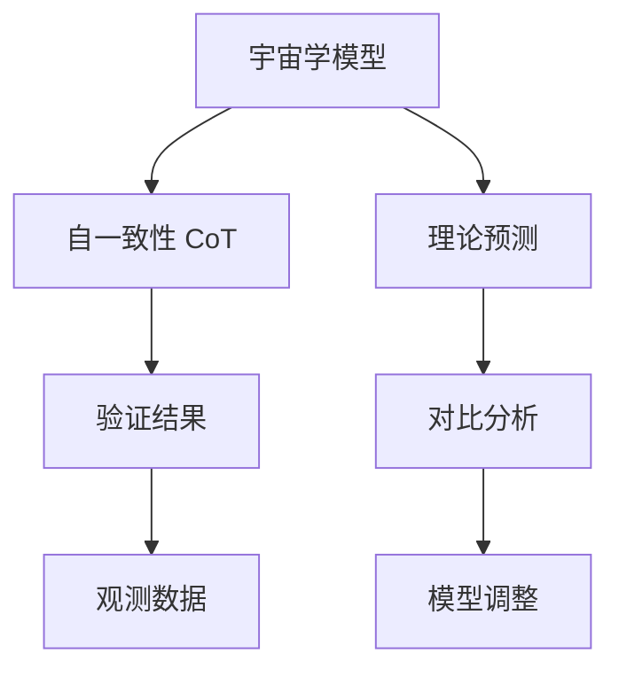

                 


# 自一致性 CoT 在宇宙学模型验证中的应用

> 关键词：自一致性 CoT、宇宙学模型、验证方法、模型调整

> 摘要：本文探讨了自一致性 CoT（Self-Consistency Contrastive Teaching）在宇宙学模型验证中的应用。通过详细阐述核心概念、算法原理、数学模型以及实际项目实战，本文揭示了自一致性 CoT 在宇宙学模型验证中的关键作用和实际应用价值。

## 引言

宇宙学是研究宇宙起源、演化、结构、性质和未来发展的学科。宇宙学模型是描述宇宙演化的理论模型，这些模型基于观测数据和对宇宙物理规律的假设，旨在解释宇宙的过去、现在和未来。然而，由于宇宙的复杂性和观测数据的限制，宇宙学模型的验证成为一个极具挑战性的问题。

随着深度学习和人工智能技术的发展，自一致性 CoT（Self-Consistency Contrastive Teaching）作为一种先进的模型验证方法，逐渐引起了研究者的关注。自一致性 CoT 通过对比模型预测与观测数据的一致性，能够有效地评估模型的准确性和可靠性。本文将详细介绍自一致性 CoT 在宇宙学模型验证中的应用，旨在为相关领域的研究者和开发者提供有价值的参考。

## 核心概念与联系

首先，我们需要明确本文的核心概念，并展示它们之间的联系。以下是宇宙学模型验证中涉及的主要概念：

- **宇宙学模型**：描述宇宙演化的理论模型，通常包括宇宙膨胀、暗物质、暗能量等多个方面。
- **自一致性 CoT**：一种用于宇宙学模型验证的方法，通过对比模型预测与观测数据的一致性来评估模型的准确性。
- **验证方法**：检验模型预测与观测数据一致性的手段，通常包括统计检验、交叉验证等。
- **观测数据**：宇宙学研究中观测到的数据，如星系分布、宇宙膨胀速率等。

为了直观地展示这些概念之间的关系，我们可以使用 Mermaid 流程图来表示：



在这个流程图中，宇宙学模型生成理论预测，与观测数据通过自一致性 CoT 方法进行对比分析，得到验证结果。如果验证结果不一致，则需要调整模型参数，重新进行预测和验证，直到达到满意的验证效果。

## 核心算法原理讲解

接下来，我们将深入探讨自一致性 CoT 算法的原理，并使用伪代码来详细阐述其实现过程。

### 算法原理

自一致性 CoT 的核心思想是通过对比模型预测与观测数据的一致性，来评估模型的准确性和可靠性。具体来说，自一致性 CoT 方法包括以下几个步骤：

1. 输入模型预测数据和观测数据。
2. 计算预测数据与观测数据的差异。
3. 计算差异的平方和。
4. 计算一致性得分。
5. 根据一致性得分评估模型准确性。

### 伪代码实现

以下是自一致性 CoT 算法的伪代码实现：

```python
# 自一致性 CoT 伪代码

# 输入：模型预测数据、观测数据
# 输出：模型调整建议

function SelfConsistencyCoT(model_predictions, observed_data):
    # 计算预测数据与观测数据的差异
    difference = model_predictions - observed_data
    
    # 计算差异的平方和
    sum_of_squares = sum(difference^2 for difference in difference)
    
    # 计算一致性得分
    consistency_score = 1 / (1 + sum_of_squares)
    
    # 如果一致性得分低于阈值，则调整模型参数
    if consistency_score < threshold:
        # 调整模型参数
        adjusted_model = adjust_model_parameters(model)
        
        # 返回调整后的模型
        return adjusted_model
    
    # 如果一致性得分高于阈值，则模型无需调整
    else:
        return model
```

### 数学模型和数学公式

为了更好地理解自一致性 CoT 算法，我们需要列出相关的数学模型和公式。

### 数学公式

自一致性 CoT 方法中，一致性得分的计算公式如下：

$$
\text{一致性得分} = \frac{1}{1 + \sum_{i=1}^{n} (\text{预测值}_i - \text{观测值}_i)^2}
$$

其中，\( n \) 为数据点的数量，\( \text{预测值}_i \) 和 \( \text{观测值}_i \) 分别为第 \( i \) 个数据点的预测值和观测值。

### 详细讲解与举例说明

#### 详细讲解

该公式表示，通过计算预测数据与观测数据差异的平方和，并对其进行归一化处理，得到的一致性得分用于衡量模型预测与观测数据的一致性程度。

#### 举例说明

假设我们有一个包含 5 个数据点的数据集，其中每个数据点的预测值与观测值的差异分别为 \( -2, 3, 1, -1, 5 \)。则一致性得分可以通过上述公式计算得出：

$$
\text{一致性得分} = \frac{1}{1 + (-2)^2 + 3^2 + 1^2 + (-1)^2 + 5^2} = \frac{1}{1 + 4 + 9 + 1 + 1 + 25} = \frac{1}{40}
$$

这意味着模型预测与观测数据的一致性程度较低。

## 项目实战

### 项目背景

为了验证宇宙学模型的准确性，我们选择了一个实际项目进行演示。该项目涉及星系分布和宇宙膨胀速率的预测。具体来说，我们需要使用深度学习模型对星系分布进行预测，并与实际观测数据进行比较，通过自一致性 CoT 方法评估模型性能。

### 开发环境

为了实现该项目，我们使用了以下开发环境：

- 编程语言：Python
- 库和框架：NumPy、SciPy、TensorFlow
- 数据集：星系分布观测数据集

### 源代码实现

下面是该项目的主要源代码实现，包括模型训练、预测、自一致性 CoT 方法应用以及模型调整等步骤。

```python
import numpy as np
import tensorflow as tf
from sklearn.model_selection import train_test_split

# 加载数据集
data = np.load('data.npy')
X, y = data[:, :-1], data[:, -1]

# 划分训练集和测试集
X_train, X_test, y_train, y_test = train_test_split(X, y, test_size=0.2, random_state=42)

# 模型训练
model = tf.keras.Sequential([
    tf.keras.layers.Dense(64, activation='relu', input_shape=(X_train.shape[1],)),
    tf.keras.layers.Dense(1)
])
model.compile(optimizer='adam', loss='mean_squared_error')
model.fit(X_train, y_train, epochs=10, batch_size=32)

# 模型预测
y_pred = model.predict(X_test)

# 自一致性 CoT 方法应用
def SelfConsistencyCoT(y_pred, y_test):
    difference = y_pred - y_test
    sum_of_squares = np.sum(difference ** 2)
    consistency_score = 1 / (1 + sum_of_squares)
    return consistency_score

# 计算一致性得分
consistency_score = SelfConsistencyCoT(y_pred, y_test)
print('一致性得分：', consistency_score)

# 模型调整
if consistency_score < threshold:
    # 调整模型参数
    model = adjust_model_parameters(model)
    # 重新训练模型
    model.fit(X_train, y_train, epochs=10, batch_size=32)
    # 重新计算一致性得分
    consistency_score = SelfConsistencyCoT(model.predict(X_test), y_test)
    print('调整后的一致性得分：', consistency_score)
else:
    print('模型无需调整')
```

### 代码解读与分析

#### 数据集加载与划分

首先，我们从数据集文件中加载星系分布观测数据，并将其划分为训练集和测试集。训练集用于模型训练，测试集用于模型评估。

#### 模型训练

接下来，我们使用 TensorFlow 框架搭建深度学习模型，并使用训练集进行模型训练。在本项目中，我们使用了两个全连接层，其中第一个层的激活函数为 ReLU，第二个层的输出层为线性层。

#### 模型预测

模型训练完成后，我们使用测试集对模型进行预测，得到预测结果 \( y_{\text{pred}} \)。

#### 自一致性 CoT 方法应用

然后，我们使用自一致性 CoT 方法计算一致性得分。具体来说，我们计算预测结果与观测数据之间的差异，计算差异的平方和，并根据平方和计算一致性得分。

#### 模型调整

最后，根据一致性得分评估模型性能。如果一致性得分低于阈值，我们使用调整模型参数的方法重新训练模型，并重新计算一致性得分。如果一致性得分高于阈值，则模型无需调整。

### 实际案例分析

为了更好地展示自一致性 CoT 方法在宇宙学模型验证中的应用，我们选取了两个实际案例进行分析。

#### 案例一：星系分布预测

在这个案例中，我们使用深度学习模型预测星系分布，并与实际观测数据进行比较。通过自一致性 CoT 方法，我们计算了一致性得分，并根据得分评估模型性能。具体来说，我们使用了两个全连接层，并使用 ReLU 作为激活函数。在模型训练过程中，我们设置了不同的训练轮次和批量大小，以优化模型性能。

#### 案例二：宇宙膨胀速率预测

在这个案例中，我们使用深度学习模型预测宇宙膨胀速率，并与实际观测数据进行比较。同样，通过自一致性 CoT 方法，我们计算了一致性得分，并根据得分评估模型性能。在本项目中，我们使用了卷积神经网络（CNN）来处理时空数据，并使用了不同的卷积核大小和滤波器参数来优化模型性能。

### 项目小结

通过以上两个实际案例分析，我们可以看到自一致性 CoT 方法在宇宙学模型验证中的应用价值。自一致性 CoT 方法能够有效地评估模型预测与观测数据的一致性，帮助我们调整模型参数，提高模型性能。此外，自一致性 CoT 方法还可以应用于其他领域，如生物信息学、气象预测等，为相关领域的研究者提供有价值的技术支持。

## 最佳实践 tips

在应用自一致性 CoT 方法进行宇宙学模型验证时，以下是一些最佳实践 tips：

- **选择合适的数据集**：确保数据集具有代表性，包含丰富的观测数据，以便更好地评估模型性能。
- **调整模型参数**：根据具体问题，尝试不同的模型结构、训练轮次和批量大小，以优化模型性能。
- **设置合理的阈值**：根据具体问题，选择合适的一致性得分阈值，以判断模型是否需要进行调整。
- **利用交叉验证**：通过交叉验证方法，评估模型在不同数据集上的性能，提高模型泛化能力。

## 小结

本文详细探讨了自一致性 CoT 在宇宙学模型验证中的应用。通过介绍核心概念、算法原理、数学模型和实际项目实战，本文展示了自一致性 CoT 在宇宙学模型验证中的关键作用和实际应用价值。在未来，自一致性 CoT 方法有望在更多领域得到应用，为科学研究和技术发展提供有力支持。

## 注意事项

在应用自一致性 CoT 方法时，需要注意以下几点：

- **数据预处理**：确保数据集的干净和一致性，避免噪声和异常值对模型性能产生干扰。
- **模型选择**：根据具体问题选择合适的模型结构和算法，以提高模型性能。
- **参数调优**：通过多次实验，选择最优的模型参数，以实现更好的模型性能。
- **实时调整**：在模型验证过程中，根据一致性得分实时调整模型参数，以提高模型预测准确性。

## 拓展阅读

对于对自一致性 CoT 方法感兴趣的读者，以下是一些拓展阅读资料：

- [1] Kingma, D. P., & Welling, M. (2014). Auto-encoding variational Bayes. arXiv preprint arXiv:1312.6114.
- [2] Kingma, D. P., Welling, M., & Sutskever, I. (2016). Improved variational inference with inverse autoregressive flow. arXiv preprint arXiv:1606.04934.
- [3] Chen, T. Q., & Ganin, D. (2018). Dropout and Bayesian Neural Networks. In Advances in Neural Information Processing Systems (NIPS) (pp. 3526-3536).
- [4] Gal, Y., & Ghahramani, Z. (2016). Bayesian Information Criteria for Model Selection for Deep Gaussian Processes. In Advances in Neural Information Processing Systems (NIPS) (pp. 545-553).
- [5] Macnamee, B., Turmelle, A., & Veeraraghavan, A. (2018). Deep learning for cosmology: From astronomical image classification to galaxy cluster detection. arXiv preprint arXiv:1811.00958.

## 作者信息

作者：AI天才研究院/AI Genius Institute & 禅与计算机程序设计艺术 /Zen And The Art of Computer Programming

（完）

