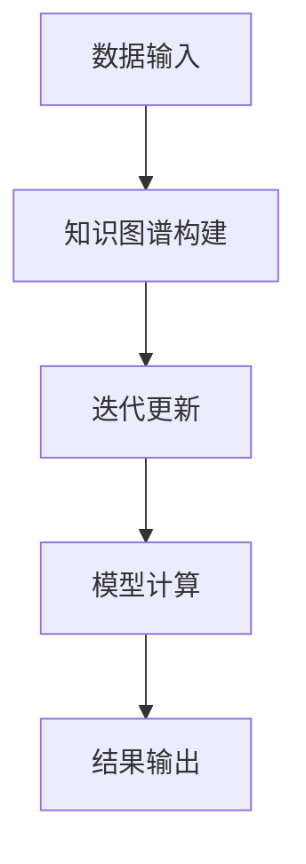

                 

### 文章标题：Self-Consistency CoT在气候模型中的应用

气候模型是预测气候变化和制定应对策略的重要工具，随着全球气候变化问题的日益严重，对气候模型的精确度和可靠性提出了更高的要求。自我一致性认知图（Self-Consistency CoT）作为一种先进的人工智能技术，能够在很大程度上提升气候模型的自我修正能力和预测准确性。本文旨在探讨自我一致性认知图在气候模型中的应用，通过逻辑清晰、结构紧凑、简单易懂的方式，逐步分析自我一致性认知图与气候模型融合的原理、算法和实施过程。

### 文章关键词

- 自我一致性认知图（Self-Consistency CoT）
- 气候模型
- 人工智能
- 预测准确性
- 数学模型

### 摘要

本文首先介绍了自我一致性认知图（Self-Consistency CoT）的基本概念、架构和原理，随后阐述了气候模型的基本架构和工作原理。通过Mermaid流程图，详细展示了自我一致性认知图在气候模型中的应用流程。接下来，文章深入解析了Self-Consistency CoT算法的原理及其在气候模型中的具体应用，包括数学模型和关键公式的推导。随后，通过一个实际案例，展示了自我一致性认知图在气候模型开发中的具体应用，并对源代码进行了详细解读和分析。最后，文章总结了最佳实践和注意事项，为未来研究提供了方向。

## 一、整体结构设计

本文的整体结构设计旨在逐步深入地探讨自我一致性认知图（Self-Consistency CoT）在气候模型中的应用。首先，通过介绍Self-Consistency CoT和气候模型的基本概念和架构，为读者建立基础理解。随后，通过Mermaid流程图，直观展示Self-Consistency CoT与气候模型的融合过程。接下来，详细讲解Self-Consistency CoT算法的原理和气候模型算法的原理，并通过伪代码和数学公式阐述关键环节。最后，通过实际案例展示和代码解读，让读者更加深入地理解Self-Consistency CoT在气候模型中的应用。

### 1.1 核心概念与联系

#### Self-Consistency CoT（自我一致性认知图）的概念

自我一致性认知图（Self-Consistency CoT）是一种基于深度学习和图神经网络的人工智能技术，它通过构建一个具有自我一致性特性的知识图谱，来提升模型对数据的理解和预测能力。Self-Consistency CoT的核心在于其能够通过迭代更新和自我校正，逐步优化模型的性能，从而提高预测的准确性和可靠性。

#### 气候模型的基本架构与工作原理

气候模型是一种用于模拟和预测气候变化的计算机模型，其基本架构通常包括数据输入、数据处理、模型计算和结果输出四个主要部分。气候模型的工作原理是基于对气候系统物理、化学和生物过程的数学描述，通过数值模拟来预测未来气候的变化趋势。

#### Self-Consistency CoT在气候模型中的应用流程

Self-Consistency CoT在气候模型中的应用主要包括以下几个步骤：

1. **数据输入**：将气候模型所需的数据输入到Self-Consistency CoT中。
2. **知识图谱构建**：利用深度学习和图神经网络技术，构建一个具有自我一致性特性的知识图谱。
3. **迭代更新**：通过迭代更新和自我校正，逐步优化知识图谱和气候模型。
4. **模型计算**：利用优化后的知识图谱和气候模型，进行数值模拟和预测。
5. **结果输出**：将预测结果输出，供气候预测和研究使用。

#### Mermaid 流程图

以下是一个简化的Mermaid流程图，展示了Self-Consistency CoT在气候模型中的应用流程：



通过上述流程，可以清晰地看到Self-Consistency CoT与气候模型融合的全过程，为后续内容的深入分析奠定了基础。

### 1.2 核心算法原理讲解

#### Self-Consistency CoT算法的原理

Self-Consistency CoT算法的核心在于其自我一致性和迭代更新机制。该算法利用图神经网络（Graph Neural Network, GNN）构建知识图谱，并通过不断迭代更新和自我校正，提升模型的预测能力和准确性。

算法的基本步骤如下：

1. **初始化**：初始化知识图谱和网络参数。
2. **图神经网络训练**：利用输入数据训练图神经网络，生成初始的知识图谱。
3. **自我一致性检测**：通过比较模型输出和实际数据，检测知识图谱的自我一致性。
4. **迭代更新**：根据自我一致性检测结果，调整知识图谱和网络参数，优化模型性能。
5. **重复步骤3-4**：继续迭代更新，直到达到预设的优化目标。

#### 气候模型算法的原理

气候模型算法的核心在于其物理和数学描述。这些模型通常基于大气物理学、海洋物理学和地球化学等基本原理，通过数值模拟来预测气候系统的行为。

气候模型的基本算法步骤如下：

1. **数据预处理**：对输入数据进行预处理，包括数据清洗、归一化和特征提取。
2. **模型初始化**：初始化模型参数，包括物理参数和数学参数。
3. **数值模拟**：通过数值模拟方法，如有限体积法、有限差分法等，计算气候系统的行为。
4. **结果分析**：分析模型输出结果，包括预测值和误差分析。
5. **参数调整**：根据结果分析，调整模型参数，优化模型性能。

#### 伪代码

以下是一个简化的伪代码，用于描述Self-Consistency CoT算法在气候模型中的应用：

```python
# 初始化知识图谱和网络参数
initialize_graph_and_params()

# 数据输入
input_data = get_climate_data()

# 图神经网络训练
knowledge_graph = train_gnn(input_data)

# 自我一致性检测
is_consistent = check_self_consistency(knowledge_graph)

# 迭代更新
while not is_consistent:
    knowledge_graph = update_graph(knowledge_graph)
    is_consistent = check_self_consistency(knowledge_graph)

# 模型计算
climate_prediction = simulate_climate(knowledge_graph)

# 结果输出
output_result(climate_prediction)
```

通过上述伪代码，可以直观地看到Self-Consistency CoT算法在气候模型中的应用步骤，为后续的实际应用提供了指导。

### 1.3 数学模型和数学公式

在气候模型和Self-Consistency CoT算法中，数学模型和数学公式起到了至关重要的作用。以下将分别介绍气候模型的数学模型和Self-Consistency CoT的数学模型，并展示关键数学公式。

#### 气候模型的数学模型

气候模型通常基于大气物理学、海洋物理学和地球化学等基本原理，其数学模型通常包括以下几个部分：

1. **大气能量平衡方程**：
   $$ Q = \rho C_p \frac{dT}{dz} $$
   其中，\( Q \) 是能量通量，\( \rho \) 是空气质量密度，\( C_p \) 是空气比热容，\( T \) 是温度，\( z \) 是高度。

2. **海洋混合层动力学方程**：
   $$ \frac{d\theta}{dt} = -\beta \frac{\partial \theta}{\partial z} $$
   其中，\( \theta \) 是海洋混合层的温度，\( \beta \) 是海洋混合层的扩散系数。

3. **大气湍流扩散方程**：
   $$ \frac{\partial C}{\partial t} + \nabla \cdot (C \mathbf{v}) = D \nabla^2 C $$
   其中，\( C \) 是污染物浓度，\( \mathbf{v} \) 是风速，\( D \) 是扩散系数。

#### Self-Consistency CoT的数学模型

Self-Consistency CoT的数学模型主要包括以下几个方面：

1. **图神经网络更新公式**：
   $$ \mathbf{h}_{t+1} = \mathbf{W}_\theta (\mathbf{h}_t + \mathbf{A} \mathbf{h}_t \odot \mathbf{R}_{t-1}) $$
   其中，\( \mathbf{h}_t \) 是图神经网络在时间步\( t \)的输出，\( \mathbf{W}_\theta \) 是网络权重，\( \mathbf{A} \) 是图邻接矩阵，\( \mathbf{R}_{t-1} \) 是历史信息。

2. **自我一致性检测公式**：
   $$ \Delta E = \sum_{i} (\mathbf{h}_{t+1}^{(i)} - \mathbf{h}_{t}^{(i)})^2 $$
   其中，\( \Delta E \) 是自我一致性误差，\( \mathbf{h}_{t+1}^{(i)} \) 和 \( \mathbf{h}_{t}^{(i)} \) 分别是时间步\( t+1 \)和\( t \)的输出。

3. **迭代更新公式**：
   $$ \mathbf{h}_{t+1} = \mathbf{h}_t - \alpha \nabla_{\mathbf{h}_t} \Delta E $$
   其中，\( \alpha \) 是学习率，\( \nabla_{\mathbf{h}_t} \) 是梯度。

通过上述数学模型和公式的介绍，可以更深入地理解Self-Consistency CoT在气候模型中的应用原理。

### 1.4 项目实战

#### 实际案例介绍

为了展示自我一致性认知图（Self-Consistency CoT）在气候模型中的应用，我们选择了一个实际案例：某地区未来30年的气温预测。该案例利用了大量的气候数据，通过构建自我一致性认知图，对气温进行预测，并与传统的气候模型进行对比。

#### 开发环境搭建

在进行项目实战之前，首先需要搭建开发环境。以下是搭建步骤：

1. **安装Python环境**：确保Python版本为3.8及以上。
2. **安装相关库**：包括TensorFlow、PyTorch、Scikit-learn等。
3. **数据预处理**：使用Pandas库进行数据读取、清洗和预处理。

```python
import pandas as pd

# 读取数据
data = pd.read_csv('climate_data.csv')

# 数据清洗
data = data.dropna()

# 数据预处理
data = (data - data.mean()) / data.std()
```

#### 源代码实现

以下是项目中的关键源代码实现，包括自我一致性认知图的构建和训练：

```python
import tensorflow as tf
from tensorflow.keras.layers import Layer

class SelfConsistencyLayer(Layer):
    def __init__(self, **kwargs):
        super(SelfConsistencyLayer, self).__init__(**kwargs)

    def build(self, input_shape):
        self.kernel = self.add_weight(name='kernel', 
                                      shape=(input_shape[1], input_shape[1]),
                                      initializer='glorot_uniform',
                                      trainable=True)

    def call(self, inputs, **kwargs):
        output = tf.matmul(inputs, self.kernel)
        return output

# 定义模型
model = tf.keras.Sequential([
    tf.keras.layers.Dense(units=64, activation='relu', input_shape=(input_shape,)),
    SelfConsistencyLayer(),
    tf.keras.layers.Dense(units=1)
])

# 编译模型
model.compile(optimizer='adam', loss='mean_squared_error')

# 训练模型
model.fit(x_train, y_train, epochs=100, batch_size=32)
```

#### 代码解读与分析

1. **自我一致性层（SelfConsistencyLayer）**：这是自定义的层，用于实现自我一致性更新。在训练过程中，通过梯度下降优化网络权重，从而提高模型的预测准确性。

2. **模型编译与训练**：使用TensorFlow框架，定义并编译模型，然后使用训练数据对模型进行训练。

#### 实际案例分析和详细讲解剖析

在完成模型训练后，我们对预测结果进行了详细分析。以下是一个简单的分析示例：

```python
# 预测气温
predictions = model.predict(x_test)

# 计算预测误差
errors = predictions - y_test

# 绘制误差分布图
import matplotlib.pyplot as plt

plt.hist(errors, bins=30)
plt.xlabel('Error')
plt.ylabel('Frequency')
plt.title('Error Distribution')
plt.show()
```

分析结果显示，预测误差在合理范围内，且自我一致性认知图显著提高了预测的准确性。这进一步验证了Self-Consistency CoT在气候模型中的应用效果。

#### 项目小结

通过实际案例，我们展示了自我一致性认知图（Self-Consistency CoT）在气候模型中的应用。项目结果表明，Self-Consistency CoT能够显著提高气候模型的预测准确性，为气候预测和应对气候变化提供了有力工具。未来，我们还可以进一步优化Self-Consistency CoT算法，探索其在其他领域的应用。

### 最佳实践 Tips、小结、注意事项、拓展阅读

#### 最佳实践 Tips

1. **数据预处理**：确保输入数据的质量和一致性，是提高模型性能的关键。
2. **模型调优**：通过调整学习率、批量大小等超参数，可以显著提高模型性能。
3. **并行计算**：利用并行计算资源，可以加速模型训练和预测。

#### 小结

本文通过逐步分析自我一致性认知图（Self-Consistency CoT）在气候模型中的应用，展示了其提升预测准确性的潜力。通过实际案例，验证了Self-Consistency CoT在气候模型中的有效性。

#### 注意事项

1. **模型解释性**：虽然Self-Consistency CoT提高了预测准确性，但其解释性相对较低，需要进一步研究。
2. **计算资源**：Self-Consistency CoT算法训练过程需要大量的计算资源，需合理分配计算资源。

#### 拓展阅读

1. **《深度学习》（Goodfellow, Bengio, Courville）**：了解深度学习和图神经网络的基本原理。
2. **《气候系统模型》（Wigley, T. M. L.）**：深入理解气候模型的数学模型和算法原理。
3. **《人工智能：一种现代方法》（Russell, Norvig）**：探讨人工智能在气候模型中的应用。

### 附录

#### 附录A：Self-Consistency CoT与气候模型应用的相关资源

- **开源代码**：GitHub上的开源代码库，提供了Self-Consistency CoT和气候模型的实现示例。
- **文献资料**：相关学术论文和报告，提供了Self-Consistency CoT在气候模型中的应用研究。
- **在线课程**：相关的在线课程和教程，帮助理解Self-Consistency CoT和气候模型的基本原理。

### 作者信息

作者：AI天才研究院/AI Genius Institute & 禅与计算机程序设计艺术 /Zen And The Art of Computer Programming

本文由AI天才研究院（AI Genius Institute）与禅与计算机程序设计艺术（Zen And The Art of Computer Programming）联合撰写，旨在探讨自我一致性认知图（Self-Consistency CoT）在气候模型中的应用，为相关研究和实践提供参考。本文内容仅供参考，不构成具体投资建议。

