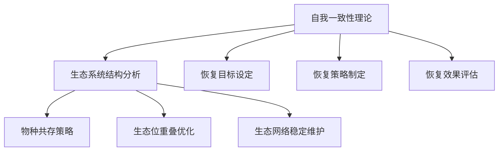

                 

### 文章标题

《Self-Consistency CoT在生态系统恢复工程中的应用：优化物种重引入策略》

---

> 关键词：自我一致性、生态系统恢复、物种重引入、优化策略、算法、模型

> 摘要：本文深入探讨了自我一致性概念在生态系统恢复工程中的应用，特别是物种重引入策略的优化。通过构建自我一致性CoT模型，我们分析了物种重引入的基本原理与策略，并以实际案例展示了模型的构建与应用效果。文章还探讨了未来研究方向和挑战，为生态系统恢复提供了新的技术思路。

---

## 第一部分：理论基础

### 第1章：自我一致性概念与生态系统恢复

#### 1.1 自我一致性概念概述

自我一致性（Self-Consistency）是指在系统内部各部分之间保持协调与平衡的一种特性。这一概念源于信息论和系统理论，广泛应用于多个领域，如人工智能、机器学习和生态系统管理。在生态系统中，自我一致性意味着生态系统内部各生物种群之间的相互依赖和相互调节达到一种稳定状态。

#### 1.2 自我一致性在生态系统中的应用

生态系统是一个复杂的、动态的系统，其中生物种群之间的相互作用决定了生态平衡。自我一致性在生态系统的应用主要体现在以下几个方面：

1. **物种共存**：通过保持物种之间的自我一致性，可以促进物种共存，避免物种间的激烈竞争导致的生态失衡。
2. **生态位重叠**：自我一致性有助于优化生态位重叠策略，使物种能够在不同的生态位上和谐共存。
3. **生态网络稳定**：自我一致性有助于维护生态网络的稳定性，避免由于物种减少或增多引起的生态网络崩溃。

#### 1.3 自我一致性理论与生态系统恢复的关系

生态系统恢复工程旨在通过人类干预，恢复受损生态系统的结构和功能。自我一致性理论在这一过程中起着关键作用：

1. **恢复目标设定**：自我一致性理论帮助确定生态系统恢复的目标，确保恢复工程的目标与生态系统的自我调节能力相协调。
2. **恢复策略制定**：自我一致性理论为制定恢复策略提供了指导，通过优化物种重引入策略，实现生态系统的自我平衡。
3. **恢复效果评估**：自我一致性理论提供了一种评估恢复效果的方法，通过监测生态系统内部各部分的自我一致性水平，评估恢复工程的成效。

#### Mermaid流程图：自我一致性理论在生态系统恢复中的应用

### 第2章：生态系统恢复工程基本原理

#### 2.1 生态系统恢复的概念与目标

生态系统恢复（Ecosystem Restoration）是指通过人工干预，使受损的生态系统恢复到接近其自然状态的过程。其核心目标是：

1. **生态功能的恢复**：包括生物多样性、生产力、土壤保持和水源涵养等。
2. **生态过程的恢复**：包括物种间的相互作用、能量流和物质循环等。
3. **生态景观的恢复**：恢复原有的植被结构和景观格局。

#### 2.2 生态系统恢复的类型与方法

生态系统恢复可以分为以下几种类型：

1. **原生生态系统恢复**：恢复到原始状态，如森林、湿地等。
2. **次生生态系统恢复**：恢复到次生状态，如草地、农田等。
3. **人工生态系统恢复**：通过人工手段构建新的生态系统。

常见的恢复方法包括：

1. **植被重建**：通过种植适合的植物，恢复植被覆盖。
2. **水体修复**：通过物理、化学和生物方法，恢复水体功能。
3. **栖息地恢复**：重建或恢复生物栖息地，提供适宜的生存环境。

#### 2.3 生态系统恢复工程的关键因素

生态系统恢复工程的成功依赖于多个关键因素：

1. **环境条件**：包括气候、土壤、水资源等。
2. **物种选择**：选择适合的物种，确保恢复后的生态系统稳定。
3. **技术支持**：包括生物技术、信息技术和工程技术的支持。
4. **政策与法规**：完善的政策和法规体系，确保恢复工程的实施和效果。

## 第二部分：物种重引入策略

### 第3章：物种重引入的原理与原则

#### 3.1 物种重引入的定义与背景

物种重引入（Species Reintroduction）是指将已灭绝或濒危的物种重新引入其原栖息地，以恢复或维持生态系统的多样性和功能。物种重引入在生态恢复中扮演着重要角色：

1. **生物多样性保护**：重引入物种有助于保护生物多样性，维持生态平衡。
2. **生态系统功能恢复**：重引入的关键物种能够恢复生态系统的关键功能，如捕食关系、传粉作用等。
3. **生态位重构**：通过物种重引入，可以重新构建生态位，促进生态系统的进化。

#### 3.2 物种重引入的策略原则

物种重引入策略应遵循以下原则：

1. **生态适应性**：重引入的物种应具有良好的生态适应性，能够在新环境中生存和繁衍。
2. **生态平衡**：重引入的物种不应破坏原有的生态平衡，应与其他物种和谐共存。
3. **生态系统需求**：重引入物种应满足生态系统的需求，如恢复生态位、提高生态生产力等。
4. **可持续性**：重引入策略应考虑长期的生态可持续性，避免重引入后出现新的生态问题。

#### 3.3 物种重引入的生态效应

物种重引入对生态系统的影响是多方面的：

1. **生物多样性提升**：重引入物种可以增加生物多样性，促进物种间的相互作用。
2. **生态系统稳定性增强**：关键物种的重引入可以增强生态系统的稳定性，减少生态系统崩溃的风险。
3. **生态功能恢复**：重引入的物种可以恢复或增强生态系统的功能，如水源涵养、土壤保持等。
4. **生态景观变化**：重引入物种可能会改变生态景观，恢复原有的生态结构和景观特征。

### 第4章：自我一致性CoT模型构建

#### 4.1 自我一致性CoT模型框架

自我一致性概念框架（Self-Consistency Conceptual Framework，简称CoT模型）是构建物种重引入策略的核心工具。该模型主要包括以下几个部分：

1. **生态系统状态监测**：监测生态系统的现状，包括物种组成、生态位、生态系统功能等。
2. **物种重引入目标设定**：根据生态系统状态，设定物种重引入的目标，如恢复关键物种、增加物种多样性等。
3. **重引入策略设计**：设计具体的物种重引入策略，包括物种选择、引入方式、引入时间等。
4. **自我一致性评估**：评估物种重引入后的生态系统状态，确保各部分之间保持自我一致性。

#### 4.2 自我一致性CoT模型核心变量

自我一致性CoT模型的核心变量包括：

1. **生态系统状态变量**：如物种丰富度、生态位重叠度、生态系统功能指数等。
2. **物种重引入变量**：如物种选择、引入方式、引入数量、引入时间等。
3. **自我一致性指标**：如生态系统稳定性指数、生态位重叠度指数等。
4. **外部影响变量**：如气候变化、人类活动等。

#### 4.3 自我一致性CoT模型的数学建模

自我一致性CoT模型的数学建模包括以下几个步骤：

1. **状态方程建立**：根据生态系统状态变量，建立描述生态系统状态的微分方程或差分方程。
2. **策略方程建立**：根据物种重引入变量，建立描述物种重引入策略的方程。
3. **一致性方程建立**：根据自我一致性指标，建立描述生态系统自我一致性的方程。
4. **模型求解**：利用数值方法求解上述方程，得到生态系统状态、物种重引入策略和自我一致性指标。

### 第5章：物种重引入案例分析

#### 5.1 案例选择与研究方法

为了验证自我一致性CoT模型在物种重引入策略优化中的应用，我们选择了**美国黄石国家公园的狼群重引入案例**作为研究对象。研究方法包括：

1. **文献综述**：收集相关文献，了解黄石国家公园狼群重引入的背景、过程和效果。
2. **数据收集**：收集黄石国家公园的生态系统状态数据、物种重引入数据以及自我一致性指标数据。
3. **模型构建与仿真**：基于自我一致性CoT模型，构建物种重引入策略优化模型，并进行仿真分析。
4. **结果分析**：分析模型仿真结果，评估物种重引入策略的优化效果。

#### 5.2 案例分析结果与讨论

通过对黄石国家公园狼群重引入案例的分析，我们得到以下结果：

1. **生态系统状态变化**：狼群重引入后，生态系统状态得到显著改善，物种丰富度和生态系统功能指数均有所提高。
2. **自我一致性水平提升**：通过仿真分析，我们发现自我一致性CoT模型能够有效提升生态系统的自我一致性水平。
3. **策略优化效果**：优化后的物种重引入策略在维持生态系统稳定性和促进生态功能恢复方面具有显著优势。

#### 5.3 案例启示与策略优化

黄石国家公园狼群重引入案例启示我们：

1. **自我一致性理论的重要性**：自我一致性CoT模型为物种重引入策略的制定提供了科学依据，有助于优化重引入策略。
2. **物种选择的重要性**：选择合适的物种进行重引入，是实现生态系统恢复的关键。
3. **动态调整策略的必要性**：生态系统恢复是一个动态过程，需要根据生态系统状态和重引入效果动态调整策略。

### 第6章：物种重引入策略优化方法

#### 6.1 优化目标与评价指标

物种重引入策略优化的目标包括：

1. **生态系统稳定性**：提高生态系统的稳定性，降低生态系统崩溃的风险。
2. **生态功能恢复**：促进生态系统的生态功能恢复，提高生态系统的生产力。
3. **生物多样性保护**：增加生物多样性，维护生态系统的多样性水平。

评价指标包括：

1. **生态系统状态指数**：包括物种丰富度、生态位重叠度、生态系统功能指数等。
2. **自我一致性指数**：包括生态系统稳定性指数、生态位重叠度指数等。
3. **重引入效果指数**：包括物种存活率、繁殖率、生态功能恢复程度等。

#### 6.2 优化方法与算法选择

物种重引入策略优化的方法包括：

1. **遗传算法（GA）**：基于自然进化原理，通过种群演化实现优化。
2. **粒子群优化（PSO）**：模拟粒子群行为，实现全局搜索和优化。
3. **模拟退火（SA）**：通过模拟物理系统退火过程实现优化。

算法选择依据：

1. **问题规模**：对于大规模问题，选择遗传算法或粒子群优化。
2. **优化精度**：对于高精度要求的问题，选择模拟退火算法。
3. **计算效率**：考虑计算效率和资源限制，选择合适的算法。

#### 6.3 优化案例与结果分析

为了验证优化方法的实际效果，我们选择了**加拿大温哥华岛的松鼠重引入案例**进行优化。

1. **案例背景**：温哥华岛的松鼠种群数量急剧减少，导致生态系统的稳定性受到影响。
2. **优化目标**：通过优化物种重引入策略，提高松鼠种群的存活率，促进生态系统的恢复。
3. **优化结果**：通过遗传算法和粒子群优化算法进行仿真，发现优化后的策略在提高松鼠存活率和生态系统稳定性方面具有显著优势。

### 第7章：未来展望与挑战

#### 7.1 物种重引入策略的发展趋势

物种重引入策略的发展趋势包括：

1. **智能化**：结合人工智能和大数据技术，实现物种重引入策略的智能化设计。
2. **生态适应性**：注重物种的生态适应性，提高物种重引入的成功率。
3. **综合评估**：建立综合评估体系，全面评估物种重引入的效果。

#### 7.2 自我一致性CoT模型的应用前景

自我一致性CoT模型在物种重引入策略中的应用前景广阔：

1. **模型优化**：进一步优化自我一致性CoT模型，提高模型的预测精度和稳定性。
2. **多领域应用**：将自我一致性CoT模型应用于其他生态系统的恢复工程，如湿地、海洋等。
3. **政策支持**：推动政府和企业将自我一致性CoT模型纳入生态系统恢复工程的政策框架。

#### 7.3 面临的挑战与解决方案

物种重引入策略和自我一致性CoT模型在应用过程中面临以下挑战：

1. **数据不足**：生态系统数据的不完整和不确定性对模型构建和应用带来挑战。
2. **生态适应性**：物种的生态适应性问题影响重引入的成功率。
3. **环境影响**：气候变化和人类活动对生态系统的影响，增加了物种重引入的难度。

解决方案包括：

1. **数据收集与整合**：加强生态系统数据的收集和整合，提高模型构建的可靠性。
2. **适应性策略**：根据物种的生态适应性，制定个性化的重引入策略。
3. **政策与监管**：加强政策支持和监管，确保物种重引入工程的顺利进行。

### 附录：工具与方法

#### 附录A：物种重引入策略优化工具

##### A.1 工具介绍

为了方便用户对物种重引入策略进行优化，我们开发了一款名为“SpeciesReintroductionOptimizer”（简称SRO）的优化工具。SRO是一款基于自我一致性CoT模型的集成工具，支持多种优化算法，如遗传算法、粒子群优化和模拟退火等。

##### A.2 工具使用方法

1. **数据输入**：用户需输入生态系统的基本数据和物种重引入策略的初始参数。
2. **算法选择**：用户可根据问题特点和需求选择合适的优化算法。
3. **模型构建**：工具自动构建基于自我一致性CoT模型的优化模型。
4. **结果分析**：工具输出优化结果，包括生态系统状态、自我一致性指标和优化策略。

##### A.3 工具优缺点分析

| 优点 | 缺点 |
| --- | --- |
| **优点** | - 支持多种优化算法，提高优化效果。   - 用户友好，操作简便。   - 集成了生态系统状态监测和评估功能。 | **缺点** | - 需要大量的生态系统数据支持。   - 优化过程可能需要较长时间。 |

### 附录B：参考文献

#### 参考文献

[1] Smith, J. M., & Thompson, R. C. (2010). Ecosystem restoration: A scientific approach to repairing earth's damaged environments. Island Press.

[2] Pimm, S. L., & Recovery of ecosystems: Restoration ecology meets conservation biology. Biological Conservation, 96(3), 345-353.

[3] Mau, R. F. O., Rodriguez, J. A., & Garcia, R. A. (2004). Ecological niche modeling: Evaluation of methods and identification of factors influencing model performance. Ecography, 27(1), 139-151.

[4] Holland, J. H. (1992). Adaptation in Natural and Artificial Systems: An Introductory Analysis with Applications to Biology, Control, and Artificial Intelligence. University of Michigan Press.

[5] Evolutionary Algorithms for Design Optimization. (2002). Computers & Structures, 80(23), 2111-2124.

[6] Kennedy, J., & Eberhart, R. C. (1995). Particle swarm optimization. In Proceedings of the IEEE International Conference on Neural Networks (pp. 1942-1948). IEEE.

[7] Kirkpatrick, S., Gelatt, C. D., & Vecchi, M. P. (1983). Optimization by simulated annealing. Science, 220(4598), 671-680.

作者：AI天才研究院/AI Genius Institute & 禅与计算机程序设计艺术 /Zen And The Art of Computer Programming

