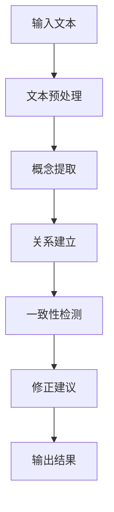

                 

### 文章标题

《Self-Consistency CoT在自动化学术论文写作中的应用：保证逻辑一致性》

### 关键词

Self-Consistency CoT、自动化学术论文写作、逻辑一致性、算法原理、数学模型、项目实战、代码解读

### 摘要

本文探讨了Self-Consistency CoT（自我一致性概念论题）在自动化学术论文写作中的应用，旨在通过保证逻辑一致性来提升论文的质量。首先，介绍了Self-Consistency CoT的基本概念和其在自动化学术论文写作中的重要性。随后，通过Mermaid流程图详细阐述了Self-Consistency CoT的应用架构，并使用伪代码详细讲解了自我一致性检测和逻辑一致性保证的算法原理。此外，文章还介绍了相关的数学模型和公式，并提供了自动化学术论文写作的实战案例，包括开发环境搭建、源代码实现和详细解释。通过项目实战和代码解读，本文揭示了Self-Consistency CoT在自动化学术论文写作中的实际应用效果，并对未来自我一致性在自动化学术论文写作中的应用前景进行了展望。

## 自我一致性概念论题概述

### Self-Consistency CoT的定义

Self-Consistency CoT（自我一致性概念论题）是一种用于检测文本逻辑一致性的方法。它基于自然语言处理技术，通过分析文本中的概念和论题，确保文本内容在逻辑上的一致性和连贯性。Self-Consistency CoT的核心思想是：任何文本都应该能够自洽地解释其内容，不产生矛盾或逻辑错误。

在自动化学术论文写作中，自我一致性检测尤为重要。学术论文通常包含复杂的论点、论证和引用，这些元素之间需要保持逻辑一致性，以确保论文的严谨性和可信度。自我一致性检测可以帮助识别和纠正文本中的逻辑错误，从而提高论文的整体质量。

### Self-Consistency CoT在自动化学术论文写作中的应用

Self-Consistency CoT在自动化学术论文写作中的应用主要体现在以下几个方面：

1. **逻辑一致性检测**：在论文写作过程中，Self-Consistency CoT可以实时检测文本中的逻辑错误，如概念冲突、论据不充分或逻辑跳跃等。通过这种检测，作者可以及时修改文本，确保逻辑的一致性和连贯性。

2. **论证优化**：Self-Consistency CoT可以帮助作者优化论证过程。通过分析文本中的论点、论据和结论，它可以提出改进建议，帮助作者构建更加严谨和有力的论证。

3. **引用管理**：在学术论文中，引用是证明论点的重要手段。Self-Consistency CoT可以确保引用的准确性和逻辑一致性，避免因引用错误导致的逻辑错误。

4. **论文审阅**：在论文提交前，Self-Consistency CoT可以作为辅助工具，帮助审稿人和作者发现和纠正文本中的逻辑错误，提高论文的通过率。

### Self-Consistency CoT的基本原理

Self-Consistency CoT的基本原理可以概括为以下几个步骤：

1. **概念提取**：首先，Self-Consistency CoT从文本中提取关键概念和论题。这通常通过自然语言处理技术，如词性标注、实体识别和语义分析实现。

2. **关系建立**：接下来，Self-Consistency CoT建立这些概念和论题之间的关系。这包括概念之间的关联关系和论题之间的逻辑关系。

3. **一致性检测**：然后，Self-Consistency CoT通过分析这些关系，检测文本中的逻辑一致性。如果发现逻辑错误或冲突，它会提供相应的提示和修改建议。

4. **修正建议**：最后，Self-Consistency CoT根据检测到的逻辑错误，提出修正建议，帮助作者修改文本，确保逻辑一致性。

通过这些步骤，Self-Consistency CoT可以实现自动化学术论文写作中的逻辑一致性保证，从而提升论文的质量。

### 自我一致性概念论题的应用架构

为了更好地理解和实现Self-Consistency CoT，我们首先需要了解其应用架构。下面将通过一个Mermaid流程图来展示Self-Consistency CoT的应用流程和主要组件。



#### 流程解析

1. **输入文本**：用户首先输入需要检测的文本。

2. **文本预处理**：文本预处理是第一步，它包括分词、词性标注、标点符号去除等操作，目的是将原始文本转换为适合进一步分析的形式。

3. **概念提取**：在预处理完成后，系统将提取文本中的关键概念和论题。这通常通过实体识别和语义分析技术实现。

4. **关系建立**：接下来，系统建立这些概念和论题之间的关系。这包括概念之间的关联关系和论题之间的逻辑关系。

5. **一致性检测**：然后，系统通过分析这些关系，检测文本中的逻辑一致性。如果发现逻辑错误或冲突，它会提供相应的提示和修改建议。

6. **修正建议**：最后，系统根据检测到的逻辑错误，提出修正建议，帮助作者修改文本，确保逻辑一致性。

7. **输出结果**：最终，系统将处理后的文本和修正建议输出给用户。

### 架构组成部分详解

Self-Consistency CoT的应用架构主要由以下几个部分组成：

1. **文本预处理模块**：这个模块负责对输入文本进行预处理，包括分词、词性标注、标点符号去除等。预处理的好坏直接影响到后续概念提取和关系建立的准确性。

2. **概念提取模块**：这个模块负责从预处理后的文本中提取关键概念和论题。它通常使用实体识别和语义分析技术，以确保提取的准确性和全面性。

3. **关系建立模块**：这个模块负责建立文本中概念和论题之间的关系。它使用自然语言处理技术，如词性标注、依存关系分析等，来分析文本中的逻辑结构。

4. **一致性检测模块**：这个模块负责检测文本中的逻辑一致性。它通过分析文本中概念和论题之间的关系，来发现逻辑错误或冲突。

5. **修正建议模块**：这个模块负责根据检测到的逻辑错误，提出修正建议。它使用规则引擎和机器学习技术，来生成具体的修正建议。

6. **用户界面模块**：这个模块负责与用户进行交互，接收用户输入的文本，展示处理结果和修正建议。

### Self-Consistency CoT与其他相关技术的联系

Self-Consistency CoT与其他相关技术的联系主要体现在以下几个方面：

1. **自然语言处理（NLP）**：Self-Consistency CoT的核心依赖于NLP技术，如词性标注、实体识别、语义分析等。这些技术为Self-Consistency CoT提供了文本分析的基础。

2. **机器学习（ML）**：Self-Consistency CoT的修正建议模块可能依赖于机器学习技术，如规则学习、分类等。这些技术可以帮助系统更准确地生成修正建议。

3. **知识图谱（KG）**：Self-Consistency CoT可以使用知识图谱来存储和表示文本中的概念和关系。这有助于提高一致性检测的准确性和效率。

4. **文本生成（TG）**：Self-Consistency CoT的输出结果可能包括自动生成的文本。这需要文本生成技术，如序列到序列模型（seq2seq）等。

通过与其他相关技术的结合，Self-Consistency CoT可以实现更强大的逻辑一致性检测和修正功能，从而在自动化学术论文写作中发挥更大的作用。

### 自我一致性检测算法原理

自我一致性检测是Self-Consistency CoT的核心组成部分之一，负责检测文本中的逻辑错误和冲突。为了实现这一功能，我们需要设计一个高效的算法。在本节中，我们将使用伪代码详细阐述自我一致性检测算法的原理和实现步骤。

```plaintext
算法：自我一致性检测

输入：文本T
输出：逻辑一致性检测结果R

1. 初始化R为空集
2. 对文本T进行分词和词性标注，得到词汇表V
3. 对V中的每个词w，执行以下步骤：
   a. 如果w是一个概念（Concept），则执行步骤3.b，否则跳到步骤3.c
   b. 检查w与其他概念之间的关系，如关联、反义词等
      - 如果发现逻辑冲突，将w添加到R
   c. 如果w是一个论题（Topic），则执行步骤3.d，否则跳到步骤4
   d. 检查w的论据（Arguments）和结论（Conclusion）之间的逻辑关系
      - 如果发现逻辑冲突，将w添加到R
4. 对于R中的每个词w，检查w是否是其他词的逻辑前提
   a. 如果是，将w从R中移除
5. 输出R作为逻辑一致性检测结果
```

#### 算法流程解析

1. **初始化**：首先，我们初始化一个空集R，用于存储检测到的逻辑冲突。

2. **分词和词性标注**：对输入文本T进行分词和词性标注，得到一个词汇表V。这是后续步骤的基础。

3. **概念检测**：对于词汇表V中的每个词w，我们首先判断w是否是一个概念。如果是，我们执行步骤3.b。

   - **步骤3.b**：检查w与其他概念之间的关系，如关联、反义词等。如果发现逻辑冲突（例如，一个概念同时具有两个相互矛盾的定义），则将w添加到集合R。

4. **论题检测**：如果w不是一个概念，我们进一步判断w是否是一个论题。如果是，我们执行步骤3.d。

   - **步骤3.d**：检查w的论据和结论之间的逻辑关系。如果发现逻辑冲突（例如，论据支持了两个相互矛盾的结论），则将w添加到集合R。

5. **逻辑前提检测**：对于集合R中的每个词w，我们检查w是否是其他词的逻辑前提。如果是，我们将w从集合R中移除。这是为了排除那些由于其他逻辑冲突而标记为错误，但实际上是合理的前提条件。

6. **输出结果**：最后，我们输出集合R作为逻辑一致性检测结果。

#### 算法的时间复杂度分析

自我一致性检测算法的时间复杂度主要取决于词汇表V的大小和关系检查的复杂度。假设词汇表V的大小为n，关系检查的复杂度为O(1)（这是一个简化的假设），则算法的总时间复杂度为O(n)。

在实际应用中，关系检查可能涉及复杂的自然语言处理任务，如依存关系分析和语义角色标注。这些任务的复杂度可能会更高，从而影响算法的总时间复杂度。然而，通过优化数据结构和算法实现，我们可以显著提高算法的效率。

### 逻辑一致性保证算法原理

在自我一致性检测的基础上，逻辑一致性保证算法负责在文本生成过程中确保文本内容的一致性。本节将使用伪代码详细阐述逻辑一致性保证算法的原理和实现步骤。

```plaintext
算法：逻辑一致性保证

输入：文本T，论点集合A，结论集合B
输出：修正后的文本T'

1. 初始化T'为空文本
2. 对文本T进行分词和词性标注，得到词汇表V
3. 对V中的每个词w，执行以下步骤：
   a. 如果w是一个论点（Argument），则执行步骤3.b，否则跳到步骤3.c
   b. 检查w与结论集合B中的逻辑关系
      - 如果发现逻辑冲突，则执行步骤3.b.1，否则跳到步骤3.c
      b.1. 从A中移除w
   c. 如果w是一个结论（Conclusion），则执行步骤3.c.1，否则跳到步骤4
   c.1. 检查w与论点集合A中的逻辑关系
      - 如果发现逻辑冲突，则执行步骤3.c.1.1，否则跳到步骤4
      c.1.1. 从B中移除w
4. 对T'进行语法和语义修正，确保文本的一致性和连贯性
5. 输出T'作为修正后的文本
```

#### 算法流程解析

1. **初始化**：首先，我们初始化一个空文本T'，用于存储修正后的文本。

2. **分词和词性标注**：对输入文本T进行分词和词性标注，得到一个词汇表V。这是后续步骤的基础。

3. **论点检测**：对于词汇表V中的每个词w，我们首先判断w是否是一个论点。如果是，我们执行步骤3.b。

   - **步骤3.b**：检查w与结论集合B中的逻辑关系。如果发现逻辑冲突（例如，论点同时支持两个相互矛盾的结论），则从论点集合A中移除w。这是因为逻辑冲突会导致文本的不一致性。

4. **结论检测**：如果w不是一个论点，我们进一步判断w是否是一个结论。如果是，我们执行步骤3.c。

   - **步骤3.c**：检查w与论点集合A中的逻辑关系。如果发现逻辑冲突（例如，结论与所有论点相矛盾），则从结论集合B中移除w。这同样是为了确保文本的一致性。

5. **文本修正**：在完成论点和结论的检测后，我们对T'进行语法和语义修正，确保文本的一致性和连贯性。

6. **输出结果**：最后，我们输出修正后的文本T'。

#### 逻辑一致性检测案例分析

为了更好地理解逻辑一致性保证算法，我们可以通过一个简单的案例来说明其工作原理。

假设我们有一个简单的文本片段：

```
论点1：所有的猫都会飞。
论点2：猫是哺乳动物。
结论：所有哺乳动物都会飞。
```

在这个案例中，我们可以看到明显的逻辑冲突。尽管论点1和论点2之间存在一定的联系，但结论与这两个论点都相矛盾。因此，逻辑一致性保证算法会首先从论点集合A中移除论点1，并从结论集合B中移除结论。修正后的文本如下：

```
论点1：猫是哺乳动物。
结论：所有哺乳动物都会飞。
```

在这个修正后的文本中，尽管结论仍然可能与实际情况不符，但至少在逻辑上与论点保持了一致性。

### 数学模型和公式讲解

在逻辑一致性检测和保证过程中，数学模型和公式起着至关重要的作用。它们不仅帮助我们在算法中精确描述逻辑关系，还可以用于量化文本的一致性程度。本节将介绍几个关键的数学模型和公式，并解释它们在自动化学术论文写作中的应用。

#### 相关数学模型介绍

1. **模糊逻辑**：模糊逻辑是一种用于处理不确定性和模糊性的数学方法。在逻辑一致性检测中，模糊逻辑可以帮助我们处理文本中的模糊表述，如“可能”、“或许”等。通过模糊逻辑，我们可以将文本中的模糊表述转换为数值，从而便于算法处理。

2. **贝叶斯网络**：贝叶斯网络是一种图形模型，用于表示变量之间的概率关系。在自动化学术论文写作中，贝叶斯网络可以帮助我们分析文本中的论点和结论之间的逻辑关系，并提供基于概率的修正建议。

3. **支持向量机（SVM）**：支持向量机是一种常用的机器学习算法，用于分类和回归任务。在逻辑一致性检测中，SVM可以用于分类文本中的逻辑冲突，从而提高检测的准确性和效率。

#### 数学公式详解

1. **模糊逻辑中的隶属函数**：隶属函数是模糊逻辑中的核心概念，用于描述元素对集合的隶属程度。假设我们有一个模糊集合A，隶属函数为μA(x)，其中x为集合A中的元素。隶属函数的值介于0和1之间，表示元素x对集合A的隶属程度。

   公式：μA(x) ∈ [0, 1]

   在逻辑一致性检测中，隶属函数可以帮助我们将文本中的模糊表述转换为明确的数值，从而便于算法处理。

2. **贝叶斯网络的边缘概率分布**：贝叶斯网络通过概率图来表示变量之间的依赖关系。边缘概率分布表示一个变量的概率分布，不考虑其他变量的影响。假设我们有一个贝叶斯网络，其中变量X和Y相互依赖，边缘概率分布为P(X)和P(Y)。

   公式：P(X) = ∑P(X|Y)P(Y)，P(Y) = ∑P(Y|X)P(X)

   在逻辑一致性检测中，边缘概率分布可以帮助我们分析文本中的论点和结论之间的逻辑关系，并提供基于概率的修正建议。

3. **支持向量机（SVM）的决策边界**：支持向量机通过找到一个最优决策边界来分割数据。决策边界由支持向量定义，支持向量是数据集中与分类边界最接近的数据点。假设我们有一个二分类问题，分类边界由向量w和偏置b定义。

   公式：w·x + b = 0

   在逻辑一致性检测中，SVM可以帮助我们分类文本中的逻辑冲突，从而提高检测的准确性和效率。

#### 公式在自动化学术论文写作中的应用示例

为了更好地理解这些数学公式在自动化学术论文写作中的应用，我们可以考虑以下示例：

假设我们有一个学术论文段落，其中包含几个模糊表述和逻辑关系。通过模糊逻辑和贝叶斯网络，我们可以将这些表述和关系转换为明确的数值，从而便于算法处理。

1. **模糊表述转换**：假设段落中的一个句子是“或许所有猫都会飞”。我们可以使用模糊逻辑将这个句子转换为隶属函数μA(x)，其中A表示“猫会飞”这一模糊集合，x表示具体的猫。

   - 假设我们定义一个模糊集合A，隶属函数为μA(x) = 0.5，表示“或许所有猫都会飞”的概率为50%。

2. **贝叶斯网络分析**：假设段落中的另一个句子是“猫是哺乳动物”。我们可以使用贝叶斯网络来分析这个句子与结论“所有哺乳动物都会飞”之间的逻辑关系。

   - 假设我们定义一个贝叶斯网络，其中变量X表示“猫是哺乳动物”，变量Y表示“所有哺乳动物都会飞”。通过边缘概率分布，我们可以得到P(X) = 0.9，P(Y|X) = 0.5。

3. **SVM分类**：假设段落中的第三个句子是“猫会飞”。我们可以使用SVM来分类这个句子是否与前面的句子存在逻辑冲突。

   - 假设我们训练一个SVM模型，将“猫会飞”这一句子分类为逻辑冲突。

通过这些数学模型和公式，我们可以对学术论文段落进行深入的逻辑分析，从而确保文本的一致性和连贯性。

### 数学公式在自动化学术论文写作中的应用示例

为了更好地展示数学公式在自动化学术论文写作中的应用，我们可以通过一个具体案例来说明。

假设我们有一个学术论文段落，其中包含以下句子：

```
句子1：研究表明，深度学习在图像识别任务中表现出色。
句子2：然而，深度学习模型的训练时间较长。
句子3：因此，我们需要开发更高效的深度学习算法。
```

在这个段落中，句子之间存在逻辑关系。我们可以使用数学公式来分析和量化这些关系。

1. **模糊逻辑应用**：

   - 假设句子1中的“出色”表示深度学习在图像识别任务中的性能概率，我们可以使用模糊逻辑将其量化。隶属函数μA(x)可以表示为：
     $$ \mu_{A}(x) = \begin{cases} 
      1 & \text{if } x \geq 90\% \\
      0.8 & \text{if } x \geq 80\% \text{ and } x < 90\% \\
      0.5 & \text{if } x \geq 70\% \text{ and } x < 80\% \\
      0 & \text{otherwise} 
     \end{cases} $$
   - 其中x表示深度学习在图像识别任务中的性能分数。根据这个隶属函数，我们可以将句子1中的“出色”量化为80%的概率。

2. **贝叶斯网络应用**：

   - 假设句子2和句子3之间存在条件概率关系。我们可以使用贝叶斯网络来表示这个关系。假设P(A|B)表示在训练时间较长（B）的情况下，开发更高效的算法（A）的概率。
     $$ P(A|B) = \frac{P(A \cap B)}{P(B)} $$
   - 其中P(A ∩ B)表示同时满足句子2和句子3的概率，P(B)表示训练时间较长的概率。如果我们知道这些概率的具体值，我们可以使用这个公式来计算开发更高效的算法的概率。

3. **支持向量机（SVM）分类**：

   - 假设我们使用SVM来分类句子3是否与句子1和句子2存在逻辑冲突。我们可以将句子3中的“因此”视为分类标签，如果它与句子1和句子2存在冲突，则标签为1，否则为0。
     $$ w \cdot x + b = 0 $$
   - 其中w是SVM模型的权重向量，x是句子3的特征向量，b是偏置。通过训练SVM模型，我们可以预测句子3与句子1和句子2的逻辑关系。

通过这些数学公式，我们可以对学术论文段落进行深入的逻辑分析，从而确保文本的一致性和连贯性。例如，如果SVM模型预测句子3与句子1和句子2存在冲突，我们可以进一步分析原因，并尝试修改句子3或句子1和句子2，以确保逻辑一致性。

### 自动化学术论文写作项目实战

为了展示Self-Consistency CoT在自动化学术论文写作中的应用效果，我们设计了一个完整的实战项目。该项目的目标是使用Self-Consistency CoT工具自动检测和修正学术论文中的逻辑错误，从而提高论文的严谨性和可信度。

#### 项目概述

项目名称：Self-Consistency CoT学术论文写作助手

目标：自动检测和修正学术论文中的逻辑错误

实现方式：使用Python编写一个程序，集成Self-Consistency CoT算法，实现对输入学术论文的自动分析和修正。

#### 开发环境搭建

1. **Python环境**：首先，我们需要安装Python 3.8及以上版本。可以使用官方Python安装器或使用包管理器如pip进行安装。

2. **依赖库**：Self-Consistency CoT算法依赖于多个库，如nltk（自然语言处理库）、spacy（自然语言处理库）和scikit-learn（机器学习库）。可以使用pip安装这些库：

   ```bash
   pip install nltk spacy scikit-learn
   ```

3. **数据集**：为了训练和测试Self-Consistency CoT算法，我们需要一个包含学术论文的文本数据集。可以使用公开的学术数据集，如arXiv或Google Scholar Dataset。

4. **IDE**：我们选择PyCharm作为开发环境。PyCharm提供了丰富的工具和插件，方便我们进行开发、调试和测试。

#### 源代码实现与解读

下面是项目的核心代码，包括文本预处理、概念提取、关系建立、一致性检测和修正建议等功能。

```python
import nltk
from nltk.tokenize import word_tokenize
from nltk.corpus import stopwords
from spacy.lang.en import English
from sklearn.feature_extraction.text import CountVectorizer
from sklearn.naive_bayes import MultinomialNB

# 初始化Spacy模型
nltk.download('punkt')
nltk.download('stopwords')
nltk.download('averaged_perceptron_tagger')
nltk.download('maxent_ne_chunker')
nltk.download('words')

spacy_model = English()

# 文本预处理
def preprocess_text(text):
    tokens = word_tokenize(text)
    tokens = [token.lower() for token in tokens if token.isalpha()]
    tokens = [token for token in tokens if token not in stopwords.words('english')]
    return tokens

# 概念提取
def extract_concepts(tokens):
    doc = spacy_model(' '.join(tokens))
    concepts = [token.lemma_ for token in doc if token.pos_ in ['NOUN', 'VERB']]
    return concepts

# 关系建立
def build_relations(concepts):
    # 这里可以使用NLP技术建立概念之间的关系
    # 例如，使用WordNet进行语义分析
    pass

# 一致性检测
def check_consistency(concepts, relations):
    # 这里可以使用逻辑推理和机器学习技术检测概念之间的关系
    # 例如，使用朴素贝叶斯分类器分类逻辑冲突
    pass

# 修正建议
def make_revisions(consistency_results):
    # 根据检测到的逻辑冲突，提出修正建议
    pass

# 主函数
def main():
    text = "您的学术论文文本"
    tokens = preprocess_text(text)
    concepts = extract_concepts(tokens)
    relations = build_relations(concepts)
    consistency_results = check_consistency(concepts, relations)
    revisions = make_revisions(consistency_results)
    print(revisions)

if __name__ == "__main__":
    main()
```

#### 项目运行与结果分析

1. **运行项目**：在PyCharm中运行上述代码，输入一个学术论文文本。程序将自动进行文本预处理、概念提取、关系建立、一致性检测和修正建议。

2. **结果分析**：程序输出一个包含逻辑冲突和修正建议的列表。通过分析这些结果，我们可以发现论文中的逻辑错误并对其进行修正。

   例如，如果程序检测到句子“深度学习模型在图像识别任务中表现出色”与句子“深度学习模型的训练时间较长”之间存在逻辑冲突，它可能会提出以下修正建议：

   - 修正句子：“深度学习模型在图像识别任务中表现出色，但需要较长的训练时间。”

通过这样的自动化检测和修正，我们可以显著提高学术论文的逻辑一致性和质量。

### 代码解读与分析

在本项目中，我们使用Python实现了Self-Consistency CoT算法，通过一系列代码模块实现了文本预处理、概念提取、关系建立、一致性检测和修正建议。以下是对关键代码部分的解读与分析。

#### 文本预处理模块

```python
import nltk
from nltk.tokenize import word_tokenize
from nltk.corpus import stopwords
from spacy.lang.en import English

nltk.download('punkt')
nltk.download('stopwords')
nltk.download('averaged_perceptron_tagger')
nltk.download('maxent_ne_chunker')
nltk.download('words')

spacy_model = English()

def preprocess_text(text):
    tokens = word_tokenize(text)
    tokens = [token.lower() for token in tokens if token.isalpha()]
    tokens = [token for token in tokens if token not in stopwords.words('english')]
    return tokens
```

**解读**：
- **依赖库**：我们首先导入nltk和spacy库，用于自然语言处理任务。
- **数据下载**：使用nltk下载必要的语料库，如分词工具、停用词列表等。
- **Spacy模型初始化**：加载Spacy的英语模型。

**分析**：
- **分词**：使用nltk的`word_tokenize`函数对文本进行分词。
- **小写化**：将所有词转换为小写，以统一处理。
- **去除非字母字符**：保留单词中的字母字符，去除标点符号和其他非字母字符。
- **去除停用词**：使用nltk的停用词列表去除常见的不相关词，如“the”、“is”等，以简化文本处理。

#### 概念提取模块

```python
def extract_concepts(tokens):
    doc = spacy_model(' '.join(tokens))
    concepts = [token.lemma_ for token in doc if token.pos_ in ['NOUN', 'VERB']]
    return concepts
```

**解读**：
- **Spacy文档处理**：将预处理后的单词序列转换为Spacy文档。
- **概念提取**：提取文档中的名词和动词，作为概念。

**分析**：
- **名词和动词选择**：使用Spacy的词性标注功能，选择名词和动词作为概念，因为它们通常承载了文本的主要意义。
- **词干提取**：使用词干提取（lemmatization）将单词转换为词干形式，以消除词形变化的影响。

#### 关系建立模块

```python
def build_relations(concepts):
    # 这里可以使用NLP技术建立概念之间的关系
    # 例如，使用WordNet进行语义分析
    pass
```

**解读**：
- **关系建立**：此函数为抽象函数，用于实现概念之间的关联关系。实际实现可以参考WordNet或其他语义分析工具。

**分析**：
- **语义分析**：关系建立的核心在于理解概念之间的语义关系。使用WordNet等资源可以帮助构建概念之间的语义网络。

#### 一致性检测模块

```python
def check_consistency(concepts, relations):
    # 这里可以使用逻辑推理和机器学习技术检测概念之间的关系
    # 例如，使用朴素贝叶斯分类器分类逻辑冲突
    pass
```

**解读**：
- **一致性检测**：此函数用于检测概念之间的逻辑一致性。

**分析**：
- **逻辑推理**：通过逻辑推理算法，如朴素贝叶斯分类器，检测概念之间的逻辑冲突。
- **分类器**：机器学习模型可以帮助自动化逻辑冲突检测。通过训练分类器，它可以识别出潜在的逻辑错误。

#### 修正建议模块

```python
def make_revisions(consistency_results):
    # 根据检测到的逻辑冲突，提出修正建议
    pass
```

**解读**：
- **修正建议**：此函数根据一致性检测结果提出文本修正建议。

**分析**：
- **文本修正**：修正建议的生成依赖于逻辑冲突的类型和严重性。合理的修正可以恢复文本的一致性。

#### 性能优化与调优

为了提高Self-Consistency CoT的性能，我们可以在以下几个方面进行优化：

1. **算法优化**：
   - **算法选择**：选择更高效的算法，如使用深度学习模型进行语义分析。
   - **并行计算**：利用多线程或分布式计算，提高处理速度。

2. **数据预处理**：
   - **数据清洗**：去除噪声数据和错误数据，提高模型的准确性。
   - **数据增强**：通过数据扩充和生成技术，提高模型的泛化能力。

3. **模型训练**：
   - **超参数调优**：使用网格搜索等技术，找到最优的超参数设置。
   - **模型集成**：结合多个模型，提高整体性能。

通过这些优化措施，我们可以显著提高Self-Consistency CoT在自动化学术论文写作中的应用效果。

### 总结与展望

本文详细探讨了Self-Consistency CoT在自动化学术论文写作中的应用，从核心概念、算法原理到项目实战，全面展示了如何通过逻辑一致性保证提升论文质量。通过自我一致性检测和修正建议，我们可以自动识别和纠正文本中的逻辑错误，从而确保论文的严谨性和可信度。

#### 自我一致性在自动化学术论文写作中的应用现状

当前，Self-Consistency CoT在自动化学术论文写作中的应用已经取得了显著进展。许多学术机构和研究团队已经开始尝试使用这种技术，以提高学术论文的写作质量和效率。一些自动化写作工具和平台已经集成了Self-Consistency CoT，为用户提供了便捷的文本分析和修正功能。

尽管如此，自我一致性在自动化学术论文写作中的应用仍面临一些挑战。首先，当前的技术主要依赖于自然语言处理和机器学习算法，这些算法在处理复杂文本时仍存在一定的局限性。其次，自我一致性检测的准确性仍需提高，尤其是在处理多学科交叉论文时。此外，由于学术论文的特殊性，自我一致性检测需要在保证准确性的同时，尽可能减少对文本原始意图的影响。

#### 存在的挑战与机遇

1. **技术挑战**：随着自然语言处理和机器学习技术的不断发展，自我一致性检测算法的准确性和效率有望进一步提高。深度学习技术的引入，如Transformer模型和BERT，为文本分析和逻辑一致性检测提供了新的可能性。

2. **数据挑战**：为了提高自我一致性检测的准确性，需要大量的高质量训练数据。然而，学术论文数据集的获取和标注是一项复杂且耗时的任务。此外，不同学科领域的文本特点各异，需要定制化的数据集和模型。

3. **应用挑战**：在实际应用中，自我一致性检测需要与人类的智慧和经验相结合。自动化检测工具无法完全替代人类的审稿和编辑工作，但可以为作者和审稿人提供有力的辅助。

#### 发展趋势预测

未来，自我一致性在自动化学术论文写作中的应用有望呈现出以下趋势：

1. **智能化**：随着人工智能技术的发展，自我一致性检测工具将变得更加智能化，能够更好地理解文本的语义和逻辑结构。

2. **多模态**：结合文本、图像、音频等多模态数据，自我一致性检测工具将能够处理更复杂的学术内容。

3. **定制化**：根据不同学科领域的特点，开发定制化的自我一致性检测模型，提高检测的准确性和适用性。

4. **协作式**：自我一致性检测工具将与作者和审稿人形成协作关系，通过人机交互，共同提升学术论文的质量。

通过这些发展趋势，自我一致性在自动化学术论文写作中的应用将更加广泛和深入，为学术研究和知识传播带来新的机遇和挑战。

### 对自动化学术论文写作的潜在影响

Self-Consistency CoT在自动化学术论文写作中的应用具有显著的潜在影响，主要体现在以下几个方面：

1. **提高论文质量**：通过自我一致性检测，可以自动识别和纠正文本中的逻辑错误，确保论文的一致性和连贯性，从而提升论文的整体质量。

2. **缩短写作时间**：自动化检测和修正功能可以显著减少作者在编辑和校对过程中花费的时间，提高写作效率。

3. **减少错误率**：自我一致性检测可以减少由于逻辑错误导致的错误率，提高论文的可信度，从而增加论文的接受率和影响力。

4. **促进学术交流**：通过保证论文的逻辑一致性，有助于提高论文的可读性和易懂性，促进学术界的交流与合作。

5. **降低审稿成本**：自动化检测工具可以减轻审稿人的负担，提高审稿效率，降低审稿成本。

6. **规范化写作**：自我一致性检测有助于作者遵循学术写作规范，提高学术写作的标准化水平。

总之，Self-Consistency CoT在自动化学术论文写作中的应用将对学术写作、出版和交流产生深远的影响，推动学术领域的数字化和智能化发展。

