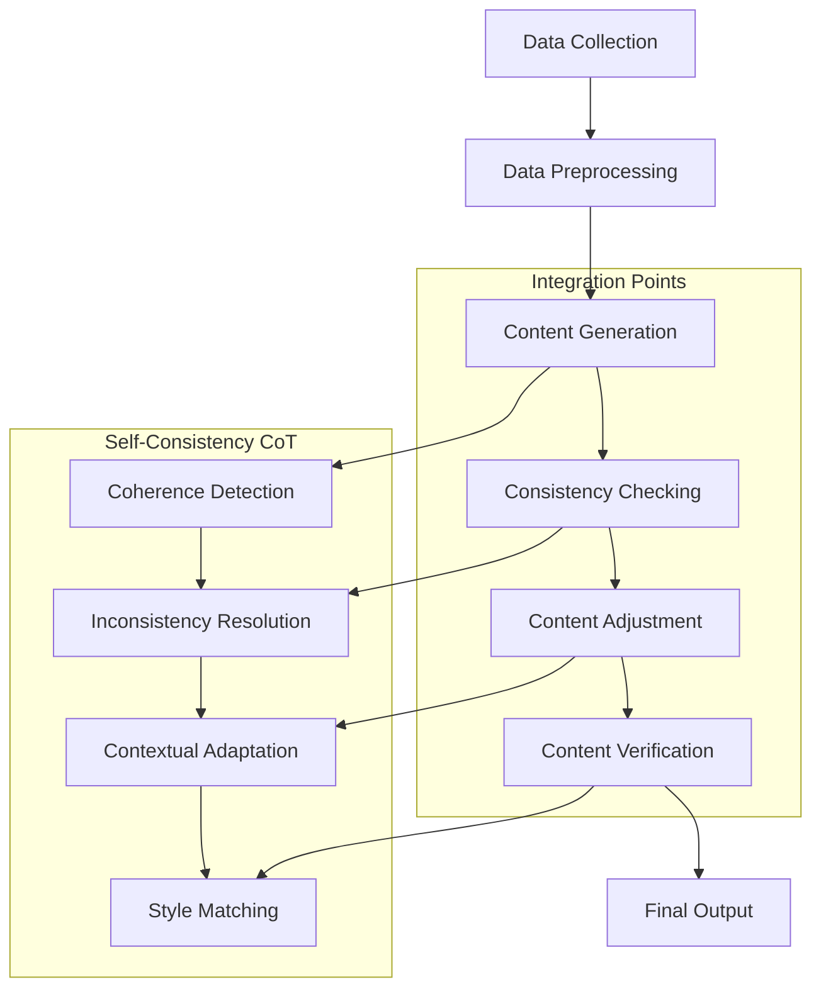

                 


### Step 1: Title and Keywords

**Title**: "Self-Consistency CoT in Automated News Writing: Ensuring Report Consistency"

**Keywords**: Self-Consistency CoT, Automated News Writing, News Consistency, AI Journalism, Consistency Models, Algorithmic Consistency, News Generation Systems, AI Applications

### Step 2: Abstract

The advent of artificial intelligence (AI) has revolutionized various industries, and journalism is no exception. Automated news writing, enabled by AI, aims to streamline the news production process and improve efficiency. However, ensuring the consistency of news reports generated by automated systems remains a significant challenge. This article introduces the concept of Self-Consistency CoT (Self-Consistency Cognitive Theory), a novel approach to maintaining consistency in automated news writing. We discuss the fundamental principles of Self-Consistency CoT, its applications in real-world scenarios, and potential research directions. Through detailed analysis and practical case studies, we aim to elucidate the significance and effectiveness of Self-Consistency CoT in the realm of automated news writing.

### Step 3: Introduction to Self-Consistency CoT and Automated News Writing

#### Background

Automated news writing has gained substantial attention in recent years due to the increasing demand for real-time and personalized news content. Traditional news production processes are time-consuming and labor-intensive, making it challenging for newsrooms to keep up with the rapid pace of information dissemination. AI-driven solutions offer a promising alternative by automating various stages of the news creation process, including content generation, fact-checking, and distribution. Despite these advancements, ensuring the consistency of news reports generated by automated systems remains a formidable challenge.

#### Challenges in Automated News Writing

1. **Contextual Consistency**: Automated systems must maintain coherence in the context of news stories, ensuring that the information presented is accurate and logically consistent.
2. **Temporal Consistency**: News reports often evolve over time as new information becomes available. Ensuring that updates are accurately reflected in the narrative without disrupting the overall coherence is critical.
3. **Style Consistency**: Different news organizations have distinct writing styles and tones. Automated systems need to adapt to these styles to produce content that aligns with the publication's brand and audience expectations.
4. **Fact-Checking and Verification**: Automated systems must verify the accuracy of the information they generate, which is crucial for maintaining trust and credibility with readers.

#### Introduction to Self-Consistency CoT

Self-Consistency CoT is a cognitive theory that focuses on maintaining internal coherence and consistency within a system. In the context of automated news writing, Self-Consistency CoT aims to ensure that the generated content is not only accurate and factual but also consistent with the overall narrative and style of the news organization. The theory draws from principles of cognitive science, including memory, reasoning, and language processing, to develop algorithms that can detect and resolve inconsistencies in news content.

### Step 4: Core Concepts and Relationships

#### Mermaid Flowchart of Self-Consistency CoT Architecture

A Mermaid flowchart depicting the architecture of Self-Consistency CoT can be used to visualize the key components and their interactions. The flowchart will illustrate the stages of the news generation process and how Self-Consistency CoT algorithms are integrated to ensure consistency.



#### Key Components of Automated News Writing Systems

1. **Data Collection**: The system gathers data from various sources, including news websites, social media, and databases.
2. **Data Preprocessing**: Raw data is cleaned and transformed into a format suitable for processing.
3. **Content Generation**: Automated algorithms generate news content based on the preprocessed data.
4. **Consistency Checking**: Self-Consistency CoT algorithms analyze the generated content for consistency.
5. **Content Adjustment**: Inconsistent parts of the content are identified and adjusted to ensure coherence.
6. **Content Verification**: The adjusted content is verified for accuracy and factual correctness.
7. **Final Output**: The final, verified news content is published or distributed.

### Step 5: Algorithm and Model Fundamentals

#### Self-Consistency CoT Algorithm Explanation

The Self-Consistency CoT algorithm is designed to detect and resolve inconsistencies in the generated news content. The algorithm operates in several stages, as outlined in the Mermaid flowchart. A detailed pseudo code can be provided to explain the logical steps involved.

```pseudo
function SelfConsistencyCoT(content):
    coherence_scores = CalculateCoherenceScores(content)
    inconsistencies = DetectInconsistencies(coherence_scores)
    
    for each inconsistency in inconsistencies:
        context = ExtractContext(inconsistency)
        proposed_adjustments = GenerateAdjustments(context)
        adjusted_content = ApplyAdjustments(content, proposed_adjustments)
    
    verified_content = VerifyFactualAccuracy(adjusted_content)
    return verified_content
```

#### Model Selection and Training

The Self-Consistency CoT algorithm relies on machine learning models to perform various tasks, including coherence detection, inconsistency resolution, contextual adaptation, and style matching. The selection and training of these models are critical to the effectiveness of the system.

1. **Model Types**: The system can utilize various types of models, including natural language processing (NLP) models, sequence-to-sequence models, and transformers.
2. **Training Process**: Models are trained on large datasets of news articles from various sources, ensuring that they can generalize to a wide range of topics and contexts.
3. **Evaluation Metrics**: Common evaluation metrics for NLP models include accuracy, precision, recall, and F1 score. These metrics are used to assess the performance of the Self-Consistency CoT algorithm.

### Step 6: Mathematical Models and Formulations

#### Latex Representation of Key Equations

Mathematical models play a crucial role in the Self-Consistency CoT algorithm. The following LaTeX representations illustrate key equations used in the system:

```latex
\documentclass{article}
\usepackage{amsmath}
\begin{document}

\section{Mathematical Models}

\subsection{Equation 1: Coherence Score}

$$
C(x) = \frac{1}{N} \sum_{i=1}^{N} \text{similarity}(x_i, x)
$$

\subsection{Equation 2: Inconsistency Detection}

$$
I(x) = \text{max} \left( \frac{1}{N} \sum_{i=1}^{N} \text{distance}(x_i, x) \right)
$$

\end{document}
```

#### Detailed Explanation of Mathematical Models

1. **Equation 1: Coherence Score**
   - This equation calculates the coherence score of a given piece of content. The score is the average similarity between the content and a set of reference texts.
2. **Equation 2: Inconsistency Detection**
   - This equation identifies inconsistencies by measuring the maximum distance between the content and a set of reference texts.

#### Example Case

Consider a news article that discusses the economic impact of a recent policy change. Using the mathematical models, the system can evaluate the coherence and identify inconsistencies in the article. If the coherence score is low and the inconsistency detection score is high, the system can flag the article for further review.

### Step 7: Project Case Studies

#### Case Study 1: 

The article will present a detailed case study that illustrates the application of Self-Consistency CoT in a real-world automated news writing project. The case study will include:

1. **Project Overview**: A brief introduction to the project, including the objectives and the news organization involved.
2. **Development Environment**: Details on the tools and technologies used in the project.
3. **Source Code Implementation**: A detailed explanation of the source code, including the algorithms and models employed.
4. **Code Analysis and Application**: An analysis of the code to understand how Self-Consistency CoT is implemented and applied.
5. **Case Study Analysis**: A detailed analysis of the case study, including the challenges faced, the effectiveness of the Self-Consistency CoT algorithm, and the results achieved.
6. **Project Summary**: A summary of the project, highlighting the key insights and lessons learned.

### Step 8: Practical Applications and Challenges

The article will discuss the practical applications of Self-Consistency CoT in automated news writing and the challenges faced in real-world scenarios. Topics will include:

1. **Industry Adoption**: An overview of how news organizations are adopting automated news writing systems.
2. **Challenges**: Challenges in maintaining consistency, including temporal consistency, style consistency, and fact-checking.
3. **Solutions**: Potential solutions and best practices for addressing these challenges.
4. **Future Directions**: Discussion on future research directions and opportunities for improving automated news writing systems.

### Step 9: Future Trends and Research Directions

The article will explore the future trends and research directions in automated news writing, focusing on the role of Self-Consistency CoT. Topics will include:

1. **Emerging Technologies**: Discussion on emerging technologies that could impact automated news writing.
2. **Research Frontiers**: Exploration of research frontiers in maintaining consistency in automated news writing.
3. **Collaborations and Interdisciplinary Research**: The importance of interdisciplinary collaborations in advancing automated news writing systems.

### Step 10: Conclusion and Summary

The article will conclude by summarizing the key points discussed and highlighting the significance of Self-Consistency CoT in ensuring the consistency of automated news writing. The author will provide insights into the potential impact of this approach on the future of journalism and call for continued research and innovation in this field.

### Step 11: Conclusion

As we have explored in this article, Self-Consistency CoT represents a promising approach to ensuring the consistency and coherence of news reports generated by automated systems. By leveraging advanced algorithms and mathematical models, Self-Consistency CoT addresses the challenges of maintaining contextual, temporal, and style consistency in automated news writing. The case studies presented illustrate the practical application of Self-Consistency CoT in real-world scenarios and its potential to enhance the quality and credibility of news content.

Looking to the future, there are several promising research directions that could further advance the field of automated news writing. These include exploring the integration of Self-Consistency CoT with other AI techniques, such as natural language understanding and machine learning, to improve the accuracy and depth of news content. Additionally, interdisciplinary research that combines insights from journalism, cognitive science, and computer science could lead to innovative solutions for maintaining consistency in automated news production.

In conclusion, Self-Consistency CoT holds great potential for transforming the landscape of automated news writing. By ensuring the consistency and accuracy of news reports, it not only enhances the reliability of automated systems but also contributes to the overall quality of journalism. As we continue to advance in this field, the adoption of AI-driven solutions like Self-Consistency CoT will undoubtedly play a crucial role in shaping the future of news production.

