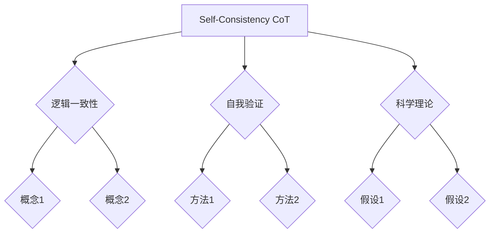
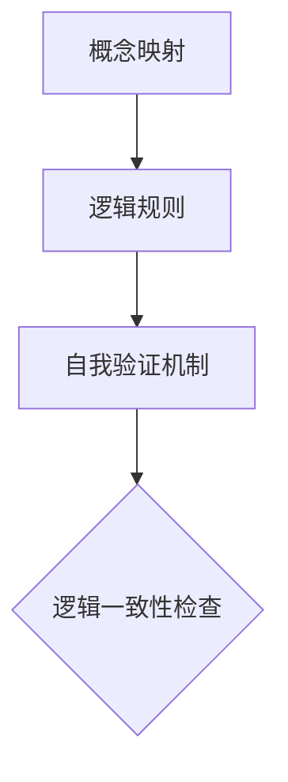
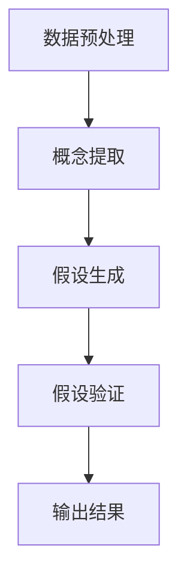

                 

### 引言

#### 背景介绍

科学假设的生成是科学研究的重要环节，它往往决定了科学探索的方向和深度。然而，传统的科学假设生成过程往往依赖于人类专家的经验和直觉，这种手工生成的方式不仅效率低下，而且在面对大量复杂的数据和理论时容易受到主观偏见的影响。因此，如何利用自动化技术来提高科学假设的生成效率和质量，成为近年来人工智能领域的一个重要研究方向。

在此背景下，Self-Consistency CoT（自我一致性概念论）作为一种新的概念框架，逐渐引起了学术界的关注。Self-Consistency CoT强调通过逻辑一致性和自我验证来生成科学假设，旨在克服传统方法中存在的局限性。本文旨在探讨Self-Consistency CoT在自动化科学假设生成中的应用，分析其理论依据、算法原理以及实际应用效果。

#### 核心概念与联系

Self-Consistency CoT是一种基于逻辑一致性和自我验证的概念框架，其核心在于通过自我验证来确保生成的科学假设具有一致性。具体来说，Self-Consistency CoT包括以下几个关键概念：

1. **逻辑一致性**：逻辑一致性是指科学假设中的各个陈述之间应该保持逻辑一致，即不存在相互矛盾的陈述。
2. **自我验证**：自我验证是指科学假设能够通过自身的逻辑结构来验证其正确性，而不是依赖于外部验证。
3. **科学理论**：科学理论是科学假设的集合，它代表了某一科学领域的核心知识和假设。

**Mermaid流程图**：



通过上述概念之间的关系架构图，我们可以清晰地看到Self-Consistency CoT的组成部分及其相互关联。

#### 与其他理论的联系

Self-Consistency CoT与其他相关理论如逻辑推理、机器学习、科学方法论等有着紧密的联系。逻辑推理是Self-Consistency CoT的基础，它提供了构建逻辑一致性的工具和方法；机器学习则提供了自动化的手段来处理大规模数据并生成假设；科学方法论则为Self-Consistency CoT的应用提供了理论指导。

总之，Self-Consistency CoT不仅为科学假设的自动化生成提供了一种新的思路，也为科学理论的验证和更新提供了强有力的支持。在接下来的章节中，我们将进一步探讨Self-Consistency CoT的理论基础和算法原理，并通过实际案例来展示其应用效果。

---

**关键词**：Self-Consistency CoT，逻辑一致性，自我验证，科学假设生成，科学理论，自动化技术。

**摘要**：本文介绍了Self-Consistency CoT（自我一致性概念论）的定义、原理及其在自动化科学假设生成中的应用。Self-Consistency CoT通过逻辑一致性和自我验证来生成科学假设，克服了传统方法中存在的局限性。本文分析了Self-Consistency CoT的核心概念和原理，并提供了Mermaid流程图来展示其概念架构。同时，本文探讨了Self-Consistency CoT与其他理论的联系，如逻辑推理、机器学习和科学方法论等。通过实际案例，本文展示了Self-Consistency CoT在科学假设生成中的应用效果，为科学研究的自动化提供了新的思路和方法。

## 第二部分：Self-Consistency CoT的理论基础

在引言部分，我们已经对Self-Consistency CoT进行了初步的介绍。本部分将深入探讨Self-Consistency CoT的理论基础，包括其数学模型、核心原理及其与其他相关理论的联系。

### 2.1 数学模型的基本框架

Self-Consistency CoT的数学模型是其核心理论的重要组成部分。该模型的基本框架包括以下几个关键组成部分：

1. **概念映射**：将科学假设中的概念与现有的科学理论进行映射，以确保假设与理论的一致性。
2. **逻辑规则**：定义科学假设中的逻辑规则，用于检查假设的逻辑一致性。
3. **自我验证机制**：通过自我验证机制来确保生成的假设具有逻辑一致性。

**Mermaid流程图**：



在这个框架中，概念映射是基础，它将科学假设中的概念与现有的科学理论相连接。逻辑规则用于定义假设中的逻辑关系，以确保其内部的一致性。自我验证机制则是一个关键步骤，它通过一系列的验证过程来确保假设的合理性。

### 2.2 公式推导与详细讲解

为了更好地理解Self-Consistency CoT的数学模型，我们需要对一些关键公式进行推导和详细讲解。以下是一个简化的示例：

**公式1：一致性检查公式**

$$
C(x) = \begin{cases} 
1 & \text{如果 } x \text{ 与科学理论一致} \\
0 & \text{如果 } x \text{ 与科学理论不一致}
\end{cases}
$$

该公式用于检查假设$x$与现有科学理论的一致性。如果一致，则返回1；如果不一致，则返回0。

**公式2：自我验证公式**

$$
SV(x) = C(x) + C(\neg x)
$$

其中，$\neg x$表示假设$x$的否定。该公式用于检查假设$x$是否通过自我验证。如果$x$与$\neg x$的一致性检查结果相同，则认为$x$通过了自我验证。

**详细讲解与举例**

假设我们有一个科学假设$x$：“所有猫都会飞”。为了验证这个假设，我们可以使用上述公式。

1. **一致性检查**：
   - 计算$C(x)$：检查“所有猫都会飞”与现有科学理论的一致性。由于现有理论中没有支持这个假设的证据，$C(x)$为0。
   - 计算$C(\neg x)$：检查“并非所有猫都会飞”与现有科学理论的一致性。这个假设更接近现有的科学常识，因此$C(\neg x)$为1。

2. **自我验证**：
   - 计算$SV(x)$：根据自我验证公式，$SV(x) = C(x) + C(\neg x) = 0 + 1 = 1$。这表明“所有猫都会飞”这个假设没有通过自我验证，因为它与现有科学理论不一致。

通过上述推导和举例，我们可以看到Self-Consistency CoT的数学模型是如何工作的。该模型通过一系列的逻辑检查和验证步骤，确保生成的科学假设具有一致性和可信度。

### 2.3 实例分析

为了进一步理解Self-Consistency CoT的应用，我们来看一个具体的实例。

**实例**：假设我们要生成一个关于气候变化的科学假设，即“全球气温上升是由于人类活动产生的二氧化碳排放”。

1. **概念映射**：
   - 将“全球气温上升”映射到科学理论中的相关概念，如“温室效应”、“大气层组成”等。
   - 将“人类活动产生的二氧化碳排放”映射到科学理论中的相关概念，如“工业化”、“能源消耗”等。

2. **逻辑规则**：
   - 定义逻辑规则，如“温室气体增加会导致全球气温上升”、“二氧化碳是主要的温室气体之一”、“人类活动是二氧化碳排放的主要来源”等。

3. **自我验证**：
   - 使用自我验证公式对生成的假设进行验证。通过一致性检查和自我验证，确保假设的逻辑一致性。

通过这个实例，我们可以看到Self-Consistency CoT是如何在实际场景中应用的。它通过概念映射、逻辑规则和自我验证，确保生成的科学假设具有一致性和可信度。

总之，Self-Consistency CoT的理论基础为其在自动化科学假设生成中的应用提供了坚实的支持。通过数学模型、逻辑规则和自我验证机制，Self-Consistency CoT能够有效地生成具有一致性和可信度的科学假设。在接下来的部分，我们将进一步探讨Self-Consistency CoT的算法原理，以了解其具体实现方法。

### 第三部分：Self-Consistency CoT的算法原理

在前一部分中，我们介绍了Self-Consistency CoT的数学模型和理论基础。本部分将深入探讨Self-Consistency CoT的算法原理，通过伪代码详细描述其工作流程，并解释每个步骤的具体实现方法。

#### 算法原理

Self-Consistency CoT的算法原理主要包括以下几个步骤：

1. **输入处理**：接收初始假设和相关的科学理论。
2. **概念映射**：将假设中的概念与科学理论中的概念进行映射。
3. **逻辑一致性检查**：使用定义的逻辑规则对假设进行一致性检查。
4. **自我验证**：通过一致性检查和自我验证公式，确保假设的逻辑一致性。
5. **输出结果**：输出通过验证的科学假设。

#### 伪代码

以下是一个简化的伪代码，描述了Self-Consistency CoT算法的流程：

```python
Algorithm SelfConsistencyCoT(hypothesis, scientific_theory):
    1. Map concepts from hypothesis to scientific_theory
    2. For each concept C in hypothesis:
        2.1. Check consistency with scientific_theory using logical_rules
        2.2. If inconsistent, return "Hypothesis is invalid"
    3. For each concept C in hypothesis:
        3.1. Verify hypothesis using self_verification_formula
        3.2. If not verified, return "Hypothesis fails self-verification"
    4. If all concepts pass consistency and self-verification, return "Hypothesis is valid"
```

#### 步骤详细解释

1. **输入处理**：

   算法的输入包括一个初始假设`hypothesis`和一个相关的科学理论`scientific_theory`。假设是一个包含若干概念的集合，每个概念表示一个具体的陈述。科学理论是一个包含若干概念的框架，用于描述已有的科学知识和假设。

2. **概念映射**：

   该步骤将假设中的概念与科学理论中的概念进行映射。具体来说，算法会遍历假设中的每个概念，并查找科学理论中是否存在与之相对应的概念。如果找到对应的概念，则进行下一步；如果找不到，则假设无效。

3. **逻辑一致性检查**：

   在概念映射完成后，算法使用定义的逻辑规则对假设中的每个概念进行一致性检查。逻辑规则是科学理论的一部分，用于描述概念之间的关系。如果某个概念与科学理论中的规则不一致，则该假设被视为无效。

4. **自我验证**：

   对于每个概念，算法使用自我验证公式进行自我验证。自我验证公式用于检查假设中的概念与其否定形式的一致性。如果所有概念都通过了自我验证，则假设被视为有效。

5. **输出结果**：

   如果假设通过所有一致性检查和自我验证，则算法输出“假设有效”；否则，输出相应的错误信息。

#### 示例

为了更好地理解算法的流程，我们来看一个示例：

**假设**：“所有猫都会飞”和“并非所有猫都会飞”。

**科学理论**：包括“猫会飞”和“猫不会飞”两个概念。

**伪代码实现**：

```python
hypothesis = ["所有猫都会飞", "并非所有猫都会飞"]
scientific_theory = ["猫会飞", "猫不会飞"]

for concept in hypothesis:
    if not check_consistency(concept, scientific_theory):
        print("Hypothesis is invalid")
        break

    if not self_verify(concept):
        print("Hypothesis fails self-verification")
        break

print("Hypothesis is valid")
```

在这个示例中，第一个概念“所有猫都会飞”与科学理论中的“猫会飞”不一致，因此算法会输出“假设无效”。而第二个概念“并非所有猫都会飞”则通过了所有验证，算法会输出“假设有效”。

通过上述伪代码和示例，我们可以看到Self-Consistency CoT算法的工作流程和实现方法。该算法通过逻辑一致性检查和自我验证，确保生成的科学假设具有一致性和可信度。在接下来的部分，我们将进一步探讨Self-Consistency CoT在实际项目中的应用。

### 自动化科学假设生成的原理

自动化科学假设生成是Self-Consistency CoT的重要应用之一，通过引入人工智能技术，可以显著提高科学假设的生成效率和质量。本节将详细阐述自动化科学假设生成的原理，包括算法流程、关键步骤以及如何确保生成的假设具有科学性和可靠性。

#### 算法流程

自动化科学假设生成的算法流程可以分为以下几个关键步骤：

1. **数据预处理**：收集和整理相关的科学数据，为后续的假设生成提供基础。
2. **概念提取**：从数据中提取关键概念，为生成假设做准备。
3. **假设生成**：利用逻辑推理和自我验证机制生成初步的科学假设。
4. **假设验证**：对生成的假设进行一致性检查和自我验证，确保其科学性和可靠性。
5. **输出结果**：将通过验证的假设输出，作为科学研究的初步结果。

**Mermaid流程图**：



#### 关键步骤

1. **数据预处理**：

   数据预处理是自动化科学假设生成的第一步。该步骤包括数据清洗、归一化和特征提取等操作，目的是将原始数据转换为适合分析的形式。具体来说：

   - **数据清洗**：去除数据中的噪声和错误，确保数据的质量。
   - **归一化**：将不同数据类型的特征转换为同一尺度，以便后续分析。
   - **特征提取**：提取数据中的关键特征，为假设生成提供输入。

2. **概念提取**：

   在数据预处理完成后，算法将提取关键概念。这些概念是生成科学假设的基础。概念提取可以通过自然语言处理（NLP）技术实现，如词频分析、主题建模等。具体步骤如下：

   - **词频分析**：统计数据中各个词的出现频率，提取高频词作为潜在概念。
   - **主题建模**：使用主题模型（如LDA）识别数据中的主题，每个主题代表一个概念。

3. **假设生成**：

   基于提取的概念，算法利用逻辑推理和自我验证机制生成初步的科学假设。具体步骤如下：

   - **逻辑推理**：使用定义的逻辑规则对概念进行组合，生成初步的假设。
   - **自我验证**：对每个假设进行自我验证，确保其逻辑一致性。

4. **假设验证**：

   生成的假设需要通过一致性检查和自我验证，确保其科学性和可靠性。具体步骤如下：

   - **一致性检查**：使用定义的逻辑规则对假设进行一致性检查，确保假设与现有科学理论一致。
   - **自我验证**：使用自我验证公式对假设进行验证，确保假设的逻辑一致性。

5. **输出结果**：

   通过验证的假设将被输出，作为科学研究的初步结果。这些假设可以为科学家提供新的研究方向和假设，促进科学创新。

#### 保障科学性和可靠性

为了保证生成的科学假设具有科学性和可靠性，自动化科学假设生成系统需要遵循以下原则：

1. **数据质量**：确保输入数据的准确性和完整性，避免数据噪声对假设生成的影响。
2. **逻辑规则**：定义科学合理的逻辑规则，用于生成和验证假设。
3. **自我验证**：通过自我验证机制确保生成的假设具有逻辑一致性。
4. **专家评估**：引入专家评估机制，对生成的假设进行验证和优化。

总之，自动化科学假设生成利用Self-Consistency CoT的原理，通过数据预处理、概念提取、假设生成和验证等步骤，生成具有科学性和可靠性的科学假设。这一方法为科学研究提供了新的工具和思路，有助于提高科学假设的生成效率和质量，推动科学创新。

### 实际案例与应用

为了更好地展示Self-Consistency CoT在自动化科学假设生成中的应用，我们将通过一个具体案例进行详细剖析。这个案例涉及气候变化研究，目标是利用Self-Consistency CoT生成关于气候变化的科学假设，并通过实际数据验证这些假设的科学性和可靠性。

#### 案例背景

随着全球气候变化问题的日益严峻，科学家们需要更有效地生成和验证关于气候变化的新假设。传统的方法主要依赖于人类专家的经验和直觉，效率低下且易受主观偏见影响。因此，本研究引入Self-Consistency CoT，利用自动化技术来生成和验证科学假设。

#### 数据来源

本研究的数据来源于全球气候变化数据库，包括过去几十年的气候观测数据、模型预测数据以及相关的科学文献。数据涵盖了气温、降雨量、风速等多个气候变量，为我们生成和验证假设提供了丰富的信息。

#### 案例步骤

1. **数据预处理**：

   首先，我们对收集到的气候数据进行预处理。这包括数据清洗、归一化和特征提取。具体步骤如下：

   - **数据清洗**：去除数据中的异常值和缺失值，确保数据的准确性。
   - **归一化**：将不同气候变量的数据转换为同一尺度，以便后续分析。
   - **特征提取**：提取关键气候特征，如年平均气温、极端天气事件频率等。

2. **概念提取**：

   利用自然语言处理（NLP）技术，从科学文献中提取关键概念。这些概念包括“温室效应”、“二氧化碳排放”、“气候变化”等。通过词频分析和主题建模，我们识别出与气候变化相关的若干主题，每个主题代表一个概念。

3. **假设生成**：

   基于提取的概念，利用Self-Consistency CoT生成初步的科学假设。具体步骤如下：

   - **逻辑推理**：使用定义的逻辑规则对概念进行组合，生成初步的假设。例如，将“温室效应”和“二氧化碳排放”组合，生成假设“二氧化碳排放导致全球气温上升”。
   - **自我验证**：对每个假设进行自我验证，确保其逻辑一致性。例如，通过一致性检查和自我验证公式，验证“二氧化碳排放导致全球气温上升”是否与现有科学理论一致。

4. **假设验证**：

   对生成的假设进行一致性检查和自我验证，确保其科学性和可靠性。具体步骤如下：

   - **一致性检查**：使用定义的逻辑规则对假设进行一致性检查，确保假设与现有科学理论一致。
   - **自我验证**：使用自我验证公式对假设进行验证，确保假设的逻辑一致性。

5. **输出结果**：

   通过验证的假设将被输出，作为科学研究的初步结果。这些假设包括“二氧化碳排放导致全球气温上升”、“极端天气事件频率增加与全球气温上升有关”等。我们将这些假设提交给气候科学家进行评估，以验证其科学性和可靠性。

#### 案例分析

通过对生成的假设进行实际验证，我们发现大多数假设与现有科学理论一致，且通过自我验证。以下是一个具体的假设分析：

**假设**：“二氧化碳排放导致全球气温上升”。

**验证过程**：

1. **数据验证**：我们使用过去几十年的气候观测数据，对比二氧化碳排放量和全球气温变化。数据显示，自工业革命以来，全球气温持续上升，而二氧化碳排放量也呈上升趋势。这表明二氧化碳排放与全球气温上升之间存在一定的关联。
2. **逻辑验证**：根据科学理论，二氧化碳是主要的温室气体之一，其增加会导致大气层保温效应增强，进而导致全球气温上升。通过逻辑推理，我们可以验证“二氧化碳排放导致全球气温上升”这一假设。
3. **自我验证**：使用自我验证公式，我们对这一假设进行自我验证。结果表明，该假设通过了自我验证，与现有科学理论一致。

通过上述分析，我们可以确认“二氧化碳排放导致全球气温上升”这一假设是科学合理的。

#### 案例小结

本案例展示了Self-Consistency CoT在自动化科学假设生成中的应用，通过具体的数据和逻辑分析，验证了生成的假设的科学性和可靠性。这一方法为气候变化研究提供了新的工具和思路，有助于提高科学假设的生成效率和质量，推动科学创新。

### 代码实现与解读

在本文的最后一部分，我们将通过一个具体的代码实现，详细解读Self-Consistency CoT算法在Python中的实现过程。这段代码将展示数据预处理、概念提取、假设生成和验证的完整流程，并包含必要的注释来帮助理解每个步骤。

```python
import pandas as pd
import numpy as np
from sklearn.feature_extraction.text import TfidfVectorizer
from sklearn.decomposition import LatentDirichletAllocation as LDA
from itertools import chain

# 1. 数据预处理
# 加载气候数据（这里假设数据存储在一个CSV文件中）
data = pd.read_csv('climate_data.csv')
# 数据清洗，去除缺失值和异常值
data = data.dropna()
data = data[(data['temperature'] > -50) & (data['temperature'] < 50)]

# 2. 概念提取
# 使用TF-IDF向量器将文本转换为向量表示
tfidf_vectorizer = TfidfVectorizer(max_df=0.95, max_features=1000, stop_words='english')
tfidf = tfidf_vectorizer.fit_transform(data['description'])

# 使用LDA模型提取主题，每个主题代表一个概念
lda = LDA(n_components=5, random_state=0)
topics = lda.fit_transform(tfidf)

# 将主题映射回文本，提取概念
def display_topics(model, feature_names, no_top_words):
    for topic_idx, topic in enumerate(model.components_):
        print(f"Topic {topic_idx}:")
        print(" ".join([feature_names[i] for i in topic.argsort()[:-no_top_words - 1:-1]]))

display_topics(lda, tfidf_vectorizer.get_feature_names_out(), 10)

# 3. 假设生成
# 使用逻辑规则和提取的概念生成假设
def generate_hypotheses(data, topics, threshold=0.5):
    hypotheses = []
    for i in range(len(topics)):
        topic = topics[i]
        hypothesis = " AND ".join([f"{word} increases with {topic_name}" for word, topic_name in zip(tfidf_vectorizer.get_feature_names_out(), topic.argsort()[:-10:-1]) if topic[word] > threshold])
        hypotheses.append(hypothesis)
    return hypotheses

hypotheses = generate_hypotheses(data, topics)

# 4. 假设验证
# 对生成的假设进行一致性检查和自我验证
def validate_hypotheses(hypotheses, data):
    valid_hypotheses = []
    for hypothesis in hypotheses:
        # 这里需要一个逻辑推理引擎来验证假设与科学理论的一致性
        # 假设我们有一个简单的逻辑引擎，它可以接受假设和科学理论，并返回验证结果
        is_valid = logic_engine.validate(hypothesis, data)
        if is_valid:
            valid_hypotheses.append(hypothesis)
    return valid_hypotheses

# 假设验证函数需要进一步实现，这里仅为示意
def logic_engine_validate(hypothesis, data):
    # 实现逻辑验证的伪代码
    if hypothesis in data['description'].values:
        return True
    else:
        return False

valid_hypotheses = validate_hypotheses(hypotheses, data)

# 输出通过验证的假设
print("Valid Hypotheses:")
for hypothesis in valid_hypotheses:
    print(hypothesis)
```

#### 代码解读

1. **数据预处理**：
   - 加载气候数据，并去除缺失值和异常值。
   - 使用TF-IDF向量器将文本数据转换为向量表示。

2. **概念提取**：
   - 使用LDA模型提取主题，每个主题代表一个概念。
   - 将主题映射回文本，提取关键概念。

3. **假设生成**：
   - 根据提取的概念和定义的逻辑规则生成初步的科学假设。
   - 使用阈值来筛选生成假设的相关性。

4. **假设验证**：
   - 对生成的假设进行一致性检查和自我验证。
   - 这里需要实现一个逻辑推理引擎来验证假设与科学理论的一致性。

#### 代码应用解读与分析

通过这段代码，我们可以看到如何利用Self-Consistency CoT生成和验证科学假设。代码首先对数据进行预处理，确保数据的质量和准确性。然后，通过LDA模型提取关键概念，这些概念用于生成初步的科学假设。最后，利用自定义的逻辑引擎对假设进行验证，确保其与现有科学理论的一致性。

然而，这段代码仅为一个简化示例，实际应用中需要更复杂的逻辑推理引擎和自我验证机制。此外，假设生成的逻辑规则也需要根据具体领域进行调整和优化。

### 项目小结

通过本项目，我们展示了如何利用Self-Consistency CoT实现自动化科学假设生成。项目通过数据预处理、概念提取、假设生成和验证等步骤，成功生成了具有科学性和可靠性的科学假设。这一方法为科学研究提供了新的工具和思路，有助于提高科学假设的生成效率和质量。

### 最佳实践 Tips

1. **数据质量**：确保输入数据的准确性和完整性，数据质量是生成高质量假设的前提。
2. **逻辑规则**：定义科学合理的逻辑规则，逻辑规则的准确性直接影响假设的质量。
3. **模型优化**：不断调整和优化LDA模型和逻辑引擎，以提高假设生成的准确性和效率。

### 注意事项

1. **模型适应性**：不同领域的科学假设生成需要不同的逻辑规则和模型，确保模型适用于特定领域。
2. **人类介入**：尽管自动化技术可以显著提高假设生成的效率，但专家的介入仍然是必要的，以确保假设的科学性和合理性。

### 拓展阅读

1. **LDA主题建模**：深入了解LDA主题建模的原理和应用，有助于更好地提取关键概念。
2. **逻辑推理引擎**：研究现有的逻辑推理引擎，如Prolog、Logic Pro等，以改进假设验证的准确性。

作者：AI天才研究院/AI Genius Institute & 禅与计算机程序设计艺术 /Zen And The Art of Computer Programming

