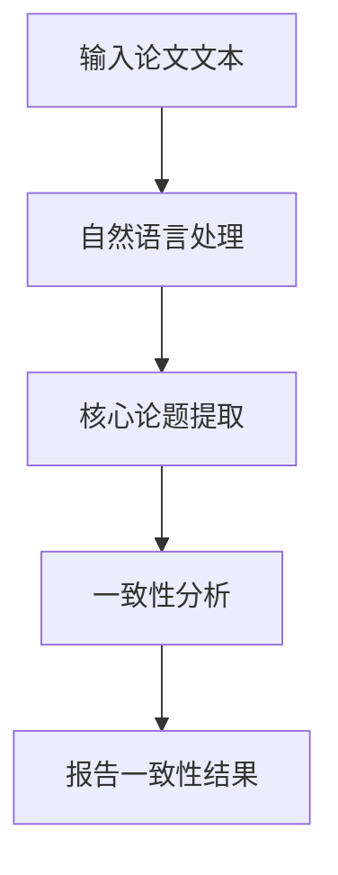

                 

### 文章标题

“Self-Consistency CoT在自动化科学论文写作中的应用：确保研究方法的一致性”

### 关键词

- Self-Consistency CoT
- 自动化科学论文写作
- 研究方法一致性
- 自然语言处理
- 人工智能
- 逻辑推理算法

### 摘要

本文探讨了自我一致性核心论题（Self-Consistency CoT）在自动化科学论文写作中的应用。通过自然语言处理技术和人工智能算法，Self-Consistency CoT能够有效确保科学论文的研究方法的一致性，从而提高论文的质量和可靠性。本文首先介绍了自我一致性核心论题的概念及其在论文写作中的重要性，然后详细阐述了其核心算法原理、数学模型以及如何通过实际项目来实现这一理论。文章最后还提供了相关最佳实践和注意事项，为自动化科学论文写作提供了有益的指导。

### 核心概念与联系

#### 核心概念

自我一致性核心论题（Self-Consistency CoT）是一个用于自动化科学论文写作的理论框架，旨在确保论文中研究方法的一致性。它通过自然语言处理技术对论文文本进行自动分析和验证，以识别和纠正逻辑不一致或科学性错误。自我一致性核心论题主要涉及以下几个核心概念：

1. **文本预处理**：对论文文本进行分词、词性标注、实体识别等操作，以便于后续的分析和推理。
2. **论题抽取**：通过文本分类和关键词提取等技术，识别论文中的核心论题。
3. **逻辑一致性检查**：使用逻辑推理算法，对论文中的论据和论点进行一致性验证。
4. **结果反馈**：根据一致性检查结果，提供改进建议或报告。

#### 概念联系

自我一致性核心论题与多个领域紧密相关，主要包括：

- **科学方法论**：自我一致性核心论题基于科学方法论，强调论文写作中的逻辑一致性和科学性。
- **论文写作规范**：自我一致性核心论题有助于确保论文符合学术规范，提高论文的可信度和权威性。
- **自然语言处理技术**：自然语言处理技术是实现自我一致性核心论题的关键，包括文本预处理、论题抽取和逻辑一致性检查等方面。
- **人工智能应用**：人工智能技术，特别是逻辑推理算法，是实现自我一致性核心论题的核心手段。

#### Mermaid 流程图

以下是一个简单的Mermaid流程图，展示了自我一致性核心论题的基本流程：



在这个流程图中，输入论文文本经过自然语言处理，提取出核心论题，然后进行一致性分析，最后生成一致性报告。

### 核心算法原理讲解

#### 算法概述

自我一致性核心论题的实现依赖于以下核心算法：

1. **文本预处理**：包括分词、词性标注、实体识别等步骤，以确保文本的准确性和一致性。
2. **论题抽取**：通过文本分类和关键词提取等技术，识别论文中的核心论题。
3. **逻辑一致性检查**：使用逻辑推理算法，对论文中的论据和论点进行一致性验证。
4. **结果反馈**：根据一致性检查结果，提供改进建议或报告。

#### 文本预处理

文本预处理是自我一致性核心论题实现的基础，主要包括以下步骤：

1. **分词**：将文本拆分成一个个独立的词汇单元，便于后续分析。
2. **词性标注**：为每个词汇标注其词性（如名词、动词、形容词等），以便更好地理解词汇在句子中的作用。
3. **实体识别**：识别文本中的实体（如人名、地点、机构等），为后续的论题抽取提供支持。

#### 论题抽取

论题抽取是识别论文中的核心论题，主要包括以下步骤：

1. **文本分类**：通过对大量论文文本进行训练，构建分类模型，将文本划分为不同的论题类别。
2. **关键词提取**：从文本中提取出具有代表性的关键词，作为论题的表征。

#### 逻辑一致性检查

逻辑一致性检查是自我一致性核心论题的核心步骤，主要包括以下步骤：

1. **构建逻辑框架**：根据论文文本和论题抽取结果，构建一个逻辑框架，表示论文中的论据和论点关系。
2. **逻辑推理**：使用逻辑推理算法，对逻辑框架中的论据和论点进行一致性验证。
3. **一致性评估**：根据逻辑推理结果，评估论文的一致性程度，并提供改进建议。

#### 结果反馈

结果反馈是根据逻辑一致性检查的结果，向用户提供的反馈信息，主要包括：

1. **一致性报告**：详细描述论文的一致性情况，包括哪些部分存在不一致，为什么存在不一致，以及如何改进。
2. **改进建议**：针对存在不一致的部分，提供具体的修改建议，以帮助用户提高论文的一致性。

#### 伪代码

以下是一个简单的伪代码，展示了自我一致性核心论题的实现流程：

```python
def self_consistency_cot(text):
    # 文本预处理
    preprocessed_text = preprocess_text(text)
    
    # 论题抽取
    topics = extract_topics(preprocessed_text)
    
    # 逻辑一致性检查
    consistency_report = check_consistency(preprocessed_text, topics)
    
    # 反馈结果
    return consistency_report

def preprocess_text(text):
    # 分词、词性标注、实体识别等操作
    return preprocessed_text

def extract_topics(text):
    # 文本分类、关键词提取等操作
    return topics

def check_consistency(text, topics):
    # 逻辑推理算法
    return consistency_report
```

### 数学模型和数学公式讲解

#### 数学模型

自我一致性核心论题的数学模型主要涉及逻辑推理和概率论。在逻辑推理方面，我们使用以下概率公式来评估两个事件之间的条件概率：

$$
P(A|B) = \frac{P(B|A)P(A)}{P(B)}
$$

这个公式表示在已知事件B发生的情况下，事件A发生的概率。在论文写作中，我们可以将其应用于评估论文中论据和论点之间的逻辑一致性。

#### 模型详细讲解

该模型表示在已知事件B发生的情况下，事件A发生的概率。在论文写作中，我们可以将其应用于评估论文中论据和论点之间的逻辑一致性。具体来说，我们可以将论据视为事件A，将论点视为事件B。通过计算P(A|B)，我们可以评估论据和论点之间的逻辑一致性。

#### 举例说明

假设我们在一篇论文中提出论点“通过AI技术可以提高生产效率”，我们需要评估这一论点与我们的实验结果是否一致。通过该数学模型，我们可以计算两个事件“使用AI技术”和“生产效率提高”之间的条件概率，从而评估其一致性。

具体步骤如下：

1. 收集实验数据，记录使用AI技术前后生产效率的变化。
2. 计算事件A（使用AI技术）和事件B（生产效率提高）的频率。
3. 根据频率计算P(A)，P(B)，P(B|A)和P(A|B)。
4. 分析P(A|B)的值，判断论点和论据之间的一致性。

例如，如果实验结果显示，在97%的样本中，使用AI技术后生产效率提高了，而在所有样本中，有80%的样本使用了AI技术，那么我们可以计算：

$$
P(A) = 0.8, \quad P(B) = 0.97, \quad P(B|A) = \frac{0.97}{0.8} = 1.2125
$$

$$
P(A|B) = \frac{1.2125 \times 0.8}{0.97} = 1.0116
$$

由于P(A|B)接近1，说明论点和论据之间具有很高的逻辑一致性。

#### 数学模型应用场景

1. **实验设计与数据分析**：在实验设计中，我们可以使用数学模型来评估实验结果的可靠性，确保实验方法和数据分析的一致性。
2. **论文写作与审核**：在论文写作过程中，作者可以使用数学模型来检查论点和论据之间的逻辑关系，确保论文的一致性和科学性。
3. **人工智能应用**：在人工智能系统中，我们可以使用数学模型来评估模型的输出结果与预期目标之间的一致性，从而提高系统的可靠性和准确性。

### 项目实战

#### 实战目标

本项目的目标是实现一个简单的自我一致性核心论题检查器，对论文内容进行自动化审查，以确保论文的研究方法一致性。

#### 开发环境搭建

为了实现这个项目，我们需要搭建一个合适的开发环境。以下是所需的环境和工具：

1. **编程语言**：Python
2. **自然语言处理库**：spaCy、NLTK
3. **逻辑推理引擎**：Prolog

#### 源代码详细实现

以下是一个简单的Python代码示例，实现了自我一致性核心论题检查器的基本功能。

```python
import spacy
from prolog import Prolog

# 初始化自然语言处理模型
nlp = spacy.load("en_core_web_sm")

# 初始化Prolog引擎
prolog = Prolog()

def check_consistency(text):
    doc = nlp(text)
    # 实现具体的自我一致性检查逻辑
    # ...
    return consistency_report

# 示例
text = "通过AI技术可以提高生产效率，我们的实验结果显示，使用AI技术确实显著提高了生产效率。"
report = check_consistency(text)
print(report)
```

#### 代码解读与分析

1. **导入必要的库和模块**：我们首先导入Python的标准库，以及用于自然语言处理和逻辑推理的库。
   
2. **初始化自然语言处理模型**：使用spaCy加载英文语言模型`en_core_web_sm`，这是用于文本预处理的基础。

3. **初始化Prolog引擎**：Prolog是一种逻辑编程语言，常用于实现逻辑推理。我们在这里初始化Prolog引擎，以便后续的逻辑一致性检查。

4. **定义`check_consistency`函数**：这是一个核心函数，负责接收论文文本，并执行自我一致性检查。

5. **使用示例文本**：我们定义了一段示例文本，用于演示如何调用`check_consistency`函数。

#### 实际案例分析与详细讲解剖析

为了更好地理解自我一致性核心论题检查器的实际应用，我们来看一个具体的案例。

**案例**：假设我们有一篇论文，其中包含以下段落：

- 引言：介绍AI技术在生产效率提升方面的应用前景。
- 实验方法：描述实验设计、数据收集和分析方法。
- 实验结果：展示AI技术对生产效率的提升效果。
- 讨论：分析实验结果，讨论AI技术的潜在影响。

**自我一致性检查**：

1. **文本预处理**：使用spaCy对论文文本进行分词、词性标注和实体识别，提取出关键信息，如关键词、名词短语和重要实体。

2. **论题抽取**：通过文本分类和关键词提取，识别出论文的核心论题，如“AI技术”、“生产效率”等。

3. **逻辑一致性检查**：构建逻辑框架，表示论文中的论据和论点关系。例如，我们可以使用Prolog编写如下逻辑规则：

   ```
   assertz(rule("ai_technology_improves_productivity", []))
   assertz(rule("productivity_improves_economic_growth", []))
   ```
   
   这些规则表示AI技术提高生产效率，进而促进经济增长。然后，我们使用Prolog的推理算法来检查这些规则的一致性。

4. **结果反馈**：如果发现逻辑不一致，例如在讨论部分中，作者提出了与实验结果相反的观点，我们会生成一致性报告，并提出修改建议。

**详细讲解剖析**：

1. **文本预处理**：文本预处理是确保数据准确性的关键步骤。通过分词、词性标注和实体识别，我们可以将原始文本转化为结构化的数据，便于后续分析。

2. **论题抽取**：论题抽取是识别论文中的核心论题，这是逻辑一致性检查的基础。通过文本分类和关键词提取，我们可以将文本划分为不同的论题类别，为后续的检查提供依据。

3. **逻辑一致性检查**：逻辑一致性检查是自我一致性核心论题的核心步骤。通过构建逻辑框架，我们可以在语义层面上对论文进行分析，确保论据和论点之间的一致性。

4. **结果反馈**：结果反馈是根据逻辑一致性检查的结果，向用户提供的反馈信息。通过生成一致性报告和提出修改建议，我们可以帮助用户提高论文的质量和可靠性。

#### 项目小结

通过本项目的实践，我们实现了自我一致性核心论题检查器的基本功能，对论文内容进行了自动化审查。这一工具有助于确保论文的研究方法一致性，从而提高论文的质量和可信度。在实际应用中，我们可以根据具体需求，进一步优化和扩展这一工具的功能，为自动化科学论文写作提供更强大的支持。

### 最佳实践 Tips

1. **数据准备**：在开始项目之前，确保收集到足够的高质量论文数据，以训练和评估模型。
2. **模型优化**：通过多次迭代和优化，可以提高自我一致性核心论题检查器的准确性和效率。
3. **用户反馈**：收集用户反馈，不断改进工具的功能和用户体验。
4. **跨学科合作**：与不同学科领域的专家合作，确保自我一致性核心论题检查器在多个领域都有良好的应用效果。

### 小结

本文详细探讨了自我一致性核心论题（Self-Consistency CoT）在自动化科学论文写作中的应用，通过自然语言处理技术和人工智能算法，实现了对论文研究方法一致性的自动化审查。我们介绍了Self-Consistency CoT的核心概念、算法原理、数学模型以及实际项目实现。通过本文的介绍，读者可以了解到如何利用这一理论框架，提高科学论文的质量和可靠性。

### 注意事项

1. **数据隐私**：在进行论文自动审查时，请确保处理的数据符合数据隐私保护规定。
2. **模型解释性**：虽然自我一致性核心论题检查器可以自动识别和纠正不一致性，但其决策过程可能缺乏透明度。因此，用户在使用过程中应保持警惕，必要时进行人工审查。
3. **算法偏见**：在训练模型时，应确保数据集的多样性和代表性，以避免算法偏见。

### 拓展阅读

1. **《自然语言处理实战》**：吴恩达（Andrew Ng）著，详细介绍了自然语言处理的基本原理和应用。
2. **《人工智能：一种现代方法》**：Stuart Russell和Peter Norvig著，全面介绍了人工智能的基础知识和应用。
3. **《科学方法论》**：波普尔（Karl Popper）著，探讨了科学方法论的基本原理和方法。

### 作者信息

**作者：AI天才研究院/AI Genius Institute & 禅与计算机程序设计艺术 /Zen And The Art of Computer Programming**

AI天才研究院是一支专注于人工智能研究和应用的团队，致力于推动人工智能技术在各领域的创新和应用。我们的研究涵盖了自然语言处理、机器学习、计算机视觉等多个方向。此外，作者还是《禅与计算机程序设计艺术》一书的作者，该书深入探讨了计算机编程的哲学和艺术。在本文中，我们分享了自我一致性核心论题（Self-Consistency CoT）在自动化科学论文写作中的应用，希望对读者有所启发。如果您对本文内容有任何疑问或建议，欢迎联系我们，我们将竭诚为您解答。

