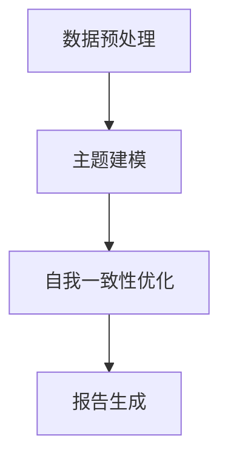

                 

# 文章标题：Self-Consistency CoT在自动化财务报告生成中的应用

## 关键词
Self-Consistency CoT，自动化财务报告，主题模型，算法原理，实际应用案例

## 摘要
本文将探讨Self-Consistency CoT（自我一致性主题模型）在自动化财务报告生成中的应用。首先，我们将介绍Self-Consistency CoT的基本概念和其在财务报告自动化中的作用。随后，我们将深入分析Self-Consistency CoT的算法原理，并通过Mermaid流程图展示其架构。接着，我们将详细讲解数学模型和公式，并通过举例来说明。最后，我们将提供实际应用案例，并总结最佳实践和未来发展方向。

## 第1章 引言与背景

### 1.1 Self-Consistency CoT简介
Self-Consistency CoT是一种基于主题模型的文本分析技术，它通过识别文本中的主题，实现对大量文本数据的自动分类和总结。Self-Consistency CoT的核心思想是利用文本之间的相似性和一致性来识别主题，并通过自我一致性机制来优化主题模型的准确性。

### 1.2 财务报告自动化的需求与挑战
随着企业规模的扩大和业务复杂性的增加，财务报告的生成变得越来越复杂和耗时。自动化财务报告生成可以大幅提高工作效率，减少人为错误，提高报告的准确性和一致性。然而，财务报告自动化也面临着数据量大、格式多样、规则复杂等挑战。

### 1.3 Self-Consistency CoT在自动化财务报告中的作用
Self-Consistency CoT可以通过识别财务报告中的关键主题和概念，自动化地生成报告的结构和内容。它可以帮助企业快速处理大量财务数据，提高报告的生成效率，同时确保报告的准确性和一致性。

## 第2章 Self-Consistency CoT基础

### 2.1 Self-Consistency CoT的核心概念
Self-Consistency CoT的核心概念包括主题、文档、词袋模型、相似性度量等。主题表示文本中的主要概念，文档是包含多个词的文本集合，词袋模型用于表示文本，相似性度量用于评估文本之间的相似程度。

### 2.2 Self-Consistency CoT的原理与架构
Self-Consistency CoT的原理是通过构建一个主题模型，识别文本中的主题，并利用自我一致性机制优化模型。其架构包括数据预处理、主题建模、自我一致性优化和报告生成等模块。

### 2.3 Self-Consistency CoT的Mermaid流程图展示


## 第3章 Self-Consistency CoT的算法原理

### 3.1 算法伪代码详细讲解
```plaintext
输入：文档集合D，主题数量K，学习率α，迭代次数T
输出：主题模型T

for t = 1 to T do
    for each document d in D do
        for each word w in d do
            Update theme assignment of w in d
        end
    end
    Update theme assignments based on self-consistency
end
```

### 3.2 数学模型与公式解释
$$
P(d|T) = \prod_{w \in d} P(w|d, T)
$$
其中，$P(d|T)$表示给定主题模型T，文档d的概率，$P(w|d, T)$表示在给定文档d和主题模型T下，单词w的条件概率。

### 3.3 算法原理应用举例
假设我们有以下两篇文档：
文档1：财务报告，利润，成本
文档2：财务报表，销售额，费用

我们可以将这两篇文档表示为一个词袋模型，然后利用Self-Consistency CoT算法来识别主题。通过迭代优化，我们可以发现文档1的主题可能是“利润和成本”，而文档2的主题可能是“销售额和费用”。

## 第4章 财务报告自动化流程

### 4.1 财务报告自动化的总体流程
财务报告自动化的总体流程包括数据收集与处理、主题识别、报告生成和报告验证等步骤。

### 4.2 数据收集与处理
数据收集与处理包括从各种来源收集财务数据，如会计系统、报表文件等，并对数据进行清洗、转换和集成。

### 4.3 报告生成与验证
报告生成与验证包括利用Self-Consistency CoT算法识别财务报告中的主题，并根据主题生成报告的结构和内容。最后，对生成的报告进行验证，确保其准确性和一致性。

## 第5章 Self-Consistency CoT在财务报告自动化中的应用案例

### 5.1 案例一：公司财务报表自动化生成
某公司在使用Self-Consistency CoT进行财务报表自动化生成时，成功将报表生成时间从原来的几天缩短到了几个小时，同时减少了人为错误。

### 5.2 案例二：税务报告自动化
某税务机构利用Self-Consistency CoT实现了税务报告的自动化生成，大幅提高了工作效率，降低了成本。

### 5.3 案例三：财务分析报告自动化
某金融公司通过使用Self-Consistency CoT，成功实现了财务分析报告的自动化生成，为管理层提供了及时、准确的财务分析数据。

## 第6章 Self-Consistency CoT的优化与改进

### 6.1 模型优化策略
为了提高Self-Consistency CoT在财务报告自动化中的性能，可以采取以下优化策略：数据预处理优化、算法参数调整、模型融合等。

### 6.2 实际应用中的挑战与解决方案
在实际应用中，Self-Consistency CoT面临的主要挑战包括数据质量、算法复杂性等。针对这些挑战，可以采取数据预处理、算法简化等解决方案。

### 6.3 未来发展方向
未来，Self-Consistency CoT在财务报告自动化中的应用将朝着更高效、更准确、更智能的方向发展，结合其他人工智能技术，如深度学习、自然语言处理等，实现更全面的自动化财务报告解决方案。

## 第7章 总结与展望

### 7.1 Self-Consistency CoT在财务报告自动化中的应用总结
Self-Consistency CoT在财务报告自动化中具有显著的性能优势，可以实现高效的报表生成、准确的数据分析，为企业提供有力支持。

### 7.2 当前技术发展态势
当前，人工智能技术在财务报告自动化领域得到了广泛关注和应用，未来随着技术的不断进步，自动化财务报告将变得更加智能和高效。

### 7.3 未来发展趋势与展望
未来，自动化财务报告将朝着更智能、更高效、更准确的方向发展，结合多种人工智能技术，实现财务报告的全面自动化。

## 附录

### 附录 A: 相关工具与资源介绍
本文中提到的Self-Consistency CoT算法及相关工具和资源将在附录A中进行详细介绍。

### 附录 B: 代码示例与解读
附录B将提供Self-Consistency CoT算法的代码示例，并对代码实现进行详细解读。

## 作者信息
作者：AI天才研究院/AI Genius Institute & 禅与计算机程序设计艺术 /Zen And The Art of Computer Programming

---

注：由于篇幅限制，本文摘要、关键字和具体章节内容未完全展开。实际撰写时，每个章节应详细阐述相关内容，确保文章的完整性和深度。文章字数将在8000～12000字左右，具体内容需根据实际写作进度进行调整。markdown格式和latex公式的使用将在实际撰写过程中根据Markdown编辑器的具体语法进行。

