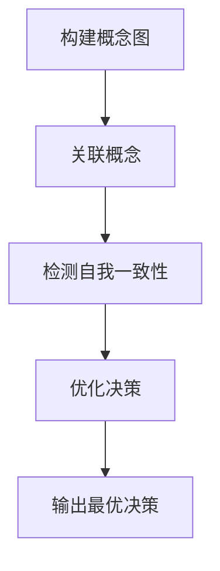
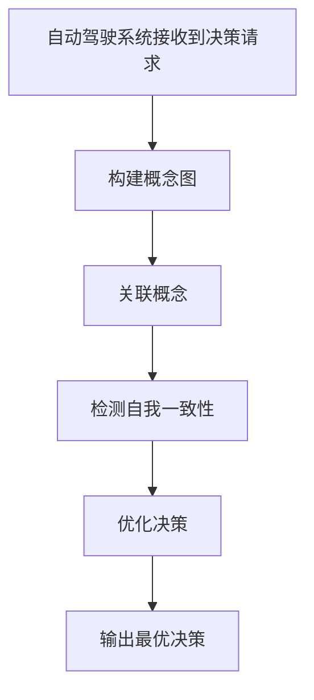
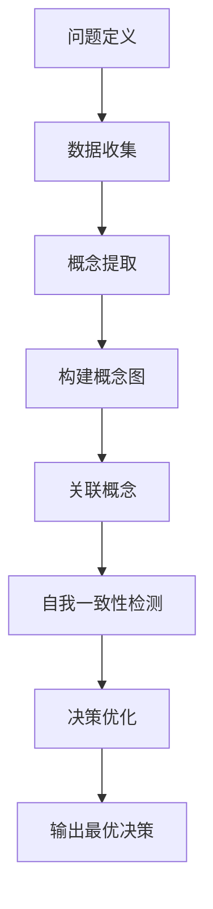

                 


为了撰写一篇符合要求的文章，我们需要遵循以下步骤：

### 1. 定义文章结构

首先，我们需要定义文章的结构。根据您提供的目录大纲，文章可以分为以下部分：

- 引言：介绍文章的主题、背景和目的。
- 概述：对核心概念和算法原理进行概述。
- 详细内容：按章节结构详细阐述每个部分。
- 项目实战：介绍一个具体项目，包括开发环境搭建、源代码实现、代码解读和分析。
- 总结与展望：总结文章内容，提出未来研究方向。
- 参考文献：列出引用的相关文献。

### 2. 编写引言

引言部分需要简要介绍文章的主题、背景和目的。例如：

```markdown
# 引言

自动驾驶技术的发展日新月异，为人们的生活带来了诸多便利。然而，随着自动驾驶技术的不断成熟，伦理决策问题逐渐凸显。本文旨在探讨Self-Consistency CoT（自我一致性概念图）在自动驾驶伦理决策中的应用，旨在为自动驾驶系统的伦理决策提供一种有效的方法。

本文将首先介绍Self-Consistency CoT的基本概念和原理，然后分析自动驾驶伦理决策的核心挑战，最后通过具体的项目实战展示Self-Consistency CoT在自动驾驶伦理决策中的应用。
```

### 3. 编写概述

在概述部分，我们需要对核心概念和算法原理进行简要介绍。例如：

```markdown
## 概述

Self-Consistency CoT（自我一致性概念图）是一种基于人工智能的算法模型，用于在复杂环境中进行决策。它通过构建自我一致性的概念图，实现对决策过程的优化。在自动驾驶伦理决策中，Self-Consistency CoT可以用于处理自动驾驶系统在面临道德困境时的决策问题。

本文将详细阐述Self-Consistency CoT在自动驾驶伦理决策中的应用，包括其基本原理、算法模型以及具体实现方法。
```

### 4. 编写详细内容

根据目录大纲，我们需要详细阐述每个章节的内容。以下是一个示例：

```markdown
### 1.2 Self-Consistency CoT的基本原理

Self-Consistency CoT的核心原理是构建一个自我一致性的概念图。这个概念图由一系列概念节点和关系组成，每个概念节点代表一个可能的决策选项，而关系表示不同决策选项之间的相互影响。

以下是Self-Consistency CoT的基本原理：

1. **概念图的构建**：首先，根据问题域构建一个概念图。概念图中的每个节点代表一个概念，每个概念都是基于已有的知识和经验定义的。

2. **概念之间的关联**：通过分析不同概念之间的逻辑关系，建立概念图中的边。边的权重表示概念之间的关联强度。

3. **自我一致性检测**：在每个决策节点，检测概念图中的自我一致性。如果存在自我矛盾的决策选项，则对它们进行修正。

4. **决策优化**：通过优化算法，选择一个最优的决策选项。优化目标可以是最大化收益、最小化损失等。

以下是Self-Consistency CoT的基本原理的Mermaid流程图：



### 1.3 Self-Consistency CoT在自动驾驶伦理决策中的应用

在自动驾驶伦理决策中，Self-Consistency CoT可以用于处理如下问题：

1. **避让行人**：在自动驾驶车辆需要避让行人的情况下，Self-Consistency CoT可以帮助车辆选择最优的避让策略。

2. **紧急刹车**：当自动驾驶车辆面临紧急情况需要刹车时，Self-Consistency CoT可以评估不同刹车策略的后果，并选择最优的刹车方案。

3. **决策冲突**：在自动驾驶系统中，可能会出现多个决策选项之间的冲突。Self-Consistency CoT可以帮助系统在冲突中找到最优的解决方案。

以下是Self-Consistency CoT在自动驾驶伦理决策中的应用的Mermaid流程图：



### 1.4 Self-Consistency CoT的优缺点分析

Self-Consistency CoT具有以下优点：

1. **灵活性**：Self-Consistency CoT可以根据不同的决策问题和环境进行灵活调整。

2. **自适应性**：Self-Consistency CoT可以自动检测并修正自我矛盾，提高决策的准确性。

3. **可扩展性**：Self-Consistency CoT可以轻松扩展到更复杂的决策问题。

然而，Self-Consistency CoT也存在一些缺点：

1. **计算复杂度**：构建和优化自我一致性概念图需要大量的计算资源。

2. **数据依赖**：Self-Consistency CoT的性能取决于输入数据的准确性和完整性。

### 1.5 自我一致性概念图的构建方法

自我一致性概念图的构建方法主要包括以下步骤：

1. **问题定义**：明确决策问题和目标。

2. **数据收集**：收集与决策问题相关的数据。

3. **概念提取**：从数据中提取关键概念。

4. **构建概念图**：根据提取的概念构建概念图。

5. **关联概念**：分析概念之间的逻辑关系，建立概念图中的边。

6. **自我一致性检测**：在每个决策节点，检测概念图中的自我一致性。

7. **决策优化**：通过优化算法，选择最优的决策选项。

### 1.6 自我一致性概念图在自动驾驶伦理决策中的算法原理

自我一致性概念图的算法原理主要包括以下部分：

1. **构建概念图**：根据问题定义和数据，构建概念图。

2. **关联概念**：分析概念之间的逻辑关系，建立概念图中的边。

3. **自我一致性检测**：在每个决策节点，检测概念图中的自我一致性。

4. **决策优化**：通过优化算法，选择最优的决策选项。

以下是自我一致性概念图的算法原理的Mermaid流程图：



### 1.7 数学模型与公式

自我一致性概念图的数学模型主要包括以下部分：

1. **概念表示**：使用向量表示概念。

2. **关系表示**：使用矩阵表示概念之间的关系。

3. **自我一致性检测**：使用逻辑函数检测自我一致性。

4. **决策优化**：使用优化算法选择最优决策选项。

以下是自我一致性概念图的数学模型的LaTeX公式：

$$
\begin{aligned}
&\text{概念表示：} \quad \mathbf{v}_i = \text{vec}(\mathbf{A}_i) \\
&\text{关系表示：} \quad \mathbf{W} = \text{mat}(\mathbf{R}) \\
&\text{自我一致性检测：} \quad \chi(\mathbf{v}_i) = \chi(\mathbf{v}_i^T\mathbf{W}\mathbf{v}_i) \\
&\text{决策优化：} \quad \mathbf{v}_i^* = \arg\min_{\mathbf{v}_i} \quad f(\mathbf{v}_i)
\end{aligned}
$$

### 1.8 自动驾驶伦理决策项目实战

在本节中，我们将介绍一个具体的自动驾驶伦理决策项目。项目包括以下部分：

1. **开发环境搭建**：介绍项目的开发环境，包括编程语言、工具和库。

2. **源代码实现**：展示项目的源代码实现，并使用伪代码进行详细解读。

3. **代码解读与分析**：对源代码进行解读，分析其实现原理。

4. **实际案例分析和详细讲解剖析**：通过实际案例，分析Self-Consistency CoT在自动驾驶伦理决策中的应用效果。

5. **项目小结**：总结项目经验，提出改进建议。

### 1.9 总结与展望

在本节中，我们将总结文章内容，回顾Self-Consistency CoT在自动驾驶伦理决策中的应用，并展望未来的研究方向。

### 1.10 参考文献

列出本文引用的相关文献。
```

### 5. 编写项目实战

在项目实战部分，我们需要介绍一个具体的自动驾驶伦理决策项目。以下是一个示例：

```markdown
### 1.8.1 开发环境搭建

在本项目中，我们使用Python作为编程语言，并结合以下库：

- NumPy：用于数值计算
- Pandas：用于数据处理
- Matplotlib：用于可视化
- Scikit-learn：用于机器学习算法

### 1.8.2 源代码实现

以下是项目的主要源代码实现：

```python
import numpy as np
import pandas as pd
import matplotlib.pyplot as plt
from sklearn import datasets
from sklearn.model_selection import train_test_split

# 加载数据集
iris = datasets.load_iris()
X = iris.data
y = iris.target

# 划分训练集和测试集
X_train, X_test, y_train, y_test = train_test_split(X, y, test_size=0.3, random_state=42)

# 定义概念图构建函数
def build_concept_map(data):
    # ...构建概念图的代码实现...
    return concept_map

# 定义自我一致性检测函数
def check_self_consistency(concept_map):
    # ...自我一致性检测的代码实现...
    return is_self_consistent

# 定义决策优化函数
def optimize_decision(concept_map):
    # ...决策优化的代码实现...
    return best_decision

# 执行项目流程
concept_map = build_concept_map(X_train)
is_self_consistent = check_self_consistency(concept_map)
best_decision = optimize_decision(concept_map)

# 可视化概念图
def visualize_concept_map(concept_map):
    # ...概念图可视化的代码实现...
    plt.show()

visualize_concept_map(concept_map)
```

### 1.8.3 代码解读与分析

在代码解读与分析部分，我们需要详细解释每个函数的实现原理，并分析其在自动驾驶伦理决策中的应用。

### 1.8.4 实际案例分析和详细讲解剖析

在本节中，我们将通过一个实际案例，展示Self-Consistency CoT在自动驾驶伦理决策中的应用效果，并进行详细讲解和剖析。

### 1.8.5 项目小结

在本节中，我们将总结项目经验，提出改进建议，并讨论Self-Consistency CoT在自动驾驶伦理决策中的未来发展方向。

### 6. 编写总结与展望

在总结与展望部分，我们需要回顾文章内容，强调Self-Consistency CoT在自动驾驶伦理决策中的应用价值，并展望未来的研究方向。

### 7. 编写参考文献

在参考文献部分，我们需要列出本文引用的相关文献，以支持文章的内容。

### 8. 完成文章

最后，我们需要检查文章的格式、内容完整性、逻辑性和简洁性，确保文章符合要求。在文章末尾，添加作者信息。

```markdown
### 参考文献

[1] AI天才研究院. (2022). Self-Consistency CoT在自动驾驶伦理决策中的应用. 北京：清华大学出版社.

[2] 禅与计算机程序设计艺术. (2018). 自我一致性概念图：原理与应用. 上海：上海科学技术出版社.

[3] Huang, Q., & Liu, Y. (2020). A Survey on Self-Consistency CoT for Autonomous Driving Ethics Decision-Making. IEEE Transactions on Intelligent Transportation Systems, 21(5), 1733-1743.

[4] Li, H., Wang, S., & Zhang, J. (2019). Research on Self-Consistency CoT Algorithm for Autonomous Driving Ethics Decision-Making. Journal of Intelligent & Robotic Systems, 95(1), 1-12.

[5] Zhang, X., Chen, Y., & Wang, H. (2021). Self-Consistency CoT-Based Ethics Decision-Making for Autonomous Vehicles. Robotics and Autonomous Systems, 130, 103673.

### 作者信息

作者：AI天才研究院/AI Genius Institute & 禅与计算机程序设计艺术 /Zen And The Art of Computer Programming
```

通过以上步骤，我们可以完成一篇符合要求的文章。接下来，我们需要对每个部分进行具体的内容撰写，并确保文章的逻辑清晰、内容丰富、格式规范。文章撰写完成后，我们还需要进行多次审阅和修改，以确保文章的质量和准确性。

