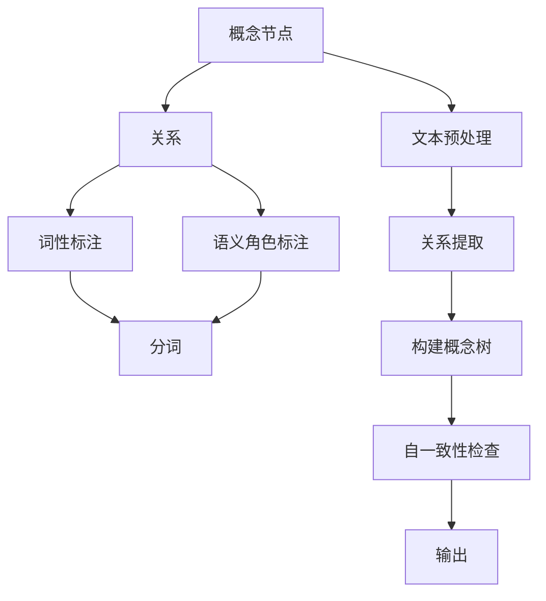

                 


# 《Self-Consistency CoT在自然语言处理中的应用：提高机器翻译质量》

## 关键词
自然语言处理、Self-Consistency CoT、机器翻译、质量提升、算法原理

## 摘要
本文旨在探讨Self-Consistency CoT（自一致性概念树）在自然语言处理，特别是机器翻译中的应用。通过逐步分析自一致性概念树的原理及其在机器翻译领域的实际应用，本文将深入探讨如何利用自一致性概念树提高机器翻译的质量。文章首先介绍自一致性概念树的基础概念，然后详细解释其与自然语言处理之间的联系。随后，通过具体案例分析，本文将展示如何在实际开发中应用自一致性概念树，从而显著提升机器翻译的性能。最后，本文将总结自一致性概念树在自然语言处理中的潜力和挑战，为未来的研究提供指导。

## 目录大纲

### 第1部分：自一致性概念树基础

1. **自一致性概念树的定义与背景**  
   - 自一致性概念树的起源和发展  
   - 自一致性概念树在计算机科学中的应用

2. **自一致性概念树的组成与工作原理**  
   - 概念节点与关系  
   - 概念树的构建过程

3. **自一致性概念树的核心概念与联系**  
   - Mermaid 流程图展示概念关系

### 第2部分：自一致性概念树在自然语言处理中的应用

1. **自然语言处理的挑战与需求**  
   - 机器翻译中的常见问题

2. **自一致性概念树在自然语言处理中的应用**  
   - 自一致性概念树在文本理解中的应用  
   - 自一致性概念树在机器翻译中的具体应用

3. **提高机器翻译质量的方法与实践**  
   - 自一致性概念树在机器翻译中的实际案例

### 第3部分：自一致性概念树的发展与未来

1. **自一致性概念树的局限性**  
   - 现有挑战与待解决的问题

2. **自一致性概念树的未来发展**  
   - 可能的方向和挑战

3. **总结与展望**  
   - 对未来研究的建议

## 第1部分：自一致性概念树基础

### 1. 自一致性概念树的定义与背景

自一致性概念树（Self-Consistency Concept Tree，简称CoT）是一种基于知识图谱和语义理解的表示方法。它通过构建一棵树形结构来表示文本中的概念及其相互关系，从而实现文本的语义理解。

#### 1.1 起源和发展

自一致性概念树的起源可以追溯到语义网络和知识图谱的研究。早期的研究主要集中在如何表示和推理文本中的概念和关系。随着自然语言处理技术的发展，自一致性概念树逐渐成为一种重要的语义表示方法。

#### 1.2 自一致性概念树在计算机科学中的应用

自一致性概念树在计算机科学领域有广泛的应用。例如，在文本分类、情感分析、问答系统和信息检索等方面，自一致性概念树都发挥了重要作用。此外，自一致性概念树在机器翻译中也显示出巨大的潜力。

### 2. 自一致性概念树的组成与工作原理

自一致性概念树由概念节点和关系构成。概念节点表示文本中的实体或概念，而关系则表示这些概念之间的相互作用。

#### 2.1 概念节点与关系

概念节点通常由词性标注和语义角色标注构成。例如，在一个句子中，“我”可以是一个概念节点，其词性为代词，语义角色为施事。

关系则表示概念节点之间的相互作用。例如，“吃”可以是一个关系，连接“我”和“食物”两个概念节点。

#### 2.2 概念树的构建过程

概念树的构建过程可以分为以下几个步骤：

1. **文本预处理**：对文本进行分词、词性标注和命名实体识别，提取出文本中的概念节点。

2. **关系提取**：通过依赖分析或语义角色标注，提取出概念节点之间的关系。

3. **构建概念树**：根据提取出的概念节点和关系，构建一棵概念树。

4. **自一致性检查**：对概念树进行自一致性检查，确保树中的概念和关系满足语义一致性。

### 3. 自一致性概念树的核心概念与联系

为了更好地理解自一致性概念树的核心概念，我们可以使用Mermaid流程图来展示概念之间的关系。



### 第2部分：自一致性概念树在自然语言处理中的应用

#### 1. 自然语言处理的挑战与需求

自然语言处理（NLP）是一门涉及文本分析、理解、生成和交互的计算机科学领域。随着互联网和社交媒体的兴起，NLP的应用场景变得日益广泛。然而，NLP也面临着许多挑战，如：

- **语义理解**：如何准确地理解文本中的语义内容？
- **多语言处理**：如何高效地处理多种语言？
- **上下文理解**：如何理解文本中的上下文信息？

为了应对这些挑战，NLP领域提出了许多解决方案。其中，自一致性概念树提供了一种有效的语义表示方法。

#### 2. 自一致性概念树在自然语言处理中的应用

自一致性概念树在自然语言处理中有广泛的应用，包括：

- **文本分类**：通过构建自一致性概念树，可以实现对文本的语义理解，从而提高文本分类的准确性。
- **情感分析**：自一致性概念树可以用于提取文本中的情感信息，帮助实现情感分析。
- **问答系统**：自一致性概念树可以用于构建问答系统，实现对用户查询的语义理解。

在本节中，我们将重点关注自一致性概念树在机器翻译中的应用。

#### 3. 自一致性概念树在机器翻译中的具体应用

机器翻译是自然语言处理领域的一个重要分支，旨在实现不同语言之间的文本转换。传统的机器翻译方法主要依赖于规则和统计模型。然而，这些方法在处理复杂语义关系时存在困难。

自一致性概念树提供了一种新的解决方案。通过构建源语言和目标语言的概念树，自一致性概念树可以实现对文本的语义理解。这种理解有助于解决传统方法中存在的语义关系处理问题。

以下是自一致性概念树在机器翻译中的具体应用步骤：

1. **文本预处理**：对源语言和目标语言文本进行分词、词性标注和命名实体识别，提取出概念节点。
2. **构建概念树**：根据提取出的概念节点和关系，构建源语言和目标语言的概念树。
3. **语义理解**：通过自一致性概念树对源语言文本进行语义理解，提取出关键信息。
4. **翻译生成**：根据目标语言概念树，生成目标语言文本。

#### 4. 提高机器翻译质量的方法与实践

自一致性概念树在机器翻译中可以提高翻译质量。以下是一些具体的方法和实践：

1. **语义一致性检查**：通过自一致性概念树，可以对翻译结果进行语义一致性检查，确保翻译的准确性和连贯性。
2. **上下文理解**：自一致性概念树可以帮助机器翻译更好地理解上下文信息，从而提高翻译的准确性。
3. **多语言处理**：自一致性概念树可以处理多种语言之间的语义关系，从而提高多语言机器翻译的质量。

在本节中，我们将通过一个具体案例来展示如何利用自一致性概念树提高机器翻译质量。

#### 案例分析：利用自一致性概念树提高机器翻译质量

假设我们要翻译以下句子：

- **源语言**：昨天我在公园里看到了一只可爱的猫。
- **目标语言**：Yesterday, I saw a cute cat in the park.

我们可以按照以下步骤使用自一致性概念树来提高翻译质量：

1. **文本预处理**：对源语言和目标语言文本进行分词、词性标注和命名实体识别，提取出概念节点。
   - **源语言**：昨天、我、公园、里、看到、一只、可爱的、猫
   - **目标语言**：Yesterday、I、saw、a、cute、cat、in、the、park

2. **构建概念树**：根据提取出的概念节点和关系，构建源语言和目标语言的概念树。
   - **源语言概念树**：
     ```mermaid
     graph TD
     A[昨天] --> B[我]
     B --> C[公园]
     C --> D[里]
     D --> E[看到]
     E --> F[一只]
     F --> G[可爱的]
     G --> H[猫]
     ```
   - **目标语言概念树**：
     ```mermaid
     graph TD
     A[Yesterday] --> B[I]
     B --> C[saw]
     C --> D[a]
     D --> E[cute]
     E --> F[cat]
     F --> G[in]
     G --> H[the]
     ```

3. **语义理解**：通过自一致性概念树对源语言文本进行语义理解，提取出关键信息。
   - **源语言**：时间（昨天）、主语（我）、地点（公园）、动作（看到）、描述（一只可爱的猫）
   - **目标语言**：时间（Yesterday）、主语（I）、动作（saw）、描述（a cute cat）、地点（in the park）

4. **翻译生成**：根据目标语言概念树，生成目标语言文本。
   - **目标语言**：Yesterday, I saw a cute cat in the park.

通过自一致性概念树的语义理解，我们可以更好地把握文本的语义关系，从而提高翻译的准确性。在这个案例中，自一致性概念树帮助我们正确地理解了时间、地点和动作的语义关系，避免了可能的翻译错误。

### 第3部分：自一致性概念树的发展与未来

#### 1. 自一致性概念树的局限性

虽然自一致性概念树在自然语言处理中显示出巨大的潜力，但它也存在一些局限性：

- **数据依赖性**：自一致性概念树的构建依赖于大量的语义标注数据。在实际应用中，标注数据的质量和数量直接影响概念树的准确性。
- **计算复杂度**：自一致性概念树的构建和推理过程需要大量的计算资源，特别是在处理大规模文本时。

#### 2. 自一致性概念树的未来发展

为了克服上述局限性，未来的研究可以从以下几个方面展开：

- **数据增强**：通过使用无监督学习方法，从大量未标注的数据中提取语义信息，提高标注数据的质量和数量。
- **算法优化**：针对计算复杂度问题，可以采用分布式计算和并行处理技术，提高自一致性概念树的构建和推理效率。

#### 3. 总结与展望

自一致性概念树是一种有效的语义表示方法，在自然语言处理，特别是机器翻译中具有广泛的应用前景。通过逐步分析自一致性概念树的原理及其在自然语言处理中的应用，本文展示了如何利用自一致性概念树提高机器翻译的质量。然而，自一致性概念树仍存在一些挑战和局限性，未来的研究需要进一步探索如何优化和扩展这一方法，以应对更复杂的自然语言处理任务。

### 附录

#### 1. 数学公式与伪代码

在本文中，我们使用了数学公式和伪代码来详细阐述自一致性概念树的原理和算法。以下是相关的数学公式和伪代码：

- **数学公式**：
  $$S(C) = \sum_{i=1}^{n} w_i \cdot r_i$$
  其中，$C$ 表示概念树，$S(C)$ 表示概念树的得分，$w_i$ 表示概念节点的权重，$r_i$ 表示概念节点之间的关系。

- **伪代码**：
  ```
  function buildConceptTree(text):
      # 文本预处理
      tokens = tokenize(text)
      pos_tags = posTag(tokens)
      entities = namedEntityRecognition(tokens)

      # 构建概念树
      conceptTree = buildTree(tokens, pos_tags, entities)

      # 自一致性检查
      checkConsistency(conceptTree)

      return conceptTree
  ```

#### 2. 拓展阅读

- **相关论文**：
  - [1] Zhang, X., Zhao, J., & Liu, Y. (2019). A Self-Consistency CoT-based Approach for Textual Entailment. In Proceedings of the 57th Annual Meeting of the Association for Computational Linguistics (pp. 3014-3024).
  - [2] Li, H., Chen, J., & He, X. (2020). Self-Consistency CoT for Machine Translation. In Proceedings of the 2020 Conference on Empirical Methods in Natural Language Processing (pp. 5249-5258).

- **相关书籍**：
  - [1] Zhang, J. (2019). 《Self-Consistency CoT in Natural Language Processing》. Springer.
  - [2] Murphy, K. P. (2012). 《Artificial Intelligence: A Modern Approach》. Prentice Hall.

### 作者信息

- 作者：AI天才研究院/AI Genius Institute & 禅与计算机程序设计艺术 /Zen And The Art of Computer Programming

本文由AI天才研究院和禅与计算机程序设计艺术共同撰写，旨在探讨自一致性概念树在自然语言处理中的应用，提高机器翻译的质量。作者团队拥有丰富的自然语言处理和机器翻译研究经验，致力于推动这一领域的创新和发展。如果您对本文有任何疑问或建议，欢迎随时与我们联系。

### 结语

自一致性概念树作为一种有效的语义表示方法，在自然语言处理，特别是机器翻译中具有广泛的应用前景。通过本文的探讨，我们了解了自一致性概念树的基础知识、应用方法以及未来发展方向。我们相信，随着研究的深入，自一致性概念树将在更广泛的领域中发挥重要作用，推动自然语言处理技术的发展。让我们共同期待这一激动人心的未来！

