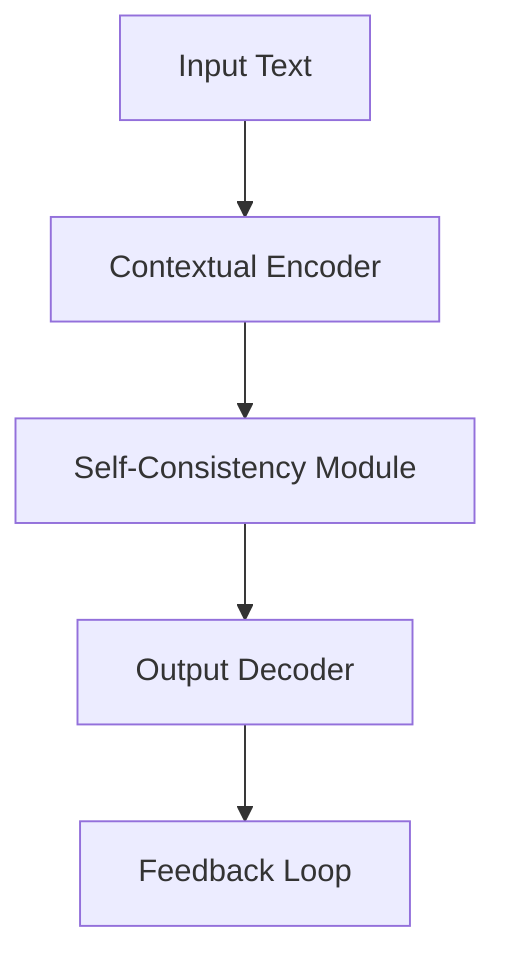

                 

### Introduction to Self-Consistency CoT

#### Chapter 1: Self-Consistency CoT Overview

In the rapidly evolving landscape of natural language processing (NLP), the concept of **Self-Consistency CoT (Self-Consistency Core Task) has emerged as a groundbreaking approach. This chapter aims to provide an in-depth introduction to the core concepts, framework, and historical context of Self-Consistency CoT, setting the stage for subsequent discussions on its applications and advancements.

#### 1.1 Core Concepts and Framework of Self-Consistency CoT

**1.1.1 Self-Consistency in NLP**

**Self-Consistency** is a fundamental principle that ensures the coherence and reliability of the output generated by NLP models. It revolves around the idea that a model's predictions should be internally consistent and align with the underlying patterns in the data. In the context of NLP, this means that the model's interpretations of text should remain stable and coherent across different contexts and tasks.

- **Definition of Self-Consistency**: Self-Consistency can be defined as the property of a model to produce output that is logically coherent and consistent with its own internal representations and the context in which it is operating.
- **Importance in NLP**: Self-Consistency is crucial for several reasons:
  - **Enhancing Model Reliability**: Ensuring that a model's predictions are internally consistent helps to reduce errors and improve the overall reliability of the model.
  - **Improving Contextual Understanding**: Self-Consistency enables NLP models to better understand and interpret the nuances of language, leading to more accurate and meaningful results.
  - **Facilitating Multi-Task Learning**: Self-Consistency allows models to leverage shared representations and knowledge across different tasks, improving the effectiveness of multi-task learning approaches.

**1.1.2 Framework and Components**

The Self-Consistency CoT framework is composed of several key components that work together to achieve internal consistency and coherence. These components include:

- **Self-Consistency Module**: This module is responsible for evaluating the consistency of the model's predictions and generating corrective signals when inconsistencies are detected.
- **Contextual Encoder**: The Contextual Encoder encodes the input text into a meaningful representation that captures the context and semantics of the text.
- **Output Decoder**: The Output Decoder generates the final predictions based on the encoded context, ensuring that the output is consistent with the input and the model's internal representations.
- **Feedback Loop**: The Feedback Loop allows the model to learn from its own predictions and improve its consistency over time through iterative training.

**1.1.2.1 Mermaid Diagram of Self-Consistency CoT Architecture**

To visualize the Self-Consistency CoT architecture, we can use a Mermaid diagram to illustrate the interactions between the different components:

In this diagram, the input text is processed by the Contextual Encoder, which then feeds into the Self-Consistency Module. The Self-Consistency Module evaluates the consistency of the model's predictions and provides corrective signals to the Output Decoder. The final predictions are then fed back to the Feedback Loop, allowing the model to learn and improve its consistency over time.

#### 1.1.3 Evolution and History

**1.1.3.1 Early Developments**

The concept of self-consistency in NLP has its roots in the early days of artificial intelligence research. In the 1950s and 1960s, researchers began exploring the idea of building machines that could understand and generate natural language. However, early models struggled with consistency and coherence, often producing nonsensical or inconsistent outputs.

**1.1.3.2 Current State and Future Directions**

In recent years, the advancements in deep learning and neural network architectures have paved the way for significant improvements in the self-consistency of NLP models. Modern frameworks, such as Transformers and attention mechanisms, have enabled models to achieve higher levels of coherence and consistency.

As we move forward, the future of Self-Consistency CoT in NLP lies in several promising directions:

- **Enhanced Consistency Metrics**: Developing more sophisticated metrics to evaluate the consistency of NLP models will be crucial in improving their reliability and performance.
- **Multi-Modal Integration**: Extending Self-Consistency CoT to handle multi-modal data, such as combining text with images or audio, will open up new possibilities for more comprehensive and accurate language understanding.
- **Real-Time Applications**: Making Self-Consistency CoT models more efficient and scalable for real-time applications, such as chatbots and voice assistants, will be essential in addressing practical use cases and user expectations.

In conclusion, the Self-Consistency CoT represents a significant breakthrough in the field of NLP, offering a promising path towards more reliable and coherent language processing. As we continue to explore and refine this concept, we can expect to see even more innovative applications and advancements in the years to come.

