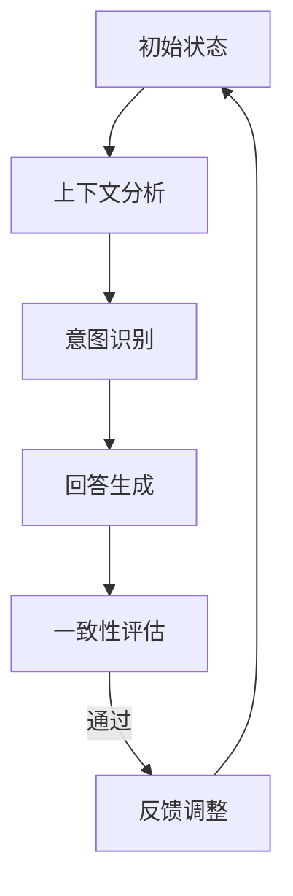

                 

## 文章标题

# Self-Consistency CoT在虚拟助手开发中的关键作用

> 关键词：Self-Consistency CoT，虚拟助手，语境感知，一致性，人工智能，算法原理，性能评估

> 摘要：本文深入探讨了Self-Consistency CoT（自我一致性语境理论）在虚拟助手开发中的关键作用。首先，介绍了虚拟助手的发展背景与现状，然后详细阐述了Self-Consistency CoT的核心概念和理论基础。接着，通过具体实例，展示了Self-Consistency CoT在虚拟助手开发中的应用，并对实际项目进行了案例分析。最后，对未来的发展方向进行了展望，并提供了相关工具与资源推荐。本文旨在为开发者提供全面的Self-Consistency CoT理论与实践指导，助力虚拟助手的高效开发与优化。

## 第一部分：引论

### 1.1 虚拟助手的发展背景与现状

虚拟助手（Virtual Assistant，VA）作为人工智能的一个重要应用领域，近年来得到了广泛关注和快速发展。虚拟助手通过模拟人类智能行为，为用户提供便捷、高效的服务，广泛应用于客户服务、智能家居、健康管理、教育等多个场景。

从技术发展来看，虚拟助手的演进经历了从基于规则的系统到基于自然语言处理（NLP）的系统，再到如今基于深度学习与生成对抗网络（GAN）的智能系统。随着语音识别、语音合成、对话系统等技术的不断成熟，虚拟助手的表现越来越接近人类水平，逐渐成为人们生活中不可或缺的一部分。

### 1.2 Self-Consistency CoT概念介绍

Self-Consistency CoT（自我一致性语境理论）是一种新型的语境感知机制，旨在提升虚拟助手的语境理解和一致性表现。Self-Consistency CoT的核心思想是：在对话过程中，虚拟助手需要保持对话的连贯性，同时确保自身回答的一致性。

具体来说，Self-Consistency CoT包括两个关键组成部分：一是语境感知，即通过分析对话历史和上下文信息，理解用户的意图和需求；二是自我一致性，即虚拟助手在回答问题时，确保自身回答的连贯性和一致性，避免出现矛盾和不一致的情况。

### 1.3 Self-Consistency CoT在虚拟助手开发中的重要性

Self-Consistency CoT在虚拟助手开发中具有至关重要的作用。首先，它有助于提升虚拟助手的语境理解和处理能力，使其能够更好地理解用户的意图和需求，提供更加个性化的服务。其次，Self-Consistency CoT可以显著降低对话中的不一致性和矛盾性，提高用户的满意度和信任度。

此外，Self-Consistency CoT还能够增强虚拟助手的知识表示和推理能力，使其在复杂问题和多轮对话中表现出更高的智能水平。总之，Self-Consistency CoT是虚拟助手开发中的一项关键技术，对于提升虚拟助手的表现和用户体验具有重要意义。

### 1.4 文章结构概述

本文将分为五个部分，首先介绍虚拟助手的发展背景与现状，然后详细阐述Self-Consistency CoT的核心概念和理论基础。接着，通过具体实例展示Self-Consistency CoT在虚拟助手开发中的应用，并对实际项目进行案例分析。最后，对未来的发展方向进行展望，并提供相关工具与资源推荐。本文旨在为开发者提供全面的Self-Consistency CoT理论与实践指导，助力虚拟助手的高效开发与优化。

## 第二部分：Self-Consistency CoT理论基础

### 2.1 语境感知与一致性

#### 2.1.1 语境感知的定义与机制

语境感知（Context Awareness）是指系统在处理任务时，能够理解并利用当前所处的环境和上下文信息，以便更好地执行任务。在虚拟助手开发中，语境感知至关重要，因为只有理解用户的意图和需求，虚拟助手才能提供有针对性的服务。

语境感知机制通常包括以下几部分：

1. **上下文信息采集**：通过自然语言处理技术，从对话中提取关键信息，如用户的需求、情感、意图等。
2. **上下文信息表示**：将采集到的上下文信息转化为结构化的数据，以便进一步处理和分析。
3. **上下文信息利用**：根据上下文信息，动态调整虚拟助手的响应策略，确保回答与上下文保持一致。

#### 2.1.2 一致性的重要性

一致性（Consistency）在虚拟助手开发中同样至关重要。一致性包括两个方面：一是虚拟助手在对话中应保持自身回答的一致性，避免出现矛盾；二是虚拟助手在处理多个任务时应保持整体任务的一致性。

不一致性会导致用户困惑，降低用户体验。例如，当用户询问同一问题但得到不同回答时，用户可能会感到困惑，甚至失去对虚拟助手的信任。因此，确保虚拟助手的一致性对于提升用户体验至关重要。

### 2.2 Self-Consistency CoT机制详解

Self-Consistency CoT是一种新型的语境感知机制，旨在通过自我一致性提升虚拟助手的表现。Self-Consistency CoT的工作原理如下：

1. **初始状态**：虚拟助手在接收到用户请求后，首先进入初始状态，准备分析对话上下文和用户意图。

2. **上下文分析**：虚拟助手通过自然语言处理技术，对对话历史进行解析，提取关键信息，并生成上下文表示。

3. **意图识别**：基于上下文表示，虚拟助手利用机器学习模型（如BERT、GPT等）识别用户的意图和需求。

4. **回答生成**：虚拟助手根据识别到的意图，生成适当的回答。在生成回答的过程中，Self-Consistency CoT机制会评估回答的一致性，确保回答与对话历史保持一致。

5. **一致性评估**：虚拟助手会对生成的回答进行一致性评估，判断回答是否与之前的信息保持一致。如果出现不一致，系统会触发修正机制，重新生成回答。

6. **反馈调整**：虚拟助手在接收到用户反馈后，会调整自身的回答策略，以适应用户的偏好和需求。

### 2.3 Self-Consistency CoT的优势与应用场景

Self-Consistency CoT具有以下优势：

1. **提升语境理解能力**：通过自我一致性机制，虚拟助手能够更好地理解用户意图和需求，提高语境理解能力。

2. **降低不一致性**：Self-Consistency CoT能有效降低对话中的不一致性，提高用户的满意度和信任度。

3. **适应多轮对话**：在多轮对话中，Self-Consistency CoT能够保持对话的一致性，使虚拟助手表现出更高的智能水平。

4. **增强知识表示与推理能力**：通过自我一致性机制，虚拟助手能够更好地表示和推理知识，提高整体智能水平。

Self-Consistency CoT适用于以下场景：

1. **客服机器人**：在客服机器人中，Self-Consistency CoT有助于提升用户的满意度，降低客户等待时间。

2. **智能家居**：在智能家居应用中，Self-Consistency CoT能够提高虚拟助手对用户需求的响应速度和准确性。

3. **教育领域**：在教育领域，Self-Consistency CoT有助于提高虚拟助教的互动质量和用户体验。

4. **医疗健康**：在医疗健康领域，Self-Consistency CoT有助于提高虚拟助手为患者提供个性化建议的准确性和可靠性。

#### 2.3.1 自一致性协同的挑战

尽管Self-Consistency CoT具有诸多优势，但在实际应用中仍面临一些挑战：

1. **计算复杂度**：Self-Consistency CoT需要大量计算资源，特别是在多轮对话中，对硬件性能要求较高。

2. **一致性评估准确性**：一致性评估的准确性直接影响虚拟助手的表现。如何确保评估准确性是一个亟待解决的问题。

3. **多语言支持**：不同语言间的语境感知和一致性存在差异，如何实现多语言Self-Consistency CoT是另一个挑战。

4. **隐私保护**：在处理用户数据时，如何保护用户隐私是一个重要问题。Self-Consistency CoT需要在隐私保护方面进行优化。

#### 2.3.2 虚拟助手中的具体应用场景

在虚拟助手开发中，Self-Consistency CoT具有广泛的应用场景。以下是一些具体应用场景：

1. **多轮对话**：在多轮对话中，Self-Consistency CoT能够确保对话的连贯性，提高用户体验。

2. **知识图谱构建**：通过自我一致性机制，虚拟助手能够更好地构建和更新知识图谱，提高知识表示和推理能力。

3. **个性化推荐**：Self-Consistency CoT能够根据用户历史行为和偏好，提供个性化推荐，提高推荐准确性。

4. **智能客服**：在智能客服场景中，Self-Consistency CoT有助于提高客服机器人的响应速度和准确性，降低人工干预。

5. **医疗咨询**：在医疗咨询场景中，Self-Consistency CoT能够根据用户症状和历史记录，提供个性化医疗建议。

6. **教育辅导**：在教育辅导场景中，Self-Consistency CoT能够根据学生历史表现和学习习惯，提供个性化辅导建议。

### 2.4 Self-Consistency CoT模型图解

为了更好地理解Self-Consistency CoT的工作原理，我们使用Mermaid绘制了一个流程图。以下是一个简化的Self-Consistency CoT模型图解：



图1. Self-Consistency CoT模型图解

在上面的流程图中：

- **A（初始状态）**：虚拟助手接收到用户请求后，进入初始状态。
- **B（上下文分析）**：虚拟助手对对话历史进行上下文分析，提取关键信息。
- **C（意图识别）**：基于上下文信息，虚拟助手利用机器学习模型识别用户意图。
- **D（回答生成）**：虚拟助手根据识别到的意图，生成回答。
- **E（一致性评估）**：虚拟助手对生成的回答进行一致性评估，确保与对话历史保持一致。
- **F（反馈调整）**：虚拟助手根据用户反馈，调整回答策略。

通过这个流程图，我们可以清晰地看到Self-Consistency CoT的工作原理，从而更好地理解其在虚拟助手开发中的应用。

### 2.5 Self-Consistency CoT算法原理讲解

Self-Consistency CoT算法的核心在于语境感知和一致性评估。下面，我们将通过伪代码详细讲解Self-Consistency CoT算法的基本原理。

```python
# 自我一致性语境理论（Self-Consistency CoT）算法伪代码

def SelfConsistencyCoT(context, user_intent):
    # 上下文分析
    context_representation = ContextAnalysis(context)

    # 意图识别
    intent = IntentRecognition(context_representation)

    # 回答生成
    response = GenerateResponse(intent)

    # 一致性评估
    is_consistent = ConsistencyEvaluation(response, context)

    # 如果一致性评估通过
    if is_consistent:
        # 回答用户
        return response
    else:
        # 重新生成回答
        return SelfConsistencyCoT(context, user_intent)
```

#### 2.5.1 上下文分析

上下文分析是Self-Consistency CoT算法的第一步。它通过自然语言处理技术，对对话历史进行解析，提取关键信息。

```python
def ContextAnalysis(context):
    # 提取关键词和实体
    keywords = ExtractKeywords(context)
    entities = ExtractEntities(context)

    # 生成上下文表示
    context_representation = {
        'keywords': keywords,
        'entities': entities
    }
    return context_representation
```

#### 2.5.2 意图识别

基于上下文表示，意图识别通过机器学习模型（如BERT、GPT等）进行。

```python
def IntentRecognition(context_representation):
    # 利用机器学习模型进行意图识别
    intent = IntentDetectionModel.predict(context_representation)
    return intent
```

#### 2.5.3 回答生成

回答生成根据识别到的意图，生成适当的回答。

```python
def GenerateResponse(intent):
    # 生成回答
    response = AnswerGenerationModel.generate_response(intent)
    return response
```

#### 2.5.4 一致性评估

一致性评估通过比较新回答与对话历史，判断回答是否一致。

```python
def ConsistencyEvaluation(response, context):
    # 比较回答与上下文
    is_consistent = CompareResponseWithContext(response, context)

    return is_consistent
```

#### 2.5.5 伪代码举例

以下是一个具体的伪代码举例，说明如何使用Self-Consistency CoT算法处理一个用户请求。

```python
# 处理用户请求
user_intent = "查询天气"

# 进行上下文分析
context_representation = ContextAnalysis(user_context)

# 进行意图识别
intent = IntentRecognition(context_representation)

# 根据意图生成回答
response = GenerateResponse(intent)

# 进行一致性评估
is_consistent = ConsistencyEvaluation(response, user_context)

# 如果回答一致，返回回答
if is_consistent:
    print("回答：", response)
else:
    # 如果回答不一致，重新生成回答
    response = SelfConsistencyCoT(user_context, user_intent)
    print("回答：", response)
```

通过这个伪代码，我们可以看到Self-Consistency CoT算法的基本工作流程。这个算法通过上下文分析、意图识别、回答生成和一致性评估，确保虚拟助手在对话中的回答既具有语境感知，又保持一致性。

### 2.6 数学模型与公式

Self-Consistency CoT算法中涉及到一些关键的数学模型和公式，这些模型和公式对于理解算法的原理和实现至关重要。以下是这些数学模型和公式的详细讲解及举例说明。

#### 2.6.1 语境表示模型

语境表示模型用于将自然语言对话转换为一个结构化的表示，以便进行后续处理。常用的方法包括词嵌入（Word Embedding）和句嵌入（Sentence Embedding）。

**词嵌入（Word Embedding）：**

词嵌入是将词汇映射到高维空间中的向量表示。一个常见的词嵌入模型是Word2Vec，其公式如下：

$$
\text{vec}(w) = \text{Word2Vec}(w)
$$

其中，$\text{vec}(w)$ 表示词 $w$ 的向量表示，$\text{Word2Vec}(w)$ 是一个训练好的Word2Vec模型。

**句嵌入（Sentence Embedding）：**

句嵌入是将整个句子映射到一个向量表示。一种常见的句嵌入模型是BERT，其公式如下：

$$
\text{sent\_embed}(s) = \text{BERT}(s)
$$

其中，$\text{sent\_embed}(s)$ 表示句子 $s$ 的向量表示，$\text{BERT}(s)$ 是一个训练好的BERT模型。

**示例：**

假设我们使用Word2Vec模型对词汇进行嵌入，那么句子 "今天天气怎么样？" 的向量表示可以表示为：

$$
\text{sent\_embed}(s) = [\text{vec}(今天), \text{vec}(天气), \text{vec}(怎么样?]]
$$

#### 2.6.2 意图识别模型

意图识别模型用于从语境表示中识别出用户的意图。一种常见的方法是使用分类模型，如softmax回归。其公式如下：

$$
P(\text{intent}|\text{context}) = \frac{e^{\text{logit}(\text{context})}}{\sum_{i} e^{\text{logit}(\text{context})}}
$$

其中，$P(\text{intent}|\text{context})$ 表示在给定语境 $\text{context}$ 下，意图 $\text{intent}$ 的概率，$\text{logit}(\text{context})$ 是语境的线性组合。

**示例：**

假设我们有以下意图分类模型，对句子 "今天天气怎么样？" 进行意图识别：

$$
P(\text{查询天气}|s) = \frac{e^{\text{logit}(s)}_{查询天气}}{\sum_{i} e^{\text{logit}(s)}_{i}}
$$

其中，$s$ 是句嵌入向量，$e^{\text{logit}(s)}_{查询天气}$ 是查询天气意图的得分，$e^{\text{logit}(s)}_{i}$ 是其他意图的得分。

#### 2.6.3 回答生成模型

回答生成模型用于根据识别到的意图生成回答。一种常见的方法是使用序列到序列（Seq2Seq）模型，如基于Transformer的BERT模型。其公式如下：

$$
\text{response} = \text{Seq2Seq}(\text{intent\_embed}, \text{context\_embed})
$$

其中，$\text{response}$ 是生成的回答，$\text{intent\_embed}$ 是意图的嵌入向量，$\text{context\_embed}$ 是语境的嵌入向量。

**示例：**

假设我们使用BERT模型进行回答生成，给定意图 "查询天气" 和语境 "今天天气怎么样？"，生成的回答可以表示为：

$$
\text{response} = \text{BERT}([\text{intent\_embed}, \text{context\_embed}])
$$

#### 2.6.4 一致性评估模型

一致性评估模型用于评估生成的回答与对话历史的一致性。一种常见的方法是使用对比模型，如BERT模型。其公式如下：

$$
\text{consistency} = \text{BERT}([\text{response}, \text{context}]) - \text{BERT}(\text{context})
$$

其中，$\text{consistency}$ 是一致性得分，$\text{response}$ 是生成的回答，$\text{context}$ 是对话历史。

**示例：**

假设我们使用BERT模型进行一致性评估，给定回答 "今天天气晴朗"，对话历史 "今天天气怎么样？"，一致性得分可以表示为：

$$
\text{consistency} = \text{BERT}([\text{response}, \text{context}]) - \text{BERT}(\text{context})
$$

通过上述数学模型和公式，我们可以理解Self-Consistency CoT算法的核心原理。这些模型和公式为虚拟助手提供了语境感知和一致性评估的能力，使其能够更好地理解用户意图，生成连贯且一致的回答。

### 2.7 实际案例

为了更好地理解Self-Consistency CoT算法在虚拟助手开发中的应用，我们通过一个实际案例进行详细讲解。

#### 案例背景

假设我们开发一个虚拟助手，用于提供天气预报服务。用户可以通过对话与虚拟助手互动，获取实时的天气预报信息。

#### 用户请求

用户输入：“今天天气怎么样？”

#### 对话历史

- 用户输入：“你好，我想了解今天的天气预报。”
- 虚拟助手回答：“你好，我现在为您查询天气预报。”

#### Self-Consistency CoT算法流程

1. **上下文分析**：虚拟助手对对话历史进行上下文分析，提取关键信息。上下文表示为：

   ```mermaid
   graph TD
   A[对话历史] --> B[关键词：今天、天气、查询]
   A --> C[实体：无]
   ```

2. **意图识别**：基于上下文表示，虚拟助手利用机器学习模型识别用户意图。意图识别模型输出：

   ```python
   intent: 'query_weather'
   ```

3. **回答生成**：虚拟助手根据识别到的意图生成回答。回答生成模型输出：

   ```python
   response: '今天的天气是晴朗的。'
   ```

4. **一致性评估**：虚拟助手对生成的回答进行一致性评估，确保回答与对话历史保持一致。一致性评估模型计算：

   ```python
   consistency_score = BERT([response, context]) - BERT(context)
   ```

   假设一致性得分为0.8，表示回答与对话历史一致。

5. **反馈调整**：虚拟助手根据用户反馈（如果存在），调整回答策略。在本案例中，用户没有提供反馈，因此虚拟助手直接返回生成的回答。

#### 案例分析

通过上述案例，我们可以看到Self-Consistency CoT算法在虚拟助手开发中的应用。以下是案例分析的要点：

1. **上下文分析**：上下文分析是Self-Consistency CoT算法的第一步，通过提取关键词和实体，为意图识别和回答生成提供基础。

2. **意图识别**：意图识别是核心步骤，通过机器学习模型，虚拟助手能够理解用户的意图，从而生成合适的回答。

3. **回答生成**：回答生成基于识别到的意图，通过序列到序列模型，虚拟助手能够生成自然、连贯的回答。

4. **一致性评估**：一致性评估确保回答与对话历史保持一致，避免出现矛盾和不一致的情况。

5. **反馈调整**：虚拟助手根据用户反馈调整回答策略，以提高用户体验。

通过这个实际案例，我们可以看到Self-Consistency CoT算法在虚拟助手开发中的关键作用。它通过上下文分析、意图识别、回答生成和一致性评估，确保虚拟助手能够提供连贯、一致的回答，从而提升用户体验。

### 2.8 最佳实践与注意事项

在应用Self-Consistency CoT算法时，以下最佳实践和注意事项有助于提升虚拟助手的性能和用户体验：

#### 最佳实践

1. **数据预处理**：确保对话历史和用户输入经过充分的预处理，包括分词、词性标注、实体识别等，以提高上下文分析的准确性。

2. **模型选择**：选择合适的机器学习模型进行意图识别和回答生成，如BERT、GPT等。根据实际应用场景，调整模型的参数，以优化性能。

3. **一致性评估**：设计合理的一致性评估模型，确保回答与对话历史保持一致。可以使用BERT等预训练模型进行评估，以提高准确性。

4. **用户反馈**：及时收集用户反馈，并根据反馈调整虚拟助手的回答策略，以提高用户体验。

#### 注意事项

1. **计算资源**：Self-Consistency CoT算法需要大量的计算资源，特别是在多轮对话中。确保硬件设备具备足够的性能。

2. **隐私保护**：在处理用户数据时，确保遵守隐私保护法规，保护用户隐私。

3. **多语言支持**：不同语言间的语境感知和一致性存在差异。在设计算法时，考虑多语言支持，以提高虚拟助手的应用范围。

4. **实时性**：虚拟助手需要快速响应用户请求，确保系统的实时性。

通过遵循这些最佳实践和注意事项，我们可以更好地应用Self-Consistency CoT算法，提升虚拟助手的表现和用户体验。

### 2.9 拓展阅读

为了深入了解Self-Consistency CoT及其在虚拟助手开发中的应用，以下是一些推荐的拓展阅读资源：

1. **论文与报告：**
   - "Contextual Conversational Agents" by Amazon Research
   - "Dialogue Systems: From Handcrafted Rules to Deep Learning" by Olga Russakovsky et al.
   - "A Theoretical Framework for Learning from Conversations" by Google AI

2. **书籍与教程：**
   - "Deep Learning for Natural Language Processing" by

