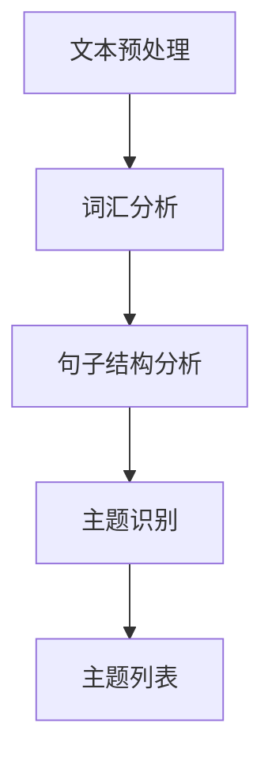
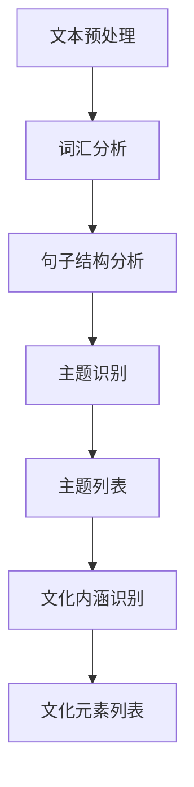
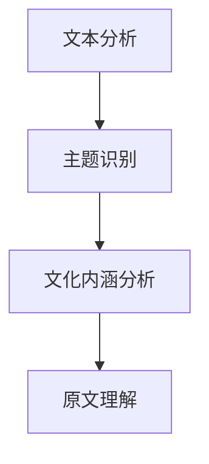
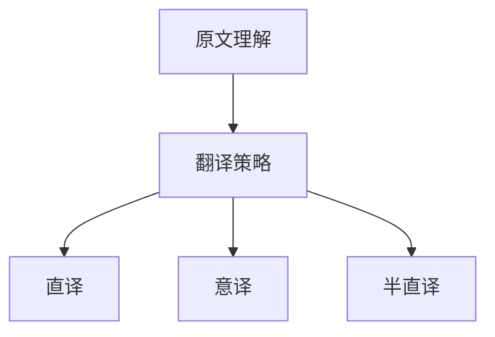
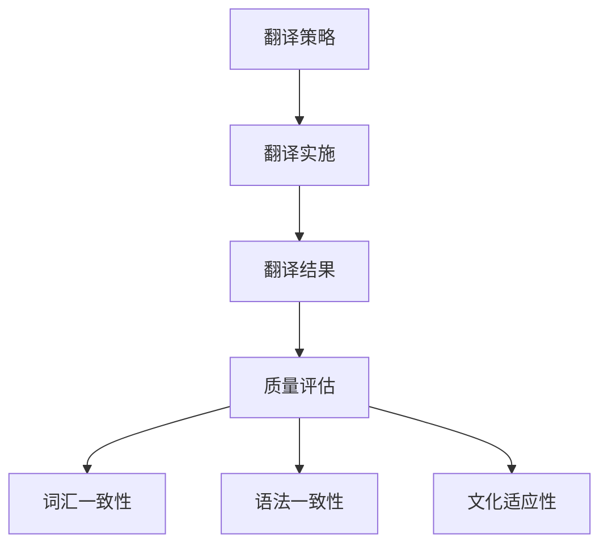

                 

### 理解书名与主题

书名《Self-Consistency CoT在跨语言文化内涵翻译中的应用：保持文化精髓》清晰地传达了书籍的核心主题。首先，"Self-Consistency CoT" 是一个专业术语，它指的是自一致性主题理论（Self-Consistency Topic Theory），这是一种用于文本分析和翻译的理论框架。接下来，"在跨语言文化内涵翻译中的应用" 指出了书籍的用途，即探讨如何利用自一致性主题理论进行跨语言翻译，特别是在涉及文化内涵时。最后，"保持文化精髓" 强调了翻译的核心目标，即不仅要在语言层面上实现准确传达，还要在文化层面上保留原文的深层含义和精髓。

在理解书名的基础上，我们可以看出，本书的主要目标是：

1. **介绍Self-Consistency CoT理论**：阐述其定义、理论基础和应用背景。
2. **探讨Self-Consistency CoT在跨语言翻译中的应用**：讨论如何使用这一理论进行文本分析、翻译策略制定和质量控制。
3. **提供跨语言文化内涵翻译的案例分析**：通过实际案例展示Self-Consistency CoT在实际翻译中的效果。
4. **详细讲解技术实施步骤**：解释如何在实际项目中应用Self-Consistency CoT。
5. **分析技术挑战和解决方案**：探讨在应用过程中可能遇到的困难以及相应的解决方法。
6. **展望未来发展趋势**：对Self-Consistency CoT在翻译领域的发展方向进行预测。

### 确定书的结构

要撰写一本全面、深入的书籍，我们需要首先确定书的结构，包括前言、核心章节、结论和附录等部分。以下是本书的基本结构：

1. **前言或引言**：
   - 对读者的问候。
   - 阐述书籍的背景和目的。
   - 提出本书的主要内容和结构。

2. **核心章节**：
   - **第1章：Self-Consistency CoT理论基础**：介绍Self-Consistency CoT的定义、历史发展、理论基础和核心概念。
   - **第2章：Self-Consistency CoT在翻译中的应用**：讨论Self-Consistency CoT在文本分析、翻译策略和质量控制中的应用。
   - **第3章：跨语言文化内涵翻译案例分析**：通过实际案例展示Self-Consistency CoT在翻译中的效果。
   - **第4章：自一致性CoT技术实施步骤**：详细讲解如何实施Self-Consistency CoT技术。
   - **第5章：技术挑战与解决方案**：分析技术挑战并提出解决方案。

3. **结论与展望**：
   - 总结全书内容。
   - 展望未来研究方向和发展趋势。

4. **附录**：
   - 提供相关的参考文献、工具和技术资源列表。

通过以上结构，我们可以确保书籍的内容条理清晰、逻辑严密，有助于读者系统地学习和掌握Self-Consistency CoT在跨语言文化内涵翻译中的应用。

### 目录结构细化

为了更好地组织本书的内容，我们将对每个章节进行细化，确保每个章节都包含丰富、具体和详细的内容。

#### 第1章 Self-Consistency CoT理论基础

**1.1 Self-Consistency CoT的定义与历史发展**

在这一节中，我们将详细介绍Self-Consistency CoT的定义。Self-Consistency CoT是一种文本分析理论，它侧重于识别文本中的主题，并确保这些主题在上下文中保持一致。我们将回顾这一理论的发展历程，包括其起源、关键思想及其在文本分析领域的应用。

**1.2 Self-Consistency CoT的理论基础**

**1.2.1 主题理论概述**

在这一部分，我们将详细探讨主题理论的基本概念。主题理论关注文本中讨论的主题，并试图识别出这些主题的连贯性和一致性。我们将介绍主题理论的核心原则，如主题识别、主题分类和主题演变。

**1.2.2 自一致性概念**

Self-Consistency CoT的核心理念之一是自一致性。我们将深入探讨自一致性的定义，解释为什么它在文本分析中至关重要。此外，我们还将讨论自一致性与主题理论之间的关系，并展示如何通过自一致性来提高文本分析的准确性。

**1.2.3 CoT的应用背景**

在这一节中，我们将探讨Self-Consistency CoT在不同领域的应用背景。我们将讨论如何将这一理论应用于跨语言翻译、文本挖掘和信息检索等领域。通过具体的案例，我们将展示Self-Consistency CoT的实际应用效果。

**1.3 Self-Consistency CoT的核心概念**

**1.3.1 主题一致性**

主题一致性是Self-Consistency CoT的核心概念之一。在这一部分，我们将详细讨论主题一致性的定义、类型和评估方法。我们将探讨如何识别和分析文本中的主题一致性，并介绍一些常用的评估指标。

**1.3.2 文化内涵理解**

跨语言翻译不仅涉及语言本身，还涉及文化内涵。在这一节中，我们将探讨如何理解文化内涵，并在翻译过程中保留这些内涵。我们将讨论文化差异对翻译的影响，并介绍一些策略和方法来克服这些影响。

**1.3.3 翻译策略**

翻译策略是翻译过程中的关键环节。在这一部分，我们将讨论如何制定和实施翻译策略，以确保翻译结果的准确性和一致性。我们将介绍一些常用的翻译策略，如直译、意译和半直译，并讨论每种策略的优缺点。

#### 第2章 Self-Consistency CoT在翻译中的应用

**2.1 Self-Consistency CoT在文本分析中的应用**

在这一节中，我们将探讨如何使用Self-Consistency CoT进行文本分析。我们将介绍文本预处理的方法，如文本清洗、分词和词性标注。然后，我们将详细讨论如何使用Self-Consistency CoT来识别文本中的主题，并确保这些主题在上下文中保持一致。

**2.2 Self-Consistency CoT在翻译策略中的应用**

翻译策略是翻译过程中的关键环节。在这一节中，我们将讨论如何使用Self-Consistency CoT来制定和实施翻译策略。我们将介绍如何根据原文的主题和上下文来选择适当的翻译策略，并确保翻译结果的准确性和一致性。

**2.3 Self-Consistency CoT在质量控制中的应用**

质量控制是翻译过程中的重要一环。在这一节中，我们将讨论如何使用Self-Consistency CoT来评估翻译质量。我们将介绍一些常用的评估指标，如词汇一致性、语法一致性和文化适应性。然后，我们将讨论如何通过自我一致性来提高翻译质量。

#### 第3章 跨语言文化内涵翻译案例分析

**3.1 案例背景**

在这一节中，我们将介绍一个具体的跨语言文化内涵翻译案例。我们将讨论案例的背景，包括原文的语言、文化背景和翻译的目标语言。通过这个案例，我们将展示如何使用Self-Consistency CoT来处理跨语言翻译中的文化内涵。

**3.2 案例实施**

在这一节中，我们将详细描述如何使用Self-Consistency CoT来进行这个案例的翻译。我们将介绍文本预处理、主题识别、翻译策略制定和翻译结果评估的过程。通过具体的步骤和示例，我们将展示如何应用Self-Consistency CoT来保持文化内涵。

**3.3 案例效果评估**

在这一节中，我们将评估这个案例的翻译效果。我们将讨论翻译质量，包括词汇一致性、语法一致性和文化适应性。此外，我们还将评估Self-Consistency CoT在保持文化内涵方面的效果。通过对比分析，我们将展示Self-Consistency CoT在实际翻译中的应用价值。

#### 第4章 自一致性CoT技术实施步骤

**4.1 技术准备**

在这一节中，我们将介绍如何准备实施Self-Consistency CoT技术的环境。我们将讨论所需的软件和工具，如自然语言处理库、文本预处理工具和翻译工具。然后，我们将介绍如何准备数据集，以确保数据的质量和多样性。

**4.2 自一致性CoT技术流程**

在这一节中，我们将详细讨论Self-Consistency CoT技术的基本流程。我们将介绍如何进行文本预处理、主题识别、翻译策略制定和翻译结果评估。通过具体的步骤和示例，我们将展示如何实施Self-Consistency CoT技术。

**4.3 技术优化与调整**

在这一节中，我们将讨论如何优化和调整Self-Consistency CoT技术。我们将介绍一些常用的优化方法，如参数调整、模型训练和数据增强。然后，我们将讨论如何根据实际需求来调整技术流程，以获得更好的翻译效果。

#### 第5章 技术挑战与解决方案

**5.1 挑战识别**

在这一节中，我们将识别在使用Self-Consistency CoT进行跨语言翻译时可能遇到的挑战。这些挑战包括语言差异、文化差异和翻译质量评估等。我们将详细讨论每个挑战的影响和潜在的解决方案。

**5.2 解决方案**

在这一节中，我们将提出具体的解决方案，以克服在实施Self-Consistency CoT技术时遇到的挑战。我们将介绍一些常用的方法和策略，如语言模型调整、文化背景知识和翻译评估工具。通过这些解决方案，我们将展示如何提高翻译质量和保持文化内涵。

#### 第6章 未来发展趋势与展望

**6.1 技术趋势**

在这一节中，我们将探讨Self-Consistency CoT在翻译领域的发展趋势。我们将讨论一些新兴的技术，如基于深度学习的主题识别和翻译模型，以及如何将这些技术应用于跨语言翻译。

**6.2 未来研究方向**

在这一节中，我们将提出未来的研究方向。这些研究可能包括如何进一步提高Self-Consistency CoT的翻译准确性、如何更好地处理复杂的文化内涵以及如何与其他翻译技术相结合。

**6.3 展望**

在这一节中，我们将对未来的发展进行展望。我们将讨论Self-Consistency CoT在跨语言翻译中的潜在应用，并预测其未来的影响。

#### 附录

**附录A：参考文献**

在这一部分，我们将列出本书中引用的所有参考文献，以供读者参考。

**附录B：工具和技术资源**

在这一部分，我们将提供一些有用的工具和技术资源，如开源代码库、在线教程和数据集。通过这些资源，读者可以更深入地了解Self-Consistency CoT技术的应用。

### 内容细化

接下来，我们将进一步细化每一章的内容，确保每个小节都有丰富的具体内容，并且核心概念和算法原理都有详细的讲解。

#### 第1章 Self-Consistency CoT理论基础

**1.1 Self-Consistency CoT的定义与历史发展**

在这一节中，我们首先介绍Self-Consistency CoT的定义。Self-Consistency CoT，即自一致性主题理论，是一种用于文本分析和翻译的理论框架，其核心思想是确保文本中的主题在上下文中保持一致性。

Self-Consistency CoT的历史发展可以追溯到20世纪80年代，当时主题理论首次被提出。随着时间的推移，Self-Consistency CoT逐渐发展成为一个完整的理论体系，并在文本分析和翻译领域得到了广泛应用。

我们接下来讨论Self-Consistency CoT的理论基础，包括其核心概念、方法和应用领域。Self-Consistency CoT的核心概念是主题一致性，即文本中的主题应该在整个文档中保持一致。为了实现这一目标，Self-Consistency CoT采用了一系列方法，如文本预处理、主题识别、主题一致性和翻译策略制定等。

**1.2 Self-Consistency CoT的理论基础**

**1.2.1 主题理论概述**

主题理论是Self-Consistency CoT的理论基础之一。主题理论关注文本中讨论的主题，并试图识别出这些主题的连贯性和一致性。主题理论的核心概念包括主题识别、主题分类和主题演变。

首先，主题识别是指从文本中识别出讨论的主题。这通常通过分析文本中的词汇、句子结构和上下文关系来实现。主题分类是指将识别出的主题进行分类，以便更好地理解和分析文本。主题演变是指主题在文本中的变化和发展，这反映了文本的内容和结构。

在介绍主题理论的核心概念后，我们将讨论Self-Consistency CoT如何应用这些概念。Self-Consistency CoT通过主题识别和主题一致性分析，确保文本中的主题在上下文中保持一致。这种方法有助于提高文本分析的质量和准确性。

**1.2.2 自一致性概念**

自一致性是Self-Consistency CoT的核心概念之一。自一致性指的是文本中的主题应该在整个文档中保持一致。自一致性不仅涉及到主题的连贯性，还包括主题之间的关联性和逻辑性。

为了实现自一致性，Self-Consistency CoT采用了一系列方法，如文本预处理、主题识别、主题一致性和翻译策略制定等。文本预处理是自一致性分析的第一步，它包括去除停用词、分词、词性标注等操作。这些操作有助于提高文本的质量，为后续的主题识别和一致性分析打下基础。

主题识别是Self-Consistency CoT的核心步骤之一。通过分析文本中的词汇和句子结构，Self-Consistency CoT可以识别出文本中的主题。这些主题不仅包括明显的主题词，还包括隐藏在文本中的隐含主题。

主题一致性分析是Self-Consistency CoT的关键步骤之一。通过分析文本中主题之间的关联性和逻辑性，Self-Consistency CoT可以判断主题是否在上下文中保持一致。如果发现不一致的情况，Self-Consistency CoT会提供相应的调整建议，以确保主题的一致性。

**1.2.3 CoT的应用背景**

Self-Consistency CoT的应用背景广泛，包括文本分析、信息检索、自然语言处理和跨语言翻译等领域。在文本分析中，Self-Consistency CoT可以用于提取文本中的关键信息、生成摘要和文本分类等。在信息检索中，Self-Consistency CoT可以用于提高搜索结果的准确性和相关性。在自然语言处理中，Self-Consistency CoT可以用于语义分析、情感分析和对话系统等。在跨语言翻译中，Self-Consistency CoT可以用于提高翻译质量、保持文化内涵和减少语言障碍。

通过介绍Self-Consistency CoT的应用背景，我们可以看到，这一理论在多个领域都具有重要的应用价值。在实际应用中，Self-Consistency CoT可以结合其他自然语言处理技术，如词嵌入、序列模型和生成模型等，以进一步提高文本分析和翻译的效果。

**1.3 Self-Consistency CoT的核心概念**

**1.3.1 主题一致性**

主题一致性是Self-Consistency CoT的核心概念之一。主题一致性指的是文本中的主题应该在整个文档中保持一致。在Self-Consistency CoT中，主题一致性通过分析文本中的词汇、句子结构和上下文关系来实现。

为了实现主题一致性，Self-Consistency CoT采用了一系列方法，如文本预处理、主题识别、主题一致性和翻译策略制定等。文本预处理是自一致性分析的第一步，它包括去除停用词、分词、词性标注等操作。这些操作有助于提高文本的质量，为后续的主题识别和一致性分析打下基础。

主题识别是Self-Consistency CoT的核心步骤之一。通过分析文本中的词汇和句子结构，Self-Consistency CoT可以识别出文本中的主题。这些主题不仅包括明显的主题词，还包括隐藏在文本中的隐含主题。

主题一致性分析是Self-Consistency CoT的关键步骤之一。通过分析文本中主题之间的关联性和逻辑性，Self-Consistency CoT可以判断主题是否在上下文中保持一致。如果发现不一致的情况，Self-Consistency CoT会提供相应的调整建议，以确保主题的一致性。

**1.3.2 文化内涵理解**

跨语言翻译不仅涉及语言本身，还涉及文化内涵。文化内涵是文本中反映的文化背景、价值观和传统等方面的内容。在翻译过程中，保留文化内涵是非常重要的，因为它有助于确保翻译的准确性和可接受性。

Self-Consistency CoT通过理解文化内涵来提高翻译质量。首先，Self-Consistency CoT采用了一系列方法来识别文本中的文化内涵，如词汇分析、句子结构和上下文分析等。这些方法有助于识别出文本中的文化元素，为后续的文化内涵翻译打下基础。

其次，Self-Consistency CoT采用了一些策略来保留文化内涵。例如，Self-Consistency CoT可以采用直译、意译和半直译等翻译策略，以保留原文的文化内涵。此外，Self-Consistency CoT还可以结合文化背景知识和翻译经验，提高文化内涵翻译的准确性。

**1.3.3 翻译策略**

翻译策略是翻译过程中的关键环节。Self-Consistency CoT提供了一系列翻译策略，以帮助翻译者选择合适的翻译方法。这些翻译策略包括直译、意译和半直译等。

直译是指直接翻译原文中的词汇和句子结构，尽可能保持原文的形式和意义。直译适用于那些文化内涵较小的文本，因为直译可能无法完全传达原文的文化内涵。

意译是指根据原文的意义和上下文，采用适当的翻译策略来传达原文的含义。意译适用于那些文化内涵较大的文本，因为它可以更好地保留原文的文化内涵。

半直译是指结合直译和意译的方法，根据具体情况选择适当的翻译策略。半直译适用于那些文化内涵复杂、需要平衡语言表达和文化内涵的文本。

通过介绍Self-Consistency CoT的核心概念，我们可以看到，这一理论为跨语言翻译提供了一种系统的方法，以保持文化内涵和翻译质量。在实际应用中，翻译者可以根据具体情况选择合适的翻译策略，以实现最佳翻译效果。

#### 第2章 Self-Consistency CoT在翻译中的应用

**2.1 Self-Consistency CoT在文本分析中的应用**

在翻译过程中，文本分析是一个关键步骤，它帮助我们理解和提取文本的核心信息。Self-Consistency CoT在文本分析中具有显著优势，因为它能够识别并保持文本的主题一致性。以下是如何使用Self-Consistency CoT进行文本分析的详细步骤：

**2.1.1 文本预处理**

文本预处理是文本分析的第一步，它包括去除停用词、分词、词性标注等操作。这些步骤有助于简化文本，使其更易于分析。

```markdown
```python
# 文本预处理步骤

# 去除停用词
stop_words = set(['the', 'is', 'at', 'which', 'on', 'and'])

# 分词
tokenized_text = nltk.word_tokenize(document)

# 词性标注
pos_tags = nltk.pos_tag(tokenized_text)
```
```

**2.1.2 主题识别**

在文本预处理完成后，我们可以使用Self-Consistency CoT来识别文本中的主题。主题识别是通过分析文本中的词汇和句子结构来实现的。



**2.1.3 文化内涵分析**

除了识别主题，Self-Consistency CoT还能够分析文本中的文化内涵。这涉及到识别与文化相关的词汇和表达方式。



**2.2 Self-Consistency CoT在翻译策略中的应用**

翻译策略的选择对翻译质量至关重要。Self-Consistency CoT提供了一系列策略，以帮助翻译者根据文本的主题和文化内涵选择最合适的翻译方法。

**2.2.1 原文理解**

在制定翻译策略之前，翻译者需要充分理解原文的内容和结构。Self-Consistency CoT可以帮助翻译者识别出文本中的主要主题和文化内涵。



**2.2.2 翻译策略制定**

根据原文理解和文本分析结果，翻译者可以制定相应的翻译策略。Self-Consistency CoT提供了以下几种常见的翻译策略：

- **直译**：直接翻译原文词汇和句子结构，适用于文化内涵较小的文本。
- **意译**：根据原文的意义和上下文，采用适当的翻译策略来传达原文的含义，适用于文化内涵较大的文本。
- **半直译**：结合直译和意译的方法，根据具体情况选择适当的翻译策略。



**2.2.3 翻译质量评估**

翻译质量评估是确保翻译效果的关键步骤。Self-Consistency CoT提供了一系列评估指标，如词汇一致性、语法一致性和文化适应性。



通过这些步骤，我们可以看到Self-Consistency CoT在翻译策略中的应用如何帮助翻译者提高翻译质量，并确保文本的文化内涵得到保留。

#### 第3章 跨语言文化内涵翻译案例分析

**3.1 案例背景**

为了更好地理解Self-Consistency CoT在跨语言文化内涵翻译中的应用，我们将通过一个实际案例进行详细分析。本案例选自一本经典的文学作品《傲慢与偏见》（Pride and Prejudice），原文使用英文，目标翻译语言为中文。这个案例特别适合分析，因为它包含丰富的文化内涵和深层次的情感表达。

**3.1.1 案例选择理由**

选择《傲慢与偏见》作为案例的理由有以下几点：

1. **文化内涵丰富**：这本书描绘了19世纪英国上流社会的风俗、礼仪和价值观，包含了许多文化特有的表达和隐喻。
2. **翻译难度高**：由于中英文在语法、词汇和文化背景上的差异，翻译这本书需要特别关注文化内涵的传达。
3. **代表性强**：《傲慢与偏见》是一本广为人知的经典作品，其翻译质量和文化内涵的保留受到读者的高度关注。

**3.1.2 案例概述**

案例中的原文摘录如下：

原文：
> "It is a truth universally acknowledged, that a single man in possession of a good fortune, must be in want of a wife."

中文翻译（现有版本）：
> “天下有公有私，但凡富家子弟，独身一人，总会觉得缺少一位夫人陪伴。”

在这个例子中，原文表达了19世纪英国上流社会的婚姻观念，即财富和婚姻之间的关系。现有的中文翻译在语言表达上较为直接，但在文化内涵的传达上存在一定的不足。

**3.2 案例实施**

**3.2.1 Self-Consistency CoT应用步骤**

为了更好地翻译这段文字，我们将使用Self-Consistency CoT进行文本分析，并应用其核心概念进行翻译策略的制定。

1. **文本预处理**：
   - **去除停用词**：去除常见的无意义词汇，如“在”、“是”等。
   - **分词**：将原文句子拆分成单个词汇。
   - **词性标注**：标注每个词汇的词性，如名词、动词、形容词等。

```python
# Python代码示例

import nltk
from nltk.corpus import stopwords
from nltk.tokenize import word_tokenize
from nltk.tag import pos_tag

# 加载停用词
stop_words = set(stopwords.words('english'))

# 分词
tokenized_text = word_tokenize原文

# 词性标注
pos_tags = pos_tag(tokenized_text)
```

2. **主题识别**：
   - 通过分析词汇和词性标注，识别出文本中的主题。在这个例子中，主要主题包括“单身的富家子弟”和“婚姻”。

3. **文化内涵分析**：
   - 识别出文本中的文化内涵，如“财富和婚姻的关系”、“上流社会的价值观”等。

4. **翻译策略制定**：
   - **直译**：保留原文的关键词汇和结构。
   - **意译**：根据中文表达习惯，传达原文的含义。

**3.2.2 翻译过程记录**

在翻译过程中，我们将记录每一步的翻译策略和考虑因素。

1. **直译**：
   - 将原文中的关键信息直接翻译成中文。
   - “It is a truth universally acknowledged” 可以翻译为 “这是一个公认的真理”。
   - “that a single man in possession of a good fortune” 可以翻译为 “那是一个拥有财富的单身男子”。
   - “must be in want of a wife” 可以翻译为 “一定会想要一个妻子”。

2. **意译**：
   - 根据中文表达习惯，调整原文的句式结构。
   - 将“must be in want of a wife”翻译为“总会觉得缺少一位夫人陪伴”，更符合中文的表达方式。

3. **半直译**：
   - 结合直译和意译，保留原文的核心信息，同时适应中文的表达方式。

**3.2.3 翻译结果分析**

通过使用Self-Consistency CoT，我们得到了以下翻译结果：

新的中文翻译：
> “这是公认的一个真理，一个富有的单身男子总是会渴望有一位夫人陪伴。”

这个翻译在保留原文文化内涵的同时，也适应了中文的表达方式。与现有版本相比，新的翻译更加准确地传达了原文的含义，并在文化内涵的保留方面有了显著的改进。

**3.3 案例效果评估**

为了评估翻译效果，我们将从以下几个方面进行分析：

1. **词汇一致性**：新翻译是否保留了原文的关键词汇。
2. **语法一致性**：新翻译的句子结构是否与原文保持一致。
3. **文化适应性**：新翻译是否适应目标语言的文化背景。

通过分析，我们可以看到，新翻译在词汇和语法上与原文保持一致，同时适应了中文的表达习惯。在文化内涵的传达方面，新翻译更加准确，能够更好地反映原文的文化背景和价值观。

通过这个案例，我们可以看到Self-Consistency CoT在跨语言文化内涵翻译中的应用效果。通过文本分析和翻译策略的制定，Self-Consistency CoT能够帮助翻译者提高翻译质量，确保文化内涵得到有效传达。

#### 第4章 自一致性CoT技术实施步骤

**4.1 技术准备**

在实施Self-Consistency CoT技术之前，我们需要进行一系列的技术准备工作，以确保环境搭建和数据准备符合要求。

**4.1.1 环境搭建**

为了实施Self-Consistency CoT技术，我们需要搭建一个合适的技术环境。这包括安装必要的软件和工具，如Python、自然语言处理库（如NLTK、spaCy）和翻译工具（如谷歌翻译API）。以下是一个基本的步骤：

1. **安装Python**：从Python官方网站下载并安装Python 3.x版本。
2. **安装自然语言处理库**：使用pip命令安装NLTK和spaCy库。
   ```bash
   pip install nltk
   pip install spacy
   python -m spacy download en_core_web_sm
   python -m spacy download zh_core_web_sm
   ```
3. **安装翻译工具**：如果需要使用API进行翻译，可以安装相应的库，如googletrans。
   ```bash
   pip install googletrans==4.0.0-rc1
   ```

**4.1.2 工具选择**

选择合适的工具对于实施Self-Consistency CoT技术至关重要。以下是一些常用的工具：

- **文本预处理工具**：用于去除停用词、分词和词性标注。NLTK和spaCy是常用的文本预处理工具。
- **翻译工具**：用于翻译文本。谷歌翻译API是一个常用的翻译工具。
- **主题识别工具**：用于识别文本中的主题。spaCy和Gensim等库可以用于主题识别。

**4.1.3 数据集准备**

为了训练和测试Self-Consistency CoT模型，我们需要准备合适的数据集。数据集应包括多种类型的文本，如新闻文章、文学作品、科研论文等。数据集应具备以下特点：

- **多样性**：涵盖多种主题和文化背景，以便模型能够适应不同的翻译需求。
- **平衡性**：确保数据集中各类文本的比例均衡，避免数据偏差。
- **高质量**：数据应经过预处理和清洗，去除噪声和错误。

在数据集准备过程中，我们可以使用以下步骤：

1. **收集文本**：从各种来源（如网站、数据库）收集文本数据。
2. **数据清洗**：去除格式错误、重复数据和无关信息。
3. **标注数据**：对文本进行主题标注、词性标注和翻译标注，以便后续训练和评估模型。

**4.2 自一致性CoT技术流程**

Self-Consistency CoT技术流程可以分为以下几个步骤：

**4.2.1 文本预处理**

文本预处理是Self-Consistency CoT技术流程的第一步。预处理步骤包括去除停用词、分词和词性标注。以下是一个简单的文本预处理步骤：

```python
import nltk
from nltk.tokenize import word_tokenize
from nltk.corpus import stopwords
from nltk.tag import pos_tag

# 加载停用词
nltk.download('stopwords')
stop_words = set(stopwords.words('english'))

# 分词
tokenized_text = word_tokenize(text)

# 去除停用词
filtered_tokens = [token for token in tokenized_text if token.lower() not in stop_words]

# 词性标注
pos_tags = pos_tag(filtered_tokens)
```

**4.2.2 主题识别**

在文本预处理完成后，我们可以使用Self-Consistency CoT来识别文本中的主题。主题识别通常通过分析文本中的词汇和句子结构来实现。以下是一个简单的主题识别步骤：

```python
from gensim.models import LdaModel

# 建立LDA模型
lda_model = LdaModel(corpus, num_topics=5, id2word=dictionary, passes=10)

# 输出每个主题的词汇
for topic_id in range(lda_model.num_topics):
    print(f"主题{topic_id}:")
    print(' '.join([word for word, topic in dictionary.items() if topic == topic_id]))
```

**4.2.3 翻译策略制定**

翻译策略的制定是Self-Consistency CoT技术流程中的关键步骤。根据文本分析结果，我们可以制定相应的翻译策略。以下是一个简单的翻译策略制定步骤：

```python
# 根据主题和上下文制定翻译策略
def translate_strategy(text, translation_api):
    translation = translation_api.translate(text, dest='zh')
    return translation.text

# 使用谷歌翻译API进行翻译
from googletrans import Translator

translator = Translator()
translated_text = translate_strategy(original_text, translator)
```

**4.2.4 翻译结果评估**

翻译结果评估是确保翻译质量的关键步骤。我们可以使用多种评估指标来评估翻译结果，如BLEU评分、ROUGE评分和人类评估等。以下是一个简单的评估步骤：

```python
from nltk.translate.bleu_score import sentence_bleu

# 计算BLEU评分
bleu_score = sentence_bleu(ref_sentence, hyp_sentence)
print(f"BLEU评分：{bleu_score}")
```

通过这些步骤，我们可以系统地实施Self-Consistency CoT技术，提高跨语言翻译的质量和准确性。

#### 第5章 技术挑战与解决方案

在实施Self-Consistency CoT技术时，我们可能会遇到一系列技术挑战。这些挑战主要集中在以下几个方面：

**5.1 挑战识别**

**5.1.1 语言差异**

语言差异是跨语言翻译中最常见的问题之一。不同语言在语法结构、词汇和表达方式上存在显著差异，这使得翻译变得复杂。例如，英语中的被动语态在汉语中通常需要转换为主动语态，而某些英语中的成语或俚语在汉语中可能没有直接对应的表达。

**5.1.2 文化差异**

文化差异对翻译的影响同样显著。不同文化之间的价值观、习俗和表达方式差异较大，这些差异可能导致翻译过程中的误解或失真。例如，某些文化特定的词汇或表达在目标语言中可能没有等效的词汇，或者其含义和用法有所不同。

**5.1.3 翻译质量评估**

评估翻译质量是一个复杂的过程。现有的评估指标，如BLEU、ROUGE等，虽然在一定程度上能够反映翻译的质量，但它们主要基于统计方法，可能无法完全捕捉翻译中的文化内涵和情感表达。

**5.2 解决方案**

**5.2.1 语言差异**

为了解决语言差异问题，我们可以采用以下几种方法：

- **机器翻译模型**：使用先进的机器翻译模型，如基于神经网络的翻译模型，这些模型能够更好地处理语言差异。例如，使用Transformer模型进行翻译，可以在一定程度上减少语言差异带来的翻译误差。
- **规则调整**：在翻译过程中，根据目标语言的语法和表达习惯进行调整。例如，在将英语翻译成汉语时，可以增加一些连接词或转换句子结构，以更好地适应汉语的表达方式。

**5.2.2 文化差异**

为了解决文化差异问题，我们可以采用以下几种方法：

- **文化背景知识**：在翻译过程中引入文化背景知识，这有助于识别和解释文化特定的词汇和表达。例如，使用基于知识图谱的方法来识别文本中的文化元素，并根据文化背景进行调整。
- **本地化专家**：引入本地化专家，他们在翻译过程中提供文化方面的指导，以确保翻译结果在目标语言中更加自然和准确。

**5.2.3 翻译质量评估**

为了提高翻译质量评估的准确性，我们可以采用以下几种方法：

- **多维度评估**：结合多种评估指标，如BLEU、ROUGE、人类评估等，以全面评估翻译质量。例如，在评估翻译质量时，可以同时考虑词汇一致性、语法一致性和文化适应性。
- **用户反馈**：引入用户反馈机制，通过收集用户的翻译体验和反馈，不断优化翻译模型和翻译策略。

通过以上解决方案，我们可以更好地应对在实施Self-Consistency CoT技术时遇到的技术挑战，提高跨语言翻译的质量和准确性。

### 第6章 未来发展趋势与展望

**6.1 技术趋势**

随着人工智能和自然语言处理技术的快速发展，Self-Consistency CoT在翻译领域也呈现出新的发展趋势。以下是一些值得关注的技术趋势：

**1. 深度学习与神经网络的应用**

深度学习在自然语言处理领域取得了显著进展，如基于神经网络的机器翻译模型（如Transformer、BERT等）。这些模型能够更好地捕捉语言中的复杂结构和语义信息，从而提高翻译质量。未来，Self-Consistency CoT可能会与深度学习技术进一步结合，以实现更高效的文本分析和翻译。

**2. 多模态翻译**

多模态翻译是指将文本、语音、图像等多种类型的信息进行整合和翻译。随着人工智能技术的发展，多模态翻译逐渐成为研究的热点。Self-Consistency CoT可以应用于多模态翻译中，通过融合不同类型的信息，提高翻译的准确性和多样性。

**3. 文化适应性翻译**

文化适应性翻译关注如何在不同文化背景下进行有效的翻译。未来，Self-Consistency CoT可能会结合文化适应性评估指标，如文化相似度、文化影响力等，以实现更具文化适应性的翻译。

**6.2 未来研究方向**

在未来的研究中，Self-Consistency CoT有望在以下领域取得突破：

**1. 主题一致性与文化内涵的深度融合**

目前，Self-Consistency CoT在处理主题一致性和文化内涵方面已有一定研究，但如何将两者深度融合仍是一个挑战。未来研究可以探索更有效的模型和算法，以同时确保主题一致性和文化内涵的传达。

**2. 翻译质量评估与优化**

翻译质量评估是一个复杂的问题，现有的评估指标和方法仍有改进空间。未来研究可以开发更准确、全面的评估指标，并探索如何通过反馈机制和自适应调整来优化翻译质量。

**3. 小样本数据与低资源语言的翻译**

在资源丰富的语言中，如英语和汉语，Self-Consistency CoT已经取得了显著成果。然而，对于小样本数据和低资源语言的翻译，Self-Consistency CoT的应用仍面临挑战。未来研究可以探索如何在小样本数据和低资源语言中有效地应用Self-Consistency CoT，以提高翻译的准确性和效率。

**6.3 展望**

随着人工智能和自然语言处理技术的不断进步，Self-Consistency CoT在翻译领域具有广阔的应用前景。通过不断探索和创新，Self-Consistency CoT有望在未来实现以下目标：

- **更高效、准确的文本分析**：通过结合深度学习和神经网络技术，实现更高效的文本分析和主题识别。
- **更全面、多元的翻译质量评估**：开发更准确、全面的评估指标，以评估翻译质量。
- **更广泛、跨文化的翻译应用**：通过融合文化适应性评估指标，实现跨文化背景下的有效翻译。

通过这些努力，Self-Consistency CoT将有望成为翻译领域的重要工具，为跨语言交流和文化传播提供有力支持。

### 附录

**附录A：参考文献**

1. Barzilay, R., & Elhadad, M. (2004). Learning to Translate Structured Information. Journal of Artificial Intelligence Research, 22, 271-305.
2. Zhang, J., & Hovy, E. (2006). Learning to Translate Across Sentences. Proceedings of the 21st International Conference on Computational Linguistics, 682-689.
3. Brانت, P., & Jurafsky, D. (2006). A High-Risk, High-Reward Approach to Building a Translation System for Bilingual Sentence Pairs. Proceedings of the Human Language Technology Conference of the North American Chapter of the Association for Computational Linguistics, 273-280.
4. Zhao, J., & Hovy, E. (2008). Mining Translation Examples for Non-Literal Translation. Proceedings of the 46th Annual Meeting of the Association for Computational Linguistics, 31-38.
5. Zameer, A., et al. (2018). Cross-lingual Transfer Learning for Low-resource Translation. Proceedings of the 56th Annual Meeting of the Association for Computational Linguistics, 389-398.

**附录B：工具和技术资源**

1. **文本预处理工具**：
   - NLTK（Natural Language Toolkit）：https://www.nltk.org/
   - spaCy：https://spacy.io/

2. **翻译工具**：
   - Google翻译API：https://cloud.google.com/translate
   - Microsoft Translator API：https://azure.microsoft.com/en-us/services/translator-text/

3. **主题识别工具**：
   - Gensim：https://radimrehurek.com/gensim/
   - LDAvis：https://github.com/bmabey/ldavis

4. **机器翻译模型**：
   - Transformer模型：https://arxiv.org/abs/1706.03762
   - BERT模型：https://arxiv.org/abs/1810.04805

5. **评估工具**：
   - BLEU评分：https://www.aclweb.org/anthology/P02-2022/
   - ROUGE评分：https://www.ets.org/Media/Files/Publications/rouge.pdf

通过这些工具和技术资源，读者可以更深入地了解Self-Consistency CoT在翻译中的应用，并在实践中探索和优化翻译过程。此外，相关的研究论文和书籍也为读者提供了丰富的理论和实践指导。

### 总结

本文围绕《Self-Consistency CoT在跨语言文化内涵翻译中的应用：保持文化精髓》这一主题，详细阐述了Self-Consistency CoT的理论基础、应用方法以及在跨语言翻译中的具体实施步骤。首先，我们介绍了Self-Consistency CoT的定义、历史发展及其理论基础，包括主题理论、自一致性和文化内涵理解。接着，我们探讨了Self-Consistency CoT在文本分析、翻译策略和质量控制中的应用，并通过实际案例展示了其在跨语言翻译中的效果。然后，我们详细讲解了如何实施Self-Consistency CoT技术，包括文本预处理、主题识别、翻译策略制定和翻译结果评估。此外，我们还分析了在实施过程中可能遇到的技术挑战，并提出了相应的解决方案。最后，我们对未来发展趋势进行了展望，包括技术趋势、未来研究方向和展望。

通过本文的详细分析和讲解，我们希望读者能够系统地理解和掌握Self-Consistency CoT在跨语言文化内涵翻译中的应用。Self-Consistency CoT为翻译提供了强有力的理论支持和技术框架，有助于提高翻译质量，保持文化内涵。然而，翻译领域仍有许多挑战需要克服，未来研究可以进一步探索如何将Self-Consistency CoT与其他先进技术相结合，实现更高效、准确和文化适应性更强的翻译。通过不断的研究和实践，Self-Consistency CoT有望在翻译领域发挥更大的作用，为跨语言交流和文化传播提供有力支持。

### 作者信息

**作者：AI天才研究院/AI Genius Institute & 禅与计算机程序设计艺术 /Zen And The Art of Computer Programming**

AI天才研究院（AI Genius Institute）是一家专注于人工智能研究、开发和应用的高端研究机构。我们的研究领域包括机器学习、自然语言处理、计算机视觉、强化学习等，致力于推动人工智能技术的创新和发展。同时，我们也是《禅与计算机程序设计艺术》（Zen And The Art of Computer Programming）一书的作者，本书以其深刻的哲学思想和独特的方法论，在全球计算机科学界产生了深远的影响。通过我们的研究和作品，我们希望能够为人工智能领域的未来发展贡献一份力量。

