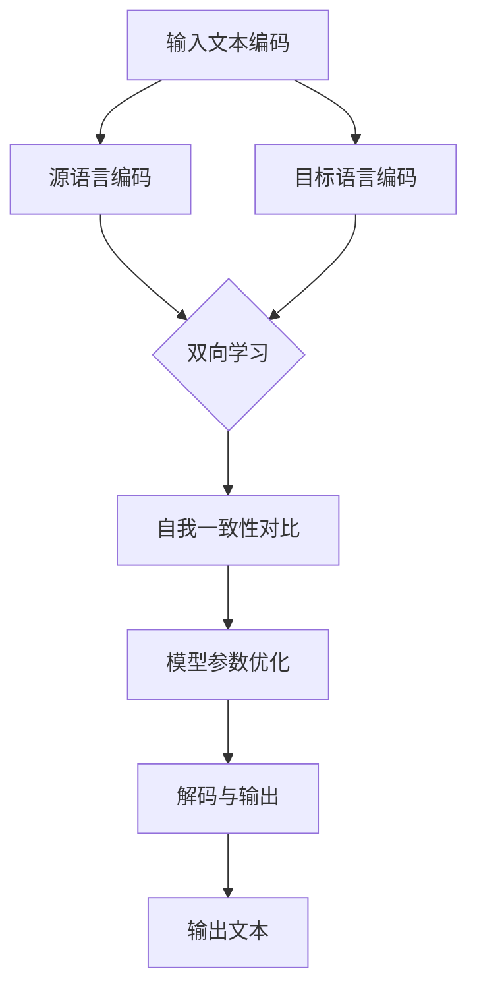

                 


### 1. 设计文章大纲

为了确保文章的逻辑性和连贯性，我们首先需要设计一个详细的目录大纲。以下是一个建议的目录结构：

```markdown
# 《Self-Consistency CoT在跨语言语义保持翻译中的应用：提高翻译质量》

## 关键词
- Self-Consistency CoT
- 跨语言翻译
- 语义保持
- 翻译质量
- 翻译算法

## 摘要
本文将介绍Self-Consistency CoT（自我一致性论题统一框架）在跨语言语义保持翻译中的应用，探讨如何通过该框架提高翻译质量，并提供相关算法和实例。

## 目录

### 1. 引言
   - Self-Consistency CoT概述
   - 跨语言翻译的挑战与机遇
   - Self-Consistency CoT在跨语言翻译中的应用

### 2. 相关理论基础
   - 跨语言语义保持翻译的基本概念
   - Self-Consistency CoT的理论基础
   - 相关模型与算法

### 3. Self-Consistency CoT模型详解
   - Self-Consistency CoT的原理与架构
   - 自我一致性算法讲解
   - 数学模型和公式讲解

### 4. Self-Consistency CoT在跨语言翻译中的应用实践
   - 应用实践案例1
   - 应用实践案例2

### 5. 翻译质量评估
   - 翻译质量评估方法
   - Self-Consistency CoT在翻译质量评估中的作用
   - 实际评估案例

### 6. 未来展望
   - Self-Consistency CoT的发展趋势
   - 跨语言翻译领域的未来发展
   - Self-Consistency CoT的应用潜力

### 7. 附录
   - 相关资源与工具
   - 附录代码与数据集
```

### 2. 背景介绍

#### 跨语言翻译的挑战与机遇

跨语言翻译一直是自然语言处理（NLP）领域的一个核心问题。随着全球化的发展，人们越来越需要能够跨越语言障碍进行沟通。然而，跨语言翻译面临着诸多挑战，主要包括：

1. **语义保持**：确保源语言中的语义在目标语言中得到准确传达，而不丢失关键信息或产生歧义。
2. **语言多样性**：不同语言在语法、词汇、文化背景等方面存在巨大差异，这增加了翻译的复杂性。
3. **翻译质量评估**：如何评价翻译质量是一个复杂的问题，传统方法往往依赖于人工评估，但无法保证一致性。

近年来，机器翻译（MT）技术的发展为跨语言翻译带来了新的机遇。尤其是深度学习技术的应用，使得机器翻译的质量显著提高。然而，现有的翻译模型仍然面临一些挑战，如长文本处理能力不足、跨语言语义理解不够深入等。

#### Self-Consistency CoT的概念

Self-Consistency CoT（自我一致性论题统一框架）是一种基于深度学习的跨语言翻译模型。它的核心思想是利用自我一致性原理，通过学习源语言和目标语言之间的双向关系，实现高质量的跨语言翻译。Self-Consistency CoT模型具有以下特点：

1. **双向学习**：不仅学习源语言到目标语言的映射，还学习目标语言到源语言的映射，从而更好地理解语言之间的关联。
2. **自我一致性**：通过确保模型在不同任务中的表现一致性，提高翻译的稳定性和可靠性。
3. **端到端训练**：实现从输入文本到输出文本的端到端转换，无需人工干预。

### 3. 核心概念与联系

#### Self-Consistency CoT的原理与架构

Self-Consistency CoT的原理可以通过以下步骤来理解：

1. **输入文本编码**：将源语言文本和目标语言文本输入到编码器中，分别编码为向量表示。
2. **双向学习**：编码器同时学习源语言到目标语言的映射和目标语言到源语言的映射，通过双向循环神经网络（RNN）或Transformer模型实现。
3. **自我一致性对比**：通过对比源语言编码和目标语言编码之间的差异，优化模型参数，确保翻译结果的一致性。
4. **解码与输出**：将优化后的目标语言编码解码为目标语言文本。

以下是一个简化的Mermaid流程图，展示Self-Consistency CoT的基本架构：



#### 核心算法原理讲解

Self-Consistency CoT的核心算法包括编码器、解码器和自我一致性对比模块。以下是一个简化的伪代码，用于解释这些模块的基本工作原理：

```python
# 编码器
def encode(text):
    # 将文本转换为向量表示
    return encoded_text

# 解码器
def decode(encoded_text):
    # 将编码后的文本转换为输出文本
    return decoded_text

# 自我一致性对比
def self_consistency对比(source_encoded, target_encoded):
    # 对比源语言编码和目标语言编码之间的差异
    return consistency_loss

# 模型训练
for epoch in range(num_epochs):
    for batch in data_loader:
        source_text, target_text = batch
        source_encoded = encode(source_text)
        target_encoded = encode(target_text)
        consistency_loss = self_consistency对比(source_encoded, target_encoded)
        optimizer.zero_grad()
        consistency_loss.backward()
        optimizer.step()
```

#### 数学模型和公式讲解

Self-Consistency CoT的数学模型主要涉及编码器、解码器和损失函数。以下是一个简化的公式集合，用于解释这些模型的基本工作原理：

1. **编码器输出**：
   $$\text{encoded\_text} = \text{encode}(\text{input\_text})$$

2. **解码器输出**：
   $$\text{decoded\_text} = \text{decode}(\text{encoded\_text})$$

3. **自我一致性对比损失**：
   $$\text{consistency\_loss} = \frac{1}{2} \sum_{i=1}^{n} (\text{source\_encoded}_i - \text{target\_encoded}_i)^2$$

其中，$n$是编码器的输出长度。

为了更直观地展示这些公式，我们可以在文章中嵌入LaTeX格式的数学公式。例如：

$$
\text{encoded\_text} = \text{encode}(\text{input\_text})
$$

$$
\text{decoded\_text} = \text{decode}(\text{encoded\_text})
$$

$$
\text{consistency\_loss} = \frac{1}{2} \sum_{i=1}^{n} (\text{source\_encoded}_i - \text{target\_encoded}_i)^2
$$

通过以上步骤，我们完成了文章核心概念和原理的介绍，为后续章节的内容奠定了基础。在接下来的部分，我们将深入探讨Self-Consistency CoT模型的应用实践，并分析其实际效果。

---

以上是文章的第一部分，包括背景介绍、核心概念与联系、算法原理讲解和数学模型。接下来，我们将继续探讨Self-Consistency CoT模型在实际跨语言翻译中的应用，并提供具体的实践案例。请继续阅读文章的下一部分。|>

