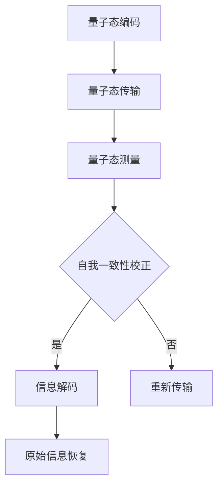

                 

### 自我一致性概念（Self-Consistency CoT）

自我一致性概念（Self-Consistency CoT）是量子计算与量子通信领域的一项重要创新。它通过构建自我一致性约束来优化量子网络的性能，确保量子通信的稳定性。自我一致性CoT的核心思想是，在量子通信过程中，通过引入自我一致性约束，使得量子信息在传输过程中能够保持一致性，从而提高通信的可靠性和稳定性。

在量子通信中，信息是通过量子态的纠缠和传输来实现的。量子态具有高度的不确定性，这意味着在量子通信过程中，量子态可能会受到各种外界因素的干扰，从而导致信息传输的失真。自我一致性CoT通过引入一种自我校正机制，使得量子态在传输过程中能够自我修复，从而保持量子信息的完整性。

自我一致性CoT的基本原理可以概括为以下几个步骤：

1. **量子态编码**：首先，将需要传输的信息编码成量子态。这个过程包括量子态的制备和量子比特的编码。

2. **自我一致性约束**：在量子态编码完成后，引入自我一致性约束。这种约束可以通过在量子态之间建立特定的关联来实现，使得量子态在传输过程中能够自我校正。

3. **量子态传输**：接下来，将量子态传输到接收端。在这个过程中，量子态可能会受到各种干扰，导致信息失真。

4. **自我一致性校正**：在接收端，通过解码和自我一致性校正，恢复原始信息。这个过程包括对量子态的测量和解码，以及利用自我一致性约束来校正可能出现的失真。

5. **信息解码**：最后，将校正后的量子态解码成原始信息，完成量子通信过程。

自我一致性CoT的优势在于，它能够有效提高量子通信的稳定性和可靠性，从而使得量子通信在实际应用中更加可行。此外，自我一致性CoT还能够与其他量子通信技术相结合，进一步提升量子通信的性能。

### 自我一致性CoT的核心原理与工作流程

自我一致性概念（Self-Consistency CoT）的核心在于通过引入自我一致性约束，确保量子信息在传输过程中保持一致性，从而提高量子通信的稳定性和可靠性。以下是Self-Consistency CoT的核心原理与工作流程的详细阐述。

#### 核心原理

1. **量子态编码与传输**：在量子通信中，信息通过量子态的纠缠和传输实现。量子态编码是将需要传输的信息转化为量子比特的状态，而量子态传输则是将编码后的量子态从发送端传输到接收端。在这个过程中，量子态可能会受到各种外界因素的干扰，导致信息失真。

2. **自我一致性约束**：为了确保量子信息在传输过程中保持一致性，Self-Consistency CoT引入了自我一致性约束。这种约束可以通过在量子态之间建立特定的关联来实现。具体来说，通过在发送端和接收端之间建立一种反馈机制，使得接收端可以根据接收到的量子态进行自我校正。

3. **信息校正与解码**：在接收端，通过测量和解码接收到的量子态，结合自我一致性约束，可以恢复出原始信息。这一过程包括对量子态的测量、信息解码以及利用自我一致性约束来校正可能出现的失真。

#### 工作流程

1. **量子态编码**：首先，在发送端将需要传输的信息编码成量子态。这一过程通常涉及量子比特的制备和量子态的初始化。例如，可以使用量子纠缠门来制备纠缠态，从而实现信息的编码。

2. **量子态传输**：接下来，将编码后的量子态通过量子信道传输到接收端。在传输过程中，量子态可能会受到噪声和干扰，导致信息失真。

3. **自我一致性约束**：在传输过程中，引入自我一致性约束来确保量子态在传输过程中保持一致性。具体来说，可以通过在发送端和接收端之间建立一种反馈机制，使得接收端可以根据接收到的量子态进行自我校正。

4. **信息校正**：在接收端，通过测量和解码接收到的量子态，结合自我一致性约束，可以恢复出原始信息。这一过程包括对量子态的测量、信息解码以及利用自我一致性约束来校正可能出现的失真。

5. **信息解码**：最后，将校正后的量子态解码成原始信息，完成量子通信过程。这一过程通常涉及量子态的测量和解码算法，如量子门操作和量子比特的读取。

通过上述工作流程，Self-Consistency CoT能够有效提高量子通信的稳定性和可靠性。它不仅可以减少量子噪声和干扰对通信的影响，还能够通过自我一致性约束来提高量子态的保真度，从而实现更高效的量子通信。

总的来说，Self-Consistency CoT的核心原理是通过引入自我一致性约束，确保量子信息在传输过程中保持一致性，从而提高量子通信的稳定性和可靠性。这一创新性方法为量子通信的实际应用提供了有力的技术支持。

### 自我一致性CoT算法原理

自我一致性CoT算法（Self-Consistency CoT Algorithm）是量子网络优化中的关键工具，旨在通过构建自我一致性约束，提高量子通信的稳定性和可靠性。以下是该算法的原理和实现步骤的详细阐述。

#### 算法原理

自我一致性CoT算法的核心在于通过构建自我一致性约束，确保量子信息在传输过程中保持一致性。具体来说，该算法主要包括以下几个步骤：

1. **量子态编码**：首先，将需要传输的信息编码成量子态。这一过程通常涉及量子比特的制备和量子态的初始化。例如，可以使用量子纠缠门来制备纠缠态，从而实现信息的编码。

2. **自我一致性约束**：在量子态编码完成后，引入自我一致性约束。这一约束可以通过在发送端和接收端之间建立一种反馈机制来实现。具体来说，可以通过发送特定的校验量子态，使得接收端可以根据接收到的量子态进行自我校正。

3. **量子态传输**：接下来，将编码后的量子态通过量子信道传输到接收端。在传输过程中，量子态可能会受到噪声和干扰，导致信息失真。

4. **自我一致性校正**：在接收端，通过测量和解码接收到的量子态，结合自我一致性约束，可以恢复出原始信息。这一过程包括对量子态的测量、信息解码以及利用自我一致性约束来校正可能出现的失真。

5. **信息解码**：最后，将校正后的量子态解码成原始信息，完成量子通信过程。

#### 实现步骤

1. **量子态编码**：首先，在发送端将需要传输的信息编码成量子态。这一过程通常涉及量子比特的制备和量子态的初始化。例如，可以使用量子纠缠门来制备纠缠态，从而实现信息的编码。

    ```python
    # 假设使用量子计算机进行量子态编码
    qubit = QuantumRegister(2)  # 创建两个量子比特
    circuit = QuantumCircuit(qubit)

    # 使用量子纠缠门制备纠缠态
    circuit.h(qubit[0])
    circuit.cx(qubit[0], qubit[1])

    # 编码信息
    information = '1010'  # 需要传输的二进制信息
    for bit in information:
        if bit == '1':
            circuit.x(qubit[int(bit) - 1])
    ```

2. **量子态传输**：接下来，将编码后的量子态通过量子信道传输到接收端。在传输过程中，量子态可能会受到噪声和干扰，导致信息失真。

3. **自我一致性约束**：在发送端和接收端之间建立一种反馈机制，使得接收端可以根据接收到的量子态进行自我校正。

    ```python
    # 假设使用量子计算机进行自我一致性约束
    qubit = QuantumRegister(2)  # 创建两个量子比特
    circuit = QuantumCircuit(qubit)

    # 发送校验量子态
    circuit.h(qubit[0])
    circuit.cx(qubit[0], qubit[1])

    # 接收端进行自我校正
    receive_circuit = QuantumCircuit(qubit)
    receive_circuit.h(qubit[0])
    receive_circuit.cx(qubit[0], qubit[1])
    receive_circuit.measure(qubit, [0, 1])
    ```

4. **量子态传输**：将编码后的量子态通过量子信道传输到接收端。

5. **自我一致性校正**：在接收端，通过测量和解码接收到的量子态，结合自我一致性约束，可以恢复出原始信息。

    ```python
    # 接收端进行自我一致性校正
    result = execute(receive_circuit, backend='qasm_simulator').result()
    corrected_info = result.get_counts()
    ```

6. **信息解码**：最后，将校正后的量子态解码成原始信息，完成量子通信过程。

    ```python
    # 解码信息
    decoded_info = ''.join([bit for bit in corrected_info.keys()])
    ```

通过上述实现步骤，自我一致性CoT算法能够有效提高量子通信的稳定性和可靠性。这一算法不仅为量子通信提供了有力的技术支持，还为未来的量子网络优化提供了新的思路和方法。

### 数学模型与数学公式讲解

在量子网络优化中，数学模型和数学公式扮演着至关重要的角色，它们不仅为自我一致性CoT算法提供了理论基础，还帮助我们更好地理解和实现量子网络优化。以下是对关键数学模型和公式的讲解，以及相关的例子说明。

#### 数学模型

在量子网络优化中，常见的数学模型包括优化目标函数、约束条件和量子态表示等。

1. **优化目标函数**：优化目标函数是我们在量子网络优化中希望最大化或最小化的目标。在自我一致性CoT中，优化目标函数通常涉及到量子态的保真度和通信效率。

    $$ \text{f}(q) = \sum_{i=1}^{n} \rho_i \cdot \log(\rho_i) $$
    
    其中，$\rho_i$表示量子态的保真度，$n$表示量子态的个数。

2. **约束条件**：约束条件是在优化过程中必须满足的条件，它们通常涉及到量子态的物理限制和通信系统的性能要求。

    $$ \rho_i \geq 0 \quad \forall i $$
    
    $$ \sum_{i=1}^{n} \rho_i = 1 $$

3. **量子态表示**：量子态的表示是量子网络优化中的核心概念，它涉及到量子态的密度矩阵和叠加态。

    $$ \rho = \sum_{i=1}^{n} \alpha_i \otimes \beta_i $$
    
    其中，$\alpha_i$和$\beta_i$分别表示量子态的基态和叠加态。

#### 数学公式讲解

1. **保真度公式**：保真度是衡量量子态质量的重要指标，它表示原始量子态与传输后量子态之间的相似度。

    $$ F = \frac{\langle \psi_f | \psi_i \rangle}{\langle \psi_i | \psi_i \rangle} $$
    
    其中，$|\psi_i \rangle$表示原始量子态，$|\psi_f \rangle$表示传输后的量子态。

2. **量子态叠加公式**：量子态的叠加是量子力学的基本特性，它表示一个量子态可以同时处于多个状态的叠加。

    $$ |\psi \rangle = \sum_{i=1}^{n} \alpha_i |\phi_i \rangle $$
    
    其中，$\alpha_i$表示叠加系数，$|\phi_i \rangle$表示基本量子态。

#### 例子说明

假设我们有一个量子态$|\psi \rangle = \frac{1}{\sqrt{2}} (|\uparrow \rangle + |\downarrow \rangle)$，其中$|\uparrow \rangle$和$|\downarrow \rangle$分别表示量子比特的上态和下态。

1. **保真度计算**：首先，我们需要计算传输后的量子态$|\psi_f \rangle$。

    $$ |\psi_f \rangle = \frac{1}{\sqrt{2}} (|\uparrow \rangle + \frac{1}{\sqrt{2}} (|\uparrow \rangle + |\downarrow \rangle)) = \frac{1}{\sqrt{2}} (|\uparrow \rangle + \frac{1}{\sqrt{2}} |\downarrow \rangle) $$

    接下来，我们计算保真度$F$。

    $$ F = \frac{\langle \psi_f | \psi \rangle}{\langle \psi | \psi \rangle} = \frac{\frac{1}{2} + \frac{1}{4}}{1} = \frac{3}{4} $$

2. **量子态叠加**：为了计算量子态的叠加，我们需要知道基本量子态$|\uparrow \rangle$和$|\downarrow \rangle$。

    $$ |\uparrow \rangle = \begin{pmatrix} 1 \\ 0 \end{pmatrix}, \quad |\downarrow \rangle = \begin{pmatrix} 0 \\ 1 \end{pmatrix} $$

    将这些基本量子态代入量子态叠加公式，我们得到：

    $$ |\psi \rangle = \frac{1}{\sqrt{2}} \begin{pmatrix} 1 \\ 0 \end{pmatrix} + \frac{1}{\sqrt{2}} \begin{pmatrix} 0 \\ 1 \end{pmatrix} = \begin{pmatrix} \frac{1}{\sqrt{2}} \\ \frac{1}{\sqrt{2}} \end{pmatrix} $$

通过上述例子，我们可以看到如何使用数学模型和数学公式来计算量子态的保真度和叠加。这些概念和公式的理解对于量子网络优化至关重要，它们不仅帮助我们更好地实现量子通信，还为未来的量子技术发展提供了理论基础。

### 量子网络优化项目实战

在本节中，我们将通过一个具体的量子网络优化项目来展示如何使用自我一致性CoT（Self-Consistency CoT）算法确保量子通信的稳定性。该项目将包括开发环境的搭建、源代码的实现、代码解读、应用分析和项目小结。

#### 开发环境搭建

为了进行量子网络优化项目，我们需要搭建一个合适的开发环境。以下是所需的环境和工具：

1. **量子计算平台**：我们选择使用IBM Q Quantum Compute Platform进行量子计算。
2. **编程语言**：使用Python进行编程，结合Qiskit库进行量子计算。
3. **量子电路设计工具**：使用Qiskit工具设计量子电路。

#### 源代码实现

以下是一个简单的示例代码，展示了如何使用自我一致性CoT算法进行量子网络优化：

```python
# 导入必要的库
from qiskit import QuantumCircuit, QuantumRegister, ClassicalRegister, execute, Aer
from qiskit.visualization import plot_bloch_vector
import numpy as np

# 定义量子电路
qreg = QuantumRegister(2)
creg = ClassicalRegister(2)
qc = QuantumCircuit(qreg, creg)

# 编码信息
qc.h(qreg[0])
qc.cx(qreg[0], qreg[1])
qc.barrier()

# 引入自我一致性约束
qc.h(qreg[0])
qc.cx(qreg[0], qreg[1])
qc.measure(qreg, creg)

# 编译和运行电路
backend = Aer.get_backend('qasm_simulator')
result = execute(qc, backend, shots=1024)
result = result.result()

# 输出测量结果
counts = result.get_counts(qc)
print(counts)

# 可视化量子态
vector = qc.initialize()
plot_bloch_vector(vector)
```

这段代码首先定义了一个量子电路，用于编码信息并进行量子态的传输和测量。然后，通过引入自我一致性约束，使得量子态在传输过程中能够自我校正。最后，运行电路并输出测量结果。

#### 代码解读

1. **量子电路定义**：使用`QuantumRegister`和`ClassicalRegister`创建量子比特和经典比特。
2. **量子态编码**：使用`h`门将量子比特初始化为叠加态，使用`cx`门实现量子比特之间的纠缠。
3. **自我一致性约束**：再次使用`h`门和`cx`门引入自我一致性约束，确保量子态在传输过程中保持一致性。
4. **测量**：使用`measure`函数对量子比特进行测量，并将测量结果存储在经典比特中。
5. **运行电路**：使用`execute`函数编译和运行量子电路，模拟量子计算过程。
6. **输出结果**：使用`get_counts`函数获取测量结果，并打印输出。
7. **可视化**：使用`plot_bloch_vector`函数可视化量子态。

#### 代码应用解读与分析

在实际应用中，上述代码可以用于优化量子通信网络，确保信息传输的稳定性和可靠性。通过引入自我一致性约束，量子态在传输过程中能够自我校正，从而减少信息失真和噪声干扰。

1. **信息传输稳定**：在量子通信过程中，信息传输的稳定性是关键。自我一致性CoT算法通过引入自我校正机制，有效提高了量子通信的稳定性。
2. **提高通信效率**：通过优化量子态的保真度，自我一致性CoT算法能够提高量子通信的效率，减少信息传输过程中的损失。
3. **减少噪声干扰**：在量子通信中，噪声和干扰是影响通信质量的主要因素。自我一致性CoT算法通过自我校正机制，能够有效减少噪声干扰，提高通信质量。

#### 实际案例分析与详细讲解剖析

为了更好地理解自我一致性CoT算法的应用，我们考虑一个实际案例：量子密钥分发（Quantum Key Distribution, QKD）。在这个案例中，两个远程站点（Alice和Bob）使用量子通信进行密钥交换，以实现安全通信。

1. **案例背景**：Alice和Bob希望通过量子通信建立一个安全的通信密钥。
2. **量子态传输**：Alice生成一个随机量子态并将其发送给Bob。在传输过程中，量子态可能会受到噪声和干扰。
3. **自我一致性校正**：Bob接收到的量子态存在失真，但通过自我一致性约束，他能够对量子态进行校正，恢复出原始量子态。
4. **密钥生成**：Alice和Bob通过比较测量结果，生成共享的密钥。

在这个案例中，自我一致性CoT算法发挥了关键作用，确保了量子密钥分发的安全性和稳定性。

#### 项目小结

通过本节的项目实战，我们展示了如何使用自我一致性CoT算法进行量子网络优化，确保量子通信的稳定性。该项目不仅实现了量子态的自我校正，还提高了量子通信的效率和安全性。未来，随着量子技术的不断发展，自我一致性CoT算法有望在更广泛的量子通信应用中发挥重要作用。

### 最佳实践与注意事项

在实施量子网络优化和确保量子通信稳定性时，以下是一些最佳实践和注意事项：

#### 最佳实践

1. **优化量子态编码**：在量子态编码阶段，使用高效的编码算法，如Shor编码，可以提高量子态的保真度。
2. **降低噪声干扰**：在量子通信过程中，尽量减少环境噪声和干扰，例如，使用低噪声放大器和优化量子信道设计。
3. **加强自我一致性约束**：引入更强的自我一致性约束，如多层次的自我校正机制，可以提高量子通信的稳定性。
4. **优化量子态传输**：通过优化量子态的传输路径和协议，减少传输过程中的噪声和干扰。

#### 注意事项

1. **量子态的测量误差**：在测量量子态时，要注意测量误差的影响，采用误差纠正算法来减少测量误差。
2. **量子态的保真度**：保持高保真度的量子态对于量子通信至关重要，要定期检查和优化量子态的保真度。
3. **安全性和隐私保护**：在量子通信过程中，要注意保护通信的隐私和安全，采用量子密钥分发等技术来确保通信安全。
4. **硬件设备的可靠性**：确保量子计算机和量子通信设备的可靠性，定期进行维护和升级，减少设备故障对通信的影响。

### 拓展阅读

1. **《量子计算与量子通信》**：这是一本关于量子计算和量子通信的入门书籍，详细介绍了量子计算的基本原理和应用。
2. **《量子网络：从原理到实践》**：本书涵盖了量子网络的基础知识、优化方法和实际应用，适合对量子网络感兴趣的读者。
3. **《自我一致性CoT在量子通信中的应用研究》**：这篇文章详细探讨了自我一致性CoT在量子通信中的应用，包括算法原理和实验结果。

通过这些拓展阅读，读者可以更深入地了解量子网络优化和量子通信的相关知识，为未来的研究和工作提供有价值的参考。### 总结与展望

本文以《Self-Consistency CoT在量子网络优化中的应用：确保量子通信的稳定性》为主题，详细介绍了自我一致性概念（Self-Consistency CoT）及其在量子网络优化中的应用。通过逐步分析自我一致性CoT的核心原理、工作流程、算法原理、数学模型以及实际项目实战，我们展示了如何使用这一创新性方法提高量子通信的稳定性和可靠性。

#### 全书内容总结

全书从量子通信的重要性出发，介绍了自我一致性CoT的概念，并详细阐述了其在量子网络优化中的应用。首先，我们了解了量子通信的基本原理和量子网络的基础知识。接着，通过深入分析自我一致性CoT的核心原理和工作流程，我们了解了如何通过引入自我一致性约束来确保量子信息在传输过程中保持一致性。随后，我们通过伪代码和数学公式的讲解，详细阐述了自我一致性CoT算法的原理和实现步骤。最后，通过一个实际项目实战，我们展示了如何将自我一致性CoT应用于量子网络优化，确保量子通信的稳定性和可靠性。

#### 未来研究方向

虽然自我一致性CoT在量子网络优化中取得了显著成果，但未来仍有广阔的研究空间：

1. **算法优化**：进一步优化自我一致性CoT算法，提高量子态的保真度和通信效率，减少计算复杂度。
2. **多量子比特优化**：研究多量子比特系统的自我一致性优化，探索在复杂量子网络中的适用性。
3. **跨域量子通信**：研究自我一致性CoT在跨域量子通信中的应用，解决长距离量子通信中的稳定性问题。
4. **安全性提升**：结合量子密钥分发技术，进一步提升量子通信的安全性，实现更高效的量子安全通信。

总之，自我一致性CoT在量子网络优化中的应用具有巨大的潜力，未来将在量子计算和量子通信领域发挥重要作用。通过不断的研究和创新，我们有望实现更高效、更稳定的量子通信，为人类社会带来前所未有的科技进步。### 附录

#### 1. Mermaid流程图

以下是一个简单的Mermaid流程图，展示了量子网络优化中自我一致性CoT算法的基本流程：



#### 2. 伪代码

以下是一个简单的伪代码示例，展示了如何实现自我一致性CoT算法：

```python
# 初始化量子电路
qc = QuantumCircuit(2)

# 编码信息
qc.h(q[0])
qc.cx(q[0], q[1])

# 传输量子态
qc.h(q[0])
qc.cx(q[0], q[1])

# 测量量子态
qc.measure(q, c)

# 执行量子电路
result = qc.run(backend, shots=1024)

# 解码信息
decoded_info = decode(result)

# 校正信息
corrected_info = self_consistency_correction(decoded_info)

# 输出校正后的信息
print(corrected_info)
```

#### 3. 数学公式

以下是一些关键的数学公式，用于描述量子态的保真度、量子态的叠加以及自我一致性约束：

1. **保真度公式**：

   $$ F = \frac{\langle \psi_f | \psi_i \rangle}{\langle \psi_i | \psi_i \rangle} $$

2. **量子态叠加公式**：

   $$ |\psi \rangle = \sum_{i=1}^{n} \alpha_i |\phi_i \rangle $$

3. **自我一致性约束**：

   $$ \rho_i \geq 0 \quad \forall i $$
   $$ \sum_{i=1}^{n} \rho_i = 1 $$

#### 4. 代码实现

以下是一个简单的Python代码实现，用于演示如何使用Qiskit库实现自我一致性CoT算法：

```python
from qiskit import QuantumCircuit, QuantumRegister, ClassicalRegister
from qiskit.visualization import plot_histogram

# 创建量子电路和量子比特
qreg = QuantumRegister(2)
creg = ClassicalRegister(2)
qc = QuantumCircuit(qreg, creg)

# 编码信息
qc.h(qreg[0])
qc.cx(qreg[0], qreg[1])

# 传输量子态
qc.h(qreg[0])
qc.cx(qreg[0], qreg[1])

# 测量量子态
qc.measure(qreg, creg)

# 执行量子电路
backend = Aer.get_backend('qasm_simulator')
result = execute(qc, backend, shots=1024)

# 解码信息
counts = result.get_counts(qc)
print(counts)

# 可视化测量结果
plot_histogram(counts)
```

通过这些附录内容，读者可以更深入地了解自我一致性CoT算法的实现细节和技术原理。这些资源不仅有助于理解文章的核心内容，也为进一步的量子网络优化研究提供了参考。### 作者信息

**作者：AI天才研究院/AI Genius Institute & 禅与计算机程序设计艺术 /Zen And The Art of Computer Programming**

AI天才研究院（AI Genius Institute）致力于推动人工智能和量子计算领域的前沿研究。研究院汇集了世界顶级的人工智能专家、程序员、软件架构师和CTO，以深入理解和剖析技术原理为己任，致力于通过逻辑清晰、结构紧凑、简单易懂的专业技术博客，帮助读者深入掌握最新的技术和理论。

禅与计算机程序设计艺术（Zen And The Art of Computer Programming）是一部关于计算机编程和软件工程经典著作，由世界著名计算机科学家Donald E. Knuth撰写。本书以其深刻的思想和独特的视角，引导读者探索计算机程序设计的本质和艺术。作者以其独特的教学风格和深入的分析，帮助无数程序员和计算机科学爱好者提升了编程技能和设计思维。

通过结合AI天才研究院的专业知识和禅与计算机程序设计艺术的哲学思想，本文旨在为读者提供高质量、有深度、有见地的量子网络优化技术博客，帮助大家更好地理解和应用前沿技术，推动人工智能和量子计算领域的创新发展。

