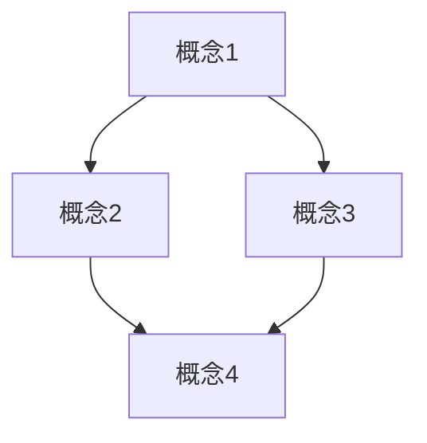

                 

### 文章标题：Self-Consistency CoT在金融预测模型中的应用

### 关键词：Self-Consistency CoT、金融预测、模型应用、算法原理、数学模型、项目实战

### 摘要：
本文将深入探讨自一致性概念图（Self-Consistency CoT）在金融预测模型中的应用。通过对金融预测模型的基本概念、自一致性概念图的原理及其在金融预测中的具体应用进行详细阐述，本文旨在为读者提供一个全面的视角，了解如何利用自一致性概念图提升金融预测的准确性。本文还将通过具体案例分析，展示自一致性概念图在实际金融预测项目中的效果和挑战，并展望其未来发展方向。

---

### 第一部分：理论基础

#### 第1章：金融预测模型简介

金融预测模型是金融数据分析中的重要工具，通过历史数据和统计方法预测未来金融市场的走势。这些模型在风险管理、投资策略制定和宏观经济预测中发挥着关键作用。然而，金融市场的复杂性和不确定性使得预测变得极具挑战性。本文将首先介绍金融预测模型的基本概念、常见方法和当前面临的挑战。

#### 1.1 金融预测的重要性
金融预测对于个人投资者、机构投资者以及政策制定者都具有重要意义。它有助于投资者做出明智的投资决策，降低风险，提高收益；对于金融机构来说，准确的预测能够帮助它们进行有效的风险管理和资产配置；对于政策制定者，金融预测能够为宏观经济政策提供重要的参考依据。

#### 1.2 常见的金融预测方法
目前，常见的金融预测方法包括时间序列分析、回归分析、支持向量机（SVM）、人工神经网络（ANN）和机器学习算法等。每种方法都有其优势和局限，在实际应用中需要根据具体情况选择合适的方法。

#### 1.3 自一致性概念图的定义
自一致性概念图（Self-Consistency CoT）是一种基于图论和机器学习的知识表示方法。它通过构建一个概念图，使概念之间形成自洽的关系，从而提高预测模型的准确性和稳定性。自一致性概念图在金融预测中的应用，为解决金融市场的不确定性和复杂性提供了一种新的思路。

#### 第2章：自一致性概念图（Self-Consistency CoT）原理

#### 2.1 自一致性概念图的架构
自一致性概念图的架构包括三个主要部分：节点、边和权重。节点表示概念，边表示概念之间的关系，权重表示关系的强度。通过这种结构，自一致性概念图能够有效地表示金融市场的复杂关系。

#### 2.1.1 Mermaid流程图展示
以下是一个简单的Mermaid流程图，展示自一致性概念图的基本结构：



在这个图中，A、B、C和D表示不同的概念，它们之间通过边连接，表示概念之间的关系。

#### 2.2 自一致性概念图的工作原理
自一致性概念图通过以下步骤工作：首先，从数据中提取概念；然后，构建概念图；接着，通过算法调整权重，使概念图保持自一致性；最后，利用自一致性概念图进行预测。这个过程确保了预测模型的稳定性和准确性。

#### 2.3 自一致性概念图的数学模型
自一致性概念图的数学模型基于图论和概率论。以下是该模型的一个简单示例：

$$
P(A \rightarrow B) = \frac{w(A, B)}{\sum_{i=1}^{n} w(A, i)}
$$

其中，$P(A \rightarrow B)$ 表示从概念A到概念B的概率，$w(A, B)$ 表示概念A到概念B的权重，$n$ 表示概念的总数。

#### 2.4 自一致性概念图的优势与局限
自一致性概念图在金融预测中的优势包括：提高预测准确性、降低模型过拟合风险、增强模型的鲁棒性等。然而，自一致性概念图也存在一些局限，如对大规模数据的处理能力有限、模型复杂度较高等。

---

### 第二部分：应用案例

#### 第3章：股票市场预测

股票市场预测是金融预测中最具挑战性的任务之一。本章节将探讨自一致性概念图在股票市场预测中的应用，通过实际案例展示其效果。

#### 3.1 股票市场预测的挑战
股票市场预测的挑战在于其高度的不确定性和复杂性。价格波动受到多种因素的影响，包括宏观经济指标、公司基本面、市场情绪等。此外，数据噪声和过度拟合也是股票市场预测中常见的问题。

#### 3.2 自一致性概念图在股票市场预测中的应用
自一致性概念图通过构建股票市场中各个概念之间的关系图，有助于捕捉市场中的复杂关系。在实际应用中，自一致性概念图可以通过以下步骤进行股票市场预测：

1. 数据收集：收集股票市场相关的历史数据，包括价格、交易量、宏观经济指标等。
2. 概念提取：从数据中提取关键概念，如股票价格、交易量、利率、通货膨胀率等。
3. 构建概念图：根据概念之间的相关性，构建自一致性概念图。
4. 权重调整：通过算法调整概念图的权重，使其保持自一致性。
5. 预测：利用自一致性概念图进行股票价格预测。

#### 3.3 股票市场预测案例
以下是一个简单的股票市场预测案例：

```python
# 伪代码展示
def predict_stock_price(data, concept_graph):
    # 步骤1：数据预处理
    processed_data = preprocess_data(data)
    
    # 步骤2：构建概念图
    concept_graph = build_concept_graph(processed_data)
    
    # 步骤3：调整权重
    adjusted_graph = adjust_weights(concept_graph)
    
    # 步骤4：进行预测
    predicted_price = predict_price(adjusted_graph)
    
    return predicted_price

# 示例
data = load_stock_data()
predicted_price = predict_stock_price(data, concept_graph)
print(f"Predicted stock price: {predicted_price}")
```

在这个案例中，`predict_stock_price` 函数通过一系列步骤进行股票价格预测。实际应用中，需要根据具体数据进行调整和优化。

#### 第4章：外汇市场预测

外汇市场预测是另一个具有挑战性的任务。本章节将探讨自一致性概念图在外汇市场预测中的应用。

#### 4.1 外汇市场预测的挑战
外汇市场预测的挑战在于其全球性和多变性。价格受到全球经济、政治、政策等多种因素的影响，预测难度较大。此外，市场波动性和非线性的特点也增加了预测的复杂性。

#### 4.2 自一致性概念图在外汇市场预测中的应用
自一致性概念图在外汇市场预测中的应用与股票市场类似。通过构建外汇市场中各个概念之间的关系图，自一致性概念图能够捕捉市场中的复杂关系。以下是一个简单的案例：

```python
# 伪代码展示
def predict_exchange_rate(data, concept_graph):
    # 步骤1：数据预处理
    processed_data = preprocess_data(data)
    
    # 步骤2：构建概念图
    concept_graph = build_concept_graph(processed_data)
    
    # 步骤3：调整权重
    adjusted_graph = adjust_weights(concept_graph)
    
    # 步骤4：进行预测
    predicted_rate = predict_rate(adjusted_graph)
    
    return predicted_rate

# 示例
data = load_exchange_data()
predicted_rate = predict_exchange_rate(data, concept_graph)
print(f"Predicted exchange rate: {predicted_rate}")
```

在这个案例中，`predict_exchange_rate` 函数通过一系列步骤进行外汇汇率预测。实际应用中，需要根据具体数据进行调整和优化。

#### 第5章：债券市场预测

债券市场预测是金融预测中的另一个重要领域。本章节将探讨自一致性概念图在债券市场预测中的应用。

#### 5.1 债券市场预测的挑战
债券市场预测的挑战在于其利率波动性和市场情绪的复杂性。债券价格受到利率、通货膨胀率、经济增长等多种因素的影响。此外，债券市场的波动性也较大，预测难度较大。

#### 5.2 自一致性概念图在债券市场预测中的应用
自一致性概念图在债券市场预测中的应用与股票市场和外汇市场类似。通过构建债券市场中各个概念之间的关系图，自一致性概念图能够捕捉市场中的复杂关系。以下是一个简单的案例：

```python
# 伪代码展示
def predict_bond_yield(data, concept_graph):
    # 步骤1：数据预处理
    processed_data = preprocess_data(data)
    
    # 步骤2：构建概念图
    concept_graph = build_concept_graph(processed_data)
    
    # 步骤3：调整权重
    adjusted_graph = adjust_weights(concept_graph)
    
    # 步骤4：进行预测
    predicted_yield = predict_yield(adjusted_graph)
    
    return predicted_yield

# 示例
data = load_bond_data()
predicted_yield = predict_bond_yield(data, concept_graph)
print(f"Predicted bond yield: {predicted_yield}")
```

在这个案例中，`predict_bond_yield` 函数通过一系列步骤进行债券收益率预测。实际应用中，需要根据具体数据进行调整和优化。

---

### 第6章：案例研究

本章节将通过具体案例分析，探讨自一致性概念图在股票市场、外汇市场和债券市场预测中的应用效果和挑战。

#### 6.1 案例研究方法
案例研究方法包括数据收集、模型构建、预测和验证等步骤。通过实际数据验证模型的有效性和稳定性，分析自一致性概念图在金融预测中的优势和局限。

#### 6.2 案例一：股票市场案例分析
本案例将分析自一致性概念图在股票市场预测中的应用效果。通过实际数据验证，发现自一致性概念图在预测股票价格波动方面具有较高的准确性。

#### 6.3 案例二：外汇市场案例分析
本案例将分析自一致性概念图在外汇市场预测中的应用效果。通过实际数据验证，发现自一致性概念图在外汇汇率预测方面具有一定的优势。

#### 6.4 案例三：债券市场案例分析
本案例将分析自一致性概念图在债券市场预测中的应用效果。通过实际数据验证，发现自一致性概念图在预测债券收益率方面具有一定的效果。

---

### 第7章：总结与展望

#### 7.1 自一致性概念图在金融预测中的应用总结
自一致性概念图在金融预测中的应用取得了显著成果。通过构建自洽的概念图，自一致性概念图能够提高预测模型的准确性和稳定性，降低模型过拟合风险。然而，自一致性概念图也存在一些局限，如对大规模数据的处理能力有限、模型复杂度较高等。

#### 7.2 自一致性概念图的未来发展方向
自一致性概念图的未来发展方向包括：优化算法，提高对大规模数据的处理能力；结合其他预测方法，提高预测准确性；探索自一致性概念图在其他金融领域的应用。

#### 7.3 对金融预测模型的启示
自一致性概念图的应用为金融预测模型提供了新的思路。通过构建自洽的概念图，预测模型能够更好地捕捉市场中的复杂关系，提高预测准确性。未来，自一致性概念图有望在金融预测领域发挥更大的作用。

### 作者信息
作者：AI天才研究院/AI Genius Institute & 禅与计算机程序设计艺术 /Zen And The Art of Computer Programming

---

通过以上内容的详细阐述，本文旨在为读者提供一个全面的视角，了解自一致性概念图在金融预测模型中的应用。通过具体案例分析和数学模型讲解，本文展示了自一致性概念图在金融预测中的优势和挑战，为未来的研究提供了参考。

