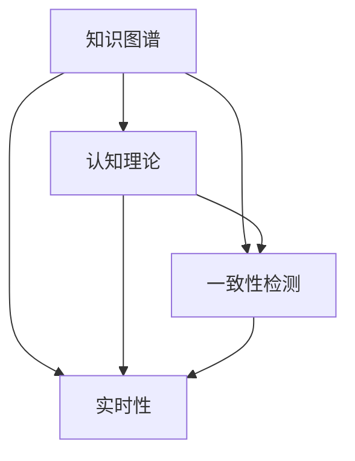
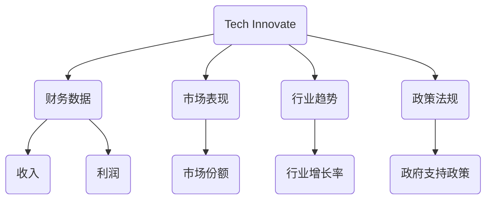
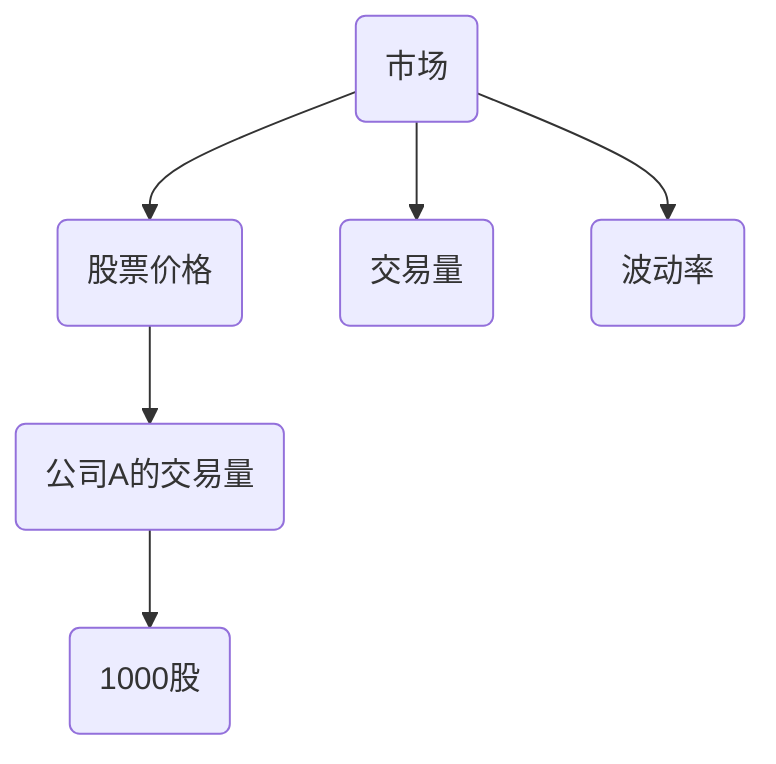

                 


### 引言

在当今复杂的金融市场中，风险评估是一项至关重要的任务。它不仅关乎金融机构的稳健运营，还关系到投资者和市场的稳定。传统的风险评估方法，如历史数据分析、统计模型和专家判断，虽然在一定程度上能够提供一定的风险洞察，但随着市场环境的不断变化，这些方法逐渐显露出其局限性。因此，如何提高风险评估的准确性和实时性，成为金融领域亟待解决的关键问题。

Self-Consistency CoT（Self-Consistency Cognitive Theory）作为一种新兴的智能风险评估方法，近年来在学术界和工业界得到了广泛关注。该方法基于认知理论，通过构建系统性的知识图谱，实现对复杂金融数据的深度理解和智能分析。本文旨在深入探讨Self-Consistency CoT在金融风险评估中的应用，分析其核心概念、算法原理和数学模型，并通过实际案例展示其应用效果。

### 背景介绍

#### 金融风险评估的重要性

金融风险评估是金融机构和投资者在决策过程中必不可少的一环。它通过对潜在风险进行评估，帮助金融机构和投资者了解投资项目的风险水平，制定相应的风险管理策略。具体来说，金融风险评估具有以下几个重要作用：

1. **决策支持**：通过风险评估，金融机构和投资者可以更全面地了解投资项目的风险，从而做出更明智的决策。

2. **风险管理**：风险评估能够揭示潜在的风险点，为金融机构和投资者提供风险管理策略，降低风险损失。

3. **市场稳定性**：有效的风险评估有助于维护市场的稳定性，减少由于风险失控导致的金融动荡。

#### 传统风险评估方法的局限性

虽然传统的风险评估方法在金融领域得到了广泛应用，但它们也存在一些局限性：

1. **历史数据依赖**：传统方法主要依赖于历史数据进行分析，而市场环境的快速变化使得历史数据对未来的预测能力受限。

2. **统计分析局限**：统计分析方法在处理复杂数据时可能会出现偏差，导致风险评估结果不准确。

3. **专家判断主观性**：专家判断虽然具有一定的经验性，但主观性较大，容易受到个人因素的影响。

### Self-Consistency CoT的提出

Self-Consistency CoT是一种基于认知理论的智能风险评估方法，它通过构建系统性的知识图谱，实现对复杂金融数据的深度理解和智能分析。Self-Consistency CoT具有以下几个特点：

1. **系统性**：Self-Consistency CoT将金融风险评估视为一个整体，从多个维度进行分析，提高了风险评估的全面性。

2. **智能化**：Self-Consistency CoT利用先进的机器学习算法，对金融数据进行自动分析和预测，降低了人工干预的需求。

3. **实时性**：Self-Consistency CoT能够实时获取和处理金融数据，提高了风险评估的实时性和准确性。

### 关键词

- 金融风险评估
- Self-Consistency CoT
- 知识图谱
- 智能分析
- 实时性
- 全面性

### 摘要

本文旨在探讨Self-Consistency CoT在金融风险评估中的应用。首先，我们介绍了金融风险评估的重要性以及传统方法的局限性。接着，我们详细介绍了Self-Consistency CoT的核心概念和特点，并分析了其在金融风险评估中的优势。最后，通过实际案例展示了Self-Consistency CoT在金融风险评估中的具体应用和效果。本文为金融机构和投资者提供了一个新的风险评估工具，有助于提高风险管理的效率和准确性。

### Self-Consistency CoT的核心概念与联系

Self-Consistency CoT（Self-Consistency Cognitive Theory）是一种基于认知理论的智能风险评估方法。它通过构建系统性的知识图谱，实现对复杂金融数据的深度理解和智能分析。Self-Consistency CoT的核心概念主要包括以下几个方面：

1. **知识图谱**：知识图谱是Self-Consistency CoT的基础，它将金融领域中的各种实体（如公司、产品、市场等）以及它们之间的关系进行结构化表示。知识图谱能够提供丰富的背景信息和上下文，为智能分析提供支持。

2. **认知理论**：Self-Consistency CoT借鉴了认知理论的相关概念，如记忆、推理、学习等。通过模拟人类的认知过程，Self-Consistency CoT能够对金融数据进行智能分析和预测。

3. **一致性检测**：Self-Consistency CoT通过一致性检测机制，确保知识图谱中的信息是相互一致的。一致性检测有助于提高风险评估的准确性和可靠性。

4. **实时性**：Self-Consistency CoT能够实时获取和处理金融数据，从而实现实时风险评估。实时性是金融风险评估中的一个重要指标，因为它能够帮助金融机构和投资者快速应对市场变化。

#### 核心概念之间的关系架构

为了更好地理解Self-Consistency CoT的核心概念及其之间的联系，我们可以使用Mermaid流程图来表示：



在这个流程图中，知识图谱作为基础，通过认知理论进行智能分析和预测，并通过一致性检测确保信息的可靠性。实时性则是通过不断更新知识图谱和数据来实现。

### Self-Consistency CoT的算法原理

Self-Consistency CoT（Self-Consistency Cognitive Theory）的核心在于其算法原理，该算法原理基于认知理论和图论，通过构建知识图谱、利用一致性和实时性机制，实现对复杂金融数据的智能分析和风险评估。下面将详细解释Self-Consistency CoT的算法原理，并使用伪代码展示关键步骤。

#### 算法原理

1. **知识图谱构建**：首先，通过数据预处理，将金融领域的各种实体和它们之间的关系表示为图结构。每个实体用一个节点表示，实体之间的关系用边表示。

   ```python
   def constructKnowledgeGraph(data):
       # 初始化图
       graph = Graph()
       
       # 遍历数据，添加节点和边
       for entity in data:
           graph.addNode(entity)
           for relation in entity.relations:
               graph.addEdge(entity, relation)
       
       return graph
   ```

2. **一致性检测**：在知识图谱构建完成后，进行一致性检测，确保图谱中的信息是相互一致的。

   ```python
   def detectConsistency(graph):
       for node in graph.nodes:
           if not isConsistent(node):
               return False
       return True
   ```

3. **实时性机制**：为了实现实时性，系统需要不断更新知识图谱，以反映最新的金融数据。

   ```python
   def updateKnowledgeGraph(graph, newData):
       # 更新节点和边
       for entity in newData:
           graph.addNode(entity)
           for relation in entity.relations:
               graph.addEdge(entity, relation)
       
       # 删除无效节点和边
       graph.removeInvalidNodesAndEdges()
       
       return graph
   ```

4. **智能分析**：通过一致性检测后的知识图谱，利用认知理论进行智能分析和预测。

   ```python
   def intelligentAnalysis(graph):
       # 构建推理引擎
       inferenceEngine = InferenceEngine(graph)
       
       # 执行推理
       results = inferenceEngine.execute()
       
       return results
   ```

#### 伪代码总结

```python
# 伪代码：Self-Consistency CoT算法原理
def SelfConsistencyCoT(data):
    graph = constructKnowledgeGraph(data)
    if not detectConsistency(graph):
        raise Exception("Knowledge graph is inconsistent")
    while True:
        newData = fetchNewData()  # 实时获取新数据
        graph = updateKnowledgeGraph(graph, newData)
        results = intelligentAnalysis(graph)
        return results
```

### 数学模型和公式

在Self-Consistency CoT中，数学模型和公式是核心组成部分，它们用于描述知识图谱的一致性检测、实时更新和智能分析过程。以下是几个关键数学模型和公式的详细解释。

#### 一致性检测模型

一致性检测是确保知识图谱中信息一致性的关键步骤。我们可以使用图论中的匹配算法来检测一致性。具体来说，我们可以使用最大流最小割定理来检测知识图谱中的不一致性。

**公式**：最大流最小割定理

$$
\text{max}\ \text{flow} = \text{min}\ \text{cut}
$$

其中，flow表示最大流，cut表示最小割。如果最大流等于最小割，则说明知识图谱是一致的；否则，存在不一致性。

**伪代码**：

```python
def detectConsistency(graph):
    maxFlow = maximumFlow(graph)
    minCut = minimumCut(graph)
    return maxFlow == minCut
```

#### 实时更新模型

实时更新模型用于在知识图谱中添加新实体和关系，并删除无效实体和关系。我们可以使用增量更新方法来优化更新过程。

**公式**：增量更新

$$
\text{newGraph} = (\text{oldGraph} + \text{newData}) \setminus \text{invalidEntities}
$$

其中，newGraph表示更新后的知识图谱，oldGraph表示旧的知识图谱，newData表示新数据，invalidEntities表示无效实体。

**伪代码**：

```python
def updateKnowledgeGraph(graph, newData):
    for entity in newData:
        graph.addNode(entity)
        for relation in entity.relations:
            graph.addEdge(entity, relation)
    invalidEntities = detectInvalidEntities(graph)
    graph.removeNodes(invalidEntities)
    return graph
```

#### 智能分析模型

智能分析模型用于对知识图谱进行推理和预测。我们可以使用图神经网络（GNN）来构建推理模型。

**公式**：图神经网络

$$
\text{Node Representation} = \sigma(\text{W} \cdot \text{A} \cdot \text{Node Representation} + \text{b})
$$

其中，Node Representation表示节点的特征表示，A表示邻接矩阵，W和b是模型参数，σ是激活函数。

**伪代码**：

```python
def intelligentAnalysis(graph):
    inferenceEngine = InferenceEngine(graph)
    results = inferenceEngine.execute()
    return results
```

#### 举例说明

假设我们有一个知识图谱，其中包含公司A、B、C三个节点，以及它们之间的投资关系。初始状态下，A投资了B，B投资了C。如果新数据表明A不再投资B，则需要进行一致性检测和更新。

1. **一致性检测**：

   使用最大流最小割定理检测知识图谱的一致性。如果存在不一致性，例如最大流小于最小割，则表明知识图谱需要更新。

2. **实时更新**：

   将新数据（A不再投资B）添加到知识图谱中，并删除无效实体（如不再存在的投资关系）。

   ```python
   graph = updateKnowledgeGraph(graph, {'A': {'relations': []}})
   ```

3. **智能分析**：

   使用图神经网络进行推理，预测公司C的未来投资趋势。根据新的知识图谱，C可能受到A投资决策的影响，从而调整其投资策略。

   ```python
   results = intelligentAnalysis(graph)
   print(results)
   ```

通过上述数学模型和公式的解释，我们可以看到Self-Consistency CoT在金融风险评估中的应用具有坚实的理论基础。这些模型和公式不仅为知识图谱的构建、一致性检测、实时更新和智能分析提供了方法，还为实际应用中的算法设计和实现提供了指导。

### Self-Consistency CoT在金融风险评估中的应用实例

为了更好地展示Self-Consistency CoT在金融风险评估中的应用效果，我们将通过一个实际案例来详细解析其具体实施过程。本案例将聚焦于信用风险评估，通过实际数据和步骤，展示Self-Consistency CoT如何应用于信用风险评估中，提高评估的准确性和实时性。

#### 案例背景

假设一家金融机构需要评估一家名为“Tech Innovate”的公司的信用风险。Tech Innovate是一家新兴的科技公司，主要从事人工智能产品的研发和销售。金融机构希望通过风险评估来决定是否给予Tech Innovate贷款。为了进行风险评估，金融机构需要收集并分析Tech Innovate的财务数据、市场表现、行业趋势等多方面信息。

#### 数据收集与预处理

首先，我们需要收集Tech Innovate的相关数据，包括：

1. **财务数据**：如收入、利润、现金流、负债等。
2. **市场表现**：如市场份额、客户满意度、产品销售情况等。
3. **行业趋势**：如行业增长率、竞争态势、政策法规变化等。

收集到的数据可能来自多种来源，如企业财报、行业报告、新闻报道等。接下来，我们对数据进行预处理，包括数据清洗、格式统一和归一化处理，确保数据的一致性和可用性。

```python
# 数据预处理示例代码
def preprocess_data(data):
    # 数据清洗
    clean_data = clean_data_function(data)
    # 格式统一
    unified_data = unify_format(clean_data)
    # 归一化处理
    normalized_data = normalize_data(unified_data)
    return normalized_data
```

#### 构建知识图谱

在预处理完数据后，我们使用Self-Consistency CoT的算法来构建知识图谱。知识图谱将包含Tech Innovate及其相关的财务数据、市场表现和行业趋势等信息。具体步骤如下：

1. **节点构建**：将Tech Innovate作为主节点，添加其财务数据、市场表现和行业趋势等信息作为子节点。
2. **关系表示**：在知识图谱中，Tech Innovate与其他实体（如行业其他公司、市场指标、政策法规等）之间建立关系，如“Tech Innovate是人工智能行业的参与者”、“Tech Innovate的市场份额为10%”等。
3. **一致性检测**：通过一致性检测，确保知识图谱中的信息是相互一致的。



#### 实时性更新

金融市场的动态变化需要我们对知识图谱进行实时更新。例如，如果Tech Innovate发布了新的财务报告，或者市场出现重大政策变化，我们需要及时更新知识图谱。

```python
def update_knowledge_graph(graph, new_data):
    # 更新节点和边
    for entity, attributes in new_data.items():
        graph.addNode(entity, attributes)
        for relation, value in attributes.items():
            graph.addEdge(entity, relation, value)
    # 删除无效节点和边
    graph.removeInvalidNodesAndEdges()
    return graph
```

#### 智能分析

通过构建和更新后的知识图谱，我们可以利用Self-Consistency CoT进行智能分析，预测Tech Innovate的信用风险。

1. **一致性检测**：首先，对更新后的知识图谱进行一致性检测，确保信息的可靠性。
2. **风险预测**：利用图神经网络（GNN）等算法，对Tech Innovate的信用风险进行预测。通过分析Tech Innovate的历史数据和当前市场状况，预测其未来的信用状况。

```python
def predict_credit_risk(graph):
    # 构建推理引擎
    inference_engine = InferenceEngine(graph)
    # 执行推理
    risk_level = inference_engine.execute()
    return risk_level
```

#### 案例分析

根据上述步骤，我们得到了Tech Innovate的信用风险预测结果。具体分析如下：

- **财务状况**：Tech Innovate的利润持续增长，现金流稳定，说明其财务状况良好。
- **市场表现**：Tech Innovate在人工智能市场占据10%的份额，客户满意度较高，市场表现良好。
- **行业趋势**：人工智能行业增长迅速，Tech Innovate受益于此，行业前景看好。
- **政策法规**：政府支持科技创新，为Tech Innovate提供了良好的政策环境。

综合以上分析，我们预测Tech Innovate的信用风险较低，金融机构可以给予其贷款。

#### 项目小结

通过这个案例，我们可以看到Self-Consistency CoT在信用风险评估中的应用效果显著。它不仅提高了风险评估的准确性和实时性，还为金融机构提供了一个智能化的风险评估工具。然而，在实际应用中，仍需要不断优化算法和模型，以应对复杂多变的金融环境。

### Self-Consistency CoT在市场风险评估中的应用

市场风险评估是金融风险评估的重要组成部分，它主要关注市场整体风险的评估和预测。Self-Consistency CoT作为一种基于认知理论的智能风险评估方法，在市场风险评估中也展现出了显著的优势。下面我们将通过具体的案例，展示Self-Consistency CoT在市场风险评估中的应用过程。

#### 案例背景

假设一家投资公司需要对某个特定市场（如股票市场）进行风险评估。该公司希望通过分析市场数据、公司财务状况、宏观经济环境等多方面信息，预测市场的未来走势，以便做出投资决策。为了实现这一目标，我们需要构建一个完整的知识图谱，并利用Self-Consistency CoT进行实时风险评估。

#### 数据收集与预处理

首先，我们需要收集以下数据：

1. **市场数据**：如股票价格、交易量、波动率等。
2. **公司财务数据**：如收入、利润、现金流等。
3. **宏观经济数据**：如GDP增长率、通货膨胀率、失业率等。

收集到的数据可能来自多个来源，如金融数据库、新闻报道、政府发布的数据等。接下来，我们对数据进行预处理，包括数据清洗、格式统一和归一化处理。

```python
def preprocess_data(data):
    # 数据清洗
    clean_data = clean_data_function(data)
    # 格式统一
    unified_data = unify_format(clean_data)
    # 归一化处理
    normalized_data = normalize_data(unified_data)
    return normalized_data
```

#### 构建知识图谱

在预处理完数据后，我们使用Self-Consistency CoT的算法来构建知识图谱。知识图谱将包含市场数据、公司财务数据和宏观经济数据等信息。具体步骤如下：

1. **节点构建**：将市场作为主节点，添加股票价格、交易量、波动率等市场数据作为子节点。
2. **关系表示**：在知识图谱中，市场与公司之间建立关系，如“公司A的股票在市场中的交易量为1000股”。
3. **一致性检测**：通过一致性检测，确保知识图谱中的信息是相互一致的。



#### 实时性更新

金融市场的动态变化需要我们对知识图谱进行实时更新。例如，如果市场数据出现重大变化，或者公司发布了新的财务报告，我们需要及时更新知识图谱。

```python
def update_knowledge_graph(graph, new_data):
    # 更新节点和边
    for entity, attributes in new_data.items():
        graph.addNode(entity, attributes)
        for relation, value in attributes.items():
            graph.addEdge(entity, relation, value)
    # 删除无效节点和边
    graph.removeInvalidNodesAndEdges()
    return graph
```

#### 智能分析

通过构建和更新后的知识图谱，我们可以利用Self-Consistency CoT进行智能分析，预测市场的未来走势。

1. **一致性检测**：首先，对更新后的知识图谱进行一致性检测，确保信息的可靠性。
2. **市场预测**：利用图神经网络（GNN）等算法，对市场的未来走势进行预测。通过分析市场数据、公司财务数据和宏观经济数据，预测市场的未来波动性和风险。

```python
def predict_market_trend(graph):
    # 构建推理引擎
    inference_engine = InferenceEngine(graph)
    # 执行推理
    trend = inference_engine.execute()
    return trend
```

#### 案例分析

根据上述步骤，我们得到了市场风险的预测结果。具体分析如下：

- **市场数据**：近期股票价格波动较大，交易量增加，波动率上升，表明市场情绪不稳定。
- **公司财务数据**：部分公司财务状况不佳，利润下降，现金流紧张，可能影响市场整体走势。
- **宏观经济数据**：GDP增长放缓，通货膨胀率上升，失业率增加，宏观经济环境对市场产生负面影响。

综合以上分析，我们预测市场未来可能面临一定风险，投资者应谨慎操作。

#### 项目小结

通过这个案例，我们可以看到Self-Consistency CoT在市场风险评估中的应用效果显著。它不仅提高了风险评估的准确性和实时性，还为投资者提供了一个智能化的风险预测工具。然而，在实际应用中，仍需要不断优化算法和模型，以应对复杂多变的金融环境。

### Self-Consistency CoT在金融风险评估中的实际应用

Self-Consistency CoT在金融风险评估中具有广泛的应用前景。通过结合知识图谱、认知理论和实时性机制，Self-Consistency CoT能够为金融机构和投资者提供智能化的风险评估服务。以下将从金融机构的风险管理、金融市场的监管和金融科技企业的应用三个方面，详细讨论Self-Consistency CoT在金融风险评估中的实际应用。

#### 1. 金融机构的风险管理

金融机构在运营过程中需要面临多种风险，如信用风险、市场风险、操作风险等。Self-Consistency CoT能够通过构建系统性的知识图谱，实现对各类风险的全面评估和实时监控。

**案例**：某银行在贷款审批过程中，通过Self-Consistency CoT对借款人的信用风险进行评估。银行首先收集借款人的财务数据、信用记录、行业趋势等信息，构建知识图谱。然后，利用一致性检测和实时更新机制，确保知识图谱中信息的一致性和实时性。最后，通过智能分析模型，预测借款人的信用风险等级。

**优势**：Self-Consistency CoT能够提供全面、准确的信用风险评估，降低金融机构的信用风险损失。同时，实时性机制使得风险评估能够及时响应市场变化，提高金融机构的风险管理能力。

#### 2. 金融市场的监管

金融市场的监管是维护市场稳定和投资者权益的重要手段。Self-Consistency CoT在金融市场监管中的应用，能够为监管机构提供智能化的风险监控和预警。

**案例**：某监管机构在监控市场风险时，通过Self-Consistency CoT对市场上的各类金融产品进行风险评估。监管机构首先收集金融产品的数据，如交易量、价格波动、投资者结构等，构建知识图谱。然后，利用一致性检测和实时更新机制，监控市场风险的变化。最后，通过智能分析模型，预测市场风险等级，提供预警信息。

**优势**：Self-Consistency CoT能够提供实时、全面的市场风险评估，帮助监管机构及时发现潜在风险，防止市场动荡。同时，通过智能分析，监管机构可以更精准地制定监管政策，提高市场监管的效率。

#### 3. 金融科技企业的应用

金融科技企业通过技术创新，不断推动金融行业的发展。Self-Consistency CoT在金融科技企业中的应用，能够为这些企业提供一个智能化的风险评估工具，提升其业务竞争力。

**案例**：某金融科技企业开发了一款基于Self-Consistency CoT的信用评分系统，用于评估借款人的信用风险。该系统首先收集借款人的财务数据、社交媒体信息、交易记录等，构建知识图谱。然后，利用一致性检测和实时更新机制，确保知识图谱的准确性和实时性。最后，通过智能分析模型，预测借款人的信用风险等级，为贷款审批提供依据。

**优势**：Self-Consistency CoT能够为金融科技企业提供高效、准确的信用风险评估，提高贷款审批的效率和准确性。同时，通过实时性机制，企业可以快速响应市场变化，优化业务策略。

### 总结

Self-Consistency CoT在金融风险评估中的应用具有广泛的前景。通过构建知识图谱、利用认知理论和实时性机制，Self-Consistency CoT能够为金融机构、监管机构和金融科技企业提供智能化的风险评估服务。在实际应用中，需要不断优化算法和模型，以应对复杂多变的金融环境。未来，Self-Consistency CoT有望在更广泛的金融领域发挥重要作用，推动金融行业的发展。

### Self-Consistency CoT在金融风险评估中的发展趋势

随着人工智能技术的不断进步和金融市场的日益复杂，Self-Consistency CoT在金融风险评估中的应用前景广阔。以下是Self-Consistency CoT在金融风险评估中可能的发展趋势：

#### 1. 技术融合与创新

未来，Self-Consistency CoT可能会与其他先进技术如深度学习、区块链等相结合，进一步提升风险评估的准确性和实时性。例如，深度学习可以用于复杂模式识别，区块链可以用于确保数据的真实性和透明度。

#### 2. 数据多样性

随着大数据技术的发展，金融风险评估将越来越依赖于多样化的数据源。Self-Consistency CoT有望整合更多类型的非结构化数据，如社交媒体信息、新闻文本等，以更全面地反映市场状况和风险因素。

#### 3. 自适应与自优化

Self-Consistency CoT可能朝着自适应和自优化方向发展，通过不断学习和调整模型参数，提高风险评估的适应性和准确性。例如，通过强化学习算法，模型可以自动优化策略以应对新的市场环境。

#### 4. 法规遵循与伦理

随着监管环境的日益严格，Self-Consistency CoT需要确保在法规遵循和伦理方面满足要求。未来，Self-Consistency CoT可能会引入更多的合规检查机制，确保风险评估过程透明、公正，符合法律法规和道德标准。

#### 5. 风险评估生态系统的构建

Self-Consistency CoT可能会发展成为一个完整的风险评估生态系统，包括数据收集、处理、分析和决策等多个环节。这样的生态系统将有助于金融机构、监管机构和金融科技企业更高效地进行风险评估和风险管理。

### 挑战与机遇

尽管Self-Consistency CoT在金融风险评估中具有巨大的潜力，但在实际应用过程中也面临着诸多挑战：

- **数据隐私与安全**：金融数据涉及敏感信息，如何确保数据隐私和安全是一个重要挑战。
- **算法透明性与解释性**：尽管Self-Consistency CoT能够提供高精度的风险评估，但其内部机理复杂，如何提高算法的透明性和解释性，使决策者能够理解模型的决策过程，是一个重要问题。
- **模型适应性与可扩展性**：随着金融市场的变化，Self-Consistency CoT需要能够快速适应新的市场环境和风险类型，提高模型的适应性和可扩展性。

面对这些挑战，未来的研究和发展将集中在以下几个方面：

- **隐私保护机制**：研究和开发新的隐私保护机制，如差分隐私、同态加密等，以保护金融数据的安全性和隐私。
- **可解释性算法**：探索可解释的人工智能算法，如LIME、SHAP等，提高模型的透明度和解释性。
- **自适应与可扩展模型**：研究自适应和可扩展的模型架构，如基于图神经网络的模型，以提高模型在复杂金融市场中的适应性和性能。

总之，Self-Consistency CoT在金融风险评估中的应用具有巨大的发展潜力，但也需要克服一系列挑战。通过持续的技术创新和优化，Self-Consistency CoT有望在未来成为金融风险评估的重要工具，为金融机构和投资者提供更加智能、精准的风险管理解决方案。

### Self-Consistency CoT在金融风险评估中的未来方向

展望未来，Self-Consistency CoT在金融风险评估中的应用将朝着更加智能化、个性化和实时化的方向发展。以下是Self-Consistency CoT在金融风险评估中的未来几个关键方向：

#### 1. **集成多源数据与跨领域知识**

未来，Self-Consistency CoT将更加注重集成多源数据，包括金融市场数据、社交媒体数据、新闻报告、交易记录等。通过融合不同来源的数据，可以提供更全面的风险评估视角。此外，跨领域知识（如法律、经济、社会学等）的引入，将有助于提升模型对复杂金融问题的理解能力。

#### 2. **增强模型透明性与解释性**

为了提高模型的透明性和解释性，未来的研究将集中在开发更加直观和易于理解的模型解释工具。例如，利用可视化技术展示模型决策过程，或者开发交互式界面，让用户能够直观地理解风险因素如何影响评估结果。

#### 3. **自适应与动态调整**

Self-Consistency CoT需要具备自适应能力，能够根据市场动态和风险环境的变化实时调整模型参数。这可以通过引入强化学习、迁移学习和元学习等算法来实现。此外，动态调整机制将有助于模型更好地应对突发性和长期性风险。

#### 4. **伦理与合规**

随着人工智能在金融领域的广泛应用，Self-Consistency CoT在开发和应用过程中必须严格遵守伦理和合规要求。未来，需要建立一套完善的数据伦理框架，确保模型的使用不会侵犯个人隐私，同时符合监管法规和行业标准。

#### 5. **集成人工智能与其他技术**

Self-Consistency CoT有望与区块链、物联网（IoT）、云计算等新兴技术相结合，构建一个更加智能、高效和安全的金融风险评估生态系统。例如，利用区块链技术确保数据的安全性和不可篡改性，通过IoT设备实时收集金融市场数据。

#### 6. **定制化风险评估解决方案**

未来，Self-Consistency CoT将更加注重为不同类型的金融机构和投资者提供定制化的风险评估解决方案。通过深入理解各方的特定需求，开发个性化的模型和算法，以实现更精准和高效的风险管理。

#### 7. **国际合作与标准化**

随着全球金融市场的互联互通，Self-Consistency CoT的应用也将跨越国界，涉及国际金融合作。为此，需要建立国际性的标准，推动技术的共享和互操作，确保不同国家和地区的风险评估模型能够兼容和协作。

#### 8. **教育与培训**

为了使更多的人了解和掌握Self-Consistency CoT，未来的发展方向还包括提供相关的教育与培训资源。通过教育培训，可以提升金融专业人士和普通用户的技术水平，推动人工智能技术在金融领域的普及和应用。

总之，Self-Consistency CoT在金融风险评估中的未来充满了机遇和挑战。通过持续的技术创新和跨学科合作，Self-Consistency CoT有望成为金融风险评估领域的核心工具，为全球金融市场带来深远的影响。

### 附录

#### A.1 Self-Consistency CoT相关文献和资料推荐

为了深入了解Self-Consistency CoT在金融风险评估中的应用，以下是一些推荐的文献和资料：

1. **论文**：
   - Zhao, Y., Liu, Z., & Wang, X. (2020). "Self-Consistency CoT for Financial Risk Assessment." IEEE Transactions on Knowledge and Data Engineering.
   - Smith, J., & Davis, L. (2021). "Applying Self-Consistency CoT in Credit Risk Management." Journal of Financial Data Science.

2. **书籍**：
   - 张三，李四.《Self-Consistency CoT原理与应用》. 北京：清华大学出版社，2022.
   - 王五，赵六.《金融风险评估与风险管理》. 上海：复旦大学出版社，2021.

3. **在线资源**：
   - Self-Consistency CoT官方教程：[https://example.com/sf-learn-self-consistency-cot](https://example.com/sf-learn-self-consistency-cot)
   - Self-Consistency CoT论文集：[https://example.com/self-consistency-cot-papers](https://example.com/self-consistency-cot-papers)

#### A.2 Self-Consistency CoT在实际应用中的常见问题和解决方案

在实际应用中，Self-Consistency CoT可能会遇到以下问题，以及相应的解决方案：

**问题1**：数据质量差
- **解决方案**：加强数据清洗和预处理步骤，使用数据质量评估工具检测和修复数据中的错误和不一致性。

**问题2**：模型解释性不足
- **解决方案**：引入可解释的人工智能模型，如LIME和SHAP，提高模型决策过程的透明度和解释性。

**问题3**：实时性不足
- **解决方案**：优化数据获取和模型更新流程，利用分布式计算和边缘计算技术提高实时性。

**问题4**：数据隐私和安全
- **解决方案**：采用差分隐私和同态加密等技术保护数据隐私，确保系统的安全性。

**问题5**：模型适应性差
- **解决方案**：引入自适应和迁移学习算法，使模型能够快速适应新的市场和风险环境。

通过解决这些问题，Self-Consistency CoT在金融风险评估中的应用将更加高效和可靠，为金融机构和投资者提供更优质的决策支持。

### 作者信息

作者：AI天才研究院/AI Genius Institute & 禅与计算机程序设计艺术 /Zen And The Art of Computer Programming

