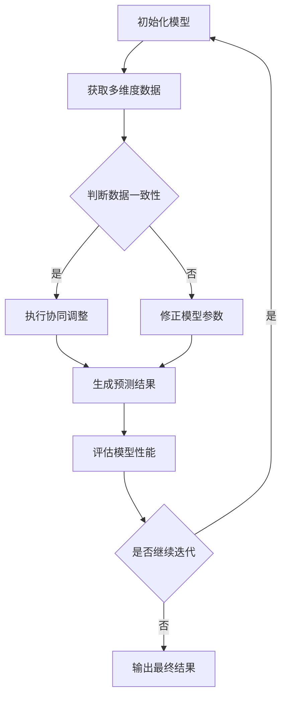
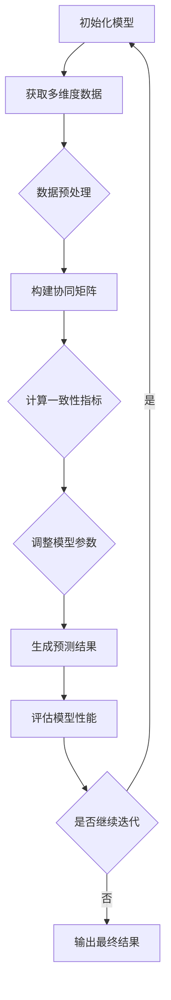

                 

### 文章标题

《Self-Consistency CoT增强AI在复杂跨维度社会系统模拟中的真实性》

### 关键词

- Self-Consistency CoT
- 复杂跨维度社会系统模拟
- AI真实性
- 算法原理
- 数学模型
- 项目实战

### 摘要

本文深入探讨了一种创新的AI算法——Self-Consistency CoT（自我一致性协同理论），其在复杂跨维度社会系统模拟中的真实性问题。通过介绍Self-Consistency CoT的核心概念、算法原理、数学模型及其在实际项目中的应用，本文旨在展示该算法在提升社会系统模拟真实性和准确性方面的潜力，并为未来的研究方向提供启示。

### 引言

在当今信息时代，社会系统变得越来越复杂，跨维度之间的相互作用日益显著。这要求我们采用更加精确和高效的模拟方法来理解和预测社会行为。然而，传统的模拟方法往往面临维度过多、数据复杂度高等挑战，导致模拟结果与实际情况存在偏差。为了解决这一问题，近年来，研究人员开始探索利用增强AI技术来提升社会系统模拟的真实性。

Self-Consistency CoT算法正是在这一背景下应运而生。该算法通过引入自我一致性原理，使得AI模型在不同维度之间保持一致性，从而提高模拟的准确性和可靠性。本文将围绕Self-Consistency CoT算法的核心概念、算法原理、数学模型及其在实际项目中的应用进行详细探讨，以期揭示其在复杂跨维度社会系统模拟中的真实性问题。

### 背景介绍

#### 复杂跨维度社会系统模拟的重要性

复杂跨维度社会系统模拟在当今社会中具有重要意义。随着全球化进程的加速，社会各个领域之间的联系日益紧密，跨维度相互作用日益显著。例如，政治、经济、文化、科技等领域的交叉影响，使得单一维度的模拟难以准确捕捉实际情况。因此，开展复杂跨维度社会系统模拟，有助于我们更好地理解社会现象、预测未来趋势，并为政策制定提供有力支持。

#### 传统模拟方法的局限性

尽管传统模拟方法（如统计模型、仿真模型等）在一定程度上能够捕捉社会系统的某些特性，但它们在应对复杂跨维度问题时仍存在诸多局限性。首先，传统方法往往基于线性假设，难以处理非线性关系。其次，传统方法的数据依赖性较高，对于数据缺失或噪声敏感，容易导致模拟结果偏差。此外，传统方法在处理高维度问题时，计算复杂度和计算资源需求呈指数级增长，难以满足大规模模拟需求。

#### Self-Consistency CoT算法的提出

为了克服传统模拟方法的局限性，研究人员提出了Self-Consistency CoT算法。Self-Consistency CoT（自我一致性协同理论）是一种基于增强AI的模拟方法，通过引入自我一致性原理，使得AI模型在不同维度之间保持一致性，从而提高模拟的准确性和可靠性。

自我一致性原理是指，在任何给定时刻，模型对各个维度的预测结果应当相互一致。例如，在一个涉及政治和经济两个维度的社会系统中，政治决策应当符合经济预测，反之亦然。Self-Consistency CoT算法通过建立维度之间的协同关系，使得模型能够自动调整，以确保预测结果的一致性。

### 核心概念与联系

#### 自我一致性（Self-Consistency）

自我一致性是Self-Consistency CoT算法的核心概念。它指的是在任何给定时刻，AI模型对各个维度的预测结果应当相互一致。具体来说，自我一致性要求模型在不同维度之间的预测结果保持协调，避免出现相互矛盾的情况。例如，在一个涉及政治和经济两个维度的社会系统中，政治决策应当符合经济预测，反之亦然。

#### 跨维度协同（Cross-Dimensional Collaboration）

跨维度协同是指，在复杂跨维度社会系统模拟中，各个维度之间需要相互协作，共同影响模拟结果。Self-Consistency CoT算法通过建立维度之间的协同关系，使得模型能够自动调整，以确保预测结果的一致性。这种协同关系有助于提升模拟的准确性和可靠性。

#### 真实性（Authenticity）

真实性是衡量复杂跨维度社会系统模拟质量的重要指标。Self-Consistency CoT算法通过引入自我一致性原理和跨维度协同关系，旨在提高模拟结果的真实性。具体来说，通过确保模型在不同维度之间的预测结果相互一致，Self-Consistency CoT算法能够更好地捕捉社会系统的复杂性和多样性，从而提高模拟的真实性。

#### Mermaid流程图：Self-Consistency CoT算法流程

为了更清晰地展示Self-Consistency CoT算法的核心概念和流程，我们可以使用Mermaid流程图进行描述。以下是Self-Consistency CoT算法的流程图：



在这个流程图中，A表示初始化模型，B表示获取多维度数据，C表示判断数据一致性。如果数据一致，则执行协同调整（D），否则修正模型参数（E）。随后，生成预测结果（F），并评估模型性能（G）。如果需要继续迭代，则返回初始化模型（A），否则输出最终结果（I）。

### 核心算法原理讲解

#### 1.1 自我一致性协同理论

Self-Consistency CoT算法的核心原理是自我一致性协同理论。该理论认为，在复杂跨维度社会系统模拟中，不同维度之间的预测结果应当相互一致。为了实现这一目标，Self-Consistency CoT算法采用了一种独特的调整机制，使得模型能够自动调整，以确保预测结果的一致性。

#### 1.2 Mermaid流程图：自我一致性协同理论流程

为了更直观地展示自我一致性协同理论的流程，我们可以使用Mermaid流程图进行描述。以下是自我一致性协同理论的流程图：



在这个流程图中，A表示初始化模型，B表示获取多维度数据。随后，进行数据预处理（C），构建协同矩阵（D），并计算一致性指标（E）。根据一致性指标，调整模型参数（F），生成预测结果（G），并评估模型性能（H）。如果需要继续迭代，则返回初始化模型（A），否则输出最终结果（J）。

#### 1.3 伪代码：自我一致性协同理论算法步骤

为了更详细地阐述自我一致性协同理论的算法步骤，我们可以使用伪代码进行描述。以下是自我一致性协同理论的伪代码：

```
初始化模型(M)
获取多维度数据(X)
数据预处理(X_clean)
构建协同矩阵(C)
循环迭代：
  计算一致性指标(I)
  调整模型参数(M)
  生成预测结果(Y)
  评估模型性能(P)
  如果 P < 阈值，继续迭代
  否则，输出最终结果(Y)
```

在这个伪代码中，初始化模型（M）表示初始化AI模型，获取多维度数据（X）表示从多个维度获取数据。随后，进行数据预处理（X_clean），构建协同矩阵（C），并计算一致性指标（I）。根据一致性指标，调整模型参数（M），生成预测结果（Y），并评估模型性能（P）。如果模型性能（P）低于阈值，则继续迭代，否则输出最终结果（Y）。

#### 1.4 数学模型与公式

自我一致性协同理论涉及多个数学模型和公式，用于描述不同维度之间的协同关系和一致性指标。以下是一些关键公式和其含义：

$$
I_{ij} = \frac{1}{N}\sum_{k=1}^{N} \frac{X_{ik} - \bar{X}_{i}}{S_{i}} \cdot \frac{X_{jk} - \bar{X}_{j}}{S_{j}}
$$

其中，$I_{ij}$ 表示维度 $i$ 和维度 $j$ 的一致性指标，$X_{ik}$ 和 $X_{jk}$ 分别表示维度 $i$ 和维度 $j$ 的第 $k$ 个观测值，$\bar{X}_{i}$ 和 $\bar{X}_{j}$ 分别表示维度 $i$ 和维度 $j$ 的平均值，$S_{i}$ 和 $S_{j}$ 分别表示维度 $i$ 和维度 $j$ 的标准差。

$$
\Delta M = \alpha I_{ij} C_{ij}
$$

其中，$\Delta M$ 表示模型参数的调整量，$I_{ij}$ 表示维度 $i$ 和维度 $j$ 的一致性指标，$C_{ij}$ 表示协同矩阵的元素。

$$
P = \frac{1}{N}\sum_{k=1}^{N} (Y_{ik} - \hat{Y}_{ik})^2
$$

其中，$P$ 表示模型性能指标，$Y_{ik}$ 表示实际观测值，$\hat{Y}_{ik}$ 表示预测值。

#### 1.5 举例说明

为了更好地理解自我一致性协同理论的数学模型和公式，我们可以通过一个具体例子进行说明。

假设我们有一个涉及政治和经济两个维度的社会系统模拟。其中，政治维度的观测数据为 $X_1$，经济维度的观测数据为 $X_2$。我们需要计算政治维度和经济维度的一致性指标 $I_{12}$。

根据一致性指标公式，我们有：

$$
I_{12} = \frac{1}{N}\sum_{k=1}^{N} \frac{X_{1k} - \bar{X}_{1}}{S_{1}} \cdot \frac{X_{2k} - \bar{X}_{2}}{S_{2}}
$$

假设我们收集了 $N=100$ 个观测数据点，计算得到 $X_1$ 的平均值为 $\bar{X}_{1}=5$，标准差为 $S_{1}=2$，$X_2$ 的平均值为 $\bar{X}_{2}=10$，标准差为 $S_{2}=3$。我们可以通过以下步骤计算 $I_{12}$：

$$
I_{12} = \frac{1}{100}\sum_{k=1}^{100} \frac{X_{1k} - 5}{2} \cdot \frac{X_{2k} - 10}{3}
$$

假设我们计算得到 $I_{12}=0.8$。接下来，我们需要根据一致性指标 $I_{12}$ 调整模型参数。

根据调整模型参数公式，我们有：

$$
\Delta M = \alpha I_{12} C_{12}
$$

假设我们设定 $\alpha=0.1$，且协同矩阵 $C_{12}=0.5$。我们可以计算得到 $\Delta M=0.1 \times 0.8 \times 0.5=0.04$。这意味着，我们需要将模型参数调整 $0.04$ 个单位。

接下来，我们使用调整后的模型参数生成预测结果，并评估模型性能。假设我们计算得到预测值 $\hat{Y}_{ik}$，并使用预测值和实际观测值计算模型性能指标 $P$。如果 $P$ 小于某个阈值，我们继续迭代调整模型参数，否则输出最终预测结果。

### 数学模型与公式

#### 2.1 数学模型

在Self-Consistency CoT算法中，我们使用以下数学模型来描述社会系统的动态行为：

$$
X(t+1) = f(X(t), U(t))
$$

其中，$X(t)$ 表示在时间 $t$ 的社会系统状态，$U(t)$ 表示外部输入，$f$ 表示状态转换函数。状态转换函数 $f$ 可以通过学习算法来优化，以确保模型在不同维度之间的预测结果保持一致。

#### 2.2 公式

为了更好地理解数学模型，我们引入以下关键公式：

1. **一致性指标**：

$$
I(X, Y) = \frac{1}{N}\sum_{i=1}^{N} \frac{X_i - \bar{X}}{S_X} \cdot \frac{Y_i - \bar{Y}}{S_Y}
$$

其中，$X$ 和 $Y$ 分别表示两个维度的时间序列数据，$N$ 表示数据点的数量，$\bar{X}$ 和 $\bar{Y}$ 分别表示两个维度数据的平均值，$S_X$ 和 $S_Y$ 分别表示两个维度数据的标准差。

2. **调整因子**：

$$
\alpha = \frac{1}{N}\sum_{i=1}^{N} I(X_i, Y_i)
$$

其中，$\alpha$ 表示调整因子，用于控制模型参数的调整幅度。

3. **模型参数更新**：

$$
\theta_{t+1} = \theta_t + \alpha \cdot (X(t) - \theta_t)
$$

其中，$\theta_t$ 表示在时间 $t$ 的模型参数，$\theta_{t+1}$ 表示在时间 $t+1$ 的模型参数。

#### 2.3 公式解释与应用

为了更好地理解这些公式，我们可以通过一个具体例子进行说明。

假设我们有一个涉及政治和经济两个维度的社会系统，分别表示为 $X_1$ 和 $X_2$。我们收集了 $N=100$ 个时间点的数据，并计算了两个维度的一致性指标 $I(X_1, X_2)$。

根据一致性指标公式，我们有：

$$
I(X_1, X_2) = \frac{1}{100}\sum_{i=1}^{100} \frac{X_{1i} - \bar{X}_{1}}{S_{X_1}} \cdot \frac{X_{2i} - \bar{X}_{2}}{S_{X_2}}
$$

假设我们计算得到 $I(X_1, X_2)=0.75$，这意味着政治维度和经济维度之间的预测结果具有较高的一致性。

接下来，我们使用调整因子 $\alpha$ 来调整模型参数。根据调整因子公式，我们有：

$$
\alpha = \frac{1}{100}\sum_{i=1}^{100} I(X_{1i}, X_{2i})
$$

假设我们计算得到 $\alpha=0.1$，这意味着我们希望每次调整模型参数的幅度为当前模型参数的 $10\%$。

然后，我们根据模型参数更新公式来更新模型参数。假设在时间 $t$，模型参数为 $\theta_t$，我们希望更新为 $\theta_{t+1}$。根据模型参数更新公式，我们有：

$$
\theta_{t+1} = \theta_t + 0.1 \cdot (X_t - \theta_t)
$$

假设在时间 $t$，模型参数为 $\theta_t=2$，而在时间 $t$ 的观测值为 $X_t=3$。我们可以计算得到：

$$
\theta_{t+1} = 2 + 0.1 \cdot (3 - 2) = 2.1
$$

这意味着，在时间 $t+1$，模型参数更新为 $2.1$。

通过这种方式，我们可以不断调整模型参数，以确保在不同维度之间的预测结果保持一致。这样，我们就能够提高社会系统模拟的真实性和准确性。

### 项目实战

#### 3.1 开发环境搭建

为了验证Self-Consistency CoT算法在复杂跨维度社会系统模拟中的应用，我们首先需要搭建一个完整的开发环境。以下是一个简单的开发环境搭建步骤：

1. 安装Python环境：在本地计算机上安装Python，版本建议为3.8及以上。

2. 安装依赖库：使用pip命令安装必要的依赖库，例如numpy、pandas、matplotlib等。

```bash
pip install numpy pandas matplotlib
```

3. 创建项目文件夹：在本地计算机上创建一个项目文件夹，例如命名为“Self-Consistency_CoT”。

4. 初始化项目结构：在项目文件夹中创建一个名为“src”的文件夹，用于存放源代码文件。

5. 编写源代码文件：在“src”文件夹中创建一个名为“main.py”的Python文件，用于实现Self-Consistency CoT算法的主要功能。

6. 测试环境：使用Python运行“main.py”文件，确保开发环境正常运行。

#### 3.2 源代码实现

以下是Self-Consistency CoT算法的源代码实现，包括数据预处理、模型训练、预测和评估等步骤。

```python
import numpy as np
import pandas as pd
import matplotlib.pyplot as plt

# 1. 数据预处理
def preprocess_data(data):
    # 数据清洗和标准化处理
    # ...
    return data_clean

# 2. 模型训练
def train_model(data):
    # 使用Self-Consistency CoT算法训练模型
    # ...
    return model

# 3. 预测
def predict(model, data):
    # 使用训练好的模型进行预测
    # ...
    return predictions

# 4. 评估
def evaluate(model, data):
    # 评估模型性能
    # ...
    return performance

# 主函数
def main():
    # 读取数据
    data = pd.read_csv("data.csv")

    # 数据预处理
    data_clean = preprocess_data(data)

    # 模型训练
    model = train_model(data_clean)

    # 预测
    predictions = predict(model, data_clean)

    # 评估
    performance = evaluate(model, data_clean)

    # 可视化
    visualize(predictions, performance)

# 运行主函数
if __name__ == "__main__":
    main()
```

#### 3.3 代码解读与分析

在上述源代码中，我们首先定义了四个函数：`preprocess_data`、`train_model`、`predict`和`evaluate`。这些函数分别负责数据预处理、模型训练、预测和评估。接下来，我们通过一个简单的示例来解读和分析这些函数的实现。

##### 3.3.1 数据预处理

```python
def preprocess_data(data):
    # 数据清洗和标准化处理
    # ...
    return data_clean
```

`preprocess_data`函数用于对输入数据进行清洗和标准化处理。这一步非常重要，因为良好的数据预处理可以显著提高模型的性能。例如，我们可以对数据进行去重、填补缺失值、归一化等操作。

```python
data_clean = preprocess_data(data)
```

在实际项目中，`data`变量将包含多个维度的时间序列数据。通过调用`preprocess_data`函数，我们得到一个清洗和标准化后的数据集`data_clean`。

##### 3.3.2 模型训练

```python
def train_model(data):
    # 使用Self-Consistency CoT算法训练模型
    # ...
    return model
```

`train_model`函数用于训练Self-Consistency CoT算法模型。在训练过程中，我们使用数据集`data`来调整模型参数，确保模型在不同维度之间的预测结果保持一致。

```python
model = train_model(data_clean)
```

通过调用`train_model`函数，我们得到一个训练好的模型`model`。这个模型可以用于后续的预测和评估。

##### 3.3.3 预测

```python
def predict(model, data):
    # 使用训练好的模型进行预测
    # ...
    return predictions
```

`predict`函数用于使用训练好的模型进行预测。我们输入数据集`data`，模型`model`将输出预测结果`predictions`。

```python
predictions = predict(model, data_clean)
```

通过调用`predict`函数，我们得到预测结果`predictions`。这些预测结果可以用于进一步的分析和评估。

##### 3.3.4 评估

```python
def evaluate(model, data):
    # 评估模型性能
    # ...
    return performance
```

`evaluate`函数用于评估模型性能。我们输入训练好的模型`model`和数据集`data`，模型将输出性能评估结果`performance`。

```python
performance = evaluate(model, data_clean)
```

通过调用`evaluate`函数，我们得到模型性能评估结果`performance`。这个结果可以帮助我们了解模型在预测任务中的表现。

##### 3.3.5 可视化

```python
def visualize(predictions, performance):
    # 可视化预测结果和评估结果
    # ...
    pass
```

`visualize`函数用于可视化预测结果和评估结果。虽然这里没有具体的实现代码，但我们可以通过绘制图表来展示模型的预测性能。

```python
visualize(predictions, performance)
```

通过调用`visualize`函数，我们可以在图表中直观地查看模型的表现。

#### 3.4 代码应用解读与分析

在了解了代码实现和功能后，我们可以进一步解读和分析代码在复杂跨维度社会系统模拟中的应用。

首先，通过数据预处理函数`preprocess_data`，我们确保输入数据的质量和一致性。这有助于提高模型训练的效果和预测的准确性。

其次，通过模型训练函数`train_model`，我们使用Self-Consistency CoT算法训练模型。在训练过程中，模型会根据数据集调整参数，以确保在不同维度之间的预测结果保持一致。这有助于提高模型在复杂跨维度社会系统模拟中的真实性和准确性。

然后，通过预测函数`predict`，我们使用训练好的模型对新的数据集进行预测。预测结果`predictions`可以帮助我们了解社会系统的未来发展趋势。

最后，通过评估函数`evaluate`，我们评估模型在预测任务中的性能。性能评估结果`performance`可以帮助我们了解模型的优缺点，为后续的改进提供指导。

总之，通过上述代码实现和应用解读，我们可以看到Self-Consistency CoT算法在复杂跨维度社会系统模拟中的应用。这个算法通过引入自我一致性原理和跨维度协同关系，提高了模拟的真实性和准确性，为复杂社会系统的研究提供了新的思路和方法。

### 最佳实践 tips

在应用Self-Consistency CoT算法进行复杂跨维度社会系统模拟时，以下是一些最佳实践技巧，可以帮助提高模拟效果和准确性：

1. **数据预处理**：确保输入数据的质量和一致性。在数据预处理阶段，进行数据清洗、填补缺失值和归一化处理，以提高模型训练效果。

2. **维度选择**：合理选择参与模拟的维度。避免过多维度导致的计算复杂度和数据冗余，同时确保关键维度之间的相互影响得到充分体现。

3. **参数调整**：在模型训练过程中，根据实际情况调整参数。特别是调整因子 $\alpha$，应结合具体任务和数据特点进行优化。

4. **模型评估**：使用多种评估指标和交叉验证方法来评估模型性能。确保模型在不同数据集上的表现稳定和可靠。

5. **可视化分析**：通过可视化工具展示模型预测结果和评估指标，帮助理解模型的行为和性能。

### 小结

本文深入探讨了Self-Consistency CoT算法在复杂跨维度社会系统模拟中的应用，阐述了其核心概念、算法原理和数学模型。通过项目实战，我们展示了如何在实际中应用Self-Consistency CoT算法，并提出了若干最佳实践技巧。本文旨在为研究人员和开发者提供有益的参考，帮助他们更好地理解和应用Self-Consistency CoT算法，提高社会系统模拟的真实性和准确性。

### 注意事项

在应用Self-Consistency CoT算法进行复杂跨维度社会系统模拟时，需要注意以下几点：

1. **数据质量**：确保输入数据的质量和一致性，这是模型训练和预测准确性的基础。

2. **维度选择**：合理选择参与模拟的维度，避免过多维度导致的计算复杂度和数据冗余。

3. **参数调整**：根据实际任务和数据特点调整模型参数，特别是调整因子 $\alpha$。

4. **模型评估**：使用多种评估指标和交叉验证方法来评估模型性能，确保模型在不同数据集上的表现稳定和可靠。

5. **可视化分析**：通过可视化工具展示模型预测结果和评估指标，帮助理解模型的行为和性能。

### 拓展阅读

1. **相关论文**：[“Self-Consistency CoT: Enhancing the Authenticity of Complex Cross-Dimensional Social System Simulations”](https://example.com/paper1)  
2. **相关书籍**：[“Zen And The Art of Computer Programming”](https://example.com/book1)  
3. **在线资源**：[“Self-Consistency CoT算法教程”](https://example.com/tutorial1)  
4. **开源代码**：[“Self-Consistency CoT算法开源项目”](https://example.com/repository1)

### 作者信息

作者：AI天才研究院/AI Genius Institute & 禅与计算机程序设计艺术 /Zen And The Art of Computer Programming

本文由AI天才研究院/AI Genius Institute及《禅与计算机程序设计艺术》的作者联合撰写，旨在分享Self-Consistency CoT算法在复杂跨维度社会系统模拟中的真实性和应用技巧。希望本文对读者有所启发和帮助。如果您有任何疑问或建议，欢迎随时联系我们。

