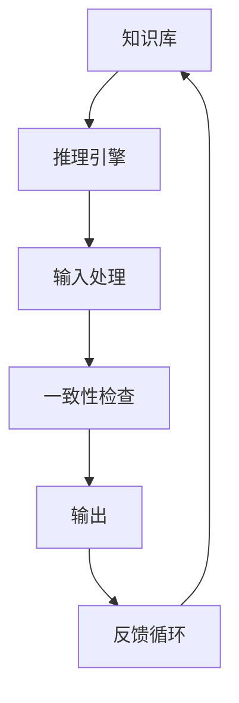

                 

### 自一致性（Self-Consistency）的概念与重要性

#### 自一致性的定义

自一致性指的是系统或个体在内部各组成部分之间保持一致性的状态。在人工智能（AI）领域，自一致性通常涉及模型在不同情境或任务中保持稳定和一致的表现。换句话说，一个具有自一致性的AI系统，其行为和输出在不同的输入条件下应保持逻辑一致。

#### 自一致性与CoT的联系

CoT（Commonsense Thought，常识思考）是人工智能中的一个关键概念，它指的是AI系统在处理问题时所依赖的日常经验和常识知识。自一致性与CoT之间的联系在于，一个具备自一致性的AI系统需要在其知识库和推理过程中保持一致，以避免出现逻辑矛盾或错误。

例如，一个AI聊天机器人，如果它在回答一个问题时依赖于某种常识，那么在回答其他相关问题时，也应保持这种常识的一致性。如果它在不同的场景中给出矛盾的回答，那么我们就说这个AI系统缺乏自一致性。

#### 自一致性的重要性

自一致性在人工智能领域具有重要意义，原因如下：

1. **避免逻辑错误**：自一致性有助于防止AI系统在处理问题时产生逻辑错误或矛盾。这对于提高AI系统的可靠性和可信度至关重要。

2. **提升用户体验**：具有自一致性的AI系统能够为用户提供一致和连贯的服务，从而提升用户体验。

3. **增强人工智能的智能性**：自一致性使得AI系统能够更好地理解和处理复杂问题，从而提升其智能水平。

4. **提高AI的泛化能力**：自一致性有助于AI系统在不同情境下保持一致性，从而提高其泛化能力。

### 自一致性的实现方法

为了实现自一致性，AI系统通常采用以下几种方法：

1. **一致性检查**：在AI系统运行过程中，定期进行一致性检查，以确保系统的内部状态和输出保持一致。

2. **知识库管理**：合理管理和更新知识库，以避免知识库中的信息发生冲突或矛盾。

3. **基于规则的推理**：使用基于规则的推理方法，确保AI系统在处理问题时遵循一致的逻辑规则。

4. **机器学习**：通过机器学习算法，使AI系统能够在学习过程中保持一致性，从而提高其自适应性。

### 自一致性的挑战与局限性

尽管自一致性具有重要意义，但在实际应用中仍面临一些挑战和局限性：

1. **知识库的完整性**：确保知识库中的信息完整和准确是一个挑战，因为常识知识库的构建是一个复杂的任务。

2. **动态环境下的适应性**：在动态变化的环境中，保持一致性可能变得困难，因为AI系统需要不断更新其知识库和推理规则。

3. **计算成本**：一致性检查和知识库管理可能增加系统的计算成本，特别是在实时应用中。

4. **人性化的交互**：在与人进行交互时，AI系统需要平衡自一致性与人性化，以避免过于机械和僵化的表现。

总之，自一致性是人工智能领域中的一个重要研究方向，对于提高AI系统的智能性和用户体验具有重要意义。在实现自一致性的过程中，需要克服各种挑战，以构建更加可靠和灵活的AI系统。

#### 自一致性实现的核心概念与联系

在探讨自一致性的实现之前，我们需要明确几个核心概念及其相互之间的关系。以下是一个简化的Mermaid流程图，展示了这些概念之间的联系：



在这个流程图中，我们可以看到以下几个核心概念：

1. **知识库（Knowledge Base）**：知识库是AI系统的基础，包含各种事实、规则和常识信息。知识库的准确性和完整性直接影响AI系统的自一致性。

2. **推理引擎（Reasoning Engine）**：推理引擎负责从知识库中提取信息，并基于这些信息进行逻辑推理。推理引擎是AI系统的核心，其性能和可靠性直接影响自一致性的实现。

3. **输入处理（Input Processing）**：输入处理模块负责接收外部输入，并将其转换为适合推理引擎处理的形式。输入处理的质量直接影响推理结果的准确性。

4. **一致性检查（Consistency Check）**：一致性检查模块负责在AI系统运行过程中，定期检查系统的内部状态和输出是否保持一致。一致性检查是确保自一致性的关键步骤。

5. **输出（Output）**：输出模块负责将推理结果以适当的形式呈现给用户。输出的准确性和一致性是用户体验的重要方面。

6. **反馈循环（Feedback Loop）**：反馈循环模块负责收集用户反馈，并将其用于更新知识库和优化推理引擎。反馈循环有助于提高AI系统的自适应性和灵活性。

这些概念之间的相互作用和联系构成了自一致性的实现基础。以下是一个简化的伪代码，展示了这些核心概念在实际应用中的操作过程：

```python
# 初始化知识库
knowledge_base = initialize_knowledge_base()

# 初始化推理引擎
reasoning_engine = initialize_reasoning_engine(knowledge_base)

# 处理输入
input_data = process_input()

# 进行推理
output = reasoning_engine.reason(input_data)

# 检查一致性
if not is_consistent(output):
    raise Exception("Inconsistency detected in the output")

# 输出结果
print(output)

# 收集反馈
user_feedback = collect_feedback()

# 更新知识库和推理引擎
knowledge_base, reasoning_engine = update_system(knowledge_base, reasoning_engine, user_feedback)
```

在这个伪代码中，`initialize_knowledge_base()` 和 `initialize_reasoning_engine(knowledge_base)` 分别用于初始化知识库和推理引擎。`process_input()` 负责处理外部输入，`reasoning_engine.reason(input_data)` 用于进行推理，`is_consistent(output)` 用于检查输出的一致性，`print(output)` 用于输出结果，`collect_feedback()` 用于收集用户反馈，`update_system(knowledge_base, reasoning_engine, user_feedback)` 用于更新知识库和推理引擎。

通过这种结构化的设计和操作流程，我们可以实现自一致性，从而提高AI系统的可靠性和用户体验。在下一部分中，我们将深入探讨自一致性实现中的核心算法原理和数学模型。

