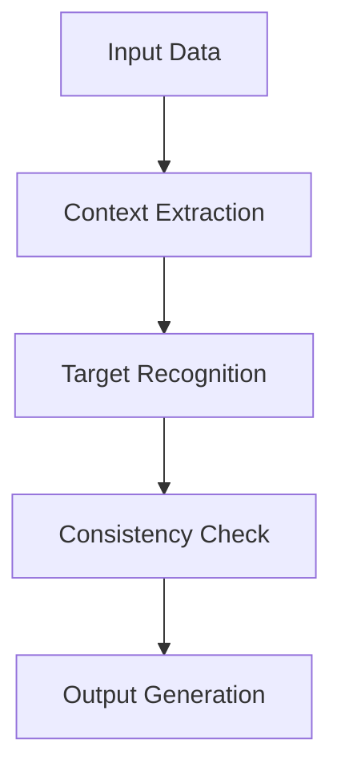

                 

### 文章标题

"Self-Consistency CoT增强AI推荐系统的可靠性"

### 关键词

- Self-Consistency CoT
- AI推荐系统
- 知识追踪
- 人工智能
- 算法优化
- 可靠性提升

### 摘要

本文深入探讨Self-Consistency CoT（Self-Consistency Context-aware, Target-oriented, and Knowledge Tracing）在AI推荐系统中的应用与重要性。通过分析其核心原理、算法实现及性能优化，我们揭示了Self-Consistency CoT如何显著提升推荐系统的可靠性，减少冷启动问题，并优化用户体验。文章将通过实际案例，展示如何在实际项目中应用Self-Consistency CoT，从而推动AI推荐系统的发展。

### 目录大纲设计流程

在深入撰写本文之前，我们需要设计一个清晰的目录大纲，以确保文章的逻辑性和连贯性。

#### 1. 理解书名

首先，我们需要理解书名《Self-Consistency CoT增强AI推荐系统的可靠性》所传达的主题。书名中的“Self-Consistency CoT”指的是一种基于自我一致性校验的上下文感知、目标导向的知识追踪方法。"AI推荐系统"则是指利用人工智能技术实现的推荐系统，而"可靠性"则强调了系统在实际应用中的稳定性和准确性。

#### 2. 确定核心章节

根据书名，我们可以推测书中可能包含以下几个核心部分：
- **Self-Consistency CoT的基本概念与架构**
- **Self-Consistency CoT在AI推荐系统中的应用**
- **Self-Consistency CoT对AI推荐系统可靠性的影响**
- **Self-Consistency CoT的算法原理与实现**
- **Self-Consistency CoT在推荐系统项目中的应用实践**
- **Self-Consistency CoT的性能评估与优化**

#### 3. 细化章节内容

在确定了核心章节后，我们可以进一步细化每个章节的内容，例如：
- **Self-Consistency CoT的基本概念与架构**：介绍Self-Consistency CoT的定义、基本架构和核心原理。
- **Self-Consistency CoT在AI推荐系统中的应用**：讨论Self-Consistency CoT如何应用于推荐系统，包括预处理与特征提取、模型构建和自适应调整。
- **Self-Consistency CoT对AI推荐系统可靠性的影响**：分析Self-Consistency CoT如何提升推荐系统的可靠性，并减少冷启动问题。
- **Self-Consistency CoT的算法原理与实现**：使用伪代码详细阐述算法的实现过程。
- **Self-Consistency CoT在推荐系统项目中的应用实践**：通过实际案例展示Self-Consistency CoT的应用，包括开发环境搭建、源代码实现和代码解读。
- **Self-Consistency CoT的性能评估与优化**：评估Self-Consistency CoT的性能，并提出优化策略。

#### 4. 设计Mermaid流程图

为了帮助读者更直观地理解Self-Consistency CoT与AI推荐系统之间的关系，我们可以在核心章节中设计一个Mermaid流程图。例如，在介绍Self-Consistency CoT的基本架构时，可以使用以下Mermaid流程图：



#### 5. 编写伪代码

在讲解算法原理时，我们将使用伪代码详细阐述算法的逻辑，例如：

```python
# 伪代码：Self-Consistency CoT算法框架
function SelfConsistencyCoT(input_data):
    context = ContextExtraction(input_data)
    target = TargetRecognition(context)
    consistent = ConsistencyCheck(context, target)
    output = OutputGeneration(consistent)
    return output
```

#### 6. 嵌入数学公式

在需要的地方，我们将嵌入LaTeX格式的数学公式，并进行详细讲解和举例说明。例如：

$$
\text{Accuracy} = \frac{\text{Number of correct recommendations}}{\text{Total number of recommendations}}
$$

#### 7. 撰写项目实战案例

结合实际的项目案例，我们将详细解释如何在实际项目中应用Self-Consistency CoT，包括开发环境搭建、源代码实现、代码解读与分析。例如：

- **开发环境搭建**：介绍所需的技术栈和环境配置。
- **源代码实现**：提供具体的代码片段，并解释其工作原理。
- **代码解读与分析**：分析代码的关键部分，解释其作用和优化空间。
- **项目案例分析与详细讲解剖析**：通过实际案例展示Self-Consistency CoT的应用效果。

#### 8. 校对与调整

最后，我们将对文章进行校对和调整，确保内容完整、逻辑清晰、语言简洁，并在8000-12000字内完成。

通过上述步骤，我们确保了文章的结构和内容的完整性，为读者提供了深入、系统的知识，并促进了AI推荐系统的发展。接下来，我们将按照这个大纲逐步展开文章的内容。

