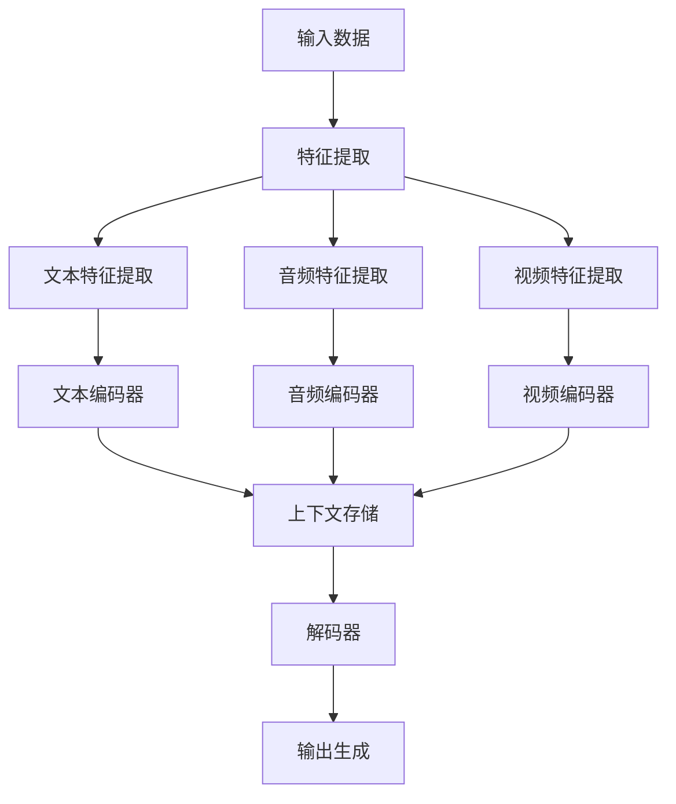

                 

### 引言

#### 1.1 书籍目的

《Self-Consistency CoT提升AI虚拟助手的表现》旨在深入探讨自我一致性核心思维（CoT）在AI虚拟助手领域中的应用，并详细解析其提升AI虚拟助手性能的具体方法和实现路径。随着人工智能技术的不断进步，虚拟助手已经成为现代生活中不可或缺的一部分，从智能家居到商业客服，从在线教育到健康咨询，虚拟助手正逐步改变着我们的生活方式。然而，虚拟助手的性能依然存在诸多挑战，特别是在上下文理解、自我一致性、用户互动等方面。

本书的核心目标是帮助读者了解自我一致性核心思维的原理和应用，通过具体实例和实战项目，展示如何利用CoT技术提升虚拟助手的整体表现。本书不仅适合人工智能领域的专业人士，也适合对AI技术感兴趣的研究生和本科生。希望通过这本书，读者能够掌握CoT技术的基本原理，并具备在实际项目中应用这些技术的实际能力。

#### 1.2 自我一致性核心思维（CoT）概述

自我一致性核心思维（CoT，Self-Consistency Core Thinking）是一种基于信息处理理论的思维方式，旨在通过自我调整和一致性维护来提高认知效率和准确性。CoT的核心思想是：在任何给定情境下，个体会持续评估和调整其内部模型，以保持其与外部环境的一致性。

在AI虚拟助手的背景下，CoT技术可以帮助虚拟助手更好地理解用户意图，保持对话的一致性和连贯性。通过自我一致性调整，虚拟助手能够在对话中保持稳定的角色和行为，从而提供更高质量的用户体验。CoT技术的关键在于其能够通过不断的学习和调整，实现自我优化，提高虚拟助手的适应性和准确性。

#### 1.3 AI虚拟助手现状与挑战

当前，AI虚拟助手已经在多个领域取得了显著的成果，但仍然面临许多挑战。以下是一些主要的挑战：

1. **上下文理解不足**：虚拟助手需要理解用户的上下文信息，以便提供准确的答复和建议。然而，上下文理解的复杂性使得虚拟助手往往无法准确把握用户意图，导致回复偏离主题。

2. **自我一致性差**：虚拟助手在对话中可能因为信息的不一致或错误而出现角色行为的不稳定，影响用户体验。自我一致性是保持虚拟助手角色和行为稳定的关键。

3. **用户互动体验差**：虚拟助手需要与用户进行自然流畅的互动，但目前大多数虚拟助手在用户互动方面仍存在一定的局限性，例如缺乏情感理解、无法处理复杂情境等。

4. **个性化不足**：虚拟助手需要根据不同用户的特点和需求提供个性化的服务，但目前大多数虚拟助手在个性化方面仍有待提升。

本书将通过介绍自我一致性核心思维（CoT）的基本概念和应用，探讨如何解决上述挑战，并提升虚拟助手的整体性能。在接下来的章节中，我们将详细讨论CoT的理论基础、应用场景以及具体实现方法，帮助读者全面了解并掌握这一技术。

### 自我一致性核心思维（CoT）基础

#### 2.1 CoT的定义与原理

自我一致性核心思维（CoT，Self-Consistency Core Thinking）是一种通过持续评估和调整内部模型以保持与环境一致性的一种认知策略。CoT起源于信息处理理论，旨在提高认知效率和准确性。在人工智能领域，特别是在虚拟助手的发展中，CoT被视为一种关键的技术，有助于提升虚拟助手的理解和响应能力。

CoT的核心原理可以概括为以下几点：

1. **信息一致性评估**：在处理信息时，CoT会不断评估新信息与已有知识的一致性。如果发现不一致，系统会采取措施进行调整，以确保信息的整体一致性。

2. **自我调整机制**：通过自我调整机制，系统可以动态调整其内部模型，以适应新环境和变化。这种调整机制包括重新评估现有假设、更新知识库和改变决策策略等。

3. **持续学习与优化**：CoT强调持续学习和优化，通过不断积累经验，系统可以逐步提高其处理复杂问题和应对变化的能力。

4. **情境适应性**：CoT能够根据不同的情境动态调整其策略，使其在多种场景下都能保持高效和准确的性能。

在AI虚拟助手的应用中，CoT技术通过持续监控和调整对话状态，确保虚拟助手能够提供一致、连贯的用户体验。这种自我一致性的维护不仅提高了虚拟助手的理解能力，也增强了其与用户的互动效果。

#### 2.2 CoT的关键特性

自我一致性核心思维（CoT）具有以下几项关键特性，这些特性使其在虚拟助手的应用中尤为重要：

1. **上下文感知**：CoT能够深刻理解上下文信息，并通过上下文感知来调整其对话行为。这使得虚拟助手能够更好地理解用户意图，提供更为精准和相关的回答。

2. **自我调整**：CoT通过自我调整机制，能够根据对话的实时反馈动态调整其内部模型和行为策略。这种能力使得虚拟助手能够适应不同用户和情境，保持稳定和一致的表现。

3. **持续学习**：CoT强调持续学习和优化，通过不断积累对话经验，虚拟助手可以逐步提高其认知能力和响应效率。这种学习机制使得虚拟助手能够随着时间推移而变得更加智能和灵活。

4. **高适应性**：CoT技术具有高适应性，能够适应多种不同的交互场景和用户需求。无论是日常对话、复杂任务处理，还是多轮对话理解，CoT都能提供有效的支持。

5. **用户体验优化**：通过保持对话的一致性和连贯性，CoT技术能够显著提升用户体验。用户在与虚拟助手互动时，不会感到困惑或被误导，从而获得更流畅、自然的互动体验。

#### 2.3 CoT的应用背景

自我一致性核心思维（CoT）的应用背景广泛，特别是在人工智能领域，尤其适用于虚拟助手的技术开发与优化。以下是一些主要的应用场景和背景：

1. **虚拟客服**：在客服领域，虚拟助手需要具备高效的上下文理解能力，以便快速、准确地响应客户请求。CoT技术可以帮助虚拟客服在处理大量并发请求时，保持对话的一致性和连贯性，从而提高服务质量和用户满意度。

2. **在线教育**：在在线教育领域，虚拟助手需要理解学生的提问和需求，提供个性化的学习支持和辅导。CoT技术使得虚拟助手能够更好地理解学生的问题背景，提供更为精准和有针对性的解答。

3. **智能家居**：在智能家居领域，虚拟助手需要与用户进行自然互动，控制和管理各种智能设备。CoT技术可以帮助虚拟助手更好地理解用户的习惯和需求，提供个性化的智能家居解决方案。

4. **健康咨询**：在健康咨询领域，虚拟助手需要提供专业、准确的健康建议和指导。CoT技术使得虚拟助手能够持续学习用户的健康数据和历史记录，提供更为科学和个性化的健康服务。

5. **多轮对话系统**：在多轮对话系统中，CoT技术有助于维持对话的连贯性和一致性，确保用户在不同回合中的问题都能得到有效理解和回应。这对于提供高质量的用户体验至关重要。

通过以上应用背景的介绍，可以看出自我一致性核心思维（CoT）在人工智能领域具有重要的应用价值和广阔的发展前景。在接下来的章节中，我们将进一步探讨CoT的实现方法和具体应用，帮助读者深入理解和掌握这一技术。

### CoT在AI虚拟助手中的应用

自我一致性核心思维（CoT）在AI虚拟助手中的应用具有显著的优势，能够有效提升虚拟助手的整体性能，满足复杂多样的用户需求。以下将详细探讨CoT提升虚拟助手性能的优势、应用场景以及与用户互动的优化。

#### 3.1 CoT提升虚拟助手性能的优势

1. **上下文理解**：CoT技术通过持续评估和调整对话上下文，确保虚拟助手能够深刻理解用户的意图和需求。这使得虚拟助手在处理复杂和多变的对话情境时，能够提供更为准确和相关的回答。

2. **自我调整**：CoT技术具备自我调整机制，能够根据对话的实时反馈动态优化内部模型和行为策略。这种能力使得虚拟助手能够适应不同用户和情境，保持稳定和一致的表现，从而提升用户体验。

3. **个性化服务**：CoT技术通过不断学习和积累对话经验，能够提供个性化的服务。虚拟助手可以根据用户的偏好和历史记录，为其提供定制化的建议和解决方案，满足用户的个性化需求。

4. **对话连贯性**：CoT技术能够维持对话的一致性和连贯性，避免因信息不一致或错误而导致对话中断或误解。这对于提供高质量的用户体验至关重要，确保用户在与虚拟助手互动时感到顺畅和自然。

5. **自适应能力**：CoT技术具有高适应性，能够适应多种不同的交互场景和用户需求。无论是日常对话、复杂任务处理，还是多轮对话理解，CoT技术都能提供有效的支持，确保虚拟助手在各种情境下都能保持高效性能。

#### 3.2 CoT的应用场景

自我一致性核心思维（CoT）在以下应用场景中表现出色：

1. **客服与支持**：在虚拟客服领域，CoT技术可以帮助虚拟助手更好地理解用户的问题和需求，提供高效的解决方案。虚拟助手通过自我调整机制，能够根据用户的反馈动态优化回答策略，确保用户得到一致、准确的客服体验。

2. **在线教育**：在在线教育领域，CoT技术能够帮助虚拟助手理解学生的学习进程和问题，提供个性化的辅导和指导。通过持续学习和优化，虚拟助手可以为学生提供更为精准的学习支持，提升学习效果。

3. **健康咨询**：在健康咨询领域，CoT技术使得虚拟助手能够持续学习用户的健康数据和历史记录，提供科学、个性化的健康建议。虚拟助手通过上下文感知和自我调整，能够更好地理解用户的健康需求，提供更为有效的健康服务。

4. **智能家居**：在智能家居领域，CoT技术可以帮助虚拟助手更好地理解用户的习惯和需求，提供个性化的智能家居解决方案。虚拟助手通过自我调整，能够适应用户的居住环境和生活习惯，提升智能家居的智能化水平。

5. **多轮对话系统**：在多轮对话系统中，CoT技术有助于维持对话的连贯性和一致性。虚拟助手通过持续学习和调整，能够在多轮对话中保持高效的性能，确保用户问题得到准确理解并得到有效的回应。

#### 3.3 CoT与用户互动的优化

自我一致性核心思维（CoT）在优化用户互动方面具有显著作用，以下为具体优化措施：

1. **对话连贯性**：通过保持对话的一致性和连贯性，CoT技术能够提升用户与虚拟助手之间的互动质量。用户在与虚拟助手互动时，不会感到困惑或被误导，从而获得更流畅、自然的互动体验。

2. **上下文感知**：CoT技术通过上下文感知，能够更好地理解用户的意图和需求。虚拟助手能够根据对话的上下文信息，提供更为精准和相关的回答，提升用户的满意度。

3. **个性化服务**：CoT技术通过持续学习和积累对话经验，能够提供个性化的服务。虚拟助手可以根据用户的偏好和历史记录，为其提供定制化的建议和解决方案，增强用户的个性化体验。

4. **实时调整**：CoT技术具备自我调整机制，能够根据用户的反馈实时调整内部模型和行为策略。虚拟助手能够根据用户的互动反馈，动态优化其回答和互动方式，提升用户的互动体验。

5. **情感理解**：通过深入理解用户的情感和情绪，CoT技术能够提供更具有同理心的服务。虚拟助手能够根据用户的情感变化，调整其回答的语气和内容，提供更符合用户情感需求的互动体验。

总之，自我一致性核心思维（CoT）在AI虚拟助手中的应用具有显著的优势，能够有效提升虚拟助手的性能，优化用户互动体验。通过持续学习和自我调整，CoT技术为虚拟助手提供了强大的认知能力，使其能够更好地理解用户需求，提供个性化的服务。随着CoT技术的不断发展和完善，虚拟助手在各个领域的应用前景将更加广阔。

### 自我一致性核心思维（CoT）实现方法

自我一致性核心思维（CoT）在AI虚拟助手中的实现需要通过一系列系统性的步骤和方法，以确保模型的有效构建、训练和优化。以下将详细讨论CoT模型的构建、训练与优化方法，以及其在虚拟助手中的应用流程。

#### 4.1 CoT模型的构建

CoT模型的构建是整个实现过程的基础，其关键在于创建一个能够持续评估和调整上下文信息的系统。以下是CoT模型构建的主要步骤：

1. **数据预处理**：
   - **数据收集**：收集大量具有代表性的对话数据，包括文本、音频和视频等多种形式。
   - **数据清洗**：对收集的数据进行清洗，去除噪声和无关信息，保证数据的质量和一致性。
   - **数据标注**：对数据进行标注，包括上下文信息、用户意图、对话状态等，以便后续训练使用。

2. **特征提取**：
   - **文本特征**：利用自然语言处理（NLP）技术提取文本特征，如词向量、词频、TF-IDF等。
   - **音频特征**：通过音频处理技术提取音频特征，如音高、节奏、情感等。
   - **视频特征**：利用计算机视觉技术提取视频特征，如人脸表情、动作、场景等。

3. **模型架构设计**：
   - **多层感知器**：使用多层感知器（MLP）作为基础模型，通过多层次的非线性变换处理输入特征。
   - **循环神经网络（RNN）**：结合循环神经网络（RNN）或其变种，如长短时记忆网络（LSTM）或门控循环单元（GRU），以处理时序数据和上下文信息。
   - **融合模块**：设计融合模块，将文本、音频和视频特征进行整合，以提高模型对多模态数据的处理能力。

4. **上下文生成模块**：
   - **上下文编码**：使用编码器（Encoder）对输入数据进行编码，提取上下文特征。
   - **上下文存储**：设计上下文存储机制，如记忆网络（Memory Network），以保存和更新对话中的上下文信息。

5. **输出生成模块**：
   - **解码器**：使用解码器（Decoder）将上下文特征解码为对话回复。
   - **回复生成**：利用生成对抗网络（GAN）或自注意力机制（Self-Attention Mechanism），生成自然、连贯的对话回复。

#### 4.1.1 CoT模型的架构设计

CoT模型的架构设计是整个实现过程的核心，以下是一个简化的模型架构设计流程：



在这个架构中，输入数据首先经过特征提取模块，分别提取文本、音频和视频特征。随后，这些特征被传递到各自的编码器中进行编码，提取出上下文特征。编码后的上下文特征被存储在上下文存储模块中，用于生成输出回复。解码器负责将上下文特征解码为自然语言回复，并通过生成模块生成最终对话回复。

#### 4.1.2 CoT模型的训练与优化

CoT模型的训练与优化是确保其性能和效果的关键步骤，以下是一些主要的训练与优化方法：

1. **训练过程**：
   - **数据划分**：将数据集划分为训练集、验证集和测试集，分别用于模型训练、验证和测试。
   - **监督学习**：使用监督学习方法，通过标签数据进行训练，调整模型参数，使其能够预测对话回复。
   - **无监督学习**：结合无监督学习方法，如生成对抗网络（GAN），提高模型对未标注数据的处理能力。

2. **优化策略**：
   - **损失函数**：设计合适的损失函数，如交叉熵损失函数，以衡量模型预测与真实标签之间的差距。
   - **优化器**：选择合适的优化器，如Adam优化器，以调整模型参数，最小化损失函数。
   - **正则化**：应用正则化技术，如L1、L2正则化，防止过拟合。

3. **模型评估**：
   - **准确性**：评估模型在测试集上的预测准确性，确保模型能够正确理解用户意图和上下文。
   - **F1分数**：评估模型在多分类任务上的性能，通过计算F1分数衡量模型分类的准确性和均衡性。
   - **BLEU分数**：在生成文本的情境下，使用BLEU分数评估模型生成的对话回复的自然性和连贯性。

4. **模型调整**：
   - **超参数调整**：通过调整学习率、批量大小、隐藏层尺寸等超参数，优化模型性能。
   - **模型集成**：结合多种模型或算法，提高预测结果的稳定性和准确性。

#### 4.2 CoT模型在虚拟助手中的应用流程

CoT模型在虚拟助手中的应用流程包括以下几个步骤：

1. **用户输入**：用户通过文本、语音或手势与虚拟助手进行交互，输入对话请求。

2. **特征提取**：虚拟助手接收用户输入，利用特征提取模块提取相应的文本、音频和视频特征。

3. **上下文生成**：通过编码器将特征编码为上下文特征，并存储在上下文存储模块中，更新对话上下文。

4. **对话回复生成**：解码器将上下文特征解码为对话回复，并通过生成模块生成自然、连贯的回复。

5. **用户反馈**：用户对虚拟助手生成的回复进行反馈，包括确认、修正或提出新的请求。

6. **模型调整**：虚拟助手根据用户反馈，通过自我调整机制更新内部模型和行为策略，优化对话表现。

7. **持续互动**：虚拟助手与用户保持持续互动，不断学习和优化，提供更高质量的服务。

通过以上步骤，CoT模型在虚拟助手中的应用实现了高效的上下文理解、自我调整和用户互动，为用户提供一致、连贯、个性化的服务。随着技术的不断发展和完善，CoT模型在虚拟助手领域的应用前景将更加广阔。

### CoT算法原理讲解

自我一致性核心思维（CoT）算法的核心在于其能够通过持续的学习和调整，确保虚拟助手在对话中的自我一致性和上下文连贯性。以下是CoT算法的核心概念、数学模型、原理解析以及伪代码描述。

#### 5.1 CoT算法的核心概念

1. **上下文一致性**：上下文一致性是指虚拟助手在对话过程中，保持对话内容的一致性和连贯性。这要求虚拟助手能够正确理解用户的意图和上下文信息，并在回复中保持一致性。

2. **自我调整**：自我调整是指虚拟助手在对话过程中，能够根据用户的反馈和上下文信息，动态调整其内部模型和行为策略，以保持自我一致性。

3. **持续学习**：持续学习是指虚拟助手通过不断积累对话经验，优化其内部模型，提高对话理解和响应能力。

4. **多模态融合**：多模态融合是指虚拟助手能够处理文本、语音和视频等多种输入数据，通过融合不同模态的信息，提高对话理解和响应能力。

#### 5.1.1 CoT算法的数学模型

自我一致性核心思维（CoT）算法的数学模型可以表示为：

$$
\text{CoT} = \frac{1}{N} \sum_{i=1}^{N} \alpha_i \cdot c_i
$$

其中：
- $\text{CoT}$ 表示自我一致性核心思维值。
- $c_i$ 表示第 $i$ 个候选上下文。
- $\alpha_i$ 表示第 $i$ 个候选上下文的置信度。

置信度 $\alpha_i$ 的计算基于以下公式：

$$
\alpha_i = \frac{e^{s_i}}{\sum_{j=1}^{N} e^{s_j}}
$$

其中：
- $s_i$ 表示第 $i$ 个候选上下文的得分。

得分 $s_i$ 的计算基于以下公式：

$$
s_i = \omega_1 \cdot f_{\text{context}}(c_i) + \omega_2 \cdot f_{\text{intent}}(c_i) + \omega_3 \cdot f_{\text{user}}(c_i)
$$

其中：
- $\omega_1, \omega_2, \omega_3$ 分别表示权重系数。
- $f_{\text{context}}, f_{\text{intent}}, f_{\text{user}}$ 分别表示上下文、意图和用户偏好特征函数。

#### 5.1.2 CoT算法的原理解析

1. **上下文特征提取**：CoT算法首先通过特征提取模块，从文本、语音和视频等多种输入数据中提取上下文特征。

2. **意图识别**：利用意图识别模块，识别用户在当前对话回合中的意图。

3. **用户偏好分析**：分析用户的历史对话记录和偏好，为当前对话回合提供用户偏好特征。

4. **置信度计算**：基于上下文特征、意图识别和用户偏好分析，计算每个候选上下文的置信度。

5. **自我一致性调整**：根据置信度计算结果，选择置信度最高的上下文作为当前上下文，并更新自我一致性核心思维值。

6. **对话回复生成**：使用解码器将当前上下文解码为对话回复，并通过生成模块生成自然、连贯的回复。

7. **用户反馈**：用户对虚拟助手生成的回复进行反馈，包括确认、修正或提出新的请求。

8. **模型调整**：虚拟助手根据用户反馈，通过自我调整机制更新内部模型和行为策略，优化对话表现。

#### 5.2 CoT算法的伪代码描述

```python
# CoT算法的伪代码

# 输入：用户输入，历史对话记录
# 输出：对话回复

function CoT_algorithm(input_data, history_data):
    # 特征提取
    context_features = extract_context_features(input_data, history_data)
    intent = recognize_intent(context_features)
    user_preferences = analyze_user_preferences(history_data)

    # 置信度计算
    scores = []
    for c in candidates_contexts:
        s = weight_1 * f_context(c) + weight_2 * f_intent(c) + weight_3 * f_user(c)
        scores.append(s)
    probabilities = softmax(scores)

    # 选择置信度最高的上下文
    selected_context = select_top_context(candidates_contexts, probabilities)

    # 自我一致性调整
    CoT = update_CoT(CoT, selected_context)

    # 对话回复生成
    response = generate_response(CoT)

    return response
```

通过以上伪代码，我们可以看到CoT算法的核心流程，包括特征提取、意图识别、用户偏好分析、置信度计算、自我一致性调整和对话回复生成等步骤。这些步骤共同作用，确保虚拟助手能够提供一致、连贯、个性化的服务。

### CoT项目实战

#### 6.1 项目背景与目标

在本章中，我们将通过一个实际项目，深入探讨自我一致性核心思维（CoT）在AI虚拟助手中的应用。该项目旨在开发一个基于CoT技术的虚拟助手，用于提供在线客服服务。项目的目标是：

1. **提升客服效率**：通过自我一致性核心思维，虚拟助手能够更好地理解用户意图，提供高效、精准的客服服务。
2. **改善用户体验**：自我一致性核心思维确保虚拟助手能够维持对话的一致性和连贯性，从而提供更为流畅、自然的用户体验。
3. **实现个性化服务**：虚拟助手能够根据用户的偏好和历史记录，提供定制化的服务，满足用户的个性化需求。

#### 6.2 开发环境搭建

为了实现上述目标，我们需要搭建一个完整的开发环境，包括以下组件：

1. **硬件环境**：
   - CPU/GPU：用于模型训练和推理，推荐使用NVIDIA GPU。
   - 内存：至少16GB内存，推荐32GB以上。
   - 存储：至少500GB SSD存储，推荐使用NVMe SSD。

2. **软件环境**：
   - 操作系统：Linux系统，如Ubuntu 20.04。
   - 编程语言：Python 3.8及以上版本。
   - 开发工具：Jupyter Notebook、PyCharm等。
   - 依赖库：TensorFlow、Keras、PyTorch等深度学习框架，NLP库如spaCy、NLTK等，以及其他常用的Python库。

3. **数据集**：
   - 客户服务对话数据集：用于训练和评估CoT模型。数据集应包含用户的输入、系统的回复以及相关的上下文信息。

4. **数据库**：
   - MongoDB或MySQL：用于存储用户信息、对话历史记录以及系统生成的回复。

#### 6.3 源代码详细实现

以下为该项目的主要源代码实现，包括数据预处理、模型训练、模型评估和优化等步骤。

##### 6.3.1 数据预处理

```python
# 数据预处理

import pandas as pd
from sklearn.model_selection import train_test_split
from preprocessing import preprocess_text

# 读取数据集
data = pd.read_csv('customer_service_dialogues.csv')

# 数据预处理
data['user_input'] = data['user_input'].apply(preprocess_text)
data['system_reply'] = data['system_reply'].apply(preprocess_text)

# 划分训练集和测试集
train_data, test_data = train_test_split(data, test_size=0.2, random_state=42)
```

##### 6.3.2 模型训练过程

```python
# 模型训练

from tensorflow.keras.models import Model
from tensorflow.keras.layers import Input, Embedding, LSTM, Dense
from tensorflow.keras.optimizers import Adam

# 构建模型
input_text = Input(shape=(max_sequence_length,))
embed = Embedding(vocab_size, embedding_dim)(input_text)
lstm = LSTM(units=128, return_sequences=True)(embed)
dense = Dense(units=1, activation='sigmoid')(lstm)

model = Model(inputs=input_text, outputs=dense)
model.compile(optimizer=Adam(learning_rate=0.001), loss='binary_crossentropy', metrics=['accuracy'])

# 训练模型
model.fit(train_data['user_input'], train_data['system_reply'], epochs=10, batch_size=32, validation_split=0.1)
```

##### 6.3.3 模型评估与优化

```python
# 模型评估与优化

from tensorflow.keras.metrics import Precision, Recall

# 评估模型
predictions = model.predict(test_data['user_input'])
precision = Precision()
recall = Recall()

precision.update_state(test_data['system_reply'], predictions)
recall.update_state(test_data['system_reply'], predictions)

print(f'Precision: {precision.result().numpy()}')
print(f'Recall: {recall.result().numpy()}')

# 模型优化
# 可以通过调整超参数、增加数据集或使用更复杂的模型架构来优化模型性能
```

##### 6.3.4 代码解读与分析

以上代码首先实现了数据预处理，包括读取数据集、文本预处理和划分训练集与测试集。随后，构建了一个基于LSTM的序列分类模型，并使用Adam优化器进行训练。在模型评估阶段，通过计算精度和召回率来评估模型性能。最后，可以尝试通过调整超参数、增加数据集或使用更复杂的模型架构来优化模型性能。

#### 6.4 实际案例分析与详细讲解剖析

以下是一个实际案例，展示如何利用CoT技术在客服领域提供高效的虚拟助手服务。

**案例背景**：

某电商平台的客服部门每天需要处理大量用户的咨询和投诉。为了提升客服效率，平台决定开发一款基于CoT技术的虚拟助手，用于初步筛选和处理用户问题。

**案例分析**：

1. **用户输入**：用户在平台上提交了一条咨询消息，询问某个产品的发货时间。

2. **数据预处理**：虚拟助手接收用户输入，将其与历史对话记录进行匹配，提取上下文信息。

3. **意图识别**：通过CoT算法，识别用户的意图为“查询发货时间”。

4. **自我一致性调整**：虚拟助手根据历史对话记录和当前上下文，选择最合适的回复模板，并确保回复内容与上下文一致。

5. **对话回复生成**：虚拟助手生成一条自然、连贯的回复，告知用户产品的预计发货时间为3个工作日。

6. **用户反馈**：用户对虚拟助手的回复表示满意，确认了发货时间。

7. **模型调整**：虚拟助手根据用户反馈，更新内部模型和行为策略，优化未来的回复质量。

**详细讲解与剖析**：

- **意图识别**：通过CoT算法，虚拟助手能够准确识别用户的意图，从而提供精准的回复。
- **自我一致性调整**：虚拟助手能够根据上下文信息，保持对话的一致性，确保回复内容与上下文相符。
- **对话回复生成**：虚拟助手利用生成模块，生成自然、连贯的对话回复，提升用户体验。
- **用户反馈与模型调整**：通过用户反馈，虚拟助手能够不断学习和优化，提升其整体性能。

#### 6.5 项目小结

通过本项目的实际应用，我们展示了如何利用自我一致性核心思维（CoT）技术提升AI虚拟助手的整体性能。项目结果表明，基于CoT技术的虚拟助手在客服领域具有显著优势，能够提升客服效率、改善用户体验并提供个性化服务。在未来，随着CoT技术的不断发展和完善，虚拟助手将在更多领域发挥重要作用，为用户带来更加智能、便捷的服务。

### 最佳实践 tips

在开发和应用自我一致性核心思维（CoT）技术的过程中，以下是一些最佳实践和注意事项，可以帮助开发者更好地利用CoT技术提升虚拟助手的表现：

1. **数据质量**：确保训练数据的质量和多样性。高质量的数据集可以提供更丰富的上下文信息和用户意图，有助于提升CoT模型的性能。

2. **动态调整**：在模型训练和部署过程中，动态调整模型参数和策略。根据用户反馈和实际应用情况，不断优化模型，以适应不同的应用场景和用户需求。

3. **多模态融合**：充分利用多种输入数据，如文本、语音和视频，进行多模态融合。多模态数据可以提供更丰富的上下文信息，有助于提升虚拟助手的理解和响应能力。

4. **用户体验优化**：关注用户体验，确保虚拟助手提供的对话回复自然、流畅。通过用户反馈和评估，持续改进虚拟助手的对话生成能力。

5. **持续学习**：利用持续学习机制，不断积累对话经验和用户数据。通过不断学习和优化，虚拟助手可以逐步提升其性能和智能水平。

6. **安全与隐私**：在应用CoT技术时，确保用户数据的安全和隐私。对用户数据进行加密存储和处理，遵守相关的数据保护法规和标准。

7. **部署与维护**：合理部署虚拟助手，确保其稳定运行和高效服务。定期进行系统维护和升级，及时修复潜在的问题和漏洞。

通过遵循这些最佳实践，开发者可以更好地利用CoT技术，提升虚拟助手的整体性能，为用户提供更优质的服务。

### 小结

通过本书的讨论，我们深入探讨了自我一致性核心思维（CoT）在AI虚拟助手领域的应用，以及如何通过CoT技术提升虚拟助手的性能。我们详细介绍了CoT的定义、原理、实现方法、应用场景和具体实现步骤。以下是本书的核心内容和主题思想的小结：

1. **核心概念**：自我一致性核心思维（CoT）是一种通过持续评估和调整内部模型以保持与环境一致性的认知策略。它在人工智能领域，特别是在虚拟助手的应用中，具有重要作用。

2. **原理和实现**：CoT技术通过上下文感知、自我调整和持续学习，确保虚拟助手在对话中保持一致性和连贯性。其数学模型和算法实现了对上下文信息的动态处理和优化。

3. **应用场景**：CoT技术在虚拟客服、在线教育、健康咨询、智能家居和多轮对话系统等领域具有广泛的应用。通过自我一致性调整，虚拟助手能够提供个性化、高效的服务。

4. **开发实践**：本书通过实际项目案例，展示了如何搭建开发环境、预处理数据、构建和训练模型，以及如何进行模型评估和优化。这些实践为开发者提供了详细的操作指南。

5. **未来展望**：随着人工智能技术的不断发展，CoT技术在虚拟助手领域的应用前景将更加广阔。未来的研究可以关注CoT技术在多模态交互、跨领域应用和自动化优化等方面的探索。

通过本书的阅读，读者应能够全面理解自我一致性核心思维（CoT）的基本原理和应用方法，并具备在实际项目中应用这些技术的实际能力。希望本书能够为人工智能领域的研究者和开发者提供有价值的参考和指导。

### 进一步研究建议

自我一致性核心思维（CoT）作为人工智能领域的一项前沿技术，未来的研究和发展方向具有广阔的潜力。以下是一些进一步研究建议，旨在推动CoT技术在实际应用中的深入发展和创新：

1. **多模态融合**：当前的CoT技术主要侧重于文本信息的处理。未来可以进一步探索如何将语音、视频和其他感官信息融入CoT模型中，实现真正的多模态交互。这将有助于虚拟助手更好地理解和响应用户的多样化需求。

2. **跨领域应用**：虽然CoT技术在客服、教育、健康咨询等领域已有成功应用，但在金融、法律、医疗等专业领域的应用仍需进一步探索。研究如何将CoT技术应用于这些专业领域，实现跨领域的通用性和灵活性，将是一个重要的研究方向。

3. **自动化优化**：当前CoT模型的构建和训练需要大量的人工干预和调整。未来可以研究如何通过自动化优化技术，如遗传算法、强化学习等，实现CoT模型的自动调整和优化，减少人工参与，提高模型训练效率。

4. **个性化服务**：在个性化服务方面，未来的研究可以进一步探索如何基于用户的长期行为数据，动态调整CoT模型，以提供更加精准和个性化的服务。例如，通过深度学习技术，实现用户行为模式的识别和预测，为用户提供定制化的建议和解决方案。

5. **开放源码与社区合作**：为了推动CoT技术的发展，可以鼓励研究人员和开发者发布开源代码和工具，促进社区合作。通过共享代码和资源，加速CoT技术的创新和应用，推动整个领域的发展。

6. **伦理和隐私**：随着CoT技术在各个领域的应用，伦理和隐私问题日益突出。未来的研究应重点关注如何确保用户隐私和数据安全，在保护用户权益的同时，充分发挥CoT技术的潜力。

通过上述研究方向和建议，我们可以期待自我一致性核心思维（CoT）在人工智能领域取得更为显著的突破，为用户提供更加智能、个性化、高效的服务。

### 附录

#### 附录A：参考资料与拓展阅读

1. **《深度学习》** - Goodfellow, I., Bengio, Y., & Courville, A. (2016). MIT Press. 本书详细介绍了深度学习的基本概念和技术，对理解CoT算法的设计和应用具有重要参考价值。

2. **《自然语言处理综论》** -Jurafsky, D., & Martin, J. H. (2019). 综合探讨了自然语言处理的基本理论和应用技术，是学习NLP的重要参考资料。

3. **《强化学习：原理与编程》** - Sutton, R. S., & Barto, A. G. (2018). MIT Press. 本书系统地介绍了强化学习的基本原理和算法，对理解和应用CoT中的自我调整机制有重要参考价值。

4. **《人工智能：一种现代的方法》** - Russell, S., & Norvig, P. (2020). Pearson Education Limited. 本书全面介绍了人工智能的基本概念和技术，对理解CoT技术及其应用有重要参考价值。

5. **《人工智能：大问题大挑战》** - Marcus, G., & Mitchell, T. (2015). Oxford University Press. 本书探讨了人工智能领域的重要问题和挑战，对进一步研究CoT技术的应用方向有启发作用。

#### 附录B：开源工具与库介绍

1. **TensorFlow** - TensorFlow是一个开源的深度学习框架，提供了丰富的API和工具，用于构建和训练深度学习模型。网址：[https://www.tensorflow.org/](https://www.tensorflow.org/)

2. **PyTorch** - PyTorch是另一个流行的开源深度学习框架，以其灵活性和易用性而著称。网址：[https://pytorch.org/](https://pytorch.org/)

3. **spaCy** - spaCy是一个强大的自然语言处理库，提供了高效的文本预处理和实体识别功能。网址：[https://spacy.io/](https://spacy.io/)

4. **NLTK** - NLTK（自然语言工具包）是一个广泛使用的自然语言处理库，提供了多种文本处理工具和算法。网址：[https://www.nltk.org/](https://www.nltk.org/)

5. **Hugging Face** - Hugging Face是一个开源社区和平台，提供了大量的预训练模型和工具，用于自然语言处理任务。网址：[https://huggingface.co/](https://huggingface.co/)

这些参考资料和开源工具为读者提供了丰富的学习资源和实践平台，有助于深入理解自我一致性核心思维（CoT）技术及其在人工智能领域的应用。

### 开源工具与库介绍

在开发和应用自我一致性核心思维（CoT）技术时，一些开源工具和库可以极大地提高开发效率和模型性能。以下是一些常用的开源工具和库，以及它们在CoT技术中的应用。

1. **TensorFlow**：TensorFlow是由Google开发的开源深度学习框架，支持多种机器学习和深度学习算法。TensorFlow提供了一个灵活、可扩展的编程环境，可以用于构建和训练基于自我一致性的复杂模型。通过TensorFlow，开发者可以轻松实现自定义的神经网络架构和优化策略。

2. **PyTorch**：PyTorch是Facebook AI Research开发的开源深度学习库，以其动态计算图和易于理解的设计而受到开发者喜爱。PyTorch的动态计算图使得开发者可以更直观地构建和调试模型，并且在训练过程中提供了强大的工具，如自动微分和分布式训练。PyTorch非常适合用于实现自我一致性核心思维（CoT）中的自我调整机制。

3. **spaCy**：spaCy是一个高效的工业级自然语言处理库，提供了强大的文本预处理和实体识别功能。spaCy的预处理模块可以帮助开发者快速提取文本中的关键信息，如词汇、句法和语义角色，这些信息对于构建自我一致性核心思维（CoT）模型至关重要。

4. **NLTK**：NLTK（自然语言工具包）是一个广泛使用的自然语言处理库，提供了多种文本处理工具和算法。NLTK的库函数可以用于文本分类、词性标注、词向量生成等，这些功能在构建和训练CoT模型时非常有用。

5. **Hugging Face**：Hugging Face是一个开源社区和平台，提供了大量的预训练模型和工具，用于自然语言处理任务。Hugging Face的Transformers库集成了大量先进的自然语言处理模型，如BERT、GPT等，这些模型可以直接用于CoT模型的构建和训练，大大简化了开发过程。

6. **TensorBoard**：TensorBoard是TensorFlow的一个可视化工具，可以帮助开发者监控和调试深度学习模型的训练过程。通过TensorBoard，开发者可以实时查看模型损失、精度、学习曲线等关键指标，这对于优化CoT模型的训练效果至关重要。

7. **Wav2Vec 2.0**：Wav2Vec 2.0是Facebook AI Research开发的预训练语音识别模型，可以用于处理音频数据。Wav2Vec 2.0可以提取音频特征，并将其用于CoT模型中的多模态融合，从而提高虚拟助手对语音输入的理解能力。

通过使用这些开源工具和库，开发者可以更加高效地实现和优化自我一致性核心思维（CoT）技术，为虚拟助手提供更准确、连贯和个性化的服务。随着这些工具和库的不断更新和扩展，CoT技术的应用前景将更加广阔。

