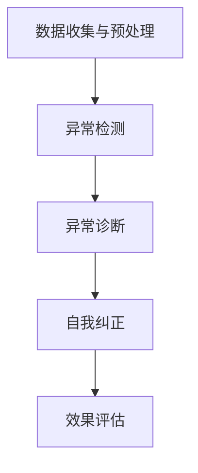

                 

## 文章标题: Self-Consistency CoT提升AI虚拟生态系统的自我修复能力

### 关键词：自我一致性协同思维，AI虚拟生态系统，自我修复能力，核心算法，数学模型，代码实现，案例分析

### 摘要：

本文探讨了如何利用自我一致性协同思维（Self-Consistency CoT）提升人工智能（AI）虚拟生态系统的自我修复能力。首先，文章介绍了AI虚拟生态系统的背景和重要性，随后详细阐述了自我一致性协同思维的概念和原理。接着，文章通过核心算法原理讲解和数学模型分析，阐述了如何实现自我修复能力。随后，文章提供了详细的代码实现和分析，并通过实际案例展示了自我修复能力在虚拟生态系统中的应用。最后，文章总结了研究成果，并提出了未来的研究方向。

## 引言

### 1.1 背景与意义

随着人工智能技术的飞速发展，AI虚拟生态系统逐渐成为各个领域的重要应用场景。AI虚拟生态系统是一种在虚拟环境中运行的复杂系统，涵盖了多种人工智能算法、模型和应用。这些系统具有高度的自主性和智能化，能够模拟和解决现实世界中的各种问题。然而，AI虚拟生态系统的复杂性和不确定性也带来了许多挑战，特别是自我修复能力的不足。

自我修复能力是指系统在面对异常或错误时，能够自动检测、诊断和恢复的能力。在AI虚拟生态系统中，自我修复能力至关重要，因为它能够提高系统的稳定性和可靠性，减少系统停机时间和维护成本。然而，目前的AI虚拟生态系统在自我修复能力方面仍存在诸多不足，需要新的方法和策略来提升。

### 1.2 研究内容与目标

本文旨在通过引入自我一致性协同思维（Self-Consistency CoT）来提升AI虚拟生态系统的自我修复能力。具体来说，本文将实现以下目标：

1. **核心概念与原理**：详细阐述自我一致性协同思维的概念、原理和架构设计，为后续研究提供理论基础。

2. **核心算法实现**：通过核心算法原理讲解和数学模型分析，阐述如何实现自我修复能力。

3. **代码实现与分析**：提供详细的代码实现，包括开发环境搭建、源代码分析和应用解读。

4. **案例分析**：通过实际案例展示自我修复能力在虚拟生态系统中的应用和效果。

5. **总结与展望**：总结研究成果，提出未来研究方向和挑战。

### 1.3 本文结构

本文分为六个主要部分。第一部分为引言，介绍了研究背景和目标。第二部分为Self-Consistency CoT基础，详细阐述了核心概念、原理和架构。第三部分为AI虚拟生态系统基础，介绍了相关概念和特征。第四部分为自我修复能力提升方法，讲述了核心算法原理和数学模型。第五部分为应用案例分析，展示了实际应用。第六部分为总结与展望，总结了研究成果并提出了未来研究方向。

## Self-Consistency CoT基础

### 2.1 Self-Consistency CoT原理与架构

#### 2.1.1 自我一致性协同思维概述

自我一致性协同思维（Self-Consistency CoT）是一种基于人工智能和机器学习的系统级协同思维方式，旨在通过自我检测、自我纠正和自我优化来提高系统的整体性能和稳定性。它主要解决以下问题：

1. **系统复杂性**：在复杂的AI虚拟生态系统中，各个模块和算法之间存在着复杂的相互作用和依赖关系，容易出现不一致性和冲突。
2. **动态变化**：AI虚拟生态系统中的数据和环境会不断变化，系统需要具备适应和调整的能力。
3. **异常处理**：系统在运行过程中可能会出现异常情况，需要能够自动检测和恢复。

#### 2.1.2 Self-Consistency CoT的架构设计

Self-Consistency CoT的架构设计主要包括以下三个层次：

1. **数据层**：数据层是整个系统的基石，负责收集、存储和处理各种数据，包括系统内部的数据和外部环境的数据。
2. **算法层**：算法层是核心层，包含了各种基于机器学习和人工智能的算法，用于分析数据、检测异常和进行自我纠正。
3. **控制层**：控制层是决策层，负责根据算法层的分析和建议，制定和执行系统的自我修复策略。

#### 2.1.3 Self-Consistency CoT的工作机制

Self-Consistency CoT的工作机制主要包括以下步骤：

1. **数据收集与预处理**：系统通过传感器和接口收集内部和外部数据，并进行预处理，如数据清洗、去噪和归一化。
2. **异常检测**：算法层利用机器学习算法对预处理后的数据进行分析，检测系统中的异常情况。
3. **异常诊断**：系统根据异常检测结果，对异常情况进行诊断，确定异常的根源和影响范围。
4. **自我纠正**：系统根据诊断结果，自动调整参数和算法，进行自我纠正，以恢复系统的正常运行。
5. **效果评估**：系统对自我纠正的效果进行评估，如性能指标、准确率和稳定性等，以验证自我修复的效果。

#### 2.1.4 Self-Consistency CoT的Mermaid流程图

下面是Self-Consistency CoT的Mermaid流程图：

## AI虚拟生态系统基础

### 4.1 AI虚拟生态系统的概念与特征

#### 4.1.1 AI虚拟生态系统的定义

AI虚拟生态系统是指利用人工智能技术构建的虚拟环境中的复杂系统。它包括多个相互关联的模块和算法，能够在虚拟环境中模拟、分析和解决问题。AI虚拟生态系统通常具有以下特征：

1. **复杂性**：系统由多个复杂的模块和算法组成，各个模块之间存在复杂的相互作用和依赖关系。
2. **动态性**：系统中的数据和环境会不断变化，系统需要具备适应和调整的能力。
3. **智能性**：系统利用人工智能技术进行数据分析和决策，具有较高的自主性和智能化水平。

#### 4.1.2 AI虚拟生态系统的特征

AI虚拟生态系统具有以下主要特征：

1. **自我适应性**：系统能够根据环境变化和需求调整自身的参数和算法，以适应新的情况。
2. **自学习能力**：系统通过机器学习和数据挖掘技术，不断学习和优化自身的性能和效果。
3. **自我修复能力**：系统能够自动检测和纠正异常，保持系统的稳定性和可靠性。
4. **协同性**：系统中的各个模块和算法能够协同工作，共同完成复杂任务。

#### 4.1.3 AI虚拟生态系统与传统AI系统的对比

与传统AI系统相比，AI虚拟生态系统具有以下优势：

1. **更高的自适应性和灵活性**：系统能够根据环境变化和需求进行调整，适应复杂和多变的环境。
2. **更强大的自学习和进化能力**：系统通过自学习和数据挖掘技术，能够不断优化自身的性能和效果。
3. **更好的自我修复能力**：系统能够自动检测和纠正异常，提高系统的稳定性和可靠性。
4. **更强的协同能力**：系统能够实现各个模块和算法之间的协同工作，共同完成复杂任务。

### 4.2 AI虚拟生态系统的构建与优化

#### 4.2.1 虚拟环境搭建

构建AI虚拟生态系统需要搭建一个虚拟环境，包括硬件设备、软件工具和模拟平台。虚拟环境应具备以下特点：

1. **高性能**：虚拟环境应具备足够的计算能力和存储能力，以满足系统运行的需求。
2. **可扩展性**：虚拟环境应具备良好的扩展性，能够方便地增加或替换模块和算法。
3. **可靠性**：虚拟环境应具备高可靠性，能够稳定运行系统，减少系统故障和中断。

#### 4.2.2 系统架构设计

AI虚拟生态系统的架构设计应考虑以下因素：

1. **模块化**：系统应采用模块化设计，各个模块之间相互独立，便于维护和升级。
2. **分布式**：系统应采用分布式架构，各个模块可以在不同的服务器或设备上运行，提高系统的可靠性和可扩展性。
3. **灵活性**：系统应具备良好的灵活性，能够方便地调整和优化模块和算法，以适应不同的应用场景。

#### 4.2.3 系统优化策略

为了提高AI虚拟生态系统的性能和稳定性，可以采用以下优化策略：

1. **负载均衡**：通过负载均衡技术，合理分配计算资源和数据流量，避免系统过载和瓶颈。
2. **缓存技术**：通过缓存技术，减少系统对数据的读取和计算次数，提高系统的响应速度。
3. **分布式存储**：通过分布式存储技术，提高系统的数据存储能力和访问速度。
4. **自优化算法**：通过自优化算法，自动调整系统的参数和配置，提高系统的性能和稳定性。

### 4.3 AI虚拟生态系统与传统AI系统的对比

#### 4.3.1 对比分析

AI虚拟生态系统与传统AI系统在以下几个方面存在显著差异：

1. **应用场景**：AI虚拟生态系统主要应用于虚拟环境中的复杂系统，如智能交通、智慧城市、虚拟医疗等；而传统AI系统则更多应用于实际环境中的简单问题，如图像识别、语音识别等。
2. **系统复杂性**：AI虚拟生态系统的复杂性远高于传统AI系统，它需要处理多个模块和算法之间的相互作用和依赖关系；而传统AI系统通常只涉及单一模块或算法。
3. **自适应性**：AI虚拟生态系统具备更强的自适应性，能够根据环境变化和需求进行调整；而传统AI系统则相对固定，适应性较差。
4. **自我修复能力**：AI虚拟生态系统具备自我修复能力，能够在异常情况下自动恢复；而传统AI系统通常需要人工干预和修复。

#### 4.3.2 优势与挑战

AI虚拟生态系统相对于传统AI系统的优势在于：

1. **更强的自适应性和灵活性**：能够适应复杂和多变的环境，满足不同应用场景的需求。
2. **更强大的自学习和进化能力**：能够不断学习和优化自身的性能和效果。
3. **更好的自我修复能力**：能够在异常情况下自动恢复，提高系统的稳定性和可靠性。

然而，AI虚拟生态系统也面临着一些挑战：

1. **系统复杂性**：构建和维护AI虚拟生态系统需要更高的技术难度和资源投入。
2. **安全性**：AI虚拟生态系统面临更多的安全威胁，如数据泄露、恶意攻击等。
3. **伦理和法律问题**：随着AI虚拟生态系统的发展，其带来的伦理和法律问题也日益突出，如隐私保护、责任归属等。

### 4.4 AI虚拟生态系统的应用领域

AI虚拟生态系统在以下领域具有广泛的应用前景：

1. **智能交通**：利用AI虚拟生态系统模拟交通流量、优化交通信号控制，提高道路通行效率。
2. **智慧城市**：构建智慧城市管理系统，实现城市资源的优化配置和智能管理。
3. **虚拟医疗**：利用AI虚拟生态系统进行疾病诊断、治疗方案设计、医学研究等。
4. **智能制造**：构建智能制造系统，实现生产过程的自动化、智能化和高效化。
5. **金融服务**：利用AI虚拟生态系统进行风险评估、投资策略制定、客户服务优化等。

### 4.5 AI虚拟生态系统的发展趋势

随着人工智能技术的不断进步，AI虚拟生态系统的发展趋势将呈现以下特点：

1. **智能化**：系统将更加智能化，具备更强的自学习和自适应能力。
2. **协同化**：系统将实现各个模块和算法之间的协同工作，提高整体性能。
3. **自适应化**：系统将能够更好地适应环境变化和需求调整，提高系统的稳定性和可靠性。
4. **安全化**：系统将加强安全性，确保数据安全和隐私保护。
5. **泛在化**：系统将实现更广泛的部署和应用，覆盖更多领域和场景。

### 4.6 AI虚拟生态系统的挑战与机遇

#### 4.6.1 挑战

AI虚拟生态系统的发展面临着一系列挑战：

1. **技术挑战**：系统构建和维护需要更高技术水平，涉及多个领域的交叉融合。
2. **数据挑战**：系统运行需要大量高质量的数据支持，数据收集、存储和处理面临挑战。
3. **安全挑战**：系统面临数据泄露、恶意攻击等安全威胁，需要加强安全性保障。
4. **伦理挑战**：随着系统的发展，其带来的伦理问题日益突出，如隐私保护、责任归属等。

#### 4.6.2 机遇

尽管面临挑战，AI虚拟生态系统的发展也带来了许多机遇：

1. **产业升级**：AI虚拟生态系统将推动传统产业升级和转型，提高产业智能化水平。
2. **创新应用**：AI虚拟生态系统为各个领域提供了新的应用场景和解决方案，激发创新活力。
3. **经济增长**：AI虚拟生态系统的发展将带动相关产业链的发展，促进经济增长。

### 4.7 AI虚拟生态系统的发展策略

为推动AI虚拟生态系统的发展，可以采取以下策略：

1. **加强技术研发**：加大在人工智能、大数据、云计算等领域的研发投入，提高技术水平。
2. **建立数据平台**：构建数据平台，整合各类数据资源，为系统运行提供数据支持。
3. **加强安全保护**：加强系统安全保护，确保数据安全和隐私保护。
4. **促进产业合作**：推动政、产、学、研、用各方合作，共同推进AI虚拟生态系统的发展。

### 4.8 AI虚拟生态系统的发展前景

展望未来，AI虚拟生态系统将朝着更加智能化、协同化、自适应化和安全化的方向发展。它将在各个领域发挥重要作用，推动产业升级、创新应用和经济增长。随着技术的不断进步和应用的深入，AI虚拟生态系统有望成为人工智能领域的重要突破口，为人类创造更多价值。

## 自我修复能力提升方法

### 6.1 自我修复能力的重要性

自我修复能力是指系统在面对异常或错误时，能够自动检测、诊断和恢复的能力。在AI虚拟生态系统中，自我修复能力至关重要。首先，自我修复能力可以提高系统的稳定性和可靠性，减少系统停机时间和维护成本。其次，自我修复能力可以增强系统的自主性和智能化水平，使系统能够更好地适应动态变化和复杂环境。最后，自我修复能力有助于提高系统的性能和效率，通过自动调整和优化，使系统能够持续保持最佳状态。

### 6.2 提升自我修复能力的策略与方法

#### 6.2.1 异常检测与诊断

异常检测与诊断是提升自我修复能力的关键步骤。异常检测是指通过监测系统运行状态，发现异常情况。常用的异常检测方法包括统计方法、机器学习方法和基于模型的方法。统计方法通过分析系统数据的统计特性，发现异常值。机器学习方法利用已标记的数据训练模型，对新数据进行异常检测。基于模型的方法通过建立系统模型，比较实际运行状态与模型预测状态之间的差异，发现异常。

异常诊断是指对检测到的异常进行进一步分析，确定异常的根源和影响范围。常见的异常诊断方法包括基于规则的诊断、基于统计的诊

