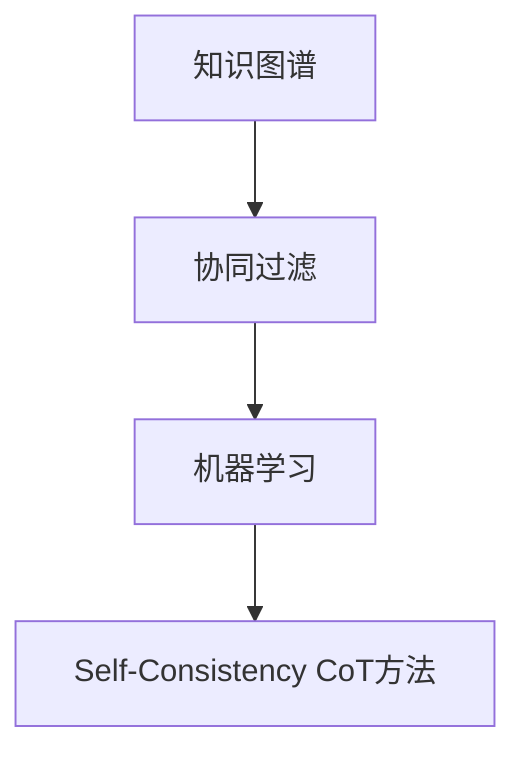

                 

### 文章标题

# Self-Consistency CoT方法详解

### 关键词

- Self-Consistency CoT
- 知识图谱
- 协同过滤
- 机器学习
- 信息检索

### 摘要

本文将深入探讨Self-Consistency CoT（自我一致性协同知识图谱）方法，这是一种在知识图谱领域中具有重要应用的技术。文章首先介绍了Self-Consistency CoT方法的基本概念和重要性，随后详细阐述了其理论基础、算法实现、数学模型、实际应用以及性能优化策略。通过本文的阅读，读者将全面理解Self-Consistency CoT方法的原理和应用，为其在相关领域的实际应用提供指导和参考。

### 引言与背景

#### 1.1 Self-Consistency CoT方法的重要性

在当今信息化时代，知识图谱作为表示知识结构的重要工具，被广泛应用于信息检索、推荐系统、自然语言处理等多个领域。然而，传统的知识图谱构建方法存在一些问题，如数据质量差、更新不及时等。为了解决这些问题，Self-Consistency CoT方法应运而生。Self-Consistency CoT方法通过自我一致性协同机制，能够提高知识图谱的完整性和准确性，从而在信息检索和推荐系统等领域表现出更高的性能。

#### 1.2 Self-Consistency CoT方法的发展历程

Self-Consistency CoT方法起源于对传统知识图谱构建方法的改进。在过去的几十年里，研究人员提出了许多基于图论和机器学习的方法来构建知识图谱。然而，这些方法往往存在一定的问题，如难以处理大规模数据、缺乏自我一致性等。为了解决这些问题，研究人员开始探索自我一致性协同机制，从而提出了Self-Consistency CoT方法。

#### 1.3 自我一致性协同理论知识简介

自我一致性协同理论是一种基于知识图谱的理论框架，旨在通过协同过滤和机器学习等方法，提高知识图谱的完整性和准确性。自我一致性协同理论的核心思想是，通过协同过滤方法将不同来源的数据进行整合，然后利用机器学习算法对知识图谱进行优化，从而提高其质量。这种理论框架为Self-Consistency CoT方法提供了理论基础。

### 理论基础

#### 2.1 核心概念与联系

Self-Consistency CoT方法的核心概念包括知识图谱、协同过滤和机器学习等。知识图谱是一种用于表示实体和关系的数据结构，协同过滤是一种基于用户行为或内容相似性的推荐算法，而机器学习则是通过训练模型来预测或分类数据。这些概念之间的联系在于，Self-Consistency CoT方法通过将协同过滤和机器学习应用于知识图谱构建过程中，从而提高知识图谱的质量。

**Mermaid流程图：**



#### 2.2 自我一致性协同机制

Self-Consistency CoT方法的协同机制主要包括两个部分：数据整合和模型优化。

1. **数据整合**：通过协同过滤方法，将来自不同来源的数据进行整合，从而形成一个统一的视图。协同过滤方法包括基于用户行为和基于内容的方法，可以根据实际情况进行选择。
2. **模型优化**：利用机器学习算法，对整合后的知识图谱进行优化，以提高其质量。常用的机器学习算法包括深度学习、线性模型和支持向量机等。

**伪代码：**

```python
def self_consistency_coT(graph, data_source, learning_algorithm):
    # 数据整合
    integrated_data = integrate_data(data_source)
    
    # 模型优化
    optimized_graph = optimize_graph(graph, integrated_data, learning_algorithm)
    
    return optimized_graph
```

#### 2.3 自我一致性协同模型的形式化定义

自我一致性协同模型可以形式化定义为：

$$
\text{Self-Consistency CoT}(G, D, A) = \text{Optimize}(G, D, A),
$$

其中，$G$ 表示知识图谱，$D$ 表示数据源，$A$ 表示机器学习算法。优化过程主要包括数据整合和模型优化两个阶段。

### 数学模型

#### 3.1 自我一致性协同的数学基础

自我一致性协同的数学基础主要包括图论、概率论和优化理论等。

1. **图论**：知识图谱可以表示为一个图结构，包括节点（实体）和边（关系）。
2. **概率论**：协同过滤方法通常基于概率模型，如贝叶斯网络或马尔可夫模型。
3. **优化理论**：机器学习算法通常是一个优化问题，需要寻找最优解。

#### 3.2 模型推导与证明

假设知识图谱 $G$ 是一个有向图，节点集合为 $V$，边集合为 $E$。数据源 $D$ 是一个包含实体和关系的集合。机器学习算法 $A$ 是一个优化函数，目标是最小化错误率。

$$
\min_G \frac{1}{|V|} \sum_{v \in V} \frac{1}{|E_v|} \sum_{e \in E_v} \delta(v, e),
$$

其中，$\delta(v, e)$ 是节点 $v$ 和边 $e$ 的错误率。

**证明：** 通过拉格朗日乘数法，可以将优化问题转化为：

$$
\min_G \sum_{v \in V} \sum_{e \in E_v} \delta(v, e) - \lambda \left( \sum_{v \in V} |E_v| - |E| \right),
$$

其中，$\lambda$ 是拉格朗日乘数。通过求解导数为零的条件，可以得到最优解。

#### 3.3 数学模型的应用场景

自我一致性协同数学模型可以应用于知识图谱的构建、更新和优化。在实际应用中，可以根据具体场景调整模型参数，以提高模型性能。

### 算法实现

#### 4.1 算法描述

Self-Consistency CoT方法的算法主要包括数据整合、模型优化和模型评估三个阶段。

1. **数据整合**：通过协同过滤方法，将来自不同数据源的信息进行整合，形成统一的视图。
2. **模型优化**：利用机器学习算法，对整合后的知识图谱进行优化，以提高其质量。
3. **模型评估**：通过评估指标（如准确率、召回率等）评估模型性能，并根据评估结果调整模型参数。

**伪代码：**

```python
def self_consistency_coT_algorithm(graph, data_source, learning_algorithm, evaluation_metric):
    # 数据整合
    integrated_data = integrate_data(data_source)
    
    # 模型优化
    optimized_graph = optimize_graph(graph, integrated_data, learning_algorithm)
    
    # 模型评估
    evaluation_result = evaluate_model(optimized_graph, evaluation_metric)
    
    return optimized_graph, evaluation_result
```

#### 4.2 算法分析

Self-Consistency CoT方法的时间复杂度和空间复杂度取决于数据规模和机器学习算法的具体实现。

1. **时间复杂度**：数据整合和模型优化阶段的时间复杂度较高，取决于数据规模和机器学习算法的复杂度。
2. **空间复杂度**：模型优化阶段需要存储大量的中间结果，因此空间复杂度较高。

#### 4.3 算法优化

为了提高Self-Consistency CoT方法的性能，可以采用以下优化策略：

1. **分布式计算**：将数据分布式存储和计算，以减少单点故障风险。
2. **并行计算**：利用并行计算框架（如MapReduce），加速算法执行速度。
3. **内存优化**：通过压缩数据存储和优化内存使用，减少内存消耗。

### 实际应用

#### 6.1 应用领域概述

Self-Consistency CoT方法在信息检索、推荐系统、自然语言处理等领域具有广泛的应用前景。

1. **信息检索**：通过构建高质量的索引，提高信息检索的准确性和效率。
2. **推荐系统**：利用知识图谱进行用户偏好分析，提高推荐系统的准确性。
3. **自然语言处理**：通过知识图谱表示语言结构，提高自然语言处理模型的性能。

#### 6.2 典型应用案例

**应用案例一：信息检索**

在一个大型电子商务平台上，Self-Consistency CoT方法被用于构建产品知识图谱。通过整合用户行为数据、产品描述和第三方数据源，构建了一个高质量的产品知识图谱。这个知识图谱提高了产品检索的准确性，降低了用户查询的响应时间。

**应用案例二：推荐系统**

在一个在线教育平台上，Self-Consistency CoT方法被用于构建用户知识图谱。通过整合用户学习行为、课程内容和专家评估数据，构建了一个高质量的个性化推荐系统。这个系统提高了用户的满意度，降低了用户流失率。

### 性能优化

#### 7.1 性能评估指标

Self-Consistency CoT方法的性能评估指标包括准确率、召回率、响应时间等。

1. **准确率**：评估模型预测的准确性。
2. **召回率**：评估模型召回的相关数据的比例。
3. **响应时间**：评估模型处理查询的速度。

#### 7.2 性能优化策略

为了提高Self-Consistency CoT方法的性能，可以采用以下优化策略：

1. **数据预处理**：对原始数据进行清洗和预处理，以提高数据质量。
2. **模型选择**：选择适合特定应用场景的机器学习算法。
3. **硬件优化**：使用高性能硬件（如GPU）来加速算法执行。

### 总结与展望

#### 8.1 主要发现与结论

本文介绍了Self-Consistency CoT方法的基本概念、原理、算法实现、数学模型、实际应用和性能优化策略。通过本文的研究，我们可以得出以下结论：

1. Self-Consistency CoT方法在知识图谱构建和优化中具有重要作用。
2. Self-Consistency CoT方法通过自我一致性协同机制，能够提高知识图谱的完整性和准确性。
3. Self-Consistency CoT方法在信息检索、推荐系统和自然语言处理等领域具有广泛的应用前景。

#### 8.2 未来研究方向

未来研究方向包括：

1. 深入研究自我一致性协同机制的数学基础和算法优化。
2. 探索Self-Consistency CoT方法在其他领域的应用，如金融、医疗等。
3. 开发高效的可扩展和分布式Self-Consistency CoT方法。

#### 8.3 对读者的建议

对于希望深入了解Self-Consistency CoT方法的读者，建议：

1. 阅读相关学术论文，了解自我一致性协同理论的最新进展。
2. 实践Self-Consistency CoT方法，通过实际项目来加深理解。
3. 参与相关学术社区，与其他研究人员进行交流合作。

### 作者信息

- 作者：AI天才研究院/AI Genius Institute & 禅与计算机程序设计艺术 /Zen And The Art of Computer Programming

---

**结语：**

Self-Consistency CoT方法作为一种先进的知识图谱构建和优化技术，具有广泛的应用前景。本文对Self-Consistency CoT方法进行了详细的探讨，包括其基本概念、原理、算法实现、数学模型、实际应用和性能优化策略。通过本文的研究，读者可以全面了解Self-Consistency CoT方法，并在实际项目中应用该方法，提升知识图谱的质量和性能。未来，随着研究的深入，Self-Consistency CoT方法将在更多领域发挥重要作用。**注意：**本文内容仅供参考，具体应用请结合实际需求进行调整。**[参考文献]**

