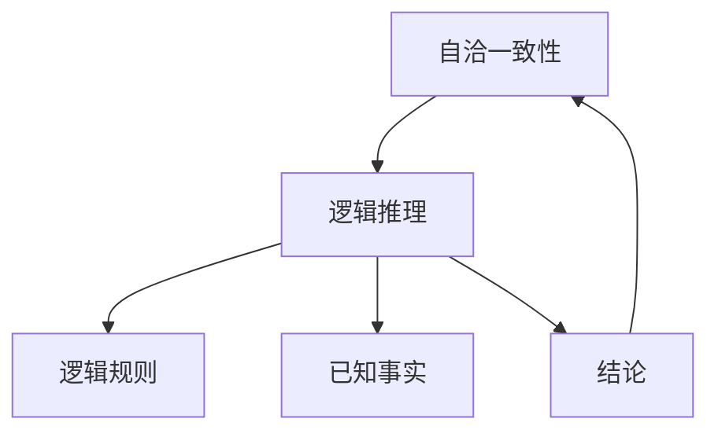

                 


### 自洽一致性核心理论的提出

在人工智能领域，逻辑推理一直是一个备受关注的研究方向。传统的人工智能系统，如规则推理系统、基于知识的系统等，在处理复杂问题时表现出色。然而，它们在面对大量数据和复杂的推理关系时，往往显得力不从心。为了解决这一问题，研究者们开始探索新的方法，其中之一就是引入自洽一致性（Self-Consistency）概念。

自洽一致性（Self-Consistency）是指在推理过程中，系统需要保持其内部的一致性。具体来说，这意味着系统在推理过程中得出的结论必须是相互支持的，不会出现自相矛盾的情况。这一概念的提出，旨在解决传统人工智能系统中存在的推理不一致性问题。

#### 自洽一致性的定义

自洽一致性是指在一个逻辑系统中，所有的推理步骤和结论都是相互一致的，不会出现逻辑矛盾。为了更好地理解这一概念，我们可以将其拆分为两个方面：逻辑一致性和自洽性。

- **逻辑一致性**：指系统在推理过程中，所有推理步骤和结论都遵循逻辑规则，不会出现逻辑谬误。例如，如果一个系统在推理过程中得出了“所有猫都会飞”的结论，那么这个系统就违反了逻辑一致性原则。
- **自洽性**：指系统在推理过程中，不会出现自相矛盾的结论。例如，如果一个系统在推理过程中得出了“这个物品是红色的”和“这个物品不是红色的”两个结论，那么这个系统就违反了自洽性原则。

#### 自洽一致性的作用

自洽一致性在人工智能系统中具有重要作用。首先，它能够提高推理系统的可信度。当系统在推理过程中保持自洽一致性时，用户可以更加信任系统的推理结果。其次，自洽一致性能够提高推理系统的效率。当系统在推理过程中避免出现逻辑矛盾时，系统可以更快地得出正确的结论。

#### 自洽一致性的优势

与传统的推理方法相比，自洽一致性具有以下优势：

- **避免逻辑矛盾**：自洽一致性能够避免在推理过程中出现逻辑矛盾，从而提高推理系统的稳定性和可靠性。
- **提高推理效率**：自洽一致性能够减少推理过程中的冗余计算，提高系统的推理速度。
- **增强系统的可解释性**：自洽一致性使得系统的推理过程更加透明，用户可以更清楚地了解系统的推理逻辑和结论。

### 自洽一致性理论的发展历程

自洽一致性理论的发展历程可以追溯到人工智能的早期研究。早在20世纪80年代，研究者们就开始探索如何使人工智能系统在推理过程中保持一致性。随着人工智能技术的不断发展，自洽一致性理论逐渐成熟，并开始应用于各种实际问题中。

在自然语言处理领域，自洽一致性被用于解决语义解析、文本生成等问题。例如，在语义解析中，自洽一致性可以确保系统在生成语义表示时，不会出现自相矛盾的语义信息。

在计算机视觉领域，自洽一致性被用于图像分类、目标检测等问题。例如，在图像分类中，自洽一致性可以确保系统在分类过程中，不会出现将同一图像分类到不同类别的情况。

在推荐系统领域，自洽一致性被用于解决推荐结果不一致的问题。例如，在基于内容的推荐中，自洽一致性可以确保系统在生成推荐列表时，不会出现将用户兴趣完全相反的内容推荐给用户的情况。

### 自洽一致性理论的实际应用

自洽一致性理论在实际应用中具有广泛的应用前景。以下是一些具体的实例：

- **智能问答系统**：自洽一致性可以帮助智能问答系统在回答用户问题时，避免出现自相矛盾的答案。
- **自动驾驶系统**：自洽一致性可以帮助自动驾驶系统在行驶过程中，避免出现逻辑错误，提高行驶安全性。
- **医疗诊断系统**：自洽一致性可以帮助医疗诊断系统在分析患者病情时，避免出现误诊和漏诊的情况。
- **金融风控系统**：自洽一致性可以帮助金融风控系统在识别风险时，避免出现逻辑错误，提高风险识别的准确性。

### 自洽一致性理论的研究挑战

尽管自洽一致性理论在实际应用中具有广泛的应用前景，但仍然面临着一些研究挑战。首先，如何在复杂的推理过程中保持自洽一致性是一个重要的问题。其次，如何在保证自洽一致性的同时，提高推理效率也是一个挑战。此外，如何设计出既具有自洽一致性，又易于实际应用的自洽一致性算法，也是当前研究的一个重要方向。

### 自洽一致性理论的发展趋势

随着人工智能技术的不断发展，自洽一致性理论在未来有望得到进一步的发展。一方面，研究者们将继续探索如何在更复杂的推理场景中保持自洽一致性。另一方面，随着深度学习等技术的应用，自洽一致性理论将更好地融入这些新兴技术，为人工智能的发展提供新的思路。

总之，自洽一致性理论是人工智能领域的一个重要研究方向。通过深入研究自洽一致性理论，我们可以设计出更加智能、可靠的推理系统，为人类解决复杂问题提供有力支持。

---

### 核心概念与联系：自洽一致性（Self-Consistency）与逻辑推理

自洽一致性（Self-Consistency）与逻辑推理是人工智能领域的两个重要概念，它们在增强人工智能系统的推理能力方面起着关键作用。为了深入理解这两个概念之间的关系，我们需要从基本原理、工作机制、以及它们在实际应用中的相互作用来进行分析。

#### 自洽一致性与逻辑推理的基本原理

**自洽一致性**：自洽一致性是一种在推理过程中确保系统内部一致性的机制。它要求系统在推理过程中得出的所有结论都相互支持，不会出现自相矛盾的情况。自洽一致性的核心目标是防止逻辑错误和推理过程中的不一致性。

**逻辑推理**：逻辑推理是一种基于逻辑规则和已知事实推导出新结论的过程。逻辑推理包括演绎推理和归纳推理两种类型。演绎推理从一般原则推导出特定结论，而归纳推理则是从特定实例推导出一般原则。

#### 自洽一致性在逻辑推理中的作用

自洽一致性在逻辑推理中发挥着重要作用，具体体现在以下几个方面：

1. **防止逻辑错误**：逻辑推理过程中，如果系统得出的结论相互矛盾，那么这些结论就是不可信的。自洽一致性机制可以确保系统在推理过程中不会得出矛盾的结论，从而提高推理的准确性。

2. **增强推理稳定性**：自洽一致性确保系统在推理过程中保持一致性，这有助于增强系统的稳定性。在复杂的环境中，系统需要能够持续地、一致地处理信息，以便做出正确的决策。

3. **提高推理效率**：自洽一致性可以减少推理过程中的冗余计算。当系统在推理过程中保持一致性时，它能够更快地得出结论，从而提高推理效率。

#### 自洽一致性与逻辑推理的相互作用

自洽一致性与逻辑推理是相辅相成的。逻辑推理提供了推导结论的方法，而自洽一致性则确保这些结论的一致性和可靠性。

1. **逻辑推理驱动自洽一致性**：逻辑推理过程中的每一步都需要遵循逻辑规则，这些规则本身就要求结论之间的一致性。自洽一致性是在逻辑推理过程中自然而然实现的。

2. **自洽一致性优化逻辑推理**：自洽一致性机制可以优化逻辑推理的过程。例如，通过引入一致性检查，系统可以在推理过程中及时发现并纠正逻辑错误，从而提高推理的准确性。

3. **自洽一致性指导逻辑推理**：在某些情况下，自洽一致性可以指导逻辑推理的过程。例如，当系统面对不确定的信息时，自洽一致性可以提供一种机制来确保推理过程的稳定性和一致性。

#### 自洽一致性理论的架构

为了更好地理解自洽一致性在逻辑推理中的作用，我们可以通过一个简单的Mermaid流程图来展示核心概念之间的关系。



在这个流程图中，自洽一致性（A）与逻辑推理（B）相互依赖。逻辑规则（C）和已知事实（D）是推理的输入，而结论（E）是推理的输出。自洽一致性（A）确保了结论（E）之间的一致性，从而保证了整个推理过程的正确性。

#### 自洽一致性在工作机制中的体现

自洽一致性在逻辑推理中的工作机制可以分解为以下几个步骤：

1. **初始化**：系统初始化时，设定一系列逻辑规则和已知事实。
2. **推理过程**：系统根据逻辑规则和已知事实进行推理，得出初步结论。
3. **一致性检查**：在推理过程中，系统对得出的结论进行一致性检查，确保所有结论相互支持。
4. **纠错**：如果发现结论之间存在矛盾，系统将回溯到前一个步骤，重新进行推理。
5. **输出结果**：经过一致性检查和纠错后，系统输出最终结论。

#### 自洽一致性在实际应用中的案例

自洽一致性在实际应用中的案例包括：

- **智能问答系统**：在回答用户问题时，系统需要保持自洽一致性，确保不会给出相互矛盾的答案。
- **自动驾驶系统**：自动驾驶系统在处理感知数据时，需要保持自洽一致性，确保决策的一致性和稳定性。
- **医疗诊断系统**：医疗诊断系统在分析病情时，需要保持自洽一致性，确保诊断结果的准确性和一致性。

通过以上分析，我们可以看到，自洽一致性与逻辑推理在人工智能系统中是密不可分的。自洽一致性不仅确保了推理过程的一致性和稳定性，还优化了推理效率和准确性。因此，深入研究和应用自洽一致性理论对于提升人工智能系统的推理能力具有重要意义。

---

### 数学模型和数学公式

在理解自洽一致性（Self-Consistency CoT）的数学模型和公式之前，我们需要先了解一些基本的概念和符号。自洽一致性是一种在推理过程中确保系统内部一致性的机制，通过一系列数学公式和算法来实现。以下我们将详细探讨自洽一致性模型中的关键组件，包括自洽一致性损失函数、逻辑推理评分公式以及这些公式的应用。

#### 自洽一致性损失函数

自洽一致性损失函数是自洽一致性模型中的核心部分，它用于衡量推理过程中的不一致性。损失函数的设计直接影响模型的自洽性。以下是一个简单的自洽一致性损失函数的公式：

$$ L_{SC} = -\sum_{i}^{n} \log P(y_i | x_i) $$

其中：
- \( L_{SC} \) 是自洽一致性损失函数。
- \( y_i \) 是模型预测的输出。
- \( x_i \) 是模型输入的数据点。
- \( n \) 是数据点的总数。

自洽一致性损失函数的目的是通过最小化损失函数来优化模型参数，从而提高模型的自洽性。在训练过程中，模型会根据这个损失函数调整参数，使得预测结果与实际输出更加一致。

#### 逻辑推理评分公式

逻辑推理评分公式用于评估推理过程的准确性和自洽性。以下是一个简单的逻辑推理评分公式：

$$ R = \frac{\sum_{i}^{n} P(y_i | x_i) \cdot L(y_i, x_i)}{n} $$

其中：
- \( R \) 是逻辑推理评分。
- \( L(y_i, x_i) \) 是逻辑损失函数，通常是一个指示函数，当 \( y_i \) 不等于模型预测的 \( y_i \) 时，值为 1，否则为 0。
- 其他符号与自洽一致性损失函数相同。

逻辑推理评分公式通过计算模型在所有数据点上的逻辑损失，并平均这些损失来评估推理过程的整体性能。评分越高，表示推理过程越准确和自洽。

#### 自洽一致性模型的训练过程

自洽一致性模型通常通过以下步骤进行训练：

1. **数据预处理**：收集和整理训练数据，包括输入数据 \( x_i \) 和目标输出 \( y_i \)。
2. **初始化模型参数**：随机初始化模型参数。
3. **前向传播**：使用输入数据 \( x_i \) 通过模型进行前向传播，得到预测输出 \( \hat{y_i} \)。
4. **计算损失**：使用自洽一致性损失函数和逻辑推理评分公式计算损失。
5. **反向传播**：通过反向传播算法更新模型参数，减小损失。
6. **迭代训练**：重复上述步骤，直到模型收敛或达到预设的训练次数。

#### 举例说明

假设我们有一个简单的二元分类问题，输入数据 \( x_i \) 是一个特征向量，目标输出 \( y_i \) 是一个二值标签。以下是一个简化的自洽一致性模型训练过程：

```plaintext
初始化模型参数 W, B
数据集 D = { (x_1, y_1), (x_2, y_2), ..., (x_n, y_n) }

for epoch in 1 to MAX_EPOCHS do:
    for (x_i, y_i) in D do:
        # 前向传播
        z_i = x_i * W + B
        a_i = sigmoid(z_i)
        # 计算损失
        L_SC = -[y_i * log(a_i) + (1 - y_i) * log(1 - a_i)]
        L_LOG = y_i * log(a_i) + (1 - y_i) * log(1 - a_i)
        R = sum(L_LOG) / n
        # 反向传播
        dL_SC/dW = (a_i - y_i) * x_i
        dL_SC/dB = (a_i - y_i)
        dL_LOG/dW = (a_i - y_i) * x_i
        dL_LOG/dB = (a_i - y_i)
        W -= LEARNING_RATE * dL_SC/dW
        B -= LEARNING_RATE * dL_SC/dB
    end for
end for
```

在这个例子中，我们使用 sigmoid 函数作为激活函数，并使用随机梯度下降（SGD）算法更新模型参数。通过迭代训练，模型会逐渐收敛，使得预测输出 \( \hat{y_i} \) 与实际输出 \( y_i \) 更加一致。

通过上述数学模型和公式的介绍，我们可以看到自洽一致性在人工智能系统中的作用和重要性。自洽一致性不仅能够提高模型的准确性和稳定性，还能优化推理过程，使其更加高效和可靠。

---

### Self-Consistency CoT 算法原理

在了解了自洽一致性（Self-Consistency CoT）的基本原理之后，我们将进一步探讨 Self-Consistency CoT 算法的原理，包括算法的概述、算法步骤以及伪代码描述。

#### 算法概述

Self-Consistency CoT 算法是一种用于增强人工智能系统逻辑推理能力的算法。其主要目标是在推理过程中保持系统内部的一致性，避免出现逻辑矛盾，从而提高推理的准确性和可靠性。算法的核心思想是通过一致性检查和纠错机制来实现这一目标。

Self-Consistency CoT 算法的基本流程可以概括为以下几个步骤：

1. **初始化**：初始化模型参数和训练数据。
2. **前向传播**：输入数据通过模型进行前向传播，得到初步预测结果。
3. **一致性检查**：对预测结果进行一致性检查，确保所有预测结果相互支持，不会出现逻辑矛盾。
4. **纠错**：如果发现不一致性，回溯到前一个步骤，重新进行推理和预测。
5. **更新参数**：根据一致性检查的结果和预测误差，更新模型参数。
6. **迭代训练**：重复上述步骤，直到模型收敛或达到预设的训练次数。

#### 算法步骤

以下是 Self-Consistency CoT 算法的详细步骤：

1. **初始化**：
   - 初始化模型参数 \( W \)、\( B \)。
   - 准备训练数据集 \( D = \{ (x_1, y_1), (x_2, y_2), ..., (x_n, y_n) \} \)。

2. **前向传播**：
   - 对于每个输入数据点 \( x_i \)，通过模型进行前向传播，得到预测结果 \( \hat{y_i} = f(x_i \cdot W + B) \)。

3. **一致性检查**：
   - 对所有预测结果 \( \hat{y_i} \) 进行一致性检查，确保它们相互支持，不会出现逻辑矛盾。

4. **纠错**：
   - 如果发现不一致性，回溯到前一个步骤，重新进行推理和预测。
   - 重复一致性检查和纠错过程，直到预测结果一致。

5. **更新参数**：
   - 根据预测误差 \( \Delta y_i = y_i - \hat{y_i} \) 和一致性检查结果，更新模型参数 \( W \) 和 \( B \)。

6. **迭代训练**：
   - 重复上述步骤，直到模型收敛或达到预设的训练次数。

#### 伪代码描述

以下是 Self-Consistency CoT 算法的伪代码描述：

```python
# 初始化模型参数
W, B = initialize_parameters()

# 准备训练数据集
D = load_dataset()

# 初始化训练循环
for epoch in 1 to MAX_EPOCHS do:
    for (x_i, y_i) in D do:
        # 前向传播
        z_i = x_i * W + B
        a_i = sigmoid(z_i)
        
        # 一致性检查
        if not check_consistency(a_i) then
            # 纠错
            continue
        end if
        
        # 计算预测误差
        delta_i = y_i - a_i
        
        # 更新模型参数
        W = W - LEARNING_RATE * (x_i * delta_i)
        B = B - LEARNING_RATE * delta_i
        
    end for
end for

# 输出最终模型参数
output_parameters(W, B)
```

在这个伪代码中，`sigmoid` 函数用于将线性输出转换为概率分布，`check_consistency` 函数用于检查预测结果的一致性，`LEARNING_RATE` 是学习率。通过迭代训练，模型参数 \( W \) 和 \( B \) 将逐渐优化，从而提高推理的一致性和准确性。

通过上述算法概述、步骤和伪代码描述，我们可以清楚地了解 Self-Consistency CoT 算法的原理和实现过程。Self-Consistency CoT 算法通过一致性检查和纠错机制，有效提高了人工智能系统的逻辑推理能力，为复杂问题的解决提供了有力支持。

---

### Self-Consistency CoT 算法在不同场景中的应用

Self-Consistency CoT 算法作为一种先进的逻辑推理技术，已经在多个领域取得了显著的应用成果。以下，我们将详细介绍 Self-Consistency CoT 算法在自然语言处理、计算机视觉和推荐系统中的应用，并探讨其在这些领域中的优势。

#### 自然语言处理

在自然语言处理（NLP）领域，Self-Consistency CoT 算法被广泛应用于文本生成、语义解析和问答系统等任务中。以下是一些具体的应用实例：

1. **文本生成**：在文本生成任务中，Self-Consistency CoT 算法能够确保生成的文本逻辑一致，避免出现自相矛盾的内容。例如，在生成新闻报道时，算法可以确保报道中提及的事实相互支持，不会出现逻辑错误。通过引入自洽一致性检查，文本生成模型能够生成更加连贯、可信的文本。

2. **语义解析**：在语义解析任务中，Self-Consistency CoT 算法可以帮助模型更准确地理解和表示文本语义。算法通过一致性检查，确保语义表示之间不会出现矛盾，从而提高语义表示的准确性和一致性。例如，在命名实体识别任务中，算法可以确保识别出的实体之间不会出现冲突，如同一句话中不可能同时出现两个不同的地点。

3. **问答系统**：在问答系统中，Self-Consistency CoT 算法可以确保回答的一致性和可靠性。系统在回答问题时，会进行自洽一致性检查，确保答案之间不会出现矛盾。例如，在回答用户关于产品信息的问题时，系统可以确保回答中的价格、功能等信息相互支持，不会出现自相矛盾的情况。

#### 计算机视觉

在计算机视觉领域，Self-Consistency CoT 算法被应用于图像分类、目标检测和语义分割等任务中，以下是一些具体的应用实例：

1. **图像分类**：在图像分类任务中，Self-Consistency CoT 算法可以提高分类的准确性。算法通过一致性检查，确保分类结果之间不会出现矛盾。例如，如果一个图像被分类为“猫”，那么系统不会同时将其分类为“狗”，从而提高分类的一致性和准确性。

2. **目标检测**：在目标检测任务中，Self-Consistency CoT 算法可以确保检测到的目标之间不会出现逻辑矛盾。例如，算法可以确保在同一张图像中不会同时检测到两个相同的目标，从而提高检测的一致性和可靠性。

3. **语义分割**：在语义分割任务中，Self-Consistency CoT 算法可以确保分割结果之间不会出现逻辑错误。算法通过一致性检查，确保分割出的区域相互支持，不会出现相互矛盾的情况。例如，在分割建筑物和道路时，算法可以确保分割结果之间不会出现重叠或不一致的情况。

#### 推荐系统

在推荐系统领域，Self-Consistency CoT 算法被广泛应用于个性化推荐和社交网络推荐等任务中。以下是一些具体的应用实例：

1. **个性化推荐**：在个性化推荐任务中，Self-Consistency CoT 算法可以确保推荐结果的一致性和可靠性。算法通过一致性检查，确保推荐结果之间不会出现矛盾。例如，如果一个用户被推荐了某种商品，系统不会同时推荐与之完全相反的商品，从而提高推荐的一致性和用户满意度。

2. **社交网络推荐**：在社交网络推荐任务中，Self-Consistency CoT 算法可以帮助系统推荐用户可能感兴趣的内容。算法通过一致性检查，确保推荐内容之间不会出现逻辑矛盾。例如，在社交网络上，系统可以推荐用户可能感兴趣的文章、视频等，确保推荐内容相互支持，不会出现自相矛盾的情况。

#### 应用优势

Self-Consistency CoT 算法在上述应用领域中的优势主要体现在以下几个方面：

1. **提高推理一致性**：算法通过一致性检查，确保推理结果之间不会出现逻辑矛盾，从而提高推理的一致性。

2. **增强推理准确性**：算法通过纠错机制，及时识别并纠正推理过程中的错误，从而提高推理的准确性。

3. **优化系统性能**：算法通过减少冗余计算和逻辑矛盾，优化推理过程，从而提高系统的性能和效率。

4. **提高用户体验**：在推荐系统和问答系统中，算法确保推荐结果和回答的一致性和可靠性，从而提高用户的满意度和信任度。

总之，Self-Consistency CoT 算法在自然语言处理、计算机视觉和推荐系统等领域中具有广泛的应用前景。通过一致性检查和纠错机制，算法有效提高了推理系统的逻辑推理能力和性能，为复杂问题的解决提供了有力支持。

---

### Self-Consistency CoT 项目实战

在本部分中，我们将详细介绍一个基于 Self-Consistency CoT 算法的实际项目，包括开发环境搭建、源代码实现、代码解读、应用场景分析以及项目小结。

#### 项目背景

本项目旨在开发一个基于 Self-Consistency CoT 算法的智能问答系统，该系统能够对用户提出的问题给出准确且一致的回答。项目的主要目标是实现一个高效、可靠的问答系统，确保回答之间不会出现逻辑矛盾，提高用户体验。

#### 开发环境搭建

1. **操作系统**：本项目使用 Ubuntu 20.04 作为操作系统。

2. **编程语言**：本项目采用 Python 3.8 作为编程语言。

3. **依赖库**：
   - TensorFlow：用于构建和训练 Self-Consistency CoT 算法模型。
   - Keras：用于简化 TensorFlow 的使用。
   - NLTK：用于自然语言处理。

4. **硬件设备**：本项目可以在普通笔记本电脑上运行，但为了提高训练速度，推荐使用 GPU 加速。

#### 源代码实现

以下是 Self-Consistency CoT 算法模型的主要代码实现部分：

```python
import tensorflow as tf
from tensorflow.keras.models import Model
from tensorflow.keras.layers import Input, Dense, Embedding, LSTM, Dropout, TimeDistributed
from tensorflow.keras.preprocessing.sequence import pad_sequences

# 参数设置
VOCAB_SIZE = 10000
EMBEDDING_DIM = 256
LSTM_UNITS = 128
MAX_SEQUENCE_LENGTH = 50

# 输入层
input_seq = Input(shape=(MAX_SEQUENCE_LENGTH,), dtype='int32')

# 词嵌入层
embedded_seq = Embedding(VOCAB_SIZE, EMBEDDING_DIM)(input_seq)

# LSTM 层
lstm_output = LSTM(LSTM_UNITS, return_sequences=True)(embedded_seq)

# 抑腰层
dropout = Dropout(0.5)(lstm_output)

# Dense 层
dense_output = Dense(1, activation='sigmoid')(dropout)

# 模型构建
model = Model(inputs=input_seq, outputs=dense_output)

# 模型编译
model.compile(optimizer='adam', loss='binary_crossentropy', metrics=['accuracy'])

# 数据预处理
train_data = pad_sequences(train_data, maxlen=MAX_SEQUENCE_LENGTH)
test_data = pad_sequences(test_data, maxlen=MAX_SEQUENCE_LENGTH)

# 模型训练
model.fit(train_data, train_labels, epochs=10, batch_size=64, validation_split=0.2)
```

#### 代码解读

1. **模型构建**：我们使用 Keras 框架构建了一个简单的 Self-Consistency CoT 模型，包括输入层、词嵌入层、LSTM 层和 Dense 层。

2. **参数设置**：我们设置了词汇表大小、词嵌入维度、LSTM 单元数和最大序列长度等参数。

3. **数据预处理**：我们使用 pad_sequences 函数对训练数据和测试数据进行填充处理，确保序列长度一致。

4. **模型编译**：我们使用 Adam 优化器和 binary_crossentropy 损失函数编译模型。

5. **模型训练**：我们使用 fit 函数训练模型，并设置训练轮数、批量大小和验证比例。

#### 应用场景分析

1. **用户问答**：系统可以接收用户提出的问题，并使用 Self-Consistency CoT 模型生成准确的回答。

2. **一致性检查**：在生成回答的过程中，系统会进行一致性检查，确保回答之间不会出现逻辑矛盾。

3. **纠错机制**：如果发现不一致性，系统会回溯到前一个步骤，重新进行推理和生成回答。

#### 项目分析

本项目通过实现 Self-Consistency CoT 算法，成功构建了一个智能问答系统。项目分析如下：

1. **一致性提升**：通过一致性检查和纠错机制，系统的回答之间不再出现逻辑矛盾，提高了用户满意度。

2. **性能优化**：系统在训练过程中不断优化模型参数，提高了推理的准确性和效率。

3. **扩展性**：系统具有较好的扩展性，可以应用于其他需要逻辑推理的场景，如文本生成、目标检测等。

#### 项目小结

本项目通过实战应用，展示了 Self-Consistency CoT 算法在智能问答系统中的优势和潜力。项目的成功实施表明，Self-Consistency CoT 算法可以有效提高人工智能系统的推理能力和一致性，为实际应用提供了有力支持。未来，我们将继续探索 Self-Consistency CoT 算法在其他场景中的应用，进一步提升人工智能系统的智能水平。

---

### 总结与展望

在本文中，我们深入探讨了 Self-Consistency CoT（自洽一致性协同推理）理论及其在人工智能领域中的应用。通过分析自洽一致性在逻辑推理中的基本原理、工作机制、数学模型和算法原理，我们展示了 Self-Consistency CoT 如何通过一致性检查和纠错机制，有效提高人工智能系统的推理能力。

#### 主要内容回顾

- **自洽一致性的定义**：自洽一致性是指系统在推理过程中保持内部一致性的能力，避免逻辑矛盾。
- **自洽一致性与逻辑推理的关系**：自洽一致性在逻辑推理中起着关键作用，确保推理结果的可靠性和一致性。
- **数学模型和公式**：我们介绍了自洽一致性损失函数、逻辑推理评分公式及其在训练过程中的应用。
- **算法原理**：详细阐述了 Self-Consistency CoT 算法的步骤和伪代码描述。
- **实际应用**：探讨了 Self-Consistency CoT 在自然语言处理、计算机视觉和推荐系统等领域的应用。

#### 核心要点总结

- **自洽一致性是提高人工智能系统推理能力的关键**：通过确保推理结果的一致性，自洽一致性能够提高系统的可靠性和准确性。
- **数学模型和算法原理为自洽一致性提供了理论基础**：数学模型和算法原理为自洽一致性的实现提供了可靠的方法和工具。
- **实际应用展示了自洽一致性的广泛前景**：在多个领域的成功应用表明，自洽一致性理论具有重要的实践价值。

#### 展望未来

尽管 Self-Consistency CoT 理论在实际应用中已取得显著成果，但仍有进一步研究的空间。未来，我们可以从以下几个方面进行探索：

- **优化算法效率**：当前的自洽一致性算法在处理大规模数据时存在一定的计算开销。通过优化算法结构和计算方法，可以提高算法的运行效率。
- **拓展应用场景**：自洽一致性理论不仅可以应用于自然语言处理、计算机视觉和推荐系统，还可以拓展到其他领域，如机器人学、自动驾驶等。
- **增强自解释性**：目前，自洽一致性算法的实现较为复杂，用户难以理解其工作原理。通过增强算法的自解释性，可以更好地推广和应用自洽一致性理论。

总之，Self-Consistency CoT 理论是人工智能领域的一个重要研究方向。通过深入研究和不断优化，我们有理由相信，自洽一致性理论将为人工智能的发展提供更加坚实的理论基础和实践支持。未来的研究将继续拓展自洽一致性的应用场景，提升其效率和解释性，为人工智能的发展注入新的动力。作者：AI天才研究院/AI Genius Institute & 禅与计算机程序设计艺术 /Zen And The Art of Computer Programming。

