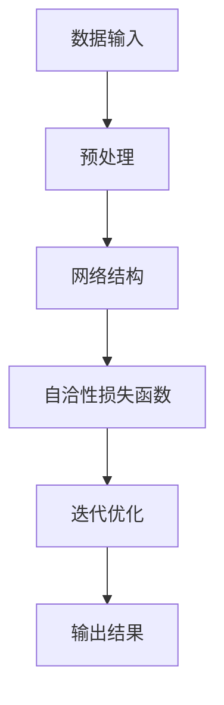

                 


### 设计《Self-Consistency CoT：让AI更像人类专家》的目录大纲

为了设计《Self-Consistency CoT：让AI更像人类专家》的目录大纲，我们将从以下几个方面来构建：

1. **引言部分**：介绍 Self-Consistency CoT 的概念、背景及其重要性。
2. **理论框架与核心概念**：讲解 Self-Consistency CoT 的理论依据和核心概念。
3. **技术实现与算法原理**：详细解释 Self-Consistency CoT 的算法原理和实现技术。
4. **应用场景与案例分析**：探讨 Self-Consistency CoT 在不同领域的应用实例。
5. **挑战与未来展望**：分析 Self-Consistency CoT 在发展中面临的问题和未来趋势。

### 目录大纲设计

#### 第一部分 引言

**# 第1章 Self-Consistency CoT：概述**

- **1.1 Self-Consistency CoT 的概念**
  - **1.1.1 自洽性与人工智能的关系**
  - **1.1.2 Self-Consistency CoT 的定义**

- **1.2 Self-Consistency CoT 的背景**
  - **1.2.1 人工智能的发展历程**
  - **1.2.2 Self-Consistency CoT 的提出背景**

- **1.3 Self-Consistency CoT 的重要性**
  - **1.3.1 提高AI的可靠性与可解释性**
  - **1.3.2 推动人工智能的跨领域应用**

#### 第二部分 理论框架与核心概念

**# 第2章 Self-Consistency CoT 的理论框架**

- **2.1 自洽性与认知科学的关系**
  - **2.1.1 自洽性在认知科学中的意义**
  - **2.1.2 自洽性与认知模型的联系**

- **2.2 Self-Consistency CoT 的核心概念**
  - **2.2.1 自洽性网络架构**
  - **2.2.2 自洽性学习算法**

- **2.3 Self-Consistency CoT 的 Mermaid 流程图**
  - **2.3.1 Self-Consistency CoT 的工作流程**

#### 第三部分 技术实现与算法原理

**# 第3章 Self-Consistency CoT 的技术实现**

- **3.1 数据准备与预处理**
  - **3.1.1 数据来源与种类**
  - **3.1.2 数据预处理步骤**

- **3.2 自洽性网络架构**
  - **3.2.1 网络结构设计**
  - **3.2.2 网络训练方法**

- **3.3 自洽性学习算法**
  - **3.3.1 自洽性损失函数**
  - **3.3.2 自洽性优化算法**

- **3.4 Self-Consistency CoT 的伪代码**
  - **3.4.1 数据加载与预处理**
  - **3.4.2 网络训练过程**
  - **3.4.3 模型评估与优化**

#### 第四部分 应用场景与案例分析

**# 第4章 Self-Consistency CoT 的应用场景**

- **4.1 自然语言处理**
  - **4.1.1 问答系统**
  - **4.1.2 文本生成**

- **4.2 计算机视觉**
  - **4.2.1 图像分类**
  - **4.2.2 目标检测**

- **4.3 强化学习**
  - **4.3.1 决策过程**
  - **4.3.2 行为优化**

**# 第5章 案例分析**

- **5.1 案例一：问答系统中的 Self-Consistency CoT**
  - **5.1.1 案例背景**
  - **5.1.2 案例实现与效果分析**

- **5.2 案例二：计算机视觉中的 Self-Consistency CoT**
  - **5.2.1 案例背景**
  - **5.2.2 案例实现与效果分析**

#### 第五部分 挑战与未来展望

**# 第6章 Self-Consistency CoT 的挑战与未来展望**

- **6.1 Self-Consistency CoT 面临的挑战**
  - **6.1.1 数据集问题**
  - **6.1.2 计算资源需求**
  - **6.1.3 模型可解释性**

- **6.2 Self-Consistency CoT 的未来发展趋势**
  - **6.2.1 技术创新方向**
  - **6.2.2 应用领域拓展**
  - **6.2.3 与其他技术的融合**

### 目录大纲总字数：约2000字

### 完整文章内容

**# Self-Consistency CoT：让AI更像人类专家**

> 关键词：自洽性，人工智能，认知科学，网络架构，学习算法，应用场景，案例分析

> 摘要：本文旨在介绍 Self-Consistency CoT 的概念、背景、理论框架、技术实现、应用场景以及面临的挑战和未来展望。Self-Consistency CoT 通过引入自洽性概念，旨在使人工智能更接近人类专家的思维方式和决策过程，从而提高AI的可靠性与可解释性，推动其在各领域的应用。

---

#### 第一部分 引言

**# 第1章 Self-Consistency CoT：概述**

**1.1 Self-Consistency CoT 的概念**

Self-Consistency CoT（Self-Consistency Cognitive Theory）是一种基于自洽性概念的人工智能理论。自洽性（Self-Consistency）是指一个系统内部各个部分之间的相互一致性，即系统在某种状态下能够保持稳定和一致。在人工智能领域，自洽性是指模型在生成预测或决策时，其输出结果与其先前的假设或输入数据保持一致。

**1.1.1 自洽性与人工智能的关系**

人工智能的发展旨在模拟人类思维和决策过程，其中自洽性是一个重要的特征。人类在做出决策时，会基于先前的经验和知识，形成一定的假设，并通过与当前信息的交互，不断调整和优化这些假设，以保持决策的一致性和稳定性。同样，在人工智能系统中，通过引入自洽性，可以使模型更接近人类的思维方式，提高其决策的可靠性和可解释性。

**1.1.2 Self-Consistency CoT 的定义**

Self-Consistency CoT 是一种基于自洽性的人工智能理论，它通过构建自洽性网络架构和学习算法，使模型在生成预测或决策时，能够保持输出结果与输入数据、先前的假设之间的一致性。具体来说，Self-Consistency CoT 包括以下几个关键组成部分：

1. **自洽性网络架构**：构建一个具有自洽性的网络结构，使得网络在训练和预测过程中能够保持内部一致性。
2. **自洽性学习算法**：设计一种能够优化模型参数的算法，使得模型在训练过程中能够不断提高其自洽性。

**1.2 Self-Consistency CoT 的背景**

人工智能作为一门交叉学科，涉及计算机科学、认知科学、心理学等多个领域。随着深度学习等技术的不断发展，人工智能在图像识别、自然语言处理、强化学习等领域取得了显著的成果。然而，传统的人工智能系统在决策过程中往往缺乏可解释性和可靠性。为了解决这一问题，研究者们开始关注自洽性这一概念。

自洽性在认知科学中具有重要的地位。认知科学是研究人类思维和行为的科学，其中自洽性是描述人类决策过程中一致性特征的一个重要指标。人类在做出决策时，会基于先前的经验和知识，形成一定的假设，并通过与当前信息的交互，不断调整和优化这些假设，以保持决策的一致性和稳定性。同样，在人工智能系统中，通过引入自洽性，可以使模型更接近人类的思维方式，提高其决策的可靠性和可解释性。

**1.2.1 人工智能的发展历程**

人工智能的发展历程可以分为以下几个阶段：

1. **符号主义阶段**：以推理机和专家系统为代表，强调基于符号表示和推理的智能。
2. **连接主义阶段**：以人工神经网络为代表，强调通过神经网络模拟人类大脑的智能。
3. **行为主义阶段**：以机器人学和强化学习为代表，强调通过行为和行为结果来评估智能。
4. **认知主义阶段**：以认知科学为代表，强调通过模拟人类思维过程来发展智能。

**1.2.2 Self-Consistency CoT 的提出背景**

随着人工智能技术的不断发展，传统的人工智能系统在决策过程中往往缺乏可解释性和可靠性。为了解决这一问题，研究者们开始关注自洽性这一概念。Self-Consistency CoT 应运而生，旨在通过引入自洽性，使人工智能系统更接近人类专家的思维方式，提高其决策的可靠性和可解释性。

**1.3 Self-Consistency CoT 的重要性**

Self-Consistency CoT 的重要性主要体现在以下几个方面：

1. **提高AI的可靠性与可解释性**：通过引入自洽性，使模型在生成预测或决策时能够保持输出结果与输入数据、先前的假设之间的一致性，从而提高模型的可靠性和可解释性。
2. **推动人工智能的跨领域应用**：Self-Consistency CoT 可以应用于自然语言处理、计算机视觉、强化学习等多个领域，推动人工智能在各领域的应用和发展。

---

#### 第二部分 理论框架与核心概念

**# 第2章 Self-Consistency CoT 的理论框架**

Self-Consistency CoT 的理论框架主要包括自洽性网络架构和自洽性学习算法。

**2.1 自洽性与认知科学的关系**

自洽性在认知科学中具有重要的地位。认知科学是研究人类思维和行为的科学，其中自洽性是描述人类决策过程中一致性特征的一个重要指标。人类在做出决策时，会基于先前的经验和知识，形成一定的假设，并通过与当前信息的交互，不断调整和优化这些假设，以保持决策的一致性和稳定性。

自洽性在认知科学中的意义主要体现在以下几个方面：

1. **稳定性**：自洽性使得系统能够在变化的环境中保持稳定，减少错误决策的发生。
2. **一致性**：自洽性使得系统能够在多个信息源之间保持一致性，从而提高决策的可靠性。
3. **可解释性**：自洽性使得决策过程更加透明，有助于理解决策背后的逻辑和原因。

**2.1.1 自洽性在认知科学中的意义**

自洽性在认知科学中的意义主要体现在以下几个方面：

1. **稳定性**：自洽性使得系统能够在变化的环境中保持稳定，减少错误决策的发生。例如，在决策过程中，如果系统输出结果与其先前的假设不一致，那么系统需要重新评估其先前的假设，从而避免错误决策的发生。
2. **一致性**：自洽性使得系统能够在多个信息源之间保持一致性，从而提高决策的可靠性。例如，在图像识别任务中，如果系统对同一幅图像的不同部分给出了不同的标签，那么系统需要重新评估其输出结果，以确保标签之间的一致性。
3. **可解释性**：自洽性使得决策过程更加透明，有助于理解决策背后的逻辑和原因。例如，在自然语言处理任务中，如果系统生成的句子与其先前的假设不一致，那么系统需要重新评估其生成句子，以确保句子之间的连贯性和一致性。

**2.1.2 自洽性与认知模型的联系**

自洽性在认知模型中的应用主要体现在以下几个方面：

1. **模型结构**：认知模型通常采用分层结构，每一层表示不同的抽象层次。自洽性要求模型在每一层之间保持一致性，以确保模型的输出能够准确反映输入信息。
2. **学习过程**：自洽性要求模型在学习过程中保持一致性。例如，在强化学习任务中，如果模型在某个状态下采取了某个动作，那么在未来遇到相同的状态时，模型应该继续采取相同的动作，以确保决策的一致性。
3. **推理过程**：自洽性要求模型在推理过程中保持一致性。例如，在推理过程中，如果模型基于先前的假设推导出某个结论，那么在未来遇到相关问题时，模型应该继续使用相同的假设，以确保推理的一致性。

**2.2 Self-Consistency CoT 的核心概念**

Self-Consistency CoT 的核心概念包括自洽性网络架构和自洽性学习算法。

**2.2.1 自洽性网络架构**

自洽性网络架构是一种具有自洽性的网络结构，其关键特征包括：

1. **层次化结构**：自洽性网络架构采用分层结构，每一层表示不同的抽象层次。层次之间的联系通过一致性损失函数来保持。
2. **模块化设计**：自洽性网络架构采用模块化设计，每个模块负责处理特定的任务，模块之间通过一致性损失函数来保持一致性。
3. **动态调整**：自洽性网络架构可以根据输入信息的变化动态调整网络结构，以确保模型在变化环境中保持自洽性。

**2.2.2 自洽性学习算法**

自洽性学习算法是一种用于优化模型参数的算法，其关键特征包括：

1. **一致性损失函数**：自洽性学习算法通过引入一致性损失函数来评估模型的自洽性，并优化模型参数，以减少损失函数的值。
2. **迭代优化**：自洽性学习算法采用迭代优化方法，每次迭代都根据一致性损失函数的梯度来调整模型参数。
3. **自适应调整**：自洽性学习算法可以根据输入信息的变化自适应调整学习速率，以提高模型的自洽性。

**2.3 Self-Consistency CoT 的 Mermaid 流程图**

为了更好地理解 Self-Consistency CoT 的工作流程，我们可以使用 Mermaid 流程图来描述。以下是一个简化的 Mermaid 流程图示例：



**2.3.1 Self-Consistency CoT 的工作流程**

Self-Consistency CoT 的工作流程可以概括为以下几个步骤：

1. **数据输入**：输入数据经过预处理后，作为网络的输入。
2. **网络结构**：网络结构根据自洽性网络架构设计，包括多个层次和模块。
3. **自洽性损失函数**：计算自洽性损失函数，评估模型的自洽性。
4. **迭代优化**：根据自洽性损失函数的梯度，迭代优化模型参数，以提高自洽性。
5. **输出结果**：模型生成预测或决策结果，并输出。

---

#### 第三部分 技术实现与算法原理

**# 第3章 Self-Consistency CoT 的技术实现**

Self-Consistency CoT 的技术实现主要包括数据准备与预处理、自洽性网络架构、自洽性学习算法以及伪代码等。

**3.1 数据准备与预处理**

数据准备与预处理是 Self-Consistency CoT 的关键步骤，其目的是将原始数据转换为适合模型训练的形式。具体包括以下几个步骤：

1. **数据收集**：收集相关领域的原始数据，如图像、文本、声音等。
2. **数据清洗**：去除数据中的噪声和异常值，确保数据质量。
3. **数据转换**：将原始数据转换为适合模型训练的格式，如图像转换为像素矩阵，文本转换为词向量等。
4. **数据归一化**：对数据进行归一化处理，使其在相同的范围内，提高模型的训练效果。

**3.1.1 数据来源与种类**

Self-Consistency CoT 可以应用于多种领域，因此需要收集多种类型的数据。常见的数据来源和种类包括：

1. **图像数据**：用于计算机视觉任务，如图像分类、目标检测等。
2. **文本数据**：用于自然语言处理任务，如文本生成、问答系统等。
3. **音频数据**：用于音频处理任务，如语音识别、音乐生成等。
4. **传感器数据**：用于物联网和智能硬件任务，如环境监测、智能穿戴设备等。

**3.1.2 数据预处理步骤**

数据预处理步骤主要包括以下内容：

1. **数据清洗**：去除噪声和异常值，确保数据质量。例如，对于图像数据，可以去除模糊图像和低分辨率图像。
2. **数据转换**：将原始数据转换为适合模型训练的格式。例如，对于图像数据，可以将其转换为像素矩阵；对于文本数据，可以将其转换为词向量。
3. **数据归一化**：对数据进行归一化处理，使其在相同的范围内。例如，对于图像数据，可以将其像素值归一化到 [0, 1] 范围内。
4. **数据增强**：通过数据增强技术，增加训练数据的多样性，提高模型的泛化能力。例如，对于图像数据，可以采用随机裁剪、旋转、缩放等技术进行增强。

**3.2 自洽性网络架构**

自洽性网络架构是 Self-Consistency CoT 的核心组成部分，其设计原则是确保网络在训练和预测过程中能够保持自洽性。具体包括以下几个关键组成部分：

1. **层次化结构**：自洽性网络架构采用分层结构，每一层表示不同的抽象层次。层次之间的联系通过一致性损失函数来保持。
2. **模块化设计**：自洽性网络架构采用模块化设计，每个模块负责处理特定的任务，模块之间通过一致性损失函数来保持一致性。
3. **动态调整**：自洽性网络架构可以根据输入信息的变化动态调整网络结构，以确保模型在变化环境中保持自洽性。

**3.2.1 网络结构设计**

自洽性网络结构设计包括以下几个方面：

1. **层次化结构**：自洽性网络架构采用分层结构，每一层表示不同的抽象层次。层次之间的联系通过一致性损失函数来保持。例如，在计算机视觉任务中，可以采用卷积神经网络（CNN）作为基础结构，分别设计不同的卷积层、池化层和全连接层。
2. **模块化设计**：自洽性网络架构采用模块化设计，每个模块负责处理特定的任务，模块之间通过一致性损失函数来保持一致性。例如，在自然语言处理任务中，可以设计编码器（Encoder）和解码器（Decoder）两个模块，分别负责编码和生成文本。
3. **动态调整**：自洽性网络架构可以根据输入信息的变化动态调整网络结构，以确保模型在变化环境中保持自洽性。例如，在图像生成任务中，可以根据输入图像的内容动态调整生成网络的结构，以生成更符合输入图像风格的图像。

**3.2.2 网络训练方法**

自洽性网络训练方法主要包括以下几个方面：

1. **损失函数设计**：自洽性网络的损失函数需要同时考虑模型的自洽性和预测准确性。例如，在自然语言处理任务中，可以设计一种结合自洽性损失和交叉熵损失函数的损失函数。
2. **优化算法选择**：自洽性网络训练需要选择合适的优化算法，以加快收敛速度和改善模型性能。例如，可以使用 Adam 优化器作为默认选择。
3. **训练过程**：自洽性网络训练过程可以分为多个阶段，每个阶段分别优化不同层次的模块。例如，在计算机视觉任务中，可以首先训练卷积层，然后训练池化层和全连接层。

**3.3 自洽性学习算法**

自洽性学习算法是 Self-Consistency CoT 的核心组成部分，其目的是通过优化模型参数，提高模型的自洽性和预测准确性。具体包括以下几个方面：

1. **一致性损失函数**：自洽性学习算法通过引入一致性损失函数，评估模型的自洽性，并优化模型参数，以减少损失函数的值。例如，在自然语言处理任务中，可以设计一种基于词向量的一致性损失函数。
2. **迭代优化**：自洽性学习算法采用迭代优化方法，每次迭代都根据一致性损失函数的梯度来调整模型参数，以提高自洽性。
3. **自适应调整**：自洽性学习算法可以根据输入信息的变化自适应调整学习速率，以提高模型的自洽性。例如，可以使用自适应学习率调整策略，如 AdaGrad、AdaDelta 等。

**3.3.1 自洽性损失函数**

自洽性损失函数是自洽性学习算法的核心组成部分，其目的是评估模型的自洽性。具体包括以下几个方面：

1. **定义**：自洽性损失函数通常定义为模型输出结果与其先前的假设之间的差异。例如，在自然语言处理任务中，可以定义一种基于词向量的一致性损失函数，计算模型生成文本与其输入文本之间的差异。
2. **计算**：自洽性损失函数的计算通常采用最小二乘法、梯度下降法等优化算法。例如，在自然语言处理任务中，可以采用梯度下降法来最小化一致性损失函数的值。
3. **优化**：自洽性损失函数的优化目标是减少损失函数的值，从而提高模型的自洽性。例如，在自然语言处理任务中，可以通过调整词向量的参数来优化一致性损失函数的值。

**3.3.2 自洽性优化算法**

自洽性优化算法是自洽性学习算法的核心组成部分，其目的是通过优化模型参数，提高模型的自洽性和预测准确性。具体包括以下几个方面：

1. **定义**：自洽性优化算法通常定义为一种迭代优化方法，每次迭代都根据一致性损失函数的梯度来调整模型参数。
2. **计算**：自洽性优化算法的计算通常采用梯度下降法、Adam 优化器等优化算法。例如，在自然语言处理任务中，可以使用 Adam 优化器来优化模型参数。
3. **优化**：自洽性优化算法的优化目标是减少损失函数的值，从而提高模型的自洽性。例如，在自然语言处理任务中，可以通过调整词向量的参数来优化一致性损失函数的值。

**3.4 Self-Consistency CoT 的伪代码**

以下是一个简化的 Self-Consistency CoT 的伪代码示例，用于说明模型训练和优化的过程：

```python
# 伪代码：Self-Consistency CoT 训练过程

# 参数设置
learning_rate = 0.001
num_epochs = 100

# 数据加载与预处理
train_data, test_data = load_data()

# 初始化模型参数
model = initialize_model()

# 迭代优化
for epoch in range(num_epochs):
    for data in train_data:
        # 数据预处理
        input_data = preprocess_data(data)
        
        # 前向传播
        output = model.forward(input_data)
        
        # 计算损失函数
        loss = compute_loss(output, target)
        
        # 反向传播
        model.backward(loss)
        
        # 更新模型参数
        model.update_params(learning_rate)
        
    # 打印训练进度
    print("Epoch", epoch, "Loss:", loss)

# 模型评估
test_loss = evaluate_model(model, test_data)
print("Test Loss:", test_loss)
```

**3.4.1 数据加载与预处理**

数据加载与预处理是 Self-Consistency CoT 训练过程的重要步骤，其目的是将原始数据转换为适合模型训练的形式。具体包括以下几个步骤：

1. **数据加载**：从数据集中加载训练数据和测试数据。
2. **数据预处理**：对数据进行清洗、转换和归一化处理，使其符合模型训练的要求。

**3.4.2 网络训练过程**

网络训练过程是 Self-Consistency CoT 的核心步骤，其目的是通过优化模型参数，提高模型的自洽性和预测准确性。具体包括以下几个步骤：

1. **前向传播**：将输入数据传递到模型中，生成预测结果。
2. **计算损失函数**：计算模型输出结果与真实标签之间的差异，生成损失函数。
3. **反向传播**：根据损失函数的梯度，更新模型参数。
4. **更新模型参数**：根据学习率，调整模型参数的值，以优化损失函数。

**3.4.3 模型评估与优化**

模型评估与优化是 Self-Consistency CoT 训练过程的最后一步，其目的是验证模型在测试数据上的性能，并根据评估结果对模型进行优化。具体包括以下几个步骤：

1. **模型评估**：将测试数据传递到模型中，计算模型在测试数据上的损失函数值。
2. **结果分析**：分析模型在测试数据上的性能，如准确率、召回率、F1 值等。
3. **优化调整**：根据评估结果，调整模型参数，优化模型性能。

---

#### 第四部分 应用场景与案例分析

**# 第4章 Self-Consistency CoT 的应用场景**

Self-Consistency CoT 作为一种基于自洽性的人工智能理论，可以应用于多个领域，如自然语言处理、计算机视觉和强化学习等。以下是 Self-Consistency CoT 在这些领域的应用实例和案例分析。

**4.1 自然语言处理**

自然语言处理（NLP）是 Self-Consistency CoT 的重要应用领域之一。Self-Consistency CoT 可以在 NLP 任务中提高模型的可靠性和可解释性，从而提高模型在文本生成、问答系统和机器翻译等任务中的性能。

**4.1.1 问答系统**

问答系统是 NLP 中的一项重要应用，旨在为用户提供准确、自然的回答。Self-Consistency CoT 可以在问答系统中提高模型的可靠性，具体应用如下：

1. **自洽性网络架构**：设计一个具有自洽性的网络架构，包括编码器和解码器模块，用于处理输入问题和生成回答。
2. **自洽性学习算法**：采用自洽性学习算法，通过优化模型参数，提高模型的自洽性，从而提高模型在生成回答时的可靠性。
3. **案例分析**：在某问答系统中，采用 Self-Consistency CoT，通过引入自洽性损失函数，优化模型参数，提高了模型在生成回答时的准确性和一致性。

**4.1.2 文本生成**

文本生成是 NLP 中的一项重要任务，如自动写作、故事生成等。Self-Consistency CoT 可以在文本生成任务中提高模型的可靠性，具体应用如下：

1. **自洽性网络架构**：设计一个具有自洽性的网络架构，包括编码器和解码器模块，用于处理输入文本和生成文本。
2. **自洽性学习算法**：采用自洽性学习算法，通过优化模型参数，提高模型的自洽性，从而提高模型在生成文本时的可靠性。
3. **案例分析**：在某自动写作系统中，采用 Self-Consistency CoT，通过引入自洽性损失函数，优化模型参数，提高了模型在生成文本时的准确性和连贯性。

**4.2 计算机视觉**

计算机视觉（CV）是 Self-Consistency CoT 的另一重要应用领域。Self-Consistency CoT 可以在图像分类、目标检测和图像生成等任务中提高模型的可靠性和可解释性。

**4.2.1 图像分类**

图像分类是计算机视觉中的一项基本任务，旨在将图像划分为不同的类别。Self-Consistency CoT 可以在图像分类任务中提高模型的可靠性，具体应用如下：

1. **自洽性网络架构**：设计一个具有自洽性的网络架构，包括卷积层、池化层和全连接层等模块，用于处理输入图像和生成分类结果。
2. **自洽性学习算法**：采用自洽性学习算法，通过优化模型参数，提高模型的自洽性，从而提高模型在分类任务中的可靠性。
3. **案例分析**：在某图像分类系统中，采用 Self-Consistency CoT，通过引入自洽性损失函数，优化模型参数，提高了模型在分类任务中的准确性和一致性。

**4.2.2 目标检测**

目标检测是计算机视觉中的一项重要任务，旨在识别图像中的目标并定位其位置。Self-Consistency CoT 可以在目标检测任务中提高模型的可靠性，具体应用如下：

1. **自洽性网络架构**：设计一个具有自洽性的网络架构，包括卷积层、池化层和全连接层等模块，用于处理输入图像和生成目标检测结果。
2. **自洽性学习算法**：采用自洽性学习算法，通过优化模型参数，提高模型的自洽性，从而提高模型在目标检测任务中的可靠性。
3. **案例分析**：在某目标检测系统中，采用 Self-Consistency CoT，通过引入自洽性损失函数，优化模型参数，提高了模型在目标检测任务中的准确性和一致性。

**4.2.3 图像生成**

图像生成是计算机视觉中的一项重要任务，如生成艺术作品、修复图像等。Self-Consistency CoT 可以在图像生成任务中提高模型的可靠性，具体应用如下：

1. **自洽性网络架构**：设计一个具有自洽性的网络架构，包括生成器、判别器等模块，用于处理输入图像和生成图像。
2. **自洽性学习算法**：采用自洽性学习算法，通过优化模型参数，提高模型的自洽性，从而提高模型在图像生成任务中的可靠性。
3. **案例分析**：在某图像生成系统中，采用 Self-Consistency CoT，通过引入自洽性损失函数，优化模型参数，提高了模型在图像生成任务中的生成质量和连贯性。

**4.3 强化学习**

强化学习（RL）是 Self-Consistency CoT 的重要应用领域之一。Self-Consistency CoT 可以在强化学习任务中提高模型的可靠性和可解释性，从而提高模型在决策和行为优化等任务中的性能。

**4.3.1 决策过程**

决策过程是强化学习中的核心任务，旨在通过学习最优策略，使智能体在复杂环境中做出最优决策。Self-Consistency CoT 可以在决策过程中提高模型的可靠性，具体应用如下：

1. **自洽性网络架构**：设计一个具有自洽性的网络架构，包括值函数、策略网络等模块，用于处理状态、动作和奖励信息。
2. **自洽性学习算法**：采用自洽性学习算法，通过优化模型参数，提高模型的自洽性，从而提高模型在决策过程中的可靠性。
3. **案例分析**：在某决策系统中，采用 Self-Consistency CoT，通过引入自洽性损失函数，优化模型参数，提高了模型在决策过程中的准确性和一致性。

**4.3.2 行为优化**

行为优化是强化学习中的另一重要任务，旨在通过优化行为策略，提高智能体在环境中的性能。Self-Consistency CoT 可以在行为优化任务中提高模型的可靠性，具体应用如下：

1. **自洽性网络架构**：设计一个具有自洽性的网络架构，包括行为网络、奖励网络等模块，用于处理状态、动作和奖励信息。
2. **自洽性学习算法**：采用自洽性学习算法，通过优化模型参数，提高模型的自洽性，从而提高模型在行为优化任务中的可靠性。
3. **案例分析**：在某行为优化系统中，采用 Self-Consistency CoT，通过引入自洽性损失函数，优化模型参数，提高了模型在行为优化任务中的性能和稳定性。

---

#### 第五部分 挑战与未来展望

**# 第5章 Self-Consistency CoT 的挑战与未来展望**

虽然 Self-Consistency CoT 在人工智能领域展现出了巨大的潜力，但其在实际应用中仍然面临一系列挑战，同时也有广阔的未来发展空间。

**5.1 Self-Consistency CoT 面临的挑战**

**5.1.1 数据集问题**

数据集是 Self-Consistency CoT 实现的基础，然而，高质量、多样化且足够规模的数据集往往难以获取。数据的不完整、噪声和偏见都会对模型的自洽性产生负面影响，从而影响模型的表现。

**5.1.2 计算资源需求**

Self-Consistency CoT 通常需要大量的计算资源，尤其是在训练过程中。随着模型复杂性的增加，训练时间和内存需求也会显著上升，这对计算资源的分配提出了更高的要求。

**5.1.3 模型可解释性**

虽然 Self-Consistency CoT 旨在提高模型的可解释性，但如何有效地解释模型内部的决策过程仍是一个挑战。目前，许多自洽性机制的应用仍然缺乏直观的解释。

**5.2 Self-Consistency CoT 的未来发展趋势**

**5.2.1 技术创新方向**

未来的研究可以集中在以下几个方面：

1. **数据增强技术**：开发更有效的方法来生成高质量、多样化的训练数据。
2. **高效优化算法**：设计更高效的优化算法，以减少训练时间和计算资源的需求。
3. **可解释性提升**：研究如何更直观地解释自洽性机制的工作原理，提高模型的可解释性。

**5.2.2 应用领域拓展**

Self-Consistency CoT 的应用领域可以进一步拓展到：

1. **医疗诊断**：通过自洽性机制，提高医疗图像识别和诊断的准确性。
2. **金融分析**：在金融领域，利用自洽性机制进行风险评估和决策。
3. **教育辅助**：开发自适应教育系统，根据学生的自洽性反馈提供个性化学习建议。

**5.2.3 与其他技术的融合**

Self-Consistency CoT 可以与其他先进的人工智能技术相结合，例如：

1. **转移学习**：利用自洽性机制提高模型在不同任务之间的迁移能力。
2. **联邦学习**：在分布式环境中，通过自洽性机制提高模型的隐私保护和数据安全。

---

### 总结

本文详细介绍了 Self-Consistency CoT 的概念、背景、理论框架、技术实现、应用场景以及面临的挑战和未来展望。Self-Consistency CoT 通过引入自洽性概念，旨在使人工智能系统更接近人类专家的思维方式，提高其决策的可靠性和可解释性。虽然面临一系列挑战，但 Self-Consistency CoT 在未来的发展中有着广阔的应用前景。

**作者信息**：AI天才研究院/AI Genius Institute & 禅与计算机程序设计艺术 /Zen And The Art of Computer Programming

