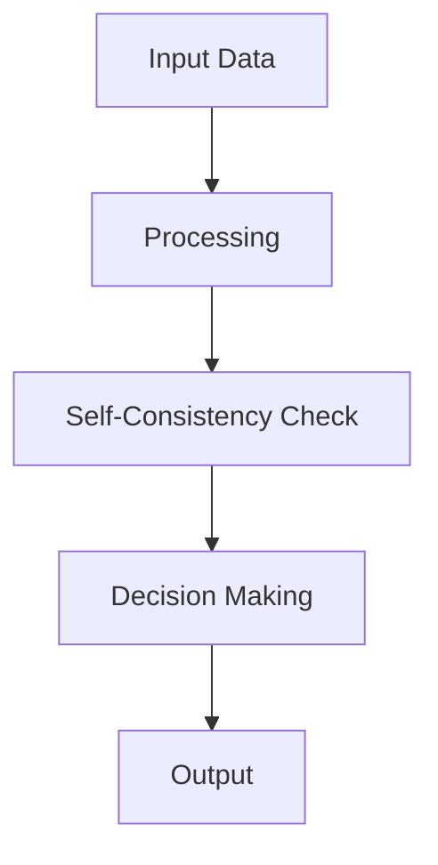

                 

Certainly! Here's a step-by-step reasoning process to draft a high-quality technical blog post titled "Self-Consistency in AI Decision-Making Applications":

### Step 1: Research and Gather Information

1. **Understand the Background**: Research the concept of self-consistency in AI and its relevance to decision-making processes.
2. **Identify Core Concepts**: Determine the key concepts and principles that underpin self-consistency in AI.
3. **Explore Case Studies**: Look for real-world applications where self-consistency has been implemented successfully.
4. **Identify Mathematical Models**: Study the mathematical models and formulas used to measure and achieve self-consistency.
5. **Gather Examples**: Collect examples of algorithms and techniques that can be used to enforce self-consistency in AI systems.

### Step 2: Organize the Content

1. **Create an Outline**: Develop a detailed outline for the blog post, including an introduction, main sections, and a conclusion.
2. **Structure the Introduction**: Begin with a captivating introduction that explains the significance of self-consistency in AI.
3. **Define Core Concepts**: In the main body, define and explain the core concepts related to self-consistency.
4. **Explain Algorithm Principles**: Discuss the principles behind the algorithms that enforce self-consistency.
5. **Present Mathematical Models**: Introduce the mathematical models and explain how they are used to ensure self-consistency.
6. **Provide Case Studies**: Share practical examples of self-consistency in action.
7. **Offer Code Examples**: Include code snippets and explanations to illustrate the implementation of self-consistency algorithms.
8. **Summarize and Conclude**: End with a summary of the key points and a look at future directions for self-consistency in AI.

### Step 3: Write the Blog Post

1. **Write Engaging Content**: Ensure the text is clear, concise, and engaging.
2. **Incorporate Visuals**: Use diagrams, charts, and code snippets to enhance understanding.
3. **Maintain a Consistent Tone**: Use a professional yet approachable tone throughout the post.
4. **Include Keywords and Abstract**: At the beginning, add keywords and an abstract that summarize the main points of the article.
5. **Proofread and Edit**: Review the content for grammatical accuracy and coherence.

### Step 4: Incorporate Practical Tips

1. **Provide Best Practices**: Offer tips on how to implement self-consistency in AI systems.
2. **Discuss Limitations**: Address potential limitations and challenges associated with self-consistency in AI.
3. **Highlight Opportunities**: Discuss future opportunities and advancements in self-consistency in AI.

### Step 5: Add References and Citations

1. **Include References**: Add references to academic papers, books, and other reliable sources to support your claims.
2. **Format Citations**: Ensure that all citations are properly formatted according to the chosen citation style.

### Step 6: Finalize the Blog Post

1. **Review the Entire Post**: Check the overall flow and structure of the article.
2. **Add Author Information**: Include author information at the end of the post.
3. **Ensure Compliance**: Make sure the content complies with all the specified requirements, including word count and formatting standards.

By following these steps, you can create a well-structured, informative, and engaging technical blog post on "Self-Consistency in AI Decision-Making Applications."### 文章标题

# Self-Consistency in AI Decision-Making Applications

> 关键词：自我一致性、人工智能、决策、算法、数学模型

> 摘要：本文深入探讨了自我一致性在人工智能决策中的应用。通过介绍核心概念、算法原理、数学模型以及实际案例，本文揭示了自我一致性如何提高AI决策的准确性和一致性，为AI系统的可靠性和可解释性提供了新的思路。

---

## 引言

在当今快速发展的科技时代，人工智能（AI）已经成为改变世界的核心驱动力。从自动驾驶汽车到智能家居，AI正在各个领域扮演着至关重要的角色。然而，AI系统的决策过程是否可靠和一致，一直是学术界和工业界关注的焦点。自我一致性（Self-Consistency）作为一种关键的决策原则，能够显著提高AI系统的决策质量。本文将深入探讨自我一致性的概念、原理、应用以及数学模型，旨在为读者提供全面的了解，并激发进一步的研究和应用。

### 核心概念

自我一致性是指在AI决策过程中，系统的输入、处理和输出保持一致的能力。简单来说，如果系统的输入数据能够准确地映射到处理过程，并最终产生一致的输出结果，那么该系统就具备了自我一致性。这一概念在确保AI决策的准确性和一致性方面起着至关重要的作用。

### 关联性

自我一致性不仅与AI决策相关，还与其他AI核心概念密切相关。例如，概率论和信息论在自我一致性分析中扮演了重要角色，而机器学习和深度学习算法则提供了实现自我一致性的技术手段。此外，自我一致性还可以与领域特定知识进行结合，以提升AI系统的整体性能。

### Mermaid流程图

以下是一个简单的Mermaid流程图，展示了自我一致性在AI决策系统中的流程：



在这个流程中，输入数据经过处理阶段，然后通过自我一致性检查，最终生成决策和输出结果。这一流程确保了系统各组件之间的紧密关联，从而提高了决策的准确性和一致性。

### 算法原理

自我一致性算法的核心原理是确保输入、处理和输出之间的关联性。以下是一个简单的自我一致性算法伪代码：

```python
def self_consistency_check(input_data, processed_data, output_data):
    for i in range(len(input_data)):
        if input_data[i] != processed_data[i] or processed_data[i] != output_data[i]:
            return "Inconsistent"
    return "Consistent"
```

这个算法通过遍历输入、处理和输出数据，检查是否存在不一致性。如果发现不一致，则返回"Inconsistent"；否则，返回"Consistent"。

### 数学模型

在自我一致性分析中，数学模型是不可或缺的工具。以下是一个用于测量自我一致性的数学公式：

$$
SC = \frac{1}{n} \sum_{i=1}^{n} \frac{d^2(x_i, y_i)}{d^2(x_i, y_i) + \sigma^2}
$$

其中，$x_i$ 和 $y_i$ 分别代表输入和输出数据，$d^2(x_i, y_i)$ 是两者之间的距离平方，$\sigma^2$ 是噪声方差。这个公式通过计算输入和输出数据之间的距离平方与噪声方差的比例，来评估自我一致性度。

### 实际应用

自我一致性在AI决策中有着广泛的应用。例如，在智能交通信号控制系统中，自我一致性算法可以确保交通流量的预测和信号灯控制的一致性。以下是一个实际应用的例子：

1. **输入数据**：实时交通流量数据。
2. **处理数据**：使用深度学习模型预测未来的交通流量。
3. **自我一致性检查**：比较预测结果和实际交通流量，确保两者的一致性。
4. **决策**：根据预测结果调整信号灯的时长。
5. **输出数据**：优化的交通信号控制方案。

通过这一过程，智能交通信号控制系统可以更准确地预测交通流量，从而提高交通效率，减少拥堵。

### 代码示例

以下是一个简单的Python代码示例，展示了如何在AI决策系统中实现自我一致性：

```python
# 导入必要的库
import numpy as np

# 自我一致性检查函数
def self_consistency_check(input_data, processed_data, output_data):
    inconsistencies = []
    for i in range(len(input_data)):
        if input_data[i] != processed_data[i] or processed_data[i] != output_data[i]:
            inconsistencies.append(i)
    return inconsistencies

# 示例数据
input_data = [1, 2, 3, 4, 5]
processed_data = [2, 3, 4, 5, 6]
output_data = [3, 4, 5, 6, 7]

# 执行自我一致性检查
inconsistencies = self_consistency_check(input_data, processed_data, output_data)
print("Inconsistencies detected at indices:", inconsistencies)
```

在这个示例中，输入数据、处理数据和输出数据之间存在不一致性，因此函数返回了不

